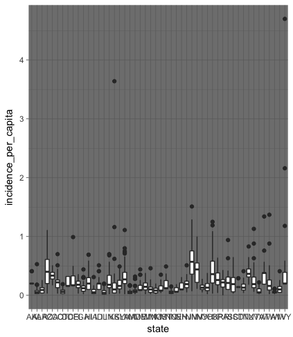
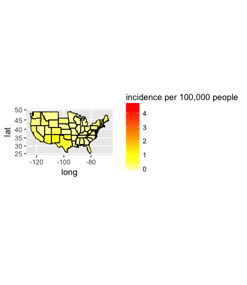

# Introduction


Hepatitis A (formerly known as infectious hepatitis) is an infectious disease of the liver caused by the hepatitis A virus (HAV).

# Application Concept

This shiny application allows the user to have an accurate overview on the incidence rate (per 100,000 people) of hepatits A virus infection in the USA per year.


There is one single widget within this application that outputs an extensive analysis on the disease incidence upon North American population from 1966 to 2011.


The application computes and gives back the information in three different ways:


- A boxplot graph that shows the distribution of the Hepatitis A incidence per state upon the  year chosen.


- A geographical map of the US that visualizes the incidence of the hepatic disease throughout the country.


- A data table with the specific data that corresponds to the selected year.


---
## Code sample

```{r,}
hep <- read.csv("CopyOfhepatitis.csv")
splitteddata <- t(sapply(hep$week,function(x) substring(x, first=c(1,5), last=c(4,6))))
hepatitis <- cbind(hep, splitteddata)
hepatitis <- subset(hepatitis, select=c("1","state","state_name","cases", "incidence_per_capita"))
print(hepatitis)


```

---
## Graphic outputs




---
## Graphic outputs



