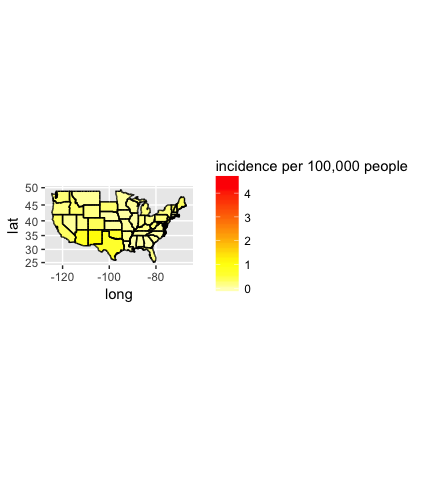

# Introduction


Hepatitis A (formerly known as infectious hepatitis) is an infectious disease of the liver caused by the hepatitis A virus (HAV).

# Application Concept

This shiny application allows the user to have an accurate overview on the incidence rate (per 100,000 people) of hepatits A virus infection in the USA per year.


There is one single widget within this application that outputs an extensive analysis on the disease incidence upon North American population from 1966 to 2011.


The application computes and gives back the information in three different ways:


- A boxplot graph that shows the distribution of the Hepatitis A incidence per state upon the  year chosen.


- A geographical map of the US that visualizes the incidence of the hepatic disease throughout the country.


- A data table with the specific data that corresponds to the selected year.


---
## Code sample


```r
hep <- read.csv("CopyOfhepatitis.csv")
splitteddata <- t(sapply(hep$week,function(x) substring(x, first=c(1,5), last=c(4,6))))
hepatitis <- cbind(hep, splitteddata)
hepatitis <- subset(hepatitis, select=c("1","state","state_name","cases", "incidence_per_capita"))
print(hepatitis)
```

```
##          1 state           state_name cases incidence_per_capita
## 1     1966    AL              ALABAMA     5                 0.14
## 2     1966    AR             ARKANSAS    11                 0.58
## 3     1966    AZ              ARIZONA     6                 0.37
## 4     1966    CA           CALIFORNIA    89                 0.47
## 5     1966    CO             COLORADO     1                 0.05
## 6     1966    CT          CONNECTICUT     9                 0.31
## 7     1966    DE             DELAWARE     3                 0.58
## 8     1966    FL              FLORIDA     7                 0.11
## 9     1966    GA              GEORGIA     4                 0.09
## 10    1966    HI               HAWAII     3                 0.42
## 11    1966    IA                 IOWA    12                 0.43
## 12    1966    ID                IDAHO     2                 0.29
## 13    1966    IL             ILLINOIS     6                 0.06
## 14    1966    IN              INDIANA     2                 0.04
## 15    1966    KS               KANSAS     6                 0.27
## 16    1966    KY             KENTUCKY    26                 0.83
## 17    1966    LA            LOUISIANA     1                 0.03
## 18    1966    MA        MASSACHUSETTS    10                 0.18
## 19    1966    MD             MARYLAND     9                 0.24
## 20    1966    ME                MAINE     6                 0.60
## 21    1966    MI             MICHIGAN    84                 0.99
## 22    1966    MN            MINNESOTA     3                 0.08
## 23    1966    MO             MISSOURI     5                 0.11
## 24    1966    MS          MISSISSIPPI     1                 0.04
## 25    1966    MT              MONTANA     2                 0.28
## 26    1966    NC       NORTH CAROLINA     8                 0.16
## 27    1966    ND         NORTH DAKOTA     1                 0.15
## 28    1966    NH        NEW HAMPSHIRE     3                 0.44
## 29    1966    NJ           NEW JERSEY    21                 0.31
## 30    1966    NM           NEW MEXICO    13                 1.29
## 31    1966    NV               NEVADA     3                 0.67
## 32    1966    OH                 OHIO    40                 0.39
## 33    1966    OR               OREGON    14                 0.71
## 34    1966    PA         PENNSYLVANIA    26                 0.22
## 35    1966    RI         RHODE ISLAND     6                 0.67
## 36    1966    SC       SOUTH CAROLINA     4                 0.16
## 37    1966    TN            TENNESSEE    93                 2.43
## 38    1966    TX                TEXAS    62                 0.59
## 39    1966    UT                 UTAH     1                 0.10
## 40    1966    VA             VIRGINIA    11                 0.25
## 41    1966    WA           WASHINGTON     5                 0.16
## 42    1966    WI            WISCONSIN    15                 0.35
## 43    1966    WV        WEST VIRGINIA     1                 0.06
## 44    1966    WY              WYOMING     1                 0.31
## 45    1966    AK               ALASKA     6                 2.21
## 46    1966    AL              ALABAMA     3                 0.09
## 47    1966    AR             ARKANSAS     6                 0.32
## 48    1966    AZ              ARIZONA    25                 1.55
## 49    1966    CA           CALIFORNIA   122                 0.65
## 50    1966    CO             COLORADO     3                 0.15
## 51    1966    CT          CONNECTICUT     8                 0.28
## 52    1966    DE             DELAWARE     3                 0.58
## 53    1966    FL              FLORIDA    11                 0.18
## 54    1966    HI               HAWAII     1                 0.14
## 55    1966    IA                 IOWA     5                 0.18
## 56    1966    ID                IDAHO     2                 0.29
## 57    1966    IL             ILLINOIS    28                 0.26
## 58    1966    IN              INDIANA     8                 0.16
## 59    1966    KS               KANSAS     4                 0.18
## 60    1966    KY             KENTUCKY    23                 0.73
## 61    1966    LA            LOUISIANA     8                 0.23
## 62    1966    MA        MASSACHUSETTS    10                 0.18
## 63    1966    MD             MARYLAND    10                 0.27
## 64    1966    ME                MAINE    17                 1.70
## 65    1966    MI             MICHIGAN    47                 0.55
## 66    1966    MN            MINNESOTA     3                 0.08
## 67    1966    MO             MISSOURI     5                 0.11
## 68    1966    MS          MISSISSIPPI     9                 0.40
## 69    1966    NC       NORTH CAROLINA    14                 0.29
## 70    1966    ND         NORTH DAKOTA     1                 0.15
## 71    1966    NH        NEW HAMPSHIRE     1                 0.15
## 72    1966    NJ           NEW JERSEY    25                 0.36
## 73    1966    NM           NEW MEXICO    15                 1.49
## 74    1966    NV               NEVADA     4                 0.90
## 75    1966    NY             NEW YORK    74                 0.41
## 76    1966    OH                 OHIO    25                 0.24
## 77    1966    OR               OREGON    19                 0.96
## 78    1966    PA         PENNSYLVANIA    38                 0.33
## 79    1966    SC       SOUTH CAROLINA     2                 0.08
## 80    1966    TN            TENNESSEE    32                 0.84
## 81    1966    TX                TEXAS    40                 0.38
## 82    1966    UT                 UTAH     4                 0.40
## 83    1966    VA             VIRGINIA    12                 0.27
## 84    1966    WA           WASHINGTON     9                 0.29
## 85    1966    WI            WISCONSIN     9                 0.21
## 86    1966    WV        WEST VIRGINIA     4                 0.23
## 87    1966    AL              ALABAMA     2                 0.06
## 88    1966    AR             ARKANSAS     2                 0.11
## 89    1966    AZ              ARIZONA     9                 0.56
## 90    1966    CA           CALIFORNIA    98                 0.52
## 91    1966    CT          CONNECTICUT     5                 0.17
## 92    1966    DE             DELAWARE     2                 0.39
## 93    1966    FL              FLORIDA    18                 0.29
## 94    1966    HI               HAWAII     2                 0.28
## 95    1966    IA                 IOWA     4                 0.14
## 96    1966    IL             ILLINOIS    24                 0.22
## 97    1966    IN              INDIANA    10                 0.20
## 98    1966    KS               KANSAS     8                 0.36
## 99    1966    KY             KENTUCKY    17                 0.54
## 100   1966    LA            LOUISIANA    10                 0.28
## 101   1966    MA        MASSACHUSETTS    17                 0.31
## 102   1966    MD             MARYLAND     6                 0.16
## 103   1966    ME                MAINE    14                 1.40
## 104   1966    MI             MICHIGAN    71                 0.83
## 105   1966    MN            MINNESOTA     2                 0.06
## 106   1966    MO             MISSOURI     5                 0.11
## 107   1966    MS          MISSISSIPPI     4                 0.18
## 108   1966    MT              MONTANA     2                 0.28
## 109   1966    NC       NORTH CAROLINA    13                 0.27
## 110   1966    NE             NEBRASKA     4                 0.27
## 111   1966    NJ           NEW JERSEY    10                 0.15
## 112   1966    NM           NEW MEXICO    13                 1.29
## 113   1966    NV               NEVADA     1                 0.22
## 114   1966    NY             NEW YORK    47                 0.26
## 115   1966    OH                 OHIO    23                 0.22
## 116   1966    OK             OKLAHOMA     1                 0.04
## 117   1966    OR               OREGON    14                 0.71
## 118   1966    PA         PENNSYLVANIA    39                 0.33
## 119   1966    RI         RHODE ISLAND     1                 0.11
## 120   1966    SC       SOUTH CAROLINA     1                 0.04
## 121   1966    TN            TENNESSEE    39                 1.02
## 122   1966    TX                TEXAS    51                 0.49
## 123   1966    UT                 UTAH     6                 0.59
## 124   1966    VA             VIRGINIA    14                 0.31
## 125   1966    WA           WASHINGTON     9                 0.29
## 126   1966    WI            WISCONSIN    10                 0.23
## 127   1966    WV        WEST VIRGINIA     3                 0.17
## 128   1966    WY              WYOMING     1                 0.31
## 129   1966    AK               ALASKA     1                 0.37
## 130   1966    AL              ALABAMA     4                 0.12
## 131   1966    AR             ARKANSAS     9                 0.47
## 132   1966    AZ              ARIZONA    18                 1.12
## 133   1966    CA           CALIFORNIA   132                 0.70
## 134   1966    CO             COLORADO     5                 0.25
## 135   1966    CT          CONNECTICUT     4                 0.14
## 136   1966    DE             DELAWARE     1                 0.19
## 137   1966    FL              FLORIDA    11                 0.18
## 138   1966    GA              GEORGIA     2                 0.05
## 139   1966    IA                 IOWA     2                 0.07
## 140   1966    ID                IDAHO     1                 0.15
## 141   1966    IL             ILLINOIS    33                 0.30
## 142   1966    IN              INDIANA    19                 0.38
## 143   1966    KS               KANSAS     3                 0.14
## 144   1966    KY             KENTUCKY    18                 0.57
## 145   1966    LA            LOUISIANA     5                 0.14
## 146   1966    MA        MASSACHUSETTS    18                 0.33
## 147   1966    MD             MARYLAND     8                 0.22
## 148   1966    ME                MAINE     7                 0.70
## 149   1966    MI             MICHIGAN    71                 0.83
## 150   1966    MN            MINNESOTA    11                 0.30
## 151   1966    MO             MISSOURI     6                 0.13
## 152   1966    MS          MISSISSIPPI    11                 0.49
## 153   1966    NC       NORTH CAROLINA    11                 0.22
## 154   1966    ND         NORTH DAKOTA     1                 0.15
## 155   1966    NH        NEW HAMPSHIRE     2                 0.29
## 156   1966    NJ           NEW JERSEY    18                 0.26
## 157   1966    NM           NEW MEXICO    21                 2.09
## 158   1966    NY             NEW YORK    71                 0.40
## 159   1966    OH                 OHIO    29                 0.28
## 160   1966    OR               OREGON    21                 1.07
## 161   1966    PA         PENNSYLVANIA    66                 0.57
## 162   1966    RI         RHODE ISLAND     4                 0.44
## 163   1966    SC       SOUTH CAROLINA     3                 0.12
## 164   1966    SD         SOUTH DAKOTA     1                 0.15
## 165   1966    TN            TENNESSEE    26                 0.68
## 166   1966    TX                TEXAS    41                 0.39
## 167   1966    UT                 UTAH    19                 1.88
## 168   1966    VA             VIRGINIA    10                 0.22
## 169   1966    WA           WASHINGTON     6                 0.20
## 170   1966    WI            WISCONSIN     3                 0.07
## 171   1966    WV        WEST VIRGINIA     9                 0.51
## 172   1966    WY              WYOMING     2                 0.62
## 173   1966    AK               ALASKA     1                 0.37
## 174   1966    AL              ALABAMA     7                 0.20
## 175   1966    AR             ARKANSAS     9                 0.47
## 176   1966    AZ              ARIZONA    12                 0.74
## 177   1966    CA           CALIFORNIA   130                 0.69
## 178   1966    CO             COLORADO     7                 0.35
## 179   1966    CT          CONNECTICUT     1                 0.03
## 180   1966    DE             DELAWARE     2                 0.39
## 181   1966    FL              FLORIDA    18                 0.29
## 182   1966    IA                 IOWA    21                 0.76
## 183   1966    ID                IDAHO     5                 0.73
## 184   1966    IL             ILLINOIS    30                 0.28
## 185   1966    IN              INDIANA    15                 0.30
## 186   1966    KS               KANSAS     9                 0.41
## 187   1966    KY             KENTUCKY    44                 1.40
## 188   1966    LA            LOUISIANA     9                 0.25
## 189   1966    MA        MASSACHUSETTS    13                 0.23
## 190   1966    MD             MARYLAND     7                 0.19
## 191   1966    ME                MAINE     4                 0.40
## 192   1966    MI             MICHIGAN    50                 0.59
## 193   1966    MN            MINNESOTA    13                 0.36
## 194   1966    MO             MISSOURI     5                 0.11
## 195   1966    MS          MISSISSIPPI    10                 0.45
## 196   1966    MT              MONTANA     1                 0.14
## 197   1966    NC       NORTH CAROLINA     9                 0.18
## 198   1966    ND         NORTH DAKOTA     2                 0.31
## 199   1966    NJ           NEW JERSEY    15                 0.22
## 200   1966    NM           NEW MEXICO    23                 2.28
## 201   1966    NV               NEVADA     2                 0.45
## 202   1966    NY             NEW YORK    44                 0.25
## 203   1966    OH                 OHIO    45                 0.44
## 204   1966    OK             OKLAHOMA     1                 0.04
## 205   1966    OR               OREGON    24                 1.22
## 206   1966    PA         PENNSYLVANIA    30                 0.26
## 207   1966    RI         RHODE ISLAND     1                 0.11
## 208   1966    SC       SOUTH CAROLINA     2                 0.08
## 209   1966    TN            TENNESSEE    19                 0.50
## 210   1966    TX                TEXAS    39                 0.37
## 211   1966    UT                 UTAH     1                 0.10
## 212   1966    VA             VIRGINIA    29                 0.65
## 213   1966    VT              VERMONT     1                 0.24
## 214   1966    WA           WASHINGTON    13                 0.43
## 215   1966    WI            WISCONSIN     5                 0.12
## 216   1966    WV        WEST VIRGINIA     4                 0.23
## 217   1966    AK               ALASKA     1                 0.37
## 218   1966    AL              ALABAMA     4                 0.12
## 219   1966    AR             ARKANSAS     8                 0.42
## 220   1966    AZ              ARIZONA     9                 0.56
## 221   1966    CA           CALIFORNIA   143                 0.76
## 222   1966    CO             COLORADO    15                 0.75
## 223   1966    CT          CONNECTICUT     1                 0.03
## 224   1966    DC DISTRICT OF COLUMBIA     1                 0.13
## 225   1966    DE             DELAWARE     1                 0.19
## 226   1966    FL              FLORIDA    12                 0.20
## 227   1966    IA                 IOWA     4                 0.14
## 228   1966    IL             ILLINOIS    24                 0.22
## 229   1966    IN              INDIANA    14                 0.28
## 230   1966    KS               KANSAS     9                 0.41
## 231   1966    KY             KENTUCKY    26                 0.83
## 232   1966    LA            LOUISIANA     6                 0.17
## 233   1966    MA        MASSACHUSETTS     8                 0.14
## 234   1966    MD             MARYLAND    16                 0.43
## 235   1966    ME                MAINE    10                 1.00
## 236   1966    MI             MICHIGAN    46                 0.54
## 237   1966    MN            MINNESOTA     9                 0.25
## 238   1966    MO             MISSOURI     6                 0.13
## 239   1966    MS          MISSISSIPPI     9                 0.40
## 240   1966    MT              MONTANA     3                 0.42
## 241   1966    NC       NORTH CAROLINA    13                 0.27
## 242   1966    ND         NORTH DAKOTA     1                 0.15
## 243   1966    NH        NEW HAMPSHIRE     3                 0.44
## 244   1966    NJ           NEW JERSEY    14                 0.20
## 245   1966    NM           NEW MEXICO    13                 1.29
## 246   1966    NY             NEW YORK    46                 0.26
## 247   1966    OH                 OHIO    30                 0.29
## 248   1966    OK             OKLAHOMA     4                 0.16
## 249   1966    OR               OREGON    29                 1.47
## 250   1966    PA         PENNSYLVANIA    44                 0.38
## 251   1966    RI         RHODE ISLAND     8                 0.89
## 252   1966    SC       SOUTH CAROLINA     1                 0.04
## 253   1966    TN            TENNESSEE    27                 0.71
## 254   1966    TX                TEXAS    46                 0.44
## 255   1966    UT                 UTAH     4                 0.40
## 256   1966    VA             VIRGINIA     9                 0.20
## 257   1966    WA           WASHINGTON    18                 0.59
## 258   1966    WI            WISCONSIN     7                 0.16
## 259   1966    WV        WEST VIRGINIA     6                 0.34
## 260   1966    WY              WYOMING     2                 0.62
## 261   1966    AK               ALASKA     3                 1.11
## 262   1966    AR             ARKANSAS     6                 0.32
## 263   1966    AZ              ARIZONA     8                 0.50
## 264   1966    CA           CALIFORNIA   149                 0.79
## 265   1966    CO             COLORADO     8                 0.40
## 266   1966    CT          CONNECTICUT     4                 0.14
## 267   1966    DE             DELAWARE     2                 0.39
## 268   1966    FL              FLORIDA    11                 0.18
## 269   1966    GA              GEORGIA     3                 0.07
## 270   1966    HI               HAWAII     2                 0.28
## 271   1966    IA                 IOWA     4                 0.14
## 272   1966    ID                IDAHO     5                 0.73
## 273   1966    IL             ILLINOIS    18                 0.17
## 274   1966    IN              INDIANA    10                 0.20
## 275   1966    KS               KANSAS     3                 0.14
## 276   1966    KY             KENTUCKY    20                 0.64
## 277   1966    LA            LOUISIANA     9                 0.25
## 278   1966    MA        MASSACHUSETTS     6                 0.11
## 279   1966    MD             MARYLAND    20                 0.54
## 280   1966    ME                MAINE     6                 0.60
## 281   1966    MI             MICHIGAN    81                 0.95
## 282   1966    MN            MINNESOTA     4                 0.11
## 283   1966    MO             MISSOURI    29                 0.64
## 284   1966    MS          MISSISSIPPI     8                 0.36
## 285   1966    NC       NORTH CAROLINA     7                 0.14
## 286   1966    NH        NEW HAMPSHIRE     3                 0.44
## 287   1966    NJ           NEW JERSEY    12                 0.18
## 288   1966    NM           NEW MEXICO    20                 1.99
## 289   1966    NY             NEW YORK    57                 0.32
## 290   1966    OH                 OHIO    27                 0.26
## 291   1966    OR               OREGON     9                 0.46
## 292   1966    PA         PENNSYLVANIA    36                 0.31
## 293   1966    SC       SOUTH CAROLINA     4                 0.16
## 294   1966    SD         SOUTH DAKOTA     2                 0.29
## 295   1966    TN            TENNESSEE    23                 0.60
## 296   1966    TX                TEXAS    36                 0.34
## 297   1966    UT                 UTAH     7                 0.69
## 298   1966    VA             VIRGINIA    15                 0.34
## 299   1966    VT              VERMONT     2                 0.48
## 300   1966    WA           WASHINGTON    10                 0.33
## 301   1966    WI            WISCONSIN    11                 0.26
## 302   1966    WV        WEST VIRGINIA    15                 0.85
## 303   1966    WY              WYOMING     3                 0.93
## 304   1966    AL              ALABAMA    16                 0.46
## 305   1966    AR             ARKANSAS     7                 0.37
## 306   1966    AZ              ARIZONA    12                 0.74
## 307   1966    CA           CALIFORNIA   101                 0.54
## 308   1966    CO             COLORADO    11                 0.55
## 309   1966    CT          CONNECTICUT     9                 0.31
## 310   1966    DE             DELAWARE     1                 0.19
## 311   1966    FL              FLORIDA    19                 0.31
## 312   1966    GA              GEORGIA     5                 0.11
## 313   1966    IA                 IOWA     6                 0.22
## 314   1966    ID                IDAHO     3                 0.44
## 315   1966    IL             ILLINOIS    17                 0.16
## 316   1966    IN              INDIANA    10                 0.20
## 317   1966    KS               KANSAS     4                 0.18
## 318   1966    KY             KENTUCKY    81                 2.57
## 319   1966    LA            LOUISIANA     6                 0.17
## 320   1966    MA        MASSACHUSETTS     6                 0.11
## 321   1966    MD             MARYLAND     9                 0.24
## 322   1966    ME                MAINE     8                 0.80
## 323   1966    MI             MICHIGAN    64                 0.75
## 324   1966    MN            MINNESOTA    15                 0.41
## 325   1966    MO             MISSOURI    66                 1.46
## 326   1966    MS          MISSISSIPPI     3                 0.13
## 327   1966    NC       NORTH CAROLINA     8                 0.16
## 328   1966    NH        NEW HAMPSHIRE     1                 0.15
## 329   1966    NJ           NEW JERSEY     6                 0.09
## 330   1966    NM           NEW MEXICO    15                 1.49
## 331   1966    NY             NEW YORK    39                 0.22
## 332   1966    OH                 OHIO    43                 0.42
## 333   1966    OK             OKLAHOMA     1                 0.04
## 334   1966    OR               OREGON    14                 0.71
## 335   1966    PA         PENNSYLVANIA    54                 0.46
## 336   1966    SD         SOUTH DAKOTA     1                 0.15
## 337   1966    TN            TENNESSEE    19                 0.50
## 338   1966    TX                TEXAS    36                 0.34
## 339   1966    UT                 UTAH     5                 0.50
## 340   1966    VA             VIRGINIA    16                 0.36
## 341   1966    WA           WASHINGTON    11                 0.36
## 342   1966    WI            WISCONSIN    10                 0.23
## 343   1966    WV        WEST VIRGINIA     6                 0.34
## 344   1966    AK               ALASKA     2                 0.74
## 345   1966    AL              ALABAMA     3                 0.09
## 346   1966    AR             ARKANSAS     8                 0.42
## 347   1966    AZ              ARIZONA     6                 0.37
## 348   1966    CA           CALIFORNIA   101                 0.54
## 349   1966    CO             COLORADO     8                 0.40
## 350   1966    CT          CONNECTICUT     1                 0.03
## 351   1966    FL              FLORIDA    22                 0.36
## 352   1966    GA              GEORGIA     3                 0.07
## 353   1966    IA                 IOWA    15                 0.54
## 354   1966    ID                IDAHO     1                 0.15
## 355   1966    IL             ILLINOIS    47                 0.43
## 356   1966    IN              INDIANA     7                 0.14
## 357   1966    KS               KANSAS     1                 0.05
## 358   1966    KY             KENTUCKY    47                 1.49
## 359   1966    LA            LOUISIANA    11                 0.31
## 360   1966    MA        MASSACHUSETTS     8                 0.14
## 361   1966    MD             MARYLAND    18                 0.49
## 362   1966    ME                MAINE     9                 0.90
## 363   1966    MI             MICHIGAN   115                 1.35
## 364   1966    MN            MINNESOTA     5                 0.14
## 365   1966    MO             MISSOURI    16                 0.35
## 366   1966    MS          MISSISSIPPI     6                 0.27
## 367   1966    MT              MONTANA     4                 0.57
## 368   1966    NC       NORTH CAROLINA    11                 0.22
## 369   1966    NH        NEW HAMPSHIRE     3                 0.44
## 370   1966    NJ           NEW JERSEY    19                 0.28
## 371   1966    NM           NEW MEXICO     7                 0.70
## 372   1966    NY             NEW YORK    50                 0.28
## 373   1966    OH                 OHIO    36                 0.35
## 374   1966    OR               OREGON    10                 0.51
## 375   1966    PA         PENNSYLVANIA    50                 0.43
## 376   1966    RI         RHODE ISLAND     2                 0.22
## 377   1966    SC       SOUTH CAROLINA     2                 0.08
## 378   1966    TN            TENNESSEE    28                 0.73
## 379   1966    TX                TEXAS    51                 0.49
## 380   1966    UT                 UTAH     2                 0.20
## 381   1966    VA             VIRGINIA    22                 0.49
## 382   1966    VT              VERMONT     2                 0.48
## 383   1966    WA           WASHINGTON     5                 0.16
## 384   1966    WI            WISCONSIN     8                 0.19
## 385   1966    WV        WEST VIRGINIA     6                 0.34
## 386   1966    WY              WYOMING     4                 1.24
## 387   1966    AK               ALASKA    11                 4.06
## 388   1966    AL              ALABAMA    14                 0.40
## 389   1966    AR             ARKANSAS     9                 0.47
## 390   1966    AZ              ARIZONA     7                 0.43
## 391   1966    CA           CALIFORNIA   106                 0.56
## 392   1966    CO             COLORADO    14                 0.70
## 393   1966    CT          CONNECTICUT     3                 0.10
## 394   1966    DC DISTRICT OF COLUMBIA     1                 0.13
## 395   1966    FL              FLORIDA    20                 0.33
## 396   1966    GA              GEORGIA     3                 0.07
## 397   1966    HI               HAWAII     1                 0.14
## 398   1966    IA                 IOWA    10                 0.36
## 399   1966    ID                IDAHO     4                 0.58
## 400   1966    IL             ILLINOIS    22                 0.20
## 401   1966    IN              INDIANA    12                 0.24
## 402   1966    KS               KANSAS     4                 0.18
## 403   1966    KY             KENTUCKY    32                 1.02
## 404   1966    LA            LOUISIANA     7                 0.20
## 405   1966    MA        MASSACHUSETTS    10                 0.18
## 406   1966    MD             MARYLAND    23                 0.62
## 407   1966    ME                MAINE     3                 0.30
## 408   1966    MI             MICHIGAN    80                 0.94
## 409   1966    MN            MINNESOTA     9                 0.25
## 410   1966    MO             MISSOURI    13                 0.29
## 411   1966    MS          MISSISSIPPI     5                 0.22
## 412   1966    NC       NORTH CAROLINA     8                 0.16
## 413   1966    NE             NEBRASKA     1                 0.07
## 414   1966    NH        NEW HAMPSHIRE     4                 0.59
## 415   1966    NJ           NEW JERSEY    24                 0.35
## 416   1966    NM           NEW MEXICO     9                 0.89
## 417   1966    OH                 OHIO    45                 0.44
## 418   1966    OR               OREGON     5                 0.25
## 419   1966    PA         PENNSYLVANIA    35                 0.30
## 420   1966    SC       SOUTH CAROLINA     4                 0.16
## 421   1966    TN            TENNESSEE    28                 0.73
## 422   1966    TX                TEXAS    42                 0.40
## 423   1966    UT                 UTAH     2                 0.20
## 424   1966    VA             VIRGINIA    23                 0.52
## 425   1966    VT              VERMONT     3                 0.73
## 426   1966    WA           WASHINGTON    10                 0.33
## 427   1966    WI            WISCONSIN     7                 0.16
## 428   1966    WV        WEST VIRGINIA    11                 0.62
## 429   1966    WY              WYOMING     1                 0.31
## 430   1966    AK               ALASKA     1                 0.37
## 431   1966    AL              ALABAMA     7                 0.20
## 432   1966    AR             ARKANSAS     4                 0.21
## 433   1966    AZ              ARIZONA     2                 0.12
## 434   1966    CA           CALIFORNIA   112                 0.59
## 435   1966    CO             COLORADO     4                 0.20
## 436   1966    CT          CONNECTICUT     6                 0.21
## 437   1966    DE             DELAWARE     2                 0.39
## 438   1966    FL              FLORIDA    19                 0.31
## 439   1966    GA              GEORGIA    15                 0.34
## 440   1966    HI               HAWAII     2                 0.28
## 441   1966    IA                 IOWA    16                 0.58
## 442   1966    IL             ILLINOIS    17                 0.16
## 443   1966    IN              INDIANA     9                 0.18
## 444   1966    KS               KANSAS    13                 0.59
## 445   1966    KY             KENTUCKY    32                 1.02
## 446   1966    LA            LOUISIANA     6                 0.17
## 447   1966    MA        MASSACHUSETTS     2                 0.04
## 448   1966    MD             MARYLAND    17                 0.46
## 449   1966    ME                MAINE     1                 0.10
## 450   1966    MI             MICHIGAN    73                 0.86
## 451   1966    MN            MINNESOTA     8                 0.22
## 452   1966    MO             MISSOURI    45                 0.99
## 453   1966    MS          MISSISSIPPI     5                 0.22
## 454   1966    MT              MONTANA     1                 0.14
## 455   1966    NC       NORTH CAROLINA    10                 0.20
## 456   1966    ND         NORTH DAKOTA     1                 0.15
## 457   1966    NE             NEBRASKA     1                 0.07
## 458   1966    NH        NEW HAMPSHIRE     1                 0.15
## 459   1966    NJ           NEW JERSEY    16                 0.23
## 460   1966    NM           NEW MEXICO     8                 0.79
## 461   1966    NY             NEW YORK    62                 0.35
## 462   1966    OH                 OHIO    38                 0.37
## 463   1966    OK             OKLAHOMA     3                 0.12
## 464   1966    OR               OREGON    12                 0.61
## 465   1966    PA         PENNSYLVANIA    34                 0.29
## 466   1966    RI         RHODE ISLAND     3                 0.33
## 467   1966    SC       SOUTH CAROLINA     1                 0.04
## 468   1966    TN            TENNESSEE    14                 0.37
## 469   1966    TX                TEXAS    43                 0.41
## 470   1966    UT                 UTAH     1                 0.10
## 471   1966    VA             VIRGINIA    25                 0.56
## 472   1966    WA           WASHINGTON    20                 0.65
## 473   1966    WI            WISCONSIN    11                 0.26
## 474   1966    WV        WEST VIRGINIA     2                 0.11
## 475   1966    AL              ALABAMA     8                 0.23
## 476   1966    AR             ARKANSAS    12                 0.63
## 477   1966    AZ              ARIZONA    12                 0.74
## 478   1966    CA           CALIFORNIA    93                 0.49
## 479   1966    CO             COLORADO     4                 0.20
## 480   1966    CT          CONNECTICUT     2                 0.07
## 481   1966    DC DISTRICT OF COLUMBIA     2                 0.25
## 482   1966    DE             DELAWARE     1                 0.19
## 483   1966    FL              FLORIDA    17                 0.28
## 484   1966    GA              GEORGIA     2                 0.05
## 485   1966    HI               HAWAII     1                 0.14
## 486   1966    IA                 IOWA    20                 0.72
## 487   1966    IL             ILLINOIS    41                 0.38
## 488   1966    IN              INDIANA     9                 0.18
## 489   1966    KS               KANSAS     8                 0.36
## 490   1966    KY             KENTUCKY    36                 1.14
## 491   1966    LA            LOUISIANA    11                 0.31
## 492   1966    MA        MASSACHUSETTS    10                 0.18
## 493   1966    MD             MARYLAND    19                 0.51
## 494   1966    ME                MAINE     2                 0.20
## 495   1966    MI             MICHIGAN    57                 0.67
## 496   1966    MN            MINNESOTA     7                 0.19
## 497   1966    MO             MISSOURI    12                 0.27
## 498   1966    MS          MISSISSIPPI     5                 0.22
## 499   1966    MT              MONTANA     2                 0.28
## 500   1966    NC       NORTH CAROLINA    13                 0.27
## 501   1966    NJ           NEW JERSEY    12                 0.18
## 502   1966    NM           NEW MEXICO     1                 0.10
## 503   1966    NY             NEW YORK    58                 0.33
## 504   1966    OH                 OHIO    32                 0.31
## 505   1966    OK             OKLAHOMA     7                 0.29
## 506   1966    OR               OREGON    46                 2.34
## 507   1966    PA         PENNSYLVANIA    33                 0.28
## 508   1966    RI         RHODE ISLAND     2                 0.22
## 509   1966    SC       SOUTH CAROLINA     1                 0.04
## 510   1966    TN            TENNESSEE    28                 0.73
## 511   1966    TX                TEXAS    35                 0.33
## 512   1966    UT                 UTAH     3                 0.30
## 513   1966    VA             VIRGINIA     6                 0.13
## 514   1966    VT              VERMONT     1                 0.24
## 515   1966    WA           WASHINGTON     5                 0.16
## 516   1966    WI            WISCONSIN     2                 0.05
## 517   1966    WV        WEST VIRGINIA     7                 0.39
## 518   1966    AK               ALASKA     3                 1.11
## 519   1966    AL              ALABAMA     6                 0.17
## 520   1966    AR             ARKANSAS    16                 0.84
## 521   1966    AZ              ARIZONA     5                 0.31
## 522   1966    CA           CALIFORNIA   102                 0.54
## 523   1966    CO             COLORADO     4                 0.20
## 524   1966    CT          CONNECTICUT     7                 0.24
## 525   1966    DE             DELAWARE     3                 0.58
## 526   1966    FL              FLORIDA    22                 0.36
## 527   1966    GA              GEORGIA    10                 0.23
## 528   1966    HI               HAWAII     3                 0.42
## 529   1966    IA                 IOWA     6                 0.22
## 530   1966    ID                IDAHO     3                 0.44
## 531   1966    IL             ILLINOIS    14                 0.13
## 532   1966    IN              INDIANA    19                 0.38
## 533   1966    KS               KANSAS     4                 0.18
## 534   1966    KY             KENTUCKY    22                 0.70
## 535   1966    LA            LOUISIANA    11                 0.31
## 536   1966    MA        MASSACHUSETTS    12                 0.22
## 537   1966    MD             MARYLAND    17                 0.46
## 538   1966    ME                MAINE     4                 0.40
## 539   1966    MI             MICHIGAN    64                 0.75
## 540   1966    MN            MINNESOTA     6                 0.17
## 541   1966    MO             MISSOURI    20                 0.44
## 542   1966    MS          MISSISSIPPI     7                 0.31
## 543   1966    MT              MONTANA     2                 0.28
## 544   1966    NC       NORTH CAROLINA     2                 0.04
## 545   1966    NE             NEBRASKA     1                 0.07
## 546   1966    NH        NEW HAMPSHIRE     1                 0.15
## 547   1966    NJ           NEW JERSEY    14                 0.20
## 548   1966    NM           NEW MEXICO     5                 0.50
## 549   1966    NV               NEVADA     2                 0.45
## 550   1966    NY             NEW YORK    46                 0.26
## 551   1966    OH                 OHIO    17                 0.16
## 552   1966    OK             OKLAHOMA     3                 0.12
## 553   1966    OR               OREGON    11                 0.56
## 554   1966    PA         PENNSYLVANIA    42                 0.36
## 555   1966    RI         RHODE ISLAND     9                 1.00
## 556   1966    TN            TENNESSEE    37                 0.97
## 557   1966    TX                TEXAS    33                 0.31
## 558   1966    UT                 UTAH     5                 0.50
## 559   1966    VA             VIRGINIA    13                 0.29
## 560   1966    WA           WASHINGTON     5                 0.16
## 561   1966    WI            WISCONSIN     2                 0.05
## 562   1966    WV        WEST VIRGINIA     3                 0.17
## 563   1966    WY              WYOMING     3                 0.93
## 564   1966    AL              ALABAMA     6                 0.17
## 565   1966    AR             ARKANSAS     1                 0.05
## 566   1966    AZ              ARIZONA     8                 0.50
## 567   1966    CA           CALIFORNIA   101                 0.54
## 568   1966    CO             COLORADO    11                 0.55
## 569   1966    CT          CONNECTICUT     6                 0.21
## 570   1966    DC DISTRICT OF COLUMBIA     3                 0.38
## 571   1966    DE             DELAWARE     3                 0.58
## 572   1966    FL              FLORIDA    16                 0.26
## 573   1966    GA              GEORGIA    13                 0.30
## 574   1966    IA                 IOWA    19                 0.69
## 575   1966    ID                IDAHO     1                 0.15
## 576   1966    IL             ILLINOIS    26                 0.24
## 577   1966    IN              INDIANA     8                 0.16
## 578   1966    KS               KANSAS     6                 0.27
## 579   1966    KY             KENTUCKY    17                 0.54
## 580   1966    LA            LOUISIANA     3                 0.08
## 581   1966    MA        MASSACHUSETTS    12                 0.22
## 582   1966    MD             MARYLAND    18                 0.49
## 583   1966    ME                MAINE     1                 0.10
## 584   1966    MI             MICHIGAN    62                 0.73
## 585   1966    MN            MINNESOTA     7                 0.19
## 586   1966    MO             MISSOURI    29                 0.64
## 587   1966    MS          MISSISSIPPI     4                 0.18
## 588   1966    NC       NORTH CAROLINA     5                 0.10
## 589   1966    ND         NORTH DAKOTA     3                 0.46
## 590   1966    NE             NEBRASKA     3                 0.21
## 591   1966    NH        NEW HAMPSHIRE     4                 0.59
## 592   1966    NJ           NEW JERSEY    15                 0.22
## 593   1966    NM           NEW MEXICO     8                 0.79
## 594   1966    NY             NEW YORK    45                 0.25
## 595   1966    OH                 OHIO    33                 0.32
## 596   1966    OK             OKLAHOMA     6                 0.24
## 597   1966    OR               OREGON     9                 0.46
## 598   1966    PA         PENNSYLVANIA    26                 0.22
## 599   1966    RI         RHODE ISLAND     4                 0.44
## 600   1966    SC       SOUTH CAROLINA     1                 0.04
## 601   1966    TN            TENNESSEE    16                 0.42
## 602   1966    TX                TEXAS    29                 0.28
## 603   1966    UT                 UTAH     7                 0.69
## 604   1966    VA             VIRGINIA     7                 0.16
## 605   1966    VT              VERMONT     1                 0.24
## 606   1966    WA           WASHINGTON     5                 0.16
## 607   1966    WI            WISCONSIN     8                 0.19
## 608   1966    WV        WEST VIRGINIA     2                 0.11
## 609   1966    WY              WYOMING     3                 0.93
## 610   1966    AK               ALASKA     1                 0.37
## 611   1966    AL              ALABAMA     7                 0.20
## 612   1966    AR             ARKANSAS    10                 0.53
## 613   1966    AZ              ARIZONA     5                 0.31
## 614   1966    CA           CALIFORNIA    86                 0.46
## 615   1966    CO             COLORADO    21                 1.05
## 616   1966    CT          CONNECTICUT     4                 0.14
## 617   1966    DE             DELAWARE     1                 0.19
## 618   1966    FL              FLORIDA    12                 0.20
## 619   1966    GA              GEORGIA    15                 0.34
## 620   1966    HI               HAWAII     2                 0.28
## 621   1966    IA                 IOWA     5                 0.18
## 622   1966    ID                IDAHO     3                 0.44
## 623   1966    IL             ILLINOIS    16                 0.15
## 624   1966    IN              INDIANA    10                 0.20
## 625   1966    KY             KENTUCKY    18                 0.57
## 626   1966    LA            LOUISIANA     8                 0.23
## 627   1966    MA        MASSACHUSETTS    12                 0.22
## 628   1966    MD             MARYLAND    21                 0.57
## 629   1966    MI             MICHIGAN    73                 0.86
## 630   1966    MN            MINNESOTA     2                 0.06
## 631   1966    MO             MISSOURI     6                 0.13
## 632   1966    MS          MISSISSIPPI     2                 0.09
## 633   1966    MT              MONTANA     2                 0.28
## 634   1966    NC       NORTH CAROLINA     4                 0.08
## 635   1966    ND         NORTH DAKOTA     2                 0.31
## 636   1966    NE             NEBRASKA     1                 0.07
## 637   1966    NH        NEW HAMPSHIRE     1                 0.15
## 638   1966    NJ           NEW JERSEY    15                 0.22
## 639   1966    NM           NEW MEXICO     5                 0.50
## 640   1966    NY             NEW YORK    36                 0.20
## 641   1966    OH                 OHIO    44                 0.43
## 642   1966    OK             OKLAHOMA     1                 0.04
## 643   1966    OR               OREGON    10                 0.51
## 644   1966    PA         PENNSYLVANIA    40                 0.34
## 645   1966    RI         RHODE ISLAND     1                 0.11
## 646   1966    TN            TENNESSEE    23                 0.60
## 647   1966    TX                TEXAS    37                 0.35
## 648   1966    UT                 UTAH     1                 0.10
## 649   1966    VA             VIRGINIA    16                 0.36
## 650   1966    WA           WASHINGTON    13                 0.43
## 651   1966    WI            WISCONSIN     4                 0.09
## 652   1966    WV        WEST VIRGINIA     2                 0.11
## 653   1966    WY              WYOMING     1                 0.31
## 654   1966    AK               ALASKA     1                 0.37
## 655   1966    AL              ALABAMA    19                 0.55
## 656   1966    AR             ARKANSAS     9                 0.47
## 657   1966    AZ              ARIZONA     3                 0.19
## 658   1966    CA           CALIFORNIA   110                 0.58
## 659   1966    CT          CONNECTICUT     4                 0.14
## 660   1966    FL              FLORIDA    15                 0.25
## 661   1966    GA              GEORGIA    16                 0.37
## 662   1966    HI               HAWAII     4                 0.56
## 663   1966    IA                 IOWA     5                 0.18
## 664   1966    ID                IDAHO     2                 0.29
## 665   1966    IL             ILLINOIS     4                 0.04
## 666   1966    IN              INDIANA    11                 0.22
## 667   1966    KS               KANSAS     3                 0.14
## 668   1966    KY             KENTUCKY    35                 1.11
## 669   1966    LA            LOUISIANA    10                 0.28
## 670   1966    MA        MASSACHUSETTS    27                 0.49
## 671   1966    MD             MARYLAND    31                 0.84
## 672   1966    ME                MAINE     3                 0.30
## 673   1966    MI             MICHIGAN    41                 0.48
## 674   1966    MN            MINNESOTA     1                 0.03
## 675   1966    MO             MISSOURI    28                 0.62
## 676   1966    MS          MISSISSIPPI    10                 0.45
## 677   1966    MT              MONTANA     3                 0.42
## 678   1966    NC       NORTH CAROLINA    12                 0.25
## 679   1966    ND         NORTH DAKOTA     2                 0.31
## 680   1966    NH        NEW HAMPSHIRE     1                 0.15
## 681   1966    NJ           NEW JERSEY    19                 0.28
## 682   1966    NM           NEW MEXICO     6                 0.60
## 683   1966    NV               NEVADA     1                 0.22
## 684   1966    NY             NEW YORK    39                 0.22
## 685   1966    OH                 OHIO    30                 0.29
## 686   1966    OK             OKLAHOMA     1                 0.04
## 687   1966    OR               OREGON    18                 0.91
## 688   1966    PA         PENNSYLVANIA    27                 0.23
## 689   1966    SC       SOUTH CAROLINA     1                 0.04
## 690   1966    TN            TENNESSEE    17                 0.44
## 691   1966    TX                TEXAS    38                 0.36
## 692   1966    UT                 UTAH     2                 0.20
## 693   1966    VA             VIRGINIA     8                 0.18
## 694   1966    WA           WASHINGTON    13                 0.43
## 695   1966    WI            WISCONSIN     6                 0.14
## 696   1966    WV        WEST VIRGINIA     8                 0.45
## 697   1966    AK               ALASKA     1                 0.37
## 698   1966    AL              ALABAMA     4                 0.12
## 699   1966    AR             ARKANSAS     9                 0.47
## 700   1966    CA           CALIFORNIA    78                 0.41
## 701   1966    CO             COLORADO     2                 0.10
## 702   1966    CT          CONNECTICUT     5                 0.17
## 703   1966    DC DISTRICT OF COLUMBIA     1                 0.13
## 704   1966    FL              FLORIDA    12                 0.20
## 705   1966    GA              GEORGIA    12                 0.27
## 706   1966    HI               HAWAII     1                 0.14
## 707   1966    IA                 IOWA     9                 0.33
## 708   1966    ID                IDAHO     1                 0.15
## 709   1966    IL             ILLINOIS    62                 0.57
## 710   1966    IN              INDIANA     5                 0.10
## 711   1966    KS               KANSAS     3                 0.14
## 712   1966    KY             KENTUCKY     8                 0.25
## 713   1966    LA            LOUISIANA    14                 0.39
## 714   1966    MA        MASSACHUSETTS    18                 0.33
## 715   1966    MD             MARYLAND    21                 0.57
## 716   1966    MI             MICHIGAN    60                 0.70
## 717   1966    MN            MINNESOTA     6                 0.17
## 718   1966    MO             MISSOURI     4                 0.09
## 719   1966    MS          MISSISSIPPI     4                 0.18
## 720   1966    NC       NORTH CAROLINA     8                 0.16
## 721   1966    NE             NEBRASKA     2                 0.14
## 722   1966    NH        NEW HAMPSHIRE     2                 0.29
## 723   1966    NJ           NEW JERSEY    13                 0.19
## 724   1966    NM           NEW MEXICO     8                 0.79
## 725   1966    NY             NEW YORK    28                 0.16
## 726   1966    OH                 OHIO    29                 0.28
## 727   1966    OK             OKLAHOMA     1                 0.04
## 728   1966    OR               OREGON    11                 0.56
## 729   1966    PA         PENNSYLVANIA    27                 0.23
## 730   1966    SC       SOUTH CAROLINA     1                 0.04
## 731   1966    TN            TENNESSEE     8                 0.21
## 732   1966    TX                TEXAS    21                 0.20
## 733   1966    UT                 UTAH     3                 0.30
## 734   1966    VA             VIRGINIA    14                 0.31
## 735   1966    WA           WASHINGTON     7                 0.23
## 736   1966    WI            WISCONSIN     7                 0.16
## 737   1966    WV        WEST VIRGINIA     1                 0.06
## 738   1966    AL              ALABAMA    17                 0.49
## 739   1966    AR             ARKANSAS     7                 0.37
## 740   1966    AZ              ARIZONA     5                 0.31
## 741   1966    CA           CALIFORNIA    96                 0.51
## 742   1966    CT          CONNECTICUT     4                 0.14
## 743   1966    DC DISTRICT OF COLUMBIA     1                 0.13
## 744   1966    DE             DELAWARE     4                 0.78
## 745   1966    FL              FLORIDA    26                 0.43
## 746   1966    GA              GEORGIA    11                 0.25
## 747   1966    HI               HAWAII     1                 0.14
## 748   1966    IA                 IOWA    16                 0.58
## 749   1966    ID                IDAHO     4                 0.58
## 750   1966    IL             ILLINOIS    26                 0.24
## 751   1966    IN              INDIANA     2                 0.04
## 752   1966    KS               KANSAS     5                 0.23
## 753   1966    KY             KENTUCKY    11                 0.35
## 754   1966    LA            LOUISIANA    15                 0.42
## 755   1966    MA        MASSACHUSETTS    20                 0.36
## 756   1966    MD             MARYLAND    13                 0.35
## 757   1966    ME                MAINE     4                 0.40
## 758   1966    MI             MICHIGAN    27                 0.32
## 759   1966    MN            MINNESOTA     5                 0.14
## 760   1966    MO             MISSOURI    17                 0.38
## 761   1966    MS          MISSISSIPPI     7                 0.31
## 762   1966    MT              MONTANA     1                 0.14
## 763   1966    NC       NORTH CAROLINA    10                 0.20
## 764   1966    NE             NEBRASKA     5                 0.34
## 765   1966    NJ           NEW JERSEY    38                 0.55
## 766   1966    NM           NEW MEXICO     8                 0.79
## 767   1966    NY             NEW YORK    45                 0.25
## 768   1966    OH                 OHIO    19                 0.18
## 769   1966    OR               OREGON    18                 0.91
## 770   1966    PA         PENNSYLVANIA    38                 0.33
## 771   1966    RI         RHODE ISLAND     3                 0.33
## 772   1966    SC       SOUTH CAROLINA     1                 0.04
## 773   1966    SD         SOUTH DAKOTA     1                 0.15
## 774   1966    TN            TENNESSEE    24                 0.63
## 775   1966    TX                TEXAS    35                 0.33
## 776   1966    UT                 UTAH     1                 0.10
## 777   1966    VA             VIRGINIA     7                 0.16
## 778   1966    WA           WASHINGTON     5                 0.16
## 779   1966    WI            WISCONSIN     6                 0.14
## 780   1966    AK               ALASKA     2                 0.74
## 781   1966    AL              ALABAMA     4                 0.12
## 782   1966    AR             ARKANSAS     9                 0.47
## 783   1966    AZ              ARIZONA     9                 0.56
## 784   1966    CA           CALIFORNIA   126                 0.67
## 785   1966    CO             COLORADO     4                 0.20
## 786   1966    CT          CONNECTICUT     7                 0.24
## 787   1966    DE             DELAWARE     2                 0.39
## 788   1966    FL              FLORIDA    12                 0.20
## 789   1966    GA              GEORGIA    10                 0.23
## 790   1966    HI               HAWAII     1                 0.14
## 791   1966    IA                 IOWA    13                 0.47
## 792   1966    ID                IDAHO     3                 0.44
## 793   1966    IL             ILLINOIS    17                 0.16
## 794   1966    IN              INDIANA     5                 0.10
## 795   1966    KS               KANSAS     3                 0.14
## 796   1966    KY             KENTUCKY    19                 0.60
## 797   1966    LA            LOUISIANA    14                 0.39
## 798   1966    MA        MASSACHUSETTS    14                 0.25
## 799   1966    MD             MARYLAND    12                 0.32
## 800   1966    ME                MAINE     8                 0.80
## 801   1966    MI             MICHIGAN    68                 0.80
## 802   1966    MN            MINNESOTA     7                 0.19
## 803   1966    MO             MISSOURI     9                 0.20
## 804   1966    MS          MISSISSIPPI     6                 0.27
## 805   1966    MT              MONTANA     1                 0.14
## 806   1966    NC       NORTH CAROLINA     4                 0.08
## 807   1966    NJ           NEW JERSEY    21                 0.31
## 808   1966    NM           NEW MEXICO     6                 0.60
## 809   1966    NY             NEW YORK    65                 0.36
## 810   1966    OH                 OHIO    33                 0.32
## 811   1966    OR               OREGON    14                 0.71
## 812   1966    PA         PENNSYLVANIA    30                 0.26
## 813   1966    RI         RHODE ISLAND     9                 1.00
## 814   1966    SC       SOUTH CAROLINA     7                 0.28
## 815   1966    TN            TENNESSEE    20                 0.52
## 816   1966    TX                TEXAS    38                 0.36
## 817   1966    UT                 UTAH     2                 0.20
## 818   1966    VA             VIRGINIA     5                 0.11
## 819   1966    VT              VERMONT     1                 0.24
## 820   1966    WA           WASHINGTON    10                 0.33
## 821   1966    WI            WISCONSIN     4                 0.09
## 822   1966    WV        WEST VIRGINIA     5                 0.28
## 823   1966    WY              WYOMING     1                 0.31
## 824   1966    AL              ALABAMA    11                 0.32
## 825   1966    AR             ARKANSAS     5                 0.26
## 826   1966    AZ              ARIZONA     4                 0.25
## 827   1966    CA           CALIFORNIA   106                 0.56
## 828   1966    CO             COLORADO     7                 0.35
## 829   1966    CT          CONNECTICUT     2                 0.07
## 830   1966    DC DISTRICT OF COLUMBIA     2                 0.25
## 831   1966    FL              FLORIDA    19                 0.31
## 832   1966    GA              GEORGIA     5                 0.11
## 833   1966    HI               HAWAII     2                 0.28
## 834   1966    IA                 IOWA    13                 0.47
## 835   1966    IL             ILLINOIS     7                 0.06
## 836   1966    IN              INDIANA    11                 0.22
## 837   1966    KS               KANSAS     2                 0.09
## 838   1966    KY             KENTUCKY     9                 0.29
## 839   1966    LA            LOUISIANA     6                 0.17
## 840   1966    MA        MASSACHUSETTS    16                 0.29
## 841   1966    MD             MARYLAND    29                 0.78
## 842   1966    ME                MAINE     2                 0.20
## 843   1966    MI             MICHIGAN    39                 0.46
## 844   1966    MN            MINNESOTA     6                 0.17
## 845   1966    MO             MISSOURI    19                 0.42
## 846   1966    MS          MISSISSIPPI     2                 0.09
## 847   1966    MT              MONTANA     4                 0.57
## 848   1966    NC       NORTH CAROLINA     7                 0.14
## 849   1966    NE             NEBRASKA     3                 0.21
## 850   1966    NJ           NEW JERSEY    27                 0.39
## 851   1966    NM           NEW MEXICO     1                 0.10
## 852   1966    NY             NEW YORK    45                 0.25
## 853   1966    OH                 OHIO    47                 0.45
## 854   1966    OK             OKLAHOMA     1                 0.04
## 855   1966    OR               OREGON    19                 0.96
## 856   1966    PA         PENNSYLVANIA    34                 0.29
## 857   1966    SC       SOUTH CAROLINA     1                 0.04
## 858   1966    SD         SOUTH DAKOTA     1                 0.15
## 859   1966    TN            TENNESSEE    16                 0.42
## 860   1966    TX                TEXAS    35                 0.33
## 861   1966    VA             VIRGINIA     9                 0.20
## 862   1966    WA           WASHINGTON    10                 0.33
## 863   1966    WI            WISCONSIN     4                 0.09
## 864   1966    WV        WEST VIRGINIA     5                 0.28
## 865   1966    WY              WYOMING     1                 0.31
## 866   1966    AK               ALASKA     4                 1.48
## 867   1966    AL              ALABAMA     5                 0.14
## 868   1966    AR             ARKANSAS     6                 0.32
## 869   1966    AZ              ARIZONA     1                 0.06
## 870   1966    CA           CALIFORNIA   124                 0.66
## 871   1966    CO             COLORADO     8                 0.40
## 872   1966    CT          CONNECTICUT     3                 0.10
## 873   1966    DC DISTRICT OF COLUMBIA     1                 0.13
## 874   1966    FL              FLORIDA    21                 0.34
## 875   1966    GA              GEORGIA    15                 0.34
## 876   1966    IA                 IOWA    17                 0.62
## 877   1966    ID                IDAHO     1                 0.15
## 878   1966    IL             ILLINOIS    15                 0.14
## 879   1966    IN              INDIANA    12                 0.24
## 880   1966    KS               KANSAS     2                 0.09
## 881   1966    KY             KENTUCKY    27                 0.86
## 882   1966    LA            LOUISIANA    10                 0.28
## 883   1966    MA        MASSACHUSETTS     5                 0.09
## 884   1966    MD             MARYLAND    33                 0.89
## 885   1966    ME                MAINE     2                 0.20
## 886   1966    MI             MICHIGAN    49                 0.58
## 887   1966    MN            MINNESOTA     3                 0.08
## 888   1966    MO             MISSOURI   107                 2.37
## 889   1966    MS          MISSISSIPPI    16                 0.71
## 890   1966    MT              MONTANA     4                 0.57
## 891   1966    NC       NORTH CAROLINA    11                 0.22
## 892   1966    NE             NEBRASKA     1                 0.07
## 893   1966    NH        NEW HAMPSHIRE     1                 0.15
## 894   1966    NJ           NEW JERSEY    26                 0.38
## 895   1966    NM           NEW MEXICO     5                 0.50
## 896   1966    NY             NEW YORK    64                 0.36
## 897   1966    OH                 OHIO    36                 0.35
## 898   1966    OK             OKLAHOMA     3                 0.12
## 899   1966    OR               OREGON    13                 0.66
## 900   1966    PA         PENNSYLVANIA    32                 0.27
## 901   1966    RI         RHODE ISLAND     3                 0.33
## 902   1966    SD         SOUTH DAKOTA     1                 0.15
## 903   1966    TN            TENNESSEE    14                 0.37
## 904   1966    TX                TEXAS    21                 0.20
## 905   1966    VA             VIRGINIA     8                 0.18
## 906   1966    WA           WASHINGTON     7                 0.23
## 907   1966    WI            WISCONSIN     4                 0.09
## 908   1966    WV        WEST VIRGINIA     3                 0.17
## 909   1966    AK               ALASKA     1                 0.37
## 910   1966    AL              ALABAMA     3                 0.09
## 911   1966    AR             ARKANSAS     4                 0.21
## 912   1966    AZ              ARIZONA     3                 0.19
## 913   1966    CA           CALIFORNIA   106                 0.56
## 914   1966    CO             COLORADO     5                 0.25
## 915   1966    CT          CONNECTICUT     4                 0.14
## 916   1966    FL              FLORIDA     9                 0.15
## 917   1966    GA              GEORGIA     7                 0.16
## 918   1966    IA                 IOWA    17                 0.62
## 919   1966    IL             ILLINOIS    13                 0.12
## 920   1966    IN              INDIANA    13                 0.26
## 921   1966    KS               KANSAS     2                 0.09
## 922   1966    KY             KENTUCKY    12                 0.38
## 923   1966    LA            LOUISIANA     8                 0.23
## 924   1966    MA        MASSACHUSETTS     6                 0.11
## 925   1966    MD             MARYLAND    25                 0.68
## 926   1966    ME                MAINE     5                 0.50
## 927   1966    MI             MICHIGAN    28                 0.33
## 928   1966    MN            MINNESOTA     3                 0.08
## 929   1966    MO             MISSOURI     7                 0.15
## 930   1966    MS          MISSISSIPPI     1                 0.04
## 931   1966    MT              MONTANA     1                 0.14
## 932   1966    NC       NORTH CAROLINA     1                 0.02
## 933   1966    ND         NORTH DAKOTA     1                 0.15
## 934   1966    NE             NEBRASKA     2                 0.14
## 935   1966    NH        NEW HAMPSHIRE     1                 0.15
## 936   1966    NJ           NEW JERSEY    25                 0.36
## 937   1966    NM           NEW MEXICO     3                 0.30
## 938   1966    NY             NEW YORK    47                 0.26
## 939   1966    OH                 OHIO    14                 0.14
## 940   1966    OK             OKLAHOMA     3                 0.12
## 941   1966    OR               OREGON     8                 0.41
## 942   1966    PA         PENNSYLVANIA    31                 0.27
## 943   1966    RI         RHODE ISLAND     4                 0.44
## 944   1966    SC       SOUTH CAROLINA     1                 0.04
## 945   1966    TN            TENNESSEE    24                 0.63
## 946   1966    TX                TEXAS    36                 0.34
## 947   1966    UT                 UTAH     3                 0.30
## 948   1966    VA             VIRGINIA     7                 0.16
## 949   1966    VT              VERMONT     1                 0.24
## 950   1966    WA           WASHINGTON    13                 0.43
## 951   1966    WI            WISCONSIN     3                 0.07
## 952   1966    WV        WEST VIRGINIA     4                 0.23
## 953   1966    WY              WYOMING     1                 0.31
## 954   1966    AL              ALABAMA     9                 0.26
## 955   1966    AR             ARKANSAS     1                 0.05
## 956   1966    AZ              ARIZONA     5                 0.31
## 957   1966    CA           CALIFORNIA   107                 0.57
## 958   1966    CO             COLORADO     9                 0.45
## 959   1966    CT          CONNECTICUT     8                 0.28
## 960   1966    DC DISTRICT OF COLUMBIA     1                 0.13
## 961   1966    DE             DELAWARE     2                 0.39
## 962   1966    FL              FLORIDA    12                 0.20
## 963   1966    GA              GEORGIA    12                 0.27
## 964   1966    IA                 IOWA    10                 0.36
## 965   1966    IL             ILLINOIS    33                 0.30
## 966   1966    IN              INDIANA     5                 0.10
## 967   1966    KS               KANSAS     3                 0.14
## 968   1966    KY             KENTUCKY    18                 0.57
## 969   1966    LA            LOUISIANA     8                 0.23
## 970   1966    MA        MASSACHUSETTS     7                 0.13
## 971   1966    MD             MARYLAND    18                 0.49
## 972   1966    ME                MAINE     4                 0.40
## 973   1966    MI             MICHIGAN    44                 0.52
## 974   1966    MN            MINNESOTA     4                 0.11
## 975   1966    MO             MISSOURI    12                 0.27
## 976   1966    MS          MISSISSIPPI    11                 0.49
## 977   1966    MT              MONTANA     5                 0.71
## 978   1966    NC       NORTH CAROLINA     5                 0.10
## 979   1966    ND         NORTH DAKOTA     1                 0.15
## 980   1966    NE             NEBRASKA     3                 0.21
## 981   1966    NJ           NEW JERSEY    10                 0.15
## 982   1966    NM           NEW MEXICO     6                 0.60
## 983   1966    NY             NEW YORK    42                 0.24
## 984   1966    OH                 OHIO    31                 0.30
## 985   1966    OR               OREGON    30                 1.52
## 986   1966    PA         PENNSYLVANIA    30                 0.26
## 987   1966    RI         RHODE ISLAND     4                 0.44
## 988   1966    TN            TENNESSEE    15                 0.39
## 989   1966    TX                TEXAS    22                 0.21
## 990   1966    UT                 UTAH     1                 0.10
## 991   1966    VA             VIRGINIA    19                 0.43
## 992   1966    VT              VERMONT     2                 0.48
## 993   1966    WA           WASHINGTON    14                 0.46
## 994   1966    WI            WISCONSIN     2                 0.05
## 995   1966    WV        WEST VIRGINIA     5                 0.28
## 996   1966    AK               ALASKA     6                 2.21
## 997   1966    AL              ALABAMA     3                 0.09
## 998   1966    AR             ARKANSAS     3                 0.16
## 999   1966    AZ              ARIZONA     8                 0.50
## 1000  1966    CA           CALIFORNIA   121                 0.64
## 1001  1966    CO             COLORADO     2                 0.10
## 1002  1966    CT          CONNECTICUT     2                 0.07
## 1003  1966    DC DISTRICT OF COLUMBIA     1                 0.13
## 1004  1966    FL              FLORIDA    12                 0.20
## 1005  1966    GA              GEORGIA    15                 0.34
## 1006  1966    HI               HAWAII     4                 0.56
## 1007  1966    IA                 IOWA    13                 0.47
## 1008  1966    ID                IDAHO    14                 2.03
## 1009  1966    IL             ILLINOIS    38                 0.35
## 1010  1966    IN              INDIANA    11                 0.22
## 1011  1966    KS               KANSAS     1                 0.05
## 1012  1966    KY             KENTUCKY    18                 0.57
## 1013  1966    LA            LOUISIANA    11                 0.31
## 1014  1966    MA        MASSACHUSETTS     6                 0.11
## 1015  1966    MD             MARYLAND    21                 0.57
## 1016  1966    ME                MAINE     3                 0.30
## 1017  1966    MI             MICHIGAN    39                 0.46
## 1018  1966    MN            MINNESOTA     2                 0.06
## 1019  1966    MO             MISSOURI    21                 0.46
## 1020  1966    MS          MISSISSIPPI    13                 0.58
## 1021  1966    MT              MONTANA     1                 0.14
## 1022  1966    NC       NORTH CAROLINA     6                 0.12
## 1023  1966    NH        NEW HAMPSHIRE     1                 0.15
## 1024  1966    NJ           NEW JERSEY    12                 0.18
## 1025  1966    NM           NEW MEXICO     5                 0.50
## 1026  1966    NY             NEW YORK    48                 0.27
## 1027  1966    OH                 OHIO    17                 0.16
## 1028  1966    OK             OKLAHOMA     2                 0.08
## 1029  1966    OR               OREGON    16                 0.81
## 1030  1966    PA         PENNSYLVANIA    16                 0.14
## 1031  1966    RI         RHODE ISLAND     3                 0.33
## 1032  1966    SC       SOUTH CAROLINA     2                 0.08
## 1033  1966    TN            TENNESSEE    14                 0.37
## 1034  1966    TX                TEXAS    26                 0.25
## 1035  1966    UT                 UTAH     6                 0.59
## 1036  1966    VA             VIRGINIA    12                 0.27
## 1037  1966    WA           WASHINGTON    11                 0.36
## 1038  1966    WI            WISCONSIN     3                 0.07
## 1039  1966    WV        WEST VIRGINIA     4                 0.23
## 1040  1966    WY              WYOMING     1                 0.31
## 1041  1966    AL              ALABAMA    10                 0.29
## 1042  1966    AR             ARKANSAS     1                 0.05
## 1043  1966    AZ              ARIZONA     3                 0.19
## 1044  1966    CA           CALIFORNIA   128                 0.68
## 1045  1966    CO             COLORADO     4                 0.20
## 1046  1966    CT          CONNECTICUT     5                 0.17
## 1047  1966    DE             DELAWARE     3                 0.58
## 1048  1966    FL              FLORIDA    12                 0.20
## 1049  1966    GA              GEORGIA     6                 0.14
## 1050  1966    IA                 IOWA     9                 0.33
## 1051  1966    ID                IDAHO     2                 0.29
## 1052  1966    IL             ILLINOIS    12                 0.11
## 1053  1966    IN              INDIANA     8                 0.16
## 1054  1966    KY             KENTUCKY    11                 0.35
## 1055  1966    LA            LOUISIANA     3                 0.08
## 1056  1966    MA        MASSACHUSETTS     9                 0.16
## 1057  1966    MD             MARYLAND    19                 0.51
## 1058  1966    ME                MAINE     3                 0.30
## 1059  1966    MI             MICHIGAN    27                 0.32
## 1060  1966    MN            MINNESOTA     6                 0.17
## 1061  1966    MO             MISSOURI    25                 0.55
## 1062  1966    MS          MISSISSIPPI     4                 0.18
## 1063  1966    NC       NORTH CAROLINA     7                 0.14
## 1064  1966    ND         NORTH DAKOTA     1                 0.15
## 1065  1966    NH        NEW HAMPSHIRE     1                 0.15
## 1066  1966    NJ           NEW JERSEY    20                 0.29
## 1067  1966    NM           NEW MEXICO     4                 0.40
## 1068  1966    NY             NEW YORK    53                 0.30
## 1069  1966    OH                 OHIO    23                 0.22
## 1070  1966    OK             OKLAHOMA     4                 0.16
## 1071  1966    OR               OREGON    13                 0.66
## 1072  1966    PA         PENNSYLVANIA    36                 0.31
## 1073  1966    RI         RHODE ISLAND     1                 0.11
## 1074  1966    SC       SOUTH CAROLINA     2                 0.08
## 1075  1966    TN            TENNESSEE     9                 0.24
## 1076  1966    TX                TEXAS    25                 0.24
## 1077  1966    UT                 UTAH     5                 0.50
## 1078  1966    VA             VIRGINIA     4                 0.09
## 1079  1966    WA           WASHINGTON     5                 0.16
## 1080  1966    WI            WISCONSIN     5                 0.12
## 1081  1966    WV        WEST VIRGINIA     9                 0.51
## 1082  1966    WY              WYOMING     3                 0.93
## 1083  1966    AK               ALASKA     1                 0.37
## 1084  1966    AR             ARKANSAS     4                 0.21
## 1085  1966    AZ              ARIZONA     2                 0.12
## 1086  1966    CA           CALIFORNIA   140                 0.74
## 1087  1966    CO             COLORADO     6                 0.30
## 1088  1966    CT          CONNECTICUT     8                 0.28
## 1089  1966    DE             DELAWARE     3                 0.58
## 1090  1966    FL              FLORIDA    18                 0.29
## 1091  1966    GA              GEORGIA     6                 0.14
## 1092  1966    IA                 IOWA     8                 0.29
## 1093  1966    ID                IDAHO     4                 0.58
## 1094  1966    IL             ILLINOIS    18                 0.17
## 1095  1966    IN              INDIANA     4                 0.08
## 1096  1966    KS               KANSAS     4                 0.18
## 1097  1966    KY             KENTUCKY     6                 0.19
## 1098  1966    LA            LOUISIANA     7                 0.20
## 1099  1966    MA        MASSACHUSETTS     8                 0.14
## 1100  1966    MD             MARYLAND    11                 0.30
## 1101  1966    ME                MAINE     6                 0.60
## 1102  1966    MI             MICHIGAN    23                 0.27
## 1103  1966    MN            MINNESOTA     4                 0.11
## 1104  1966    MO             MISSOURI     9                 0.20
## 1105  1966    MS          MISSISSIPPI     9                 0.40
## 1106  1966    NC       NORTH CAROLINA     7                 0.14
## 1107  1966    NH        NEW HAMPSHIRE     1                 0.15
## 1108  1966    NJ           NEW JERSEY    12                 0.18
## 1109  1966    NM           NEW MEXICO     3                 0.30
## 1110  1966    NY             NEW YORK    55                 0.31
## 1111  1966    OH                 OHIO     9                 0.09
## 1112  1966    OR               OREGON     9                 0.46
## 1113  1966    PA         PENNSYLVANIA    23                 0.20
## 1114  1966    RI         RHODE ISLAND     1                 0.11
## 1115  1966    SC       SOUTH CAROLINA     1                 0.04
## 1116  1966    SD         SOUTH DAKOTA     1                 0.15
## 1117  1966    TN            TENNESSEE    11                 0.29
## 1118  1966    TX                TEXAS    32                 0.30
## 1119  1966    UT                 UTAH     1                 0.10
## 1120  1966    VA             VIRGINIA    15                 0.34
## 1121  1966    WA           WASHINGTON     7                 0.23
## 1122  1966    WI            WISCONSIN     3                 0.07
## 1123  1966    WV        WEST VIRGINIA     5                 0.28
## 1124  1966    WY              WYOMING     1                 0.31
## 1125  1966    AK               ALASKA     1                 0.37
## 1126  1966    AL              ALABAMA     7                 0.20
## 1127  1966    AR             ARKANSAS     1                 0.05
## 1128  1966    AZ              ARIZONA     5                 0.31
## 1129  1966    CA           CALIFORNIA   119                 0.63
## 1130  1966    CO             COLORADO     1                 0.05
## 1131  1966    CT          CONNECTICUT     5                 0.17
## 1132  1966    DC DISTRICT OF COLUMBIA     1                 0.13
## 1133  1966    DE             DELAWARE     1                 0.19
## 1134  1966    FL              FLORIDA     6                 0.10
## 1135  1966    IA                 IOWA     7                 0.25
## 1136  1966    ID                IDAHO     2                 0.29
## 1137  1966    IL             ILLINOIS     5                 0.05
## 1138  1966    IN              INDIANA     9                 0.18
## 1139  1966    KS               KANSAS     4                 0.18
## 1140  1966    KY             KENTUCKY    13                 0.41
## 1141  1966    LA            LOUISIANA     7                 0.20
## 1142  1966    MA        MASSACHUSETTS     5                 0.09
## 1143  1966    MD             MARYLAND     9                 0.24
## 1144  1966    ME                MAINE     3                 0.30
## 1145  1966    MI             MICHIGAN    30                 0.35
## 1146  1966    MN            MINNESOTA     5                 0.14
## 1147  1966    MO             MISSOURI     6                 0.13
## 1148  1966    MS          MISSISSIPPI     6                 0.27
## 1149  1966    MT              MONTANA     1                 0.14
## 1150  1966    NC       NORTH CAROLINA     3                 0.06
## 1151  1966    NJ           NEW JERSEY    13                 0.19
## 1152  1966    NM           NEW MEXICO     3                 0.30
## 1153  1966    NY             NEW YORK    32                 0.18
## 1154  1966    OH                 OHIO    19                 0.18
## 1155  1966    OK             OKLAHOMA     1                 0.04
## 1156  1966    OR               OREGON    13                 0.66
## 1157  1966    PA         PENNSYLVANIA    14                 0.12
## 1158  1966    RI         RHODE ISLAND     1                 0.11
## 1159  1966    TN            TENNESSEE    15                 0.39
## 1160  1966    TX                TEXAS    21                 0.20
## 1161  1966    UT                 UTAH     1                 0.10
## 1162  1966    VA             VIRGINIA     3                 0.07
## 1163  1966    WA           WASHINGTON    12                 0.39
## 1164  1966    WI            WISCONSIN     4                 0.09
## 1165  1966    WV        WEST VIRGINIA     2                 0.11
## 1166  1966    AK               ALASKA    10                 3.69
## 1167  1966    AL              ALABAMA     2                 0.06
## 1168  1966    AR             ARKANSAS    10                 0.53
## 1169  1966    AZ              ARIZONA     7                 0.43
## 1170  1966    CA           CALIFORNIA    92                 0.49
## 1171  1966    CO             COLORADO     5                 0.25
## 1172  1966    CT          CONNECTICUT     3                 0.10
## 1173  1966    FL              FLORIDA     4                 0.07
## 1174  1966    GA              GEORGIA     7                 0.16
## 1175  1966    HI               HAWAII     4                 0.56
## 1176  1966    IA                 IOWA    11                 0.40
## 1177  1966    ID                IDAHO     2                 0.29
## 1178  1966    IL             ILLINOIS     9                 0.08
## 1179  1966    IN              INDIANA     9                 0.18
## 1180  1966    KS               KANSAS     3                 0.14
## 1181  1966    KY             KENTUCKY    17                 0.54
## 1182  1966    LA            LOUISIANA    18                 0.51
## 1183  1966    MA        MASSACHUSETTS     5                 0.09
## 1184  1966    MD             MARYLAND     5                 0.14
## 1185  1966    ME                MAINE     3                 0.30
## 1186  1966    MI             MICHIGAN    48                 0.56
## 1187  1966    MN            MINNESOTA     1                 0.03
## 1188  1966    MO             MISSOURI     7                 0.15
## 1189  1966    MS          MISSISSIPPI     5                 0.22
## 1190  1966    MT              MONTANA     1                 0.14
## 1191  1966    NC       NORTH CAROLINA     5                 0.10
## 1192  1966    ND         NORTH DAKOTA     1                 0.15
## 1193  1966    NE             NEBRASKA     1                 0.07
## 1194  1966    NJ           NEW JERSEY    12                 0.18
## 1195  1966    NM           NEW MEXICO    10                 0.99
## 1196  1966    NY             NEW YORK    37                 0.21
## 1197  1966    OH                 OHIO    19                 0.18
## 1198  1966    OK             OKLAHOMA     1                 0.04
## 1199  1966    OR               OREGON    11                 0.56
## 1200  1966    PA         PENNSYLVANIA    17                 0.15
## 1201  1966    RI         RHODE ISLAND     2                 0.22
## 1202  1966    SC       SOUTH CAROLINA     3                 0.12
## 1203  1966    TN            TENNESSEE    10                 0.26
## 1204  1966    TX                TEXAS    37                 0.35
## 1205  1966    UT                 UTAH     1                 0.10
## 1206  1966    VA             VIRGINIA     8                 0.18
## 1207  1966    WA           WASHINGTON    17                 0.56
## 1208  1966    WI            WISCONSIN     5                 0.12
## 1209  1966    WV        WEST VIRGINIA     4                 0.23
## 1210  1966    AL              ALABAMA     2                 0.06
## 1211  1966    AR             ARKANSAS     7                 0.37
## 1212  1966    AZ              ARIZONA     5                 0.31
## 1213  1966    CA           CALIFORNIA   164                 0.87
## 1214  1966    CT          CONNECTICUT     6                 0.21
## 1215  1966    DC DISTRICT OF COLUMBIA     1                 0.13
## 1216  1966    DE             DELAWARE     1                 0.19
## 1217  1966    FL              FLORIDA    27                 0.44
## 1218  1966    GA              GEORGIA     7                 0.16
## 1219  1966    HI               HAWAII     1                 0.14
## 1220  1966    IA                 IOWA     7                 0.25
## 1221  1966    ID                IDAHO     2                 0.29
## 1222  1966    IL             ILLINOIS    11                 0.10
## 1223  1966    IN              INDIANA     9                 0.18
## 1224  1966    KS               KANSAS     2                 0.09
## 1225  1966    KY             KENTUCKY     7                 0.22
## 1226  1966    LA            LOUISIANA    13                 0.37
## 1227  1966    MA        MASSACHUSETTS     9                 0.16
## 1228  1966    MD             MARYLAND    22                 0.60
## 1229  1966    ME                MAINE     3                 0.30
## 1230  1966    MI             MICHIGAN    34                 0.40
## 1231  1966    MN            MINNESOTA     5                 0.14
## 1232  1966    MO             MISSOURI    29                 0.64
## 1233  1966    MS          MISSISSIPPI    10                 0.45
## 1234  1966    NC       NORTH CAROLINA     4                 0.08
## 1235  1966    NE             NEBRASKA     1                 0.07
## 1236  1966    NH        NEW HAMPSHIRE     1                 0.15
## 1237  1966    NJ           NEW JERSEY    16                 0.23
## 1238  1966    NM           NEW MEXICO     3                 0.30
## 1239  1966    NY             NEW YORK    37                 0.21
## 1240  1966    OH                 OHIO    26                 0.25
## 1241  1966    OK             OKLAHOMA     1                 0.04
## 1242  1966    OR               OREGON    13                 0.66
## 1243  1966    PA         PENNSYLVANIA    14                 0.12
## 1244  1966    RI         RHODE ISLAND     3                 0.33
## 1245  1966    SC       SOUTH CAROLINA     3                 0.12
## 1246  1966    TN            TENNESSEE    26                 0.68
## 1247  1966    TX                TEXAS    31                 0.30
## 1248  1966    UT                 UTAH     1                 0.10
## 1249  1966    WA           WASHINGTON    18                 0.59
## 1250  1966    WI            WISCONSIN     3                 0.07
## 1251  1966    WV        WEST VIRGINIA     4                 0.23
## 1252  1966    WY              WYOMING     1                 0.31
## 1253  1966    AK               ALASKA     1                 0.37
## 1254  1966    AL              ALABAMA     2                 0.06
## 1255  1966    AR             ARKANSAS     4                 0.21
## 1256  1966    AZ              ARIZONA     9                 0.56
## 1257  1966    CA           CALIFORNIA   126                 0.67
## 1258  1966    CO             COLORADO    22                 1.10
## 1259  1966    CT          CONNECTICUT     6                 0.21
## 1260  1966    FL              FLORIDA     5                 0.08
## 1261  1966    GA              GEORGIA     5                 0.11
## 1262  1966    IA                 IOWA     6                 0.22
## 1263  1966    ID                IDAHO     6                 0.87
## 1264  1966    IL             ILLINOIS     6                 0.06
## 1265  1966    IN              INDIANA     2                 0.04
## 1266  1966    KS               KANSAS     4                 0.18
## 1267  1966    KY             KENTUCKY     8                 0.25
## 1268  1966    LA            LOUISIANA     6                 0.17
## 1269  1966    MA        MASSACHUSETTS     5                 0.09
## 1270  1966    MD             MARYLAND     7                 0.19
## 1271  1966    ME                MAINE     2                 0.20
## 1272  1966    MI             MICHIGAN    45                 0.53
## 1273  1966    MN            MINNESOTA     9                 0.25
## 1274  1966    MO             MISSOURI    10                 0.22
## 1275  1966    MS          MISSISSIPPI     9                 0.40
## 1276  1966    MT              MONTANA     2                 0.28
## 1277  1966    NC       NORTH CAROLINA     8                 0.16
## 1278  1966    NH        NEW HAMPSHIRE     4                 0.59
## 1279  1966    NJ           NEW JERSEY     8                 0.12
## 1280  1966    NM           NEW MEXICO     3                 0.30
## 1281  1966    NY             NEW YORK    50                 0.28
## 1282  1966    OH                 OHIO    16                 0.15
## 1283  1966    OK             OKLAHOMA     2                 0.08
## 1284  1966    OR               OREGON    31                 1.57
## 1285  1966    PA         PENNSYLVANIA    28                 0.24
## 1286  1966    RI         RHODE ISLAND     1                 0.11
## 1287  1966    SC       SOUTH CAROLINA     2                 0.08
## 1288  1966    SD         SOUTH DAKOTA     1                 0.15
## 1289  1966    TN            TENNESSEE    15                 0.39
## 1290  1966    TX                TEXAS    31                 0.30
## 1291  1966    VA             VIRGINIA     6                 0.13
## 1292  1966    VT              VERMONT     1                 0.24
## 1293  1966    WA           WASHINGTON    15                 0.49
## 1294  1966    WI            WISCONSIN    10                 0.23
## 1295  1966    WV        WEST VIRGINIA     2                 0.11
## 1296  1966    AL              ALABAMA     1                 0.03
## 1297  1966    AR             ARKANSAS     8                 0.42
## 1298  1966    AZ              ARIZONA    11                 0.68
## 1299  1966    CA           CALIFORNIA   108                 0.57
## 1300  1966    CO             COLORADO     8                 0.40
## 1301  1966    CT          CONNECTICUT    10                 0.34
## 1302  1966    FL              FLORIDA    15                 0.25
## 1303  1966    GA              GEORGIA    12                 0.27
## 1304  1966    HI               HAWAII     2                 0.28
## 1305  1966    IA                 IOWA    12                 0.43
## 1306  1966    IL             ILLINOIS     7                 0.06
## 1307  1966    IN              INDIANA     3                 0.06
## 1308  1966    KS               KANSAS     2                 0.09
## 1309  1966    KY             KENTUCKY     5                 0.16
## 1310  1966    LA            LOUISIANA     8                 0.23
## 1311  1966    MA        MASSACHUSETTS    17                 0.31
## 1312  1966    MD             MARYLAND     6                 0.16
## 1313  1966    ME                MAINE     6                 0.60
## 1314  1966    MI             MICHIGAN    30                 0.35
## 1315  1966    MN            MINNESOTA     2                 0.06
## 1316  1966    MO             MISSOURI    33                 0.73
## 1317  1966    MS          MISSISSIPPI     6                 0.27
## 1318  1966    MT              MONTANA     4                 0.57
## 1319  1966    NC       NORTH CAROLINA    12                 0.25
## 1320  1966    NE             NEBRASKA     3                 0.21
## 1321  1966    NH        NEW HAMPSHIRE     1                 0.15
## 1322  1966    NJ           NEW JERSEY    11                 0.16
## 1323  1966    NM           NEW MEXICO     6                 0.60
## 1324  1966    NY             NEW YORK    46                 0.26
## 1325  1966    OH                 OHIO     8                 0.08
## 1326  1966    OK             OKLAHOMA     4                 0.16
## 1327  1966    OR               OREGON    23                 1.17
## 1328  1966    PA         PENNSYLVANIA    27                 0.23
## 1329  1966    RI         RHODE ISLAND     5                 0.56
## 1330  1966    SC       SOUTH CAROLINA     1                 0.04
## 1331  1966    TN            TENNESSEE    14                 0.37
## 1332  1966    TX                TEXAS    23                 0.22
## 1333  1966    UT                 UTAH     7                 0.69
## 1334  1966    VA             VIRGINIA    12                 0.27
## 1335  1966    WA           WASHINGTON    26                 0.85
## 1336  1966    WI            WISCONSIN     6                 0.14
## 1337  1966    WV        WEST VIRGINIA     3                 0.17
## 1338  1966    WY              WYOMING     1                 0.31
## 1339  1966    AL              ALABAMA     6                 0.17
## 1340  1966    AR             ARKANSAS     3                 0.16
## 1341  1966    AZ              ARIZONA     7                 0.43
## 1342  1966    CA           CALIFORNIA   120                 0.64
## 1343  1966    CO             COLORADO     5                 0.25
## 1344  1966    CT          CONNECTICUT     4                 0.14
## 1345  1966    FL              FLORIDA    10                 0.16
## 1346  1966    GA              GEORGIA    15                 0.34
## 1347  1966    HI               HAWAII     2                 0.28
## 1348  1966    IA                 IOWA    16                 0.58
## 1349  1966    IL             ILLINOIS     7                 0.06
## 1350  1966    IN              INDIANA     8                 0.16
## 1351  1966    KS               KANSAS     4                 0.18
## 1352  1966    KY             KENTUCKY     7                 0.22
## 1353  1966    LA            LOUISIANA     6                 0.17
## 1354  1966    MA        MASSACHUSETTS     2                 0.04
## 1355  1966    MD             MARYLAND    14                 0.38
## 1356  1966    ME                MAINE     7                 0.70
## 1357  1966    MI             MICHIGAN    27                 0.32
## 1358  1966    MN            MINNESOTA     1                 0.03
## 1359  1966    MO             MISSOURI    19                 0.42
## 1360  1966    MS          MISSISSIPPI     8                 0.36
## 1361  1966    NC       NORTH CAROLINA     8                 0.16
## 1362  1966    ND         NORTH DAKOTA     1                 0.15
## 1363  1966    NJ           NEW JERSEY    18                 0.26
## 1364  1966    NM           NEW MEXICO     4                 0.40
## 1365  1966    NY             NEW YORK    51                 0.29
## 1366  1966    OH                 OHIO    29                 0.28
## 1367  1966    OK             OKLAHOMA     1                 0.04
## 1368  1966    OR               OREGON    24                 1.22
## 1369  1966    PA         PENNSYLVANIA    26                 0.22
## 1370  1966    RI         RHODE ISLAND     2                 0.22
## 1371  1966    SC       SOUTH CAROLINA     1                 0.04
## 1372  1966    TN            TENNESSEE     8                 0.21
## 1373  1966    TX                TEXAS    32                 0.30
## 1374  1966    UT                 UTAH     1                 0.10
## 1375  1966    VA             VIRGINIA     9                 0.20
## 1376  1966    VT              VERMONT     1                 0.24
## 1377  1966    WA           WASHINGTON     9                 0.29
## 1378  1966    WI            WISCONSIN     3                 0.07
## 1379  1966    AK               ALASKA     3                 1.11
## 1380  1966    AL              ALABAMA     5                 0.14
## 1381  1966    AR             ARKANSAS     4                 0.21
## 1382  1966    AZ              ARIZONA     8                 0.50
## 1383  1966    CA           CALIFORNIA   119                 0.63
## 1384  1966    CO             COLORADO     2                 0.10
## 1385  1966    CT          CONNECTICUT    14                 0.48
## 1386  1966    DE             DELAWARE     1                 0.19
## 1387  1966    FL              FLORIDA    11                 0.18
## 1388  1966    GA              GEORGIA     7                 0.16
## 1389  1966    HI               HAWAII     1                 0.14
## 1390  1966    IA                 IOWA    11                 0.40
## 1391  1966    ID                IDAHO     1                 0.15
## 1392  1966    IL             ILLINOIS    50                 0.46
## 1393  1966    IN              INDIANA     7                 0.14
## 1394  1966    KY             KENTUCKY     9                 0.29
## 1395  1966    LA            LOUISIANA    18                 0.51
## 1396  1966    MA        MASSACHUSETTS     2                 0.04
## 1397  1966    MD             MARYLAND    14                 0.38
## 1398  1966    ME                MAINE     3                 0.30
## 1399  1966    MI             MICHIGAN    66                 0.78
## 1400  1966    MN            MINNESOTA     5                 0.14
## 1401  1966    MO             MISSOURI    11                 0.24
## 1402  1966    MS          MISSISSIPPI     7                 0.31
## 1403  1966    MT              MONTANA     2                 0.28
## 1404  1966    NC       NORTH CAROLINA     8                 0.16
## 1405  1966    NJ           NEW JERSEY     9                 0.13
## 1406  1966    NM           NEW MEXICO     8                 0.79
## 1407  1966    NY             NEW YORK    34                 0.19
## 1408  1966    OH                 OHIO    27                 0.26
## 1409  1966    OK             OKLAHOMA     1                 0.04
## 1410  1966    OR               OREGON    24                 1.22
## 1411  1966    PA         PENNSYLVANIA    23                 0.20
## 1412  1966    RI         RHODE ISLAND     3                 0.33
## 1413  1966    SC       SOUTH CAROLINA     1                 0.04
## 1414  1966    SD         SOUTH DAKOTA     1                 0.15
## 1415  1966    TN            TENNESSEE    17                 0.44
## 1416  1966    TX                TEXAS    38                 0.36
## 1417  1966    UT                 UTAH     3                 0.30
## 1418  1966    VA             VIRGINIA     7                 0.16
## 1419  1966    WA           WASHINGTON    17                 0.56
## 1420  1966    WI            WISCONSIN     2                 0.05
## 1421  1966    WV        WEST VIRGINIA     5                 0.28
## 1422  1966    WY              WYOMING     1                 0.31
## 1423  1966    AK               ALASKA     3                 1.11
## 1424  1966    AL              ALABAMA     5                 0.14
## 1425  1966    AR             ARKANSAS     5                 0.26
## 1426  1966    AZ              ARIZONA     4                 0.25
## 1427  1966    CA           CALIFORNIA   110                 0.58
## 1428  1966    CO             COLORADO     3                 0.15
## 1429  1966    CT          CONNECTICUT     9                 0.31
## 1430  1966    DC DISTRICT OF COLUMBIA     1                 0.13
## 1431  1966    DE             DELAWARE     1                 0.19
## 1432  1966    FL              FLORIDA    11                 0.18
## 1433  1966    GA              GEORGIA     6                 0.14
## 1434  1966    IA                 IOWA     8                 0.29
## 1435  1966    ID                IDAHO     1                 0.15
## 1436  1966    IL             ILLINOIS    21                 0.19
## 1437  1966    IN              INDIANA     3                 0.06
## 1438  1966    KS               KANSAS     6                 0.27
## 1439  1966    KY             KENTUCKY    13                 0.41
## 1440  1966    LA            LOUISIANA    11                 0.31
## 1441  1966    MA        MASSACHUSETTS     9                 0.16
## 1442  1966    MD             MARYLAND     9                 0.24
## 1443  1966    ME                MAINE     3                 0.30
## 1444  1966    MI             MICHIGAN    52                 0.61
## 1445  1966    MN            MINNESOTA     3                 0.08
## 1446  1966    MO             MISSOURI    12                 0.27
## 1447  1966    MS          MISSISSIPPI    15                 0.67
## 1448  1966    MT              MONTANA     4                 0.57
## 1449  1966    NC       NORTH CAROLINA     7                 0.14
## 1450  1966    NE             NEBRASKA     1                 0.07
## 1451  1966    NH        NEW HAMPSHIRE     2                 0.29
## 1452  1966    NJ           NEW JERSEY    15                 0.22
## 1453  1966    NM           NEW MEXICO     3                 0.30
## 1454  1966    NY             NEW YORK    31                 0.17
## 1455  1966    OH                 OHIO    16                 0.15
## 1456  1966    OR               OREGON    19                 0.96
## 1457  1966    PA         PENNSYLVANIA    26                 0.22
## 1458  1966    SC       SOUTH CAROLINA     3                 0.12
## 1459  1966    SD         SOUTH DAKOTA     1                 0.15
## 1460  1966    TN            TENNESSEE    12                 0.31
## 1461  1966    TX                TEXAS    37                 0.35
## 1462  1966    VA             VIRGINIA     5                 0.11
## 1463  1966    VT              VERMONT     1                 0.24
## 1464  1966    WA           WASHINGTON    15                 0.49
## 1465  1966    WI            WISCONSIN     6                 0.14
## 1466  1966    WV        WEST VIRGINIA     2                 0.11
## 1467  1966    WY              WYOMING     1                 0.31
## 1468  1966    AL              ALABAMA     4                 0.12
## 1469  1966    AR             ARKANSAS     7                 0.37
## 1470  1966    AZ              ARIZONA     7                 0.43
## 1471  1966    CA           CALIFORNIA    98                 0.52
## 1472  1966    CO             COLORADO     5                 0.25
## 1473  1966    CT          CONNECTICUT     7                 0.24
## 1474  1966    DC DISTRICT OF COLUMBIA     1                 0.13
## 1475  1966    DE             DELAWARE     2                 0.39
## 1476  1966    FL              FLORIDA     7                 0.11
## 1477  1966    GA              GEORGIA     8                 0.18
## 1478  1966    IA                 IOWA     3                 0.11
## 1479  1966    ID                IDAHO     1                 0.15
## 1480  1966    IL             ILLINOIS    16                 0.15
## 1481  1966    IN              INDIANA    11                 0.22
## 1482  1966    KY             KENTUCKY     9                 0.29
## 1483  1966    LA            LOUISIANA     7                 0.20
## 1484  1966    MA        MASSACHUSETTS    12                 0.22
## 1485  1966    MD             MARYLAND    14                 0.38
## 1486  1966    ME                MAINE     3                 0.30
## 1487  1966    MI             MICHIGAN    34                 0.40
## 1488  1966    MN            MINNESOTA     7                 0.19
## 1489  1966    MO             MISSOURI     3                 0.07
## 1490  1966    MS          MISSISSIPPI     6                 0.27
## 1491  1966    NC       NORTH CAROLINA     8                 0.16
## 1492  1966    NH        NEW HAMPSHIRE     1                 0.15
## 1493  1966    NJ           NEW JERSEY    10                 0.15
## 1494  1966    NM           NEW MEXICO     1                 0.10
## 1495  1966    NY             NEW YORK    39                 0.22
## 1496  1966    OH                 OHIO    19                 0.18
## 1497  1966    OR               OREGON    28                 1.42
## 1498  1966    PA         PENNSYLVANIA    40                 0.34
## 1499  1966    RI         RHODE ISLAND     2                 0.22
## 1500  1966    TN            TENNESSEE    14                 0.37
## 1501  1966    TX                TEXAS    34                 0.32
## 1502  1966    UT                 UTAH     6                 0.59
## 1503  1966    VA             VIRGINIA     6                 0.13
## 1504  1966    WA           WASHINGTON    11                 0.36
## 1505  1966    WI            WISCONSIN     4                 0.09
## 1506  1966    WV        WEST VIRGINIA     1                 0.06
## 1507  1966    WY              WYOMING     1                 0.31
## 1508  1966    AK               ALASKA     6                 2.21
## 1509  1966    AL              ALABAMA     3                 0.09
## 1510  1966    AR             ARKANSAS     5                 0.26
## 1511  1966    CA           CALIFORNIA    88                 0.47
## 1512  1966    CO             COLORADO     1                 0.05
## 1513  1966    CT          CONNECTICUT     6                 0.21
## 1514  1966    DC DISTRICT OF COLUMBIA     1                 0.13
## 1515  1966    DE             DELAWARE     2                 0.39
## 1516  1966    FL              FLORIDA     5                 0.08
## 1517  1966    GA              GEORGIA     6                 0.14
## 1518  1966    IA                 IOWA    19                 0.69
## 1519  1966    ID                IDAHO     2                 0.29
## 1520  1966    IL             ILLINOIS    16                 0.15
## 1521  1966    IN              INDIANA     6                 0.12
## 1522  1966    KY             KENTUCKY     6                 0.19
## 1523  1966    LA            LOUISIANA     5                 0.14
## 1524  1966    MA        MASSACHUSETTS     7                 0.13
## 1525  1966    MD             MARYLAND    10                 0.27
## 1526  1966    ME                MAINE     2                 0.20
## 1527  1966    MI             MICHIGAN    19                 0.22
## 1528  1966    MN            MINNESOTA     4                 0.11
## 1529  1966    MO             MISSOURI    13                 0.29
## 1530  1966    MS          MISSISSIPPI     4                 0.18
## 1531  1966    MT              MONTANA     1                 0.14
## 1532  1966    NC       NORTH CAROLINA    12                 0.25
## 1533  1966    ND         NORTH DAKOTA     2                 0.31
## 1534  1966    NJ           NEW JERSEY    13                 0.19
## 1535  1966    NM           NEW MEXICO     8                 0.79
## 1536  1966    NY             NEW YORK    35                 0.20
## 1537  1966    OH                 OHIO    21                 0.20
## 1538  1966    OR               OREGON    10                 0.51
## 1539  1966    PA         PENNSYLVANIA    19                 0.16
## 1540  1966    RI         RHODE ISLAND     3                 0.33
## 1541  1966    SC       SOUTH CAROLINA     1                 0.04
## 1542  1966    TN            TENNESSEE    10                 0.26
## 1543  1966    TX                TEXAS    24                 0.23
## 1544  1966    UT                 UTAH     2                 0.20
## 1545  1966    VA             VIRGINIA    18                 0.40
## 1546  1966    WA           WASHINGTON     9                 0.29
## 1547  1966    WI            WISCONSIN     7                 0.16
## 1548  1966    WV        WEST VIRGINIA     4                 0.23
## 1549  1966    WY              WYOMING     2                 0.62
## 1550  1966    AK               ALASKA     3                 1.11
## 1551  1966    AL              ALABAMA     5                 0.14
## 1552  1966    AR             ARKANSAS     3                 0.16
## 1553  1966    AZ              ARIZONA    16                 0.99
## 1554  1966    CA           CALIFORNIA   112                 0.59
## 1555  1966    CO             COLORADO    11                 0.55
## 1556  1966    CT          CONNECTICUT     3                 0.10
## 1557  1966    DC DISTRICT OF COLUMBIA     1                 0.13
## 1558  1966    FL              FLORIDA     7                 0.11
## 1559  1966    GA              GEORGIA     5                 0.11
## 1560  1966    HI               HAWAII     2                 0.28
## 1561  1966    IA                 IOWA     5                 0.18
## 1562  1966    ID                IDAHO     1                 0.15
## 1563  1966    IL             ILLINOIS    21                 0.19
## 1564  1966    IN              INDIANA    10                 0.20
## 1565  1966    KS               KANSAS     2                 0.09
## 1566  1966    KY             KENTUCKY    10                 0.32
## 1567  1966    LA            LOUISIANA     3                 0.08
## 1568  1966    MA        MASSACHUSETTS     6                 0.11
## 1569  1966    MD             MARYLAND    17                 0.46
## 1570  1966    ME                MAINE     6                 0.60
## 1571  1966    MI             MICHIGAN    41                 0.48
## 1572  1966    MN            MINNESOTA    12                 0.33
## 1573  1966    MO             MISSOURI     4                 0.09
## 1574  1966    MS          MISSISSIPPI    10                 0.45
## 1575  1966    NC       NORTH CAROLINA     4                 0.08
## 1576  1966    NE             NEBRASKA     1                 0.07
## 1577  1966    NJ           NEW JERSEY    11                 0.16
## 1578  1966    NM           NEW MEXICO     7                 0.70
## 1579  1966    NY             NEW YORK    35                 0.20
## 1580  1966    OH                 OHIO    11                 0.11
## 1581  1966    OK             OKLAHOMA     1                 0.04
## 1582  1966    OR               OREGON    40                 2.03
## 1583  1966    PA         PENNSYLVANIA    25                 0.21
## 1584  1966    RI         RHODE ISLAND     2                 0.22
## 1585  1966    SC       SOUTH CAROLINA     1                 0.04
## 1586  1966    TN            TENNESSEE    10                 0.26
## 1587  1966    TX                TEXAS    32                 0.30
## 1588  1966    UT                 UTAH     6                 0.59
## 1589  1966    VA             VIRGINIA    14                 0.31
## 1590  1966    WA           WASHINGTON    11                 0.36
## 1591  1966    WI            WISCONSIN     4                 0.09
## 1592  1966    WV        WEST VIRGINIA     2                 0.11
## 1593  1966    WY              WYOMING     2                 0.62
## 1594  1966    AK               ALASKA     1                 0.37
## 1595  1966    AL              ALABAMA     3                 0.09
## 1596  1966    AR             ARKANSAS     5                 0.26
## 1597  1966    AZ              ARIZONA    12                 0.74
## 1598  1966    CA           CALIFORNIA   128                 0.68
## 1599  1966    CO             COLORADO     3                 0.15
## 1600  1966    CT          CONNECTICUT     7                 0.24
## 1601  1966    DE             DELAWARE     2                 0.39
## 1602  1966    FL              FLORIDA    15                 0.25
## 1603  1966    GA              GEORGIA     2                 0.05
## 1604  1966    HI               HAWAII     1                 0.14
## 1605  1966    IA                 IOWA    32                 1.16
## 1606  1966    ID                IDAHO     4                 0.58
## 1607  1966    IL             ILLINOIS    19                 0.18
## 1608  1966    IN              INDIANA    11                 0.22
## 1609  1966    KS               KANSAS     3                 0.14
## 1610  1966    KY             KENTUCKY    19                 0.60
## 1611  1966    LA            LOUISIANA     7                 0.20
## 1612  1966    MA        MASSACHUSETTS    15                 0.27
## 1613  1966    MD             MARYLAND    17                 0.46
## 1614  1966    ME                MAINE    12                 1.20
## 1615  1966    MI             MICHIGAN    27                 0.32
## 1616  1966    MN            MINNESOTA     4                 0.11
## 1617  1966    MO             MISSOURI     4                 0.09
## 1618  1966    MS          MISSISSIPPI     2                 0.09
## 1619  1966    NC       NORTH CAROLINA    10                 0.20
## 1620  1966    ND         NORTH DAKOTA     1                 0.15
## 1621  1966    NE             NEBRASKA     3                 0.21
## 1622  1966    NH        NEW HAMPSHIRE     1                 0.15
## 1623  1966    NJ           NEW JERSEY    19                 0.28
## 1624  1966    NM           NEW MEXICO     4                 0.40
## 1625  1966    NV               NEVADA     3                 0.67
## 1626  1966    NY             NEW YORK    49                 0.27
## 1627  1966    OH                 OHIO    25                 0.24
## 1628  1966    OK             OKLAHOMA     3                 0.12
## 1629  1966    OR               OREGON    18                 0.91
## 1630  1966    PA         PENNSYLVANIA    34                 0.29
## 1631  1966    RI         RHODE ISLAND     2                 0.22
## 1632  1966    SC       SOUTH CAROLINA     1                 0.04
## 1633  1966    TN            TENNESSEE    14                 0.37
## 1634  1966    TX                TEXAS    25                 0.24
## 1635  1966    UT                 UTAH     2                 0.20
## 1636  1966    VA             VIRGINIA     4                 0.09
## 1637  1966    WA           WASHINGTON     9                 0.29
## 1638  1966    WI            WISCONSIN     4                 0.09
## 1639  1966    WV        WEST VIRGINIA     2                 0.11
## 1640  1966    AL              ALABAMA     8                 0.23
## 1641  1966    AR             ARKANSAS     8                 0.42
## 1642  1966    AZ              ARIZONA     6                 0.37
## 1643  1966    CA           CALIFORNIA   131                 0.69
## 1644  1966    CO             COLORADO     4                 0.20
## 1645  1966    CT          CONNECTICUT     9                 0.31
## 1646  1966    DE             DELAWARE     3                 0.58
## 1647  1966    FL              FLORIDA     7                 0.11
## 1648  1966    GA              GEORGIA     4                 0.09
## 1649  1966    IA                 IOWA     3                 0.11
## 1650  1966    ID                IDAHO    10                 1.45
## 1651  1966    IL             ILLINOIS    26                 0.24
## 1652  1966    IN              INDIANA     4                 0.08
## 1653  1966    KY             KENTUCKY    11                 0.35
## 1654  1966    LA            LOUISIANA     4                 0.11
## 1655  1966    MA        MASSACHUSETTS     3                 0.05
## 1656  1966    MD             MARYLAND    14                 0.38
## 1657  1966    ME                MAINE     3                 0.30
## 1658  1966    MI             MICHIGAN    35                 0.41
## 1659  1966    MN            MINNESOTA     6                 0.17
## 1660  1966    MO             MISSOURI    22                 0.49
## 1661  1966    MS          MISSISSIPPI     5                 0.22
## 1662  1966    MT              MONTANA     2                 0.28
## 1663  1966    NC       NORTH CAROLINA     4                 0.08
## 1664  1966    NJ           NEW JERSEY    26                 0.38
## 1665  1966    NM           NEW MEXICO     2                 0.20
## 1666  1966    NY             NEW YORK    50                 0.28
## 1667  1966    OH                 OHIO    26                 0.25
## 1668  1966    OR               OREGON    36                 1.83
## 1669  1966    PA         PENNSYLVANIA    29                 0.25
## 1670  1966    RI         RHODE ISLAND     4                 0.44
## 1671  1966    SC       SOUTH CAROLINA     4                 0.16
## 1672  1966    TN            TENNESSEE     8                 0.21
## 1673  1966    TX                TEXAS    35                 0.33
## 1674  1966    UT                 UTAH     2                 0.20
## 1675  1966    VA             VIRGINIA    17                 0.38
## 1676  1966    VT              VERMONT     1                 0.24
## 1677  1966    WA           WASHINGTON     7                 0.23
## 1678  1966    WI            WISCONSIN     3                 0.07
## 1679  1966    WV        WEST VIRGINIA     7                 0.39
## 1680  1966    AK               ALASKA     1                 0.37
## 1681  1966    AL              ALABAMA     6                 0.17
## 1682  1966    AR             ARKANSAS     3                 0.16
## 1683  1966    AZ              ARIZONA    13                 0.81
## 1684  1966    CA           CALIFORNIA   114                 0.60
## 1685  1966    CO             COLORADO     2                 0.10
## 1686  1966    CT          CONNECTICUT     5                 0.17
## 1687  1966    DC DISTRICT OF COLUMBIA     1                 0.13
## 1688  1966    DE             DELAWARE     2                 0.39
## 1689  1966    FL              FLORIDA    15                 0.25
## 1690  1966    GA              GEORGIA     3                 0.07
## 1691  1966    HI               HAWAII     2                 0.28
## 1692  1966    IA                 IOWA     9                 0.33
## 1693  1966    ID                IDAHO     3                 0.44
## 1694  1966    IL             ILLINOIS    33                 0.30
## 1695  1966    IN              INDIANA    14                 0.28
## 1696  1966    KS               KANSAS     3                 0.14
## 1697  1966    KY             KENTUCKY    14                 0.44
## 1698  1966    LA            LOUISIANA     5                 0.14
## 1699  1966    MA        MASSACHUSETTS     6                 0.11
## 1700  1966    MD             MARYLAND    10                 0.27
## 1701  1966    ME                MAINE     7                 0.70
## 1702  1966    MI             MICHIGAN    42                 0.49
## 1703  1966    MN            MINNESOTA     7                 0.19
## 1704  1966    MO             MISSOURI    10                 0.22
## 1705  1966    MS          MISSISSIPPI     3                 0.13
## 1706  1966    MT              MONTANA     4                 0.57
## 1707  1966    NC       NORTH CAROLINA     8                 0.16
## 1708  1966    NE             NEBRASKA     3                 0.21
## 1709  1966    NH        NEW HAMPSHIRE     1                 0.15
## 1710  1966    NJ           NEW JERSEY    26                 0.38
## 1711  1966    NM           NEW MEXICO    12                 1.19
## 1712  1966    NV               NEVADA     3                 0.67
## 1713  1966    NY             NEW YORK    41                 0.23
## 1714  1966    OH                 OHIO    23                 0.22
## 1715  1966    OK             OKLAHOMA     2                 0.08
## 1716  1966    OR               OREGON    29                 1.47
## 1717  1966    PA         PENNSYLVANIA    28                 0.24
## 1718  1966    RI         RHODE ISLAND     3                 0.33
## 1719  1966    SC       SOUTH CAROLINA     3                 0.12
## 1720  1966    TN            TENNESSEE     8                 0.21
## 1721  1966    TX                TEXAS    43                 0.41
## 1722  1966    UT                 UTAH     1                 0.10
## 1723  1966    VA             VIRGINIA     9                 0.20
## 1724  1966    WA           WASHINGTON     5                 0.16
## 1725  1966    WI            WISCONSIN     1                 0.02
## 1726  1966    WV        WEST VIRGINIA     6                 0.34
## 1727  1966    WY              WYOMING     2                 0.62
## 1728  1966    AK               ALASKA     3                 1.11
## 1729  1966    AL              ALABAMA     7                 0.20
## 1730  1966    AR             ARKANSAS     8                 0.42
## 1731  1966    AZ              ARIZONA     5                 0.31
## 1732  1966    CA           CALIFORNIA   112                 0.59
## 1733  1966    CO             COLORADO     3                 0.15
## 1734  1966    CT          CONNECTICUT     4                 0.14
## 1735  1966    FL              FLORIDA    10                 0.16
## 1736  1966    GA              GEORGIA    11                 0.25
## 1737  1966    IA                 IOWA     9                 0.33
## 1738  1966    ID                IDAHO     1                 0.15
## 1739  1966    IL             ILLINOIS    19                 0.18
## 1740  1966    IN              INDIANA     6                 0.12
## 1741  1966    KS               KANSAS     3                 0.14
## 1742  1966    KY             KENTUCKY    13                 0.41
## 1743  1966    LA            LOUISIANA     4                 0.11
## 1744  1966    MA        MASSACHUSETTS    10                 0.18
## 1745  1966    MD             MARYLAND     9                 0.24
## 1746  1966    ME                MAINE     5                 0.50
## 1747  1966    MI             MICHIGAN    52                 0.61
## 1748  1966    MN            MINNESOTA    11                 0.30
## 1749  1966    MO             MISSOURI    12                 0.27
## 1750  1966    MS          MISSISSIPPI     2                 0.09
## 1751  1966    MT              MONTANA     2                 0.28
## 1752  1966    NC       NORTH CAROLINA     5                 0.10
## 1753  1966    ND         NORTH DAKOTA     4                 0.62
## 1754  1966    NH        NEW HAMPSHIRE     1                 0.15
## 1755  1966    NJ           NEW JERSEY    15                 0.22
## 1756  1966    NM           NEW MEXICO    21                 2.09
## 1757  1966    NY             NEW YORK    42                 0.24
## 1758  1966    OH                 OHIO    26                 0.25
## 1759  1966    OR               OREGON    20                 1.02
## 1760  1966    PA         PENNSYLVANIA    31                 0.27
## 1761  1966    RI         RHODE ISLAND     3                 0.33
## 1762  1966    SD         SOUTH DAKOTA     2                 0.29
## 1763  1966    TN            TENNESSEE    20                 0.52
## 1764  1966    TX                TEXAS    38                 0.36
## 1765  1966    UT                 UTAH     3                 0.30
## 1766  1966    VA             VIRGINIA     6                 0.13
## 1767  1966    WA           WASHINGTON     4                 0.13
## 1768  1966    WI            WISCONSIN     8                 0.19
## 1769  1966    WV        WEST VIRGINIA     3                 0.17
## 1770  1966    AK               ALASKA     1                 0.37
## 1771  1966    AL              ALABAMA     4                 0.12
## 1772  1966    AR             ARKANSAS     5                 0.26
## 1773  1966    AZ              ARIZONA     1                 0.06
## 1774  1966    CA           CALIFORNIA   145                 0.77
## 1775  1966    CO             COLORADO    16                 0.80
## 1776  1966    CT          CONNECTICUT     4                 0.14
## 1777  1966    DC DISTRICT OF COLUMBIA     2                 0.25
## 1778  1966    DE             DELAWARE     1                 0.19
## 1779  1966    FL              FLORIDA    21                 0.34
## 1780  1966    GA              GEORGIA     7                 0.16
## 1781  1966    IA                 IOWA    13                 0.47
## 1782  1966    ID                IDAHO     3                 0.44
## 1783  1966    IL             ILLINOIS    22                 0.20
## 1784  1966    IN              INDIANA     8                 0.16
## 1785  1966    KS               KANSAS     4                 0.18
## 1786  1966    KY             KENTUCKY     8                 0.25
## 1787  1966    LA            LOUISIANA     6                 0.17
## 1788  1966    MA        MASSACHUSETTS     7                 0.13
## 1789  1966    MD             MARYLAND    14                 0.38
## 1790  1966    ME                MAINE     9                 0.90
## 1791  1966    MI             MICHIGAN    47                 0.55
## 1792  1966    MN            MINNESOTA     5                 0.14
## 1793  1966    MO             MISSOURI    28                 0.62
## 1794  1966    MS          MISSISSIPPI     7                 0.31
## 1795  1966    MT              MONTANA     7                 0.99
## 1796  1966    NC       NORTH CAROLINA     9                 0.18
## 1797  1966    NE             NEBRASKA     5                 0.34
## 1798  1966    NH        NEW HAMPSHIRE     3                 0.44
## 1799  1966    NJ           NEW JERSEY    17                 0.25
## 1800  1966    NM           NEW MEXICO    10                 0.99
## 1801  1966    NV               NEVADA     1                 0.22
## 1802  1966    NY             NEW YORK    61                 0.34
## 1803  1966    OH                 OHIO    27                 0.26
## 1804  1966    OK             OKLAHOMA     2                 0.08
## 1805  1966    OR               OREGON    32                 1.63
## 1806  1966    PA         PENNSYLVANIA    26                 0.22
## 1807  1966    RI         RHODE ISLAND     3                 0.33
## 1808  1966    SC       SOUTH CAROLINA     2                 0.08
## 1809  1966    TN            TENNESSEE    19                 0.50
## 1810  1966    TX                TEXAS    23                 0.22
## 1811  1966    VA             VIRGINIA     9                 0.20
## 1812  1966    WA           WASHINGTON    22                 0.72
## 1813  1966    WI            WISCONSIN    10                 0.23
## 1814  1966    WV        WEST VIRGINIA     4                 0.23
## 1815  1966    AK               ALASKA     5                 1.85
## 1816  1966    AL              ALABAMA    10                 0.29
## 1817  1966    AR             ARKANSAS     7                 0.37
## 1818  1966    AZ              ARIZONA    10                 0.62
## 1819  1966    CA           CALIFORNIA   121                 0.64
## 1820  1966    CO             COLORADO     4                 0.20
## 1821  1966    CT          CONNECTICUT    12                 0.41
## 1822  1966    DC DISTRICT OF COLUMBIA     2                 0.25
## 1823  1966    FL              FLORIDA    10                 0.16
## 1824  1966    GA              GEORGIA    32                 0.73
## 1825  1966    HI               HAWAII     1                 0.14
## 1826  1966    IA                 IOWA     3                 0.11
## 1827  1966    ID                IDAHO     7                 1.02
## 1828  1966    IL             ILLINOIS    28                 0.26
## 1829  1966    IN              INDIANA     6                 0.12
## 1830  1966    KS               KANSAS     4                 0.18
## 1831  1966    KY             KENTUCKY    19                 0.60
## 1832  1966    LA            LOUISIANA    12                 0.34
## 1833  1966    MA        MASSACHUSETTS    16                 0.29
## 1834  1966    MD             MARYLAND    26                 0.70
## 1835  1966    ME                MAINE     5                 0.50
## 1836  1966    MI             MICHIGAN    46                 0.54
## 1837  1966    MN            MINNESOTA     4                 0.11
## 1838  1966    MO             MISSOURI    31                 0.69
## 1839  1966    MS          MISSISSIPPI     1                 0.04
## 1840  1966    MT              MONTANA     3                 0.42
## 1841  1966    NC       NORTH CAROLINA    11                 0.22
## 1842  1966    ND         NORTH DAKOTA     3                 0.46
## 1843  1966    NJ           NEW JERSEY    32                 0.47
## 1844  1966    NM           NEW MEXICO    11                 1.09
## 1845  1966    NY             NEW YORK    74                 0.41
## 1846  1966    OH                 OHIO    22                 0.21
## 1847  1966    OK             OKLAHOMA     3                 0.12
## 1848  1966    OR               OREGON    17                 0.86
## 1849  1966    PA         PENNSYLVANIA    31                 0.27
## 1850  1966    SC       SOUTH CAROLINA     4                 0.16
## 1851  1966    SD         SOUTH DAKOTA     1                 0.15
## 1852  1966    TN            TENNESSEE     8                 0.21
## 1853  1966    TX                TEXAS    30                 0.29
## 1854  1966    UT                 UTAH     4                 0.40
## 1855  1966    VA             VIRGINIA     5                 0.11
## 1856  1966    WA           WASHINGTON    24                 0.79
## 1857  1966    WI            WISCONSIN     9                 0.21
## 1858  1966    WV        WEST VIRGINIA     6                 0.34
## 1859  1966    WY              WYOMING     2                 0.62
## 1860  1966    AK               ALASKA     1                 0.37
## 1861  1966    AL              ALABAMA     7                 0.20
## 1862  1966    AR             ARKANSAS     8                 0.42
## 1863  1966    AZ              ARIZONA     8                 0.50
## 1864  1966    CA           CALIFORNIA   131                 0.69
## 1865  1966    CO             COLORADO     5                 0.25
## 1866  1966    CT          CONNECTICUT     4                 0.14
## 1867  1966    DC DISTRICT OF COLUMBIA     1                 0.13
## 1868  1966    DE             DELAWARE     1                 0.19
## 1869  1966    FL              FLORIDA     5                 0.08
## 1870  1966    GA              GEORGIA     9                 0.21
## 1871  1966    HI               HAWAII     6                 0.85
## 1872  1966    IA                 IOWA     8                 0.29
## 1873  1966    ID                IDAHO     8                 1.16
## 1874  1966    IL             ILLINOIS    14                 0.13
## 1875  1966    IN              INDIANA    10                 0.20
## 1876  1966    KS               KANSAS     9                 0.41
## 1877  1966    KY             KENTUCKY    18                 0.57
## 1878  1966    LA            LOUISIANA     3                 0.08
## 1879  1966    MA        MASSACHUSETTS    12                 0.22
## 1880  1966    MD             MARYLAND    14                 0.38
## 1881  1966    ME                MAINE    14                 1.40
## 1882  1966    MI             MICHIGAN    43                 0.51
## 1883  1966    MO             MISSOURI     6                 0.13
## 1884  1966    MS          MISSISSIPPI     3                 0.13
## 1885  1966    MT              MONTANA     1                 0.14
## 1886  1966    NC       NORTH CAROLINA    12                 0.25
## 1887  1966    ND         NORTH DAKOTA     2                 0.31
## 1888  1966    NJ           NEW JERSEY    29                 0.42
## 1889  1966    NM           NEW MEXICO    12                 1.19
## 1890  1966    NY             NEW YORK    64                 0.36
## 1891  1966    OH                 OHIO    22                 0.21
## 1892  1966    OR               OREGON    34                 1.73
## 1893  1966    PA         PENNSYLVANIA    22                 0.19
## 1894  1966    RI         RHODE ISLAND     1                 0.11
## 1895  1966    TN            TENNESSEE    10                 0.26
## 1896  1966    TX                TEXAS    44                 0.42
## 1897  1966    UT                 UTAH     2                 0.20
## 1898  1966    VA             VIRGINIA    13                 0.29
## 1899  1966    WI            WISCONSIN     4                 0.09
## 1900  1966    WV        WEST VIRGINIA     9                 0.51
## 1901  1966    WY              WYOMING     7                 2.17
## 1902  1966    AL              ALABAMA     5                 0.14
## 1903  1966    AR             ARKANSAS     3                 0.16
## 1904  1966    AZ              ARIZONA    11                 0.68
## 1905  1966    CA           CALIFORNIA   133                 0.71
## 1906  1966    CO             COLORADO     1                 0.05
## 1907  1966    CT          CONNECTICUT    13                 0.45
## 1908  1966    DC DISTRICT OF COLUMBIA     2                 0.25
## 1909  1966    FL              FLORIDA     9                 0.15
## 1910  1966    GA              GEORGIA     7                 0.16
## 1911  1966    IA                 IOWA     7                 0.25
## 1912  1966    ID                IDAHO    10                 1.45
## 1913  1966    IL             ILLINOIS    21                 0.19
## 1914  1966    IN              INDIANA     9                 0.18
## 1915  1966    KY             KENTUCKY    14                 0.44
## 1916  1966    LA            LOUISIANA     4                 0.11
## 1917  1966    MA        MASSACHUSETTS     9                 0.16
## 1918  1966    MD             MARYLAND    15                 0.41
## 1919  1966    ME                MAINE     7                 0.70
## 1920  1966    MI             MICHIGAN    34                 0.40
## 1921  1966    MN            MINNESOTA     3                 0.08
## 1922  1966    MO             MISSOURI    30                 0.66
## 1923  1966    MS          MISSISSIPPI     3                 0.13
## 1924  1966    MT              MONTANA     1                 0.14
## 1925  1966    NC       NORTH CAROLINA     8                 0.16
## 1926  1966    ND         NORTH DAKOTA     2                 0.31
## 1927  1966    NE             NEBRASKA     1                 0.07
## 1928  1966    NH        NEW HAMPSHIRE     2                 0.29
## 1929  1966    NJ           NEW JERSEY    19                 0.28
## 1930  1966    NM           NEW MEXICO     9                 0.89
## 1931  1966    NY             NEW YORK    38                 0.21
## 1932  1966    OH                 OHIO    24                 0.23
## 1933  1966    OK             OKLAHOMA     2                 0.08
## 1934  1966    OR               OREGON    24                 1.22
## 1935  1966    PA         PENNSYLVANIA    28                 0.24
## 1936  1966    RI         RHODE ISLAND     1                 0.11
## 1937  1966    SC       SOUTH CAROLINA     4                 0.16
## 1938  1966    TN            TENNESSEE    10                 0.26
## 1939  1966    TX                TEXAS    41                 0.39
## 1940  1966    UT                 UTAH     1                 0.10
## 1941  1966    VA             VIRGINIA     8                 0.18
## 1942  1966    VT              VERMONT     1                 0.24
## 1943  1966    WI            WISCONSIN     6                 0.14
## 1944  1966    WV        WEST VIRGINIA     4                 0.23
## 1945  1966    AK               ALASKA     2                 0.74
## 1946  1966    AL              ALABAMA    12                 0.35
## 1947  1966    AR             ARKANSAS     5                 0.26
## 1948  1966    AZ              ARIZONA    11                 0.68
## 1949  1966    CA           CALIFORNIA   113                 0.60
## 1950  1966    CO             COLORADO     7                 0.35
## 1951  1966    CT          CONNECTICUT    20                 0.69
## 1952  1966    DC DISTRICT OF COLUMBIA     3                 0.38
## 1953  1966    DE             DELAWARE     1                 0.19
## 1954  1966    FL              FLORIDA     6                 0.10
## 1955  1966    GA              GEORGIA     4                 0.09
## 1956  1966    HI               HAWAII     2                 0.28
## 1957  1966    IA                 IOWA    14                 0.51
## 1958  1966    ID                IDAHO     3                 0.44
## 1959  1966    IL             ILLINOIS    32                 0.30
## 1960  1966    IN              INDIANA    16                 0.32
## 1961  1966    KS               KANSAS     2                 0.09
## 1962  1966    KY             KENTUCKY    16                 0.51
## 1963  1966    LA            LOUISIANA    12                 0.34
## 1964  1966    MA        MASSACHUSETTS    11                 0.20
## 1965  1966    MD             MARYLAND    17                 0.46
## 1966  1966    ME                MAINE     9                 0.90
## 1967  1966    MI             MICHIGAN    39                 0.46
## 1968  1966    MN            MINNESOTA     7                 0.19
## 1969  1966    MO             MISSOURI     6                 0.13
## 1970  1966    MS          MISSISSIPPI    10                 0.45
## 1971  1966    MT              MONTANA     4                 0.57
## 1972  1966    NC       NORTH CAROLINA     6                 0.12
## 1973  1966    NJ           NEW JERSEY    24                 0.35
## 1974  1966    NM           NEW MEXICO     2                 0.20
## 1975  1966    NY             NEW YORK    73                 0.41
## 1976  1966    OH                 OHIO    25                 0.24
## 1977  1966    OK             OKLAHOMA     8                 0.33
## 1978  1966    OR               OREGON    22                 1.12
## 1979  1966    PA         PENNSYLVANIA    38                 0.33
## 1980  1966    RI         RHODE ISLAND     2                 0.22
## 1981  1966    SC       SOUTH CAROLINA     1                 0.04
## 1982  1966    TN            TENNESSEE    21                 0.55
## 1983  1966    TX                TEXAS    49                 0.47
## 1984  1966    UT                 UTAH     3                 0.30
## 1985  1966    VA             VIRGINIA    20                 0.45
## 1986  1966    VT              VERMONT     2                 0.48
## 1987  1966    WA           WASHINGTON    15                 0.49
## 1988  1966    WI            WISCONSIN     9                 0.21
## 1989  1966    WV        WEST VIRGINIA    13                 0.73
## 1990  1966    AL              ALABAMA     5                 0.14
## 1991  1966    AR             ARKANSAS     2                 0.11
## 1992  1966    AZ              ARIZONA     7                 0.43
## 1993  1966    CA           CALIFORNIA   114                 0.60
## 1994  1966    CO             COLORADO     5                 0.25
## 1995  1966    CT          CONNECTICUT    10                 0.34
## 1996  1966    DC DISTRICT OF COLUMBIA     3                 0.38
## 1997  1966    DE             DELAWARE     1                 0.19
## 1998  1966    FL              FLORIDA     4                 0.07
## 1999  1966    GA              GEORGIA   101                 2.31
## 2000  1966    HI               HAWAII     2                 0.28
## 2001  1966    IA                 IOWA    10                 0.36
## 2002  1966    ID                IDAHO    10                 1.45
## 2003  1966    IL             ILLINOIS     9                 0.08
## 2004  1966    IN              INDIANA    11                 0.22
## 2005  1966    KS               KANSAS     2                 0.09
## 2006  1966    KY             KENTUCKY    10                 0.32
## 2007  1966    LA            LOUISIANA     4                 0.11
## 2008  1966    MA        MASSACHUSETTS    15                 0.27
## 2009  1966    MD             MARYLAND    16                 0.43
## 2010  1966    ME                MAINE    11                 1.10
## 2011  1966    MI             MICHIGAN    55                 0.65
## 2012  1966    MN            MINNESOTA     1                 0.03
## 2013  1966    MO             MISSOURI    16                 0.35
## 2014  1966    MS          MISSISSIPPI     7                 0.31
## 2015  1966    MT              MONTANA     3                 0.42
## 2016  1966    NC       NORTH CAROLINA     6                 0.12
## 2017  1966    NH        NEW HAMPSHIRE     1                 0.15
## 2018  1966    NJ           NEW JERSEY    33                 0.48
## 2019  1966    NM           NEW MEXICO    20                 1.99
## 2020  1966    NY             NEW YORK    47                 0.26
## 2021  1966    OH                 OHIO    18                 0.17
## 2022  1966    OK             OKLAHOMA     3                 0.12
## 2023  1966    OR               OREGON    37                 1.88
## 2024  1966    PA         PENNSYLVANIA    21                 0.18
## 2025  1966    RI         RHODE ISLAND    11                 1.22
## 2026  1966    TN            TENNESSEE    11                 0.29
## 2027  1966    TX                TEXAS    16                 0.15
## 2028  1966    UT                 UTAH     3                 0.30
## 2029  1966    VA             VIRGINIA     9                 0.20
## 2030  1966    WA           WASHINGTON     8                 0.26
## 2031  1966    WI            WISCONSIN    10                 0.23
## 2032  1966    WV        WEST VIRGINIA     4                 0.23
## 2033  1966    WY              WYOMING     2                 0.62
## 2034  1966    AK               ALASKA     1                 0.37
## 2035  1966    AL              ALABAMA    12                 0.35
## 2036  1966    AR             ARKANSAS     3                 0.16
## 2037  1966    AZ              ARIZONA     9                 0.56
## 2038  1966    CA           CALIFORNIA   115                 0.61
## 2039  1966    CO             COLORADO     6                 0.30
## 2040  1966    CT          CONNECTICUT     7                 0.24
## 2041  1966    DE             DELAWARE     2                 0.39
## 2042  1966    FL              FLORIDA    10                 0.16
## 2043  1966    GA              GEORGIA    12                 0.27
## 2044  1966    IA                 IOWA    12                 0.43
## 2045  1966    ID                IDAHO    24                 3.48
## 2046  1966    IL             ILLINOIS    25                 0.23
## 2047  1966    IN              INDIANA    13                 0.26
## 2048  1966    KS               KANSAS     3                 0.14
## 2049  1966    KY             KENTUCKY    24                 0.76
## 2050  1966    LA            LOUISIANA     3                 0.08
## 2051  1966    MA        MASSACHUSETTS    13                 0.23
## 2052  1966    MD             MARYLAND    20                 0.54
## 2053  1966    ME                MAINE     3                 0.30
## 2054  1966    MI             MICHIGAN    54                 0.63
## 2055  1966    MN            MINNESOTA     7                 0.19
## 2056  1966    MO             MISSOURI     4                 0.09
## 2057  1966    MS          MISSISSIPPI     9                 0.40
## 2058  1966    MT              MONTANA    11                 1.56
## 2059  1966    NC       NORTH CAROLINA     4                 0.08
## 2060  1966    NJ           NEW JERSEY    29                 0.42
## 2061  1966    NM           NEW MEXICO    26                 2.58
## 2062  1966    NV               NEVADA     1                 0.22
## 2063  1966    NY             NEW YORK    50                 0.28
## 2064  1966    OH                 OHIO    16                 0.15
## 2065  1966    OK             OKLAHOMA     8                 0.33
## 2066  1966    OR               OREGON    27                 1.37
## 2067  1966    PA         PENNSYLVANIA    34                 0.29
## 2068  1966    RI         RHODE ISLAND     4                 0.44
## 2069  1966    SC       SOUTH CAROLINA     1                 0.04
## 2070  1966    TN            TENNESSEE    26                 0.68
## 2071  1966    TX                TEXAS    41                 0.39
## 2072  1966    UT                 UTAH     3                 0.30
## 2073  1966    VA             VIRGINIA     7                 0.16
## 2074  1966    VT              VERMONT     1                 0.24
## 2075  1966    WA           WASHINGTON    22                 0.72
## 2076  1966    WI            WISCONSIN    25                 0.58
## 2077  1966    WV        WEST VIRGINIA     4                 0.23
## 2078  1966    WY              WYOMING     2                 0.62
## 2079  1966    AK               ALASKA     1                 0.37
## 2080  1966    AL              ALABAMA     4                 0.12
## 2081  1966    AR             ARKANSAS     3                 0.16
## 2082  1966    AZ              ARIZONA    10                 0.62
## 2083  1966    CA           CALIFORNIA   115                 0.61
## 2084  1966    CO             COLORADO     5                 0.25
## 2085  1966    CT          CONNECTICUT    11                 0.38
## 2086  1966    DC DISTRICT OF COLUMBIA     2                 0.25
## 2087  1966    DE             DELAWARE     4                 0.78
## 2088  1966    FL              FLORIDA    10                 0.16
## 2089  1966    GA              GEORGIA    26                 0.59
## 2090  1966    IA                 IOWA     1                 0.04
## 2091  1966    ID                IDAHO     2                 0.29
## 2092  1966    IL             ILLINOIS    24                 0.22
## 2093  1966    IN              INDIANA     2                 0.04
## 2094  1966    KS               KANSAS     2                 0.09
## 2095  1966    KY             KENTUCKY    13                 0.41
## 2096  1966    LA            LOUISIANA    14                 0.39
## 2097  1966    MA        MASSACHUSETTS    25                 0.45
## 2098  1966    MD             MARYLAND    16                 0.43
## 2099  1966    ME                MAINE    10                 1.00
## 2100  1966    MI             MICHIGAN    39                 0.46
## 2101  1966    MN            MINNESOTA     9                 0.25
## 2102  1966    MO             MISSOURI    30                 0.66
## 2103  1966    MS          MISSISSIPPI     4                 0.18
## 2104  1966    MT              MONTANA     4                 0.57
## 2105  1966    NC       NORTH CAROLINA     5                 0.10
## 2106  1966    ND         NORTH DAKOTA     8                 1.24
## 2107  1966    NE             NEBRASKA     1                 0.07
## 2108  1966    NH        NEW HAMPSHIRE     1                 0.15
## 2109  1966    NJ           NEW JERSEY    24                 0.35
## 2110  1966    NM           NEW MEXICO    19                 1.89
## 2111  1966    NY             NEW YORK    59                 0.33
## 2112  1966    OH                 OHIO    31                 0.30
## 2113  1966    OK             OKLAHOMA     5                 0.20
## 2114  1966    OR               OREGON    21                 1.07
## 2115  1966    PA         PENNSYLVANIA    19                 0.16
## 2116  1966    RI         RHODE ISLAND     1                 0.11
## 2117  1966    SC       SOUTH CAROLINA     3                 0.12
## 2118  1966    TN            TENNESSEE    26                 0.68
## 2119  1966    TX                TEXAS    44                 0.42
## 2120  1966    UT                 UTAH    10                 0.99
## 2121  1966    VA             VIRGINIA    14                 0.31
## 2122  1966    WA           WASHINGTON    17                 0.56
## 2123  1966    WI            WISCONSIN    33                 0.77
## 2124  1966    WV        WEST VIRGINIA     5                 0.28
## 2125  1966    AL              ALABAMA    11                 0.32
## 2126  1966    AR             ARKANSAS     4                 0.21
## 2127  1966    AZ              ARIZONA     6                 0.37
## 2128  1966    CA           CALIFORNIA    94                 0.50
## 2129  1966    CO             COLORADO     1                 0.05
## 2130  1966    CT          CONNECTICUT     8                 0.28
## 2131  1966    DC DISTRICT OF COLUMBIA     2                 0.25
## 2132  1966    DE             DELAWARE     1                 0.19
## 2133  1966    FL              FLORIDA     7                 0.11
## 2134  1966    GA              GEORGIA    11                 0.25
## 2135  1966    IA                 IOWA     3                 0.11
## 2136  1966    ID                IDAHO     8                 1.16
## 2137  1966    IL             ILLINOIS    24                 0.22
## 2138  1966    IN              INDIANA    11                 0.22
## 2139  1966    KS               KANSAS    11                 0.50
## 2140  1966    KY             KENTUCKY    22                 0.70
## 2141  1966    LA            LOUISIANA     9                 0.25
## 2142  1966    MA        MASSACHUSETTS     9                 0.16
## 2143  1966    MD             MARYLAND    21                 0.57
## 2144  1966    ME                MAINE     2                 0.20
## 2145  1966    MI             MICHIGAN    59                 0.69
## 2146  1966    MN            MINNESOTA    14                 0.39
## 2147  1966    MO             MISSOURI    36                 0.80
## 2148  1966    MS          MISSISSIPPI     9                 0.40
## 2149  1966    NC       NORTH CAROLINA     7                 0.14
## 2150  1966    ND         NORTH DAKOTA     1                 0.15
## 2151  1966    NJ           NEW JERSEY    12                 0.18
## 2152  1966    NM           NEW MEXICO    24                 2.38
## 2153  1966    NY             NEW YORK    45                 0.25
## 2154  1966    OH                 OHIO    18                 0.17
## 2155  1966    OK             OKLAHOMA     5                 0.20
## 2156  1966    OR               OREGON    29                 1.47
## 2157  1966    PA         PENNSYLVANIA    85                 0.73
## 2158  1966    RI         RHODE ISLAND     1                 0.11
## 2159  1966    SC       SOUTH CAROLINA     2                 0.08
## 2160  1966    TN            TENNESSEE    12                 0.31
## 2161  1966    TX                TEXAS    32                 0.30
## 2162  1966    UT                 UTAH     9                 0.89
## 2163  1966    VA             VIRGINIA    15                 0.34
## 2164  1966    WA           WASHINGTON    11                 0.36
## 2165  1966    WI            WISCONSIN    17                 0.40
## 2166  1966    WV        WEST VIRGINIA     6                 0.34
## 2167  1966    WY              WYOMING     1                 0.31
## 2168  1966    AL              ALABAMA     1                 0.03
## 2169  1966    AR             ARKANSAS     1                 0.05
## 2170  1966    AZ              ARIZONA     9                 0.56
## 2171  1966    CA           CALIFORNIA    92                 0.49
## 2172  1966    CO             COLORADO     2                 0.10
## 2173  1966    CT          CONNECTICUT    15                 0.52
## 2174  1966    DE             DELAWARE     5                 0.97
## 2175  1966    GA              GEORGIA     3                 0.07
## 2176  1966    IA                 IOWA    10                 0.36
## 2177  1966    ID                IDAHO     5                 0.73
## 2178  1966    IL             ILLINOIS    26                 0.24
## 2179  1966    IN              INDIANA     8                 0.16
## 2180  1966    KS               KANSAS     7                 0.32
## 2181  1966    KY             KENTUCKY     4                 0.13
## 2182  1966    LA            LOUISIANA     7                 0.20
## 2183  1966    MA        MASSACHUSETTS    20                 0.36
## 2184  1966    MD             MARYLAND    12                 0.32
## 2185  1966    ME                MAINE     3                 0.30
## 2186  1966    MI             MICHIGAN    53                 0.62
## 2187  1966    MN            MINNESOTA     8                 0.22
## 2188  1966    MO             MISSOURI    17                 0.38
## 2189  1966    MS          MISSISSIPPI     7                 0.31
## 2190  1966    MT              MONTANA     3                 0.42
## 2191  1966    NC       NORTH CAROLINA     3                 0.06
## 2192  1966    NE             NEBRASKA     1                 0.07
## 2193  1966    NH        NEW HAMPSHIRE     1                 0.15
## 2194  1966    NJ           NEW JERSEY    19                 0.28
## 2195  1966    NM           NEW MEXICO     9                 0.89
## 2196  1966    NY             NEW YORK    46                 0.26
## 2197  1966    OH                 OHIO    23                 0.22
## 2198  1966    OK             OKLAHOMA     1                 0.04
## 2199  1966    OR               OREGON    28                 1.42
## 2200  1966    PA         PENNSYLVANIA    47                 0.40
## 2201  1966    RI         RHODE ISLAND     1                 0.11
## 2202  1966    TN            TENNESSEE    14                 0.37
## 2203  1966    TX                TEXAS    27                 0.26
## 2204  1966    UT                 UTAH     5                 0.50
## 2205  1966    VA             VIRGINIA    16                 0.36
## 2206  1966    VT              VERMONT     1                 0.24
## 2207  1966    WA           WASHINGTON    11                 0.36
## 2208  1966    WI            WISCONSIN    17                 0.40
## 2209  1966    WV        WEST VIRGINIA     9                 0.51
## 2210  1966    AK               ALASKA     1                 0.37
## 2211  1966    AL              ALABAMA     7                 0.20
## 2212  1966    AR             ARKANSAS     1                 0.05
## 2213  1966    AZ              ARIZONA    31                 1.92
## 2214  1966    CA           CALIFORNIA   112                 0.59
## 2215  1966    CO             COLORADO     2                 0.10
## 2216  1966    CT          CONNECTICUT    10                 0.34
## 2217  1966    DE             DELAWARE     9                 1.74
## 2218  1966    FL              FLORIDA     9                 0.15
## 2219  1966    GA              GEORGIA     9                 0.21
## 2220  1966    IA                 IOWA     8                 0.29
## 2221  1966    ID                IDAHO     3                 0.44
## 2222  1966    IL             ILLINOIS    21                 0.19
## 2223  1966    IN              INDIANA     9                 0.18
## 2224  1966    KS               KANSAS     5                 0.23
## 2225  1966    KY             KENTUCKY     6                 0.19
## 2226  1966    LA            LOUISIANA    10                 0.28
## 2227  1966    MA        MASSACHUSETTS    14                 0.25
## 2228  1966    MD             MARYLAND    13                 0.35
## 2229  1966    ME                MAINE     1                 0.10
## 2230  1966    MI             MICHIGAN    38                 0.45
## 2231  1966    MN            MINNESOTA    11                 0.30
## 2232  1966    MO             MISSOURI     3                 0.07
## 2233  1966    MS          MISSISSIPPI     2                 0.09
## 2234  1966    NC       NORTH CAROLINA     8                 0.16
## 2235  1966    ND         NORTH DAKOTA     3                 0.46
## 2236  1966    NE             NEBRASKA     1                 0.07
## 2237  1966    NH        NEW HAMPSHIRE     1                 0.15
## 2238  1966    NJ           NEW JERSEY    13                 0.19
## 2239  1966    NM           NEW MEXICO    11                 1.09
## 2240  1966    NY             NEW YORK    63                 0.35
## 2241  1966    OH                 OHIO    18                 0.17
## 2242  1966    OK             OKLAHOMA     3                 0.12
## 2243  1966    OR               OREGON    35                 1.78
## 2244  1966    PA         PENNSYLVANIA    29                 0.25
## 2245  1966    RI         RHODE ISLAND     8                 0.89
## 2246  1966    TN            TENNESSEE    15                 0.39
## 2247  1966    TX                TEXAS    30                 0.29
## 2248  1966    UT                 UTAH     2                 0.20
## 2249  1966    VA             VIRGINIA     4                 0.09
## 2250  1966    WA           WASHINGTON    18                 0.59
## 2251  1966    WI            WISCONSIN     9                 0.21
## 2252  1966    WV        WEST VIRGINIA     2                 0.11
## 2253  1967    AK               ALASKA     1                 0.36
## 2254  1967    AL              ALABAMA    10                 0.29
## 2255  1967    AR             ARKANSAS     2                 0.11
## 2256  1967    AZ              ARIZONA     7                 0.43
## 2257  1967    CA           CALIFORNIA   106                 0.55
## 2258  1967    CT          CONNECTICUT     6                 0.20
## 2259  1967    DC DISTRICT OF COLUMBIA     1                 0.13
## 2260  1967    FL              FLORIDA     2                 0.03
## 2261  1967    GA              GEORGIA    23                 0.52
## 2262  1967    IA                 IOWA     5                 0.18
## 2263  1967    IL             ILLINOIS     6                 0.05
## 2264  1967    KY             KENTUCKY    22                 0.69
## 2265  1967    MA        MASSACHUSETTS    16                 0.29
## 2266  1967    MD             MARYLAND    14                 0.37
## 2267  1967    ME                MAINE    12                 1.20
## 2268  1967    MI             MICHIGAN    51                 0.59
## 2269  1967    MN            MINNESOTA     4                 0.11
## 2270  1967    MO             MISSOURI     8                 0.18
## 2271  1967    MS          MISSISSIPPI     3                 0.13
## 2272  1967    MT              MONTANA     5                 0.71
## 2273  1967    NC       NORTH CAROLINA     3                 0.06
## 2274  1967    ND         NORTH DAKOTA     1                 0.16
## 2275  1967    NH        NEW HAMPSHIRE     1                 0.14
## 2276  1967    NJ           NEW JERSEY    18                 0.26
## 2277  1967    NM           NEW MEXICO     7                 0.70
## 2278  1967    NY             NEW YORK    38                 0.21
## 2279  1967    OH                 OHIO    11                 0.11
## 2280  1967    OR               OREGON    41                 2.07
## 2281  1967    PA         PENNSYLVANIA    33                 0.28
## 2282  1967    RI         RHODE ISLAND    16                 1.76
## 2283  1967    SC       SOUTH CAROLINA     3                 0.12
## 2284  1967    TN            TENNESSEE    11                 0.29
## 2285  1967    TX                TEXAS    35                 0.33
## 2286  1967    UT                 UTAH     3                 0.29
## 2287  1967    VA             VIRGINIA     8                 0.18
## 2288  1967    VT              VERMONT     1                 0.24
## 2289  1967    WI            WISCONSIN     8                 0.19
## 2290  1967    WV        WEST VIRGINIA     9                 0.51
## 2291  1967    WY              WYOMING     1                 0.31
## 2292  1967    AL              ALABAMA     3                 0.09
## 2293  1967    AR             ARKANSAS     5                 0.26
## 2294  1967    AZ              ARIZONA    16                 0.97
## 2295  1967    CA           CALIFORNIA   116                 0.60
## 2296  1967    CO             COLORADO     1                 0.05
## 2297  1967    CT          CONNECTICUT    13                 0.44
## 2298  1967    DC DISTRICT OF COLUMBIA     1                 0.13
## 2299  1967    DE             DELAWARE     2                 0.38
## 2300  1967    FL              FLORIDA     5                 0.08
## 2301  1967    GA              GEORGIA    14                 0.32
## 2302  1967    HI               HAWAII     2                 0.28
## 2303  1967    IA                 IOWA    10                 0.36
## 2304  1967    ID                IDAHO     8                 1.16
## 2305  1967    IL             ILLINOIS    16                 0.15
## 2306  1967    IN              INDIANA     1                 0.02
## 2307  1967    KS               KANSAS     7                 0.32
## 2308  1967    KY             KENTUCKY    39                 1.23
## 2309  1967    LA            LOUISIANA     7                 0.20
## 2310  1967    MA        MASSACHUSETTS    16                 0.29
## 2311  1967    MD             MARYLAND    21                 0.56
## 2312  1967    ME                MAINE     5                 0.50
## 2313  1967    MI             MICHIGAN    62                 0.72
## 2314  1967    MN            MINNESOTA     2                 0.05
## 2315  1967    MO             MISSOURI    28                 0.62
## 2316  1967    MS          MISSISSIPPI     7                 0.31
## 2317  1967    MT              MONTANA     5                 0.71
## 2318  1967    NC       NORTH CAROLINA     2                 0.04
## 2319  1967    ND         NORTH DAKOTA     2                 0.32
## 2320  1967    NE             NEBRASKA     3                 0.21
## 2321  1967    NH        NEW HAMPSHIRE     1                 0.14
## 2322  1967    NJ           NEW JERSEY    17                 0.25
## 2323  1967    NM           NEW MEXICO    11                 1.10
## 2324  1967    NY             NEW YORK    44                 0.25
## 2325  1967    OH                 OHIO    31                 0.30
## 2326  1967    OK             OKLAHOMA     2                 0.08
## 2327  1967    OR               OREGON    39                 1.97
## 2328  1967    PA         PENNSYLVANIA    22                 0.19
## 2329  1967    RI         RHODE ISLAND     6                 0.66
## 2330  1967    SC       SOUTH CAROLINA     1                 0.04
## 2331  1967    TN            TENNESSEE    14                 0.36
## 2332  1967    TX                TEXAS    44                 0.42
## 2333  1967    UT                 UTAH     5                 0.49
## 2334  1967    VA             VIRGINIA    22                 0.49
## 2335  1967    WA           WASHINGTON    19                 0.60
## 2336  1967    WI            WISCONSIN     8                 0.19
## 2337  1967    WV        WEST VIRGINIA    13                 0.73
## 2338  1967    AK               ALASKA     1                 0.36
## 2339  1967    AL              ALABAMA    11                 0.32
## 2340  1967    AR             ARKANSAS     7                 0.37
## 2341  1967    AZ              ARIZONA     9                 0.55
## 2342  1967    CA           CALIFORNIA   121                 0.63
## 2343  1967    CO             COLORADO     3                 0.15
## 2344  1967    CT          CONNECTICUT    13                 0.44
## 2345  1967    DE             DELAWARE     2                 0.38
## 2346  1967    FL              FLORIDA    14                 0.22
## 2347  1967    GA              GEORGIA     6                 0.14
## 2348  1967    IA                 IOWA     1                 0.04
## 2349  1967    ID                IDAHO     5                 0.73
## 2350  1967    IL             ILLINOIS    20                 0.18
## 2351  1967    IN              INDIANA     5                 0.10
## 2352  1967    KS               KANSAS     5                 0.23
## 2353  1967    KY             KENTUCKY    30                 0.95
## 2354  1967    LA            LOUISIANA     9                 0.25
## 2355  1967    MA        MASSACHUSETTS     9                 0.16
## 2356  1967    MD             MARYLAND    18                 0.48
## 2357  1967    ME                MAINE     3                 0.30
## 2358  1967    MI             MICHIGAN    55                 0.64
## 2359  1967    MN            MINNESOTA    13                 0.36
## 2360  1967    MO             MISSOURI    13                 0.29
## 2361  1967    MS          MISSISSIPPI     7                 0.31
## 2362  1967    MT              MONTANA     4                 0.57
## 2363  1967    NC       NORTH CAROLINA     6                 0.12
## 2364  1967    NH        NEW HAMPSHIRE     1                 0.14
## 2365  1967    NJ           NEW JERSEY    21                 0.30
## 2366  1967    NM           NEW MEXICO    43                 4.30
## 2367  1967    NY             NEW YORK    66                 0.37
## 2368  1967    OH                 OHIO    22                 0.21
## 2369  1967    OK             OKLAHOMA     4                 0.16
## 2370  1967    OR               OREGON    36                 1.82
## 2371  1967    PA         PENNSYLVANIA    31                 0.27
## 2372  1967    RI         RHODE ISLAND     7                 0.77
## 2373  1967    TN            TENNESSEE    21                 0.54
## 2374  1967    TX                TEXAS    51                 0.48
## 2375  1967    UT                 UTAH     8                 0.79
## 2376  1967    VA             VIRGINIA     4                 0.09
## 2377  1967    WA           WASHINGTON    17                 0.54
## 2378  1967    WI            WISCONSIN    13                 0.30
## 2379  1967    WV        WEST VIRGINIA    11                 0.62
## 2380  1967    AL              ALABAMA     8                 0.23
## 2381  1967    AR             ARKANSAS     8                 0.42
## 2382  1967    AZ              ARIZONA     6                 0.36
## 2383  1967    CA           CALIFORNIA    96                 0.50
## 2384  1967    CO             COLORADO     3                 0.15
## 2385  1967    CT          CONNECTICUT    12                 0.41
## 2386  1967    DE             DELAWARE     5                 0.95
## 2387  1967    FL              FLORIDA     8                 0.13
## 2388  1967    GA              GEORGIA     9                 0.20
## 2389  1967    HI               HAWAII     1                 0.14
## 2390  1967    IA                 IOWA     4                 0.14
## 2391  1967    ID                IDAHO     3                 0.44
## 2392  1967    IL             ILLINOIS    16                 0.15
## 2393  1967    IN              INDIANA    21                 0.42
## 2394  1967    KS               KANSAS     1                 0.05
## 2395  1967    KY             KENTUCKY    14                 0.44
## 2396  1967    LA            LOUISIANA     5                 0.14
## 2397  1967    MA        MASSACHUSETTS    16                 0.29
## 2398  1967    MD             MARYLAND    24                 0.64
## 2399  1967    ME                MAINE     5                 0.50
## 2400  1967    MI             MICHIGAN    63                 0.73
## 2401  1967    MN            MINNESOTA    13                 0.36
## 2402  1967    MS          MISSISSIPPI    12                 0.54
## 2403  1967    MT              MONTANA     1                 0.14
## 2404  1967    NC       NORTH CAROLINA     5                 0.10
## 2405  1967    ND         NORTH DAKOTA     1                 0.16
## 2406  1967    NE             NEBRASKA     1                 0.07
## 2407  1967    NH        NEW HAMPSHIRE     1                 0.14
## 2408  1967    NJ           NEW JERSEY    21                 0.30
## 2409  1967    NM           NEW MEXICO    26                 2.60
## 2410  1967    NY             NEW YORK    90                 0.50
## 2411  1967    OH                 OHIO    30                 0.29
## 2412  1967    OK             OKLAHOMA     7                 0.28
## 2413  1967    OR               OREGON    45                 2.27
## 2414  1967    PA         PENNSYLVANIA    28                 0.24
## 2415  1967    RI         RHODE ISLAND     3                 0.33
## 2416  1967    SC       SOUTH CAROLINA     5                 0.20
## 2417  1967    SD         SOUTH DAKOTA     1                 0.15
## 2418  1967    TN            TENNESSEE    25                 0.65
## 2419  1967    TX                TEXAS    69                 0.65
## 2420  1967    UT                 UTAH     3                 0.29
## 2421  1967    VA             VIRGINIA    14                 0.31
## 2422  1967    WA           WASHINGTON    16                 0.50
## 2423  1967    WI            WISCONSIN    18                 0.42
## 2424  1967    WV        WEST VIRGINIA    15                 0.85
## 2425  1967    WY              WYOMING     6                 1.86
## 2426  1967    AL              ALABAMA     7                 0.20
## 2427  1967    AR             ARKANSAS     1                 0.05
## 2428  1967    AZ              ARIZONA     7                 0.43
## 2429  1967    CA           CALIFORNIA   134                 0.70
## 2430  1967    CT          CONNECTICUT     6                 0.20
## 2431  1967    DC DISTRICT OF COLUMBIA     1                 0.13
## 2432  1967    DE             DELAWARE     2                 0.38
## 2433  1967    FL              FLORIDA     2                 0.03
## 2434  1967    GA              GEORGIA    67                 1.52
## 2435  1967    HI               HAWAII     4                 0.55
## 2436  1967    IA                 IOWA    12                 0.43
## 2437  1967    ID                IDAHO     9                 1.31
## 2438  1967    IL             ILLINOIS    23                 0.21
## 2439  1967    IN              INDIANA    10                 0.20
## 2440  1967    KS               KANSAS    11                 0.50
## 2441  1967    KY             KENTUCKY    41                 1.29
## 2442  1967    LA            LOUISIANA    10                 0.28
## 2443  1967    MA        MASSACHUSETTS    27                 0.48
## 2444  1967    MD             MARYLAND    32                 0.85
## 2445  1967    ME                MAINE     8                 0.80
## 2446  1967    MI             MICHIGAN    58                 0.67
## 2447  1967    MN            MINNESOTA     6                 0.16
## 2448  1967    MO             MISSOURI    35                 0.77
## 2449  1967    MS          MISSISSIPPI     5                 0.22
## 2450  1967    MT              MONTANA     2                 0.29
## 2451  1967    NC       NORTH CAROLINA     6                 0.12
## 2452  1967    NE             NEBRASKA     1                 0.07
## 2453  1967    NH        NEW HAMPSHIRE     4                 0.57
## 2454  1967    NJ           NEW JERSEY    20                 0.29
## 2455  1967    NM           NEW MEXICO     9                 0.90
## 2456  1967    NY             NEW YORK    71                 0.40
## 2457  1967    OH                 OHIO    24                 0.23
## 2458  1967    OK             OKLAHOMA     5                 0.20
## 2459  1967    OR               OREGON    23                 1.16
## 2460  1967    PA         PENNSYLVANIA    14                 0.12
## 2461  1967    RI         RHODE ISLAND     1                 0.11
## 2462  1967    SC       SOUTH CAROLINA     1                 0.04
## 2463  1967    TN            TENNESSEE    21                 0.54
## 2464  1967    TX                TEXAS    53                 0.50
## 2465  1967    UT                 UTAH     1                 0.10
## 2466  1967    VA             VIRGINIA     7                 0.16
## 2467  1967    VT              VERMONT     1                 0.24
## 2468  1967    WA           WASHINGTON    26                 0.82
## 2469  1967    WI            WISCONSIN    15                 0.35
## 2470  1967    WV        WEST VIRGINIA    10                 0.57
## 2471  1967    WY              WYOMING     2                 0.62
## 2472  1967    AK               ALASKA     2                 0.72
## 2473  1967    AL              ALABAMA    10                 0.29
## 2474  1967    AR             ARKANSAS     5                 0.26
## 2475  1967    CA           CALIFORNIA   135                 0.70
## 2476  1967    CO             COLORADO    11                 0.54
## 2477  1967    CT          CONNECTICUT     5                 0.17
## 2478  1967    DE             DELAWARE     3                 0.57
## 2479  1967    FL              FLORIDA     8                 0.13
## 2480  1967    GA              GEORGIA    12                 0.27
## 2481  1967    HI               HAWAII     1                 0.14
## 2482  1967    IA                 IOWA    14                 0.50
## 2483  1967    ID                IDAHO     5                 0.73
## 2484  1967    IL             ILLINOIS    27                 0.25
## 2485  1967    IN              INDIANA    25                 0.49
## 2486  1967    KS               KANSAS     8                 0.36
## 2487  1967    KY             KENTUCKY    16                 0.50
## 2488  1967    LA            LOUISIANA    10                 0.28
## 2489  1967    MA        MASSACHUSETTS    21                 0.38
## 2490  1967    MD             MARYLAND    28                 0.75
## 2491  1967    MI             MICHIGAN    54                 0.63
## 2492  1967    MN            MINNESOTA     4                 0.11
## 2493  1967    MO             MISSOURI    26                 0.57
## 2494  1967    MS          MISSISSIPPI     4                 0.18
## 2495  1967    NC       NORTH CAROLINA     7                 0.14
## 2496  1967    ND         NORTH DAKOTA     1                 0.16
## 2497  1967    NE             NEBRASKA     1                 0.07
## 2498  1967    NH        NEW HAMPSHIRE     4                 0.57
## 2499  1967    NJ           NEW JERSEY     8                 0.12
## 2500  1967    NM           NEW MEXICO     3                 0.30
## 2501  1967    NY             NEW YORK    60                 0.33
## 2502  1967    OH                 OHIO    34                 0.33
## 2503  1967    OK             OKLAHOMA     9                 0.36
## 2504  1967    OR               OREGON    35                 1.77
## 2505  1967    PA         PENNSYLVANIA    33                 0.28
## 2506  1967    RI         RHODE ISLAND     4                 0.44
## 2507  1967    SC       SOUTH CAROLINA     4                 0.16
## 2508  1967    TN            TENNESSEE    33                 0.86
## 2509  1967    TX                TEXAS    47                 0.44
## 2510  1967    UT                 UTAH     2                 0.20
## 2511  1967    VA             VIRGINIA    17                 0.38
## 2512  1967    WA           WASHINGTON    23                 0.72
## 2513  1967    WI            WISCONSIN    24                 0.56
## 2514  1967    WV        WEST VIRGINIA     7                 0.40
## 2515  1967    AK               ALASKA     1                 0.36
## 2516  1967    AL              ALABAMA    11                 0.32
## 2517  1967    AR             ARKANSAS    15                 0.79
## 2518  1967    AZ              ARIZONA    11                 0.67
## 2519  1967    CA           CALIFORNIA   133                 0.69
## 2520  1967    CO             COLORADO    13                 0.63
## 2521  1967    CT          CONNECTICUT    17                 0.58
## 2522  1967    DC DISTRICT OF COLUMBIA     1                 0.13
## 2523  1967    DE             DELAWARE     3                 0.57
## 2524  1967    FL              FLORIDA    16                 0.26
## 2525  1967    GA              GEORGIA    16                 0.36
## 2526  1967    HI               HAWAII     1                 0.14
## 2527  1967    IA                 IOWA     6                 0.21
## 2528  1967    ID                IDAHO     8                 1.16
## 2529  1967    IL             ILLINOIS    50                 0.46
## 2530  1967    IN              INDIANA    13                 0.26
## 2531  1967    KS               KANSAS     3                 0.14
## 2532  1967    KY             KENTUCKY    39                 1.23
## 2533  1967    LA            LOUISIANA     5                 0.14
## 2534  1967    MA        MASSACHUSETTS    19                 0.34
## 2535  1967    MD             MARYLAND    33                 0.88
## 2536  1967    ME                MAINE     3                 0.30
## 2537  1967    MI             MICHIGAN    44                 0.51
## 2538  1967    MN            MINNESOTA     8                 0.22
## 2539  1967    MO             MISSOURI    17                 0.37
## 2540  1967    MS          MISSISSIPPI    14                 0.63
## 2541  1967    MT              MONTANA     4                 0.57
## 2542  1967    NC       NORTH CAROLINA    14                 0.28
## 2543  1967    ND         NORTH DAKOTA     1                 0.16
## 2544  1967    NJ           NEW JERSEY    29                 0.42
## 2545  1967    NM           NEW MEXICO    12                 1.20
## 2546  1967    NV               NEVADA     2                 0.45
## 2547  1967    NY             NEW YORK    53                 0.30
## 2548  1967    OH                 OHIO    25                 0.24
## 2549  1967    OK             OKLAHOMA     3                 0.12
## 2550  1967    OR               OREGON    22                 1.11
## 2551  1967    PA         PENNSYLVANIA    24                 0.21
## 2552  1967    RI         RHODE ISLAND     4                 0.44
## 2553  1967    TN            TENNESSEE    20                 0.52
## 2554  1967    TX                TEXAS    93                 0.88
## 2555  1967    UT                 UTAH    10                 0.98
## 2556  1967    VA             VIRGINIA    25                 0.55
## 2557  1967    VT              VERMONT     1                 0.24
## 2558  1967    WA           WASHINGTON     7                 0.22
## 2559  1967    WI            WISCONSIN    10                 0.23
## 2560  1967    WV        WEST VIRGINIA     5                 0.28
## 2561  1967    WY              WYOMING     2                 0.62
## 2562  1967    AL              ALABAMA     4                 0.12
## 2563  1967    AR             ARKANSAS     6                 0.32
## 2564  1967    AZ              ARIZONA     7                 0.43
## 2565  1967    CA           CALIFORNIA   103                 0.54
## 2566  1967    CO             COLORADO     5                 0.24
## 2567  1967    CT          CONNECTICUT    16                 0.55
## 2568  1967    DE             DELAWARE     1                 0.19
## 2569  1967    FL              FLORIDA    12                 0.19
## 2570  1967    GA              GEORGIA    19                 0.43
## 2571  1967    IA                 IOWA    12                 0.43
## 2572  1967    ID                IDAHO    14                 2.03
## 2573  1967    IL             ILLINOIS    30                 0.27
## 2574  1967    IN              INDIANA     9                 0.18
## 2575  1967    KS               KANSAS     2                 0.09
## 2576  1967    KY             KENTUCKY    27                 0.85
## 2577  1967    LA            LOUISIANA     8                 0.22
## 2578  1967    MA        MASSACHUSETTS    20                 0.36
## 2579  1967    MD             MARYLAND    20                 0.53
## 2580  1967    ME                MAINE     4                 0.40
## 2581  1967    MI             MICHIGAN    34                 0.39
## 2582  1967    MN            MINNESOTA    10                 0.27
## 2583  1967    MO             MISSOURI    56                 1.23
## 2584  1967    MS          MISSISSIPPI    10                 0.45
## 2585  1967    NC       NORTH CAROLINA    19                 0.38
## 2586  1967    NE             NEBRASKA     1                 0.07
## 2587  1967    NJ           NEW JERSEY     9                 0.13
## 2588  1967    NM           NEW MEXICO    14                 1.40
## 2589  1967    NY             NEW YORK    62                 0.35
## 2590  1967    OH                 OHIO    26                 0.25
## 2591  1967    OK             OKLAHOMA    12                 0.48
## 2592  1967    OR               OREGON    15                 0.76
## 2593  1967    PA         PENNSYLVANIA    30                 0.26
## 2594  1967    SC       SOUTH CAROLINA     2                 0.08
## 2595  1967    SD         SOUTH DAKOTA     2                 0.30
## 2596  1967    TN            TENNESSEE    19                 0.49
## 2597  1967    TX                TEXAS    59                 0.56
## 2598  1967    UT                 UTAH     4                 0.39
## 2599  1967    VA             VIRGINIA    10                 0.22
## 2600  1967    WA           WASHINGTON    35                 1.10
## 2601  1967    WI            WISCONSIN    12                 0.28
## 2602  1967    WV        WEST VIRGINIA    11                 0.62
## 2603  1967    WY              WYOMING     3                 0.93
## 2604  1967    AL              ALABAMA     6                 0.17
## 2605  1967    AR             ARKANSAS     8                 0.42
## 2606  1967    AZ              ARIZONA     5                 0.30
## 2607  1967    CA           CALIFORNIA   156                 0.81
## 2608  1967    CO             COLORADO     3                 0.15
## 2609  1967    CT          CONNECTICUT     4                 0.14
## 2610  1967    DC DISTRICT OF COLUMBIA     1                 0.13
## 2611  1967    DE             DELAWARE     2                 0.38
## 2612  1967    FL              FLORIDA    14                 0.22
## 2613  1967    GA              GEORGIA     7                 0.16
## 2614  1967    HI               HAWAII     1                 0.14
## 2615  1967    IA                 IOWA     8                 0.29
## 2616  1967    ID                IDAHO     6                 0.87
## 2617  1967    IL             ILLINOIS    25                 0.23
## 2618  1967    IN              INDIANA    28                 0.55
## 2619  1967    KY             KENTUCKY    40                 1.26
## 2620  1967    LA            LOUISIANA    12                 0.34
## 2621  1967    MA        MASSACHUSETTS    20                 0.36
## 2622  1967    MD             MARYLAND    20                 0.53
## 2623  1967    ME                MAINE     3                 0.30
## 2624  1967    MI             MICHIGAN    44                 0.51
## 2625  1967    MN            MINNESOTA     8                 0.22
## 2626  1967    MO             MISSOURI    42                 0.93
## 2627  1967    MS          MISSISSIPPI     7                 0.31
## 2628  1967    MT              MONTANA     1                 0.14
## 2629  1967    NC       NORTH CAROLINA    11                 0.22
## 2630  1967    NJ           NEW JERSEY    26                 0.38
## 2631  1967    NM           NEW MEXICO     2                 0.20
## 2632  1967    NY             NEW YORK    72                 0.40
## 2633  1967    OH                 OHIO    17                 0.16
## 2634  1967    OK             OKLAHOMA    11                 0.44
## 2635  1967    OR               OREGON    35                 1.77
## 2636  1967    PA         PENNSYLVANIA    49                 0.42
## 2637  1967    RI         RHODE ISLAND     2                 0.22
## 2638  1967    SC       SOUTH CAROLINA     2                 0.08
## 2639  1967    SD         SOUTH DAKOTA     1                 0.15
## 2640  1967    TN            TENNESSEE    17                 0.44
## 2641  1967    TX                TEXAS    59                 0.56
## 2642  1967    UT                 UTAH     8                 0.79
## 2643  1967    VA             VIRGINIA     7                 0.16
## 2644  1967    VT              VERMONT     2                 0.47
## 2645  1967    WA           WASHINGTON    18                 0.57
## 2646  1967    WI            WISCONSIN    12                 0.28
## 2647  1967    WY              WYOMING     1                 0.31
## 2648  1967    AK               ALASKA     1                 0.36
## 2649  1967    AL              ALABAMA     3                 0.09
## 2650  1967    AR             ARKANSAS     1                 0.05
## 2651  1967    AZ              ARIZONA    15                 0.91
## 2652  1967    CA           CALIFORNIA   145                 0.76
## 2653  1967    CO             COLORADO     7                 0.34
## 2654  1967    CT          CONNECTICUT     6                 0.20
## 2655  1967    DC DISTRICT OF COLUMBIA     1                 0.13
## 2656  1967    DE             DELAWARE     4                 0.76
## 2657  1967    FL              FLORIDA    15                 0.24
## 2658  1967    GA              GEORGIA    29                 0.66
## 2659  1967    IA                 IOWA    17                 0.61
## 2660  1967    ID                IDAHO     4                 0.58
## 2661  1967    IL             ILLINOIS    53                 0.48
## 2662  1967    IN              INDIANA     9                 0.18
## 2663  1967    KY             KENTUCKY    28                 0.88
## 2664  1967    LA            LOUISIANA     8                 0.22
## 2665  1967    MA        MASSACHUSETTS    16                 0.29
## 2666  1967    MD             MARYLAND    17                 0.45
## 2667  1967    ME                MAINE     3                 0.30
## 2668  1967    MI             MICHIGAN    27                 0.31
## 2669  1967    MN            MINNESOTA    15                 0.41
## 2670  1967    MO             MISSOURI    15                 0.33
## 2671  1967    MS          MISSISSIPPI     4                 0.18
## 2672  1967    MT              MONTANA     4                 0.57
## 2673  1967    NC       NORTH CAROLINA     7                 0.14
## 2674  1967    NE             NEBRASKA     1                 0.07
## 2675  1967    NH        NEW HAMPSHIRE     1                 0.14
## 2676  1967    NJ           NEW JERSEY    19                 0.27
## 2677  1967    NM           NEW MEXICO    23                 2.30
## 2678  1967    NV               NEVADA     8                 1.78
## 2679  1967    NY             NEW YORK    87                 0.49
## 2680  1967    OH                 OHIO    34                 0.33
## 2681  1967    OK             OKLAHOMA     5                 0.20
## 2682  1967    OR               OREGON    28                 1.41
## 2683  1967    PA         PENNSYLVANIA    24                 0.21
## 2684  1967    RI         RHODE ISLAND     3                 0.33
## 2685  1967    SC       SOUTH CAROLINA     1                 0.04
## 2686  1967    TN            TENNESSEE    18                 0.47
## 2687  1967    TX                TEXAS   102                 0.96
## 2688  1967    VA             VIRGINIA    12                 0.27
## 2689  1967    WA           WASHINGTON    22                 0.69
## 2690  1967    WI            WISCONSIN     6                 0.14
## 2691  1967    WV        WEST VIRGINIA     8                 0.45
## 2692  1967    WY              WYOMING     2                 0.62
## 2693  1967    AL              ALABAMA     5                 0.14
## 2694  1967    AR             ARKANSAS     3                 0.16
## 2695  1967    AZ              ARIZONA     6                 0.36
## 2696  1967    CA           CALIFORNIA   134                 0.70
## 2697  1967    CO             COLORADO     1                 0.05
## 2698  1967    CT          CONNECTICUT    11                 0.37
## 2699  1967    FL              FLORIDA    15                 0.24
## 2700  1967    GA              GEORGIA    20                 0.45
## 2701  1967    IA                 IOWA    16                 0.57
## 2702  1967    ID                IDAHO     7                 1.02
## 2703  1967    IL             ILLINOIS    52                 0.48
## 2704  1967    IN              INDIANA    10                 0.20
## 2705  1967    KS               KANSAS     7                 0.32
## 2706  1967    KY             KENTUCKY    11                 0.35
## 2707  1967    LA            LOUISIANA    17                 0.47
## 2708  1967    MA        MASSACHUSETTS     9                 0.16
## 2709  1967    MD             MARYLAND    25                 0.67
## 2710  1967    ME                MAINE     3                 0.30
## 2711  1967    MI             MICHIGAN    36                 0.42
## 2712  1967    MN            MINNESOTA     6                 0.16
## 2713  1967    MO             MISSOURI    52                 1.15
## 2714  1967    MS          MISSISSIPPI     7                 0.31
## 2715  1967    MT              MONTANA     3                 0.43
## 2716  1967    NC       NORTH CAROLINA    10                 0.20
## 2717  1967    NE             NEBRASKA     4                 0.27
## 2718  1967    NH        NEW HAMPSHIRE     1                 0.14
## 2719  1967    NJ           NEW JERSEY    22                 0.32
## 2720  1967    NM           NEW MEXICO     8                 0.80
## 2721  1967    NV               NEVADA     1                 0.22
## 2722  1967    NY             NEW YORK    76                 0.42
## 2723  1967    OH                 OHIO    43                 0.41
## 2724  1967    OK             OKLAHOMA     3                 0.12
## 2725  1967    OR               OREGON    13                 0.66
## 2726  1967    PA         PENNSYLVANIA    36                 0.31
## 2727  1967    RI         RHODE ISLAND     9                 0.99
## 2728  1967    SC       SOUTH CAROLINA     3                 0.12
## 2729  1967    TN            TENNESSEE    11                 0.29
## 2730  1967    TX                TEXAS    49                 0.46
## 2731  1967    UT                 UTAH     6                 0.59
## 2732  1967    VA             VIRGINIA    17                 0.38
## 2733  1967    WA           WASHINGTON    12                 0.38
## 2734  1967    WI            WISCONSIN    19                 0.44
## 2735  1967    WV        WEST VIRGINIA    13                 0.73
## 2736  1967    WY              WYOMING     2                 0.62
## 2737  1967    AK               ALASKA     2                 0.72
## 2738  1967    AL              ALABAMA     5                 0.14
## 2739  1967    CA           CALIFORNIA   140                 0.73
## 2740  1967    CO             COLORADO     7                 0.34
## 2741  1967    CT          CONNECTICUT     4                 0.14
## 2742  1967    DC DISTRICT OF COLUMBIA     1                 0.13
## 2743  1967    DE             DELAWARE     3                 0.57
## 2744  1967    FL              FLORIDA     6                 0.10
## 2745  1967    GA              GEORGIA     9                 0.20
## 2746  1967    ID                IDAHO     1                 0.15
## 2747  1967    IL             ILLINOIS    29                 0.26
## 2748  1967    IN              INDIANA    22                 0.44
## 2749  1967    KS               KANSAS     2                 0.09
## 2750  1967    KY             KENTUCKY    28                 0.88
## 2751  1967    LA            LOUISIANA     7                 0.20
## 2752  1967    MA        MASSACHUSETTS    27                 0.48
## 2753  1967    MD             MARYLAND    15                 0.40
## 2754  1967    ME                MAINE     5                 0.50
## 2755  1967    MI             MICHIGAN    49                 0.57
## 2756  1967    MN            MINNESOTA    11                 0.30
## 2757  1967    MO             MISSOURI    63                 1.39
## 2758  1967    MS          MISSISSIPPI    20                 0.90
## 2759  1967    MT              MONTANA     6                 0.86
## 2760  1967    NC       NORTH CAROLINA     7                 0.14
## 2761  1967    ND         NORTH DAKOTA     2                 0.32
## 2762  1967    NH        NEW HAMPSHIRE     1                 0.14
## 2763  1967    NJ           NEW JERSEY   103                 1.49
## 2764  1967    NM           NEW MEXICO    11                 1.10
## 2765  1967    NY             NEW YORK    80                 0.45
## 2766  1967    OH                 OHIO    21                 0.20
## 2767  1967    OK             OKLAHOMA     3                 0.12
## 2768  1967    OR               OREGON    16                 0.81
## 2769  1967    PA         PENNSYLVANIA    37                 0.32
## 2770  1967    SC       SOUTH CAROLINA     1                 0.04
## 2771  1967    TN            TENNESSEE    21                 0.54
## 2772  1967    TX                TEXAS    58                 0.55
## 2773  1967    UT                 UTAH     6                 0.59
## 2774  1967    VA             VIRGINIA    19                 0.42
## 2775  1967    VT              VERMONT     1                 0.24
## 2776  1967    WA           WASHINGTON    12                 0.38
## 2777  1967    WI            WISCONSIN    18                 0.42
## 2778  1967    WV        WEST VIRGINIA     9                 0.51
## 2779  1967    WY              WYOMING     8                 2.48
## 2780  1967    AL              ALABAMA     5                 0.14
## 2781  1967    AR             ARKANSAS     3                 0.16
## 2782  1967    AZ              ARIZONA     4                 0.24
## 2783  1967    CA           CALIFORNIA   147                 0.77
## 2784  1967    CO             COLORADO    16                 0.78
## 2785  1967    CT          CONNECTICUT    14                 0.48
## 2786  1967    FL              FLORIDA    10                 0.16
## 2787  1967    GA              GEORGIA    38                 0.86
## 2788  1967    IA                 IOWA     2                 0.07
## 2789  1967    ID                IDAHO     5                 0.73
## 2790  1967    IL             ILLINOIS    28                 0.26
## 2791  1967    IN              INDIANA    35                 0.69
## 2792  1967    KS               KANSAS     6                 0.27
## 2793  1967    KY             KENTUCKY    15                 0.47
## 2794  1967    LA            LOUISIANA    10                 0.28
## 2795  1967    MA        MASSACHUSETTS    14                 0.25
## 2796  1967    MD             MARYLAND    18                 0.48
## 2797  1967    ME                MAINE     7                 0.70
## 2798  1967    MI             MICHIGAN    41                 0.48
## 2799  1967    MN            MINNESOTA    13                 0.36
## 2800  1967    MO             MISSOURI    24                 0.53
## 2801  1967    MS          MISSISSIPPI    15                 0.67
## 2802  1967    MT              MONTANA     8                 1.14
## 2803  1967    NC       NORTH CAROLINA     5                 0.10
## 2804  1967    ND         NORTH DAKOTA     2                 0.32
## 2805  1967    NE             NEBRASKA     3                 0.21
## 2806  1967    NH        NEW HAMPSHIRE     3                 0.43
## 2807  1967    NJ           NEW JERSEY    55                 0.79
## 2808  1967    NY             NEW YORK    59                 0.33
## 2809  1967    OH                 OHIO    20                 0.19
## 2810  1967    OK             OKLAHOMA     3                 0.12
## 2811  1967    OR               OREGON    14                 0.71
## 2812  1967    PA         PENNSYLVANIA    39                 0.33
## 2813  1967    RI         RHODE ISLAND     7                 0.77
## 2814  1967    SC       SOUTH CAROLINA     3                 0.12
## 2815  1967    SD         SOUTH DAKOTA     1                 0.15
## 2816  1967    TN            TENNESSEE    18                 0.47
## 2817  1967    TX                TEXAS    56                 0.53
## 2818  1967    UT                 UTAH     8                 0.79
## 2819  1967    VA             VIRGINIA    20                 0.44
## 2820  1967    WA           WASHINGTON    30                 0.95
## 2821  1967    WI            WISCONSIN    11                 0.26
## 2822  1967    WV        WEST VIRGINIA     6                 0.34
## 2823  1967    WY              WYOMING     1                 0.31
## 2824  1967    AL              ALABAMA     3                 0.09
## 2825  1967    AR             ARKANSAS     2                 0.11
## 2826  1967    AZ              ARIZONA     6                 0.36
## 2827  1967    CA           CALIFORNIA   109                 0.57
## 2828  1967    CO             COLORADO     2                 0.10
## 2829  1967    CT          CONNECTICUT     9                 0.31
## 2830  1967    DC DISTRICT OF COLUMBIA     2                 0.25
## 2831  1967    DE             DELAWARE     4                 0.76
## 2832  1967    FL              FLORIDA    10                 0.16
## 2833  1967    GA              GEORGIA     3                 0.07
## 2834  1967    IA                 IOWA    13                 0.47
## 2835  1967    ID                IDAHO     2                 0.29
## 2836  1967    IL             ILLINOIS    45                 0.41
## 2837  1967    IN              INDIANA    17                 0.34
## 2838  1967    KS               KANSAS     1                 0.05
## 2839  1967    KY             KENTUCKY    17                 0.54
## 2840  1967    LA            LOUISIANA     7                 0.20
## 2841  1967    MA        MASSACHUSETTS    18                 0.32
## 2842  1967    MD             MARYLAND    11                 0.29
## 2843  1967    ME                MAINE     7                 0.70
## 2844  1967    MI             MICHIGAN    23                 0.27
## 2845  1967    MN            MINNESOTA     8                 0.22
## 2846  1967    MO             MISSOURI    41                 0.90
## 2847  1967    MS          MISSISSIPPI     1                 0.04
## 2848  1967    MT              MONTANA     5                 0.71
## 2849  1967    NC       NORTH CAROLINA     7                 0.14
## 2850  1967    NH        NEW HAMPSHIRE     1                 0.14
## 2851  1967    NJ           NEW JERSEY    18                 0.26
## 2852  1967    NM           NEW MEXICO    11                 1.10
## 2853  1967    NV               NEVADA     3                 0.67
## 2854  1967    NY             NEW YORK    53                 0.30
## 2855  1967    OH                 OHIO    25                 0.24
## 2856  1967    OK             OKLAHOMA     4                 0.16
## 2857  1967    OR               OREGON    14                 0.71
## 2858  1967    PA         PENNSYLVANIA    24                 0.21
## 2859  1967    RI         RHODE ISLAND     4                 0.44
## 2860  1967    SC       SOUTH CAROLINA     1                 0.04
## 2861  1967    SD         SOUTH DAKOTA     1                 0.15
## 2862  1967    TN            TENNESSEE    16                 0.41
## 2863  1967    TX                TEXAS    60                 0.57
## 2864  1967    VA             VIRGINIA     5                 0.11
## 2865  1967    WA           WASHINGTON    15                 0.47
## 2866  1967    WI            WISCONSIN     9                 0.21
## 2867  1967    WV        WEST VIRGINIA     5                 0.28
## 2868  1967    WY              WYOMING     2                 0.62
## 2869  1967    AK               ALASKA     1                 0.36
## 2870  1967    AL              ALABAMA    12                 0.35
## 2871  1967    AR             ARKANSAS     3                 0.16
## 2872  1967    AZ              ARIZONA     7                 0.43
## 2873  1967    CA           CALIFORNIA   127                 0.66
## 2874  1967    CO             COLORADO     3                 0.15
## 2875  1967    CT          CONNECTICUT     3                 0.10
## 2876  1967    DE             DELAWARE     1                 0.19
## 2877  1967    FL              FLORIDA    17                 0.27
## 2878  1967    GA              GEORGIA    23                 0.52
## 2879  1967    IA                 IOWA     2                 0.07
## 2880  1967    IL             ILLINOIS    38                 0.35
## 2881  1967    IN              INDIANA    14                 0.28
## 2882  1967    KS               KANSAS     4                 0.18
## 2883  1967    KY             KENTUCKY    23                 0.73
## 2884  1967    LA            LOUISIANA    11                 0.31
## 2885  1967    MA        MASSACHUSETTS    22                 0.39
## 2886  1967    MD             MARYLAND    19                 0.51
## 2887  1967    ME                MAINE     2                 0.20
## 2888  1967    MI             MICHIGAN    43                 0.50
## 2889  1967    MN            MINNESOTA    13                 0.36
## 2890  1967    MO             MISSOURI    38                 0.84
## 2891  1967    MS          MISSISSIPPI    12                 0.54
## 2892  1967    MT              MONTANA     5                 0.71
## 2893  1967    NC       NORTH CAROLINA     9                 0.18
## 2894  1967    ND         NORTH DAKOTA     1                 0.16
## 2895  1967    NE             NEBRASKA     3                 0.21
## 2896  1967    NH        NEW HAMPSHIRE     1                 0.14
## 2897  1967    NJ           NEW JERSEY    42                 0.61
## 2898  1967    NM           NEW MEXICO    14                 1.40
## 2899  1967    NV               NEVADA     1                 0.22
## 2900  1967    NY             NEW YORK    94                 0.52
## 2901  1967    OH                 OHIO    36                 0.35
## 2902  1967    OK             OKLAHOMA     2                 0.08
## 2903  1967    OR               OREGON     9                 0.45
## 2904  1967    PA         PENNSYLVANIA    38                 0.33
## 2905  1967    RI         RHODE ISLAND     5                 0.55
## 2906  1967    SC       SOUTH CAROLINA     1                 0.04
## 2907  1967    TN            TENNESSEE    14                 0.36
## 2908  1967    TX                TEXAS    67                 0.63
## 2909  1967    UT                 UTAH     1                 0.10
## 2910  1967    VA             VIRGINIA    30                 0.67
## 2911  1967    WA           WASHINGTON    13                 0.41
## 2912  1967    WI            WISCONSIN    10                 0.23
## 2913  1967    WV        WEST VIRGINIA     8                 0.45
## 2914  1967    AK               ALASKA     1                 0.36
## 2915  1967    AL              ALABAMA    20                 0.58
## 2916  1967    AR             ARKANSAS     9                 0.47
## 2917  1967    AZ              ARIZONA     3                 0.18
## 2918  1967    CA           CALIFORNIA   110                 0.57
## 2919  1967    CT          CONNECTICUT     4                 0.14
## 2920  1967    FL              FLORIDA    15                 0.24
## 2921  1967    GA              GEORGIA    16                 0.36
## 2922  1967    HI               HAWAII     4                 0.55
## 2923  1967    IA                 IOWA     5                 0.18
## 2924  1967    ID                IDAHO     2                 0.29
## 2925  1967    IL             ILLINOIS     4                 0.04
## 2926  1967    IN              INDIANA    11                 0.22
## 2927  1967    KS               KANSAS     3                 0.14
## 2928  1967    KY             KENTUCKY    35                 1.10
## 2929  1967    LA            LOUISIANA    10                 0.28
## 2930  1967    MA        MASSACHUSETTS    27                 0.48
## 2931  1967    MD             MARYLAND    31                 0.83
## 2932  1967    ME                MAINE     3                 0.30
## 2933  1967    MI             MICHIGAN    41                 0.48
## 2934  1967    MN            MINNESOTA     1                 0.03
## 2935  1967    MO             MISSOURI    28                 0.62
## 2936  1967    MS          MISSISSIPPI    10                 0.45
## 2937  1967    MT              MONTANA     3                 0.43
## 2938  1967    NC       NORTH CAROLINA    11                 0.22
## 2939  1967    ND         NORTH DAKOTA     2                 0.32
## 2940  1967    NE             NEBRASKA     1                 0.07
## 2941  1967    NH        NEW HAMPSHIRE     2                 0.29
## 2942  1967    NJ           NEW JERSEY    19                 0.27
## 2943  1967    NM           NEW MEXICO     6                 0.60
## 2944  1967    NV               NEVADA     1                 0.22
## 2945  1967    NY             NEW YORK    39                 0.22
## 2946  1967    OH                 OHIO    30                 0.29
## 2947  1967    OK             OKLAHOMA     1                 0.04
## 2948  1967    OR               OREGON    17                 0.86
## 2949  1967    PA         PENNSYLVANIA    27                 0.23
## 2950  1967    SC       SOUTH CAROLINA     1                 0.04
## 2951  1967    TN            TENNESSEE    17                 0.44
## 2952  1967    TX                TEXAS    38                 0.36
## 2953  1967    UT                 UTAH     2                 0.20
## 2954  1967    VA             VIRGINIA     8                 0.18
## 2955  1967    WA           WASHINGTON    13                 0.41
## 2956  1967    WI            WISCONSIN     6                 0.14
## 2957  1967    WV        WEST VIRGINIA     8                 0.45
## 2958  1967    AL              ALABAMA     9                 0.26
## 2959  1967    AR             ARKANSAS     5                 0.26
## 2960  1967    AZ              ARIZONA    11                 0.67
## 2961  1967    CA           CALIFORNIA   124                 0.65
## 2962  1967    CO             COLORADO     3                 0.15
## 2963  1967    CT          CONNECTICUT    15                 0.51
## 2964  1967    DC DISTRICT OF COLUMBIA     1                 0.13
## 2965  1967    DE             DELAWARE     3                 0.57
## 2966  1967    FL              FLORIDA     7                 0.11
## 2967  1967    GA              GEORGIA     9                 0.20
## 2968  1967    IA                 IOWA     9                 0.32
## 2969  1967    ID                IDAHO     4                 0.58
## 2970  1967    IL             ILLINOIS    39                 0.36
## 2971  1967    IN              INDIANA    27                 0.53
## 2972  1967    KS               KANSAS     3                 0.14
## 2973  1967    KY             KENTUCKY    18                 0.57
## 2974  1967    LA            LOUISIANA     9                 0.25
## 2975  1967    MA        MASSACHUSETTS    12                 0.21
## 2976  1967    MD             MARYLAND    10                 0.27
## 2977  1967    ME                MAINE     2                 0.20
## 2978  1967    MI             MICHIGAN    21                 0.24
## 2979  1967    MN            MINNESOTA     5                 0.14
## 2980  1967    MO             MISSOURI    35                 0.77
## 2981  1967    MS          MISSISSIPPI     7                 0.31
## 2982  1967    MT              MONTANA     5                 0.71
## 2983  1967    NC       NORTH CAROLINA     4                 0.08
## 2984  1967    ND         NORTH DAKOTA     2                 0.32
## 2985  1967    NE             NEBRASKA     1                 0.07
## 2986  1967    NJ           NEW JERSEY    21                 0.30
## 2987  1967    NM           NEW MEXICO    14                 1.40
## 2988  1967    NY             NEW YORK    81                 0.45
## 2989  1967    OH                 OHIO    26                 0.25
## 2990  1967    OK             OKLAHOMA     5                 0.20
## 2991  1967    OR               OREGON    18                 0.91
## 2992  1967    PA         PENNSYLVANIA    45                 0.39
## 2993  1967    RI         RHODE ISLAND     3                 0.33
## 2994  1967    TN            TENNESSEE    15                 0.39
## 2995  1967    TX                TEXAS    80                 0.75
## 2996  1967    UT                 UTAH     2                 0.20
## 2997  1967    VA             VIRGINIA    23                 0.51
## 2998  1967    WA           WASHINGTON    15                 0.47
## 2999  1967    WI            WISCONSIN     5                 0.12
## 3000  1967    WV        WEST VIRGINIA     7                 0.40
## 3001  1967    AK               ALASKA     2                 0.72
## 3002  1967    AR             ARKANSAS     2                 0.11
## 3003  1967    AZ              ARIZONA     5                 0.30
## 3004  1967    CA           CALIFORNIA   140                 0.73
## 3005  1967    CO             COLORADO     3                 0.15
## 3006  1967    CT          CONNECTICUT    11                 0.37
## 3007  1967    DE             DELAWARE     7                 1.33
## 3008  1967    FL              FLORIDA    16                 0.26
## 3009  1967    GA              GEORGIA    17                 0.39
## 3010  1967    IA                 IOWA     9                 0.32
## 3011  1967    ID                IDAHO     1                 0.15
## 3012  1967    IL             ILLINOIS    37                 0.34
## 3013  1967    IN              INDIANA    19                 0.38
## 3014  1967    KS               KANSAS     2                 0.09
## 3015  1967    KY             KENTUCKY    12                 0.38
## 3016  1967    LA            LOUISIANA     7                 0.20
## 3017  1967    MA        MASSACHUSETTS     7                 0.13
## 3018  1967    MD             MARYLAND    13                 0.35
## 3019  1967    ME                MAINE     5                 0.50
## 3020  1967    MI             MICHIGAN    39                 0.45
## 3021  1967    MN            MINNESOTA    17                 0.46
## 3022  1967    MO             MISSOURI    26                 0.57
## 3023  1967    MS          MISSISSIPPI    15                 0.67
## 3024  1967    MT              MONTANA     2                 0.29
## 3025  1967    NC       NORTH CAROLINA     3                 0.06
## 3026  1967    ND         NORTH DAKOTA     4                 0.64
## 3027  1967    NE             NEBRASKA     3                 0.21
## 3028  1967    NJ           NEW JERSEY    70                 1.01
## 3029  1967    NM           NEW MEXICO     1                 0.10
## 3030  1967    NV               NEVADA     1                 0.22
## 3031  1967    NY             NEW YORK    80                 0.45
## 3032  1967    OH                 OHIO    19                 0.18
## 3033  1967    OK             OKLAHOMA    10                 0.40
## 3034  1967    OR               OREGON    17                 0.86
## 3035  1967    PA         PENNSYLVANIA    34                 0.29
## 3036  1967    RI         RHODE ISLAND     1                 0.11
## 3037  1967    SD         SOUTH DAKOTA     1                 0.15
## 3038  1967    TN            TENNESSEE    16                 0.41
## 3039  1967    TX                TEXAS    60                 0.57
## 3040  1967    UT                 UTAH     1                 0.10
## 3041  1967    VA             VIRGINIA     8                 0.18
## 3042  1967    VT              VERMONT     1                 0.24
## 3043  1967    WA           WASHINGTON     8                 0.25
## 3044  1967    WI            WISCONSIN     6                 0.14
## 3045  1967    WV        WEST VIRGINIA     9                 0.51
## 3046  1967    WY              WYOMING     2                 0.62
## 3047  1967    AL              ALABAMA     8                 0.23
## 3048  1967    AR             ARKANSAS     2                 0.11
## 3049  1967    AZ              ARIZONA    11                 0.67
## 3050  1967    CA           CALIFORNIA   121                 0.63
## 3051  1967    CO             COLORADO    16                 0.78
## 3052  1967    CT          CONNECTICUT    11                 0.37
## 3053  1967    DC DISTRICT OF COLUMBIA     1                 0.13
## 3054  1967    DE             DELAWARE     2                 0.38
## 3055  1967    FL              FLORIDA    14                 0.22
## 3056  1967    GA              GEORGIA     6                 0.14
## 3057  1967    IA                 IOWA     9                 0.32
## 3058  1967    ID                IDAHO     1                 0.15
## 3059  1967    IL             ILLINOIS    30                 0.27
## 3060  1967    IN              INDIANA     9                 0.18
## 3061  1967    KS               KANSAS     2                 0.09
## 3062  1967    KY             KENTUCKY    27                 0.85
## 3063  1967    LA            LOUISIANA     8                 0.22
## 3064  1967    MA        MASSACHUSETTS    17                 0.30
## 3065  1967    MD             MARYLAND    17                 0.45
## 3066  1967    ME                MAINE     1                 0.10
## 3067  1967    MI             MICHIGAN    51                 0.59
## 3068  1967    MN            MINNESOTA    13                 0.36
## 3069  1967    MO             MISSOURI    59                 1.30
## 3070  1967    MS          MISSISSIPPI     6                 0.27
## 3071  1967    MT              MONTANA     3                 0.43
## 3072  1967    NC       NORTH CAROLINA     8                 0.16
## 3073  1967    ND         NORTH DAKOTA     1                 0.16
## 3074  1967    NE             NEBRASKA     2                 0.14
## 3075  1967    NH        NEW HAMPSHIRE     3                 0.43
## 3076  1967    NJ           NEW JERSEY    22                 0.32
## 3077  1967    NM           NEW MEXICO     6                 0.60
## 3078  1967    NY             NEW YORK    63                 0.35
## 3079  1967    OH                 OHIO    28                 0.27
## 3080  1967    OK             OKLAHOMA     4                 0.16
## 3081  1967    OR               OREGON    18                 0.91
## 3082  1967    PA         PENNSYLVANIA    28                 0.24
## 3083  1967    RI         RHODE ISLAND     3                 0.33
## 3084  1967    SC       SOUTH CAROLINA     1                 0.04
## 3085  1967    TN            TENNESSEE    15                 0.39
## 3086  1967    TX                TEXAS    68                 0.64
## 3087  1967    UT                 UTAH     2                 0.20
## 3088  1967    VA             VIRGINIA    32                 0.71
## 3089  1967    VT              VERMONT     2                 0.47
## 3090  1967    WA           WASHINGTON    15                 0.47
## 3091  1967    WI            WISCONSIN     3                 0.07
## 3092  1967    WV        WEST VIRGINIA     1                 0.06
## 3093  1967    WY              WYOMING     1                 0.31
## 3094  1967    AL              ALABAMA     9                 0.26
## 3095  1967    AR             ARKANSAS     1                 0.05
## 3096  1967    AZ              ARIZONA     8                 0.49
## 3097  1967    CA           CALIFORNIA   142                 0.74
## 3098  1967    CO             COLORADO    11                 0.54
## 3099  1967    CT          CONNECTICUT    12                 0.41
## 3100  1967    DC DISTRICT OF COLUMBIA     1                 0.13
## 3101  1967    DE             DELAWARE     7                 1.33
## 3102  1967    FL              FLORIDA    12                 0.19
## 3103  1967    GA              GEORGIA    26                 0.59
## 3104  1967    IA                 IOWA     8                 0.29
## 3105  1967    ID                IDAHO     3                 0.44
## 3106  1967    IL             ILLINOIS    35                 0.32
## 3107  1967    IN              INDIANA     8                 0.16
## 3108  1967    KS               KANSAS     4                 0.18
## 3109  1967    KY             KENTUCKY    14                 0.44
## 3110  1967    LA            LOUISIANA    12                 0.34
## 3111  1967    MA        MASSACHUSETTS    10                 0.18
## 3112  1967    MD             MARYLAND    17                 0.45
## 3113  1967    ME                MAINE     3                 0.30
## 3114  1967    MI             MICHIGAN    42                 0.49
## 3115  1967    MN            MINNESOTA    13                 0.36
## 3116  1967    MO             MISSOURI    35                 0.77
## 3117  1967    MS          MISSISSIPPI    10                 0.45
## 3118  1967    NC       NORTH CAROLINA     2                 0.04
## 3119  1967    ND         NORTH DAKOTA     1                 0.16
## 3120  1967    NH        NEW HAMPSHIRE     1                 0.14
## 3121  1967    NJ           NEW JERSEY    27                 0.39
## 3122  1967    NM           NEW MEXICO     5                 0.50
## 3123  1967    NY             NEW YORK    41                 0.23
## 3124  1967    OH                 OHIO    31                 0.30
## 3125  1967    OK             OKLAHOMA     4                 0.16
## 3126  1967    OR               OREGON    12                 0.61
## 3127  1967    PA         PENNSYLVANIA    41                 0.35
## 3128  1967    RI         RHODE ISLAND     6                 0.66
## 3129  1967    SC       SOUTH CAROLINA     1                 0.04
## 3130  1967    SD         SOUTH DAKOTA     1                 0.15
## 3131  1967    TN            TENNESSEE    18                 0.47
## 3132  1967    TX                TEXAS    78                 0.74
## 3133  1967    UT                 UTAH    17                 1.67
## 3134  1967    VA             VIRGINIA    26                 0.58
## 3135  1967    VT              VERMONT     1                 0.24
## 3136  1967    WA           WASHINGTON    72                 2.27
## 3137  1967    WI            WISCONSIN     9                 0.21
## 3138  1967    WV        WEST VIRGINIA     4                 0.23
## 3139  1967    WY              WYOMING     2                 0.62
## 3140  1967    AL              ALABAMA     6                 0.17
## 3141  1967    AR             ARKANSAS     2                 0.11
## 3142  1967    AZ              ARIZONA    11                 0.67
## 3143  1967    CA           CALIFORNIA   119                 0.62
## 3144  1967    CO             COLORADO     7                 0.34
## 3145  1967    CT          CONNECTICUT     6                 0.20
## 3146  1967    DC DISTRICT OF COLUMBIA     2                 0.25
## 3147  1967    DE             DELAWARE     1                 0.19
## 3148  1967    FL              FLORIDA    23                 0.37
## 3149  1967    GA              GEORGIA    11                 0.25
## 3150  1967    IA                 IOWA     2                 0.07
## 3151  1967    IL             ILLINOIS    46                 0.42
## 3152  1967    IN              INDIANA    16                 0.32
## 3153  1967    KS               KANSAS     2                 0.09
## 3154  1967    KY             KENTUCKY     9                 0.28
## 3155  1967    LA            LOUISIANA    15                 0.42
## 3156  1967    MA        MASSACHUSETTS    18                 0.32
## 3157  1967    MD             MARYLAND     7                 0.19
## 3158  1967    ME                MAINE     1                 0.10
## 3159  1967    MI             MICHIGAN    33                 0.38
## 3160  1967    MN            MINNESOTA     7                 0.19
## 3161  1967    MO             MISSOURI    25                 0.55
## 3162  1967    MS          MISSISSIPPI     9                 0.40
## 3163  1967    MT              MONTANA     2                 0.29
## 3164  1967    NC       NORTH CAROLINA    10                 0.20
## 3165  1967    NH        NEW HAMPSHIRE     2                 0.29
## 3166  1967    NJ           NEW JERSEY    31                 0.45
## 3167  1967    NM           NEW MEXICO     7                 0.70
## 3168  1967    NY             NEW YORK    71                 0.40
## 3169  1967    OH                 OHIO    20                 0.19
## 3170  1967    OK             OKLAHOMA     3                 0.12
## 3171  1967    OR               OREGON    13                 0.66
## 3172  1967    PA         PENNSYLVANIA    22                 0.19
## 3173  1967    RI         RHODE ISLAND     3                 0.33
## 3174  1967    SC       SOUTH CAROLINA    10                 0.39
## 3175  1967    TN            TENNESSEE    12                 0.31
## 3176  1967    TX                TEXAS    39                 0.37
## 3177  1967    VA             VIRGINIA    30                 0.67
## 3178  1967    WA           WASHINGTON    37                 1.17
## 3179  1967    WI            WISCONSIN    14                 0.33
## 3180  1967    WV        WEST VIRGINIA     8                 0.45
## 3181  1967    AK               ALASKA     1                 0.36
## 3182  1967    AZ              ARIZONA     3                 0.18
## 3183  1967    CA           CALIFORNIA   104                 0.54
## 3184  1967    CO             COLORADO     3                 0.15
## 3185  1967    CT          CONNECTICUT    12                 0.41
## 3186  1967    DE             DELAWARE    10                 1.90
## 3187  1967    FL              FLORIDA    20                 0.32
## 3188  1967    GA              GEORGIA    14                 0.32
## 3189  1967    IA                 IOWA     2                 0.07
## 3190  1967    IL             ILLINOIS    32                 0.29
## 3191  1967    IN              INDIANA     5                 0.10
## 3192  1967    KS               KANSAS     3                 0.14
## 3193  1967    KY             KENTUCKY    10                 0.32
## 3194  1967    LA            LOUISIANA     8                 0.22
## 3195  1967    MA        MASSACHUSETTS     7                 0.13
## 3196  1967    MD             MARYLAND     9                 0.24
## 3197  1967    ME                MAINE     6                 0.60
## 3198  1967    MI             MICHIGAN    19                 0.22
## 3199  1967    MN            MINNESOTA     2                 0.05
## 3200  1967    MO             MISSOURI    14                 0.31
## 3201  1967    MS          MISSISSIPPI     5                 0.22
## 3202  1967    NC       NORTH CAROLINA     6                 0.12
## 3203  1967    ND         NORTH DAKOTA     1                 0.16
## 3204  1967    NJ           NEW JERSEY    12                 0.17
## 3205  1967    NM           NEW MEXICO     3                 0.30
## 3206  1967    NY             NEW YORK    44                 0.25
## 3207  1967    OH                 OHIO    17                 0.16
## 3208  1967    OK             OKLAHOMA     2                 0.08
## 3209  1967    OR               OREGON    10                 0.51
## 3210  1967    PA         PENNSYLVANIA    13                 0.11
## 3211  1967    RI         RHODE ISLAND     4                 0.44
## 3212  1967    SC       SOUTH CAROLINA     1                 0.04
## 3213  1967    TN            TENNESSEE    14                 0.36
## 3214  1967    TX                TEXAS    56                 0.53
## 3215  1967    UT                 UTAH     2                 0.20
## 3216  1967    WA           WASHINGTON    18                 0.57
## 3217  1967    WI            WISCONSIN    19                 0.44
## 3218  1967    WV        WEST VIRGINIA     4                 0.23
## 3219  1967    WY              WYOMING     4                 1.24
## 3220  1967    AL              ALABAMA     6                 0.17
## 3221  1967    AR             ARKANSAS     3                 0.16
## 3222  1967    AZ              ARIZONA     2                 0.12
## 3223  1967    CA           CALIFORNIA   146                 0.76
## 3224  1967    CO             COLORADO     6                 0.29
## 3225  1967    CT          CONNECTICUT     4                 0.14
## 3226  1967    DE             DELAWARE    10                 1.90
## 3227  1967    FL              FLORIDA    13                 0.21
## 3228  1967    GA              GEORGIA    25                 0.57
## 3229  1967    IA                 IOWA     2                 0.07
## 3230  1967    IL             ILLINOIS    34                 0.31
## 3231  1967    IN              INDIANA    11                 0.22
## 3232  1967    KS               KANSAS     5                 0.23
## 3233  1967    KY             KENTUCKY    14                 0.44
## 3234  1967    LA            LOUISIANA     7                 0.20
## 3235  1967    MA        MASSACHUSETTS     7                 0.13
## 3236  1967    MD             MARYLAND    10                 0.27
## 3237  1967    ME                MAINE     2                 0.20
## 3238  1967    MI             MICHIGAN    33                 0.38
## 3239  1967    MN            MINNESOTA     9                 0.25
## 3240  1967    MO             MISSOURI    23                 0.51
## 3241  1967    MS          MISSISSIPPI    11                 0.49
## 3242  1967    MT              MONTANA     1                 0.14
## 3243  1967    NC       NORTH CAROLINA     1                 0.02
## 3244  1967    ND         NORTH DAKOTA     5                 0.80
## 3245  1967    NJ           NEW JERSEY    21                 0.30
## 3246  1967    NM           NEW MEXICO     6                 0.60
## 3247  1967    NY             NEW YORK    39                 0.22
## 3248  1967    OH                 OHIO    19                 0.18
## 3249  1967    OK             OKLAHOMA     4                 0.16
## 3250  1967    OR               OREGON     8                 0.40
## 3251  1967    PA         PENNSYLVANIA    37                 0.32
## 3252  1967    RI         RHODE ISLAND     5                 0.55
## 3253  1967    SD         SOUTH DAKOTA     1                 0.15
## 3254  1967    TN            TENNESSEE    12                 0.31
## 3255  1967    TX                TEXAS    64                 0.60
## 3256  1967    UT                 UTAH     2                 0.20
## 3257  1967    VA             VIRGINIA     8                 0.18
## 3258  1967    WA           WASHINGTON     1                 0.03
## 3259  1967    WI            WISCONSIN    11                 0.26
## 3260  1967    WV        WEST VIRGINIA     4                 0.23
## 3261  1967    WY              WYOMING     5                 1.55
## 3262  1967    AL              ALABAMA     3                 0.09
## 3263  1967    AR             ARKANSAS     3                 0.16
## 3264  1967    AZ              ARIZONA     7                 0.43
## 3265  1967    CA           CALIFORNIA   141                 0.74
## 3266  1967    CO             COLORADO     4                 0.19
## 3267  1967    CT          CONNECTICUT    18                 0.61
## 3268  1967    DE             DELAWARE     5                 0.95
## 3269  1967    FL              FLORIDA    23                 0.37
## 3270  1967    GA              GEORGIA     8                 0.18
## 3271  1967    HI               HAWAII     1                 0.14
## 3272  1967    IA                 IOWA     1                 0.04
## 3273  1967    ID                IDAHO     1                 0.15
## 3274  1967    IL             ILLINOIS    30                 0.27
## 3275  1967    IN              INDIANA     7                 0.14
## 3276  1967    KS               KANSAS     2                 0.09
## 3277  1967    KY             KENTUCKY    25                 0.79
## 3278  1967    LA            LOUISIANA    11                 0.31
## 3279  1967    MA        MASSACHUSETTS    13                 0.23
## 3280  1967    MD             MARYLAND    26                 0.69
## 3281  1967    ME                MAINE     3                 0.30
## 3282  1967    MI             MICHIGAN    30                 0.35
## 3283  1967    MN            MINNESOTA     4                 0.11
## 3284  1967    MO             MISSOURI    23                 0.51
## 3285  1967    MS          MISSISSIPPI    10                 0.45
## 3286  1967    MT              MONTANA     2                 0.29
## 3287  1967    NC       NORTH CAROLINA     5                 0.10
## 3288  1967    NE             NEBRASKA     1                 0.07
## 3289  1967    NJ           NEW JERSEY    18                 0.26
## 3290  1967    NM           NEW MEXICO    48                 4.80
## 3291  1967    NY             NEW YORK    96                 0.54
## 3292  1967    OH                 OHIO    22                 0.21
## 3293  1967    OK             OKLAHOMA     2                 0.08
## 3294  1967    OR               OREGON    15                 0.76
## 3295  1967    PA         PENNSYLVANIA    32                 0.27
## 3296  1967    TN            TENNESSEE    12                 0.31
## 3297  1967    TX                TEXAS    42                 0.40
## 3298  1967    UT                 UTAH     9                 0.88
## 3299  1967    VA             VIRGINIA    15                 0.33
## 3300  1967    WA           WASHINGTON    14                 0.44
## 3301  1967    WI            WISCONSIN     5                 0.12
## 3302  1967    WV        WEST VIRGINIA     3                 0.17
## 3303  1967    WY              WYOMING     2                 0.62
## 3304  1967    AK               ALASKA     5                 1.80
## 3305  1967    AL              ALABAMA     2                 0.06
## 3306  1967    AR             ARKANSAS     4                 0.21
## 3307  1967    AZ              ARIZONA     3                 0.18
## 3308  1967    CA           CALIFORNIA   137                 0.71
## 3309  1967    CO             COLORADO     6                 0.29
## 3310  1967    CT          CONNECTICUT     5                 0.17
## 3311  1967    DC DISTRICT OF COLUMBIA     1                 0.13
## 3312  1967    DE             DELAWARE     3                 0.57
## 3313  1967    FL              FLORIDA    14                 0.22
## 3314  1967    GA              GEORGIA     7                 0.16
## 3315  1967    IA                 IOWA     5                 0.18
## 3316  1967    ID                IDAHO     2                 0.29
## 3317  1967    IL             ILLINOIS    36                 0.33
## 3318  1967    IN              INDIANA     7                 0.14
## 3319  1967    KS               KANSAS     5                 0.23
## 3320  1967    KY             KENTUCKY    15                 0.47
## 3321  1967    LA            LOUISIANA    11                 0.31
## 3322  1967    MA        MASSACHUSETTS    13                 0.23
## 3323  1967    MD             MARYLAND    14                 0.37
## 3324  1967    ME                MAINE     3                 0.30
## 3325  1967    MI             MICHIGAN    25                 0.29
## 3326  1967    MN            MINNESOTA    13                 0.36
## 3327  1967    MO             MISSOURI    29                 0.64
## 3328  1967    MS          MISSISSIPPI     8                 0.36
## 3329  1967    MT              MONTANA     1                 0.14
## 3330  1967    NC       NORTH CAROLINA     9                 0.18
## 3331  1967    ND         NORTH DAKOTA     1                 0.16
## 3332  1967    NH        NEW HAMPSHIRE     1                 0.14
## 3333  1967    NJ           NEW JERSEY    12                 0.17
## 3334  1967    NM           NEW MEXICO    10                 1.00
## 3335  1967    NY             NEW YORK    75                 0.42
## 3336  1967    OH                 OHIO    26                 0.25
## 3337  1967    OK             OKLAHOMA     9                 0.36
## 3338  1967    OR               OREGON     6                 0.30
## 3339  1967    PA         PENNSYLVANIA    21                 0.18
## 3340  1967    RI         RHODE ISLAND     3                 0.33
## 3341  1967    SC       SOUTH CAROLINA     2                 0.08
## 3342  1967    TN            TENNESSEE    18                 0.47
## 3343  1967    TX                TEXAS    66                 0.62
## 3344  1967    UT                 UTAH     4                 0.39
## 3345  1967    VA             VIRGINIA    14                 0.31
## 3346  1967    WA           WASHINGTON     8                 0.25
## 3347  1967    WI            WISCONSIN     9                 0.21
## 3348  1967    WV        WEST VIRGINIA     5                 0.28
## 3349  1967    WY              WYOMING     5                 1.55
## 3350  1967    AL              ALABAMA     2                 0.06
## 3351  1967    AZ              ARIZONA     8                 0.49
## 3352  1967    CA           CALIFORNIA   152                 0.79
## 3353  1967    CO             COLORADO    10                 0.49
## 3354  1967    CT          CONNECTICUT     9                 0.31
## 3355  1967    DE             DELAWARE     1                 0.19
## 3356  1967    FL              FLORIDA     6                 0.10
## 3357  1967    GA              GEORGIA    10                 0.23
## 3358  1967    IA                 IOWA     2                 0.07
## 3359  1967    ID                IDAHO     2                 0.29
## 3360  1967    IL             ILLINOIS    21                 0.19
## 3361  1967    IN              INDIANA     6                 0.12
## 3362  1967    KS               KANSAS     3                 0.14
## 3363  1967    KY             KENTUCKY    13                 0.41
## 3364  1967    LA            LOUISIANA    11                 0.31
## 3365  1967    MA        MASSACHUSETTS     8                 0.14
## 3366  1967    MD             MARYLAND    17                 0.45
## 3367  1967    ME                MAINE     3                 0.30
## 3368  1967    MI             MICHIGAN    30                 0.35
## 3369  1967    MN            MINNESOTA     9                 0.25
## 3370  1967    MO             MISSOURI    39                 0.86
## 3371  1967    MS          MISSISSIPPI    13                 0.58
## 3372  1967    MT              MONTANA     3                 0.43
## 3373  1967    NC       NORTH CAROLINA     8                 0.16
## 3374  1967    NE             NEBRASKA     1                 0.07
## 3375  1967    NH        NEW HAMPSHIRE     1                 0.14
## 3376  1967    NJ           NEW JERSEY    14                 0.20
## 3377  1967    NM           NEW MEXICO     3                 0.30
## 3378  1967    NY             NEW YORK    58                 0.32
## 3379  1967    OH                 OHIO    20                 0.19
## 3380  1967    OK             OKLAHOMA     1                 0.04
## 3381  1967    OR               OREGON    11                 0.56
## 3382  1967    PA         PENNSYLVANIA    29                 0.25
## 3383  1967    RI         RHODE ISLAND     9                 0.99
## 3384  1967    TN            TENNESSEE    19                 0.49
## 3385  1967    TX                TEXAS    55                 0.52
## 3386  1967    VA             VIRGINIA     9                 0.20
## 3387  1967    VT              VERMONT     1                 0.24
## 3388  1967    WA           WASHINGTON    25                 0.79
## 3389  1967    WI            WISCONSIN     6                 0.14
## 3390  1967    WV        WEST VIRGINIA     2                 0.11
## 3391  1967    AK               ALASKA     1                 0.36
## 3392  1967    AL              ALABAMA     4                 0.12
## 3393  1967    AR             ARKANSAS     3                 0.16
## 3394  1967    AZ              ARIZONA     6                 0.36
## 3395  1967    CA           CALIFORNIA   106                 0.55
## 3396  1967    CO             COLORADO     2                 0.10
## 3397  1967    CT          CONNECTICUT    12                 0.41
## 3398  1967    DE             DELAWARE     2                 0.38
## 3399  1967    FL              FLORIDA     9                 0.14
## 3400  1967    GA              GEORGIA    24                 0.54
## 3401  1967    IA                 IOWA     4                 0.14
## 3402  1967    IL             ILLINOIS    19                 0.17
## 3403  1967    IN              INDIANA     6                 0.12
## 3404  1967    KS               KANSAS     4                 0.18
## 3405  1967    KY             KENTUCKY     5                 0.16
## 3406  1967    MA        MASSACHUSETTS     9                 0.16
## 3407  1967    MD             MARYLAND    12                 0.32
## 3408  1967    MI             MICHIGAN    18                 0.21
## 3409  1967    MN            MINNESOTA    11                 0.30
## 3410  1967    MO             MISSOURI    14                 0.31
## 3411  1967    MS          MISSISSIPPI     5                 0.22
## 3412  1967    MT              MONTANA     6                 0.86
## 3413  1967    NC       NORTH CAROLINA     6                 0.12
## 3414  1967    NE             NEBRASKA     4                 0.27
## 3415  1967    NJ           NEW JERSEY    12                 0.17
## 3416  1967    NM           NEW MEXICO     6                 0.60
## 3417  1967    NY             NEW YORK    66                 0.37
## 3418  1967    OH                 OHIO    16                 0.15
## 3419  1967    OK             OKLAHOMA     5                 0.20
## 3420  1967    OR               OREGON    18                 0.91
## 3421  1967    PA         PENNSYLVANIA    13                 0.11
## 3422  1967    SC       SOUTH CAROLINA     4                 0.16
## 3423  1967    TN            TENNESSEE     7                 0.18
## 3424  1967    TX                TEXAS    43                 0.41
## 3425  1967    UT                 UTAH     4                 0.39
## 3426  1967    VA             VIRGINIA    32                 0.71
## 3427  1967    WA           WASHINGTON    13                 0.41
## 3428  1967    WI            WISCONSIN     5                 0.12
## 3429  1967    WV        WEST VIRGINIA     1                 0.06
## 3430  1967    AL              ALABAMA     1                 0.03
## 3431  1967    AR             ARKANSAS     2                 0.11
## 3432  1967    AZ              ARIZONA    13                 0.79
## 3433  1967    CA           CALIFORNIA   150                 0.78
## 3434  1967    CO             COLORADO     6                 0.29
## 3435  1967    CT          CONNECTICUT     5                 0.17
## 3436  1967    DC DISTRICT OF COLUMBIA     2                 0.25
## 3437  1967    DE             DELAWARE     1                 0.19
## 3438  1967    FL              FLORIDA    12                 0.19
## 3439  1967    GA              GEORGIA     2                 0.05
## 3440  1967    IA                 IOWA     5                 0.18
## 3441  1967    ID                IDAHO     3                 0.44
## 3442  1967    IL             ILLINOIS    45                 0.41
## 3443  1967    IN              INDIANA     3                 0.06
## 3444  1967    KY             KENTUCKY     7                 0.22
## 3445  1967    LA            LOUISIANA     6                 0.17
## 3446  1967    MA        MASSACHUSETTS    12                 0.21
## 3447  1967    MD             MARYLAND    15                 0.40
## 3448  1967    ME                MAINE     3                 0.30
## 3449  1967    MI             MICHIGAN    32                 0.37
## 3450  1967    MN            MINNESOTA     7                 0.19
## 3451  1967    MO             MISSOURI    30                 0.66
## 3452  1967    MS          MISSISSIPPI    10                 0.45
## 3453  1967    MT              MONTANA    10                 1.43
## 3454  1967    NC       NORTH CAROLINA     3                 0.06
## 3455  1967    NE             NEBRASKA     1                 0.07
## 3456  1967    NH        NEW HAMPSHIRE     3                 0.43
## 3457  1967    NJ           NEW JERSEY    21                 0.30
## 3458  1967    NM           NEW MEXICO     4                 0.40
## 3459  1967    NY             NEW YORK    64                 0.36
## 3460  1967    OH                 OHIO    25                 0.24
## 3461  1967    OK             OKLAHOMA     5                 0.20
## 3462  1967    OR               OREGON    12                 0.61
## 3463  1967    PA         PENNSYLVANIA    24                 0.21
## 3464  1967    RI         RHODE ISLAND     1                 0.11
## 3465  1967    SC       SOUTH CAROLINA     3                 0.12
## 3466  1967    TN            TENNESSEE    11                 0.29
## 3467  1967    TX                TEXAS    46                 0.43
## 3468  1967    UT                 UTAH     4                 0.39
## 3469  1967    VA             VIRGINIA    17                 0.38
## 3470  1967    WA           WASHINGTON    19                 0.60
## 3471  1967    WI            WISCONSIN     8                 0.19
## 3472  1967    WV        WEST VIRGINIA    10                 0.57
## 3473  1967    AL              ALABAMA     3                 0.09
## 3474  1967    AR             ARKANSAS     3                 0.16
## 3475  1967    CA           CALIFORNIA   121                 0.63
## 3476  1967    CO             COLORADO    16                 0.78
## 3477  1967    CT          CONNECTICUT    18                 0.61
## 3478  1967    DC DISTRICT OF COLUMBIA     3                 0.38
## 3479  1967    DE             DELAWARE     2                 0.38
## 3480  1967    FL              FLORIDA    15                 0.24
## 3481  1967    HI               HAWAII     4                 0.55
## 3482  1967    IA                 IOWA    10                 0.36
## 3483  1967    IL             ILLINOIS    34                 0.31
## 3484  1967    IN              INDIANA     8                 0.16
## 3485  1967    KS               KANSAS     9                 0.41
## 3486  1967    KY             KENTUCKY    21                 0.66
## 3487  1967    LA            LOUISIANA    15                 0.42
## 3488  1967    MA        MASSACHUSETTS    13                 0.23
## 3489  1967    MD             MARYLAND    21                 0.56
## 3490  1967    ME                MAINE     3                 0.30
## 3491  1967    MI             MICHIGAN    23                 0.27
## 3492  1967    MN            MINNESOTA     8                 0.22
## 3493  1967    MO             MISSOURI    28                 0.62
## 3494  1967    MS          MISSISSIPPI    12                 0.54
## 3495  1967    MT              MONTANA     3                 0.43
## 3496  1967    NC       NORTH CAROLINA     8                 0.16
## 3497  1967    NJ           NEW JERSEY    13                 0.19
## 3498  1967    NM           NEW MEXICO    10                 1.00
## 3499  1967    NY             NEW YORK    54                 0.30
## 3500  1967    OH                 OHIO    20                 0.19
## 3501  1967    OK             OKLAHOMA     5                 0.20
## 3502  1967    OR               OREGON     8                 0.40
## 3503  1967    PA         PENNSYLVANIA    11                 0.09
## 3504  1967    RI         RHODE ISLAND     2                 0.22
## 3505  1967    SC       SOUTH CAROLINA     1                 0.04
## 3506  1967    TN            TENNESSEE    15                 0.39
## 3507  1967    TX                TEXAS    42                 0.40
## 3508  1967    UT                 UTAH     2                 0.20
## 3509  1967    VA             VIRGINIA     6                 0.13
## 3510  1967    WA           WASHINGTON     2                 0.06
## 3511  1967    WI            WISCONSIN     4                 0.09
## 3512  1967    WV        WEST VIRGINIA     2                 0.11
## 3513  1967    AK               ALASKA     2                 0.72
## 3514  1967    AL              ALABAMA     8                 0.23
## 3515  1967    AR             ARKANSAS     4                 0.21
## 3516  1967    AZ              ARIZONA     5                 0.30
## 3517  1967    CA           CALIFORNIA   132                 0.69
## 3518  1967    CO             COLORADO     6                 0.29
## 3519  1967    CT          CONNECTICUT     3                 0.10
## 3520  1967    DE             DELAWARE     4                 0.76
## 3521  1967    FL              FLORIDA     9                 0.14
## 3522  1967    GA              GEORGIA    13                 0.29
## 3523  1967    HI               HAWAII     3                 0.41
## 3524  1967    IA                 IOWA     7                 0.25
## 3525  1967    IL             ILLINOIS    39                 0.36
## 3526  1967    IN              INDIANA     5                 0.10
## 3527  1967    KS               KANSAS     1                 0.05
## 3528  1967    KY             KENTUCKY     8                 0.25
## 3529  1967    LA            LOUISIANA     8                 0.22
## 3530  1967    MA        MASSACHUSETTS    13                 0.23
## 3531  1967    MD             MARYLAND    10                 0.27
## 3532  1967    ME                MAINE     3                 0.30
## 3533  1967    MI             MICHIGAN    16                 0.19
## 3534  1967    MN            MINNESOTA     9                 0.25
## 3535  1967    MO             MISSOURI    24                 0.53
## 3536  1967    MS          MISSISSIPPI    10                 0.45
## 3537  1967    MT              MONTANA     2                 0.29
## 3538  1967    NC       NORTH CAROLINA    14                 0.28
## 3539  1967    ND         NORTH DAKOTA     1                 0.16
## 3540  1967    NH        NEW HAMPSHIRE     1                 0.14
## 3541  1967    NJ           NEW JERSEY    19                 0.27
## 3542  1967    NM           NEW MEXICO     4                 0.40
## 3543  1967    NY             NEW YORK    80                 0.45
## 3544  1967    OH                 OHIO    19                 0.18
## 3545  1967    OK             OKLAHOMA     9                 0.36
## 3546  1967    OR               OREGON    17                 0.86
## 3547  1967    PA         PENNSYLVANIA    30                 0.26
## 3548  1967    RI         RHODE ISLAND     4                 0.44
## 3549  1967    SC       SOUTH CAROLINA     3                 0.12
## 3550  1967    TN            TENNESSEE    14                 0.36
## 3551  1967    TX                TEXAS    56                 0.53
## 3552  1967    UT                 UTAH     2                 0.20
## 3553  1967    VA             VIRGINIA     6                 0.13
## 3554  1967    WA           WASHINGTON    15                 0.47
## 3555  1967    WI            WISCONSIN     5                 0.12
## 3556  1967    WV        WEST VIRGINIA     5                 0.28
## 3557  1967    AL              ALABAMA     5                 0.14
## 3558  1967    AR             ARKANSAS     3                 0.16
## 3559  1967    AZ              ARIZONA     9                 0.55
## 3560  1967    CA           CALIFORNIA   154                 0.80
## 3561  1967    CT          CONNECTICUT     8                 0.27
## 3562  1967    DC DISTRICT OF COLUMBIA     2                 0.25
## 3563  1967    DE             DELAWARE     3                 0.57
## 3564  1967    FL              FLORIDA    19                 0.30
## 3565  1967    GA              GEORGIA    14                 0.32
## 3566  1967    IA                 IOWA     7                 0.25
## 3567  1967    IL             ILLINOIS    43                 0.39
## 3568  1967    IN              INDIANA     6                 0.12
## 3569  1967    KS               KANSAS     9                 0.41
## 3570  1967    KY             KENTUCKY    13                 0.41
## 3571  1967    LA            LOUISIANA    13                 0.36
## 3572  1967    MA        MASSACHUSETTS    17                 0.30
## 3573  1967    MD             MARYLAND    14                 0.37
## 3574  1967    ME                MAINE     1                 0.10
## 3575  1967    MI             MICHIGAN    33                 0.38
## 3576  1967    MN            MINNESOTA     3                 0.08
## 3577  1967    MO             MISSOURI    11                 0.24
## 3578  1967    MS          MISSISSIPPI     6                 0.27
## 3579  1967    MT              MONTANA     2                 0.29
## 3580  1967    NC       NORTH CAROLINA     5                 0.10
## 3581  1967    NE             NEBRASKA     1                 0.07
## 3582  1967    NJ           NEW JERSEY    41                 0.59
## 3583  1967    NM           NEW MEXICO     4                 0.40
## 3584  1967    NY             NEW YORK    40                 0.22
## 3585  1967    OH                 OHIO    20                 0.19
## 3586  1967    OK             OKLAHOMA     6                 0.24
## 3587  1967    OR               OREGON    16                 0.81
## 3588  1967    PA         PENNSYLVANIA    28                 0.24
## 3589  1967    RI         RHODE ISLAND     3                 0.33
## 3590  1967    SC       SOUTH CAROLINA     2                 0.08
## 3591  1967    TN            TENNESSEE     9                 0.23
## 3592  1967    TX                TEXAS    44                 0.42
## 3593  1967    UT                 UTAH     3                 0.29
## 3594  1967    VA             VIRGINIA     9                 0.20
## 3595  1967    WA           WASHINGTON    18                 0.57
## 3596  1967    WI            WISCONSIN     5                 0.12
## 3597  1967    WV        WEST VIRGINIA     4                 0.23
## 3598  1967    WY              WYOMING     2                 0.62
## 3599  1967    AL              ALABAMA     5                 0.14
## 3600  1967    AR             ARKANSAS     4                 0.21
## 3601  1967    AZ              ARIZONA    14                 0.85
## 3602  1967    CA           CALIFORNIA   175                 0.91
## 3603  1967    CT          CONNECTICUT     6                 0.20
## 3604  1967    DC DISTRICT OF COLUMBIA     2                 0.25
## 3605  1967    DE             DELAWARE     1                 0.19
## 3606  1967    FL              FLORIDA    25                 0.40
## 3607  1967    GA              GEORGIA    19                 0.43
## 3608  1967    HI               HAWAII     1                 0.14
## 3609  1967    IA                 IOWA     3                 0.11
## 3610  1967    ID                IDAHO     7                 1.02
## 3611  1967    IL             ILLINOIS    17                 0.16
## 3612  1967    IN              INDIANA     5                 0.10
## 3613  1967    KS               KANSAS     5                 0.23
## 3614  1967    KY             KENTUCKY     9                 0.28
## 3615  1967    LA            LOUISIANA    15                 0.42
## 3616  1967    MA        MASSACHUSETTS    16                 0.29
## 3617  1967    MD             MARYLAND    16                 0.43
## 3618  1967    ME                MAINE     1                 0.10
## 3619  1967    MI             MICHIGAN    34                 0.39
## 3620  1967    MN            MINNESOTA     2                 0.05
## 3621  1967    MO             MISSOURI    22                 0.48
## 3622  1967    MT              MONTANA     1                 0.14
## 3623  1967    NC       NORTH CAROLINA     8                 0.16
## 3624  1967    NE             NEBRASKA     1                 0.07
## 3625  1967    NH        NEW HAMPSHIRE     1                 0.14
## 3626  1967    NJ           NEW JERSEY    28                 0.40
## 3627  1967    NM           NEW MEXICO     3                 0.30
## 3628  1967    NY             NEW YORK    24                 0.13
## 3629  1967    OH                 OHIO    14                 0.13
## 3630  1967    OK             OKLAHOMA     4                 0.16
## 3631  1967    OR               OREGON    14                 0.71
## 3632  1967    PA         PENNSYLVANIA    21                 0.18
## 3633  1967    RI         RHODE ISLAND     4                 0.44
## 3634  1967    SC       SOUTH CAROLINA     2                 0.08
## 3635  1967    TN            TENNESSEE    18                 0.47
## 3636  1967    TX                TEXAS    58                 0.55
## 3637  1967    UT                 UTAH     2                 0.20
## 3638  1967    VA             VIRGINIA    13                 0.29
## 3639  1967    WA           WASHINGTON    15                 0.47
## 3640  1967    WI            WISCONSIN     4                 0.09
## 3641  1967    WV        WEST VIRGINIA     6                 0.34
## 3642  1967    WY              WYOMING     1                 0.31
## 3643  1967    AL              ALABAMA     3                 0.09
## 3644  1967    AR             ARKANSAS     1                 0.05
## 3645  1967    AZ              ARIZONA     3                 0.18
## 3646  1967    CA           CALIFORNIA   142                 0.74
## 3647  1967    CO             COLORADO    12                 0.58
## 3648  1967    CT          CONNECTICUT     7                 0.24
## 3649  1967    DC DISTRICT OF COLUMBIA     2                 0.25
## 3650  1967    DE             DELAWARE     1                 0.19
## 3651  1967    FL              FLORIDA     7                 0.11
## 3652  1967    GA              GEORGIA    39                 0.88
## 3653  1967    IA                 IOWA     5                 0.18
## 3654  1967    ID                IDAHO     1                 0.15
## 3655  1967    IL             ILLINOIS    46                 0.42
## 3656  1967    IN              INDIANA     9                 0.18
## 3657  1967    KY             KENTUCKY    19                 0.60
## 3658  1967    LA            LOUISIANA    16                 0.45
## 3659  1967    MD             MARYLAND    20                 0.53
## 3660  1967    ME                MAINE     1                 0.10
## 3661  1967    MI             MICHIGAN    38                 0.44
## 3662  1967    MN            MINNESOTA     2                 0.05
## 3663  1967    MO             MISSOURI    26                 0.57
## 3664  1967    MS          MISSISSIPPI     7                 0.31
## 3665  1967    MT              MONTANA     2                 0.29
## 3666  1967    NC       NORTH CAROLINA     4                 0.08
## 3667  1967    ND         NORTH DAKOTA     3                 0.48
## 3668  1967    NE             NEBRASKA     1                 0.07
## 3669  1967    NJ           NEW JERSEY    13                 0.19
## 3670  1967    NM           NEW MEXICO     5                 0.50
## 3671  1967    NY             NEW YORK    60                 0.33
## 3672  1967    OH                 OHIO    27                 0.26
## 3673  1967    OK             OKLAHOMA     7                 0.28
## 3674  1967    OR               OREGON    10                 0.51
## 3675  1967    PA         PENNSYLVANIA    22                 0.19
## 3676  1967    RI         RHODE ISLAND     3                 0.33
## 3677  1967    SC       SOUTH CAROLINA     4                 0.16
## 3678  1967    TN            TENNESSEE    16                 0.41
## 3679  1967    TX                TEXAS    48                 0.45
## 3680  1967    VA             VIRGINIA    15                 0.33
## 3681  1967    VT              VERMONT     1                 0.24
## 3682  1967    WA           WASHINGTON    24                 0.76
## 3683  1967    WI            WISCONSIN     8                 0.19
## 3684  1967    WV        WEST VIRGINIA     3                 0.17
## 3685  1967    AK               ALASKA     2                 0.72
## 3686  1967    AL              ALABAMA     5                 0.14
## 3687  1967    AR             ARKANSAS     3                 0.16
## 3688  1967    AZ              ARIZONA     8                 0.49
## 3689  1967    CA           CALIFORNIA   178                 0.93
## 3690  1967    CO             COLORADO    14                 0.68
## 3691  1967    CT          CONNECTICUT    10                 0.34
## 3692  1967    DC DISTRICT OF COLUMBIA     2                 0.25
## 3693  1967    DE             DELAWARE     4                 0.76
## 3694  1967    FL              FLORIDA    21                 0.34
## 3695  1967    GA              GEORGIA    15                 0.34
## 3696  1967    HI               HAWAII     2                 0.28
## 3697  1967    IA                 IOWA     1                 0.04
## 3698  1967    IL             ILLINOIS    25                 0.23
## 3699  1967    IN              INDIANA    12                 0.24
## 3700  1967    KS               KANSAS     4                 0.18
## 3701  1967    KY             KENTUCKY    10                 0.32
## 3702  1967    LA            LOUISIANA    15                 0.42
## 3703  1967    MA        MASSACHUSETTS     8                 0.14
## 3704  1967    MD             MARYLAND    20                 0.53
## 3705  1967    ME                MAINE     1                 0.10
## 3706  1967    MI             MICHIGAN    30                 0.35
## 3707  1967    MN            MINNESOTA    11                 0.30
## 3708  1967    MO             MISSOURI    12                 0.26
## 3709  1967    MS          MISSISSIPPI     8                 0.36
## 3710  1967    NC       NORTH CAROLINA     3                 0.06
## 3711  1967    NE             NEBRASKA     4                 0.27
## 3712  1967    NJ           NEW JERSEY    20                 0.29
## 3713  1967    NM           NEW MEXICO     8                 0.80
## 3714  1967    NY             NEW YORK    88                 0.49
## 3715  1967    OH                 OHIO    17                 0.16
## 3716  1967    OK             OKLAHOMA     6                 0.24
## 3717  1967    OR               OREGON    14                 0.71
## 3718  1967    PA         PENNSYLVANIA    27                 0.23
## 3719  1967    TN            TENNESSEE    21                 0.54
## 3720  1967    TX                TEXAS    51                 0.48
## 3721  1967    UT                 UTAH     1                 0.10
## 3722  1967    VA             VIRGINIA    19                 0.42
## 3723  1967    WA           WASHINGTON    26                 0.82
## 3724  1967    WI            WISCONSIN     4                 0.09
## 3725  1967    WV        WEST VIRGINIA     3                 0.17
## 3726  1967    WY              WYOMING     2                 0.62
## 3727  1967    AL              ALABAMA     6                 0.17
## 3728  1967    AR             ARKANSAS     1                 0.05
## 3729  1967    AZ              ARIZONA     6                 0.36
## 3730  1967    CA           CALIFORNIA   146                 0.76
## 3731  1967    CO             COLORADO     7                 0.34
## 3732  1967    CT          CONNECTICUT    17                 0.58
## 3733  1967    FL              FLORIDA    20                 0.32
## 3734  1967    GA              GEORGIA    19                 0.43
## 3735  1967    IA                 IOWA     4                 0.14
## 3736  1967    ID                IDAHO     3                 0.44
## 3737  1967    IL             ILLINOIS    12                 0.11
## 3738  1967    IN              INDIANA     9                 0.18
## 3739  1967    KS               KANSAS     5                 0.23
## 3740  1967    KY             KENTUCKY     2                 0.06
## 3741  1967    LA            LOUISIANA    13                 0.36
## 3742  1967    MA        MASSACHUSETTS     9                 0.16
## 3743  1967    MD             MARYLAND     7                 0.19
## 3744  1967    ME                MAINE     2                 0.20
## 3745  1967    MI             MICHIGAN    30                 0.35
## 3746  1967    MN            MINNESOTA     3                 0.08
## 3747  1967    MO             MISSOURI    16                 0.35
## 3748  1967    MS          MISSISSIPPI     1                 0.04
## 3749  1967    NC       NORTH CAROLINA     9                 0.18
## 3750  1967    ND         NORTH DAKOTA     1                 0.16
## 3751  1967    NJ           NEW JERSEY    24                 0.35
## 3752  1967    NM           NEW MEXICO     2                 0.20
## 3753  1967    NY             NEW YORK    72                 0.40
## 3754  1967    OH                 OHIO    51                 0.49
## 3755  1967    OK             OKLAHOMA    13                 0.52
## 3756  1967    OR               OREGON    12                 0.61
## 3757  1967    PA         PENNSYLVANIA    13                 0.11
## 3758  1967    RI         RHODE ISLAND     2                 0.22
## 3759  1967    SC       SOUTH CAROLINA     1                 0.04
## 3760  1967    TN            TENNESSEE    18                 0.47
## 3761  1967    TX                TEXAS    47                 0.44
## 3762  1967    UT                 UTAH     2                 0.20
## 3763  1967    VA             VIRGINIA     7                 0.16
## 3764  1967    WA           WASHINGTON    15                 0.47
## 3765  1967    WI            WISCONSIN     6                 0.14
## 3766  1967    WV        WEST VIRGINIA     4                 0.23
## 3767  1967    WY              WYOMING     1                 0.31
## 3768  1967    AK               ALASKA     2                 0.72
## 3769  1967    AL              ALABAMA     5                 0.14
## 3770  1967    AR             ARKANSAS    16                 0.84
## 3771  1967    AZ              ARIZONA    14                 0.85
## 3772  1967    CA           CALIFORNIA   130                 0.68
## 3773  1967    CO             COLORADO     1                 0.05
## 3774  1967    CT          CONNECTICUT     6                 0.20
## 3775  1967    DE             DELAWARE     3                 0.57
## 3776  1967    FL              FLORIDA     7                 0.11
## 3777  1967    GA              GEORGIA    16                 0.36
## 3778  1967    IA                 IOWA     3                 0.11
## 3779  1967    ID                IDAHO     7                 1.02
## 3780  1967    IL             ILLINOIS    36                 0.33
## 3781  1967    IN              INDIANA     3                 0.06
## 3782  1967    KS               KANSAS    11                 0.50
## 3783  1967    KY             KENTUCKY    11                 0.35
## 3784  1967    LA            LOUISIANA    16                 0.45
## 3785  1967    MA        MASSACHUSETTS    26                 0.46
## 3786  1967    MD             MARYLAND    11                 0.29
## 3787  1967    ME                MAINE     5                 0.50
## 3788  1967    MI             MICHIGAN    34                 0.39
## 3789  1967    MN            MINNESOTA    10                 0.27
## 3790  1967    MO             MISSOURI     9                 0.20
## 3791  1967    MS          MISSISSIPPI     3                 0.13
## 3792  1967    MT              MONTANA     8                 1.14
## 3793  1967    NC       NORTH CAROLINA     2                 0.04
## 3794  1967    NE             NEBRASKA     1                 0.07
## 3795  1967    NJ           NEW JERSEY    20                 0.29
## 3796  1967    NY             NEW YORK    49                 0.27
## 3797  1967    OH                 OHIO    11                 0.11
## 3798  1967    OK             OKLAHOMA     4                 0.16
## 3799  1967    OR               OREGON    12                 0.61
## 3800  1967    PA         PENNSYLVANIA    12                 0.10
## 3801  1967    RI         RHODE ISLAND     7                 0.77
## 3802  1967    SC       SOUTH CAROLINA     3                 0.12
## 3803  1967    SD         SOUTH DAKOTA     1                 0.15
## 3804  1967    TN            TENNESSEE    10                 0.26
## 3805  1967    TX                TEXAS    37                 0.35
## 3806  1967    UT                 UTAH     1                 0.10
## 3807  1967    VA             VIRGINIA    11                 0.24
## 3808  1967    WA           WASHINGTON    10                 0.32
## 3809  1967    WI            WISCONSIN     5                 0.12
## 3810  1967    WV        WEST VIRGINIA     1                 0.06
## 3811  1967    AK               ALASKA     2                 0.72
## 3812  1967    AL              ALABAMA     6                 0.17
## 3813  1967    AR             ARKANSAS    34                 1.79
## 3814  1967    AZ              ARIZONA    14                 0.85
## 3815  1967    CA           CALIFORNIA   180                 0.94
## 3816  1967    CO             COLORADO     3                 0.15
## 3817  1967    CT          CONNECTICUT    18                 0.61
## 3818  1967    DC DISTRICT OF COLUMBIA     3                 0.38
## 3819  1967    DE             DELAWARE     5                 0.95
## 3820  1967    FL              FLORIDA    11                 0.18
## 3821  1967    GA              GEORGIA    16                 0.36
## 3822  1967    HI               HAWAII     1                 0.14
## 3823  1967    IA                 IOWA     8                 0.29
## 3824  1967    ID                IDAHO     3                 0.44
## 3825  1967    IL             ILLINOIS    34                 0.31
## 3826  1967    IN              INDIANA     7                 0.14
## 3827  1967    KS               KANSAS    11                 0.50
## 3828  1967    KY             KENTUCKY    55                 1.73
## 3829  1967    LA            LOUISIANA    14                 0.39
## 3830  1967    MA        MASSACHUSETTS    18                 0.32
## 3831  1967    MD             MARYLAND    21                 0.56
## 3832  1967    ME                MAINE     1                 0.10
## 3833  1967    MI             MICHIGAN    37                 0.43
## 3834  1967    MN            MINNESOTA    13                 0.36
## 3835  1967    MO             MISSOURI    26                 0.57
## 3836  1967    MS          MISSISSIPPI     9                 0.40
## 3837  1967    MT              MONTANA     4                 0.57
## 3838  1967    NC       NORTH CAROLINA    11                 0.22
## 3839  1967    ND         NORTH DAKOTA     2                 0.32
## 3840  1967    NE             NEBRASKA     1                 0.07
## 3841  1967    NJ           NEW JERSEY    17                 0.25
## 3842  1967    NM           NEW MEXICO     3                 0.30
## 3843  1967    NY             NEW YORK    58                 0.32
## 3844  1967    OH                 OHIO    18                 0.17
## 3845  1967    OK             OKLAHOMA     1                 0.04
## 3846  1967    OR               OREGON    20                 1.01
## 3847  1967    PA         PENNSYLVANIA    50                 0.43
## 3848  1967    RI         RHODE ISLAND     7                 0.77
## 3849  1967    SC       SOUTH CAROLINA     2                 0.08
## 3850  1967    TN            TENNESSEE    13                 0.34
## 3851  1967    TX                TEXAS    63                 0.59
## 3852  1967    UT                 UTAH     2                 0.20
## 3853  1967    VA             VIRGINIA     7                 0.16
## 3854  1967    WA           WASHINGTON    13                 0.41
## 3855  1967    WI            WISCONSIN    12                 0.28
## 3856  1967    WV        WEST VIRGINIA     5                 0.28
## 3857  1967    AK               ALASKA     1                 0.36
## 3858  1967    AL              ALABAMA     8                 0.23
## 3859  1967    AR             ARKANSAS     7                 0.37
## 3860  1967    AZ              ARIZONA     4                 0.24
## 3861  1967    CA           CALIFORNIA   177                 0.92
## 3862  1967    CO             COLORADO     8                 0.39
## 3863  1967    CT          CONNECTICUT    20                 0.68
## 3864  1967    DE             DELAWARE    12                 2.29
## 3865  1967    FL              FLORIDA    14                 0.22
## 3866  1967    GA              GEORGIA    10                 0.23
## 3867  1967    HI               HAWAII     1                 0.14
## 3868  1967    IA                 IOWA     8                 0.29
## 3869  1967    ID                IDAHO     1                 0.15
## 3870  1967    IL             ILLINOIS    15                 0.14
## 3871  1967    IN              INDIANA     6                 0.12
## 3872  1967    KS               KANSAS     3                 0.14
## 3873  1967    KY             KENTUCKY    14                 0.44
## 3874  1967    LA            LOUISIANA    15                 0.42
## 3875  1967    MA        MASSACHUSETTS    22                 0.39
## 3876  1967    MD             MARYLAND    17                 0.45
## 3877  1967    ME                MAINE     2                 0.20
## 3878  1967    MI             MICHIGAN    33                 0.38
## 3879  1967    MN            MINNESOTA    11                 0.30
## 3880  1967    MO             MISSOURI    23                 0.51
## 3881  1967    MS          MISSISSIPPI    13                 0.58
## 3882  1967    MT              MONTANA     4                 0.57
## 3883  1967    NC       NORTH CAROLINA     7                 0.14
## 3884  1967    NJ           NEW JERSEY    24                 0.35
## 3885  1967    NM           NEW MEXICO     4                 0.40
## 3886  1967    NY             NEW YORK    60                 0.33
## 3887  1967    OH                 OHIO    26                 0.25
## 3888  1967    OK             OKLAHOMA     2                 0.08
## 3889  1967    OR               OREGON     6                 0.30
## 3890  1967    PA         PENNSYLVANIA    28                 0.24
## 3891  1967    RI         RHODE ISLAND     6                 0.66
## 3892  1967    SC       SOUTH CAROLINA     5                 0.20
## 3893  1967    TN            TENNESSEE     7                 0.18
## 3894  1967    TX                TEXAS    51                 0.48
## 3895  1967    UT                 UTAH     9                 0.88
## 3896  1967    VA             VIRGINIA     7                 0.16
## 3897  1967    WA           WASHINGTON     8                 0.25
## 3898  1967    WI            WISCONSIN     1                 0.02
## 3899  1967    WV        WEST VIRGINIA     9                 0.51
## 3900  1967    AL              ALABAMA     5                 0.14
## 3901  1967    AR             ARKANSAS    30                 1.58
## 3902  1967    AZ              ARIZONA     1                 0.06
## 3903  1967    CA           CALIFORNIA   181                 0.94
## 3904  1967    CT          CONNECTICUT    16                 0.55
## 3905  1967    DC DISTRICT OF COLUMBIA     1                 0.13
## 3906  1967    DE             DELAWARE     5                 0.95
## 3907  1967    FL              FLORIDA    12                 0.19
## 3908  1967    GA              GEORGIA    30                 0.68
## 3909  1967    HI               HAWAII     5                 0.69
## 3910  1967    IA                 IOWA     5                 0.18
## 3911  1967    ID                IDAHO     1                 0.15
## 3912  1967    IL             ILLINOIS    44                 0.40
## 3913  1967    IN              INDIANA     8                 0.16
## 3914  1967    KS               KANSAS     6                 0.27
## 3915  1967    KY             KENTUCKY    71                 2.24
## 3916  1967    LA            LOUISIANA    19                 0.53
## 3917  1967    MA        MASSACHUSETTS    12                 0.21
## 3918  1967    MD             MARYLAND    21                 0.56
## 3919  1967    ME                MAINE     2                 0.20
## 3920  1967    MI             MICHIGAN    45                 0.52
## 3921  1967    MN            MINNESOTA    18                 0.49
## 3922  1967    MO             MISSOURI    15                 0.33
## 3923  1967    MS          MISSISSIPPI    15                 0.67
## 3924  1967    MT              MONTANA     6                 0.86
## 3925  1967    NC       NORTH CAROLINA     6                 0.12
## 3926  1967    ND         NORTH DAKOTA     2                 0.32
## 3927  1967    NE             NEBRASKA     1                 0.07
## 3928  1967    NH        NEW HAMPSHIRE     2                 0.29
## 3929  1967    NJ           NEW JERSEY    23                 0.33
## 3930  1967    NM           NEW MEXICO    27                 2.70
## 3931  1967    NY             NEW YORK    87                 0.49
## 3932  1967    OH                 OHIO    35                 0.34
## 3933  1967    OK             OKLAHOMA    14                 0.56
## 3934  1967    OR               OREGON    20                 1.01
## 3935  1967    PA         PENNSYLVANIA    39                 0.33
## 3936  1967    TN            TENNESSEE     9                 0.23
## 3937  1967    TX                TEXAS    64                 0.60
## 3938  1967    VA             VIRGINIA    11                 0.24
## 3939  1967    VT              VERMONT     1                 0.24
## 3940  1967    WA           WASHINGTON    25                 0.79
## 3941  1967    WI            WISCONSIN     5                 0.12
## 3942  1967    WV        WEST VIRGINIA    15                 0.85
## 3943  1967    AK               ALASKA     1                 0.36
## 3944  1967    AL              ALABAMA    11                 0.32
## 3945  1967    AR             ARKANSAS     6                 0.32
## 3946  1967    AZ              ARIZONA     6                 0.36
## 3947  1967    CA           CALIFORNIA   182                 0.95
## 3948  1967    CT          CONNECTICUT     8                 0.27
## 3949  1967    DC DISTRICT OF COLUMBIA     1                 0.13
## 3950  1967    DE             DELAWARE    12                 2.29
## 3951  1967    FL              FLORIDA    33                 0.53
## 3952  1967    GA              GEORGIA    16                 0.36
## 3953  1967    IA                 IOWA     6                 0.21
## 3954  1967    IL             ILLINOIS    25                 0.23
## 3955  1967    IN              INDIANA    21                 0.42
## 3956  1967    KY             KENTUCKY    12                 0.38
## 3957  1967    LA            LOUISIANA    14                 0.39
## 3958  1967    MA        MASSACHUSETTS    20                 0.36
## 3959  1967    MD             MARYLAND    12                 0.32
## 3960  1967    ME                MAINE     7                 0.70
## 3961  1967    MI             MICHIGAN    36                 0.42
## 3962  1967    MN            MINNESOTA     8                 0.22
## 3963  1967    MO             MISSOURI    42                 0.93
## 3964  1967    MS          MISSISSIPPI    20                 0.90
## 3965  1967    MT              MONTANA    11                 1.57
## 3966  1967    NC       NORTH CAROLINA     8                 0.16
## 3967  1967    NE             NEBRASKA     2                 0.14
## 3968  1967    NJ           NEW JERSEY    27                 0.39
## 3969  1967    NM           NEW MEXICO    11                 1.10
## 3970  1967    NY             NEW YORK    73                 0.41
## 3971  1967    OH                 OHIO    23                 0.22
## 3972  1967    OK             OKLAHOMA    11                 0.44
## 3973  1967    OR               OREGON     5                 0.25
## 3974  1967    PA         PENNSYLVANIA    28                 0.24
## 3975  1967    RI         RHODE ISLAND     8                 0.88
## 3976  1967    SC       SOUTH CAROLINA     7                 0.28
## 3977  1967    TN            TENNESSEE    18                 0.47
## 3978  1967    TX                TEXAS    59                 0.56
## 3979  1967    UT                 UTAH     2                 0.20
## 3980  1967    VA             VIRGINIA     5                 0.11
## 3981  1967    VT              VERMONT     1                 0.24
## 3982  1967    WA           WASHINGTON    16                 0.50
## 3983  1967    WI            WISCONSIN     5                 0.12
## 3984  1967    WV        WEST VIRGINIA     4                 0.23
## 3985  1967    AR             ARKANSAS    10                 0.53
## 3986  1967    AZ              ARIZONA    10                 0.61
## 3987  1967    CA           CALIFORNIA   166                 0.87
## 3988  1967    CT          CONNECTICUT    15                 0.51
## 3989  1967    DC DISTRICT OF COLUMBIA     1                 0.13
## 3990  1967    FL              FLORIDA     6                 0.10
## 3991  1967    GA              GEORGIA    15                 0.34
## 3992  1967    IA                 IOWA     5                 0.18
## 3993  1967    ID                IDAHO     1                 0.15
## 3994  1967    IL             ILLINOIS     4                 0.04
## 3995  1967    IN              INDIANA    10                 0.20
## 3996  1967    KS               KANSAS     4                 0.18
## 3997  1967    KY             KENTUCKY    16                 0.50
## 3998  1967    LA            LOUISIANA    27                 0.75
## 3999  1967    MA        MASSACHUSETTS    15                 0.27
## 4000  1967    MD             MARYLAND     8                 0.21
## 4001  1967    ME                MAINE     1                 0.10
## 4002  1967    MI             MICHIGAN    34                 0.39
## 4003  1967    MN            MINNESOTA     9                 0.25
## 4004  1967    MO             MISSOURI    16                 0.35
## 4005  1967    MS          MISSISSIPPI    15                 0.67
## 4006  1967    MT              MONTANA     2                 0.29
## 4007  1967    NC       NORTH CAROLINA     5                 0.10
## 4008  1967    ND         NORTH DAKOTA     1                 0.16
## 4009  1967    NE             NEBRASKA     3                 0.21
## 4010  1967    NH        NEW HAMPSHIRE     2                 0.29
## 4011  1967    NJ           NEW JERSEY    21                 0.30
## 4012  1967    NM           NEW MEXICO    13                 1.30
## 4013  1967    NV               NEVADA     3                 0.67
## 4014  1967    NY             NEW YORK    49                 0.27
## 4015  1967    OH                 OHIO    45                 0.43
## 4016  1967    OK             OKLAHOMA     4                 0.16
## 4017  1967    OR               OREGON    20                 1.01
## 4018  1967    PA         PENNSYLVANIA    14                 0.12
## 4019  1967    RI         RHODE ISLAND     4                 0.44
## 4020  1967    SC       SOUTH CAROLINA     4                 0.16
## 4021  1967    SD         SOUTH DAKOTA     1                 0.15
## 4022  1967    TN            TENNESSEE    14                 0.36
## 4023  1967    TX                TEXAS    40                 0.38
## 4024  1967    VA             VIRGINIA    13                 0.29
## 4025  1967    WA           WASHINGTON    11                 0.35
## 4026  1967    WI            WISCONSIN     4                 0.09
## 4027  1967    WV        WEST VIRGINIA     9                 0.51
## 4028  1967    AK               ALASKA     1                 0.36
## 4029  1967    AL              ALABAMA     3                 0.09
## 4030  1967    AR             ARKANSAS    13                 0.68
## 4031  1967    AZ              ARIZONA     5                 0.30
## 4032  1967    CA           CALIFORNIA   185                 0.96
## 4033  1967    CO             COLORADO     4                 0.19
## 4034  1967    CT          CONNECTICUT    15                 0.51
## 4035  1967    DC DISTRICT OF COLUMBIA     1                 0.13
## 4036  1967    DE             DELAWARE     6                 1.14
## 4037  1967    FL              FLORIDA     7                 0.11
## 4038  1967    GA              GEORGIA    18                 0.41
## 4039  1967    IA                 IOWA     7                 0.25
## 4040  1967    ID                IDAHO     1                 0.15
## 4041  1967    IL             ILLINOIS    62                 0.57
## 4042  1967    IN              INDIANA    14                 0.28
## 4043  1967    KS               KANSAS     4                 0.18
## 4044  1967    KY             KENTUCKY    24                 0.76
## 4045  1967    LA            LOUISIANA    13                 0.36
## 4046  1967    MA        MASSACHUSETTS    19                 0.34
## 4047  1967    MD             MARYLAND    13                 0.35
## 4048  1967    ME                MAINE     2                 0.20
## 4049  1967    MI             MICHIGAN    29                 0.34
## 4050  1967    MN            MINNESOTA     8                 0.22
## 4051  1967    MO             MISSOURI    24                 0.53
## 4052  1967    MS          MISSISSIPPI    10                 0.45
## 4053  1967    MT              MONTANA     3                 0.43
## 4054  1967    NC       NORTH CAROLINA     7                 0.14
## 4055  1967    NE             NEBRASKA     2                 0.14
## 4056  1967    NH        NEW HAMPSHIRE     2                 0.29
## 4057  1967    NJ           NEW JERSEY    34                 0.49
## 4058  1967    NM           NEW MEXICO     6                 0.60
## 4059  1967    NY             NEW YORK    89                 0.50
## 4060  1967    OH                 OHIO    27                 0.26
## 4061  1967    OK             OKLAHOMA    15                 0.60
## 4062  1967    OR               OREGON    13                 0.66
## 4063  1967    PA         PENNSYLVANIA    34                 0.29
## 4064  1967    RI         RHODE ISLAND     5                 0.55
## 4065  1967    SC       SOUTH CAROLINA     3                 0.12
## 4066  1967    TN            TENNESSEE    26                 0.67
## 4067  1967    TX                TEXAS    41                 0.39
## 4068  1967    UT                 UTAH     5                 0.49
## 4069  1967    VA             VIRGINIA    13                 0.29
## 4070  1967    WA           WASHINGTON    20                 0.63
## 4071  1967    WI            WISCONSIN     2                 0.05
## 4072  1967    WV        WEST VIRGINIA    10                 0.57
## 4073  1967    AL              ALABAMA     9                 0.26
## 4074  1967    AR             ARKANSAS     4                 0.21
## 4075  1967    AZ              ARIZONA     4                 0.24
## 4076  1967    CA           CALIFORNIA   166                 0.87
## 4077  1967    CO             COLORADO    19                 0.93
## 4078  1967    CT          CONNECTICUT    16                 0.55
## 4079  1967    DC DISTRICT OF COLUMBIA     1                 0.13
## 4080  1967    DE             DELAWARE     3                 0.57
## 4081  1967    FL              FLORIDA    21                 0.34
## 4082  1967    GA              GEORGIA     5                 0.11
## 4083  1967    HI               HAWAII     1                 0.14
## 4084  1967    IA                 IOWA     1                 0.04
## 4085  1967    ID                IDAHO     1                 0.15
## 4086  1967    IL             ILLINOIS    18                 0.16
## 4087  1967    IN              INDIANA    18                 0.36
## 4088  1967    KS               KANSAS     6                 0.27
## 4089  1967    KY             KENTUCKY    23                 0.73
## 4090  1967    LA            LOUISIANA    12                 0.34
## 4091  1967    MA        MASSACHUSETTS    13                 0.23
## 4092  1967    MD             MARYLAND    22                 0.59
## 4093  1967    ME                MAINE     2                 0.20
## 4094  1967    MI             MICHIGAN    53                 0.61
## 4095  1967    MN            MINNESOTA    10                 0.27
## 4096  1967    MO             MISSOURI    12                 0.26
## 4097  1967    MS          MISSISSIPPI     8                 0.36
## 4098  1967    MT              MONTANA     2                 0.29
## 4099  1967    NC       NORTH CAROLINA     2                 0.04
## 4100  1967    NE             NEBRASKA     3                 0.21
## 4101  1967    NJ           NEW JERSEY    27                 0.39
## 4102  1967    NM           NEW MEXICO     3                 0.30
## 4103  1967    NY             NEW YORK    55                 0.31
## 4104  1967    OH                 OHIO    31                 0.30
## 4105  1967    OK             OKLAHOMA     8                 0.32
## 4106  1967    OR               OREGON    11                 0.56
## 4107  1967    PA         PENNSYLVANIA    26                 0.22
## 4108  1967    RI         RHODE ISLAND     1                 0.11
## 4109  1967    SC       SOUTH CAROLINA     2                 0.08
## 4110  1967    TN            TENNESSEE    13                 0.34
## 4111  1967    TX                TEXAS    56                 0.53
## 4112  1967    UT                 UTAH     1                 0.10
## 4113  1967    VA             VIRGINIA    20                 0.44
## 4114  1967    WA           WASHINGTON    13                 0.41
## 4115  1967    WI            WISCONSIN     5                 0.12
## 4116  1967    WV        WEST VIRGINIA    13                 0.73
## 4117  1967    WY              WYOMING     1                 0.31
## 4118  1967    AL              ALABAMA     2                 0.06
## 4119  1967    AR             ARKANSAS     7                 0.37
## 4120  1967    AZ              ARIZONA    11                 0.67
## 4121  1967    CA           CALIFORNIA   168                 0.88
## 4122  1967    CO             COLORADO     1                 0.05
## 4123  1967    CT          CONNECTICUT     7                 0.24
## 4124  1967    DC DISTRICT OF COLUMBIA     1                 0.13
## 4125  1967    DE             DELAWARE     8                 1.52
## 4126  1967    FL              FLORIDA     8                 0.13
## 4127  1967    GA              GEORGIA    50                 1.13
## 4128  1967    HI               HAWAII     4                 0.55
## 4129  1967    IA                 IOWA     7                 0.25
## 4130  1967    ID                IDAHO     1                 0.15
## 4131  1967    IL             ILLINOIS    39                 0.36
## 4132  1967    IN              INDIANA     9                 0.18
## 4133  1967    KS               KANSAS     3                 0.14
## 4134  1967    KY             KENTUCKY    11                 0.35
## 4135  1967    LA            LOUISIANA    10                 0.28
## 4136  1967    MA        MASSACHUSETTS     9                 0.16
## 4137  1967    MD             MARYLAND     9                 0.24
## 4138  1967    ME                MAINE     6                 0.60
## 4139  1967    MI             MICHIGAN    37                 0.43
## 4140  1967    MN            MINNESOTA    10                 0.27
## 4141  1967    MO             MISSOURI    19                 0.42
## 4142  1967    MS          MISSISSIPPI     9                 0.40
## 4143  1967    MT              MONTANA     5                 0.71
## 4144  1967    NC       NORTH CAROLINA     8                 0.16
## 4145  1967    NE             NEBRASKA     2                 0.14
## 4146  1967    NH        NEW HAMPSHIRE     1                 0.14
## 4147  1967    NJ           NEW JERSEY    20                 0.29
## 4148  1967    NM           NEW MEXICO     6                 0.60
## 4149  1967    NY             NEW YORK   101                 0.56
## 4150  1967    OH                 OHIO    25                 0.24
## 4151  1967    OK             OKLAHOMA     1                 0.04
## 4152  1967    OR               OREGON     9                 0.45
## 4153  1967    PA         PENNSYLVANIA    34                 0.29
## 4154  1967    RI         RHODE ISLAND     2                 0.22
## 4155  1967    SC       SOUTH CAROLINA     1                 0.04
## 4156  1967    SD         SOUTH DAKOTA     1                 0.15
## 4157  1967    TN            TENNESSEE    14                 0.36
## 4158  1967    TX                TEXAS    29                 0.27
## 4159  1967    VA             VIRGINIA    13                 0.29
## 4160  1967    WI            WISCONSIN     9                 0.21
## 4161  1967    WV        WEST VIRGINIA    10                 0.57
## 4162  1967    WY              WYOMING     2                 0.62
## 4163  1967    AL              ALABAMA     1                 0.03
## 4164  1967    AR             ARKANSAS     9                 0.47
## 4165  1967    AZ              ARIZONA     3                 0.18
## 4166  1967    CA           CALIFORNIA   168                 0.88
## 4167  1967    CO             COLORADO     3                 0.15
## 4168  1967    CT          CONNECTICUT     8                 0.27
## 4169  1967    DC DISTRICT OF COLUMBIA     1                 0.13
## 4170  1967    DE             DELAWARE     2                 0.38
## 4171  1967    FL              FLORIDA    12                 0.19
## 4172  1967    GA              GEORGIA     6                 0.14
## 4173  1967    IA                 IOWA     5                 0.18
## 4174  1967    IL             ILLINOIS    32                 0.29
## 4175  1967    IN              INDIANA    16                 0.32
## 4176  1967    KS               KANSAS     6                 0.27
## 4177  1967    KY             KENTUCKY    21                 0.66
## 4178  1967    LA            LOUISIANA    12                 0.34
## 4179  1967    MA        MASSACHUSETTS    17                 0.30
## 4180  1967    MD             MARYLAND    20                 0.53
## 4181  1967    ME                MAINE     1                 0.10
## 4182  1967    MI             MICHIGAN    23                 0.27
## 4183  1967    MN            MINNESOTA     3                 0.08
## 4184  1967    MO             MISSOURI    24                 0.53
## 4185  1967    MS          MISSISSIPPI     7                 0.31
## 4186  1967    MT              MONTANA     3                 0.43
## 4187  1967    NC       NORTH CAROLINA     9                 0.18
## 4188  1967    ND         NORTH DAKOTA     2                 0.32
## 4189  1967    NE             NEBRASKA     2                 0.14
## 4190  1967    NJ           NEW JERSEY    20                 0.29
## 4191  1967    NM           NEW MEXICO    26                 2.60
## 4192  1967    NY             NEW YORK    71                 0.40
## 4193  1967    OH                 OHIO    37                 0.36
## 4194  1967    OK             OKLAHOMA     1                 0.04
## 4195  1967    OR               OREGON    14                 0.71
## 4196  1967    PA         PENNSYLVANIA    32                 0.27
## 4197  1967    RI         RHODE ISLAND     1                 0.11
## 4198  1967    SC       SOUTH CAROLINA     9                 0.36
## 4199  1967    TN            TENNESSEE    17                 0.44
## 4200  1967    TX                TEXAS    35                 0.33
## 4201  1967    UT                 UTAH     3                 0.29
## 4202  1967    VA             VIRGINIA    16                 0.35
## 4203  1967    WA           WASHINGTON     7                 0.22
## 4204  1967    WI            WISCONSIN     3                 0.07
## 4205  1967    WV        WEST VIRGINIA    16                 0.90
## 4206  1967    WY              WYOMING     1                 0.31
## 4207  1967    AL              ALABAMA     7                 0.20
## 4208  1967    AR             ARKANSAS     1                 0.05
## 4209  1967    AZ              ARIZONA     4                 0.24
## 4210  1967    CA           CALIFORNIA   180                 0.94
## 4211  1967    CO             COLORADO    11                 0.54
## 4212  1967    CT          CONNECTICUT    27                 0.92
## 4213  1967    DE             DELAWARE     2                 0.38
## 4214  1967    FL              FLORIDA    11                 0.18
## 4215  1967    GA              GEORGIA    41                 0.93
## 4216  1967    HI               HAWAII     3                 0.41
## 4217  1967    IA                 IOWA    10                 0.36
## 4218  1967    IL             ILLINOIS    58                 0.53
## 4219  1967    IN              INDIANA     5                 0.10
## 4220  1967    KS               KANSAS     3                 0.14
## 4221  1967    KY             KENTUCKY    52                 1.64
## 4222  1967    LA            LOUISIANA     9                 0.25
## 4223  1967    MA        MASSACHUSETTS    10                 0.18
## 4224  1967    MD             MARYLAND     9                 0.24
## 4225  1967    ME                MAINE     4                 0.40
## 4226  1967    MI             MICHIGAN    33                 0.38
## 4227  1967    MN            MINNESOTA    15                 0.41
## 4228  1967    MO             MISSOURI    18                 0.40
## 4229  1967    MS          MISSISSIPPI     6                 0.27
## 4230  1967    MT              MONTANA     4                 0.57
## 4231  1967    NC       NORTH CAROLINA     5                 0.10
## 4232  1967    ND         NORTH DAKOTA     2                 0.32
## 4233  1967    NE             NEBRASKA     3                 0.21
## 4234  1967    NJ           NEW JERSEY    19                 0.27
## 4235  1967    NM           NEW MEXICO     4                 0.40
## 4236  1967    NY             NEW YORK    65                 0.36
## 4237  1967    OH                 OHIO    34                 0.33
## 4238  1967    OK             OKLAHOMA     3                 0.12
## 4239  1967    OR               OREGON    16                 0.81
## 4240  1967    PA         PENNSYLVANIA    40                 0.34
## 4241  1967    RI         RHODE ISLAND     3                 0.33
## 4242  1967    SC       SOUTH CAROLINA     6                 0.24
## 4243  1967    TN            TENNESSEE    11                 0.29
## 4244  1967    TX                TEXAS    58                 0.55
## 4245  1967    UT                 UTAH     1                 0.10
## 4246  1967    VA             VIRGINIA     4                 0.09
## 4247  1967    VT              VERMONT     1                 0.24
## 4248  1967    WA           WASHINGTON    10                 0.32
## 4249  1967    WI            WISCONSIN    12                 0.28
## 4250  1967    WV        WEST VIRGINIA    16                 0.90
## 4251  1967    AK               ALASKA     4                 1.44
## 4252  1967    AL              ALABAMA     3                 0.09
## 4253  1967    AR             ARKANSAS     4                 0.21
## 4254  1967    AZ              ARIZONA     9                 0.55
## 4255  1967    CA           CALIFORNIA   112                 0.58
## 4256  1967    CO             COLORADO     7                 0.34
## 4257  1967    CT          CONNECTICUT    13                 0.44
## 4258  1967    DE             DELAWARE     1                 0.19
## 4259  1967    FL              FLORIDA     8                 0.13
## 4260  1967    GA              GEORGIA     2                 0.05
## 4261  1967    HI               HAWAII     1                 0.14
## 4262  1967    IA                 IOWA     7                 0.25
## 4263  1967    ID                IDAHO     3                 0.44
## 4264  1967    IL             ILLINOIS    18                 0.16
## 4265  1967    IN              INDIANA    27                 0.53
## 4266  1967    KS               KANSAS     6                 0.27
## 4267  1967    KY             KENTUCKY    16                 0.50
## 4268  1967    LA            LOUISIANA    19                 0.53
## 4269  1967    MA        MASSACHUSETTS     9                 0.16
## 4270  1967    MD             MARYLAND    15                 0.40
## 4271  1967    ME                MAINE     1                 0.10
## 4272  1967    MI             MICHIGAN    36                 0.42
## 4273  1967    MN            MINNESOTA     7                 0.19
## 4274  1967    MO             MISSOURI     2                 0.04
## 4275  1967    MS          MISSISSIPPI    14                 0.63
## 4276  1967    NC       NORTH CAROLINA     1                 0.02
## 4277  1967    NE             NEBRASKA     1                 0.07
## 4278  1967    NJ           NEW JERSEY    65                 0.94
## 4279  1967    NM           NEW MEXICO     5                 0.50
## 4280  1967    NV               NEVADA     1                 0.22
## 4281  1967    NY             NEW YORK    71                 0.40
## 4282  1967    OH                 OHIO    46                 0.44
## 4283  1967    OK             OKLAHOMA     3                 0.12
## 4284  1967    OR               OREGON     9                 0.45
## 4285  1967    PA         PENNSYLVANIA    19                 0.16
## 4286  1967    RI         RHODE ISLAND     5                 0.55
## 4287  1967    TN            TENNESSEE    17                 0.44
## 4288  1967    TX                TEXAS    38                 0.36
## 4289  1967    UT                 UTAH     2                 0.20
## 4290  1967    VA             VIRGINIA    14                 0.31
## 4291  1967    WA           WASHINGTON    32                 1.01
## 4292  1967    WI            WISCONSIN    11                 0.26
## 4293  1967    WV        WEST VIRGINIA     7                 0.40
## 4294  1967    AL              ALABAMA     2                 0.06
## 4295  1967    AR             ARKANSAS    22                 1.16
## 4296  1967    CA           CALIFORNIA   161                 0.84
## 4297  1967    CT          CONNECTICUT    22                 0.75
## 4298  1967    DC DISTRICT OF COLUMBIA     2                 0.25
## 4299  1967    DE             DELAWARE     5                 0.95
## 4300  1967    FL              FLORIDA    11                 0.18
## 4301  1967    GA              GEORGIA    34                 0.77
## 4302  1967    HI               HAWAII     1                 0.14
## 4303  1967    IA                 IOWA    16                 0.57
## 4304  1967    IL             ILLINOIS    37                 0.34
## 4305  1967    IN              INDIANA    12                 0.24
## 4306  1967    KS               KANSAS     6                 0.27
## 4307  1967    KY             KENTUCKY    19                 0.60
## 4308  1967    LA            LOUISIANA    18                 0.50
## 4309  1967    MA        MASSACHUSETTS    12                 0.21
## 4310  1967    MD             MARYLAND    13                 0.35
## 4311  1967    ME                MAINE     2                 0.20
## 4312  1967    MI             MICHIGAN    39                 0.45
## 4313  1967    MN            MINNESOTA    17                 0.46
## 4314  1967    MO             MISSOURI    12                 0.26
## 4315  1967    MS          MISSISSIPPI    16                 0.72
## 4316  1967    MT              MONTANA     7                 1.00
## 4317  1967    NC       NORTH CAROLINA     3                 0.06
## 4318  1967    ND         NORTH DAKOTA     2                 0.32
## 4319  1967    NJ           NEW JERSEY    23                 0.33
## 4320  1967    NM           NEW MEXICO     2                 0.20
## 4321  1967    NV               NEVADA     2                 0.45
## 4322  1967    NY             NEW YORK    49                 0.27
## 4323  1967    OH                 OHIO    25                 0.24
## 4324  1967    OK             OKLAHOMA     6                 0.24
## 4325  1967    OR               OREGON    12                 0.61
## 4326  1967    PA         PENNSYLVANIA    29                 0.25
## 4327  1967    RI         RHODE ISLAND     2                 0.22
## 4328  1967    SC       SOUTH CAROLINA     1                 0.04
## 4329  1967    TN            TENNESSEE    20                 0.52
## 4330  1967    TX                TEXAS    43                 0.41
## 4331  1967    VA             VIRGINIA    10                 0.22
## 4332  1967    WA           WASHINGTON    20                 0.63
## 4333  1967    WI            WISCONSIN    15                 0.35
## 4334  1967    WV        WEST VIRGINIA    13                 0.73
## 4335  1967    WY              WYOMING     2                 0.62
## 4336  1967    AK               ALASKA     3                 1.08
## 4337  1967    AL              ALABAMA     9                 0.26
## 4338  1967    AZ              ARIZONA     3                 0.18
## 4339  1967    CA           CALIFORNIA   227                 1.18
## 4340  1967    CO             COLORADO     4                 0.19
## 4341  1967    CT          CONNECTICUT    11                 0.37
## 4342  1967    DC DISTRICT OF COLUMBIA     2                 0.25
## 4343  1967    FL              FLORIDA    14                 0.22
## 4344  1967    GA              GEORGIA    18                 0.41
## 4345  1967    HI               HAWAII     1                 0.14
## 4346  1967    ID                IDAHO     4                 0.58
## 4347  1967    IL             ILLINOIS    22                 0.20
## 4348  1967    IN              INDIANA    13                 0.26
## 4349  1967    KS               KANSAS     4                 0.18
## 4350  1967    KY             KENTUCKY    40                 1.26
## 4351  1967    LA            LOUISIANA    13                 0.36
## 4352  1967    MA        MASSACHUSETTS    12                 0.21
## 4353  1967    MD             MARYLAND    10                 0.27
## 4354  1967    ME                MAINE     2                 0.20
## 4355  1967    MI             MICHIGAN    35                 0.41
## 4356  1967    MN            MINNESOTA    26                 0.71
## 4357  1967    MO             MISSOURI    20                 0.44
## 4358  1967    MS          MISSISSIPPI    17                 0.76
## 4359  1967    MT              MONTANA     5                 0.71
## 4360  1967    NC       NORTH CAROLINA    12                 0.24
## 4361  1967    NE             NEBRASKA     2                 0.14
## 4362  1967    NJ           NEW JERSEY    25                 0.36
## 4363  1967    NM           NEW MEXICO     8                 0.80
## 4364  1967    NY             NEW YORK    83                 0.46
## 4365  1967    OH                 OHIO    48                 0.46
## 4366  1967    OK             OKLAHOMA    10                 0.40
## 4367  1967    OR               OREGON    18                 0.91
## 4368  1967    PA         PENNSYLVANIA    49                 0.42
## 4369  1967    RI         RHODE ISLAND     3                 0.33
## 4370  1967    SC       SOUTH CAROLINA     4                 0.16
## 4371  1967    SD         SOUTH DAKOTA     1                 0.15
## 4372  1967    TN            TENNESSEE    26                 0.67
## 4373  1967    TX                TEXAS    52                 0.49
## 4374  1967    VA             VIRGINIA     6                 0.13
## 4375  1967    WA           WASHINGTON    18                 0.57
## 4376  1967    WI            WISCONSIN     6                 0.14
## 4377  1967    WV        WEST VIRGINIA     8                 0.45
## 4378  1967    WY              WYOMING     1                 0.31
## 4379  1967    AL              ALABAMA     4                 0.12
## 4380  1967    AR             ARKANSAS     2                 0.11
## 4381  1967    AZ              ARIZONA     8                 0.49
## 4382  1967    CA           CALIFORNIA   129                 0.67
## 4383  1967    CO             COLORADO    16                 0.78
## 4384  1967    CT          CONNECTICUT    22                 0.75
## 4385  1967    DE             DELAWARE     6                 1.14
## 4386  1967    FL              FLORIDA     5                 0.08
## 4387  1967    GA              GEORGIA     9                 0.20
## 4388  1967    IA                 IOWA     7                 0.25
## 4389  1967    ID                IDAHO     1                 0.15
## 4390  1967    IL             ILLINOIS    59                 0.54
## 4391  1967    IN              INDIANA     8                 0.16
## 4392  1967    KS               KANSAS     3                 0.14
## 4393  1967    KY             KENTUCKY    40                 1.26
## 4394  1967    LA            LOUISIANA    19                 0.53
## 4395  1967    MA        MASSACHUSETTS     7                 0.13
## 4396  1967    MD             MARYLAND    10                 0.27
## 4397  1967    ME                MAINE     2                 0.20
## 4398  1967    MI             MICHIGAN    21                 0.24
## 4399  1967    MN            MINNESOTA    14                 0.38
## 4400  1967    MO             MISSOURI     9                 0.20
## 4401  1967    MS          MISSISSIPPI    14                 0.63
## 4402  1967    MT              MONTANA     4                 0.57
## 4403  1967    NC       NORTH CAROLINA     1                 0.02
## 4404  1967    ND         NORTH DAKOTA     7                 1.12
## 4405  1967    NE             NEBRASKA     1                 0.07
## 4406  1967    NJ           NEW JERSEY    13                 0.19
## 4407  1967    NM           NEW MEXICO    10                 1.00
## 4408  1967    NY             NEW YORK    92                 0.51
## 4409  1967    OH                 OHIO    35                 0.34
## 4410  1967    OK             OKLAHOMA     5                 0.20
## 4411  1967    OR               OREGON    12                 0.61
## 4412  1967    PA         PENNSYLVANIA    27                 0.23
## 4413  1967    RI         RHODE ISLAND     7                 0.77
## 4414  1967    SC       SOUTH CAROLINA     1                 0.04
## 4415  1967    TN            TENNESSEE    17                 0.44
## 4416  1967    TX                TEXAS    46                 0.43
## 4417  1967    VA             VIRGINIA    10                 0.22
## 4418  1967    WA           WASHINGTON    13                 0.41
## 4419  1967    WI            WISCONSIN     9                 0.21
## 4420  1967    WY              WYOMING     1                 0.31
## 4421  1967    AK               ALASKA     2                 0.72
## 4422  1967    AL              ALABAMA     4                 0.12
## 4423  1967    AR             ARKANSAS     6                 0.32
## 4424  1967    AZ              ARIZONA    41                 2.49
## 4425  1967    CA           CALIFORNIA   155                 0.81
## 4426  1967    CO             COLORADO     7                 0.34
## 4427  1967    CT          CONNECTICUT    16                 0.55
## 4428  1967    FL              FLORIDA     6                 0.10
## 4429  1967    GA              GEORGIA    41                 0.93
## 4430  1967    HI               HAWAII     2                 0.28
## 4431  1967    IA                 IOWA     6                 0.21
## 4432  1967    ID                IDAHO     1                 0.15
## 4433  1967    IL             ILLINOIS    19                 0.17
## 4434  1967    IN              INDIANA    18                 0.36
## 4435  1967    KS               KANSAS     6                 0.27
## 4436  1967    KY             KENTUCKY    33                 1.04
## 4437  1967    LA            LOUISIANA    14                 0.39
## 4438  1967    MA        MASSACHUSETTS    16                 0.29
## 4439  1967    MD             MARYLAND    10                 0.27
## 4440  1967    ME                MAINE     3                 0.30
## 4441  1967    MI             MICHIGAN    36                 0.42
## 4442  1967    MN            MINNESOTA    23                 0.63
## 4443  1967    MO             MISSOURI     9                 0.20
## 4444  1967    MS          MISSISSIPPI     6                 0.27
## 4445  1967    MT              MONTANA     6                 0.86
## 4446  1967    NC       NORTH CAROLINA     2                 0.04
## 4447  1967    NE             NEBRASKA     3                 0.21
## 4448  1967    NH        NEW HAMPSHIRE     2                 0.29
## 4449  1967    NJ           NEW JERSEY    20                 0.29
## 4450  1967    NM           NEW MEXICO     5                 0.50
## 4451  1967    NY             NEW YORK    49                 0.27
## 4452  1967    OH                 OHIO    46                 0.44
## 4453  1967    OK             OKLAHOMA    23                 0.92
## 4454  1967    OR               OREGON    20                 1.01
## 4455  1967    PA         PENNSYLVANIA    40                 0.34
## 4456  1967    RI         RHODE ISLAND     5                 0.55
## 4457  1967    TN            TENNESSEE    18                 0.47
## 4458  1967    UT                 UTAH     5                 0.49
## 4459  1967    VA             VIRGINIA    10                 0.22
## 4460  1967    WA           WASHINGTON    16                 0.50
## 4461  1967    WI            WISCONSIN     1                 0.02
## 4462  1967    WV        WEST VIRGINIA     4                 0.23
## 4463  1967    AL              ALABAMA     4                 0.12
## 4464  1967    AZ              ARIZONA    11                 0.67
## 4465  1967    CA           CALIFORNIA   171                 0.89
## 4466  1967    CO             COLORADO     3                 0.15
## 4467  1967    CT          CONNECTICUT    11                 0.37
## 4468  1967    DE             DELAWARE     4                 0.76
## 4469  1967    FL              FLORIDA     6                 0.10
## 4470  1967    GA              GEORGIA     6                 0.14
## 4471  1967    IA                 IOWA     6                 0.21
## 4472  1967    ID                IDAHO     1                 0.15
## 4473  1967    IL             ILLINOIS    42                 0.38
## 4474  1967    IN              INDIANA     5                 0.10
## 4475  1967    KS               KANSAS     2                 0.09
## 4476  1967    KY             KENTUCKY    10                 0.32
## 4477  1967    LA            LOUISIANA     8                 0.22
## 4478  1967    MA        MASSACHUSETTS     9                 0.16
## 4479  1967    MD             MARYLAND    12                 0.32
## 4480  1967    ME                MAINE     2                 0.20
## 4481  1967    MI             MICHIGAN    27                 0.31
## 4482  1967    MN            MINNESOTA     8                 0.22
## 4483  1967    MO             MISSOURI    25                 0.55
## 4484  1967    MS          MISSISSIPPI     2                 0.09
## 4485  1967    MT              MONTANA     6                 0.86
## 4486  1967    NC       NORTH CAROLINA     5                 0.10
## 4487  1967    ND         NORTH DAKOTA     2                 0.32
## 4488  1967    NJ           NEW JERSEY    23                 0.33
## 4489  1967    NM           NEW MEXICO    11                 1.10
## 4490  1967    NY             NEW YORK    53                 0.30
## 4491  1967    OH                 OHIO    32                 0.31
## 4492  1967    OK             OKLAHOMA     9                 0.36
## 4493  1967    OR               OREGON     9                 0.45
## 4494  1967    PA         PENNSYLVANIA    26                 0.22
## 4495  1967    RI         RHODE ISLAND     2                 0.22
## 4496  1967    TN            TENNESSEE    12                 0.31
## 4497  1967    TX                TEXAS    32                 0.30
## 4498  1967    UT                 UTAH     1                 0.10
## 4499  1967    VA             VIRGINIA    25                 0.55
## 4500  1967    WA           WASHINGTON     9                 0.28
## 4501  1967    WI            WISCONSIN     6                 0.14
## 4502  1968    AK               ALASKA     4                 1.40
## 4503  1968    AL              ALABAMA    11                 0.32
## 4504  1968    AR             ARKANSAS     1                 0.05
## 4505  1968    AZ              ARIZONA     7                 0.42
## 4506  1968    CA           CALIFORNIA   112                 0.58
## 4507  1968    CT          CONNECTICUT     4                 0.13
## 4508  1968    DE             DELAWARE     4                 0.75
## 4509  1968    FL              FLORIDA    10                 0.16
## 4510  1968    GA              GEORGIA    10                 0.22
## 4511  1968    HI               HAWAII    11                 1.50
## 4512  1968    IA                 IOWA     3                 0.11
## 4513  1968    IL             ILLINOIS     2                 0.02
## 4514  1968    KS               KANSAS     3                 0.14
## 4515  1968    KY             KENTUCKY    37                 1.16
## 4516  1968    MA        MASSACHUSETTS     8                 0.14
## 4517  1968    MD             MARYLAND    12                 0.31
## 4518  1968    ME                MAINE     2                 0.20
## 4519  1968    MI             MICHIGAN    19                 0.22
## 4520  1968    MN            MINNESOTA     2                 0.05
## 4521  1968    MO             MISSOURI    26                 0.57
## 4522  1968    MS          MISSISSIPPI     6                 0.27
## 4523  1968    MT              MONTANA     4                 0.57
## 4524  1968    NC       NORTH CAROLINA     2                 0.04
## 4525  1968    ND         NORTH DAKOTA     1                 0.16
## 4526  1968    NH        NEW HAMPSHIRE     2                 0.28
## 4527  1968    NJ           NEW JERSEY    18                 0.26
## 4528  1968    NM           NEW MEXICO     3                 0.30
## 4529  1968    NY             NEW YORK    47                 0.26
## 4530  1968    OH                 OHIO    26                 0.25
## 4531  1968    OK             OKLAHOMA     6                 0.24
## 4532  1968    OR               OREGON    17                 0.85
## 4533  1968    PA         PENNSYLVANIA    21                 0.18
## 4534  1968    RI         RHODE ISLAND     4                 0.43
## 4535  1968    TN            TENNESSEE    14                 0.36
## 4536  1968    TX                TEXAS    39                 0.36
## 4537  1968    UT                 UTAH     6                 0.58
## 4538  1968    VA             VIRGINIA    14                 0.31
## 4539  1968    WA           WASHINGTON    14                 0.43
## 4540  1968    WI            WISCONSIN    19                 0.44
## 4541  1968    WV        WEST VIRGINIA     6                 0.34
## 4542  1968    AK               ALASKA     1                 0.35
## 4543  1968    AL              ALABAMA     6                 0.17
## 4544  1968    AR             ARKANSAS     1                 0.05
## 4545  1968    AZ              ARIZONA    15                 0.89
## 4546  1968    CA           CALIFORNIA   182                 0.94
## 4547  1968    CT          CONNECTICUT    12                 0.40
## 4548  1968    DC DISTRICT OF COLUMBIA     1                 0.13
## 4549  1968    DE             DELAWARE     1                 0.19
## 4550  1968    FL              FLORIDA     6                 0.09
## 4551  1968    GA              GEORGIA    34                 0.76
## 4552  1968    IA                 IOWA    10                 0.36
## 4553  1968    ID                IDAHO     8                 1.15
## 4554  1968    IL             ILLINOIS    15                 0.14
## 4555  1968    IN              INDIANA     4                 0.08
## 4556  1968    KS               KANSAS    11                 0.50
## 4557  1968    KY             KENTUCKY    37                 1.16
## 4558  1968    LA            LOUISIANA    13                 0.36
## 4559  1968    MA        MASSACHUSETTS    19                 0.34
## 4560  1968    MD             MARYLAND    15                 0.39
## 4561  1968    ME                MAINE     2                 0.20
## 4562  1968    MI             MICHIGAN    38                 0.44
## 4563  1968    MN            MINNESOTA     9                 0.24
## 4564  1968    MO             MISSOURI     4                 0.09
## 4565  1968    MS          MISSISSIPPI     5                 0.23
## 4566  1968    MT              MONTANA     5                 0.71
## 4567  1968    NC       NORTH CAROLINA     6                 0.12
## 4568  1968    ND         NORTH DAKOTA     1                 0.16
## 4569  1968    NE             NEBRASKA     3                 0.20
## 4570  1968    NH        NEW HAMPSHIRE     1                 0.14
## 4571  1968    NJ           NEW JERSEY    57                 0.81
## 4572  1968    NM           NEW MEXICO    14                 1.41
## 4573  1968    NY             NEW YORK    35                 0.19
## 4574  1968    OH                 OHIO    52                 0.49
## 4575  1968    OK             OKLAHOMA     9                 0.36
## 4576  1968    OR               OREGON    14                 0.70
## 4577  1968    PA         PENNSYLVANIA    11                 0.09
## 4578  1968    RI         RHODE ISLAND     4                 0.43
## 4579  1968    SD         SOUTH DAKOTA     1                 0.15
## 4580  1968    TN            TENNESSEE    23                 0.59
## 4581  1968    TX                TEXAS    40                 0.37
## 4582  1968    UT                 UTAH     2                 0.19
## 4583  1968    VA             VIRGINIA     8                 0.18
## 4584  1968    VT              VERMONT     1                 0.23
## 4585  1968    WA           WASHINGTON     9                 0.28
## 4586  1968    WI            WISCONSIN    10                 0.23
## 4587  1968    WV        WEST VIRGINIA     4                 0.23
## 4588  1968    AK               ALASKA     2                 0.70
## 4589  1968    AL              ALABAMA     4                 0.12
## 4590  1968    AR             ARKANSAS     2                 0.11
## 4591  1968    AZ              ARIZONA     5                 0.30
## 4592  1968    CA           CALIFORNIA   184                 0.95
## 4593  1968    CO             COLORADO     1                 0.05
## 4594  1968    CT          CONNECTICUT    23                 0.78
## 4595  1968    DC DISTRICT OF COLUMBIA     1                 0.13
## 4596  1968    FL              FLORIDA    14                 0.22
## 4597  1968    GA              GEORGIA    13                 0.29
## 4598  1968    IA                 IOWA     9                 0.32
## 4599  1968    ID                IDAHO     9                 1.29
## 4600  1968    IL             ILLINOIS    34                 0.31
## 4601  1968    IN              INDIANA     3                 0.06
## 4602  1968    KS               KANSAS     6                 0.27
## 4603  1968    KY             KENTUCKY    29                 0.91
## 4604  1968    LA            LOUISIANA    11                 0.31
## 4605  1968    MA        MASSACHUSETTS    13                 0.23
## 4606  1968    MD             MARYLAND    14                 0.37
## 4607  1968    MI             MICHIGAN    42                 0.48
## 4608  1968    MN            MINNESOTA    19                 0.51
## 4609  1968    MO             MISSOURI    16                 0.35
## 4610  1968    MS          MISSISSIPPI     7                 0.32
## 4611  1968    MT              MONTANA     7                 1.00
## 4612  1968    NC       NORTH CAROLINA     4                 0.08
## 4613  1968    ND         NORTH DAKOTA     4                 0.64
## 4614  1968    NE             NEBRASKA     2                 0.14
## 4615  1968    NJ           NEW JERSEY    14                 0.20
## 4616  1968    NM           NEW MEXICO     2                 0.20
## 4617  1968    NY             NEW YORK    75                 0.42
## 4618  1968    OH                 OHIO    58                 0.55
## 4619  1968    OK             OKLAHOMA    16                 0.64
## 4620  1968    OR               OREGON    16                 0.80
## 4621  1968    PA         PENNSYLVANIA    33                 0.28
## 4622  1968    RI         RHODE ISLAND     8                 0.87
## 4623  1968    SC       SOUTH CAROLINA     1                 0.04
## 4624  1968    TN            TENNESSEE    18                 0.46
## 4625  1968    TX                TEXAS    38                 0.35
## 4626  1968    UT                 UTAH     2                 0.19
## 4627  1968    VA             VIRGINIA    18                 0.39
## 4628  1968    WA           WASHINGTON    16                 0.49
## 4629  1968    WI            WISCONSIN    16                 0.37
## 4630  1968    WV        WEST VIRGINIA     4                 0.23
## 4631  1968    WY              WYOMING     1                 0.31
## 4632  1968    AL              ALABAMA     5                 0.15
## 4633  1968    AR             ARKANSAS     3                 0.16
## 4634  1968    AZ              ARIZONA     7                 0.42
## 4635  1968    CA           CALIFORNIA   184                 0.95
## 4636  1968    CO             COLORADO     3                 0.14
## 4637  1968    CT          CONNECTICUT     9                 0.30
## 4638  1968    DC DISTRICT OF COLUMBIA     2                 0.26
## 4639  1968    DE             DELAWARE     3                 0.56
## 4640  1968    FL              FLORIDA     7                 0.11
## 4641  1968    GA              GEORGIA    36                 0.80
## 4642  1968    HI               HAWAII     2                 0.27
## 4643  1968    IA                 IOWA    11                 0.39
## 4644  1968    ID                IDAHO     3                 0.43
## 4645  1968    IL             ILLINOIS    45                 0.41
## 4646  1968    IN              INDIANA     4                 0.08
## 4647  1968    KS               KANSAS     5                 0.23
## 4648  1968    KY             KENTUCKY    27                 0.85
## 4649  1968    LA            LOUISIANA     8                 0.22
## 4650  1968    MA        MASSACHUSETTS    10                 0.18
## 4651  1968    MD             MARYLAND    11                 0.29
## 4652  1968    MI             MICHIGAN    50                 0.57
## 4653  1968    MN            MINNESOTA    20                 0.54
## 4654  1968    MO             MISSOURI    17                 0.37
## 4655  1968    MS          MISSISSIPPI    16                 0.72
## 4656  1968    MT              MONTANA     4                 0.57
## 4657  1968    NC       NORTH CAROLINA     5                 0.10
## 4658  1968    ND         NORTH DAKOTA     3                 0.48
## 4659  1968    NE             NEBRASKA     1                 0.07
## 4660  1968    NJ           NEW JERSEY    37                 0.53
## 4661  1968    NM           NEW MEXICO     9                 0.91
## 4662  1968    NY             NEW YORK    60                 0.33
## 4663  1968    OH                 OHIO    46                 0.44
## 4664  1968    OK             OKLAHOMA    23                 0.92
## 4665  1968    OR               OREGON     9                 0.45
## 4666  1968    PA         PENNSYLVANIA    34                 0.29
## 4667  1968    RI         RHODE ISLAND     4                 0.43
## 4668  1968    SC       SOUTH CAROLINA     3                 0.12
## 4669  1968    TN            TENNESSEE    30                 0.77
## 4670  1968    TX                TEXAS    66                 0.61
## 4671  1968    UT                 UTAH     8                 0.78
## 4672  1968    VA             VIRGINIA     4                 0.09
## 4673  1968    VT              VERMONT     1                 0.23
## 4674  1968    WA           WASHINGTON    24                 0.73
## 4675  1968    WI            WISCONSIN     9                 0.21
## 4676  1968    WV        WEST VIRGINIA     9                 0.51
## 4677  1968    AL              ALABAMA     4                 0.12
## 4678  1968    AZ              ARIZONA     4                 0.24
## 4679  1968    CA           CALIFORNIA   229                 1.18
## 4680  1968    CO             COLORADO     5                 0.24
## 4681  1968    CT          CONNECTICUT     6                 0.20
## 4682  1968    DC DISTRICT OF COLUMBIA     1                 0.13
## 4683  1968    DE             DELAWARE     3                 0.56
## 4684  1968    FL              FLORIDA    11                 0.17
## 4685  1968    GA              GEORGIA    21                 0.47
## 4686  1968    HI               HAWAII     3                 0.41
## 4687  1968    IA                 IOWA    10                 0.36
## 4688  1968    ID                IDAHO     1                 0.14
## 4689  1968    IL             ILLINOIS    55                 0.50
## 4690  1968    IN              INDIANA    10                 0.20
## 4691  1968    KS               KANSAS    10                 0.45
## 4692  1968    KY             KENTUCKY    44                 1.38
## 4693  1968    LA            LOUISIANA    13                 0.36
## 4694  1968    MA        MASSACHUSETTS    15                 0.27
## 4695  1968    MD             MARYLAND    10                 0.26
## 4696  1968    ME                MAINE     2                 0.20
## 4697  1968    MI             MICHIGAN    37                 0.43
## 4698  1968    MN            MINNESOTA     9                 0.24
## 4699  1968    MO             MISSOURI    23                 0.50
## 4700  1968    MS          MISSISSIPPI    11                 0.50
## 4701  1968    MT              MONTANA     6                 0.86
## 4702  1968    NC       NORTH CAROLINA     6                 0.12
## 4703  1968    ND         NORTH DAKOTA    12                 1.93
## 4704  1968    NE             NEBRASKA     2                 0.14
## 4705  1968    NJ           NEW JERSEY    28                 0.40
## 4706  1968    NM           NEW MEXICO     7                 0.70
## 4707  1968    NY             NEW YORK    36                 0.20
## 4708  1968    OH                 OHIO    28                 0.27
## 4709  1968    OK             OKLAHOMA    16                 0.64
## 4710  1968    OR               OREGON    13                 0.65
## 4711  1968    PA         PENNSYLVANIA    17                 0.14
## 4712  1968    RI         RHODE ISLAND     9                 0.98
## 4713  1968    TN            TENNESSEE    29                 0.75
## 4714  1968    TX                TEXAS    45                 0.42
## 4715  1968    UT                 UTAH     5                 0.49
## 4716  1968    VA             VIRGINIA     2                 0.04
## 4717  1968    WA           WASHINGTON    21                 0.64
## 4718  1968    WI            WISCONSIN     9                 0.21
## 4719  1968    WV        WEST VIRGINIA     3                 0.17
## 4720  1968    AK               ALASKA     2                 0.70
## 4721  1968    AL              ALABAMA    11                 0.32
## 4722  1968    AR             ARKANSAS     1                 0.05
## 4723  1968    AZ              ARIZONA    14                 0.83
## 4724  1968    CA           CALIFORNIA   176                 0.91
## 4725  1968    CO             COLORADO    11                 0.52
## 4726  1968    CT          CONNECTICUT     3                 0.10
## 4727  1968    DC DISTRICT OF COLUMBIA     1                 0.13
## 4728  1968    DE             DELAWARE     7                 1.31
## 4729  1968    FL              FLORIDA     5                 0.08
## 4730  1968    GA              GEORGIA    24                 0.54
## 4731  1968    HI               HAWAII     4                 0.54
## 4732  1968    IA                 IOWA    23                 0.82
## 4733  1968    ID                IDAHO     3                 0.43
## 4734  1968    IL             ILLINOIS    53                 0.48
## 4735  1968    IN              INDIANA    11                 0.22
## 4736  1968    KS               KANSAS     4                 0.18
## 4737  1968    KY             KENTUCKY     8                 0.25
## 4738  1968    LA            LOUISIANA    12                 0.33
## 4739  1968    MA        MASSACHUSETTS    20                 0.36
## 4740  1968    MD             MARYLAND    25                 0.66
## 4741  1968    ME                MAINE     2                 0.20
## 4742  1968    MI             MICHIGAN    33                 0.38
## 4743  1968    MN            MINNESOTA    14                 0.38
## 4744  1968    MO             MISSOURI    20                 0.44
## 4745  1968    MS          MISSISSIPPI    22                 0.99
## 4746  1968    MT              MONTANA     2                 0.29
## 4747  1968    NC       NORTH CAROLINA     3                 0.06
## 4748  1968    ND         NORTH DAKOTA     3                 0.48
## 4749  1968    NE             NEBRASKA     2                 0.14
## 4750  1968    NJ           NEW JERSEY    20                 0.29
## 4751  1968    NM           NEW MEXICO     2                 0.20
## 4752  1968    NV               NEVADA     1                 0.22
## 4753  1968    NY             NEW YORK    68                 0.38
## 4754  1968    OH                 OHIO    50                 0.48
## 4755  1968    OK             OKLAHOMA     8                 0.32
## 4756  1968    OR               OREGON     9                 0.45
## 4757  1968    PA         PENNSYLVANIA    26                 0.22
## 4758  1968    RI         RHODE ISLAND     4                 0.43
## 4759  1968    SD         SOUTH DAKOTA     1                 0.15
## 4760  1968    TN            TENNESSEE    18                 0.46
## 4761  1968    TX                TEXAS    65                 0.60
## 4762  1968    UT                 UTAH     7                 0.68
## 4763  1968    VA             VIRGINIA    19                 0.42
## 4764  1968    WA           WASHINGTON    14                 0.43
## 4765  1968    WI            WISCONSIN     7                 0.16
## 4766  1968    WV        WEST VIRGINIA    14                 0.79
## 4767  1968    WY              WYOMING     2                 0.62
## 4768  1968    AK               ALASKA     2                 0.70
## 4769  1968    AL              ALABAMA     9                 0.26
## 4770  1968    AZ              ARIZONA     7                 0.42
## 4771  1968    CA           CALIFORNIA   182                 0.94
## 4772  1968    CO             COLORADO    19                 0.90
## 4773  1968    CT          CONNECTICUT     9                 0.30
## 4774  1968    DC DISTRICT OF COLUMBIA     2                 0.26
## 4775  1968    DE             DELAWARE     4                 0.75
## 4776  1968    FL              FLORIDA    17                 0.26
## 4777  1968    GA              GEORGIA    35                 0.78
## 4778  1968    IA                 IOWA    15                 0.54
## 4779  1968    ID                IDAHO     3                 0.43
## 4780  1968    IL             ILLINOIS    42                 0.38
## 4781  1968    IN              INDIANA     2                 0.04
## 4782  1968    KS               KANSAS     5                 0.23
## 4783  1968    KY             KENTUCKY    49                 1.53
## 4784  1968    LA            LOUISIANA    15                 0.42
## 4785  1968    MA        MASSACHUSETTS    17                 0.30
## 4786  1968    MD             MARYLAND    12                 0.31
## 4787  1968    ME                MAINE     6                 0.60
## 4788  1968    MI             MICHIGAN    35                 0.40
## 4789  1968    MN            MINNESOTA    12                 0.32
## 4790  1968    MO             MISSOURI     9                 0.20
## 4791  1968    MS          MISSISSIPPI    12                 0.54
## 4792  1968    MT              MONTANA     8                 1.14
## 4793  1968    NC       NORTH CAROLINA     6                 0.12
## 4794  1968    ND         NORTH DAKOTA     2                 0.32
## 4795  1968    NE             NEBRASKA     2                 0.14
## 4796  1968    NJ           NEW JERSEY    15                 0.21
## 4797  1968    NM           NEW MEXICO     3                 0.30
## 4798  1968    NY             NEW YORK    52                 0.29
## 4799  1968    OH                 OHIO    38                 0.36
## 4800  1968    OK             OKLAHOMA    12                 0.48
## 4801  1968    OR               OREGON     7                 0.35
## 4802  1968    PA         PENNSYLVANIA    24                 0.20
## 4803  1968    RI         RHODE ISLAND     1                 0.11
## 4804  1968    SC       SOUTH CAROLINA     2                 0.08
## 4805  1968    SD         SOUTH DAKOTA     3                 0.45
## 4806  1968    TN            TENNESSEE    22                 0.57
## 4807  1968    TX                TEXAS    53                 0.49
## 4808  1968    UT                 UTAH     6                 0.58
## 4809  1968    VA             VIRGINIA     6                 0.13
## 4810  1968    WA           WASHINGTON     9                 0.28
## 4811  1968    WI            WISCONSIN     8                 0.18
## 4812  1968    WV        WEST VIRGINIA    11                 0.62
## 4813  1968    AK               ALASKA     2                 0.70
## 4814  1968    AL              ALABAMA     3                 0.09
## 4815  1968    AR             ARKANSAS     5                 0.26
## 4816  1968    AZ              ARIZONA     8                 0.48
## 4817  1968    CA           CALIFORNIA   161                 0.83
## 4818  1968    CO             COLORADO     9                 0.42
## 4819  1968    CT          CONNECTICUT    11                 0.37
## 4820  1968    DC DISTRICT OF COLUMBIA     2                 0.26
## 4821  1968    DE             DELAWARE     4                 0.75
## 4822  1968    FL              FLORIDA     8                 0.12
## 4823  1968    GA              GEORGIA    29                 0.65
## 4824  1968    HI               HAWAII     1                 0.14
## 4825  1968    IA                 IOWA    17                 0.61
## 4826  1968    ID                IDAHO     4                 0.58
## 4827  1968    IL             ILLINOIS    35                 0.32
## 4828  1968    IN              INDIANA    20                 0.39
## 4829  1968    KS               KANSAS     5                 0.23
## 4830  1968    KY             KENTUCKY    26                 0.81
## 4831  1968    LA            LOUISIANA    20                 0.56
## 4832  1968    MA        MASSACHUSETTS     6                 0.11
## 4833  1968    MD             MARYLAND    12                 0.31
## 4834  1968    ME                MAINE     4                 0.40
## 4835  1968    MI             MICHIGAN    32                 0.37
## 4836  1968    MN            MINNESOTA     5                 0.14
## 4837  1968    MO             MISSOURI    35                 0.77
## 4838  1968    MS          MISSISSIPPI     8                 0.36
## 4839  1968    MT              MONTANA     7                 1.00
## 4840  1968    NC       NORTH CAROLINA    11                 0.22
## 4841  1968    NE             NEBRASKA     1                 0.07
## 4842  1968    NJ           NEW JERSEY    20                 0.29
## 4843  1968    NM           NEW MEXICO    13                 1.31
## 4844  1968    NY             NEW YORK    79                 0.44
## 4845  1968    OH                 OHIO    47                 0.45
## 4846  1968    OK             OKLAHOMA    34                 1.36
## 4847  1968    OR               OREGON    14                 0.70
## 4848  1968    PA         PENNSYLVANIA    20                 0.17
## 4849  1968    RI         RHODE ISLAND    19                 2.06
## 4850  1968    TN            TENNESSEE    28                 0.72
## 4851  1968    TX                TEXAS    76                 0.70
## 4852  1968    UT                 UTAH    10                 0.97
## 4853  1968    VA             VIRGINIA     7                 0.15
## 4854  1968    VT              VERMONT     1                 0.23
## 4855  1968    WA           WASHINGTON    11                 0.34
## 4856  1968    WI            WISCONSIN    14                 0.32
## 4857  1968    WV        WEST VIRGINIA    10                 0.57
## 4858  1968    AK               ALASKA     1                 0.35
## 4859  1968    AL              ALABAMA     3                 0.09
## 4860  1968    AR             ARKANSAS    11                 0.58
## 4861  1968    AZ              ARIZONA     3                 0.18
## 4862  1968    CA           CALIFORNIA   147                 0.76
## 4863  1968    CO             COLORADO     1                 0.05
## 4864  1968    CT          CONNECTICUT     2                 0.07
## 4865  1968    DC DISTRICT OF COLUMBIA     4                 0.51
## 4866  1968    DE             DELAWARE     1                 0.19
## 4867  1968    FL              FLORIDA    14                 0.22
## 4868  1968    GA              GEORGIA    10                 0.22
## 4869  1968    HI               HAWAII     1                 0.14
## 4870  1968    IA                 IOWA     9                 0.32
## 4871  1968    IL             ILLINOIS    42                 0.38
## 4872  1968    IN              INDIANA     8                 0.16
## 4873  1968    KS               KANSAS     4                 0.18
## 4874  1968    KY             KENTUCKY    17                 0.53
## 4875  1968    LA            LOUISIANA    10                 0.28
## 4876  1968    MA        MASSACHUSETTS    10                 0.18
## 4877  1968    MD             MARYLAND    13                 0.34
## 4878  1968    ME                MAINE     2                 0.20
## 4879  1968    MI             MICHIGAN    31                 0.36
## 4880  1968    MN            MINNESOTA    14                 0.38
## 4881  1968    MO             MISSOURI    37                 0.81
## 4882  1968    MS          MISSISSIPPI     7                 0.32
## 4883  1968    MT              MONTANA     2                 0.29
## 4884  1968    NC       NORTH CAROLINA     7                 0.14
## 4885  1968    NE             NEBRASKA     2                 0.14
## 4886  1968    NJ           NEW JERSEY    35                 0.50
## 4887  1968    NM           NEW MEXICO     7                 0.70
## 4888  1968    NY             NEW YORK    56                 0.31
## 4889  1968    OH                 OHIO    59                 0.56
## 4890  1968    OK             OKLAHOMA    11                 0.44
## 4891  1968    OR               OREGON    17                 0.85
## 4892  1968    PA         PENNSYLVANIA    38                 0.32
## 4893  1968    RI         RHODE ISLAND    11                 1.19
## 4894  1968    TN            TENNESSEE    31                 0.80
## 4895  1968    TX                TEXAS    39                 0.36
## 4896  1968    UT                 UTAH     5                 0.49
## 4897  1968    VA             VIRGINIA     7                 0.15
## 4898  1968    WA           WASHINGTON    24                 0.73
## 4899  1968    WI            WISCONSIN    21                 0.48
## 4900  1968    WV        WEST VIRGINIA    11                 0.62
## 4901  1968    AL              ALABAMA     7                 0.20
## 4902  1968    AR             ARKANSAS     5                 0.26
## 4903  1968    CA           CALIFORNIA   233                 1.20
## 4904  1968    CO             COLORADO    31                 1.46
## 4905  1968    CT          CONNECTICUT     7                 0.24
## 4906  1968    DC DISTRICT OF COLUMBIA     2                 0.26
## 4907  1968    DE             DELAWARE     3                 0.56
## 4908  1968    FL              FLORIDA    15                 0.23
## 4909  1968    GA              GEORGIA    35                 0.78
## 4910  1968    HI               HAWAII     2                 0.27
## 4911  1968    IA                 IOWA    22                 0.78
## 4912  1968    ID                IDAHO     2                 0.29
## 4913  1968    IL             ILLINOIS    60                 0.55
## 4914  1968    IN              INDIANA     9                 0.18
## 4915  1968    KS               KANSAS     6                 0.27
## 4916  1968    KY             KENTUCKY    34                 1.06
## 4917  1968    LA            LOUISIANA    13                 0.36
## 4918  1968    MA        MASSACHUSETTS    10                 0.18
## 4919  1968    MD             MARYLAND    13                 0.34
## 4920  1968    ME                MAINE     4                 0.40
## 4921  1968    MI             MICHIGAN    31                 0.36
## 4922  1968    MN            MINNESOTA     8                 0.22
## 4923  1968    MO             MISSOURI    16                 0.35
## 4924  1968    MS          MISSISSIPPI     7                 0.32
## 4925  1968    MT              MONTANA     8                 1.14
## 4926  1968    NC       NORTH CAROLINA     5                 0.10
## 4927  1968    ND         NORTH DAKOTA     1                 0.16
## 4928  1968    NE             NEBRASKA     1                 0.07
## 4929  1968    NH        NEW HAMPSHIRE     4                 0.56
## 4930  1968    NJ           NEW JERSEY    49                 0.70
## 4931  1968    NM           NEW MEXICO     4                 0.40
## 4932  1968    NV               NEVADA     4                 0.86
## 4933  1968    NY             NEW YORK    66                 0.37
## 4934  1968    OH                 OHIO    45                 0.43
## 4935  1968    OR               OREGON    20                 1.00
## 4936  1968    PA         PENNSYLVANIA    24                 0.20
## 4937  1968    RI         RHODE ISLAND     4                 0.43
## 4938  1968    TN            TENNESSEE    20                 0.52
## 4939  1968    TX                TEXAS    52                 0.48
## 4940  1968    UT                 UTAH    11                 1.07
## 4941  1968    VA             VIRGINIA     6                 0.13
## 4942  1968    WA           WASHINGTON    21                 0.64
## 4943  1968    WI            WISCONSIN    12                 0.28
## 4944  1968    WV        WEST VIRGINIA     4                 0.23
## 4945  1968    AL              ALABAMA     4                 0.12
## 4946  1968    AZ              ARIZONA    20                 1.19
## 4947  1968    CA           CALIFORNIA   203                 1.05
## 4948  1968    CO             COLORADO     7                 0.33
## 4949  1968    CT          CONNECTICUT    11                 0.37
## 4950  1968    DC DISTRICT OF COLUMBIA     2                 0.26
## 4951  1968    DE             DELAWARE     5                 0.94
## 4952  1968    FL              FLORIDA    10                 0.16
## 4953  1968    GA              GEORGIA     8                 0.18
## 4954  1968    HI               HAWAII     5                 0.68
## 4955  1968    IA                 IOWA     7                 0.25
## 4956  1968    ID                IDAHO     1                 0.14
## 4957  1968    IL             ILLINOIS    55                 0.50
## 4958  1968    IN              INDIANA    15                 0.29
## 4959  1968    KS               KANSAS     3                 0.14
## 4960  1968    KY             KENTUCKY    36                 1.13
## 4961  1968    LA            LOUISIANA    17                 0.47
## 4962  1968    MA        MASSACHUSETTS    19                 0.34
## 4963  1968    MD             MARYLAND    13                 0.34
## 4964  1968    MI             MICHIGAN    29                 0.33
## 4965  1968    MN            MINNESOTA    16                 0.43
## 4966  1968    MO             MISSOURI    20                 0.44
## 4967  1968    MS          MISSISSIPPI     5                 0.23
## 4968  1968    MT              MONTANA     2                 0.29
## 4969  1968    NC       NORTH CAROLINA    10                 0.20
## 4970  1968    NH        NEW HAMPSHIRE     1                 0.14
## 4971  1968    NJ           NEW JERSEY    28                 0.40
## 4972  1968    NM           NEW MEXICO     6                 0.60
## 4973  1968    NV               NEVADA     1                 0.22
## 4974  1968    NY             NEW YORK    53                 0.29
## 4975  1968    OH                 OHIO    42                 0.40
## 4976  1968    OK             OKLAHOMA    16                 0.64
## 4977  1968    OR               OREGON    14                 0.70
## 4978  1968    PA         PENNSYLVANIA    44                 0.37
## 4979  1968    RI         RHODE ISLAND     7                 0.76
## 4980  1968    TN            TENNESSEE    23                 0.59
## 4981  1968    TX                TEXAS    31                 0.29
## 4982  1968    UT                 UTAH     8                 0.78
## 4983  1968    VA             VIRGINIA    14                 0.31
## 4984  1968    WA           WASHINGTON    25                 0.76
## 4985  1968    WI            WISCONSIN    18                 0.41
## 4986  1968    WV        WEST VIRGINIA     6                 0.34
## 4987  1968    WY              WYOMING     3                 0.93
## 4988  1968    AK               ALASKA     3                 1.05
## 4989  1968    AL              ALABAMA    11                 0.32
## 4990  1968    AR             ARKANSAS     9                 0.47
## 4991  1968    AZ              ARIZONA     8                 0.48
## 4992  1968    CA           CALIFORNIA   191                 0.98
## 4993  1968    CO             COLORADO     2                 0.09
## 4994  1968    CT          CONNECTICUT     9                 0.30
## 4995  1968    DC DISTRICT OF COLUMBIA     1                 0.13
## 4996  1968    DE             DELAWARE     5                 0.94
## 4997  1968    FL              FLORIDA    22                 0.34
## 4998  1968    GA              GEORGIA     4                 0.09
## 4999  1968    HI               HAWAII     1                 0.14
## 5000  1968    IA                 IOWA    22                 0.78
## 5001  1968    ID                IDAHO     3                 0.43
## 5002  1968    IL             ILLINOIS    44                 0.40
## 5003  1968    IN              INDIANA     9                 0.18
## 5004  1968    KS               KANSAS    11                 0.50
## 5005  1968    KY             KENTUCKY    33                 1.03
## 5006  1968    LA            LOUISIANA     6                 0.17
## 5007  1968    MA        MASSACHUSETTS    16                 0.28
## 5008  1968    MD             MARYLAND    17                 0.45
## 5009  1968    MI             MICHIGAN    39                 0.45
## 5010  1968    MN            MINNESOTA    15                 0.41
## 5011  1968    MO             MISSOURI    13                 0.28
## 5012  1968    MS          MISSISSIPPI    15                 0.68
## 5013  1968    MT              MONTANA     4                 0.57
## 5014  1968    NC       NORTH CAROLINA     2                 0.04
## 5015  1968    ND         NORTH DAKOTA     4                 0.64
## 5016  1968    NE             NEBRASKA     3                 0.20
## 5017  1968    NH        NEW HAMPSHIRE     2                 0.28
## 5018  1968    NJ           NEW JERSEY    28                 0.40
## 5019  1968    NM           NEW MEXICO     7                 0.70
## 5020  1968    NY             NEW YORK    70                 0.39
## 5021  1968    OH                 OHIO    37                 0.35
## 5022  1968    OK             OKLAHOMA     8                 0.32
## 5023  1968    OR               OREGON    15                 0.75
## 5024  1968    PA         PENNSYLVANIA    24                 0.20
## 5025  1968    RI         RHODE ISLAND     4                 0.43
## 5026  1968    SC       SOUTH CAROLINA     1                 0.04
## 5027  1968    SD         SOUTH DAKOTA     2                 0.30
## 5028  1968    TN            TENNESSEE    15                 0.39
## 5029  1968    TX                TEXAS    58                 0.54
## 5030  1968    UT                 UTAH     4                 0.39
## 5031  1968    VA             VIRGINIA     9                 0.20
## 5032  1968    WA           WASHINGTON    29                 0.89
## 5033  1968    WI            WISCONSIN    25                 0.58
## 5034  1968    WV        WEST VIRGINIA     5                 0.28
## 5035  1968    WY              WYOMING     1                 0.31
## 5036  1968    AL              ALABAMA    13                 0.38
## 5037  1968    AR             ARKANSAS     1                 0.05
## 5038  1968    AZ              ARIZONA    13                 0.77
## 5039  1968    CA           CALIFORNIA   220                 1.13
## 5040  1968    CO             COLORADO    22                 1.04
## 5041  1968    CT          CONNECTICUT     9                 0.30
## 5042  1968    DC DISTRICT OF COLUMBIA     1                 0.13
## 5043  1968    DE             DELAWARE     3                 0.56
## 5044  1968    FL              FLORIDA    16                 0.25
## 5045  1968    GA              GEORGIA    42                 0.94
## 5046  1968    IA                 IOWA    10                 0.36
## 5047  1968    ID                IDAHO     4                 0.58
## 5048  1968    IL             ILLINOIS    39                 0.35
## 5049  1968    IN              INDIANA     6                 0.12
## 5050  1968    KS               KANSAS     4                 0.18
## 5051  1968    KY             KENTUCKY    16                 0.50
## 5052  1968    LA            LOUISIANA    15                 0.42
## 5053  1968    MA        MASSACHUSETTS    17                 0.30
## 5054  1968    MD             MARYLAND    14                 0.37
## 5055  1968    ME                MAINE     1                 0.10
## 5056  1968    MI             MICHIGAN    31                 0.36
## 5057  1968    MN            MINNESOTA     8                 0.22
## 5058  1968    MO             MISSOURI    11                 0.24
## 5059  1968    MS          MISSISSIPPI     8                 0.36
## 5060  1968    MT              MONTANA     9                 1.29
## 5061  1968    NC       NORTH CAROLINA    10                 0.20
## 5062  1968    NE             NEBRASKA     4                 0.27
## 5063  1968    NH        NEW HAMPSHIRE     1                 0.14
## 5064  1968    NJ           NEW JERSEY    19                 0.27
## 5065  1968    NM           NEW MEXICO     3                 0.30
## 5066  1968    NV               NEVADA     1                 0.22
## 5067  1968    NY             NEW YORK    64                 0.35
## 5068  1968    OH                 OHIO    47                 0.45
## 5069  1968    OK             OKLAHOMA     9                 0.36
## 5070  1968    OR               OREGON    14                 0.70
## 5071  1968    PA         PENNSYLVANIA    41                 0.35
## 5072  1968    RI         RHODE ISLAND     6                 0.65
## 5073  1968    SC       SOUTH CAROLINA     2                 0.08
## 5074  1968    SD         SOUTH DAKOTA     1                 0.15
## 5075  1968    TN            TENNESSEE    43                 1.11
## 5076  1968    TX                TEXAS    48                 0.44
## 5077  1968    UT                 UTAH     9                 0.87
## 5078  1968    VA             VIRGINIA    12                 0.26
## 5079  1968    WA           WASHINGTON    21                 0.64
## 5080  1968    WI            WISCONSIN     7                 0.16
## 5081  1968    WV        WEST VIRGINIA     3                 0.17
## 5082  1968    AK               ALASKA     2                 0.70
## 5083  1968    AL              ALABAMA     4                 0.12
## 5084  1968    AR             ARKANSAS     2                 0.11
## 5085  1968    AZ              ARIZONA     9                 0.54
## 5086  1968    CA           CALIFORNIA   229                 1.18
## 5087  1968    CO             COLORADO    40                 1.89
## 5088  1968    CT          CONNECTICUT     8                 0.27
## 5089  1968    DC DISTRICT OF COLUMBIA     2                 0.26
## 5090  1968    DE             DELAWARE     5                 0.94
## 5091  1968    FL              FLORIDA    15                 0.23
## 5092  1968    GA              GEORGIA    29                 0.65
## 5093  1968    IA                 IOWA    22                 0.78
## 5094  1968    ID                IDAHO     1                 0.14
## 5095  1968    IL             ILLINOIS    44                 0.40
## 5096  1968    IN              INDIANA     7                 0.14
## 5097  1968    KS               KANSAS     1                 0.05
## 5098  1968    KY             KENTUCKY    14                 0.44
## 5099  1968    LA            LOUISIANA     8                 0.22
## 5100  1968    MA        MASSACHUSETTS     9                 0.16
## 5101  1968    MD             MARYLAND    22                 0.58
## 5102  1968    ME                MAINE     2                 0.20
## 5103  1968    MI             MICHIGAN    40                 0.46
## 5104  1968    MN            MINNESOTA    21                 0.57
## 5105  1968    MO             MISSOURI    22                 0.48
## 5106  1968    MS          MISSISSIPPI     8                 0.36
## 5107  1968    MT              MONTANA    13                 1.86
## 5108  1968    NJ           NEW JERSEY    38                 0.54
## 5109  1968    NM           NEW MEXICO     8                 0.80
## 5110  1968    NV               NEVADA     3                 0.65
## 5111  1968    NY             NEW YORK    73                 0.40
## 5112  1968    OH                 OHIO    33                 0.31
## 5113  1968    OK             OKLAHOMA     3                 0.12
## 5114  1968    OR               OREGON    21                 1.05
## 5115  1968    PA         PENNSYLVANIA    31                 0.26
## 5116  1968    RI         RHODE ISLAND    14                 1.52
## 5117  1968    SC       SOUTH CAROLINA     1                 0.04
## 5118  1968    SD         SOUTH DAKOTA     1                 0.15
## 5119  1968    TN            TENNESSEE    32                 0.83
## 5120  1968    TX                TEXAS    54                 0.50
## 5121  1968    UT                 UTAH     3                 0.29
## 5122  1968    VA             VIRGINIA     4                 0.09
## 5123  1968    WA           WASHINGTON    19                 0.58
## 5124  1968    WI            WISCONSIN    13                 0.30
## 5125  1968    WV        WEST VIRGINIA     8                 0.45
## 5126  1968    AL              ALABAMA     4                 0.12
## 5127  1968    AR             ARKANSAS     4                 0.21
## 5128  1968    AZ              ARIZONA     9                 0.54
## 5129  1968    CA           CALIFORNIA   193                 1.00
## 5130  1968    CO             COLORADO     9                 0.42
## 5131  1968    CT          CONNECTICUT     2                 0.07
## 5132  1968    DC DISTRICT OF COLUMBIA     1                 0.13
## 5133  1968    FL              FLORIDA    30                 0.47
## 5134  1968    GA              GEORGIA    28                 0.62
## 5135  1968    HI               HAWAII    10                 1.36
## 5136  1968    IA                 IOWA    22                 0.78
## 5137  1968    IL             ILLINOIS    41                 0.37
## 5138  1968    IN              INDIANA     5                 0.10
## 5139  1968    KS               KANSAS     2                 0.09
## 5140  1968    KY             KENTUCKY    26                 0.81
## 5141  1968    LA            LOUISIANA    12                 0.33
## 5142  1968    MA        MASSACHUSETTS    10                 0.18
## 5143  1968    MD             MARYLAND    17                 0.45
## 5144  1968    MI             MICHIGAN     7                 0.08
## 5145  1968    MN            MINNESOTA    12                 0.32
## 5146  1968    MO             MISSOURI     8                 0.18
## 5147  1968    MS          MISSISSIPPI    13                 0.59
## 5148  1968    MT              MONTANA     5                 0.71
## 5149  1968    NC       NORTH CAROLINA     6                 0.12
## 5150  1968    ND         NORTH DAKOTA     4                 0.64
## 5151  1968    NE             NEBRASKA     5                 0.34
## 5152  1968    NJ           NEW JERSEY    25                 0.36
## 5153  1968    NM           NEW MEXICO     7                 0.70
## 5154  1968    NV               NEVADA     1                 0.22
## 5155  1968    NY             NEW YORK    77                 0.43
## 5156  1968    OH                 OHIO    56                 0.53
## 5157  1968    OK             OKLAHOMA     4                 0.16
## 5158  1968    OR               OREGON    14                 0.70
## 5159  1968    PA         PENNSYLVANIA    28                 0.24
## 5160  1968    RI         RHODE ISLAND     4                 0.43
## 5161  1968    SD         SOUTH DAKOTA     1                 0.15
## 5162  1968    TN            TENNESSEE    16                 0.41
## 5163  1968    TX                TEXAS    42                 0.39
## 5164  1968    UT                 UTAH     7                 0.68
## 5165  1968    VA             VIRGINIA    10                 0.22
## 5166  1968    WA           WASHINGTON     8                 0.24
## 5167  1968    WI            WISCONSIN    15                 0.35
## 5168  1968    WV        WEST VIRGINIA     1                 0.06
## 5169  1968    AL              ALABAMA     5                 0.15
## 5170  1968    AR             ARKANSAS     3                 0.16
## 5171  1968    AZ              ARIZONA     9                 0.54
## 5172  1968    CA           CALIFORNIA   145                 0.75
## 5173  1968    CO             COLORADO    14                 0.66
## 5174  1968    CT          CONNECTICUT    19                 0.64
## 5175  1968    DC DISTRICT OF COLUMBIA     2                 0.26
## 5176  1968    DE             DELAWARE     3                 0.56
## 5177  1968    FL              FLORIDA     9                 0.14
## 5178  1968    GA              GEORGIA    16                 0.36
## 5179  1968    IA                 IOWA     4                 0.14
## 5180  1968    ID                IDAHO     3                 0.43
## 5181  1968    IL             ILLINOIS    33                 0.30
## 5182  1968    IN              INDIANA    13                 0.26
## 5183  1968    KS               KANSAS     7                 0.32
## 5184  1968    KY             KENTUCKY    31                 0.97
## 5185  1968    LA            LOUISIANA    18                 0.50
## 5186  1968    MA        MASSACHUSETTS    21                 0.37
## 5187  1968    MD             MARYLAND    16                 0.42
## 5188  1968    ME                MAINE     1                 0.10
## 5189  1968    MI             MICHIGAN    16                 0.18
## 5190  1968    MN            MINNESOTA    11                 0.30
## 5191  1968    MO             MISSOURI    11                 0.24
## 5192  1968    MS          MISSISSIPPI     8                 0.36
## 5193  1968    MT              MONTANA     2                 0.29
## 5194  1968    NC       NORTH CAROLINA     1                 0.02
## 5195  1968    NH        NEW HAMPSHIRE     1                 0.14
## 5196  1968    NJ           NEW JERSEY    24                 0.34
## 5197  1968    NM           NEW MEXICO     2                 0.20
## 5198  1968    NY             NEW YORK    79                 0.44
## 5199  1968    OH                 OHIO    50                 0.48
## 5200  1968    OK             OKLAHOMA    21                 0.84
## 5201  1968    OR               OREGON    20                 1.00
## 5202  1968    PA         PENNSYLVANIA    50                 0.43
## 5203  1968    RI         RHODE ISLAND     2                 0.22
## 5204  1968    SC       SOUTH CAROLINA     1                 0.04
## 5205  1968    TN            TENNESSEE    16                 0.41
## 5206  1968    TX                TEXAS    59                 0.55
## 5207  1968    UT                 UTAH    10                 0.97
## 5208  1968    VA             VIRGINIA     9                 0.20
## 5209  1968    VT              VERMONT     2                 0.47
## 5210  1968    WA           WASHINGTON    22                 0.67
## 5211  1968    WI            WISCONSIN     7                 0.16
## 5212  1968    WV        WEST VIRGINIA     2                 0.11
## 5213  1968    AL              ALABAMA     5                 0.15
## 5214  1968    AR             ARKANSAS     7                 0.37
## 5215  1968    AZ              ARIZONA     5                 0.30
## 5216  1968    CA           CALIFORNIA   215                 1.11
## 5217  1968    CO             COLORADO    19                 0.90
## 5218  1968    CT          CONNECTICUT     8                 0.27
## 5219  1968    DC DISTRICT OF COLUMBIA     1                 0.13
## 5220  1968    DE             DELAWARE     1                 0.19
## 5221  1968    FL              FLORIDA    32                 0.50
## 5222  1968    GA              GEORGIA    11                 0.25
## 5223  1968    IA                 IOWA    17                 0.61
## 5224  1968    ID                IDAHO     1                 0.14
## 5225  1968    IL             ILLINOIS    49                 0.45
## 5226  1968    IN              INDIANA     6                 0.12
## 5227  1968    KS               KANSAS     9                 0.41
## 5228  1968    KY             KENTUCKY    14                 0.44
## 5229  1968    LA            LOUISIANA    11                 0.31
## 5230  1968    MA        MASSACHUSETTS    19                 0.34
## 5231  1968    MD             MARYLAND    11                 0.29
## 5232  1968    ME                MAINE     3                 0.30
## 5233  1968    MI             MICHIGAN    39                 0.45
## 5234  1968    MN            MINNESOTA    22                 0.59
## 5235  1968    MO             MISSOURI    32                 0.70
## 5236  1968    MS          MISSISSIPPI     7                 0.32
## 5237  1968    MT              MONTANA     7                 1.00
## 5238  1968    NC       NORTH CAROLINA    13                 0.26
## 5239  1968    NH        NEW HAMPSHIRE     1                 0.14
## 5240  1968    NJ           NEW JERSEY    22                 0.31
## 5241  1968    NM           NEW MEXICO     2                 0.20
## 5242  1968    NV               NEVADA     1                 0.22
## 5243  1968    NY             NEW YORK    72                 0.40
## 5244  1968    OH                 OHIO    38                 0.36
## 5245  1968    OK             OKLAHOMA     5                 0.20
## 5246  1968    OR               OREGON    16                 0.80
## 5247  1968    PA         PENNSYLVANIA    44                 0.37
## 5248  1968    RI         RHODE ISLAND     2                 0.22
## 5249  1968    SC       SOUTH CAROLINA     1                 0.04
## 5250  1968    TN            TENNESSEE    15                 0.39
## 5251  1968    TX                TEXAS    52                 0.48
## 5252  1968    UT                 UTAH    11                 1.07
## 5253  1968    VA             VIRGINIA    20                 0.44
## 5254  1968    VT              VERMONT     1                 0.23
## 5255  1968    WA           WASHINGTON    24                 0.73
## 5256  1968    WI            WISCONSIN    12                 0.28
## 5257  1968    WV        WEST VIRGINIA     7                 0.40
## 5258  1968    WY              WYOMING     2                 0.62
## 5259  1968    AL              ALABAMA    15                 0.44
## 5260  1968    AR             ARKANSAS     2                 0.11
## 5261  1968    AZ              ARIZONA     3                 0.18
## 5262  1968    CA           CALIFORNIA   196                 1.01
## 5263  1968    CO             COLORADO     3                 0.14
## 5264  1968    CT          CONNECTICUT     4                 0.13
## 5265  1968    FL              FLORIDA    29                 0.45
## 5266  1968    GA              GEORGIA    22                 0.49
## 5267  1968    HI               HAWAII     4                 0.54
## 5268  1968    IA                 IOWA     7                 0.25
## 5269  1968    IL             ILLINOIS    33                 0.30
## 5270  1968    IN              INDIANA    15                 0.29
## 5271  1968    KS               KANSAS     8                 0.36
## 5272  1968    KY             KENTUCKY    26                 0.81
## 5273  1968    LA            LOUISIANA    16                 0.44
## 5274  1968    MA        MASSACHUSETTS    22                 0.39
## 5275  1968    MD             MARYLAND    15                 0.39
## 5276  1968    ME                MAINE     4                 0.40
## 5277  1968    MI             MICHIGAN    29                 0.33
## 5278  1968    MN            MINNESOTA     4                 0.11
## 5279  1968    MO             MISSOURI    16                 0.35
## 5280  1968    MS          MISSISSIPPI     9                 0.41
## 5281  1968    MT              MONTANA     8                 1.14
## 5282  1968    NC       NORTH CAROLINA    12                 0.24
## 5283  1968    NE             NEBRASKA     1                 0.07
## 5284  1968    NH        NEW HAMPSHIRE     2                 0.28
## 5285  1968    NJ           NEW JERSEY    21                 0.30
## 5286  1968    NM           NEW MEXICO     5                 0.50
## 5287  1968    NY             NEW YORK    26                 0.14
## 5288  1968    OH                 OHIO    41                 0.39
## 5289  1968    OK             OKLAHOMA     7                 0.28
## 5290  1968    OR               OREGON    19                 0.95
## 5291  1968    PA         PENNSYLVANIA    54                 0.46
## 5292  1968    RI         RHODE ISLAND    10                 1.08
## 5293  1968    SC       SOUTH CAROLINA     4                 0.16
## 5294  1968    TN            TENNESSEE    14                 0.36
## 5295  1968    TX                TEXAS    41                 0.38
## 5296  1968    UT                 UTAH     2                 0.19
## 5297  1968    VA             VIRGINIA     7                 0.15
## 5298  1968    WA           WASHINGTON    26                 0.80
## 5299  1968    WI            WISCONSIN     9                 0.21
## 5300  1968    WV        WEST VIRGINIA     6                 0.34
## 5301  1968    AK               ALASKA     7                 2.46
## 5302  1968    AL              ALABAMA     4                 0.12
## 5303  1968    AR             ARKANSAS     4                 0.21
## 5304  1968    AZ              ARIZONA     9                 0.54
## 5305  1968    CA           CALIFORNIA   231                 1.19
## 5306  1968    CO             COLORADO    15                 0.71
## 5307  1968    CT          CONNECTICUT     4                 0.13
## 5308  1968    DC DISTRICT OF COLUMBIA     2                 0.26
## 5309  1968    DE             DELAWARE     2                 0.37
## 5310  1968    FL              FLORIDA    25                 0.39
## 5311  1968    GA              GEORGIA    33                 0.74
## 5312  1968    HI               HAWAII     2                 0.27
## 5313  1968    IA                 IOWA     9                 0.32
## 5314  1968    ID                IDAHO     6                 0.86
## 5315  1968    IL             ILLINOIS    71                 0.65
## 5316  1968    IN              INDIANA    18                 0.35
## 5317  1968    KS               KANSAS    10                 0.45
## 5318  1968    KY             KENTUCKY    21                 0.66
## 5319  1968    LA            LOUISIANA    10                 0.28
## 5320  1968    MA        MASSACHUSETTS    14                 0.25
## 5321  1968    MD             MARYLAND    11                 0.29
## 5322  1968    ME                MAINE     1                 0.10
## 5323  1968    MI             MICHIGAN    41                 0.47
## 5324  1968    MN            MINNESOTA    11                 0.30
## 5325  1968    MO             MISSOURI    15                 0.33
## 5326  1968    MS          MISSISSIPPI     7                 0.32
## 5327  1968    MT              MONTANA     5                 0.71
## 5328  1968    NC       NORTH CAROLINA     3                 0.06
## 5329  1968    ND         NORTH DAKOTA     1                 0.16
## 5330  1968    NE             NEBRASKA     1                 0.07
## 5331  1968    NH        NEW HAMPSHIRE     1                 0.14
## 5332  1968    NJ           NEW JERSEY    33                 0.47
## 5333  1968    NM           NEW MEXICO     5                 0.50
## 5334  1968    NY             NEW YORK    76                 0.42
## 5335  1968    OH                 OHIO    42                 0.40
## 5336  1968    OK             OKLAHOMA     2                 0.08
## 5337  1968    OR               OREGON    17                 0.85
## 5338  1968    PA         PENNSYLVANIA    31                 0.26
## 5339  1968    RI         RHODE ISLAND    11                 1.19
## 5340  1968    SC       SOUTH CAROLINA     4                 0.16
## 5341  1968    SD         SOUTH DAKOTA     1                 0.15
## 5342  1968    TN            TENNESSEE    25                 0.64
## 5343  1968    TX                TEXAS    45                 0.42
## 5344  1968    UT                 UTAH     4                 0.39
## 5345  1968    VA             VIRGINIA    10                 0.22
## 5346  1968    WA           WASHINGTON    17                 0.52
## 5347  1968    WI            WISCONSIN     7                 0.16
## 5348  1968    WV        WEST VIRGINIA     3                 0.17
## 5349  1968    WY              WYOMING     2                 0.62
## 5350  1968    AL              ALABAMA     1                 0.03
## 5351  1968    AR             ARKANSAS     6                 0.32
## 5352  1968    AZ              ARIZONA    22                 1.31
## 5353  1968    CA           CALIFORNIA   222                 1.14
## 5354  1968    CO             COLORADO    28                 1.32
## 5355  1968    CT          CONNECTICUT     4                 0.13
## 5356  1968    FL              FLORIDA    17                 0.26
## 5357  1968    GA              GEORGIA     3                 0.07
## 5358  1968    IA                 IOWA    20                 0.71
## 5359  1968    ID                IDAHO     3                 0.43
## 5360  1968    IL             ILLINOIS    49                 0.45
## 5361  1968    IN              INDIANA    14                 0.27
## 5362  1968    KS               KANSAS    13                 0.59
## 5363  1968    KY             KENTUCKY    21                 0.66
## 5364  1968    LA            LOUISIANA    14                 0.39
## 5365  1968    MA        MASSACHUSETTS    16                 0.28
## 5366  1968    MD             MARYLAND    18                 0.47
## 5367  1968    MI             MICHIGAN    50                 0.57
## 5368  1968    MN            MINNESOTA    11                 0.30
## 5369  1968    MO             MISSOURI    28                 0.61
## 5370  1968    MS          MISSISSIPPI    12                 0.54
## 5371  1968    MT              MONTANA    11                 1.57
## 5372  1968    NC       NORTH CAROLINA    16                 0.32
## 5373  1968    NE             NEBRASKA     1                 0.07
## 5374  1968    NH        NEW HAMPSHIRE     1                 0.14
## 5375  1968    NJ           NEW JERSEY    29                 0.41
## 5376  1968    NM           NEW MEXICO     6                 0.60
## 5377  1968    NV               NEVADA     1                 0.22
## 5378  1968    NY             NEW YORK    70                 0.39
## 5379  1968    OH                 OHIO    31                 0.29
## 5380  1968    OK             OKLAHOMA    21                 0.84
## 5381  1968    OR               OREGON    17                 0.85
## 5382  1968    PA         PENNSYLVANIA    21                 0.18
## 5383  1968    RI         RHODE ISLAND     7                 0.76
## 5384  1968    SC       SOUTH CAROLINA     1                 0.04
## 5385  1968    TN            TENNESSEE    16                 0.41
## 5386  1968    TX                TEXAS    56                 0.52
## 5387  1968    UT                 UTAH     1                 0.10
## 5388  1968    VA             VIRGINIA    12                 0.26
## 5389  1968    VT              VERMONT     1                 0.23
## 5390  1968    WA           WASHINGTON    35                 1.07
## 5391  1968    WI            WISCONSIN    16                 0.37
## 5392  1968    WV        WEST VIRGINIA     1                 0.06
## 5393  1968    AL              ALABAMA     2                 0.06
## 5394  1968    AR             ARKANSAS     2                 0.11
## 5395  1968    AZ              ARIZONA     4                 0.24
## 5396  1968    CA           CALIFORNIA   229                 1.18
## 5397  1968    CO             COLORADO     3                 0.14
## 5398  1968    CT          CONNECTICUT     8                 0.27
## 5399  1968    DC DISTRICT OF COLUMBIA     1                 0.13
## 5400  1968    DE             DELAWARE     2                 0.37
## 5401  1968    FL              FLORIDA    28                 0.44
## 5402  1968    GA              GEORGIA    11                 0.25
## 5403  1968    IA                 IOWA    14                 0.50
## 5404  1968    ID                IDAHO     6                 0.86
## 5405  1968    IL             ILLINOIS    27                 0.25
## 5406  1968    IN              INDIANA     7                 0.14
## 5407  1968    KS               KANSAS     7                 0.32
## 5408  1968    KY             KENTUCKY     5                 0.16
## 5409  1968    LA            LOUISIANA    12                 0.33
## 5410  1968    MA        MASSACHUSETTS    11                 0.20
## 5411  1968    MD             MARYLAND    13                 0.34
## 5412  1968    ME                MAINE     2                 0.20
## 5413  1968    MI             MICHIGAN    38                 0.44
## 5414  1968    MN            MINNESOTA    21                 0.57
## 5415  1968    MO             MISSOURI    35                 0.77
## 5416  1968    MS          MISSISSIPPI    13                 0.59
## 5417  1968    MT              MONTANA     4                 0.57
## 5418  1968    NC       NORTH CAROLINA     5                 0.10
## 5419  1968    NJ           NEW JERSEY    19                 0.27
## 5420  1968    NM           NEW MEXICO     6                 0.60
## 5421  1968    NY             NEW YORK    77                 0.43
## 5422  1968    OH                 OHIO    62                 0.59
## 5423  1968    OK             OKLAHOMA     3                 0.12
## 5424  1968    OR               OREGON    27                 1.35
## 5425  1968    PA         PENNSYLVANIA    35                 0.30
## 5426  1968    RI         RHODE ISLAND     2                 0.22
## 5427  1968    SC       SOUTH CAROLINA     3                 0.12
## 5428  1968    TN            TENNESSEE     9                 0.23
## 5429  1968    TX                TEXAS    51                 0.47
## 5430  1968    UT                 UTAH     2                 0.19
## 5431  1968    VA             VIRGINIA     2                 0.04
## 5432  1968    WA           WASHINGTON    31                 0.95
## 5433  1968    WI            WISCONSIN    10                 0.23
## 5434  1968    WV        WEST VIRGINIA     9                 0.51
## 5435  1968    WY              WYOMING     1                 0.31
## 5436  1968    AL              ALABAMA     2                 0.06
## 5437  1968    AR             ARKANSAS     2                 0.11
## 5438  1968    AZ              ARIZONA     4                 0.24
## 5439  1968    CA           CALIFORNIA   163                 0.84
## 5440  1968    CO             COLORADO    16                 0.75
## 5441  1968    CT          CONNECTICUT     9                 0.30
## 5442  1968    DE             DELAWARE     4                 0.75
## 5443  1968    FL              FLORIDA    13                 0.20
## 5444  1968    GA              GEORGIA    39                 0.87
## 5445  1968    IA                 IOWA     5                 0.18
## 5446  1968    IL             ILLINOIS    26                 0.24
## 5447  1968    IN              INDIANA    12                 0.24
## 5448  1968    KS               KANSAS    12                 0.54
## 5449  1968    KY             KENTUCKY    26                 0.81
## 5450  1968    LA            LOUISIANA    14                 0.39
## 5451  1968    MA        MASSACHUSETTS    15                 0.27
## 5452  1968    MD             MARYLAND    10                 0.26
## 5453  1968    MI             MICHIGAN   109                 1.25
## 5454  1968    MN            MINNESOTA     4                 0.11
## 5455  1968    MO             MISSOURI     3                 0.07
## 5456  1968    MS          MISSISSIPPI    11                 0.50
## 5457  1968    MT              MONTANA    10                 1.43
## 5458  1968    NC       NORTH CAROLINA     5                 0.10
## 5459  1968    NE             NEBRASKA     3                 0.20
## 5460  1968    NJ           NEW JERSEY    30                 0.43
## 5461  1968    NM           NEW MEXICO     3                 0.30
## 5462  1968    NY             NEW YORK    52                 0.29
## 5463  1968    OH                 OHIO    44                 0.42
## 5464  1968    OK             OKLAHOMA    16                 0.64
## 5465  1968    OR               OREGON     7                 0.35
## 5466  1968    PA         PENNSYLVANIA    23                 0.20
## 5467  1968    RI         RHODE ISLAND    10                 1.08
## 5468  1968    SD         SOUTH DAKOTA     3                 0.45
## 5469  1968    TN            TENNESSEE    15                 0.39
## 5470  1968    TX                TEXAS    41                 0.38
## 5471  1968    UT                 UTAH     8                 0.78
## 5472  1968    VA             VIRGINIA     9                 0.20
## 5473  1968    WA           WASHINGTON    27                 0.83
## 5474  1968    WI            WISCONSIN     8                 0.18
## 5475  1968    WV        WEST VIRGINIA     4                 0.23
## 5476  1968    WY              WYOMING     1                 0.31
## 5477  1968    AL              ALABAMA     4                 0.12
## 5478  1968    AR             ARKANSAS     1                 0.05
## 5479  1968    AZ              ARIZONA     3                 0.18
## 5480  1968    CA           CALIFORNIA   219                 1.13
## 5481  1968    CT          CONNECTICUT     6                 0.20
## 5482  1968    DC DISTRICT OF COLUMBIA     2                 0.26
## 5483  1968    DE             DELAWARE     5                 0.94
## 5484  1968    FL              FLORIDA    20                 0.31
## 5485  1968    GA              GEORGIA     1                 0.02
## 5486  1968    IA                 IOWA     6                 0.21
## 5487  1968    IL             ILLINOIS    44                 0.40
## 5488  1968    IN              INDIANA    12                 0.24
## 5489  1968    KS               KANSAS     8                 0.36
## 5490  1968    KY             KENTUCKY    23                 0.72
## 5491  1968    LA            LOUISIANA     5                 0.14
## 5492  1968    MA        MASSACHUSETTS    17                 0.30
## 5493  1968    MD             MARYLAND    17                 0.45
## 5494  1968    ME                MAINE     2                 0.20
## 5495  1968    MI             MICHIGAN    42                 0.48
## 5496  1968    MN            MINNESOTA     9                 0.24
## 5497  1968    MO             MISSOURI    11                 0.24
## 5498  1968    MS          MISSISSIPPI     7                 0.32
## 5499  1968    MT              MONTANA     8                 1.14
## 5500  1968    NE             NEBRASKA     1                 0.07
## 5501  1968    NJ           NEW JERSEY    43                 0.61
## 5502  1968    NM           NEW MEXICO     5                 0.50
## 5503  1968    NY             NEW YORK    58                 0.32
## 5504  1968    OH                 OHIO    30                 0.29
## 5505  1968    OK             OKLAHOMA    21                 0.84
## 5506  1968    OR               OREGON    17                 0.85
## 5507  1968    PA         PENNSYLVANIA    39                 0.33
## 5508  1968    RI         RHODE ISLAND     4                 0.43
## 5509  1968    SC       SOUTH CAROLINA     4                 0.16
## 5510  1968    SD         SOUTH DAKOTA     1                 0.15
## 5511  1968    TN            TENNESSEE    24                 0.62
## 5512  1968    TX                TEXAS    31                 0.29
## 5513  1968    UT                 UTAH     1                 0.10
## 5514  1968    VA             VIRGINIA     5                 0.11
## 5515  1968    WA           WASHINGTON    13                 0.40
## 5516  1968    WI            WISCONSIN     3                 0.07
## 5517  1968    WV        WEST VIRGINIA     8                 0.45
## 5518  1968    AL              ALABAMA     4                 0.12
## 5519  1968    AZ              ARIZONA     6                 0.36
## 5520  1968    CA           CALIFORNIA   203                 1.05
## 5521  1968    CO             COLORADO    14                 0.66
## 5522  1968    CT          CONNECTICUT     6                 0.20
## 5523  1968    DE             DELAWARE     2                 0.37
## 5524  1968    FL              FLORIDA    13                 0.20
## 5525  1968    GA              GEORGIA    22                 0.49
## 5526  1968    IA                 IOWA     6                 0.21
## 5527  1968    ID                IDAHO     2                 0.29
## 5528  1968    IL             ILLINOIS    33                 0.30
## 5529  1968    IN              INDIANA    11                 0.22
## 5530  1968    KS               KANSAS    10                 0.45
## 5531  1968    KY             KENTUCKY     5                 0.16
## 5532  1968    LA            LOUISIANA    20                 0.56
## 5533  1968    MA        MASSACHUSETTS    11                 0.20
## 5534  1968    MD             MARYLAND    13                 0.34
## 5535  1968    MI             MICHIGAN    41                 0.47
## 5536  1968    MN            MINNESOTA     9                 0.24
## 5537  1968    MO             MISSOURI    21                 0.46
## 5538  1968    MS          MISSISSIPPI    12                 0.54
## 5539  1968    MT              MONTANA     8                 1.14
## 5540  1968    NC       NORTH CAROLINA     6                 0.12
## 5541  1968    ND         NORTH DAKOTA     2                 0.32
## 5542  1968    NE             NEBRASKA     3                 0.20
## 5543  1968    NJ           NEW JERSEY    33                 0.47
## 5544  1968    NM           NEW MEXICO     2                 0.20
## 5545  1968    NY             NEW YORK    73                 0.40
## 5546  1968    OH                 OHIO    21                 0.20
## 5547  1968    OK             OKLAHOMA    10                 0.40
## 5548  1968    OR               OREGON    16                 0.80
## 5549  1968    PA         PENNSYLVANIA    28                 0.24
## 5550  1968    RI         RHODE ISLAND     2                 0.22
## 5551  1968    SC       SOUTH CAROLINA     2                 0.08
## 5552  1968    TN            TENNESSEE    21                 0.54
## 5553  1968    TX                TEXAS    36                 0.33
## 5554  1968    UT                 UTAH     1                 0.10
## 5555  1968    VA             VIRGINIA    12                 0.26
## 5556  1968    WA           WASHINGTON    37                 1.13
## 5557  1968    WI            WISCONSIN     8                 0.18
## 5558  1968    WV        WEST VIRGINIA     3                 0.17
## 5559  1968    WY              WYOMING     1                 0.31
## 5560  1968    AL              ALABAMA     1                 0.03
## 5561  1968    AR             ARKANSAS    14                 0.74
## 5562  1968    AZ              ARIZONA     5                 0.30
## 5563  1968    CA           CALIFORNIA   221                 1.14
## 5564  1968    CO             COLORADO    42                 1.98
## 5565  1968    CT          CONNECTICUT     8                 0.27
## 5566  1968    DC DISTRICT OF COLUMBIA     2                 0.26
## 5567  1968    FL              FLORIDA    18                 0.28
## 5568  1968    GA              GEORGIA     2                 0.04
## 5569  1968    HI               HAWAII     1                 0.14
## 5570  1968    IA                 IOWA     6                 0.21
## 5571  1968    ID                IDAHO     1                 0.14
## 5572  1968    IL             ILLINOIS    33                 0.30
## 5573  1968    IN              INDIANA    11                 0.22
## 5574  1968    KS               KANSAS     3                 0.14
## 5575  1968    KY             KENTUCKY    14                 0.44
## 5576  1968    LA            LOUISIANA    13                 0.36
## 5577  1968    MA        MASSACHUSETTS    25                 0.44
## 5578  1968    MD             MARYLAND    25                 0.66
## 5579  1968    ME                MAINE     2                 0.20
## 5580  1968    MI             MICHIGAN    43                 0.49
## 5581  1968    MN            MINNESOTA    16                 0.43
## 5582  1968    MO             MISSOURI    13                 0.28
## 5583  1968    MS          MISSISSIPPI     3                 0.14
## 5584  1968    MT              MONTANA     5                 0.71
## 5585  1968    NC       NORTH CAROLINA     3                 0.06
## 5586  1968    ND         NORTH DAKOTA     3                 0.48
## 5587  1968    NE             NEBRASKA     3                 0.20
## 5588  1968    NJ           NEW JERSEY    40                 0.57
## 5589  1968    NM           NEW MEXICO    10                 1.01
## 5590  1968    NY             NEW YORK    76                 0.42
## 5591  1968    OH                 OHIO    48                 0.46
## 5592  1968    OK             OKLAHOMA     8                 0.32
## 5593  1968    OR               OREGON     9                 0.45
## 5594  1968    PA         PENNSYLVANIA    50                 0.43
## 5595  1968    RI         RHODE ISLAND     7                 0.76
## 5596  1968    SC       SOUTH CAROLINA     1                 0.04
## 5597  1968    SD         SOUTH DAKOTA     1                 0.15
## 5598  1968    TN            TENNESSEE    17                 0.44
## 5599  1968    TX                TEXAS    39                 0.36
## 5600  1968    UT                 UTAH     3                 0.29
## 5601  1968    VA             VIRGINIA     5                 0.11
## 5602  1968    WA           WASHINGTON    16                 0.49
## 5603  1968    WI            WISCONSIN    16                 0.37
## 5604  1968    WV        WEST VIRGINIA    12                 0.68
## 5605  1968    WY              WYOMING     1                 0.31
## 5606  1968    AK               ALASKA     3                 1.05
## 5607  1968    AL              ALABAMA     6                 0.17
## 5608  1968    AR             ARKANSAS     8                 0.42
## 5609  1968    AZ              ARIZONA     4                 0.24
## 5610  1968    CA           CALIFORNIA   202                 1.04
## 5611  1968    CO             COLORADO    29                 1.37
## 5612  1968    CT          CONNECTICUT     6                 0.20
## 5613  1968    DC DISTRICT OF COLUMBIA     4                 0.51
## 5614  1968    DE             DELAWARE     6                 1.12
## 5615  1968    FL              FLORIDA    15                 0.23
## 5616  1968    GA              GEORGIA     2                 0.04
## 5617  1968    HI               HAWAII     3                 0.41
## 5618  1968    IA                 IOWA     5                 0.18
## 5619  1968    ID                IDAHO     2                 0.29
## 5620  1968    IN              INDIANA    12                 0.24
## 5621  1968    KS               KANSAS    36                 1.62
## 5622  1968    KY             KENTUCKY     4                 0.13
## 5623  1968    LA            LOUISIANA    16                 0.44
## 5624  1968    MA        MASSACHUSETTS    13                 0.23
## 5625  1968    MD             MARYLAND    11                 0.29
## 5626  1968    ME                MAINE     1                 0.10
## 5627  1968    MI             MICHIGAN    45                 0.52
## 5628  1968    MN            MINNESOTA    13                 0.35
## 5629  1968    MO             MISSOURI    20                 0.44
## 5630  1968    MS          MISSISSIPPI     7                 0.32
## 5631  1968    MT              MONTANA     3                 0.43
## 5632  1968    NC       NORTH CAROLINA     5                 0.10
## 5633  1968    ND         NORTH DAKOTA     4                 0.64
## 5634  1968    NE             NEBRASKA     2                 0.14
## 5635  1968    NJ           NEW JERSEY    43                 0.61
## 5636  1968    NM           NEW MEXICO     4                 0.40
## 5637  1968    NY             NEW YORK    66                 0.37
## 5638  1968    OH                 OHIO    31                 0.29
## 5639  1968    OK             OKLAHOMA    21                 0.84
## 5640  1968    OR               OREGON    16                 0.80
## 5641  1968    PA         PENNSYLVANIA    38                 0.32
## 5642  1968    RI         RHODE ISLAND     1                 0.11
## 5643  1968    SC       SOUTH CAROLINA     1                 0.04
## 5644  1968    SD         SOUTH DAKOTA     3                 0.45
## 5645  1968    TN            TENNESSEE     9                 0.23
## 5646  1968    TX                TEXAS    43                 0.40
## 5647  1968    UT                 UTAH     5                 0.49
## 5648  1968    VA             VIRGINIA     5                 0.11
## 5649  1968    WA           WASHINGTON    30                 0.92
## 5650  1968    WI            WISCONSIN    12                 0.28
## 5651  1968    WV        WEST VIRGINIA     1                 0.06
## 5652  1968    WY              WYOMING     2                 0.62
## 5653  1968    AL              ALABAMA     3                 0.09
## 5654  1968    AZ              ARIZONA     9                 0.54
## 5655  1968    CA           CALIFORNIA   187                 0.96
## 5656  1968    CT          CONNECTICUT     4                 0.13
## 5657  1968    DE             DELAWARE     4                 0.75
## 5658  1968    FL              FLORIDA    24                 0.37
## 5659  1968    GA              GEORGIA    16                 0.36
## 5660  1968    IA                 IOWA     9                 0.32
## 5661  1968    IL             ILLINOIS    23                 0.21
## 5662  1968    IN              INDIANA    21                 0.41
## 5663  1968    KS               KANSAS    11                 0.50
## 5664  1968    KY             KENTUCKY     9                 0.28
## 5665  1968    LA            LOUISIANA     8                 0.22
## 5666  1968    MA        MASSACHUSETTS    20                 0.36
## 5667  1968    MD             MARYLAND     9                 0.24
## 5668  1968    MI             MICHIGAN    31                 0.36
## 5669  1968    MN            MINNESOTA    11                 0.30
## 5670  1968    MO             MISSOURI     7                 0.15
## 5671  1968    MS          MISSISSIPPI     3                 0.14
## 5672  1968    MT              MONTANA     1                 0.14
## 5673  1968    NC       NORTH CAROLINA    11                 0.22
## 5674  1968    ND         NORTH DAKOTA     3                 0.48
## 5675  1968    NE             NEBRASKA     1                 0.07
## 5676  1968    NH        NEW HAMPSHIRE     1                 0.14
## 5677  1968    NJ           NEW JERSEY    36                 0.51
## 5678  1968    NV               NEVADA     4                 0.86
## 5679  1968    NY             NEW YORK    51                 0.28
## 5680  1968    OH                 OHIO    18                 0.17
## 5681  1968    OK             OKLAHOMA     5                 0.20
## 5682  1968    OR               OREGON     6                 0.30
## 5683  1968    PA         PENNSYLVANIA    26                 0.22
## 5684  1968    RI         RHODE ISLAND     2                 0.22
## 5685  1968    SC       SOUTH CAROLINA     3                 0.12
## 5686  1968    TN            TENNESSEE    14                 0.36
## 5687  1968    TX                TEXAS    26                 0.24
## 5688  1968    UT                 UTAH     2                 0.19
## 5689  1968    VA             VIRGINIA    10                 0.22
## 5690  1968    VT              VERMONT     1                 0.23
## 5691  1968    WA           WASHINGTON    21                 0.64
## 5692  1968    WI            WISCONSIN    12                 0.28
## 5693  1968    WV        WEST VIRGINIA     7                 0.40
## 5694  1968    WY              WYOMING     1                 0.31
## 5695  1968    AK               ALASKA     3                 1.05
## 5696  1968    AL              ALABAMA     3                 0.09
## 5697  1968    AZ              ARIZONA    12                 0.71
## 5698  1968    CA           CALIFORNIA   214                 1.10
## 5699  1968    CT          CONNECTICUT     7                 0.24
## 5700  1968    DC DISTRICT OF COLUMBIA     2                 0.26
## 5701  1968    DE             DELAWARE     3                 0.56
## 5702  1968    FL              FLORIDA    23                 0.36
## 5703  1968    GA              GEORGIA     5                 0.11
## 5704  1968    HI               HAWAII     2                 0.27
## 5705  1968    IA                 IOWA     7                 0.25
## 5706  1968    ID                IDAHO     2                 0.29
## 5707  1968    IL             ILLINOIS    49                 0.45
## 5708  1968    IN              INDIANA    13                 0.26
## 5709  1968    KS               KANSAS    10                 0.45
## 5710  1968    KY             KENTUCKY    12                 0.38
## 5711  1968    LA            LOUISIANA    12                 0.33
## 5712  1968    MA        MASSACHUSETTS    14                 0.25
## 5713  1968    MD             MARYLAND    20                 0.52
## 5714  1968    ME                MAINE     3                 0.30
## 5715  1968    MI             MICHIGAN    44                 0.51
## 5716  1968    MN            MINNESOTA    11                 0.30
## 5717  1968    MO             MISSOURI    17                 0.37
## 5718  1968    MS          MISSISSIPPI     4                 0.18
## 5719  1968    MT              MONTANA    12                 1.71
## 5720  1968    NC       NORTH CAROLINA     6                 0.12
## 5721  1968    NE             NEBRASKA     1                 0.07
## 5722  1968    NJ           NEW JERSEY    35                 0.50
## 5723  1968    NM           NEW MEXICO     5                 0.50
## 5724  1968    NV               NEVADA     1                 0.22
## 5725  1968    NY             NEW YORK    78                 0.43
## 5726  1968    OH                 OHIO    39                 0.37
## 5727  1968    OK             OKLAHOMA     5                 0.20
## 5728  1968    OR               OREGON    12                 0.60
## 5729  1968    PA         PENNSYLVANIA    37                 0.32
## 5730  1968    RI         RHODE ISLAND    10                 1.08
## 5731  1968    SC       SOUTH CAROLINA     2                 0.08
## 5732  1968    SD         SOUTH DAKOTA     1                 0.15
## 5733  1968    TN            TENNESSEE    29                 0.75
## 5734  1968    TX                TEXAS    31                 0.29
## 5735  1968    UT                 UTAH     4                 0.39
## 5736  1968    VA             VIRGINIA     3                 0.07
## 5737  1968    WA           WASHINGTON    11                 0.34
## 5738  1968    WI            WISCONSIN    11                 0.25
## 5739  1968    WV        WEST VIRGINIA     1                 0.06
## 5740  1968    AK               ALASKA     1                 0.35
## 5741  1968    AL              ALABAMA     3                 0.09
## 5742  1968    AR             ARKANSAS     5                 0.26
## 5743  1968    AZ              ARIZONA     8                 0.48
## 5744  1968    CA           CALIFORNIA   232                 1.20
## 5745  1968    CO             COLORADO    15                 0.71
## 5746  1968    CT          CONNECTICUT    18                 0.61
## 5747  1968    DC DISTRICT OF COLUMBIA     1                 0.13
## 5748  1968    DE             DELAWARE     3                 0.56
## 5749  1968    FL              FLORIDA    19                 0.30
## 5750  1968    GA              GEORGIA    14                 0.31
## 5751  1968    IA                 IOWA     6                 0.21
## 5752  1968    ID                IDAHO     2                 0.29
## 5753  1968    IL             ILLINOIS    22                 0.20
## 5754  1968    IN              INDIANA     5                 0.10
## 5755  1968    KS               KANSAS     7                 0.32
## 5756  1968    KY             KENTUCKY    24                 0.75
## 5757  1968    LA            LOUISIANA     8                 0.22
## 5758  1968    MA        MASSACHUSETTS    19                 0.34
## 5759  1968    MD             MARYLAND    14                 0.37
## 5760  1968    MI             MICHIGAN    22                 0.25
## 5761  1968    MN            MINNESOTA    12                 0.32
## 5762  1968    MO             MISSOURI    18                 0.39
## 5763  1968    MS          MISSISSIPPI    17                 0.77
## 5764  1968    MT              MONTANA     6                 0.86
## 5765  1968    NC       NORTH CAROLINA     6                 0.12
## 5766  1968    NJ           NEW JERSEY    26                 0.37
## 5767  1968    NM           NEW MEXICO     4                 0.40
## 5768  1968    NV               NEVADA     1                 0.22
## 5769  1968    NY             NEW YORK    63                 0.35
## 5770  1968    OH                 OHIO    38                 0.36
## 5771  1968    OK             OKLAHOMA     4                 0.16
## 5772  1968    OR               OREGON    26                 1.30
## 5773  1968    PA         PENNSYLVANIA    27                 0.23
## 5774  1968    RI         RHODE ISLAND     1                 0.11
## 5775  1968    SC       SOUTH CAROLINA     1                 0.04
## 5776  1968    TN            TENNESSEE    26                 0.67
## 5777  1968    TX                TEXAS    33                 0.31
## 5778  1968    UT                 UTAH     3                 0.29
## 5779  1968    VA             VIRGINIA     8                 0.18
## 5780  1968    WA           WASHINGTON    23                 0.70
## 5781  1968    WI            WISCONSIN     8                 0.18
## 5782  1968    WV        WEST VIRGINIA     6                 0.34
## 5783  1968    WY              WYOMING     2                 0.62
## 5784  1968    AK               ALASKA     1                 0.35
## 5785  1968    AL              ALABAMA     3                 0.09
## 5786  1968    AR             ARKANSAS     1                 0.05
## 5787  1968    AZ              ARIZONA     6                 0.36
## 5788  1968    CA           CALIFORNIA   203                 1.05
## 5789  1968    CO             COLORADO    31                 1.46
## 5790  1968    CT          CONNECTICUT     8                 0.27
## 5791  1968    DC DISTRICT OF COLUMBIA     3                 0.39
## 5792  1968    DE             DELAWARE     9                 1.69
## 5793  1968    FL              FLORIDA    28                 0.44
## 5794  1968    GA              GEORGIA    17                 0.38
## 5795  1968    IA                 IOWA     7                 0.25
## 5796  1968    ID                IDAHO     4                 0.58
## 5797  1968    IL             ILLINOIS    22                 0.20
## 5798  1968    IN              INDIANA     7                 0.14
## 5799  1968    KS               KANSAS    10                 0.45
## 5800  1968    KY             KENTUCKY    27                 0.85
## 5801  1968    LA            LOUISIANA    17                 0.47
## 5802  1968    MA        MASSACHUSETTS    25                 0.44
## 5803  1968    MD             MARYLAND    16                 0.42
## 5804  1968    MI             MICHIGAN    37                 0.43
## 5805  1968    MN            MINNESOTA     9                 0.24
## 5806  1968    MO             MISSOURI    36                 0.79
## 5807  1968    MS          MISSISSIPPI    12                 0.54
## 5808  1968    MT              MONTANA     6                 0.86
## 5809  1968    NC       NORTH CAROLINA     2                 0.04
## 5810  1968    NE             NEBRASKA     1                 0.07
## 5811  1968    NH        NEW HAMPSHIRE     1                 0.14
## 5812  1968    NJ           NEW JERSEY    25                 0.36
## 5813  1968    NM           NEW MEXICO     2                 0.20
## 5814  1968    NY             NEW YORK    62                 0.34
## 5815  1968    OH                 OHIO    26                 0.25
## 5816  1968    OK             OKLAHOMA     3                 0.12
## 5817  1968    OR               OREGON    25                 1.25
## 5818  1968    PA         PENNSYLVANIA    36                 0.31
## 5819  1968    RI         RHODE ISLAND     3                 0.33
## 5820  1968    SC       SOUTH CAROLINA     1                 0.04
## 5821  1968    SD         SOUTH DAKOTA     7                 1.05
## 5822  1968    TN            TENNESSEE    25                 0.64
## 5823  1968    TX                TEXAS    43                 0.40
## 5824  1968    UT                 UTAH     5                 0.49
## 5825  1968    VA             VIRGINIA     7                 0.15
## 5826  1968    WA           WASHINGTON    25                 0.76
## 5827  1968    WI            WISCONSIN    16                 0.37
## 5828  1968    WV        WEST VIRGINIA    11                 0.62
## 5829  1968    AK               ALASKA     2                 0.70
## 5830  1968    AL              ALABAMA     6                 0.17
## 5831  1968    AZ              ARIZONA     5                 0.30
## 5832  1968    CA           CALIFORNIA   223                 1.15
## 5833  1968    CO             COLORADO     3                 0.14
## 5834  1968    CT          CONNECTICUT    19                 0.64
## 5835  1968    DC DISTRICT OF COLUMBIA     1                 0.13
## 5836  1968    DE             DELAWARE     5                 0.94
## 5837  1968    FL              FLORIDA    16                 0.25
## 5838  1968    GA              GEORGIA    53                 1.18
## 5839  1968    HI               HAWAII    23                 3.13
## 5840  1968    IA                 IOWA     4                 0.14
## 5841  1968    IL             ILLINOIS    43                 0.39
## 5842  1968    IN              INDIANA    16                 0.31
## 5843  1968    KS               KANSAS     8                 0.36
## 5844  1968    KY             KENTUCKY     9                 0.28
## 5845  1968    LA            LOUISIANA    18                 0.50
## 5846  1968    MA        MASSACHUSETTS    25                 0.44
## 5847  1968    MD             MARYLAND    14                 0.37
## 5848  1968    ME                MAINE     1                 0.10
## 5849  1968    MI             MICHIGAN    55                 0.63
## 5850  1968    MN            MINNESOTA    12                 0.32
## 5851  1968    MO             MISSOURI    10                 0.22
## 5852  1968    MS          MISSISSIPPI     9                 0.41
## 5853  1968    MT              MONTANA     8                 1.14
## 5854  1968    NC       NORTH CAROLINA     8                 0.16
## 5855  1968    ND         NORTH DAKOTA     2                 0.32
## 5856  1968    NJ           NEW JERSEY    14                 0.20
## 5857  1968    NM           NEW MEXICO     6                 0.60
## 5858  1968    NY             NEW YORK    72                 0.40
## 5859  1968    OH                 OHIO    35                 0.33
## 5860  1968    OK             OKLAHOMA     2                 0.08
## 5861  1968    OR               OREGON    21                 1.05
## 5862  1968    PA         PENNSYLVANIA    25                 0.21
## 5863  1968    RI         RHODE ISLAND    12                 1.30
## 5864  1968    SC       SOUTH CAROLINA     1                 0.04
## 5865  1968    SD         SOUTH DAKOTA     3                 0.45
## 5866  1968    TN            TENNESSEE    20                 0.52
## 5867  1968    TX                TEXAS    39                 0.36
## 5868  1968    UT                 UTAH     6                 0.58
## 5869  1968    VA             VIRGINIA     6                 0.13
## 5870  1968    VT              VERMONT     8                 1.86
## 5871  1968    WA           WASHINGTON    19                 0.58
## 5872  1968    WI            WISCONSIN    12                 0.28
## 5873  1968    WV        WEST VIRGINIA     2                 0.11
## 5874  1968    WY              WYOMING     1                 0.31
## 5875  1968    AK               ALASKA     1                 0.35
## 5876  1968    AL              ALABAMA     3                 0.09
## 5877  1968    AR             ARKANSAS     6                 0.32
## 5878  1968    AZ              ARIZONA     4                 0.24
## 5879  1968    CA           CALIFORNIA   229                 1.18
## 5880  1968    CO             COLORADO    13                 0.61
## 5881  1968    CT          CONNECTICUT    11                 0.37
## 5882  1968    DE             DELAWARE     4                 0.75
## 5883  1968    FL              FLORIDA    10                 0.16
## 5884  1968    GA              GEORGIA     9                 0.20
## 5885  1968    HI               HAWAII     2                 0.27
## 5886  1968    IA                 IOWA     4                 0.14
## 5887  1968    ID                IDAHO     1                 0.14
## 5888  1968    IL             ILLINOIS    26                 0.24
## 5889  1968    IN              INDIANA    13                 0.26
## 5890  1968    KS               KANSAS     7                 0.32
## 5891  1968    KY             KENTUCKY    15                 0.47
## 5892  1968    LA            LOUISIANA    12                 0.33
## 5893  1968    MA        MASSACHUSETTS    16                 0.28
## 5894  1968    MD             MARYLAND     1                 0.03
## 5895  1968    MI             MICHIGAN    39                 0.45
## 5896  1968    MN            MINNESOTA    20                 0.54
## 5897  1968    MO             MISSOURI     9                 0.20
## 5898  1968    MS          MISSISSIPPI     7                 0.32
## 5899  1968    MT              MONTANA     7                 1.00
## 5900  1968    NC       NORTH CAROLINA    14                 0.28
## 5901  1968    ND         NORTH DAKOTA     2                 0.32
## 5902  1968    NE             NEBRASKA     4                 0.27
## 5903  1968    NH        NEW HAMPSHIRE     1                 0.14
## 5904  1968    NJ           NEW JERSEY    38                 0.54
## 5905  1968    NM           NEW MEXICO     4                 0.40
## 5906  1968    NY             NEW YORK    87                 0.48
## 5907  1968    OH                 OHIO    46                 0.44
## 5908  1968    OK             OKLAHOMA     8                 0.32
## 5909  1968    OR               OREGON    10                 0.50
## 5910  1968    PA         PENNSYLVANIA    23                 0.20
## 5911  1968    RI         RHODE ISLAND     4                 0.43
## 5912  1968    SC       SOUTH CAROLINA     1                 0.04
## 5913  1968    SD         SOUTH DAKOTA     4                 0.60
## 5914  1968    TN            TENNESSEE    17                 0.44
## 5915  1968    TX                TEXAS    58                 0.54
## 5916  1968    UT                 UTAH     4                 0.39
## 5917  1968    VA             VIRGINIA     6                 0.13
## 5918  1968    VT              VERMONT     4                 0.93
## 5919  1968    WA           WASHINGTON    29                 0.89
## 5920  1968    WI            WISCONSIN     5                 0.12
## 5921  1968    WV        WEST VIRGINIA     1                 0.06
## 5922  1968    WY              WYOMING     1                 0.31
## 5923  1968    AL              ALABAMA     1                 0.03
## 5924  1968    AR             ARKANSAS     3                 0.16
## 5925  1968    AZ              ARIZONA    20                 1.19
## 5926  1968    CA           CALIFORNIA   226                 1.17
## 5927  1968    CT          CONNECTICUT    10                 0.34
## 5928  1968    DE             DELAWARE     3                 0.56
## 5929  1968    FL              FLORIDA    40                 0.62
## 5930  1968    GA              GEORGIA    27                 0.60
## 5931  1968    HI               HAWAII     3                 0.41
## 5932  1968    IA                 IOWA     6                 0.21
## 5933  1968    ID                IDAHO     5                 0.72
## 5934  1968    IL             ILLINOIS    31                 0.28
## 5935  1968    IN              INDIANA     8                 0.16
## 5936  1968    KS               KANSAS     5                 0.23
## 5937  1968    KY             KENTUCKY    21                 0.66
## 5938  1968    LA            LOUISIANA    16                 0.44
## 5939  1968    MA        MASSACHUSETTS    36                 0.64
## 5940  1968    MD             MARYLAND    15                 0.39
## 5941  1968    ME                MAINE     2                 0.20
## 5942  1968    MI             MICHIGAN    36                 0.41
## 5943  1968    MN            MINNESOTA    30                 0.81
## 5944  1968    MO             MISSOURI    13                 0.28
## 5945  1968    MS          MISSISSIPPI    15                 0.68
## 5946  1968    MT              MONTANA     3                 0.43
## 5947  1968    NC       NORTH CAROLINA     3                 0.06
## 5948  1968    ND         NORTH DAKOTA     1                 0.16
## 5949  1968    NE             NEBRASKA     2                 0.14
## 5950  1968    NH        NEW HAMPSHIRE     2                 0.28
## 5951  1968    NJ           NEW JERSEY    23                 0.33
## 5952  1968    NM           NEW MEXICO     4                 0.40
## 5953  1968    NY             NEW YORK    84                 0.47
## 5954  1968    OH                 OHIO    53                 0.50
## 5955  1968    OK             OKLAHOMA     1                 0.04
## 5956  1968    OR               OREGON    18                 0.90
## 5957  1968    PA         PENNSYLVANIA    33                 0.28
## 5958  1968    RI         RHODE ISLAND    15                 1.63
## 5959  1968    SC       SOUTH CAROLINA     4                 0.16
## 5960  1968    SD         SOUTH DAKOTA     1                 0.15
## 5961  1968    TN            TENNESSEE    19                 0.49
## 5962  1968    TX                TEXAS    36                 0.33
## 5963  1968    UT                 UTAH     8                 0.78
## 5964  1968    VA             VIRGINIA     7                 0.15
## 5965  1968    WA           WASHINGTON    25                 0.76
## 5966  1968    WI            WISCONSIN    12                 0.28
## 5967  1968    WV        WEST VIRGINIA     6                 0.34
## 5968  1968    AK               ALASKA     1                 0.35
## 5969  1968    AL              ALABAMA     1                 0.03
## 5970  1968    AR             ARKANSAS     4                 0.21
## 5971  1968    AZ              ARIZONA    13                 0.77
## 5972  1968    CA           CALIFORNIA   245                 1.26
## 5973  1968    CO             COLORADO    38                 1.79
## 5974  1968    CT          CONNECTICUT    16                 0.54
## 5975  1968    DE             DELAWARE     3                 0.56
## 5976  1968    FL              FLORIDA    26                 0.40
## 5977  1968    IA                 IOWA     2                 0.07
## 5978  1968    ID                IDAHO     1                 0.14
## 5979  1968    IL             ILLINOIS    35                 0.32
## 5980  1968    IN              INDIANA     6                 0.12
## 5981  1968    KS               KANSAS     6                 0.27
## 5982  1968    KY             KENTUCKY    24                 0.75
## 5983  1968    LA            LOUISIANA    11                 0.31
## 5984  1968    MA        MASSACHUSETTS    33                 0.59
## 5985  1968    MD             MARYLAND    15                 0.39
## 5986  1968    MI             MICHIGAN    32                 0.37
## 5987  1968    MN            MINNESOTA    19                 0.51
## 5988  1968    MO             MISSOURI    14                 0.31
## 5989  1968    MS          MISSISSIPPI     7                 0.32
## 5990  1968    MT              MONTANA     5                 0.71
## 5991  1968    NC       NORTH CAROLINA     7                 0.14
## 5992  1968    NE             NEBRASKA     5                 0.34
## 5993  1968    NJ           NEW JERSEY    23                 0.33
## 5994  1968    NV               NEVADA     1                 0.22
## 5995  1968    NY             NEW YORK    86                 0.48
## 5996  1968    OH                 OHIO    42                 0.40
## 5997  1968    OK             OKLAHOMA     7                 0.28
## 5998  1968    OR               OREGON     7                 0.35
## 5999  1968    PA         PENNSYLVANIA    37                 0.32
## 6000  1968    RI         RHODE ISLAND     8                 0.87
## 6001  1968    SC       SOUTH CAROLINA     2                 0.08
## 6002  1968    SD         SOUTH DAKOTA     1                 0.15
## 6003  1968    TN            TENNESSEE    13                 0.34
## 6004  1968    UT                 UTAH     6                 0.58
## 6005  1968    VA             VIRGINIA    14                 0.31
## 6006  1968    VT              VERMONT     3                 0.70
## 6007  1968    WA           WASHINGTON    22                 0.67
## 6008  1968    WI            WISCONSIN     6                 0.14
## 6009  1968    WV        WEST VIRGINIA     7                 0.40
## 6010  1968    WY              WYOMING     2                 0.62
## 6011  1968    AK               ALASKA     4                 1.40
## 6012  1968    AL              ALABAMA     3                 0.09
## 6013  1968    AR             ARKANSAS     3                 0.16
## 6014  1968    AZ              ARIZONA     5                 0.30
## 6015  1968    CA           CALIFORNIA   252                 1.30
## 6016  1968    CO             COLORADO     7                 0.33
## 6017  1968    CT          CONNECTICUT    10                 0.34
## 6018  1968    DC DISTRICT OF COLUMBIA     4                 0.51
## 6019  1968    DE             DELAWARE     2                 0.37
## 6020  1968    FL              FLORIDA    32                 0.50
## 6021  1968    GA              GEORGIA    11                 0.25
## 6022  1968    HI               HAWAII     1                 0.14
## 6023  1968    IA                 IOWA     1                 0.04
## 6024  1968    IL             ILLINOIS    23                 0.21
## 6025  1968    IN              INDIANA     6                 0.12
## 6026  1968    KS               KANSAS     9                 0.41
## 6027  1968    KY             KENTUCKY    13                 0.41
## 6028  1968    LA            LOUISIANA    14                 0.39
## 6029  1968    MA        MASSACHUSETTS    36                 0.64
## 6030  1968    MD             MARYLAND    12                 0.31
## 6031  1968    ME                MAINE     1                 0.10
## 6032  1968    MI             MICHIGAN    46                 0.53
## 6033  1968    MN            MINNESOTA    18                 0.49
## 6034  1968    MO             MISSOURI    12                 0.26
## 6035  1968    MS          MISSISSIPPI    11                 0.50
## 6036  1968    MT              MONTANA     3                 0.43
## 6037  1968    NC       NORTH CAROLINA    16                 0.32
## 6038  1968    NJ           NEW JERSEY    30                 0.43
## 6039  1968    NM           NEW MEXICO     7                 0.70
## 6040  1968    NY             NEW YORK    79                 0.44
## 6041  1968    OH                 OHIO    28                 0.27
## 6042  1968    OR               OREGON    10                 0.50
## 6043  1968    PA         PENNSYLVANIA    16                 0.14
## 6044  1968    RI         RHODE ISLAND     8                 0.87
## 6045  1968    SC       SOUTH CAROLINA     2                 0.08
## 6046  1968    SD         SOUTH DAKOTA     1                 0.15
## 6047  1968    TN            TENNESSEE    25                 0.64
## 6048  1968    TX                TEXAS    43                 0.40
## 6049  1968    UT                 UTAH     8                 0.78
## 6050  1968    VA             VIRGINIA     5                 0.11
## 6051  1968    VT              VERMONT     1                 0.23
## 6052  1968    WA           WASHINGTON    18                 0.55
## 6053  1968    WI            WISCONSIN     7                 0.16
## 6054  1968    WV        WEST VIRGINIA    13                 0.74
## 6055  1968    AL              ALABAMA     4                 0.12
## 6056  1968    AZ              ARIZONA     3                 0.18
## 6057  1968    CA           CALIFORNIA   213                 1.10
## 6058  1968    CO             COLORADO    14                 0.66
## 6059  1968    CT          CONNECTICUT     2                 0.07
## 6060  1968    DC DISTRICT OF COLUMBIA     1                 0.13
## 6061  1968    DE             DELAWARE     3                 0.56
## 6062  1968    FL              FLORIDA     6                 0.09
## 6063  1968    GA              GEORGIA    18                 0.40
## 6064  1968    HI               HAWAII     1                 0.14
## 6065  1968    IA                 IOWA     5                 0.18
## 6066  1968    ID                IDAHO     5                 0.72
## 6067  1968    IL             ILLINOIS    24                 0.22
## 6068  1968    IN              INDIANA     1                 0.02
## 6069  1968    KS               KANSAS     1                 0.05
## 6070  1968    KY             KENTUCKY     8                 0.25
## 6071  1968    LA            LOUISIANA    13                 0.36
## 6072  1968    MA        MASSACHUSETTS    21                 0.37
## 6073  1968    MD             MARYLAND    11                 0.29
## 6074  1968    ME                MAINE     3                 0.30
## 6075  1968    MI             MICHIGAN    27                 0.31
## 6076  1968    MN            MINNESOTA    13                 0.35
## 6077  1968    MO             MISSOURI    17                 0.37
## 6078  1968    MS          MISSISSIPPI     9                 0.41
## 6079  1968    MT              MONTANA     6                 0.86
## 6080  1968    NC       NORTH CAROLINA     8                 0.16
## 6081  1968    ND         NORTH DAKOTA     1                 0.16
## 6082  1968    NE             NEBRASKA     2                 0.14
## 6083  1968    NH        NEW HAMPSHIRE     2                 0.28
## 6084  1968    NJ           NEW JERSEY    21                 0.30
## 6085  1968    NM           NEW MEXICO     4                 0.40
## 6086  1968    NY             NEW YORK    36                 0.20
## 6087  1968    OH                 OHIO    15                 0.14
## 6088  1968    OK             OKLAHOMA     4                 0.16
## 6089  1968    OR               OREGON    22                 1.10
## 6090  1968    PA         PENNSYLVANIA    52                 0.44
## 6091  1968    RI         RHODE ISLAND     9                 0.98
## 6092  1968    SC       SOUTH CAROLINA     5                 0.20
## 6093  1968    TN            TENNESSEE    15                 0.39
## 6094  1968    TX                TEXAS    35                 0.32
## 6095  1968    UT                 UTAH     1                 0.10
## 6096  1968    VA             VIRGINIA    12                 0.26
## 6097  1968    WA           WASHINGTON    29                 0.89
## 6098  1968    WI            WISCONSIN     5                 0.12
## 6099  1968    WV        WEST VIRGINIA    14                 0.79
## 6100  1968    WY              WYOMING     2                 0.62
## 6101  1968    AK               ALASKA     2                 0.70
## 6102  1968    AL              ALABAMA    16                 0.46
## 6103  1968    AZ              ARIZONA    31                 1.84
## 6104  1968    CA           CALIFORNIA   254                 1.31
## 6105  1968    CO             COLORADO     6                 0.28
## 6106  1968    CT          CONNECTICUT    11                 0.37
## 6107  1968    DE             DELAWARE     9                 1.69
## 6108  1968    FL              FLORIDA    16                 0.25
## 6109  1968    GA              GEORGIA    39                 0.87
## 6110  1968    HI               HAWAII     2                 0.27
## 6111  1968    IA                 IOWA     6                 0.21
## 6112  1968    ID                IDAHO     1                 0.14
## 6113  1968    IL             ILLINOIS    40                 0.36
## 6114  1968    IN              INDIANA     4                 0.08
## 6115  1968    KS               KANSAS     4                 0.18
## 6116  1968    KY             KENTUCKY    24                 0.75
## 6117  1968    LA            LOUISIANA    17                 0.47
## 6118  1968    MA        MASSACHUSETTS    14                 0.25
## 6119  1968    MD             MARYLAND     9                 0.24
## 6120  1968    ME                MAINE     2                 0.20
## 6121  1968    MI             MICHIGAN    55                 0.63
## 6122  1968    MN            MINNESOTA    16                 0.43
## 6123  1968    MO             MISSOURI    25                 0.55
## 6124  1968    MS          MISSISSIPPI     4                 0.18
## 6125  1968    MT              MONTANA    11                 1.57
## 6126  1968    NC       NORTH CAROLINA     3                 0.06
## 6127  1968    ND         NORTH DAKOTA     1                 0.16
## 6128  1968    NE             NEBRASKA     1                 0.07
## 6129  1968    NJ           NEW JERSEY    29                 0.41
## 6130  1968    NM           NEW MEXICO     7                 0.70
## 6131  1968    NV               NEVADA     7                 1.51
## 6132  1968    NY             NEW YORK    91                 0.50
## 6133  1968    OH                 OHIO    22                 0.21
## 6134  1968    OK             OKLAHOMA     2                 0.08
## 6135  1968    OR               OREGON    26                 1.30
## 6136  1968    PA         PENNSYLVANIA    47                 0.40
## 6137  1968    RI         RHODE ISLAND    15                 1.63
## 6138  1968    SC       SOUTH CAROLINA     8                 0.31
## 6139  1968    SD         SOUTH DAKOTA     9                 1.35
## 6140  1968    TN            TENNESSEE    12                 0.31
## 6141  1968    TX                TEXAS    33                 0.31
## 6142  1968    UT                 UTAH    10                 0.97
## 6143  1968    VA             VIRGINIA    14                 0.31
## 6144  1968    VT              VERMONT     7                 1.63
## 6145  1968    WA           WASHINGTON    36                 1.10
## 6146  1968    WI            WISCONSIN     3                 0.07
## 6147  1968    WV        WEST VIRGINIA     8                 0.45
## 6148  1968    AK               ALASKA     3                 1.05
## 6149  1968    AL              ALABAMA     7                 0.20
## 6150  1968    AR             ARKANSAS     7                 0.37
## 6151  1968    AZ              ARIZONA     7                 0.42
## 6152  1968    CA           CALIFORNIA   280                 1.44
## 6153  1968    CO             COLORADO    33                 1.56
## 6154  1968    CT          CONNECTICUT    20                 0.67
## 6155  1968    DE             DELAWARE     4                 0.75
## 6156  1968    FL              FLORIDA    23                 0.36
## 6157  1968    GA              GEORGIA    17                 0.38
## 6158  1968    HI               HAWAII     1                 0.14
## 6159  1968    IA                 IOWA    11                 0.39
## 6160  1968    ID                IDAHO     3                 0.43
## 6161  1968    IL             ILLINOIS    35                 0.32
## 6162  1968    IN              INDIANA     9                 0.18
## 6163  1968    KS               KANSAS     4                 0.18
## 6164  1968    KY             KENTUCKY    21                 0.66
## 6165  1968    LA            LOUISIANA    16                 0.44
## 6166  1968    MA        MASSACHUSETTS    23                 0.41
## 6167  1968    MD             MARYLAND    12                 0.31
## 6168  1968    MI             MICHIGAN    67                 0.77
## 6169  1968    MN            MINNESOTA    16                 0.43
## 6170  1968    MO             MISSOURI    21                 0.46
## 6171  1968    MS          MISSISSIPPI     9                 0.41
## 6172  1968    MT              MONTANA     8                 1.14
## 6173  1968    NC       NORTH CAROLINA    19                 0.38
## 6174  1968    ND         NORTH DAKOTA     1                 0.16
## 6175  1968    NE             NEBRASKA     4                 0.27
## 6176  1968    NJ           NEW JERSEY    47                 0.67
## 6177  1968    NM           NEW MEXICO     4                 0.40
## 6178  1968    NY             NEW YORK   103                 0.57
## 6179  1968    OH                 OHIO    29                 0.28
## 6180  1968    OK             OKLAHOMA     8                 0.32
## 6181  1968    OR               OREGON    16                 0.80
## 6182  1968    PA         PENNSYLVANIA    18                 0.15
## 6183  1968    RI         RHODE ISLAND    11                 1.19
## 6184  1968    SC       SOUTH CAROLINA     3                 0.12
## 6185  1968    SD         SOUTH DAKOTA     1                 0.15
## 6186  1968    TN            TENNESSEE    18                 0.46
## 6187  1968    TX                TEXAS    46                 0.43
## 6188  1968    UT                 UTAH     4                 0.39
## 6189  1968    VA             VIRGINIA    11                 0.24
## 6190  1968    VT              VERMONT    13                 3.02
## 6191  1968    WA           WASHINGTON    30                 0.92
## 6192  1968    WV        WEST VIRGINIA     8                 0.45
## 6193  1968    AK               ALASKA     1                 0.35
## 6194  1968    AL              ALABAMA    12                 0.35
## 6195  1968    AZ              ARIZONA     8                 0.48
## 6196  1968    CA           CALIFORNIA   241                 1.24
## 6197  1968    CO             COLORADO    12                 0.57
## 6198  1968    CT          CONNECTICUT     8                 0.27
## 6199  1968    DC DISTRICT OF COLUMBIA     3                 0.39
## 6200  1968    DE             DELAWARE     1                 0.19
## 6201  1968    FL              FLORIDA    49                 0.76
## 6202  1968    GA              GEORGIA    21                 0.47
## 6203  1968    HI               HAWAII     3                 0.41
## 6204  1968    IA                 IOWA    10                 0.36
## 6205  1968    IL             ILLINOIS    35                 0.32
## 6206  1968    IN              INDIANA    15                 0.29
## 6207  1968    KS               KANSAS    14                 0.63
## 6208  1968    KY             KENTUCKY    36                 1.13
## 6209  1968    LA            LOUISIANA    18                 0.50
## 6210  1968    MA        MASSACHUSETTS    23                 0.41
## 6211  1968    MD             MARYLAND    14                 0.37
## 6212  1968    ME                MAINE     1                 0.10
## 6213  1968    MI             MICHIGAN    38                 0.44
## 6214  1968    MN            MINNESOTA    13                 0.35
## 6215  1968    MO             MISSOURI     9                 0.20
## 6216  1968    MS          MISSISSIPPI     8                 0.36
## 6217  1968    MT              MONTANA    12                 1.71
## 6218  1968    NC       NORTH CAROLINA     3                 0.06
## 6219  1968    ND         NORTH DAKOTA     1                 0.16
## 6220  1968    NE             NEBRASKA     3                 0.20
## 6221  1968    NH        NEW HAMPSHIRE     2                 0.28
## 6222  1968    NJ           NEW JERSEY    23                 0.33
## 6223  1968    NM           NEW MEXICO     7                 0.70
## 6224  1968    NY             NEW YORK    90                 0.50
## 6225  1968    OH                 OHIO    41                 0.39
## 6226  1968    OK             OKLAHOMA     8                 0.32
## 6227  1968    OR               OREGON    14                 0.70
## 6228  1968    PA         PENNSYLVANIA    61                 0.52
## 6229  1968    RI         RHODE ISLAND    17                 1.84
## 6230  1968    SC       SOUTH CAROLINA     7                 0.27
## 6231  1968    TN            TENNESSEE    24                 0.62
## 6232  1968    TX                TEXAS    35                 0.32
## 6233  1968    UT                 UTAH     3                 0.29
## 6234  1968    VA             VIRGINIA    20                 0.44
## 6235  1968    VT              VERMONT     2                 0.47
## 6236  1968    WA           WASHINGTON    25                 0.76
## 6237  1968    WI            WISCONSIN     4                 0.09
## 6238  1968    WV        WEST VIRGINIA    10                 0.57
## 6239  1968    AK               ALASKA     1                 0.35
## 6240  1968    AL              ALABAMA    20                 0.58
## 6241  1968    AR             ARKANSAS     4                 0.21
## 6242  1968    AZ              ARIZONA     8                 0.48
## 6243  1968    CA           CALIFORNIA   235                 1.21
## 6244  1968    CO             COLORADO    35                 1.65
## 6245  1968    CT          CONNECTICUT    10                 0.34
## 6246  1968    DC DISTRICT OF COLUMBIA     1                 0.13
## 6247  1968    DE             DELAWARE     3                 0.56
## 6248  1968    FL              FLORIDA    27                 0.42
## 6249  1968    GA              GEORGIA    16                 0.36
## 6250  1968    HI               HAWAII     3                 0.41
## 6251  1968    IA                 IOWA     5                 0.18
## 6252  1968    IL             ILLINOIS    40                 0.36
## 6253  1968    IN              INDIANA     5                 0.10
## 6254  1968    KS               KANSAS    11                 0.50
## 6255  1968    KY             KENTUCKY    14                 0.44
## 6256  1968    LA            LOUISIANA    12                 0.33
## 6257  1968    MA        MASSACHUSETTS    30                 0.53
## 6258  1968    MD             MARYLAND    17                 0.45
## 6259  1968    ME                MAINE     2                 0.20
## 6260  1968    MI             MICHIGAN    53                 0.61
## 6261  1968    MN            MINNESOTA    28                 0.76
## 6262  1968    MO             MISSOURI    15                 0.33
## 6263  1968    MS          MISSISSIPPI     6                 0.27
## 6264  1968    MT              MONTANA     2                 0.29
## 6265  1968    NC       NORTH CAROLINA     7                 0.14
## 6266  1968    ND         NORTH DAKOTA     2                 0.32
## 6267  1968    NE             NEBRASKA     2                 0.14
## 6268  1968    NH        NEW HAMPSHIRE     1                 0.14
## 6269  1968    NM           NEW MEXICO     5                 0.50
## 6270  1968    NV               NEVADA     3                 0.65
## 6271  1968    NY             NEW YORK   115                 0.64
## 6272  1968    OH                 OHIO    19                 0.18
## 6273  1968    OK             OKLAHOMA     2                 0.08
## 6274  1968    OR               OREGON    13                 0.65
## 6275  1968    PA         PENNSYLVANIA    30                 0.26
## 6276  1968    RI         RHODE ISLAND     9                 0.98
## 6277  1968    SC       SOUTH CAROLINA     7                 0.27
## 6278  1968    SD         SOUTH DAKOTA     7                 1.05
## 6279  1968    TN            TENNESSEE    28                 0.72
## 6280  1968    TX                TEXAS    54                 0.50
## 6281  1968    UT                 UTAH     4                 0.39
## 6282  1968    VA             VIRGINIA     5                 0.11
## 6283  1968    VT              VERMONT     4                 0.93
## 6284  1968    WA           WASHINGTON    22                 0.67
## 6285  1968    WI            WISCONSIN    11                 0.25
## 6286  1968    WV        WEST VIRGINIA    23                 1.30
## 6287  1968    AL              ALABAMA     8                 0.23
## 6288  1968    AR             ARKANSAS     2                 0.11
## 6289  1968    AZ              ARIZONA    13                 0.77
## 6290  1968    CA           CALIFORNIA   249                 1.28
## 6291  1968    CT          CONNECTICUT    14                 0.47
## 6292  1968    DE             DELAWARE     2                 0.37
## 6293  1968    FL              FLORIDA    23                 0.36
## 6294  1968    GA              GEORGIA    18                 0.40
## 6295  1968    HI               HAWAII     2                 0.27
## 6296  1968    IA                 IOWA     5                 0.18
## 6297  1968    ID                IDAHO     1                 0.14
## 6298  1968    IL             ILLINOIS     8                 0.07
## 6299  1968    IN              INDIANA     8                 0.16
## 6300  1968    KS               KANSAS     4                 0.18
## 6301  1968    KY             KENTUCKY     8                 0.25
## 6302  1968    LA            LOUISIANA    17                 0.47
## 6303  1968    MA        MASSACHUSETTS    35                 0.62
## 6304  1968    MD             MARYLAND    11                 0.29
## 6305  1968    ME                MAINE     5                 0.50
## 6306  1968    MI             MICHIGAN    61                 0.70
## 6307  1968    MN            MINNESOTA    18                 0.49
## 6308  1968    MO             MISSOURI    19                 0.42
## 6309  1968    MS          MISSISSIPPI     7                 0.32
## 6310  1968    MT              MONTANA    10                 1.43
## 6311  1968    NC       NORTH CAROLINA     7                 0.14
## 6312  1968    ND         NORTH DAKOTA     1                 0.16
## 6313  1968    NJ           NEW JERSEY    31                 0.44
## 6314  1968    NM           NEW MEXICO     5                 0.50
## 6315  1968    NV               NEVADA     1                 0.22
## 6316  1968    NY             NEW YORK    84                 0.47
## 6317  1968    OH                 OHIO    48                 0.46
## 6318  1968    OK             OKLAHOMA    12                 0.48
## 6319  1968    OR               OREGON    16                 0.80
## 6320  1968    PA         PENNSYLVANIA    38                 0.32
## 6321  1968    RI         RHODE ISLAND    11                 1.19
## 6322  1968    SC       SOUTH CAROLINA     8                 0.31
## 6323  1968    TN            TENNESSEE    19                 0.49
## 6324  1968    TX                TEXAS    52                 0.48
## 6325  1968    UT                 UTAH     2                 0.19
## 6326  1968    VA             VIRGINIA    63                 1.38
## 6327  1968    VT              VERMONT     3                 0.70
## 6328  1968    WA           WASHINGTON    25                 0.76
## 6329  1968    WI            WISCONSIN    12                 0.28
## 6330  1968    WV        WEST VIRGINIA     2                 0.11
## 6331  1968    WY              WYOMING     6                 1.85
## 6332  1968    AK               ALASKA     1                 0.35
## 6333  1968    AL              ALABAMA     7                 0.20
## 6334  1968    AR             ARKANSAS    11                 0.58
## 6335  1968    AZ              ARIZONA     4                 0.24
## 6336  1968    CA           CALIFORNIA   205                 1.06
## 6337  1968    CO             COLORADO    12                 0.57
## 6338  1968    CT          CONNECTICUT    18                 0.61
## 6339  1968    DC DISTRICT OF COLUMBIA     1                 0.13
## 6340  1968    FL              FLORIDA    52                 0.81
## 6341  1968    GA              GEORGIA    17                 0.38
## 6342  1968    HI               HAWAII     5                 0.68
## 6343  1968    IA                 IOWA     8                 0.29
## 6344  1968    ID                IDAHO     9                 1.29
## 6345  1968    IL             ILLINOIS    55                 0.50
## 6346  1968    IN              INDIANA    16                 0.31
## 6347  1968    KS               KANSAS     6                 0.27
## 6348  1968    KY             KENTUCKY    42                 1.31
## 6349  1968    LA            LOUISIANA    14                 0.39
## 6350  1968    MA        MASSACHUSETTS    24                 0.43
## 6351  1968    MD             MARYLAND    14                 0.37
## 6352  1968    ME                MAINE     1                 0.10
## 6353  1968    MI             MICHIGAN    52                 0.60
## 6354  1968    MN            MINNESOTA     8                 0.22
## 6355  1968    MO             MISSOURI    15                 0.33
## 6356  1968    MS          MISSISSIPPI    17                 0.77
## 6357  1968    MT              MONTANA     4                 0.57
## 6358  1968    NC       NORTH CAROLINA     3                 0.06
## 6359  1968    NE             NEBRASKA     1                 0.07
## 6360  1968    NH        NEW HAMPSHIRE     2                 0.28
## 6361  1968    NJ           NEW JERSEY    51                 0.73
## 6362  1968    NM           NEW MEXICO     7                 0.70
## 6363  1968    NY             NEW YORK    88                 0.49
## 6364  1968    OH                 OHIO    35                 0.33
## 6365  1968    OK             OKLAHOMA     3                 0.12
## 6366  1968    OR               OREGON    16                 0.80
## 6367  1968    PA         PENNSYLVANIA    47                 0.40
## 6368  1968    RI         RHODE ISLAND     6                 0.65
## 6369  1968    SC       SOUTH CAROLINA    10                 0.39
## 6370  1968    TN            TENNESSEE    18                 0.46
## 6371  1968    TX                TEXAS    47                 0.43
## 6372  1968    UT                 UTAH     5                 0.49
## 6373  1968    VA             VIRGINIA    23                 0.50
## 6374  1968    VT              VERMONT     5                 1.16
## 6375  1968    WA           WASHINGTON    25                 0.76
## 6376  1968    WI            WISCONSIN     7                 0.16
## 6377  1968    WV        WEST VIRGINIA     4                 0.23
## 6378  1968    AK               ALASKA     3                 1.05
## 6379  1968    AL              ALABAMA     3                 0.09
## 6380  1968    AZ              ARIZONA     4                 0.24
## 6381  1968    CA           CALIFORNIA   213                 1.10
## 6382  1968    CO             COLORADO    14                 0.66
## 6383  1968    CT          CONNECTICUT    10                 0.34
## 6384  1968    DE             DELAWARE     4                 0.75
## 6385  1968    FL              FLORIDA    17                 0.26
## 6386  1968    GA              GEORGIA    16                 0.36
## 6387  1968    HI               HAWAII     3                 0.41
## 6388  1968    IA                 IOWA     9                 0.32
## 6389  1968    ID                IDAHO     2                 0.29
## 6390  1968    IL             ILLINOIS    31                 0.28
## 6391  1968    IN              INDIANA     4                 0.08
## 6392  1968    KS               KANSAS    13                 0.59
## 6393  1968    KY             KENTUCKY    18                 0.56
## 6394  1968    LA            LOUISIANA    12                 0.33
## 6395  1968    MA        MASSACHUSETTS    32                 0.57
## 6396  1968    MD             MARYLAND    23                 0.60
## 6397  1968    MI             MICHIGAN    49                 0.56
## 6398  1968    MN            MINNESOTA    12                 0.32
## 6399  1968    MO             MISSOURI    15                 0.33
## 6400  1968    MS          MISSISSIPPI    12                 0.54
## 6401  1968    MT              MONTANA     2                 0.29
## 6402  1968    NC       NORTH CAROLINA    18                 0.36
## 6403  1968    ND         NORTH DAKOTA     3                 0.48
## 6404  1968    NH        NEW HAMPSHIRE     1                 0.14
## 6405  1968    NJ           NEW JERSEY    44                 0.63
## 6406  1968    NM           NEW MEXICO     4                 0.40
## 6407  1968    NV               NEVADA     1                 0.22
## 6408  1968    NY             NEW YORK    89                 0.49
## 6409  1968    OH                 OHIO    48                 0.46
## 6410  1968    OK             OKLAHOMA     3                 0.12
## 6411  1968    OR               OREGON    26                 1.30
## 6412  1968    PA         PENNSYLVANIA    43                 0.37
## 6413  1968    RI         RHODE ISLAND    10                 1.08
## 6414  1968    SC       SOUTH CAROLINA     6                 0.23
## 6415  1968    SD         SOUTH DAKOTA     1                 0.15
## 6416  1968    TN            TENNESSEE    25                 0.64
## 6417  1968    TX                TEXAS    38                 0.35
## 6418  1968    UT                 UTAH     2                 0.19
## 6419  1968    VA             VIRGINIA    12                 0.26
## 6420  1968    WA           WASHINGTON    30                 0.92
## 6421  1968    WI            WISCONSIN     4                 0.09
## 6422  1968    WV        WEST VIRGINIA     5                 0.28
## 6423  1968    WY              WYOMING     1                 0.31
## 6424  1968    AK               ALASKA     3                 1.05
## 6425  1968    AL              ALABAMA     5                 0.15
## 6426  1968    AR             ARKANSAS     4                 0.21
## 6427  1968    CA           CALIFORNIA   257                 1.33
## 6428  1968    CO             COLORADO    33                 1.56
## 6429  1968    CT          CONNECTICUT     8                 0.27
## 6430  1968    DC DISTRICT OF COLUMBIA     2                 0.26
## 6431  1968    DE             DELAWARE     1                 0.19
## 6432  1968    FL              FLORIDA    54                 0.84
## 6433  1968    GA              GEORGIA    30                 0.67
## 6434  1968    HI               HAWAII     3                 0.41
## 6435  1968    IA                 IOWA    21                 0.75
## 6436  1968    ID                IDAHO     4                 0.58
## 6437  1968    IL             ILLINOIS    52                 0.47
## 6438  1968    IN              INDIANA    18                 0.35
## 6439  1968    KS               KANSAS    12                 0.54
## 6440  1968    KY             KENTUCKY     9                 0.28
## 6441  1968    LA            LOUISIANA    19                 0.53
## 6442  1968    MA        MASSACHUSETTS    22                 0.39
## 6443  1968    MD             MARYLAND    11                 0.29
## 6444  1968    ME                MAINE     2                 0.20
## 6445  1968    MI             MICHIGAN    45                 0.52
## 6446  1968    MN            MINNESOTA    22                 0.59
## 6447  1968    MO             MISSOURI     9                 0.20
## 6448  1968    MS          MISSISSIPPI     5                 0.23
## 6449  1968    NC       NORTH CAROLINA    13                 0.26
## 6450  1968    NE             NEBRASKA     1                 0.07
## 6451  1968    NJ           NEW JERSEY    29                 0.41
## 6452  1968    NM           NEW MEXICO     2                 0.20
## 6453  1968    NY             NEW YORK   106                 0.59
## 6454  1968    OH                 OHIO    41                 0.39
## 6455  1968    OK             OKLAHOMA    12                 0.48
## 6456  1968    OR               OREGON    18                 0.90
## 6457  1968    PA         PENNSYLVANIA    52                 0.44
## 6458  1968    RI         RHODE ISLAND     9                 0.98
## 6459  1968    SC       SOUTH CAROLINA     4                 0.16
## 6460  1968    TN            TENNESSEE    13                 0.34
## 6461  1968    TX                TEXAS    51                 0.47
## 6462  1968    UT                 UTAH     1                 0.10
## 6463  1968    VA             VIRGINIA     9                 0.20
## 6464  1968    VT              VERMONT     3                 0.70
## 6465  1968    WI            WISCONSIN    10                 0.23
## 6466  1968    WV        WEST VIRGINIA     3                 0.17
## 6467  1968    AK               ALASKA     8                 2.81
## 6468  1968    AL              ALABAMA    11                 0.32
## 6469  1968    AR             ARKANSAS     2                 0.11
## 6470  1968    AZ              ARIZONA    14                 0.83
## 6471  1968    CA           CALIFORNIA   200                 1.03
## 6472  1968    CO             COLORADO     5                 0.24
## 6473  1968    CT          CONNECTICUT     9                 0.30
## 6474  1968    DC DISTRICT OF COLUMBIA     4                 0.51
## 6475  1968    DE             DELAWARE     3                 0.56
## 6476  1968    FL              FLORIDA    20                 0.31
## 6477  1968    GA              GEORGIA    26                 0.58
## 6478  1968    IA                 IOWA     4                 0.14
## 6479  1968    ID                IDAHO     2                 0.29
## 6480  1968    IL             ILLINOIS    54                 0.49
## 6481  1968    IN              INDIANA    11                 0.22
## 6482  1968    KS               KANSAS     5                 0.23
## 6483  1968    KY             KENTUCKY    32                 1.00
## 6484  1968    LA            LOUISIANA    15                 0.42
## 6485  1968    MA        MASSACHUSETTS    20                 0.36
## 6486  1968    MD             MARYLAND    14                 0.37
## 6487  1968    ME                MAINE     1                 0.10
## 6488  1968    MI             MICHIGAN    48                 0.55
## 6489  1968    MN            MINNESOTA    17                 0.46
## 6490  1968    MO             MISSOURI    10                 0.22
## 6491  1968    MS          MISSISSIPPI    10                 0.45
## 6492  1968    MT              MONTANA     2                 0.29
## 6493  1968    NC       NORTH CAROLINA     2                 0.04
## 6494  1968    NJ           NEW JERSEY    31                 0.44
## 6495  1968    NM           NEW MEXICO     6                 0.60
## 6496  1968    NV               NEVADA     5                 1.08
## 6497  1968    NY             NEW YORK    57                 0.32
## 6498  1968    OH                 OHIO    60                 0.57
## 6499  1968    OR               OREGON    13                 0.65
## 6500  1968    PA         PENNSYLVANIA    17                 0.14
## 6501  1968    RI         RHODE ISLAND     1                 0.11
## 6502  1968    SC       SOUTH CAROLINA     8                 0.31
## 6503  1968    SD         SOUTH DAKOTA     1                 0.15
## 6504  1968    TN            TENNESSEE    14                 0.36
## 6505  1968    TX                TEXAS    48                 0.44
## 6506  1968    UT                 UTAH     6                 0.58
## 6507  1968    VA             VIRGINIA     1                 0.02
## 6508  1968    WA           WASHINGTON    36                 1.10
## 6509  1968    WI            WISCONSIN    16                 0.37
## 6510  1968    WV        WEST VIRGINIA     7                 0.40
## 6511  1968    AK               ALASKA     2                 0.70
## 6512  1968    AL              ALABAMA     6                 0.17
## 6513  1968    AR             ARKANSAS     2                 0.11
## 6514  1968    AZ              ARIZONA    16                 0.95
## 6515  1968    CA           CALIFORNIA   181                 0.93
## 6516  1968    CO             COLORADO     9                 0.42
## 6517  1968    CT          CONNECTICUT     5                 0.17
## 6518  1968    FL              FLORIDA    20                 0.31
## 6519  1968    IA                 IOWA     6                 0.21
## 6520  1968    ID                IDAHO     3                 0.43
## 6521  1968    IL             ILLINOIS    36                 0.33
## 6522  1968    IN              INDIANA    12                 0.24
## 6523  1968    KS               KANSAS    18                 0.81
## 6524  1968    KY             KENTUCKY    19                 0.59
## 6525  1968    LA            LOUISIANA    11                 0.31
## 6526  1968    MA        MASSACHUSETTS    23                 0.41
## 6527  1968    MD             MARYLAND    13                 0.34
## 6528  1968    ME                MAINE     5                 0.50
## 6529  1968    MI             MICHIGAN    65                 0.75
## 6530  1968    MN            MINNESOTA     7                 0.19
## 6531  1968    MO             MISSOURI    25                 0.55
## 6532  1968    MS          MISSISSIPPI     3                 0.14
## 6533  1968    MT              MONTANA     3                 0.43
## 6534  1968    NC       NORTH CAROLINA     6                 0.12
## 6535  1968    ND         NORTH DAKOTA     1                 0.16
## 6536  1968    NE             NEBRASKA     3                 0.20
## 6537  1968    NH        NEW HAMPSHIRE     5                 0.71
## 6538  1968    NJ           NEW JERSEY    35                 0.50
## 6539  1968    NM           NEW MEXICO     5                 0.50
## 6540  1968    NY             NEW YORK    34                 0.19
## 6541  1968    OH                 OHIO    30                 0.29
## 6542  1968    OK             OKLAHOMA    11                 0.44
## 6543  1968    OR               OREGON    14                 0.70
## 6544  1968    PA         PENNSYLVANIA    75                 0.64
## 6545  1968    RI         RHODE ISLAND    11                 1.19
## 6546  1968    SC       SOUTH CAROLINA     5                 0.20
## 6547  1968    SD         SOUTH DAKOTA     1                 0.15
## 6548  1968    TN            TENNESSEE    25                 0.64
## 6549  1968    TX                TEXAS    36                 0.33
## 6550  1968    UT                 UTAH     2                 0.19
## 6551  1968    VA             VIRGINIA    42                 0.92
## 6552  1968    WA           WASHINGTON    50                 1.53
## 6553  1968    WI            WISCONSIN    10                 0.23
## 6554  1968    WV        WEST VIRGINIA     8                 0.45
## 6555  1968    AK               ALASKA     1                 0.35
## 6556  1968    AL              ALABAMA     4                 0.12
## 6557  1968    AR             ARKANSAS     6                 0.32
## 6558  1968    AZ              ARIZONA     6                 0.36
## 6559  1968    CA           CALIFORNIA   221                 1.14
## 6560  1968    CO             COLORADO    30                 1.42
## 6561  1968    CT          CONNECTICUT    24                 0.81
## 6562  1968    DC DISTRICT OF COLUMBIA     3                 0.39
## 6563  1968    FL              FLORIDA    59                 0.92
## 6564  1968    GA              GEORGIA    34                 0.76
## 6565  1968    IA                 IOWA     4                 0.14
## 6566  1968    ID                IDAHO     9                 1.29
## 6567  1968    IL             ILLINOIS    55                 0.50
## 6568  1968    IN              INDIANA    11                 0.22
## 6569  1968    KS               KANSAS    16                 0.72
## 6570  1968    KY             KENTUCKY    36                 1.13
## 6571  1968    LA            LOUISIANA    20                 0.56
## 6572  1968    MA        MASSACHUSETTS    22                 0.39
## 6573  1968    MD             MARYLAND    23                 0.60
## 6574  1968    ME                MAINE     2                 0.20
## 6575  1968    MI             MICHIGAN    51                 0.59
## 6576  1968    MN            MINNESOTA    30                 0.81
## 6577  1968    MO             MISSOURI    14                 0.31
## 6578  1968    MS          MISSISSIPPI     8                 0.36
## 6579  1968    MT              MONTANA     7                 1.00
## 6580  1968    NC       NORTH CAROLINA     2                 0.04
## 6581  1968    NE             NEBRASKA     1                 0.07
## 6582  1968    NJ           NEW JERSEY    46                 0.66
## 6583  1968    NM           NEW MEXICO     7                 0.70
## 6584  1968    NY             NEW YORK   162                 0.90
## 6585  1968    OH                 OHIO    36                 0.34
## 6586  1968    OK             OKLAHOMA     7                 0.28
## 6587  1968    OR               OREGON    24                 1.20
## 6588  1968    PA         PENNSYLVANIA    31                 0.26
## 6589  1968    RI         RHODE ISLAND     9                 0.98
## 6590  1968    SC       SOUTH CAROLINA     8                 0.31
## 6591  1968    SD         SOUTH DAKOTA    16                 2.39
## 6592  1968    TN            TENNESSEE    23                 0.59
## 6593  1968    TX                TEXAS    34                 0.31
## 6594  1968    UT                 UTAH     2                 0.19
## 6595  1968    VA             VIRGINIA    11                 0.24
## 6596  1968    VT              VERMONT     1                 0.23
## 6597  1968    WA           WASHINGTON    46                 1.41
## 6598  1968    WI            WISCONSIN    12                 0.28
## 6599  1968    WV        WEST VIRGINIA     3                 0.17
## 6600  1968    WY              WYOMING     1                 0.31
## 6601  1968    AL              ALABAMA     6                 0.17
## 6602  1968    AZ              ARIZONA     3                 0.18
## 6603  1968    CA           CALIFORNIA   192                 0.99
## 6604  1968    CO             COLORADO    25                 1.18
## 6605  1968    CT          CONNECTICUT    13                 0.44
## 6606  1968    DE             DELAWARE     1                 0.19
## 6607  1968    FL              FLORIDA    20                 0.31
## 6608  1968    GA              GEORGIA    17                 0.38
## 6609  1968    HI               HAWAII     4                 0.54
## 6610  1968    IA                 IOWA     4                 0.14
## 6611  1968    ID                IDAHO     1                 0.14
## 6612  1968    IL             ILLINOIS    18                 0.16
## 6613  1968    IN              INDIANA     8                 0.16
## 6614  1968    KS               KANSAS     2                 0.09
## 6615  1968    KY             KENTUCKY    29                 0.91
## 6616  1968    LA            LOUISIANA     7                 0.19
## 6617  1968    MA        MASSACHUSETTS    34                 0.61
## 6618  1968    MD             MARYLAND    15                 0.39
## 6619  1968    ME                MAINE     1                 0.10
## 6620  1968    MI             MICHIGAN    46                 0.53
## 6621  1968    MN            MINNESOTA    15                 0.41
## 6622  1968    MO             MISSOURI     1                 0.02
## 6623  1968    MS          MISSISSIPPI     4                 0.18
## 6624  1968    MT              MONTANA     1                 0.14
## 6625  1968    NC       NORTH CAROLINA     7                 0.14
## 6626  1968    NE             NEBRASKA     3                 0.20
## 6627  1968    NH        NEW HAMPSHIRE     1                 0.14
## 6628  1968    NJ           NEW JERSEY    25                 0.36
## 6629  1968    NM           NEW MEXICO    14                 1.41
## 6630  1968    NY             NEW YORK    87                 0.48
## 6631  1968    OH                 OHIO    61                 0.58
## 6632  1968    OK             OKLAHOMA     1                 0.04
## 6633  1968    OR               OREGON    20                 1.00
## 6634  1968    PA         PENNSYLVANIA    41                 0.35
## 6635  1968    RI         RHODE ISLAND     8                 0.87
## 6636  1968    SC       SOUTH CAROLINA     7                 0.27
## 6637  1968    TN            TENNESSEE    12                 0.31
## 6638  1968    TX                TEXAS    24                 0.22
## 6639  1968    UT                 UTAH     8                 0.78
## 6640  1968    VA             VIRGINIA    14                 0.31
## 6641  1968    WA           WASHINGTON    17                 0.52
## 6642  1968    WI            WISCONSIN     9                 0.21
## 6643  1968    WV        WEST VIRGINIA     7                 0.40
## 6644  1968    WY              WYOMING     1                 0.31
## 6645  1968    AK               ALASKA     3                 1.05
## 6646  1968    AL              ALABAMA     4                 0.12
## 6647  1968    AR             ARKANSAS     6                 0.32
## 6648  1968    AZ              ARIZONA     9                 0.54
## 6649  1968    CA           CALIFORNIA   218                 1.12
## 6650  1968    CO             COLORADO    11                 0.52
## 6651  1968    CT          CONNECTICUT    11                 0.37
## 6652  1968    DC DISTRICT OF COLUMBIA     1                 0.13
## 6653  1968    DE             DELAWARE     2                 0.37
## 6654  1968    FL              FLORIDA    50                 0.78
## 6655  1968    GA              GEORGIA    12                 0.27
## 6656  1968    HI               HAWAII     6                 0.82
## 6657  1968    IA                 IOWA    10                 0.36
## 6658  1968    ID                IDAHO     4                 0.58
## 6659  1968    IL             ILLINOIS    45                 0.41
## 6660  1968    IN              INDIANA    15                 0.29
## 6661  1968    KS               KANSAS     7                 0.32
## 6662  1968    KY             KENTUCKY    31                 0.97
## 6663  1968    LA            LOUISIANA    14                 0.39
## 6664  1968    MA        MASSACHUSETTS    29                 0.52
## 6665  1968    MD             MARYLAND    15                 0.39
## 6666  1968    ME                MAINE     1                 0.10
## 6667  1968    MI             MICHIGAN    56                 0.64
## 6668  1968    MN            MINNESOTA    19                 0.51
## 6669  1968    MO             MISSOURI     6                 0.13
## 6670  1968    MS          MISSISSIPPI    11                 0.50
## 6671  1968    MT              MONTANA     1                 0.14
## 6672  1968    NC       NORTH CAROLINA    13                 0.26
## 6673  1968    ND         NORTH DAKOTA     1                 0.16
## 6674  1968    NE             NEBRASKA     1                 0.07
## 6675  1968    NH        NEW HAMPSHIRE     4                 0.56
## 6676  1968    NJ           NEW JERSEY    42                 0.60
## 6677  1968    NM           NEW MEXICO     5                 0.50
## 6678  1968    NV               NEVADA     6                 1.29
## 6679  1968    NY             NEW YORK    60                 0.33
## 6680  1968    OH                 OHIO    32                 0.30
## 6681  1968    OK             OKLAHOMA     1                 0.04
## 6682  1968    OR               OREGON    27                 1.35
## 6683  1968    PA         PENNSYLVANIA    24                 0.20
## 6684  1968    RI         RHODE ISLAND    16                 1.74
## 6685  1968    SC       SOUTH CAROLINA     7                 0.27
## 6686  1968    TN            TENNESSEE    29                 0.75
## 6687  1968    TX                TEXAS    51                 0.47
## 6688  1968    UT                 UTAH     5                 0.49
## 6689  1968    VA             VIRGINIA     5                 0.11
## 6690  1968    VT              VERMONT     2                 0.47
## 6691  1968    WA           WASHINGTON    19                 0.58
## 6692  1968    WI            WISCONSIN     6                 0.14
## 6693  1968    WV        WEST VIRGINIA     7                 0.40
## 6694  1968    WY              WYOMING     1                 0.31
## 6695  1968    AK               ALASKA     2                 0.70
## 6696  1968    AL              ALABAMA    13                 0.38
## 6697  1968    AR             ARKANSAS     6                 0.32
## 6698  1968    AZ              ARIZONA     1                 0.06
## 6699  1968    CA           CALIFORNIA   191                 0.98
## 6700  1968    CT          CONNECTICUT    14                 0.47
## 6701  1968    DC DISTRICT OF COLUMBIA     1                 0.13
## 6702  1968    DE             DELAWARE     3                 0.56
## 6703  1968    FL              FLORIDA     9                 0.14
## 6704  1968    GA              GEORGIA    19                 0.42
## 6705  1968    HI               HAWAII     3                 0.41
## 6706  1968    IA                 IOWA     9                 0.32
## 6707  1968    ID                IDAHO     1                 0.14
## 6708  1968    IL             ILLINOIS    34                 0.31
## 6709  1968    IN              INDIANA    14                 0.27
## 6710  1968    KS               KANSAS    10                 0.45
## 6711  1968    KY             KENTUCKY    28                 0.88
## 6712  1968    LA            LOUISIANA    10                 0.28
## 6713  1968    MA        MASSACHUSETTS    32                 0.57
## 6714  1968    MD             MARYLAND    18                 0.47
## 6715  1968    ME                MAINE     3                 0.30
## 6716  1968    MI             MICHIGAN    53                 0.61
## 6717  1968    MN            MINNESOTA    11                 0.30
## 6718  1968    MO             MISSOURI     8                 0.18
## 6719  1968    MS          MISSISSIPPI    11                 0.50
## 6720  1968    MT              MONTANA     1                 0.14
## 6721  1968    NC       NORTH CAROLINA    16                 0.32
## 6722  1968    ND         NORTH DAKOTA     1                 0.16
## 6723  1968    NE             NEBRASKA     2                 0.14
## 6724  1968    NH        NEW HAMPSHIRE     4                 0.56
## 6725  1968    NJ           NEW JERSEY    42                 0.60
## 6726  1968    NY             NEW YORK    97                 0.54
## 6727  1968    OH                 OHIO    33                 0.31
## 6728  1968    OK             OKLAHOMA    17                 0.68
## 6729  1968    OR               OREGON    19                 0.95
## 6730  1968    PA         PENNSYLVANIA    48                 0.41
## 6731  1968    RI         RHODE ISLAND     8                 0.87
## 6732  1968    SC       SOUTH CAROLINA     8                 0.31
## 6733  1968    SD         SOUTH DAKOTA     3                 0.45
## 6734  1968    TN            TENNESSEE    10                 0.26
## 6735  1968    TX                TEXAS    28                 0.26
## 6736  1968    UT                 UTAH     8                 0.78
## 6737  1968    VA             VIRGINIA    14                 0.31
## 6738  1968    VT              VERMONT     3                 0.70
## 6739  1968    WA           WASHINGTON    28                 0.86
## 6740  1968    WI            WISCONSIN    21                 0.48
## 6741  1968    WV        WEST VIRGINIA    11                 0.62
## 6742  1968    WY              WYOMING     1                 0.31
## 6743  1968    AL              ALABAMA     7                 0.20
## 6744  1968    AZ              ARIZONA     9                 0.54
## 6745  1968    CA           CALIFORNIA   186                 0.96
## 6746  1968    CO             COLORADO    26                 1.23
## 6747  1968    CT          CONNECTICUT     5                 0.17
## 6748  1968    GA              GEORGIA    12                 0.27
## 6749  1968    HI               HAWAII     2                 0.27
## 6750  1968    IA                 IOWA    11                 0.39
## 6751  1968    ID                IDAHO     3                 0.43
## 6752  1968    IL             ILLINOIS    30                 0.27
## 6753  1968    IN              INDIANA     9                 0.18
## 6754  1968    KS               KANSAS     4                 0.18
## 6755  1968    KY             KENTUCKY    10                 0.31
## 6756  1968    LA            LOUISIANA    18                 0.50
## 6757  1968    MA        MASSACHUSETTS    24                 0.43
## 6758  1968    MD             MARYLAND    12                 0.31
## 6759  1968    ME                MAINE     2                 0.20
## 6760  1968    MI             MICHIGAN    44                 0.51
## 6761  1968    MN            MINNESOTA     7                 0.19
## 6762  1968    MO             MISSOURI    12                 0.26
## 6763  1968    MS          MISSISSIPPI     2                 0.09
## 6764  1968    MT              MONTANA     1                 0.14
## 6765  1968    NC       NORTH CAROLINA    13                 0.26
## 6766  1968    NH        NEW HAMPSHIRE     1                 0.14
## 6767  1968    NJ           NEW JERSEY    23                 0.33
## 6768  1968    NM           NEW MEXICO    25                 2.52
## 6769  1968    NY             NEW YORK    61                 0.34
## 6770  1968    OH                 OHIO    35                 0.33
## 6771  1968    OK             OKLAHOMA     8                 0.32
## 6772  1968    OR               OREGON    13                 0.65
## 6773  1968    PA         PENNSYLVANIA    34                 0.29
## 6774  1968    RI         RHODE ISLAND    11                 1.19
## 6775  1968    SC       SOUTH CAROLINA     5                 0.20
## 6776  1968    SD         SOUTH DAKOTA     1                 0.15
## 6777  1968    TN            TENNESSEE    17                 0.44
## 6778  1968    UT                 UTAH     6                 0.58
## 6779  1968    VA             VIRGINIA    12                 0.26
## 6780  1968    WA           WASHINGTON    24                 0.73
## 6781  1968    WI            WISCONSIN     5                 0.12
## 6782  1968    WV        WEST VIRGINIA     2                 0.11
## 6783  1968    AK               ALASKA    12                 4.21
## 6784  1968    AL              ALABAMA     7                 0.20
## 6785  1968    AZ              ARIZONA     4                 0.24
## 6786  1968    CA           CALIFORNIA   202                 1.04
## 6787  1968    CT          CONNECTICUT    10                 0.34
## 6788  1968    DC DISTRICT OF COLUMBIA     2                 0.26
## 6789  1968    DE             DELAWARE     1                 0.19
## 6790  1968    FL              FLORIDA    34                 0.53
## 6791  1968    GA              GEORGIA     6                 0.13
## 6792  1968    HI               HAWAII     3                 0.41
## 6793  1968    IA                 IOWA     7                 0.25
## 6794  1968    IL             ILLINOIS    18                 0.16
## 6795  1968    IN              INDIANA     7                 0.14
## 6796  1968    KS               KANSAS     3                 0.14
## 6797  1968    KY             KENTUCKY    11                 0.34
## 6798  1968    LA            LOUISIANA     6                 0.17
## 6799  1968    MA        MASSACHUSETTS     8                 0.14
## 6800  1968    MD             MARYLAND    13                 0.34
## 6801  1968    ME                MAINE     4                 0.40
## 6802  1968    MI             MICHIGAN    46                 0.53
## 6803  1968    MN            MINNESOTA     5                 0.14
## 6804  1968    MO             MISSOURI    13                 0.28
## 6805  1968    MS          MISSISSIPPI     1                 0.05
## 6806  1968    MT              MONTANA     9                 1.29
## 6807  1968    NC       NORTH CAROLINA     6                 0.12
## 6808  1968    NH        NEW HAMPSHIRE     1                 0.14
## 6809  1968    NJ           NEW JERSEY    29                 0.41
## 6810  1968    NM           NEW MEXICO     2                 0.20
## 6811  1968    NY             NEW YORK    70                 0.39
## 6812  1968    OH                 OHIO    20                 0.19
## 6813  1968    OK             OKLAHOMA     4                 0.16
## 6814  1968    PA         PENNSYLVANIA    36                 0.31
## 6815  1968    RI         RHODE ISLAND     8                 0.87
## 6816  1968    SC       SOUTH CAROLINA     3                 0.12
## 6817  1968    TN            TENNESSEE     1                 0.03
## 6818  1968    TX                TEXAS    29                 0.27
## 6819  1968    UT                 UTAH     3                 0.29
## 6820  1968    VA             VIRGINIA     7                 0.15
## 6821  1968    WA           WASHINGTON    13                 0.40
## 6822  1968    WI            WISCONSIN     7                 0.16
## 6823  1968    WV        WEST VIRGINIA     2                 0.11
## 6824  1969    AK               ALASKA     1                 0.34
## 6825  1969    AL              ALABAMA    10                 0.29
## 6826  1969    AZ              ARIZONA     9                 0.52
## 6827  1969    CA           CALIFORNIA   126                 0.64
## 6828  1969    CT          CONNECTICUT     6                 0.20
## 6829  1969    DE             DELAWARE     2                 0.37
## 6830  1969    FL              FLORIDA    32                 0.48
## 6831  1969    GA              GEORGIA    21                 0.46
## 6832  1969    HI               HAWAII     2                 0.27
## 6833  1969    IA                 IOWA     4                 0.14
## 6834  1969    ID                IDAHO     1                 0.14
## 6835  1969    IL             ILLINOIS     5                 0.05
## 6836  1969    KY             KENTUCKY    24                 0.75
## 6837  1969    LA            LOUISIANA     8                 0.22
## 6838  1969    MA        MASSACHUSETTS    21                 0.37
## 6839  1969    MD             MARYLAND     6                 0.16
## 6840  1969    ME                MAINE     6                 0.60
## 6841  1969    MI             MICHIGAN    27                 0.31
## 6842  1969    MN            MINNESOTA     3                 0.08
## 6843  1969    MO             MISSOURI    19                 0.41
## 6844  1969    MS          MISSISSIPPI     6                 0.27
## 6845  1969    MT              MONTANA     5                 0.72
## 6846  1969    NC       NORTH CAROLINA    11                 0.22
## 6847  1969    NE             NEBRASKA     2                 0.14
## 6848  1969    NH        NEW HAMPSHIRE     2                 0.28
## 6849  1969    NJ           NEW JERSEY    12                 0.17
## 6850  1969    NM           NEW MEXICO     5                 0.49
## 6851  1969    NV               NEVADA     6                 1.25
## 6852  1969    NY             NEW YORK    76                 0.42
## 6853  1969    OH                 OHIO    25                 0.24
## 6854  1969    OK             OKLAHOMA    15                 0.59
## 6855  1969    OR               OREGON     9                 0.44
## 6856  1969    PA         PENNSYLVANIA    42                 0.36
## 6857  1969    RI         RHODE ISLAND     8                 0.86
## 6858  1969    SC       SOUTH CAROLINA     4                 0.16
## 6859  1969    TN            TENNESSEE    21                 0.54
## 6860  1969    TX                TEXAS    32                 0.29
## 6861  1969    UT                 UTAH     4                 0.38
## 6862  1969    VA             VIRGINIA     5                 0.11
## 6863  1969    WI            WISCONSIN     5                 0.11
## 6864  1969    WV        WEST VIRGINIA     9                 0.52
## 6865  1969    AK               ALASKA     2                 0.68
## 6866  1969    AL              ALABAMA     5                 0.15
## 6867  1969    AR             ARKANSAS     1                 0.05
## 6868  1969    AZ              ARIZONA    12                 0.69
## 6869  1969    CA           CALIFORNIA   167                 0.85
## 6870  1969    CT          CONNECTICUT    12                 0.40
## 6871  1969    FL              FLORIDA    26                 0.39
## 6872  1969    GA              GEORGIA    24                 0.53
## 6873  1969    HI               HAWAII     2                 0.27
## 6874  1969    IA                 IOWA     6                 0.21
## 6875  1969    ID                IDAHO     2                 0.28
## 6876  1969    IL             ILLINOIS     3                 0.03
## 6877  1969    KY             KENTUCKY    25                 0.78
## 6878  1969    LA            LOUISIANA     4                 0.11
## 6879  1969    MA        MASSACHUSETTS    30                 0.53
## 6880  1969    MD             MARYLAND    18                 0.47
## 6881  1969    ME                MAINE     1                 0.10
## 6882  1969    MI             MICHIGAN    43                 0.49
## 6883  1969    MN            MINNESOTA     8                 0.21
## 6884  1969    MO             MISSOURI     5                 0.11
## 6885  1969    MT              MONTANA     2                 0.29
## 6886  1969    NC       NORTH CAROLINA    14                 0.28
## 6887  1969    NE             NEBRASKA     1                 0.07
## 6888  1969    NH        NEW HAMPSHIRE     2                 0.28
## 6889  1969    NJ           NEW JERSEY    18                 0.25
## 6890  1969    NM           NEW MEXICO     4                 0.40
## 6891  1969    NY             NEW YORK    93                 0.51
## 6892  1969    OH                 OHIO    34                 0.32
## 6893  1969    OR               OREGON    11                 0.53
## 6894  1969    PA         PENNSYLVANIA    10                 0.09
## 6895  1969    RI         RHODE ISLAND     8                 0.86
## 6896  1969    SC       SOUTH CAROLINA    10                 0.39
## 6897  1969    SD         SOUTH DAKOTA     4                 0.60
## 6898  1969    TN            TENNESSEE    20                 0.51
## 6899  1969    TX                TEXAS    42                 0.38
## 6900  1969    UT                 UTAH     3                 0.29
## 6901  1969    VA             VIRGINIA     1                 0.02
## 6902  1969    VT              VERMONT     2                 0.46
## 6903  1969    WA           WASHINGTON     9                 0.27
## 6904  1969    WI            WISCONSIN     9                 0.21
## 6905  1969    WV        WEST VIRGINIA     9                 0.52
## 6906  1969    WY              WYOMING     3                 0.91
## 6907  1969    AL              ALABAMA     8                 0.23
## 6908  1969    AR             ARKANSAS     7                 0.37
## 6909  1969    AZ              ARIZONA     6                 0.35
## 6910  1969    CA           CALIFORNIA   155                 0.79
## 6911  1969    CT          CONNECTICUT     8                 0.27
## 6912  1969    DC DISTRICT OF COLUMBIA     1                 0.13
## 6913  1969    DE             DELAWARE     1                 0.19
## 6914  1969    FL              FLORIDA    23                 0.35
## 6915  1969    GA              GEORGIA    14                 0.31
## 6916  1969    IA                 IOWA    12                 0.43
## 6917  1969    ID                IDAHO     3                 0.42
## 6918  1969    IL             ILLINOIS    19                 0.17
## 6919  1969    IN              INDIANA     8                 0.16
## 6920  1969    KS               KANSAS     9                 0.40
## 6921  1969    KY             KENTUCKY    35                 1.09
## 6922  1969    LA            LOUISIANA    24                 0.66
## 6923  1969    MA        MASSACHUSETTS    30                 0.53
## 6924  1969    MD             MARYLAND     6                 0.16
## 6925  1969    MI             MICHIGAN    53                 0.60
## 6926  1969    MN            MINNESOTA    10                 0.27
## 6927  1969    MO             MISSOURI     6                 0.13
## 6928  1969    MS          MISSISSIPPI     5                 0.23
## 6929  1969    MT              MONTANA     4                 0.58
## 6930  1969    NC       NORTH CAROLINA     5                 0.10
## 6931  1969    NE             NEBRASKA     6                 0.41
## 6932  1969    NJ           NEW JERSEY    43                 0.61
## 6933  1969    NM           NEW MEXICO     2                 0.20
## 6934  1969    NY             NEW YORK    77                 0.43
## 6935  1969    OH                 OHIO    58                 0.55
## 6936  1969    OK             OKLAHOMA     6                 0.24
## 6937  1969    OR               OREGON    16                 0.78
## 6938  1969    PA         PENNSYLVANIA    33                 0.28
## 6939  1969    RI         RHODE ISLAND    15                 1.61
## 6940  1969    SC       SOUTH CAROLINA     1                 0.04
## 6941  1969    SD         SOUTH DAKOTA     2                 0.30
## 6942  1969    TN            TENNESSEE    15                 0.38
## 6943  1969    TX                TEXAS    35                 0.32
## 6944  1969    UT                 UTAH    19                 1.81
## 6945  1969    VA             VIRGINIA     7                 0.15
## 6946  1969    WA           WASHINGTON     7                 0.21
## 6947  1969    WI            WISCONSIN    28                 0.64
## 6948  1969    WV        WEST VIRGINIA     8                 0.46
## 6949  1969    AK               ALASKA     1                 0.34
## 6950  1969    AL              ALABAMA    11                 0.32
## 6951  1969    AZ              ARIZONA     6                 0.35
## 6952  1969    CA           CALIFORNIA   199                 1.01
## 6953  1969    CO             COLORADO     3                 0.14
## 6954  1969    CT          CONNECTICUT     6                 0.20
## 6955  1969    DC DISTRICT OF COLUMBIA     2                 0.26
## 6956  1969    FL              FLORIDA    29                 0.44
## 6957  1969    GA              GEORGIA     6                 0.13
## 6958  1969    IA                 IOWA    20                 0.71
## 6959  1969    ID                IDAHO     2                 0.28
## 6960  1969    IL             ILLINOIS    17                 0.15
## 6961  1969    IN              INDIANA     7                 0.14
## 6962  1969    KS               KANSAS     5                 0.22
## 6963  1969    KY             KENTUCKY    32                 1.00
## 6964  1969    LA            LOUISIANA    18                 0.50
## 6965  1969    MA        MASSACHUSETTS    27                 0.48
## 6966  1969    MD             MARYLAND    13                 0.34
## 6967  1969    ME                MAINE     1                 0.10
## 6968  1969    MI             MICHIGAN    50                 0.57
## 6969  1969    MN            MINNESOTA    10                 0.27
## 6970  1969    MO             MISSOURI    18                 0.39
## 6971  1969    MS          MISSISSIPPI     7                 0.32
## 6972  1969    NC       NORTH CAROLINA    13                 0.26
## 6973  1969    NE             NEBRASKA     3                 0.20
## 6974  1969    NH        NEW HAMPSHIRE     1                 0.14
## 6975  1969    NJ           NEW JERSEY    17                 0.24
## 6976  1969    NM           NEW MEXICO     3                 0.30
## 6977  1969    NY             NEW YORK    98                 0.54
## 6978  1969    OH                 OHIO    44                 0.42
## 6979  1969    OK             OKLAHOMA     7                 0.28
## 6980  1969    OR               OREGON    13                 0.63
## 6981  1969    PA         PENNSYLVANIA    39                 0.33
## 6982  1969    RI         RHODE ISLAND    14                 1.50
## 6983  1969    SC       SOUTH CAROLINA     4                 0.16
## 6984  1969    SD         SOUTH DAKOTA     4                 0.60
## 6985  1969    TN            TENNESSEE    29                 0.74
## 6986  1969    TX                TEXAS    38                 0.34
## 6987  1969    UT                 UTAH    13                 1.24
## 6988  1969    VA             VIRGINIA     7                 0.15
## 6989  1969    VT              VERMONT     2                 0.46
## 6990  1969    WA           WASHINGTON    37                 1.11
## 6991  1969    WI            WISCONSIN     8                 0.18
## 6992  1969    WV        WEST VIRGINIA     5                 0.29
## 6993  1969    AL              ALABAMA     6                 0.17
## 6994  1969    AR             ARKANSAS    13                 0.68
## 6995  1969    AZ              ARIZONA    14                 0.81
## 6996  1969    CA           CALIFORNIA   190                 0.96
## 6997  1969    CO             COLORADO    11                 0.51
## 6998  1969    CT          CONNECTICUT    13                 0.43
## 6999  1969    DE             DELAWARE     1                 0.19
## 7000  1969    FL              FLORIDA    17                 0.26
## 7001  1969    GA              GEORGIA     6                 0.13
## 7002  1969    HI               HAWAII     2                 0.27
## 7003  1969    IA                 IOWA    11                 0.39
## 7004  1969    ID                IDAHO     1                 0.14
## 7005  1969    IL             ILLINOIS    15                 0.14
## 7006  1969    IN              INDIANA     6                 0.12
## 7007  1969    KS               KANSAS     6                 0.27
## 7008  1969    KY             KENTUCKY    13                 0.41
## 7009  1969    LA            LOUISIANA    16                 0.44
## 7010  1969    MA        MASSACHUSETTS    49                 0.87
## 7011  1969    MD             MARYLAND    13                 0.34
## 7012  1969    ME                MAINE     6                 0.60
## 7013  1969    MI             MICHIGAN    46                 0.52
## 7014  1969    MN            MINNESOTA     9                 0.24
## 7015  1969    MO             MISSOURI    12                 0.26
## 7016  1969    MS          MISSISSIPPI     8                 0.36
## 7017  1969    MT              MONTANA     2                 0.29
## 7018  1969    NC       NORTH CAROLINA     7                 0.14
## 7019  1969    NE             NEBRASKA     1                 0.07
## 7020  1969    NH        NEW HAMPSHIRE     1                 0.14
## 7021  1969    NJ           NEW JERSEY    32                 0.45
## 7022  1969    NM           NEW MEXICO     1                 0.10
## 7023  1969    NY             NEW YORK    89                 0.49
## 7024  1969    OH                 OHIO    82                 0.78
## 7025  1969    OK             OKLAHOMA     2                 0.08
## 7026  1969    OR               OREGON    10                 0.48
## 7027  1969    PA         PENNSYLVANIA    13                 0.11
## 7028  1969    RI         RHODE ISLAND    19                 2.04
## 7029  1969    SC       SOUTH CAROLINA     8                 0.31
## 7030  1969    SD         SOUTH DAKOTA     1                 0.15
## 7031  1969    TN            TENNESSEE    18                 0.46
## 7032  1969    TX                TEXAS    47                 0.43
## 7033  1969    UT                 UTAH     5                 0.48
## 7034  1969    WA           WASHINGTON    19                 0.57
## 7035  1969    WI            WISCONSIN     8                 0.18
## 7036  1969    WV        WEST VIRGINIA    10                 0.57
## 7037  1969    AK               ALASKA     3                 1.01
## 7038  1969    AL              ALABAMA    22                 0.64
## 7039  1969    AR             ARKANSAS    12                 0.63
## 7040  1969    AZ              ARIZONA     7                 0.40
## 7041  1969    CA           CALIFORNIA   169                 0.86
## 7042  1969    CO             COLORADO    20                 0.92
## 7043  1969    CT          CONNECTICUT    15                 0.50
## 7044  1969    DE             DELAWARE     1                 0.19
## 7045  1969    FL              FLORIDA    18                 0.27
## 7046  1969    GA              GEORGIA    16                 0.35
## 7047  1969    HI               HAWAII     1                 0.13
## 7048  1969    IA                 IOWA     5                 0.18
## 7049  1969    IL             ILLINOIS    41                 0.37
## 7050  1969    IN              INDIANA    23                 0.45
## 7051  1969    KS               KANSAS     9                 0.40
## 7052  1969    KY             KENTUCKY    35                 1.09
## 7053  1969    LA            LOUISIANA    22                 0.61
## 7054  1969    MA        MASSACHUSETTS    38                 0.67
## 7055  1969    MD             MARYLAND    24                 0.62
## 7056  1969    ME                MAINE     6                 0.60
## 7057  1969    MI             MICHIGAN    62                 0.71
## 7058  1969    MN            MINNESOTA     9                 0.24
## 7059  1969    MO             MISSOURI     9                 0.19
## 7060  1969    MS          MISSISSIPPI     3                 0.14
## 7061  1969    MT              MONTANA     6                 0.86
## 7062  1969    NC       NORTH CAROLINA     7                 0.14
## 7063  1969    ND         NORTH DAKOTA     2                 0.32
## 7064  1969    NJ           NEW JERSEY    31                 0.44
## 7065  1969    NM           NEW MEXICO     5                 0.49
## 7066  1969    NY             NEW YORK    85                 0.47
## 7067  1969    OH                 OHIO    40                 0.38
## 7068  1969    OK             OKLAHOMA    10                 0.39
## 7069  1969    OR               OREGON    13                 0.63
## 7070  1969    PA         PENNSYLVANIA    12                 0.10
## 7071  1969    RI         RHODE ISLAND     7                 0.75
## 7072  1969    SC       SOUTH CAROLINA     1                 0.04
## 7073  1969    SD         SOUTH DAKOTA     1                 0.15
## 7074  1969    TN            TENNESSEE    22                 0.56
## 7075  1969    TX                TEXAS    45                 0.41
## 7076  1969    UT                 UTAH     4                 0.38
## 7077  1969    VA             VIRGINIA     7                 0.15
## 7078  1969    WA           WASHINGTON     9                 0.27
## 7079  1969    WI            WISCONSIN     9                 0.21
## 7080  1969    WV        WEST VIRGINIA     5                 0.29
## 7081  1969    WY              WYOMING     2                 0.61
## 7082  1969    AK               ALASKA     1                 0.34
## 7083  1969    AL              ALABAMA    11                 0.32
## 7084  1969    AR             ARKANSAS    18                 0.94
## 7085  1969    AZ              ARIZONA     9                 0.52
## 7086  1969    CA           CALIFORNIA   198                 1.00
## 7087  1969    CO             COLORADO    17                 0.78
## 7088  1969    CT          CONNECTICUT    11                 0.37
## 7089  1969    DC DISTRICT OF COLUMBIA     1                 0.13
## 7090  1969    DE             DELAWARE     4                 0.74
## 7091  1969    FL              FLORIDA    17                 0.26
## 7092  1969    GA              GEORGIA    17                 0.37
## 7093  1969    HI               HAWAII     2                 0.27
## 7094  1969    IA                 IOWA    11                 0.39
## 7095  1969    ID                IDAHO     2                 0.28
## 7096  1969    IL             ILLINOIS    28                 0.25
## 7097  1969    IN              INDIANA    12                 0.23
## 7098  1969    KS               KANSAS     3                 0.13
## 7099  1969    KY             KENTUCKY    43                 1.34
## 7100  1969    LA            LOUISIANA    28                 0.77
## 7101  1969    MA        MASSACHUSETTS    32                 0.57
## 7102  1969    MD             MARYLAND     8                 0.21
## 7103  1969    ME                MAINE     4                 0.40
## 7104  1969    MI             MICHIGAN    62                 0.71
## 7105  1969    MN            MINNESOTA     9                 0.24
## 7106  1969    MO             MISSOURI     6                 0.13
## 7107  1969    MS          MISSISSIPPI    10                 0.45
## 7108  1969    MT              MONTANA     4                 0.58
## 7109  1969    NC       NORTH CAROLINA    17                 0.34
## 7110  1969    ND         NORTH DAKOTA     5                 0.81
## 7111  1969    NH        NEW HAMPSHIRE     5                 0.69
## 7112  1969    NJ           NEW JERSEY    14                 0.20
## 7113  1969    NM           NEW MEXICO     1                 0.10
## 7114  1969    NV               NEVADA     9                 1.88
## 7115  1969    NY             NEW YORK    69                 0.38
## 7116  1969    OH                 OHIO    60                 0.57
## 7117  1969    OK             OKLAHOMA     5                 0.20
## 7118  1969    OR               OREGON    18                 0.87
## 7119  1969    PA         PENNSYLVANIA    38                 0.32
## 7120  1969    RI         RHODE ISLAND    14                 1.50
## 7121  1969    SC       SOUTH CAROLINA     4                 0.16
## 7122  1969    SD         SOUTH DAKOTA     9                 1.35
## 7123  1969    TN            TENNESSEE    29                 0.74
## 7124  1969    TX                TEXAS    65                 0.59
## 7125  1969    UT                 UTAH     5                 0.48
## 7126  1969    VA             VIRGINIA     4                 0.09
## 7127  1969    VT              VERMONT     5                 1.14
## 7128  1969    WA           WASHINGTON    21                 0.63
## 7129  1969    WI            WISCONSIN     6                 0.14
## 7130  1969    WV        WEST VIRGINIA    11                 0.63
## 7131  1969    AK               ALASKA     5                 1.69
## 7132  1969    AL              ALABAMA     9                 0.26
## 7133  1969    AR             ARKANSAS     2                 0.10
## 7134  1969    AZ              ARIZONA     5                 0.29
## 7135  1969    CA           CALIFORNIA   220                 1.12
## 7136  1969    CO             COLORADO     7                 0.32
## 7137  1969    CT          CONNECTICUT    10                 0.33
## 7138  1969    DC DISTRICT OF COLUMBIA     1                 0.13
## 7139  1969    FL              FLORIDA    44                 0.66
## 7140  1969    GA              GEORGIA    30                 0.66
## 7141  1969    HI               HAWAII     1                 0.13
## 7142  1969    IA                 IOWA     6                 0.21
## 7143  1969    ID                IDAHO     2                 0.28
## 7144  1969    IL             ILLINOIS    30                 0.27
## 7145  1969    IN              INDIANA    15                 0.29
## 7146  1969    KS               KANSAS     6                 0.27
## 7147  1969    KY             KENTUCKY    17                 0.53
## 7148  1969    LA            LOUISIANA    16                 0.44
## 7149  1969    MA        MASSACHUSETTS    19                 0.34
## 7150  1969    MD             MARYLAND    22                 0.57
## 7151  1969    ME                MAINE     1                 0.10
## 7152  1969    MI             MICHIGAN    68                 0.77
## 7153  1969    MN            MINNESOTA    12                 0.32
## 7154  1969    MO             MISSOURI    10                 0.22
## 7155  1969    MS          MISSISSIPPI    13                 0.59
## 7156  1969    MT              MONTANA     4                 0.58
## 7157  1969    NC       NORTH CAROLINA     6                 0.12
## 7158  1969    NE             NEBRASKA     3                 0.20
## 7159  1969    NJ           NEW JERSEY    22                 0.31
## 7160  1969    NM           NEW MEXICO     3                 0.30
## 7161  1969    NY             NEW YORK    65                 0.36
## 7162  1969    OH                 OHIO    41                 0.39
## 7163  1969    OK             OKLAHOMA     9                 0.36
## 7164  1969    OR               OREGON    24                 1.16
## 7165  1969    PA         PENNSYLVANIA    61                 0.52
## 7166  1969    SC       SOUTH CAROLINA    10                 0.39
## 7167  1969    SD         SOUTH DAKOTA     1                 0.15
## 7168  1969    TN            TENNESSEE    20                 0.51
## 7169  1969    TX                TEXAS    59                 0.53
## 7170  1969    UT                 UTAH     7                 0.67
## 7171  1969    VA             VIRGINIA     8                 0.17
## 7172  1969    VT              VERMONT     2                 0.46
## 7173  1969    WA           WASHINGTON    18                 0.54
## 7174  1969    WI            WISCONSIN     5                 0.11
## 7175  1969    WV        WEST VIRGINIA     9                 0.52
## 7176  1969    WY              WYOMING     1                 0.30
## 7177  1969    AL              ALABAMA    15                 0.44
## 7178  1969    AR             ARKANSAS    11                 0.58
## 7179  1969    AZ              ARIZONA     5                 0.29
## 7180  1969    CA           CALIFORNIA   209                 1.06
## 7181  1969    CO             COLORADO     5                 0.23
## 7182  1969    CT          CONNECTICUT    13                 0.43
## 7183  1969    DE             DELAWARE     1                 0.19
## 7184  1969    FL              FLORIDA    20                 0.30
## 7185  1969    GA              GEORGIA    12                 0.26
## 7186  1969    IA                 IOWA     4                 0.14
## 7187  1969    ID                IDAHO     4                 0.57
## 7188  1969    IL             ILLINOIS    35                 0.32
## 7189  1969    IN              INDIANA    16                 0.31
## 7190  1969    KS               KANSAS     7                 0.31
## 7191  1969    KY             KENTUCKY    34                 1.06
## 7192  1969    LA            LOUISIANA    21                 0.58
## 7193  1969    MA        MASSACHUSETTS    23                 0.41
## 7194  1969    MD             MARYLAND    10                 0.26
## 7195  1969    ME                MAINE     3                 0.30
## 7196  1969    MI             MICHIGAN    55                 0.63
## 7197  1969    MN            MINNESOTA    11                 0.29
## 7198  1969    MO             MISSOURI     2                 0.04
## 7199  1969    MS          MISSISSIPPI     7                 0.32
## 7200  1969    MT              MONTANA    10                 1.44
## 7201  1969    NC       NORTH CAROLINA    22                 0.44
## 7202  1969    ND         NORTH DAKOTA     6                 0.97
## 7203  1969    NE             NEBRASKA     3                 0.20
## 7204  1969    NH        NEW HAMPSHIRE     3                 0.41
## 7205  1969    NJ           NEW JERSEY    28                 0.39
## 7206  1969    NM           NEW MEXICO     6                 0.59
## 7207  1969    NY             NEW YORK    99                 0.55
## 7208  1969    OH                 OHIO    45                 0.43
## 7209  1969    OK             OKLAHOMA     6                 0.24
## 7210  1969    OR               OREGON    23                 1.12
## 7211  1969    PA         PENNSYLVANIA    44                 0.37
## 7212  1969    SC       SOUTH CAROLINA     7                 0.27
## 7213  1969    TN            TENNESSEE    31                 0.80
## 7214  1969    TX                TEXAS    50                 0.45
## 7215  1969    UT                 UTAH    14                 1.34
## 7216  1969    VA             VIRGINIA     8                 0.17
## 7217  1969    VT              VERMONT     2                 0.46
## 7218  1969    WA           WASHINGTON    32                 0.96
## 7219  1969    WI            WISCONSIN    15                 0.34
## 7220  1969    WV        WEST VIRGINIA     3                 0.17
## 7221  1969    AL              ALABAMA     7                 0.20
## 7222  1969    AR             ARKANSAS     4                 0.21
## 7223  1969    AZ              ARIZONA     8                 0.46
## 7224  1969    CA           CALIFORNIA   189                 0.96
## 7225  1969    CO             COLORADO    19                 0.88
## 7226  1969    CT          CONNECTICUT    15                 0.50
## 7227  1969    DC DISTRICT OF COLUMBIA     1                 0.13
## 7228  1969    FL              FLORIDA    37                 0.56
## 7229  1969    GA              GEORGIA    18                 0.40
## 7230  1969    IA                 IOWA     5                 0.18
## 7231  1969    ID                IDAHO     7                 0.99
## 7232  1969    IL             ILLINOIS    26                 0.24
## 7233  1969    IN              INDIANA    13                 0.25
## 7234  1969    KS               KANSAS    14                 0.63
## 7235  1969    KY             KENTUCKY    39                 1.22
## 7236  1969    LA            LOUISIANA    11                 0.30
## 7237  1969    MA        MASSACHUSETTS    18                 0.32
## 7238  1969    MD             MARYLAND    22                 0.57
## 7239  1969    ME                MAINE     3                 0.30
## 7240  1969    MI             MICHIGAN    52                 0.59
## 7241  1969    MN            MINNESOTA    12                 0.32
## 7242  1969    MO             MISSOURI     7                 0.15
## 7243  1969    MS          MISSISSIPPI     7                 0.32
## 7244  1969    MT              MONTANA     5                 0.72
## 7245  1969    NC       NORTH CAROLINA    11                 0.22
## 7246  1969    ND         NORTH DAKOTA     1                 0.16
## 7247  1969    NE             NEBRASKA     1                 0.07
## 7248  1969    NH        NEW HAMPSHIRE     8                 1.10
## 7249  1969    NJ           NEW JERSEY    26                 0.37
## 7250  1969    NM           NEW MEXICO     7                 0.69
## 7251  1969    NV               NEVADA     1                 0.21
## 7252  1969    NY             NEW YORK    73                 0.40
## 7253  1969    OH                 OHIO    65                 0.62
## 7254  1969    OK             OKLAHOMA     7                 0.28
## 7255  1969    OR               OREGON    26                 1.26
## 7256  1969    PA         PENNSYLVANIA    62                 0.53
## 7257  1969    RI         RHODE ISLAND    19                 2.04
## 7258  1969    SC       SOUTH CAROLINA    11                 0.43
## 7259  1969    SD         SOUTH DAKOTA     1                 0.15
## 7260  1969    TN            TENNESSEE    20                 0.51
## 7261  1969    TX                TEXAS    48                 0.43
## 7262  1969    UT                 UTAH    10                 0.96
## 7263  1969    VA             VIRGINIA     3                 0.07
## 7264  1969    WA           WASHINGTON    35                 1.05
## 7265  1969    WI            WISCONSIN    12                 0.27
## 7266  1969    WV        WEST VIRGINIA     4                 0.23
## 7267  1969    AK               ALASKA     2                 0.68
## 7268  1969    AL              ALABAMA     8                 0.23
## 7269  1969    AR             ARKANSAS    27                 1.41
## 7270  1969    AZ              ARIZONA     7                 0.40
## 7271  1969    CA           CALIFORNIA   249                 1.26
## 7272  1969    CO             COLORADO    27                 1.25
## 7273  1969    CT          CONNECTICUT     6                 0.20
## 7274  1969    DC DISTRICT OF COLUMBIA     3                 0.39
## 7275  1969    DE             DELAWARE     1                 0.19
## 7276  1969    FL              FLORIDA    16                 0.24
## 7277  1969    GA              GEORGIA    16                 0.35
## 7278  1969    HI               HAWAII     2                 0.27
## 7279  1969    IA                 IOWA    11                 0.39
## 7280  1969    ID                IDAHO     2                 0.28
## 7281  1969    IL             ILLINOIS    78                 0.71
## 7282  1969    IN              INDIANA    10                 0.19
## 7283  1969    KS               KANSAS    10                 0.45
## 7284  1969    KY             KENTUCKY    32                 1.00
## 7285  1969    LA            LOUISIANA    15                 0.41
## 7286  1969    MA        MASSACHUSETTS    49                 0.87
## 7287  1969    MD             MARYLAND    13                 0.34
## 7288  1969    ME                MAINE     4                 0.40
## 7289  1969    MI             MICHIGAN    88                 1.00
## 7290  1969    MN            MINNESOTA     9                 0.24
## 7291  1969    MO             MISSOURI    10                 0.22
## 7292  1969    MS          MISSISSIPPI     9                 0.41
## 7293  1969    MT              MONTANA     6                 0.86
## 7294  1969    NC       NORTH CAROLINA    16                 0.32
## 7295  1969    ND         NORTH DAKOTA     1                 0.16
## 7296  1969    NE             NEBRASKA     1                 0.07
## 7297  1969    NH        NEW HAMPSHIRE     4                 0.55
## 7298  1969    NJ           NEW JERSEY    76                 1.07
## 7299  1969    NM           NEW MEXICO     7                 0.69
## 7300  1969    NY             NEW YORK    83                 0.46
## 7301  1969    OH                 OHIO    33                 0.31
## 7302  1969    OK             OKLAHOMA     5                 0.20
## 7303  1969    OR               OREGON    21                 1.02
## 7304  1969    PA         PENNSYLVANIA    50                 0.43
## 7305  1969    RI         RHODE ISLAND    19                 2.04
## 7306  1969    SC       SOUTH CAROLINA     6                 0.23
## 7307  1969    SD         SOUTH DAKOTA     8                 1.20
## 7308  1969    TN            TENNESSEE    16                 0.41
## 7309  1969    TX                TEXAS    34                 0.31
## 7310  1969    UT                 UTAH    15                 1.43
## 7311  1969    VA             VIRGINIA     7                 0.15
## 7312  1969    VT              VERMONT     3                 0.69
## 7313  1969    WA           WASHINGTON    81                 2.42
## 7314  1969    WI            WISCONSIN    15                 0.34
## 7315  1969    WV        WEST VIRGINIA     4                 0.23
## 7316  1969    WY              WYOMING     6                 1.82
## 7317  1969    AK               ALASKA     1                 0.34
## 7318  1969    AL              ALABAMA     6                 0.17
## 7319  1969    AR             ARKANSAS     2                 0.10
## 7320  1969    AZ              ARIZONA     6                 0.35
## 7321  1969    CA           CALIFORNIA   194                 0.98
## 7322  1969    CO             COLORADO    15                 0.69
## 7323  1969    CT          CONNECTICUT    19                 0.63
## 7324  1969    FL              FLORIDA    20                 0.30
## 7325  1969    GA              GEORGIA     1                 0.02
## 7326  1969    HI               HAWAII     1                 0.13
## 7327  1969    IA                 IOWA     5                 0.18
## 7328  1969    IL             ILLINOIS    84                 0.76
## 7329  1969    IN              INDIANA     8                 0.16
## 7330  1969    KS               KANSAS    12                 0.54
## 7331  1969    KY             KENTUCKY    26                 0.81
## 7332  1969    LA            LOUISIANA    10                 0.28
## 7333  1969    MA        MASSACHUSETTS    37                 0.65
## 7334  1969    ME                MAINE     2                 0.20
## 7335  1969    MI             MICHIGAN    60                 0.68
## 7336  1969    MN            MINNESOTA    11                 0.29
## 7337  1969    MO             MISSOURI     6                 0.13
## 7338  1969    MS          MISSISSIPPI     4                 0.18
## 7339  1969    MT              MONTANA     3                 0.43
## 7340  1969    NC       NORTH CAROLINA    12                 0.24
## 7341  1969    ND         NORTH DAKOTA     1                 0.16
## 7342  1969    NH        NEW HAMPSHIRE     4                 0.55
## 7343  1969    NJ           NEW JERSEY    32                 0.45
## 7344  1969    NM           NEW MEXICO    10                 0.99
## 7345  1969    NY             NEW YORK    96                 0.53
## 7346  1969    OH                 OHIO    49                 0.46
## 7347  1969    OK             OKLAHOMA     5                 0.20
## 7348  1969    OR               OREGON    15                 0.73
## 7349  1969    PA         PENNSYLVANIA    74                 0.63
## 7350  1969    RI         RHODE ISLAND    21                 2.25
## 7351  1969    SC       SOUTH CAROLINA    12                 0.47
## 7352  1969    SD         SOUTH DAKOTA     1                 0.15
## 7353  1969    TN            TENNESSEE    17                 0.44
## 7354  1969    TX                TEXAS    70                 0.63
## 7355  1969    UT                 UTAH     7                 0.67
## 7356  1969    VA             VIRGINIA     5                 0.11
## 7357  1969    VT              VERMONT     1                 0.23
## 7358  1969    WA           WASHINGTON    25                 0.75
## 7359  1969    WI            WISCONSIN    17                 0.39
## 7360  1969    WV        WEST VIRGINIA     3                 0.17
## 7361  1969    WY              WYOMING     1                 0.30
## 7362  1969    AK               ALASKA     5                 1.69
## 7363  1969    AL              ALABAMA     3                 0.09
## 7364  1969    AZ              ARIZONA    13                 0.75
## 7365  1969    CA           CALIFORNIA   194                 0.98
## 7366  1969    CO             COLORADO     1                 0.05
## 7367  1969    CT          CONNECTICUT    16                 0.53
## 7368  1969    DC DISTRICT OF COLUMBIA     2                 0.26
## 7369  1969    DE             DELAWARE     1                 0.19
## 7370  1969    FL              FLORIDA    42                 0.63
## 7371  1969    GA              GEORGIA    41                 0.90
## 7372  1969    HI               HAWAII     1                 0.13
## 7373  1969    IA                 IOWA     3                 0.11
## 7374  1969    IL             ILLINOIS    28                 0.25
## 7375  1969    IN              INDIANA     3                 0.06
## 7376  1969    KS               KANSAS     3                 0.13
## 7377  1969    KY             KENTUCKY     9                 0.28
## 7378  1969    LA            LOUISIANA    14                 0.39
## 7379  1969    MA        MASSACHUSETTS    22                 0.39
## 7380  1969    MD             MARYLAND    18                 0.47
## 7381  1969    ME                MAINE     3                 0.30
## 7382  1969    MI             MICHIGAN    50                 0.57
## 7383  1969    MN            MINNESOTA    12                 0.32
## 7384  1969    MO             MISSOURI     9                 0.19
## 7385  1969    MS          MISSISSIPPI     4                 0.18
## 7386  1969    MT              MONTANA     3                 0.43
## 7387  1969    NC       NORTH CAROLINA     9                 0.18
## 7388  1969    ND         NORTH DAKOTA     2                 0.32
## 7389  1969    NH        NEW HAMPSHIRE     7                 0.97
## 7390  1969    NJ           NEW JERSEY    32                 0.45
## 7391  1969    NM           NEW MEXICO     5                 0.49
## 7392  1969    NY             NEW YORK    80                 0.44
## 7393  1969    OH                 OHIO    40                 0.38
## 7394  1969    OK             OKLAHOMA     7                 0.28
## 7395  1969    OR               OREGON     8                 0.39
## 7396  1969    PA         PENNSYLVANIA    52                 0.44
## 7397  1969    RI         RHODE ISLAND    16                 1.72
## 7398  1969    SC       SOUTH CAROLINA     3                 0.12
## 7399  1969    SD         SOUTH DAKOTA     3                 0.45
## 7400  1969    TN            TENNESSEE    15                 0.38
## 7401  1969    TX                TEXAS    41                 0.37
## 7402  1969    UT                 UTAH    10                 0.96
## 7403  1969    VA             VIRGINIA     8                 0.17
## 7404  1969    VT              VERMONT     2                 0.46
## 7405  1969    WA           WASHINGTON    14                 0.42
## 7406  1969    WI            WISCONSIN     8                 0.18
## 7407  1969    WV        WEST VIRGINIA     1                 0.06
## 7408  1969    WY              WYOMING     7                 2.13
## 7409  1969    AL              ALABAMA    20                 0.58
## 7410  1969    AR             ARKANSAS     4                 0.21
## 7411  1969    AZ              ARIZONA     9                 0.52
## 7412  1969    CA           CALIFORNIA   169                 0.86
## 7413  1969    CT          CONNECTICUT     7                 0.23
## 7414  1969    DC DISTRICT OF COLUMBIA     2                 0.26
## 7415  1969    DE             DELAWARE     2                 0.37
## 7416  1969    FL              FLORIDA    23                 0.35
## 7417  1969    GA              GEORGIA    43                 0.94
## 7418  1969    HI               HAWAII     2                 0.27
## 7419  1969    IA                 IOWA     7                 0.25
## 7420  1969    IL             ILLINOIS    42                 0.38
## 7421  1969    IN              INDIANA    14                 0.27
## 7422  1969    KS               KANSAS     8                 0.36
## 7423  1969    KY             KENTUCKY    16                 0.50
## 7424  1969    LA            LOUISIANA    17                 0.47
## 7425  1969    MA        MASSACHUSETTS    38                 0.67
## 7426  1969    MD             MARYLAND    18                 0.47
## 7427  1969    ME                MAINE     1                 0.10
## 7428  1969    MI             MICHIGAN    52                 0.59
## 7429  1969    MN            MINNESOTA     1                 0.03
## 7430  1969    MO             MISSOURI     5                 0.11
## 7431  1969    MS          MISSISSIPPI    13                 0.59
## 7432  1969    MT              MONTANA     2                 0.29
## 7433  1969    NC       NORTH CAROLINA    11                 0.22
## 7434  1969    ND         NORTH DAKOTA     1                 0.16
## 7435  1969    NH        NEW HAMPSHIRE     2                 0.28
## 7436  1969    NJ           NEW JERSEY     4                 0.06
## 7437  1969    NM           NEW MEXICO    15                 1.48
## 7438  1969    NV               NEVADA     6                 1.25
## 7439  1969    NY             NEW YORK    77                 0.43
## 7440  1969    OH                 OHIO    34                 0.32
## 7441  1969    OK             OKLAHOMA     8                 0.32
## 7442  1969    OR               OREGON    13                 0.63
## 7443  1969    PA         PENNSYLVANIA    73                 0.62
## 7444  1969    RI         RHODE ISLAND    19                 2.04
## 7445  1969    SC       SOUTH CAROLINA     9                 0.35
## 7446  1969    SD         SOUTH DAKOTA     1                 0.15
## 7447  1969    TN            TENNESSEE    14                 0.36
## 7448  1969    TX                TEXAS    31                 0.28
## 7449  1969    UT                 UTAH     5                 0.48
## 7450  1969    VA             VIRGINIA    15                 0.33
## 7451  1969    VT              VERMONT     4                 0.92
## 7452  1969    WA           WASHINGTON    33                 0.99
## 7453  1969    WI            WISCONSIN    10                 0.23
## 7454  1969    WV        WEST VIRGINIA    10                 0.57
## 7455  1969    AL              ALABAMA     6                 0.17
## 7456  1969    AR             ARKANSAS     2                 0.10
## 7457  1969    AZ              ARIZONA    24                 1.38
## 7458  1969    CA           CALIFORNIA   166                 0.84
## 7459  1969    CO             COLORADO    58                 2.68
## 7460  1969    CT          CONNECTICUT    12                 0.40
## 7461  1969    DC DISTRICT OF COLUMBIA     2                 0.26
## 7462  1969    DE             DELAWARE     6                 1.11
## 7463  1969    FL              FLORIDA    42                 0.63
## 7464  1969    GA              GEORGIA    10                 0.22
## 7465  1969    HI               HAWAII     1                 0.13
## 7466  1969    IA                 IOWA    15                 0.53
## 7467  1969    ID                IDAHO     3                 0.42
## 7468  1969    IL             ILLINOIS    33                 0.30
## 7469  1969    IN              INDIANA     8                 0.16
## 7470  1969    KS               KANSAS     2                 0.09
## 7471  1969    KY             KENTUCKY    19                 0.59
## 7472  1969    LA            LOUISIANA    18                 0.50
## 7473  1969    MA        MASSACHUSETTS    28                 0.50
## 7474  1969    MD             MARYLAND     7                 0.18
## 7475  1969    ME                MAINE     3                 0.30
## 7476  1969    MI             MICHIGAN    65                 0.74
## 7477  1969    MN            MINNESOTA    11                 0.29
## 7478  1969    MO             MISSOURI     2                 0.04
## 7479  1969    MS          MISSISSIPPI     6                 0.27
## 7480  1969    MT              MONTANA     2                 0.29
## 7481  1969    NC       NORTH CAROLINA    13                 0.26
## 7482  1969    ND         NORTH DAKOTA     2                 0.32
## 7483  1969    NH        NEW HAMPSHIRE     1                 0.14
## 7484  1969    NJ           NEW JERSEY    42                 0.59
## 7485  1969    NM           NEW MEXICO    14                 1.38
## 7486  1969    NY             NEW YORK    48                 0.27
## 7487  1969    OH                 OHIO    40                 0.38
## 7488  1969    OK             OKLAHOMA     5                 0.20
## 7489  1969    OR               OREGON    13                 0.63
## 7490  1969    PA         PENNSYLVANIA    76                 0.65
## 7491  1969    RI         RHODE ISLAND    18                 1.93
## 7492  1969    SC       SOUTH CAROLINA     2                 0.08
## 7493  1969    SD         SOUTH DAKOTA    15                 2.25
## 7494  1969    TN            TENNESSEE    19                 0.49
## 7495  1969    TX                TEXAS    59                 0.53
## 7496  1969    UT                 UTAH     5                 0.48
## 7497  1969    VA             VIRGINIA    10                 0.22
## 7498  1969    VT              VERMONT     3                 0.69
## 7499  1969    WA           WASHINGTON    14                 0.42
## 7500  1969    WI            WISCONSIN     9                 0.21
## 7501  1969    WV        WEST VIRGINIA     3                 0.17
## 7502  1969    WY              WYOMING     2                 0.61
## 7503  1969    AK               ALASKA     3                 1.01
## 7504  1969    AL              ALABAMA    17                 0.49
## 7505  1969    AR             ARKANSAS     4                 0.21
## 7506  1969    AZ              ARIZONA    10                 0.58
## 7507  1969    CA           CALIFORNIA   182                 0.92
## 7508  1969    CO             COLORADO     8                 0.37
## 7509  1969    CT          CONNECTICUT    13                 0.43
## 7510  1969    DE             DELAWARE     3                 0.56
## 7511  1969    FL              FLORIDA    28                 0.42
## 7512  1969    GA              GEORGIA    17                 0.37
## 7513  1969    IA                 IOWA    13                 0.46
## 7514  1969    ID                IDAHO     3                 0.42
## 7515  1969    IL             ILLINOIS    27                 0.24
## 7516  1969    IN              INDIANA     9                 0.17
## 7517  1969    KS               KANSAS     4                 0.18
## 7518  1969    KY             KENTUCKY    16                 0.50
## 7519  1969    LA            LOUISIANA    21                 0.58
## 7520  1969    MA        MASSACHUSETTS    42                 0.74
## 7521  1969    MD             MARYLAND    11                 0.28
## 7522  1969    ME                MAINE     1                 0.10
## 7523  1969    MI             MICHIGAN    72                 0.82
## 7524  1969    MN            MINNESOTA    12                 0.32
## 7525  1969    MO             MISSOURI    16                 0.34
## 7526  1969    MS          MISSISSIPPI    12                 0.54
## 7527  1969    MT              MONTANA     3                 0.43
## 7528  1969    NC       NORTH CAROLINA    12                 0.24
## 7529  1969    NE             NEBRASKA    15                 1.02
## 7530  1969    NH        NEW HAMPSHIRE     3                 0.41
## 7531  1969    NJ           NEW JERSEY    36                 0.51
## 7532  1969    NM           NEW MEXICO     9                 0.89
## 7533  1969    NY             NEW YORK    98                 0.54
## 7534  1969    OH                 OHIO    38                 0.36
## 7535  1969    OK             OKLAHOMA     6                 0.24
## 7536  1969    OR               OREGON    25                 1.21
## 7537  1969    PA         PENNSYLVANIA    44                 0.37
## 7538  1969    RI         RHODE ISLAND    12                 1.29
## 7539  1969    SC       SOUTH CAROLINA     4                 0.16
## 7540  1969    SD         SOUTH DAKOTA     6                 0.90
## 7541  1969    TN            TENNESSEE    19                 0.49
## 7542  1969    TX                TEXAS    61                 0.55
## 7543  1969    UT                 UTAH     6                 0.57
## 7544  1969    VA             VIRGINIA    29                 0.63
## 7545  1969    VT              VERMONT     2                 0.46
## 7546  1969    WA           WASHINGTON     8                 0.24
## 7547  1969    WI            WISCONSIN    15                 0.34
## 7548  1969    WV        WEST VIRGINIA    14                 0.80
## 7549  1969    AK               ALASKA     3                 1.01
## 7550  1969    AL              ALABAMA     9                 0.26
## 7551  1969    AR             ARKANSAS     4                 0.21
## 7552  1969    AZ              ARIZONA    12                 0.69
## 7553  1969    CA           CALIFORNIA   192                 0.97
## 7554  1969    CO             COLORADO    12                 0.55
## 7555  1969    CT          CONNECTICUT     7                 0.23
## 7556  1969    DC DISTRICT OF COLUMBIA     1                 0.13
## 7557  1969    FL              FLORIDA    21                 0.32
## 7558  1969    GA              GEORGIA    10                 0.22
## 7559  1969    HI               HAWAII     4                 0.53
## 7560  1969    IA                 IOWA     9                 0.32
## 7561  1969    ID                IDAHO     1                 0.14
## 7562  1969    IL             ILLINOIS    47                 0.43
## 7563  1969    IN              INDIANA    21                 0.41
## 7564  1969    KS               KANSAS     4                 0.18
## 7565  1969    KY             KENTUCKY     6                 0.19
## 7566  1969    LA            LOUISIANA    15                 0.41
## 7567  1969    MA        MASSACHUSETTS    27                 0.48
## 7568  1969    MD             MARYLAND    14                 0.36
## 7569  1969    ME                MAINE     3                 0.30
## 7570  1969    MI             MICHIGAN    58                 0.66
## 7571  1969    MN            MINNESOTA     8                 0.21
## 7572  1969    MO             MISSOURI     5                 0.11
## 7573  1969    MS          MISSISSIPPI     8                 0.36
## 7574  1969    MT              MONTANA     6                 0.86
## 7575  1969    NC       NORTH CAROLINA     8                 0.16
## 7576  1969    NE             NEBRASKA     5                 0.34
## 7577  1969    NH        NEW HAMPSHIRE     3                 0.41
## 7578  1969    NJ           NEW JERSEY    54                 0.76
## 7579  1969    NM           NEW MEXICO     5                 0.49
## 7580  1969    NY             NEW YORK    81                 0.45
## 7581  1969    OH                 OHIO    33                 0.31
## 7582  1969    OK             OKLAHOMA    12                 0.47
## 7583  1969    OR               OREGON    12                 0.58
## 7584  1969    PA         PENNSYLVANIA    49                 0.42
## 7585  1969    RI         RHODE ISLAND    14                 1.50
## 7586  1969    SC       SOUTH CAROLINA     9                 0.35
## 7587  1969    SD         SOUTH DAKOTA     3                 0.45
## 7588  1969    TN            TENNESSEE    21                 0.54
## 7589  1969    TX                TEXAS    48                 0.43
## 7590  1969    UT                 UTAH     9                 0.86
## 7591  1969    VA             VIRGINIA     9                 0.20
## 7592  1969    VT              VERMONT     2                 0.46
## 7593  1969    WA           WASHINGTON    31                 0.93
## 7594  1969    WI            WISCONSIN     9                 0.21
## 7595  1969    WV        WEST VIRGINIA     2                 0.11
## 7596  1969    AL              ALABAMA    13                 0.38
## 7597  1969    AR             ARKANSAS     2                 0.10
## 7598  1969    AZ              ARIZONA     7                 0.40
## 7599  1969    CA           CALIFORNIA   197                 1.00
## 7600  1969    CO             COLORADO    22                 1.02
## 7601  1969    CT          CONNECTICUT    10                 0.33
## 7602  1969    DE             DELAWARE     1                 0.19
## 7603  1969    FL              FLORIDA    35                 0.53
## 7604  1969    GA              GEORGIA    14                 0.31
## 7605  1969    IA                 IOWA     9                 0.32
## 7606  1969    IL             ILLINOIS    37                 0.34
## 7607  1969    IN              INDIANA    14                 0.27
## 7608  1969    KS               KANSAS    12                 0.54
## 7609  1969    KY             KENTUCKY    16                 0.50
## 7610  1969    LA            LOUISIANA    16                 0.44
## 7611  1969    MA        MASSACHUSETTS    29                 0.51
## 7612  1969    MD             MARYLAND    21                 0.54
## 7613  1969    ME                MAINE     2                 0.20
## 7614  1969    MI             MICHIGAN    69                 0.79
## 7615  1969    MN            MINNESOTA     5                 0.13
## 7616  1969    MO             MISSOURI     4                 0.09
## 7617  1969    NC       NORTH CAROLINA     3                 0.06
## 7618  1969    ND         NORTH DAKOTA     2                 0.32
## 7619  1969    NJ           NEW JERSEY    20                 0.28
## 7620  1969    NV               NEVADA     1                 0.21
## 7621  1969    NY             NEW YORK    78                 0.43
## 7622  1969    OH                 OHIO    26                 0.25
## 7623  1969    OK             OKLAHOMA     7                 0.28
## 7624  1969    OR               OREGON     6                 0.29
## 7625  1969    PA         PENNSYLVANIA    35                 0.30
## 7626  1969    RI         RHODE ISLAND    22                 2.36
## 7627  1969    SC       SOUTH CAROLINA     4                 0.16
## 7628  1969    SD         SOUTH DAKOTA     2                 0.30
## 7629  1969    TN            TENNESSEE    20                 0.51
## 7630  1969    TX                TEXAS    56                 0.51
## 7631  1969    UT                 UTAH     8                 0.76
## 7632  1969    VA             VIRGINIA    12                 0.26
## 7633  1969    VT              VERMONT     1                 0.23
## 7634  1969    WA           WASHINGTON    35                 1.05
## 7635  1969    WI            WISCONSIN     7                 0.16
## 7636  1969    WV        WEST VIRGINIA     3                 0.17
## 7637  1969    WY              WYOMING     2                 0.61
## 7638  1969    AL              ALABAMA     4                 0.12
## 7639  1969    AZ              ARIZONA    11                 0.63
## 7640  1969    CA           CALIFORNIA   195                 0.99
## 7641  1969    CO             COLORADO    17                 0.78
## 7642  1969    CT          CONNECTICUT    14                 0.47
## 7643  1969    FL              FLORIDA    18                 0.27
## 7644  1969    GA              GEORGIA    31                 0.68
## 7645  1969    HI               HAWAII     3                 0.40
## 7646  1969    IA                 IOWA     3                 0.11
## 7647  1969    ID                IDAHO     3                 0.42
## 7648  1969    IL             ILLINOIS    17                 0.15
## 7649  1969    IN              INDIANA    10                 0.19
## 7650  1969    KS               KANSAS     3                 0.13
## 7651  1969    KY             KENTUCKY    26                 0.81
## 7652  1969    LA            LOUISIANA    13                 0.36
## 7653  1969    MA        MASSACHUSETTS    25                 0.44
## 7654  1969    MD             MARYLAND    19                 0.49
## 7655  1969    ME                MAINE     3                 0.30
## 7656  1969    MI             MICHIGAN    56                 0.64
## 7657  1969    MN            MINNESOTA     9                 0.24
## 7658  1969    MO             MISSOURI     3                 0.06
## 7659  1969    MS          MISSISSIPPI     9                 0.41
## 7660  1969    MT              MONTANA     2                 0.29
## 7661  1969    NC       NORTH CAROLINA     9                 0.18
## 7662  1969    ND         NORTH DAKOTA     1                 0.16
## 7663  1969    NE             NEBRASKA     2                 0.14
## 7664  1969    NH        NEW HAMPSHIRE     6                 0.83
## 7665  1969    NJ           NEW JERSEY    47                 0.66
## 7666  1969    NM           NEW MEXICO     7                 0.69
## 7667  1969    NV               NEVADA    14                 2.92
## 7668  1969    NY             NEW YORK    87                 0.48
## 7669  1969    OH                 OHIO    28                 0.27
## 7670  1969    OK             OKLAHOMA     5                 0.20
## 7671  1969    OR               OREGON    11                 0.53
## 7672  1969    PA         PENNSYLVANIA    37                 0.32
## 7673  1969    RI         RHODE ISLAND    33                 3.54
## 7674  1969    SC       SOUTH CAROLINA     6                 0.23
## 7675  1969    SD         SOUTH DAKOTA     1                 0.15
## 7676  1969    TN            TENNESSEE    25                 0.64
## 7677  1969    TX                TEXAS    50                 0.45
## 7678  1969    UT                 UTAH     4                 0.38
## 7679  1969    VA             VIRGINIA     4                 0.09
## 7680  1969    VT              VERMONT     1                 0.23
## 7681  1969    WA           WASHINGTON    35                 1.05
## 7682  1969    WI            WISCONSIN     5                 0.11
## 7683  1969    WV        WEST VIRGINIA     2                 0.11
## 7684  1969    AK               ALASKA     1                 0.34
## 7685  1969    AL              ALABAMA     4                 0.12
## 7686  1969    AR             ARKANSAS     2                 0.10
## 7687  1969    AZ              ARIZONA    14                 0.81
## 7688  1969    CA           CALIFORNIA   189                 0.96
## 7689  1969    CO             COLORADO     1                 0.05
## 7690  1969    CT          CONNECTICUT    14                 0.47
## 7691  1969    DC DISTRICT OF COLUMBIA     3                 0.39
## 7692  1969    DE             DELAWARE     1                 0.19
## 7693  1969    FL              FLORIDA    35                 0.53
## 7694  1969    GA              GEORGIA    19                 0.42
## 7695  1969    HI               HAWAII     4                 0.53
## 7696  1969    IA                 IOWA     8                 0.29
## 7697  1969    ID                IDAHO     5                 0.71
## 7698  1969    IL             ILLINOIS    42                 0.38
## 7699  1969    IN              INDIANA    13                 0.25
## 7700  1969    KS               KANSAS     6                 0.27
## 7701  1969    KY             KENTUCKY    40                 1.25
## 7702  1969    LA            LOUISIANA    14                 0.39
## 7703  1969    MA        MASSACHUSETTS    36                 0.64
## 7704  1969    MD             MARYLAND    20                 0.52
## 7705  1969    ME                MAINE     1                 0.10
## 7706  1969    MI             MICHIGAN    68                 0.77
## 7707  1969    MN            MINNESOTA    10                 0.27
## 7708  1969    MO             MISSOURI    21                 0.45
## 7709  1969    MT              MONTANA     2                 0.29
## 7710  1969    NC       NORTH CAROLINA    10                 0.20
## 7711  1969    ND         NORTH DAKOTA     1                 0.16
## 7712  1969    NH        NEW HAMPSHIRE     1                 0.14
## 7713  1969    NJ           NEW JERSEY    37                 0.52
## 7714  1969    NM           NEW MEXICO     2                 0.20
## 7715  1969    NY             NEW YORK    91                 0.50
## 7716  1969    OH                 OHIO    34                 0.32
## 7717  1969    OK             OKLAHOMA     6                 0.24
## 7718  1969    OR               OREGON    19                 0.92
## 7719  1969    PA         PENNSYLVANIA    46                 0.39
## 7720  1969    RI         RHODE ISLAND    18                 1.93
## 7721  1969    SC       SOUTH CAROLINA     3                 0.12
## 7722  1969    SD         SOUTH DAKOTA     2                 0.30
## 7723  1969    TN            TENNESSEE    18                 0.46
## 7724  1969    TX                TEXAS    42                 0.38
## 7725  1969    UT                 UTAH     4                 0.38
## 7726  1969    VA             VIRGINIA     9                 0.20
## 7727  1969    VT              VERMONT     3                 0.69
## 7728  1969    WA           WASHINGTON    25                 0.75
## 7729  1969    WI            WISCONSIN    11                 0.25
## 7730  1969    WV        WEST VIRGINIA    10                 0.57
## 7731  1969    WY              WYOMING     2                 0.61
## 7732  1969    AK               ALASKA     5                 1.69
## 7733  1969    AL              ALABAMA     4                 0.12
## 7734  1969    AR             ARKANSAS     3                 0.16
## 7735  1969    AZ              ARIZONA     6                 0.35
## 7736  1969    CA           CALIFORNIA   188                 0.95
## 7737  1969    CO             COLORADO    14                 0.65
## 7738  1969    CT          CONNECTICUT    13                 0.43
## 7739  1969    DC DISTRICT OF COLUMBIA     2                 0.26
## 7740  1969    FL              FLORIDA    15                 0.23
## 7741  1969    HI               HAWAII     2                 0.27
## 7742  1969    IA                 IOWA    13                 0.46
## 7743  1969    ID                IDAHO     3                 0.42
## 7744  1969    IL             ILLINOIS    41                 0.37
## 7745  1969    IN              INDIANA    19                 0.37
## 7746  1969    KS               KANSAS     2                 0.09
## 7747  1969    KY             KENTUCKY    15                 0.47
## 7748  1969    LA            LOUISIANA    15                 0.41
## 7749  1969    MA        MASSACHUSETTS    25                 0.44
## 7750  1969    MD             MARYLAND     7                 0.18
## 7751  1969    ME                MAINE     2                 0.20
## 7752  1969    MI             MICHIGAN    32                 0.36
## 7753  1969    MN            MINNESOTA     8                 0.21
## 7754  1969    MO             MISSOURI    37                 0.80
## 7755  1969    MS          MISSISSIPPI    12                 0.54
## 7756  1969    MT              MONTANA     2                 0.29
## 7757  1969    NC       NORTH CAROLINA     9                 0.18
## 7758  1969    ND         NORTH DAKOTA     2                 0.32
## 7759  1969    NE             NEBRASKA     2                 0.14
## 7760  1969    NJ           NEW JERSEY    22                 0.31
## 7761  1969    NM           NEW MEXICO     6                 0.59
## 7762  1969    NY             NEW YORK    94                 0.52
## 7763  1969    OH                 OHIO    37                 0.35
## 7764  1969    OK             OKLAHOMA    11                 0.43
## 7765  1969    OR               OREGON    16                 0.78
## 7766  1969    PA         PENNSYLVANIA    61                 0.52
## 7767  1969    RI         RHODE ISLAND    28                 3.00
## 7768  1969    SC       SOUTH CAROLINA    17                 0.66
## 7769  1969    SD         SOUTH DAKOTA     2                 0.30
## 7770  1969    TN            TENNESSEE    15                 0.38
## 7771  1969    TX                TEXAS    41                 0.37
## 7772  1969    UT                 UTAH     6                 0.57
## 7773  1969    VA             VIRGINIA     8                 0.17
## 7774  1969    VT              VERMONT     7                 1.60
## 7775  1969    WA           WASHINGTON    32                 0.96
## 7776  1969    WI            WISCONSIN     6                 0.14
## 7777  1969    WV        WEST VIRGINIA     6                 0.34
## 7778  1969    AK               ALASKA     1                 0.34
## 7779  1969    AL              ALABAMA     8                 0.23
## 7780  1969    AR             ARKANSAS     1                 0.05
## 7781  1969    AZ              ARIZONA     5                 0.29
## 7782  1969    CA           CALIFORNIA   167                 0.85
## 7783  1969    CO             COLORADO     7                 0.32
## 7784  1969    CT          CONNECTICUT    11                 0.37
## 7785  1969    DE             DELAWARE     1                 0.19
## 7786  1969    FL              FLORIDA    44                 0.66
## 7787  1969    GA              GEORGIA    19                 0.42
## 7788  1969    HI               HAWAII     1                 0.13
## 7789  1969    IA                 IOWA     5                 0.18
## 7790  1969    IL             ILLINOIS    41                 0.37
## 7791  1969    IN              INDIANA     9                 0.17
## 7792  1969    KS               KANSAS     8                 0.36
## 7793  1969    KY             KENTUCKY    12                 0.38
## 7794  1969    LA            LOUISIANA    23                 0.64
## 7795  1969    MA        MASSACHUSETTS    19                 0.34
## 7796  1969    MD             MARYLAND     9                 0.23
## 7797  1969    MI             MICHIGAN    49                 0.56
## 7798  1969    MN            MINNESOTA    10                 0.27
## 7799  1969    MO             MISSOURI    10                 0.22
## 7800  1969    MS          MISSISSIPPI    12                 0.54
## 7801  1969    MT              MONTANA     3                 0.43
## 7802  1969    NC       NORTH CAROLINA    20                 0.40
## 7803  1969    NE             NEBRASKA     1                 0.07
## 7804  1969    NH        NEW HAMPSHIRE     1                 0.14
## 7805  1969    NJ           NEW JERSEY    18                 0.25
## 7806  1969    NM           NEW MEXICO     3                 0.30
## 7807  1969    NY             NEW YORK    62                 0.34
## 7808  1969    OH                 OHIO    25                 0.24
## 7809  1969    OK             OKLAHOMA     2                 0.08
## 7810  1969    OR               OREGON    12                 0.58
## 7811  1969    PA         PENNSYLVANIA    32                 0.27
## 7812  1969    RI         RHODE ISLAND    19                 2.04
## 7813  1969    SC       SOUTH CAROLINA     4                 0.16
## 7814  1969    TN            TENNESSEE    15                 0.38
## 7815  1969    TX                TEXAS    54                 0.49
## 7816  1969    UT                 UTAH     5                 0.48
## 7817  1969    VA             VIRGINIA     5                 0.11
## 7818  1969    VT              VERMONT     4                 0.92
## 7819  1969    WA           WASHINGTON    18                 0.54
## 7820  1969    WI            WISCONSIN    10                 0.23
## 7821  1969    WV        WEST VIRGINIA     1                 0.06
## 7822  1969    WY              WYOMING     1                 0.30
## 7823  1969    AL              ALABAMA     7                 0.20
## 7824  1969    AZ              ARIZONA    13                 0.75
## 7825  1969    CA           CALIFORNIA   159                 0.81
## 7826  1969    CO             COLORADO    11                 0.51
## 7827  1969    CT          CONNECTICUT     5                 0.17
## 7828  1969    FL              FLORIDA    25                 0.38
## 7829  1969    GA              GEORGIA    10                 0.22
## 7830  1969    HI               HAWAII     1                 0.13
## 7831  1969    IA                 IOWA     3                 0.11
## 7832  1969    ID                IDAHO     2                 0.28
## 7833  1969    IL             ILLINOIS    29                 0.26
## 7834  1969    IN              INDIANA     9                 0.17
## 7835  1969    KS               KANSAS     2                 0.09
## 7836  1969    KY             KENTUCKY    19                 0.59
## 7837  1969    LA            LOUISIANA     7                 0.19
## 7838  1969    MA        MASSACHUSETTS    23                 0.41
## 7839  1969    MD             MARYLAND    20                 0.52
## 7840  1969    ME                MAINE     3                 0.30
## 7841  1969    MI             MICHIGAN    52                 0.59
## 7842  1969    MN            MINNESOTA     8                 0.21
## 7843  1969    MO             MISSOURI     9                 0.19
## 7844  1969    MS          MISSISSIPPI    14                 0.63
## 7845  1969    MT              MONTANA     2                 0.29
## 7846  1969    NC       NORTH CAROLINA     9                 0.18
## 7847  1969    ND         NORTH DAKOTA     1                 0.16
## 7848  1969    NE             NEBRASKA     3                 0.20
## 7849  1969    NH        NEW HAMPSHIRE     6                 0.83
## 7850  1969    NJ           NEW JERSEY    47                 0.66
## 7851  1969    NM           NEW MEXICO     1                 0.10
## 7852  1969    NV               NEVADA     5                 1.04
## 7853  1969    NY             NEW YORK    54                 0.30
## 7854  1969    OH                 OHIO    29                 0.27
## 7855  1969    OK             OKLAHOMA    11                 0.43
## 7856  1969    OR               OREGON    28                 1.36
## 7857  1969    PA         PENNSYLVANIA    57                 0.49
## 7858  1969    RI         RHODE ISLAND    19                 2.04
## 7859  1969    SC       SOUTH CAROLINA    10                 0.39
## 7860  1969    TN            TENNESSEE    19                 0.49
## 7861  1969    TX                TEXAS    33                 0.30
## 7862  1969    UT                 UTAH     6                 0.57
## 7863  1969    VA             VIRGINIA     5                 0.11
## 7864  1969    VT              VERMONT     1                 0.23
## 7865  1969    WA           WASHINGTON    40                 1.20
## 7866  1969    WI            WISCONSIN     4                 0.09
## 7867  1969    WV        WEST VIRGINIA     3                 0.17
## 7868  1969    WY              WYOMING     1                 0.30
## 7869  1969    AL              ALABAMA     6                 0.17
## 7870  1969    AZ              ARIZONA     9                 0.52
## 7871  1969    CA           CALIFORNIA   196                 0.99
## 7872  1969    CO             COLORADO    18                 0.83
## 7873  1969    CT          CONNECTICUT    13                 0.43
## 7874  1969    FL              FLORIDA    27                 0.41
## 7875  1969    GA              GEORGIA    16                 0.35
## 7876  1969    HI               HAWAII     3                 0.40
## 7877  1969    IA                 IOWA     6                 0.21
## 7878  1969    ID                IDAHO     1                 0.14
## 7879  1969    IL             ILLINOIS    25                 0.23
## 7880  1969    IN              INDIANA    15                 0.29
## 7881  1969    KS               KANSAS     2                 0.09
## 7882  1969    KY             KENTUCKY    37                 1.16
## 7883  1969    LA            LOUISIANA    14                 0.39
## 7884  1969    MA        MASSACHUSETTS    28                 0.50
## 7885  1969    MD             MARYLAND    19                 0.49
## 7886  1969    ME                MAINE     1                 0.10
## 7887  1969    MI             MICHIGAN    68                 0.77
## 7888  1969    MN            MINNESOTA     4                 0.11
## 7889  1969    MO             MISSOURI    18                 0.39
## 7890  1969    MS          MISSISSIPPI     7                 0.32
## 7891  1969    MT              MONTANA     1                 0.14
## 7892  1969    NC       NORTH CAROLINA    12                 0.24
## 7893  1969    ND         NORTH DAKOTA     1                 0.16
## 7894  1969    NH        NEW HAMPSHIRE     4                 0.55
## 7895  1969    NJ           NEW JERSEY    18                 0.25
## 7896  1969    NM           NEW MEXICO     4                 0.40
## 7897  1969    NY             NEW YORK    64                 0.35
## 7898  1969    OH                 OHIO    30                 0.28
## 7899  1969    OK             OKLAHOMA     7                 0.28
## 7900  1969    OR               OREGON    19                 0.92
## 7901  1969    PA         PENNSYLVANIA    46                 0.39
## 7902  1969    RI         RHODE ISLAND    14                 1.50
## 7903  1969    SC       SOUTH CAROLINA     5                 0.19
## 7904  1969    SD         SOUTH DAKOTA     1                 0.15
## 7905  1969    TN            TENNESSEE    21                 0.54
## 7906  1969    TX                TEXAS    53                 0.48
## 7907  1969    UT                 UTAH     9                 0.86
## 7908  1969    VA             VIRGINIA     9                 0.20
## 7909  1969    VT              VERMONT     3                 0.69
## 7910  1969    WA           WASHINGTON    26                 0.78
## 7911  1969    WI            WISCONSIN     5                 0.11
## 7912  1969    WV        WEST VIRGINIA     6                 0.34
## 7913  1969    AK               ALASKA     1                 0.34
## 7914  1969    AL              ALABAMA     2                 0.06
## 7915  1969    AR             ARKANSAS     5                 0.26
## 7916  1969    AZ              ARIZONA    12                 0.69
## 7917  1969    CA           CALIFORNIA   177                 0.90
## 7918  1969    CO             COLORADO    26                 1.20
## 7919  1969    CT          CONNECTICUT    11                 0.37
## 7920  1969    DC DISTRICT OF COLUMBIA     1                 0.13
## 7921  1969    FL              FLORIDA    18                 0.27
## 7922  1969    GA              GEORGIA    11                 0.24
## 7923  1969    HI               HAWAII     1                 0.13
## 7924  1969    IA                 IOWA     6                 0.21
## 7925  1969    ID                IDAHO     5                 0.71
## 7926  1969    IL             ILLINOIS    16                 0.14
## 7927  1969    IN              INDIANA    12                 0.23
## 7928  1969    KS               KANSAS     8                 0.36
## 7929  1969    KY             KENTUCKY    20                 0.63
## 7930  1969    LA            LOUISIANA     9                 0.25
## 7931  1969    MA        MASSACHUSETTS    41                 0.73
## 7932  1969    MD             MARYLAND    10                 0.26
## 7933  1969    MI             MICHIGAN    42                 0.48
## 7934  1969    MN            MINNESOTA     1                 0.03
## 7935  1969    MO             MISSOURI    21                 0.45
## 7936  1969    MS          MISSISSIPPI     6                 0.27
## 7937  1969    MT              MONTANA     2                 0.29
## 7938  1969    NC       NORTH CAROLINA     2                 0.04
## 7939  1969    NE             NEBRASKA     6                 0.41
## 7940  1969    NH        NEW HAMPSHIRE     4                 0.55
## 7941  1969    NJ           NEW JERSEY    48                 0.68
## 7942  1969    NM           NEW MEXICO     4                 0.40
## 7943  1969    NY             NEW YORK    73                 0.40
## 7944  1969    OH                 OHIO    24                 0.23
## 7945  1969    OK             OKLAHOMA     6                 0.24
## 7946  1969    OR               OREGON    11                 0.53
## 7947  1969    PA         PENNSYLVANIA    33                 0.28
## 7948  1969    RI         RHODE ISLAND    22                 2.36
## 7949  1969    SC       SOUTH CAROLINA    18                 0.70
## 7950  1969    SD         SOUTH DAKOTA     1                 0.15
## 7951  1969    TN            TENNESSEE    31                 0.80
## 7952  1969    TX                TEXAS    39                 0.35
## 7953  1969    UT                 UTAH     3                 0.29
## 7954  1969    VA             VIRGINIA    21                 0.46
## 7955  1969    WA           WASHINGTON    44                 1.32
## 7956  1969    WI            WISCONSIN     9                 0.21
## 7957  1969    WV        WEST VIRGINIA     3                 0.17
## 7958  1969    AL              ALABAMA     4                 0.12
## 7959  1969    AZ              ARIZONA     9                 0.52
## 7960  1969    CA           CALIFORNIA   165                 0.84
## 7961  1969    CO             COLORADO    11                 0.51
## 7962  1969    CT          CONNECTICUT     7                 0.23
## 7963  1969    FL              FLORIDA    33                 0.50
## 7964  1969    GA              GEORGIA    14                 0.31
## 7965  1969    IA                 IOWA     7                 0.25
## 7966  1969    ID                IDAHO     1                 0.14
## 7967  1969    IL             ILLINOIS    36                 0.33
## 7968  1969    IN              INDIANA     5                 0.10
## 7969  1969    KS               KANSAS     2                 0.09
## 7970  1969    KY             KENTUCKY    15                 0.47
## 7971  1969    LA            LOUISIANA    15                 0.41
## 7972  1969    MA        MASSACHUSETTS    37                 0.65
## 7973  1969    MD             MARYLAND    16                 0.41
## 7974  1969    MI             MICHIGAN    63                 0.72
## 7975  1969    MN            MINNESOTA     9                 0.24
## 7976  1969    MO             MISSOURI    25                 0.54
## 7977  1969    MS          MISSISSIPPI    10                 0.45
## 7978  1969    MT              MONTANA     3                 0.43
## 7979  1969    NC       NORTH CAROLINA    12                 0.24
## 7980  1969    ND         NORTH DAKOTA     1                 0.16
## 7981  1969    NE             NEBRASKA     2                 0.14
## 7982  1969    NH        NEW HAMPSHIRE     6                 0.83
## 7983  1969    NJ           NEW JERSEY    35                 0.49
## 7984  1969    NM           NEW MEXICO     6                 0.59
## 7985  1969    NY             NEW YORK    84                 0.46
## 7986  1969    OH                 OHIO    19                 0.18
## 7987  1969    OK             OKLAHOMA     5                 0.20
## 7988  1969    OR               OREGON     7                 0.34
## 7989  1969    PA         PENNSYLVANIA    29                 0.25
## 7990  1969    RI         RHODE ISLAND    23                 2.47
## 7991  1969    SC       SOUTH CAROLINA     8                 0.31
## 7992  1969    TN            TENNESSEE    15                 0.38
## 7993  1969    TX                TEXAS    38                 0.34
## 7994  1969    UT                 UTAH     8                 0.76
## 7995  1969    VA             VIRGINIA     6                 0.13
## 7996  1969    VT              VERMONT     1                 0.23
## 7997  1969    WA           WASHINGTON    33                 0.99
## 7998  1969    WI            WISCONSIN     5                 0.11
## 7999  1969    WV        WEST VIRGINIA     6                 0.34
## 8000  1969    AK               ALASKA     1                 0.34
## 8001  1969    AL              ALABAMA     2                 0.06
## 8002  1969    AR             ARKANSAS     2                 0.10
## 8003  1969    AZ              ARIZONA    11                 0.63
## 8004  1969    CA           CALIFORNIA   190                 0.96
## 8005  1969    CO             COLORADO     5                 0.23
## 8006  1969    CT          CONNECTICUT     8                 0.27
## 8007  1969    DC DISTRICT OF COLUMBIA     2                 0.26
## 8008  1969    FL              FLORIDA    30                 0.45
## 8009  1969    GA              GEORGIA     5                 0.11
## 8010  1969    HI               HAWAII     2                 0.27
## 8011  1969    IA                 IOWA     6                 0.21
## 8012  1969    IL             ILLINOIS    21                 0.19
## 8013  1969    IN              INDIANA     3                 0.06
## 8014  1969    KS               KANSAS     1                 0.04
## 8015  1969    KY             KENTUCKY     7                 0.22
## 8016  1969    LA            LOUISIANA     7                 0.19
## 8017  1969    MA        MASSACHUSETTS    23                 0.41
## 8018  1969    MD             MARYLAND     7                 0.18
## 8019  1969    ME                MAINE     1                 0.10
## 8020  1969    MI             MICHIGAN    51                 0.58
## 8021  1969    MN            MINNESOTA     9                 0.24
## 8022  1969    MO             MISSOURI    17                 0.37
## 8023  1969    MS          MISSISSIPPI     7                 0.32
## 8024  1969    NC       NORTH CAROLINA    12                 0.24
## 8025  1969    ND         NORTH DAKOTA     1                 0.16
## 8026  1969    NE             NEBRASKA     1                 0.07
## 8027  1969    NH        NEW HAMPSHIRE     5                 0.69
## 8028  1969    NJ           NEW JERSEY    22                 0.31
## 8029  1969    NM           NEW MEXICO     4                 0.40
## 8030  1969    NY             NEW YORK    32                 0.18
## 8031  1969    OH                 OHIO    21                 0.20
## 8032  1969    OK             OKLAHOMA     2                 0.08
## 8033  1969    OR               OREGON    11                 0.53
## 8034  1969    PA         PENNSYLVANIA    46                 0.39
## 8035  1969    RI         RHODE ISLAND     5                 0.54
## 8036  1969    SC       SOUTH CAROLINA     2                 0.08
## 8037  1969    TN            TENNESSEE    16                 0.41
## 8038  1969    TX                TEXAS    34                 0.31
## 8039  1969    UT                 UTAH     5                 0.48
## 8040  1969    VA             VIRGINIA     6                 0.13
## 8041  1969    VT              VERMONT     1                 0.23
## 8042  1969    WA           WASHINGTON     6                 0.18
## 8043  1969    WI            WISCONSIN     7                 0.16
## 8044  1969    WV        WEST VIRGINIA     4                 0.23
## 8045  1969    WY              WYOMING     1                 0.30
## 8046  1969    AL              ALABAMA     3                 0.09
## 8047  1969    AZ              ARIZONA    12                 0.69
## 8048  1969    CA           CALIFORNIA   153                 0.78
## 8049  1969    CO             COLORADO     5                 0.23
## 8050  1969    CT          CONNECTICUT     8                 0.27
## 8051  1969    DC DISTRICT OF COLUMBIA     3                 0.39
## 8052  1969    FL              FLORIDA    24                 0.36
## 8053  1969    GA              GEORGIA    17                 0.37
## 8054  1969    HI               HAWAII     2                 0.27
## 8055  1969    IA                 IOWA     8                 0.29
## 8056  1969    ID                IDAHO     1                 0.14
## 8057  1969    IL             ILLINOIS    16                 0.14
## 8058  1969    IN              INDIANA     5                 0.10
## 8059  1969    KS               KANSAS    13                 0.58
## 8060  1969    KY             KENTUCKY    11                 0.34
## 8061  1969    LA            LOUISIANA    14                 0.39
## 8062  1969    MA        MASSACHUSETTS    12                 0.21
## 8063  1969    MD             MARYLAND    11                 0.28
## 8064  1969    ME                MAINE     4                 0.40
## 8065  1969    MI             MICHIGAN    32                 0.36
## 8066  1969    MN            MINNESOTA     2                 0.05
## 8067  1969    MO             MISSOURI    37                 0.80
## 8068  1969    NC       NORTH CAROLINA     3                 0.06
## 8069  1969    ND         NORTH DAKOTA     1                 0.16
## 8070  1969    NH        NEW HAMPSHIRE     2                 0.28
## 8071  1969    NJ           NEW JERSEY    42                 0.59
## 8072  1969    NM           NEW MEXICO     1                 0.10
## 8073  1969    NY             NEW YORK    40                 0.22
## 8074  1969    OH                 OHIO    22                 0.21
## 8075  1969    OK             OKLAHOMA    16                 0.63
## 8076  1969    OR               OREGON    24                 1.16
## 8077  1969    PA         PENNSYLVANIA    42                 0.36
## 8078  1969    RI         RHODE ISLAND     6                 0.64
## 8079  1969    SC       SOUTH CAROLINA    15                 0.58
## 8080  1969    TN            TENNESSEE    31                 0.80
## 8081  1969    TX                TEXAS    41                 0.37
## 8082  1969    UT                 UTAH     7                 0.67
## 8083  1969    VA             VIRGINIA     8                 0.17
## 8084  1969    VT              VERMONT     3                 0.69
## 8085  1969    WA           WASHINGTON    21                 0.63
## 8086  1969    WI            WISCONSIN     5                 0.11
## 8087  1969    WV        WEST VIRGINIA     7                 0.40
## 8088  1969    AL              ALABAMA    11                 0.32
## 8089  1969    AZ              ARIZONA    12                 0.69
## 8090  1969    CA           CALIFORNIA   171                 0.87
## 8091  1969    CO             COLORADO    25                 1.15
## 8092  1969    CT          CONNECTICUT     9                 0.30
## 8093  1969    DE             DELAWARE     1                 0.19
## 8094  1969    GA              GEORGIA     6                 0.13
## 8095  1969    IA                 IOWA     3                 0.11
## 8096  1969    ID                IDAHO     1                 0.14
## 8097  1969    IL             ILLINOIS    24                 0.22
## 8098  1969    IN              INDIANA     5                 0.10
## 8099  1969    KS               KANSAS     4                 0.18
## 8100  1969    KY             KENTUCKY    56                 1.75
## 8101  1969    LA            LOUISIANA    12                 0.33
## 8102  1969    MA        MASSACHUSETTS    30                 0.53
## 8103  1969    MD             MARYLAND    15                 0.39
## 8104  1969    ME                MAINE     1                 0.10
## 8105  1969    MI             MICHIGAN    46                 0.52
## 8106  1969    MN            MINNESOTA     5                 0.13
## 8107  1969    MO             MISSOURI    20                 0.43
## 8108  1969    MS          MISSISSIPPI    12                 0.54
## 8109  1969    MT              MONTANA     2                 0.29
## 8110  1969    NC       NORTH CAROLINA     8                 0.16
## 8111  1969    ND         NORTH DAKOTA     1                 0.16
## 8112  1969    NE             NEBRASKA    12                 0.81
## 8113  1969    NH        NEW HAMPSHIRE     3                 0.41
## 8114  1969    NJ           NEW JERSEY    49                 0.69
## 8115  1969    NM           NEW MEXICO     4                 0.40
## 8116  1969    NY             NEW YORK    76                 0.42
## 8117  1969    OH                 OHIO    26                 0.25
## 8118  1969    OK             OKLAHOMA     4                 0.16
## 8119  1969    OR               OREGON    13                 0.63
## 8120  1969    PA         PENNSYLVANIA    61                 0.52
## 8121  1969    RI         RHODE ISLAND    21                 2.25
## 8122  1969    SC       SOUTH CAROLINA     5                 0.19
## 8123  1969    SD         SOUTH DAKOTA     1                 0.15
## 8124  1969    TN            TENNESSEE     8                 0.21
## 8125  1969    TX                TEXAS    42                 0.38
## 8126  1969    UT                 UTAH     5                 0.48
## 8127  1969    VA             VIRGINIA    11                 0.24
## 8128  1969    VT              VERMONT     1                 0.23
## 8129  1969    WA           WASHINGTON     4                 0.12
## 8130  1969    WI            WISCONSIN     3                 0.07
## 8131  1969    WV        WEST VIRGINIA     1                 0.06
## 8132  1969    AK               ALASKA     2                 0.68
## 8133  1969    AL              ALABAMA     6                 0.17
## 8134  1969    AR             ARKANSAS     5                 0.26
## 8135  1969    AZ              ARIZONA     9                 0.52
## 8136  1969    CA           CALIFORNIA   153                 0.78
## 8137  1969    CT          CONNECTICUT     8                 0.27
## 8138  1969    DC DISTRICT OF COLUMBIA     6                 0.79
## 8139  1969    DE             DELAWARE     1                 0.19
## 8140  1969    FL              FLORIDA    49                 0.74
## 8141  1969    GA              GEORGIA     7                 0.15
## 8142  1969    HI               HAWAII     2                 0.27
## 8143  1969    IA                 IOWA     9                 0.32
## 8144  1969    ID                IDAHO     1                 0.14
## 8145  1969    IL             ILLINOIS    53                 0.48
## 8146  1969    IN              INDIANA    12                 0.23
## 8147  1969    KS               KANSAS     8                 0.36
## 8148  1969    KY             KENTUCKY    11                 0.34
## 8149  1969    LA            LOUISIANA    23                 0.64
## 8150  1969    MA        MASSACHUSETTS    34                 0.60
## 8151  1969    MD             MARYLAND    15                 0.39
## 8152  1969    ME                MAINE     2                 0.20
## 8153  1969    MI             MICHIGAN    33                 0.38
## 8154  1969    MN            MINNESOTA     6                 0.16
## 8155  1969    MO             MISSOURI    28                 0.60
## 8156  1969    NC       NORTH CAROLINA    14                 0.28
## 8157  1969    ND         NORTH DAKOTA     1                 0.16
## 8158  1969    NE             NEBRASKA     2                 0.14
## 8159  1969    NH        NEW HAMPSHIRE     1                 0.14
## 8160  1969    NJ           NEW JERSEY    24                 0.34
## 8161  1969    NM           NEW MEXICO    10                 0.99
## 8162  1969    NV               NEVADA     5                 1.04
## 8163  1969    NY             NEW YORK    88                 0.49
## 8164  1969    OH                 OHIO    17                 0.16
## 8165  1969    OK             OKLAHOMA    11                 0.43
## 8166  1969    OR               OREGON    16                 0.78
## 8167  1969    PA         PENNSYLVANIA    28                 0.24
## 8168  1969    RI         RHODE ISLAND    12                 1.29
## 8169  1969    SC       SOUTH CAROLINA     6                 0.23
## 8170  1969    TN            TENNESSEE    16                 0.41
## 8171  1969    TX                TEXAS    47                 0.43
## 8172  1969    UT                 UTAH     2                 0.19
## 8173  1969    VA             VIRGINIA     5                 0.11
## 8174  1969    VT              VERMONT     3                 0.69
## 8175  1969    WA           WASHINGTON    38                 1.14
## 8176  1969    WI            WISCONSIN     6                 0.14
## 8177  1969    WV        WEST VIRGINIA     3                 0.17
## 8178  1969    AL              ALABAMA     8                 0.23
## 8179  1969    AR             ARKANSAS     8                 0.42
## 8180  1969    AZ              ARIZONA    13                 0.75
## 8181  1969    CA           CALIFORNIA   162                 0.82
## 8182  1969    CO             COLORADO    13                 0.60
## 8183  1969    CT          CONNECTICUT    16                 0.53
## 8184  1969    DE             DELAWARE     1                 0.19
## 8185  1969    FL              FLORIDA    31                 0.47
## 8186  1969    GA              GEORGIA     7                 0.15
## 8187  1969    IA                 IOWA    14                 0.50
## 8188  1969    ID                IDAHO     1                 0.14
## 8189  1969    IL             ILLINOIS    44                 0.40
## 8190  1969    IN              INDIANA     6                 0.12
## 8191  1969    KS               KANSAS     4                 0.18
## 8192  1969    KY             KENTUCKY    20                 0.63
## 8193  1969    LA            LOUISIANA    14                 0.39
## 8194  1969    MA        MASSACHUSETTS    48                 0.85
## 8195  1969    MD             MARYLAND    35                 0.90
## 8196  1969    ME                MAINE     7                 0.71
## 8197  1969    MI             MICHIGAN    49                 0.56
## 8198  1969    MN            MINNESOTA     5                 0.13
## 8199  1969    MO             MISSOURI     5                 0.11
## 8200  1969    MS          MISSISSIPPI    12                 0.54
## 8201  1969    MT              MONTANA     8                 1.15
## 8202  1969    NC       NORTH CAROLINA    16                 0.32
## 8203  1969    ND         NORTH DAKOTA     1                 0.16
## 8204  1969    NH        NEW HAMPSHIRE     1                 0.14
## 8205  1969    NJ           NEW JERSEY    53                 0.75
## 8206  1969    NM           NEW MEXICO    10                 0.99
## 8207  1969    NV               NEVADA     4                 0.83
## 8208  1969    NY             NEW YORK    97                 0.54
## 8209  1969    OH                 OHIO    27                 0.26
## 8210  1969    OK             OKLAHOMA     3                 0.12
## 8211  1969    OR               OREGON    14                 0.68
## 8212  1969    PA         PENNSYLVANIA    40                 0.34
## 8213  1969    RI         RHODE ISLAND    16                 1.72
## 8214  1969    SC       SOUTH CAROLINA     6                 0.23
## 8215  1969    TN            TENNESSEE    21                 0.54
## 8216  1969    TX                TEXAS    63                 0.57
## 8217  1969    UT                 UTAH     7                 0.67
## 8218  1969    VA             VIRGINIA     6                 0.13
## 8219  1969    VT              VERMONT     2                 0.46
## 8220  1969    WA           WASHINGTON    22                 0.66
## 8221  1969    WI            WISCONSIN     7                 0.16
## 8222  1969    WV        WEST VIRGINIA    15                 0.86
## 8223  1969    WY              WYOMING     1                 0.30
## 8224  1969    AK               ALASKA     3                 1.01
## 8225  1969    AL              ALABAMA     6                 0.17
## 8226  1969    AR             ARKANSAS     4                 0.21
## 8227  1969    AZ              ARIZONA     5                 0.29
## 8228  1969    CA           CALIFORNIA   182                 0.92
## 8229  1969    CO             COLORADO     8                 0.37
## 8230  1969    CT          CONNECTICUT     4                 0.13
## 8231  1969    FL              FLORIDA    23                 0.35
## 8232  1969    GA              GEORGIA    31                 0.68
## 8233  1969    IA                 IOWA     3                 0.11
## 8234  1969    ID                IDAHO     4                 0.57
## 8235  1969    IL             ILLINOIS    21                 0.19
## 8236  1969    IN              INDIANA     6                 0.12
## 8237  1969    KS               KANSAS     3                 0.13
## 8238  1969    KY             KENTUCKY    16                 0.50
## 8239  1969    LA            LOUISIANA    10                 0.28
## 8240  1969    MA        MASSACHUSETTS    40                 0.71
## 8241  1969    MD             MARYLAND    14                 0.36
## 8242  1969    ME                MAINE     5                 0.50
## 8243  1969    MI             MICHIGAN    46                 0.52
## 8244  1969    MN            MINNESOTA    11                 0.29
## 8245  1969    MO             MISSOURI     7                 0.15
## 8246  1969    MT              MONTANA     3                 0.43
## 8247  1969    NC       NORTH CAROLINA    11                 0.22
## 8248  1969    NE             NEBRASKA    10                 0.68
## 8249  1969    NH        NEW HAMPSHIRE     5                 0.69
## 8250  1969    NJ           NEW JERSEY    38                 0.54
## 8251  1969    NM           NEW MEXICO     6                 0.59
## 8252  1969    NV               NEVADA    21                 4.38
## 8253  1969    NY             NEW YORK   121                 0.67
## 8254  1969    OH                 OHIO    29                 0.27
## 8255  1969    OK             OKLAHOMA     8                 0.32
## 8256  1969    OR               OREGON    23                 1.12
## 8257  1969    PA         PENNSYLVANIA    44                 0.37
## 8258  1969    RI         RHODE ISLAND    10                 1.07
## 8259  1969    SC       SOUTH CAROLINA     7                 0.27
## 8260  1969    SD         SOUTH DAKOTA     1                 0.15
## 8261  1969    TN            TENNESSEE    20                 0.51
## 8262  1969    TX                TEXAS    58                 0.53
## 8263  1969    UT                 UTAH     4                 0.38
## 8264  1969    VA             VIRGINIA    12                 0.26
## 8265  1969    VT              VERMONT     3                 0.69
## 8266  1969    WA           WASHINGTON    25                 0.75
## 8267  1969    WI            WISCONSIN     3                 0.07
## 8268  1969    WV        WEST VIRGINIA     3                 0.17
## 8269  1969    AK               ALASKA     1                 0.34
## 8270  1969    AL              ALABAMA     1                 0.03
## 8271  1969    AZ              ARIZONA    22                 1.27
## 8272  1969    CA           CALIFORNIA   188                 0.95
## 8273  1969    CO             COLORADO    16                 0.74
## 8274  1969    CT          CONNECTICUT    10                 0.33
## 8275  1969    DE             DELAWARE     2                 0.37
## 8276  1969    FL              FLORIDA    18                 0.27
## 8277  1969    GA              GEORGIA     1                 0.02
## 8278  1969    HI               HAWAII     5                 0.67
## 8279  1969    IA                 IOWA     6                 0.21
## 8280  1969    ID                IDAHO     1                 0.14
## 8281  1969    IL             ILLINOIS    32                 0.29
## 8282  1969    IN              INDIANA     2                 0.04
## 8283  1969    KS               KANSAS     6                 0.27
## 8284  1969    KY             KENTUCKY     9                 0.28
## 8285  1969    LA            LOUISIANA    19                 0.53
## 8286  1969    MA        MASSACHUSETTS    55                 0.97
## 8287  1969    MD             MARYLAND    13                 0.34
## 8288  1969    MI             MICHIGAN    60                 0.68
## 8289  1969    MN            MINNESOTA     2                 0.05
## 8290  1969    MO             MISSOURI     9                 0.19
## 8291  1969    MS          MISSISSIPPI    19                 0.86
## 8292  1969    NC       NORTH CAROLINA     2                 0.04
## 8293  1969    NE             NEBRASKA     1                 0.07
## 8294  1969    NH        NEW HAMPSHIRE     5                 0.69
## 8295  1969    NJ           NEW JERSEY    19                 0.27
## 8296  1969    NM           NEW MEXICO     4                 0.40
## 8297  1969    NV               NEVADA     3                 0.62
## 8298  1969    NY             NEW YORK    90                 0.50
## 8299  1969    OH                 OHIO    32                 0.30
## 8300  1969    OK             OKLAHOMA     4                 0.16
## 8301  1969    OR               OREGON    17                 0.82
## 8302  1969    PA         PENNSYLVANIA    37                 0.32
## 8303  1969    RI         RHODE ISLAND    20                 2.15
## 8304  1969    SC       SOUTH CAROLINA    10                 0.39
## 8305  1969    SD         SOUTH DAKOTA     7                 1.05
## 8306  1969    TN            TENNESSEE    19                 0.49
## 8307  1969    TX                TEXAS    49                 0.44
## 8308  1969    UT                 UTAH     5                 0.48
## 8309  1969    VA             VIRGINIA     6                 0.13
## 8310  1969    VT              VERMONT     1                 0.23
## 8311  1969    WA           WASHINGTON    13                 0.39
## 8312  1969    WI            WISCONSIN     6                 0.14
## 8313  1969    WV        WEST VIRGINIA     7                 0.40
## 8314  1969    WY              WYOMING     1                 0.30
## 8315  1969    AR             ARKANSAS     3                 0.16
## 8316  1969    AZ              ARIZONA    10                 0.58
## 8317  1969    CA           CALIFORNIA   156                 0.79
## 8318  1969    CO             COLORADO     7                 0.32
## 8319  1969    CT          CONNECTICUT    16                 0.53
## 8320  1969    DC DISTRICT OF COLUMBIA     1                 0.13
## 8321  1969    DE             DELAWARE     3                 0.56
## 8322  1969    FL              FLORIDA    33                 0.50
## 8323  1969    GA              GEORGIA    20                 0.44
## 8324  1969    HI               HAWAII     3                 0.40
## 8325  1969    IA                 IOWA     5                 0.18
## 8326  1969    IL             ILLINOIS    13                 0.12
## 8327  1969    IN              INDIANA     4                 0.08
## 8328  1969    KS               KANSAS     4                 0.18
## 8329  1969    KY             KENTUCKY    31                 0.97
## 8330  1969    LA            LOUISIANA    16                 0.44
## 8331  1969    MA        MASSACHUSETTS    64                 1.13
## 8332  1969    MD             MARYLAND     6                 0.16
## 8333  1969    ME                MAINE     2                 0.20
## 8334  1969    MI             MICHIGAN    46                 0.52
## 8335  1969    MN            MINNESOTA     3                 0.08
## 8336  1969    MO             MISSOURI     8                 0.17
## 8337  1969    MS          MISSISSIPPI     3                 0.14
## 8338  1969    MT              MONTANA     1                 0.14
## 8339  1969    NC       NORTH CAROLINA    10                 0.20
## 8340  1969    NH        NEW HAMPSHIRE     4                 0.55
## 8341  1969    NJ           NEW JERSEY    24                 0.34
## 8342  1969    NM           NEW MEXICO     2                 0.20
## 8343  1969    NY             NEW YORK    62                 0.34
## 8344  1969    OH                 OHIO    22                 0.21
## 8345  1969    OK             OKLAHOMA     2                 0.08
## 8346  1969    OR               OREGON     7                 0.34
## 8347  1969    PA         PENNSYLVANIA    37                 0.32
## 8348  1969    RI         RHODE ISLAND    23                 2.47
## 8349  1969    SC       SOUTH CAROLINA     1                 0.04
## 8350  1969    SD         SOUTH DAKOTA     1                 0.15
## 8351  1969    TN            TENNESSEE    30                 0.77
## 8352  1969    TX                TEXAS    46                 0.42
## 8353  1969    UT                 UTAH     5                 0.48
## 8354  1969    VA             VIRGINIA     5                 0.11
## 8355  1969    VT              VERMONT     1                 0.23
## 8356  1969    WA           WASHINGTON     7                 0.21
## 8357  1969    WI            WISCONSIN    12                 0.27
## 8358  1969    WV        WEST VIRGINIA     7                 0.40
## 8359  1969    AL              ALABAMA     3                 0.09
## 8360  1969    AR             ARKANSAS    11                 0.58
## 8361  1969    AZ              ARIZONA    16                 0.92
## 8362  1969    CA           CALIFORNIA   162                 0.82
## 8363  1969    CO             COLORADO     9                 0.42
## 8364  1969    CT          CONNECTICUT     9                 0.30
## 8365  1969    DC DISTRICT OF COLUMBIA     3                 0.39
## 8366  1969    DE             DELAWARE     1                 0.19
## 8367  1969    FL              FLORIDA    38                 0.57
## 8368  1969    GA              GEORGIA    14                 0.31
## 8369  1969    HI               HAWAII    12                 1.60
## 8370  1969    IA                 IOWA     8                 0.29
## 8371  1969    ID                IDAHO     3                 0.42
## 8372  1969    IL             ILLINOIS    38                 0.34
## 8373  1969    IN              INDIANA     9                 0.17
## 8374  1969    KS               KANSAS     8                 0.36
## 8375  1969    KY             KENTUCKY    12                 0.38
## 8376  1969    LA            LOUISIANA    14                 0.39
## 8377  1969    MA        MASSACHUSETTS    83                 1.47
## 8378  1969    MD             MARYLAND    27                 0.70
## 8379  1969    ME                MAINE     4                 0.40
## 8380  1969    MI             MICHIGAN    50                 0.57
## 8381  1969    MN            MINNESOTA     5                 0.13
## 8382  1969    MO             MISSOURI     8                 0.17
## 8383  1969    MS          MISSISSIPPI     3                 0.14
## 8384  1969    MT              MONTANA     2                 0.29
## 8385  1969    NC       NORTH CAROLINA    14                 0.28
## 8386  1969    NE             NEBRASKA    10                 0.68
## 8387  1969    NH        NEW HAMPSHIRE     3                 0.41
## 8388  1969    NJ           NEW JERSEY    36                 0.51
## 8389  1969    NM           NEW MEXICO     7                 0.69
## 8390  1969    NV               NEVADA    14                 2.92
## 8391  1969    NY             NEW YORK    58                 0.32
## 8392  1969    OH                 OHIO    34                 0.32
## 8393  1969    OK             OKLAHOMA    11                 0.43
## 8394  1969    OR               OREGON    14                 0.68
## 8395  1969    PA         PENNSYLVANIA    40                 0.34
## 8396  1969    RI         RHODE ISLAND    20                 2.15
## 8397  1969    SC       SOUTH CAROLINA     6                 0.23
## 8398  1969    TN            TENNESSEE    15                 0.38
## 8399  1969    TX                TEXAS    45                 0.41
## 8400  1969    UT                 UTAH     3                 0.29
## 8401  1969    VA             VIRGINIA     8                 0.17
## 8402  1969    VT              VERMONT     9                 2.06
## 8403  1969    WA           WASHINGTON    53                 1.59
## 8404  1969    WI            WISCONSIN     5                 0.11
## 8405  1969    WV        WEST VIRGINIA     2                 0.11
## 8406  1969    WY              WYOMING     4                 1.22
## 8407  1969    AK               ALASKA     4                 1.35
## 8408  1969    AL              ALABAMA     5                 0.15
## 8409  1969    AZ              ARIZONA    13                 0.75
## 8410  1969    CA           CALIFORNIA   180                 0.91
## 8411  1969    CO             COLORADO     9                 0.42
## 8412  1969    CT          CONNECTICUT    14                 0.47
## 8413  1969    DC DISTRICT OF COLUMBIA     1                 0.13
## 8414  1969    DE             DELAWARE     7                 1.30
## 8415  1969    FL              FLORIDA    36                 0.54
## 8416  1969    GA              GEORGIA    32                 0.70
## 8417  1969    HI               HAWAII     2                 0.27
## 8418  1969    IA                 IOWA     9                 0.32
## 8419  1969    ID                IDAHO     2                 0.28
## 8420  1969    IL             ILLINOIS    33                 0.30
## 8421  1969    IN              INDIANA    16                 0.31
## 8422  1969    KS               KANSAS     5                 0.22
## 8423  1969    KY             KENTUCKY    32                 1.00
## 8424  1969    LA            LOUISIANA    16                 0.44
## 8425  1969    MA        MASSACHUSETTS    67                 1.19
## 8426  1969    MD             MARYLAND    17                 0.44
## 8427  1969    ME                MAINE     4                 0.40
## 8428  1969    MI             MICHIGAN    58                 0.66
## 8429  1969    MN            MINNESOTA     9                 0.24
## 8430  1969    MO             MISSOURI     3                 0.06
## 8431  1969    MS          MISSISSIPPI     6                 0.27
## 8432  1969    MT              MONTANA     2                 0.29
## 8433  1969    NC       NORTH CAROLINA     7                 0.14
## 8434  1969    NE             NEBRASKA     1                 0.07
## 8435  1969    NH        NEW HAMPSHIRE     3                 0.41
## 8436  1969    NJ           NEW JERSEY    24                 0.34
## 8437  1969    NM           NEW MEXICO     4                 0.40
## 8438  1969    NV               NEVADA     2                 0.42
## 8439  1969    NY             NEW YORK   141                 0.78
## 8440  1969    OH                 OHIO    48                 0.45
## 8441  1969    OK             OKLAHOMA     7                 0.28
## 8442  1969    OR               OREGON    25                 1.21
## 8443  1969    PA         PENNSYLVANIA    51                 0.43
## 8444  1969    RI         RHODE ISLAND    34                 3.65
## 8445  1969    SC       SOUTH CAROLINA     4                 0.16
## 8446  1969    TN            TENNESSEE    14                 0.36
## 8447  1969    TX                TEXAS    44                 0.40
## 8448  1969    VA             VIRGINIA    11                 0.24
## 8449  1969    VT              VERMONT     5                 1.14
## 8450  1969    WA           WASHINGTON    26                 0.78
## 8451  1969    WI            WISCONSIN     5                 0.11
## 8452  1969    WV        WEST VIRGINIA    10                 0.57
## 8453  1969    WY              WYOMING     4                 1.22
## 8454  1969    AK               ALASKA     1                 0.34
## 8455  1969    AL              ALABAMA     6                 0.17
## 8456  1969    AZ              ARIZONA    15                 0.86
## 8457  1969    CA           CALIFORNIA   164                 0.83
## 8458  1969    CO             COLORADO     5                 0.23
## 8459  1969    CT          CONNECTICUT    18                 0.60
## 8460  1969    DC DISTRICT OF COLUMBIA     4                 0.52
## 8461  1969    DE             DELAWARE     3                 0.56
## 8462  1969    FL              FLORIDA    29                 0.44
## 8463  1969    GA              GEORGIA     3                 0.07
## 8464  1969    HI               HAWAII     7                 0.93
## 8465  1969    IA                 IOWA     4                 0.14
## 8466  1969    ID                IDAHO     1                 0.14
## 8467  1969    IL             ILLINOIS    64                 0.58
## 8468  1969    IN              INDIANA    10                 0.19
## 8469  1969    KS               KANSAS    10                 0.45
## 8470  1969    KY             KENTUCKY    16                 0.50
## 8471  1969    LA            LOUISIANA    12                 0.33
## 8472  1969    MA        MASSACHUSETTS    56                 0.99
## 8473  1969    MD             MARYLAND    19                 0.49
## 8474  1969    MI             MICHIGAN    50                 0.57
## 8475  1969    MN            MINNESOTA    11                 0.29
## 8476  1969    MO             MISSOURI     6                 0.13
## 8477  1969    MS          MISSISSIPPI     7                 0.32
## 8478  1969    NC       NORTH CAROLINA     4                 0.08
## 8479  1969    ND         NORTH DAKOTA     1                 0.16
## 8480  1969    NH        NEW HAMPSHIRE     1                 0.14
## 8481  1969    NJ           NEW JERSEY    46                 0.65
## 8482  1969    NM           NEW MEXICO     3                 0.30
## 8483  1969    NY             NEW YORK    82                 0.45
## 8484  1969    OH                 OHIO    38                 0.36
## 8485  1969    OK             OKLAHOMA     8                 0.32
## 8486  1969    OR               OREGON    14                 0.68
## 8487  1969    PA         PENNSYLVANIA    41                 0.35
## 8488  1969    RI         RHODE ISLAND    23                 2.47
## 8489  1969    SC       SOUTH CAROLINA     8                 0.31
## 8490  1969    TN            TENNESSEE    29                 0.74
## 8491  1969    TX                TEXAS    34                 0.31
## 8492  1969    UT                 UTAH     9                 0.86
## 8493  1969    VA             VIRGINIA    27                 0.59
## 8494  1969    VT              VERMONT     5                 1.14
## 8495  1969    WA           WASHINGTON     5                 0.15
## 8496  1969    WI            WISCONSIN     5                 0.11
## 8497  1969    WV        WEST VIRGINIA    30                 1.72
## 8498  1969    WY              WYOMING     6                 1.82
## 8499  1969    AK               ALASKA     1                 0.34
## 8500  1969    AL              ALABAMA     1                 0.03
## 8501  1969    AR             ARKANSAS     5                 0.26
## 8502  1969    AZ              ARIZONA    16                 0.92
## 8503  1969    CA           CALIFORNIA   180                 0.91
## 8504  1969    CT          CONNECTICUT    16                 0.53
## 8505  1969    DC DISTRICT OF COLUMBIA     2                 0.26
## 8506  1969    DE             DELAWARE     3                 0.56
## 8507  1969    FL              FLORIDA    11                 0.17
## 8508  1969    GA              GEORGIA    26                 0.57
## 8509  1969    HI               HAWAII     2                 0.27
## 8510  1969    IA                 IOWA     6                 0.21
## 8511  1969    IL             ILLINOIS    27                 0.24
## 8512  1969    IN              INDIANA    13                 0.25
## 8513  1969    KS               KANSAS     3                 0.13
## 8514  1969    KY             KENTUCKY    19                 0.59
## 8515  1969    LA            LOUISIANA    13                 0.36
## 8516  1969    MA        MASSACHUSETTS    56                 0.99
## 8517  1969    MD             MARYLAND    11                 0.28
## 8518  1969    ME                MAINE     4                 0.40
## 8519  1969    MI             MICHIGAN    91                 1.04
## 8520  1969    MN            MINNESOTA    12                 0.32
## 8521  1969    MO             MISSOURI    17                 0.37
## 8522  1969    MS          MISSISSIPPI    10                 0.45
## 8523  1969    MT              MONTANA     2                 0.29
## 8524  1969    NC       NORTH CAROLINA    37                 0.74
## 8525  1969    NE             NEBRASKA     2                 0.14
## 8526  1969    NH        NEW HAMPSHIRE     6                 0.83
## 8527  1969    NJ           NEW JERSEY    42                 0.59
## 8528  1969    NM           NEW MEXICO     4                 0.40
## 8529  1969    NV               NEVADA     2                 0.42
## 8530  1969    NY             NEW YORK    86                 0.48
## 8531  1969    OH                 OHIO    36                 0.34
## 8532  1969    OK             OKLAHOMA     8                 0.32
## 8533  1969    OR               OREGON    21                 1.02
## 8534  1969    PA         PENNSYLVANIA    30                 0.26
## 8535  1969    RI         RHODE ISLAND    11                 1.18
## 8536  1969    SC       SOUTH CAROLINA     3                 0.12
## 8537  1969    TN            TENNESSEE    16                 0.41
## 8538  1969    TX                TEXAS    52                 0.47
## 8539  1969    UT                 UTAH     1                 0.10
## 8540  1969    VA             VIRGINIA     6                 0.13
## 8541  1969    VT              VERMONT     2                 0.46
## 8542  1969    WA           WASHINGTON    31                 0.93
## 8543  1969    WI            WISCONSIN     5                 0.11
## 8544  1969    WV        WEST VIRGINIA     5                 0.29
## 8545  1969    WY              WYOMING     4                 1.22
## 8546  1969    AK               ALASKA     1                 0.34
## 8547  1969    AL              ALABAMA    11                 0.32
## 8548  1969    AR             ARKANSAS     4                 0.21
## 8549  1969    CA           CALIFORNIA   173                 0.88
## 8550  1969    CO             COLORADO    24                 1.11
## 8551  1969    CT          CONNECTICUT     7                 0.23
## 8552  1969    DC DISTRICT OF COLUMBIA     2                 0.26
## 8553  1969    DE             DELAWARE     2                 0.37
## 8554  1969    FL              FLORIDA    23                 0.35
## 8555  1969    GA              GEORGIA     9                 0.20
## 8556  1969    HI               HAWAII     2                 0.27
## 8557  1969    IA                 IOWA    10                 0.36
## 8558  1969    ID                IDAHO     2                 0.28
## 8559  1969    IL             ILLINOIS    43                 0.39
## 8560  1969    IN              INDIANA     3                 0.06
## 8561  1969    KS               KANSAS     5                 0.22
## 8562  1969    KY             KENTUCKY    27                 0.84
## 8563  1969    LA            LOUISIANA    21                 0.58
## 8564  1969    MA        MASSACHUSETTS    53                 0.94
## 8565  1969    MD             MARYLAND    11                 0.28
## 8566  1969    MI             MICHIGAN    57                 0.65
## 8567  1969    MN            MINNESOTA     8                 0.21
## 8568  1969    MO             MISSOURI    17                 0.37
## 8569  1969    MS          MISSISSIPPI     1                 0.05
## 8570  1969    MT              MONTANA     1                 0.14
## 8571  1969    NC       NORTH CAROLINA     5                 0.10
## 8572  1969    NE             NEBRASKA     1                 0.07
## 8573  1969    NH        NEW HAMPSHIRE     4                 0.55
## 8574  1969    NJ           NEW JERSEY    24                 0.34
## 8575  1969    NM           NEW MEXICO     1                 0.10
## 8576  1969    NV               NEVADA    11                 2.29
## 8577  1969    NY             NEW YORK    63                 0.35
## 8578  1969    OH                 OHIO    41                 0.39
## 8579  1969    OK             OKLAHOMA     8                 0.32
## 8580  1969    OR               OREGON    12                 0.58
## 8581  1969    PA         PENNSYLVANIA    53                 0.45
## 8582  1969    RI         RHODE ISLAND    15                 1.61
## 8583  1969    SC       SOUTH CAROLINA     5                 0.19
## 8584  1969    SD         SOUTH DAKOTA     1                 0.15
## 8585  1969    TN            TENNESSEE    29                 0.74
## 8586  1969    TX                TEXAS    72                 0.65
## 8587  1969    UT                 UTAH     1                 0.10
## 8588  1969    VA             VIRGINIA     7                 0.15
## 8589  1969    VT              VERMONT     2                 0.46
## 8590  1969    WA           WASHINGTON    31                 0.93
## 8591  1969    WI            WISCONSIN     8                 0.18
## 8592  1969    WV        WEST VIRGINIA    10                 0.57
## 8593  1969    WY              WYOMING     2                 0.61
## 8594  1969    AK               ALASKA     1                 0.34
## 8595  1969    AL              ALABAMA    17                 0.49
## 8596  1969    AR             ARKANSAS     1                 0.05
## 8597  1969    AZ              ARIZONA    14                 0.81
## 8598  1969    CA           CALIFORNIA   172                 0.87
## 8599  1969    CO             COLORADO    16                 0.74
## 8600  1969    CT          CONNECTICUT    25                 0.83
## 8601  1969    DC DISTRICT OF COLUMBIA     1                 0.13
## 8602  1969    DE             DELAWARE     5                 0.93
## 8603  1969    FL              FLORIDA    19                 0.29
## 8604  1969    GA              GEORGIA     9                 0.20
## 8605  1969    HI               HAWAII     4                 0.53
## 8606  1969    IA                 IOWA     7                 0.25
## 8607  1969    IL             ILLINOIS    23                 0.21
## 8608  1969    IN              INDIANA    24                 0.47
## 8609  1969    KS               KANSAS     5                 0.22
## 8610  1969    KY             KENTUCKY    24                 0.75
## 8611  1969    LA            LOUISIANA    12                 0.33
## 8612  1969    MA        MASSACHUSETTS    62                 1.10
## 8613  1969    MD             MARYLAND    17                 0.44
## 8614  1969    ME                MAINE    11                 1.11
## 8615  1969    MI             MICHIGAN    63                 0.72
## 8616  1969    MN            MINNESOTA     3                 0.08
## 8617  1969    MO             MISSOURI     4                 0.09
## 8618  1969    MS          MISSISSIPPI     2                 0.09
## 8619  1969    MT              MONTANA     1                 0.14
## 8620  1969    NC       NORTH CAROLINA    28                 0.56
## 8621  1969    NE             NEBRASKA     6                 0.41
## 8622  1969    NH        NEW HAMPSHIRE     2                 0.28
## 8623  1969    NJ           NEW JERSEY    53                 0.75
## 8624  1969    NM           NEW MEXICO     8                 0.79
## 8625  1969    NV               NEVADA     1                 0.21
## 8626  1969    NY             NEW YORK    50                 0.28
## 8627  1969    OH                 OHIO    43                 0.41
## 8628  1969    OK             OKLAHOMA     7                 0.28
## 8629  1969    OR               OREGON    16                 0.78
## 8630  1969    PA         PENNSYLVANIA    33                 0.28
## 8631  1969    RI         RHODE ISLAND    17                 1.82
## 8632  1969    SC       SOUTH CAROLINA     4                 0.16
## 8633  1969    TN            TENNESSEE    14                 0.36
## 8634  1969    TX                TEXAS    53                 0.48
## 8635  1969    UT                 UTAH     3                 0.29
## 8636  1969    VA             VIRGINIA    14                 0.30
## 8637  1969    VT              VERMONT     2                 0.46
## 8638  1969    WA           WASHINGTON    27                 0.81
## 8639  1969    WI            WISCONSIN     8                 0.18
## 8640  1969    WV        WEST VIRGINIA    12                 0.69
## 8641  1969    WY              WYOMING     4                 1.22
## 8642  1969    AK               ALASKA     3                 1.01
## 8643  1969    AL              ALABAMA     9                 0.26
## 8644  1969    AR             ARKANSAS     1                 0.05
## 8645  1969    AZ              ARIZONA     8                 0.46
## 8646  1969    CA           CALIFORNIA   190                 0.96
## 8647  1969    CO             COLORADO    13                 0.60
## 8648  1969    CT          CONNECTICUT    14                 0.47
## 8649  1969    DC DISTRICT OF COLUMBIA     4                 0.52
## 8650  1969    DE             DELAWARE     1                 0.19
## 8651  1969    FL              FLORIDA    33                 0.50
## 8652  1969    GA              GEORGIA    23                 0.51
## 8653  1969    HI               HAWAII     1                 0.13
## 8654  1969    IA                 IOWA     4                 0.14
## 8655  1969    ID                IDAHO     2                 0.28
## 8656  1969    IL             ILLINOIS    37                 0.34
## 8657  1969    IN              INDIANA    11                 0.21
## 8658  1969    KS               KANSAS     3                 0.13
## 8659  1969    KY             KENTUCKY    26                 0.81
## 8660  1969    LA            LOUISIANA    24                 0.66
## 8661  1969    MA        MASSACHUSETTS   154                 2.73
## 8662  1969    MD             MARYLAND    13                 0.34
## 8663  1969    ME                MAINE     4                 0.40
## 8664  1969    MI             MICHIGAN    72                 0.82
## 8665  1969    MN            MINNESOTA     3                 0.08
## 8666  1969    MO             MISSOURI    11                 0.24
## 8667  1969    MS          MISSISSIPPI     7                 0.32
## 8668  1969    NC       NORTH CAROLINA    25                 0.50
## 8669  1969    NE             NEBRASKA     1                 0.07
## 8670  1969    NH        NEW HAMPSHIRE     6                 0.83
## 8671  1969    NJ           NEW JERSEY    64                 0.90
## 8672  1969    NM           NEW MEXICO    11                 1.09
## 8673  1969    NV               NEVADA     1                 0.21
## 8674  1969    NY             NEW YORK   101                 0.56
## 8675  1969    OH                 OHIO    42                 0.40
## 8676  1969    OK             OKLAHOMA     8                 0.32
## 8677  1969    OR               OREGON    21                 1.02
## 8678  1969    PA         PENNSYLVANIA    55                 0.47
## 8679  1969    RI         RHODE ISLAND    16                 1.72
## 8680  1969    SC       SOUTH CAROLINA    10                 0.39
## 8681  1969    TN            TENNESSEE    15                 0.38
## 8682  1969    TX                TEXAS    38                 0.34
## 8683  1969    UT                 UTAH     2                 0.19
## 8684  1969    VA             VIRGINIA     3                 0.07
## 8685  1969    VT              VERMONT     7                 1.60
## 8686  1969    WA           WASHINGTON    34                 1.02
## 8687  1969    WI            WISCONSIN     3                 0.07
## 8688  1969    WV        WEST VIRGINIA    10                 0.57
## 8689  1969    WY              WYOMING     2                 0.61
## 8690  1969    AL              ALABAMA     6                 0.17
## 8691  1969    AR             ARKANSAS    11                 0.58
## 8692  1969    AZ              ARIZONA    12                 0.69
## 8693  1969    CA           CALIFORNIA   178                 0.90
## 8694  1969    CO             COLORADO     9                 0.42
## 8695  1969    CT          CONNECTICUT    18                 0.60
## 8696  1969    DC DISTRICT OF COLUMBIA     2                 0.26
## 8697  1969    FL              FLORIDA    24                 0.36
## 8698  1969    GA              GEORGIA    15                 0.33
## 8699  1969    HI               HAWAII     4                 0.53
## 8700  1969    IA                 IOWA     3                 0.11
## 8701  1969    ID                IDAHO     1                 0.14
## 8702  1969    IL             ILLINOIS    42                 0.38
## 8703  1969    IN              INDIANA    18                 0.35
## 8704  1969    KS               KANSAS     3                 0.13
## 8705  1969    KY             KENTUCKY    37                 1.16
## 8706  1969    LA            LOUISIANA    44                 1.22
## 8707  1969    MA        MASSACHUSETTS    36                 0.64
## 8708  1969    MD             MARYLAND     9                 0.23
## 8709  1969    ME                MAINE    24                 2.42
## 8710  1969    MI             MICHIGAN    75                 0.85
## 8711  1969    MN            MINNESOTA     4                 0.11
## 8712  1969    MO             MISSOURI     7                 0.15
## 8713  1969    MS          MISSISSIPPI    11                 0.50
## 8714  1969    MT              MONTANA     3                 0.43
## 8715  1969    NC       NORTH CAROLINA    23                 0.46
## 8716  1969    ND         NORTH DAKOTA     1                 0.16
## 8717  1969    NE             NEBRASKA     2                 0.14
## 8718  1969    NH        NEW HAMPSHIRE     3                 0.41
## 8719  1969    NJ           NEW JERSEY    43                 0.61
## 8720  1969    NM           NEW MEXICO     8                 0.79
## 8721  1969    NV               NEVADA     1                 0.21
## 8722  1969    NY             NEW YORK    89                 0.49
## 8723  1969    OH                 OHIO    45                 0.43
## 8724  1969    OK             OKLAHOMA    10                 0.39
## 8725  1969    OR               OREGON    12                 0.58
## 8726  1969    PA         PENNSYLVANIA    53                 0.45
## 8727  1969    RI         RHODE ISLAND     7                 0.75
## 8728  1969    SC       SOUTH CAROLINA     9                 0.35
## 8729  1969    TN            TENNESSEE    19                 0.49
## 8730  1969    TX                TEXAS    52                 0.47
## 8731  1969    UT                 UTAH     4                 0.38
## 8732  1969    VA             VIRGINIA     7                 0.15
## 8733  1969    VT              VERMONT     9                 2.06
## 8734  1969    WI            WISCONSIN     8                 0.18
## 8735  1969    WV        WEST VIRGINIA     8                 0.46
## 8736  1969    WY              WYOMING     2                 0.61
## 8737  1969    AK               ALASKA     1                 0.34
## 8738  1969    AL              ALABAMA    10                 0.29
## 8739  1969    AZ              ARIZONA     6                 0.35
## 8740  1969    CA           CALIFORNIA   242                 1.23
## 8741  1969    CT          CONNECTICUT    13                 0.43
## 8742  1969    DC DISTRICT OF COLUMBIA     2                 0.26
## 8743  1969    FL              FLORIDA    55                 0.83
## 8744  1969    GA              GEORGIA    14                 0.31
## 8745  1969    HI               HAWAII     2                 0.27
## 8746  1969    IA                 IOWA     8                 0.29
## 8747  1969    IL             ILLINOIS    65                 0.59
## 8748  1969    IN              INDIANA    12                 0.23
## 8749  1969    KS               KANSAS     9                 0.40
## 8750  1969    KY             KENTUCKY    21                 0.66
## 8751  1969    LA            LOUISIANA     3                 0.08
## 8752  1969    MA        MASSACHUSETTS    83                 1.47
## 8753  1969    MD             MARYLAND    15                 0.39
## 8754  1969    ME                MAINE    12                 1.21
## 8755  1969    MI             MICHIGAN    93                 1.06
## 8756  1969    MN            MINNESOTA    10                 0.27
## 8757  1969    MO             MISSOURI    18                 0.39
## 8758  1969    MS          MISSISSIPPI     5                 0.23
## 8759  1969    MT              MONTANA     3                 0.43
## 8760  1969    NC       NORTH CAROLINA    10                 0.20
## 8761  1969    ND         NORTH DAKOTA     1                 0.16
## 8762  1969    NE             NEBRASKA    11                 0.75
## 8763  1969    NH        NEW HAMPSHIRE     8                 1.10
## 8764  1969    NJ           NEW JERSEY    45                 0.63
## 8765  1969    NM           NEW MEXICO     4                 0.40
## 8766  1969    NV               NEVADA     9                 1.88
## 8767  1969    NY             NEW YORK    66                 0.36
## 8768  1969    OH                 OHIO    41                 0.39
## 8769  1969    OK             OKLAHOMA    11                 0.43
## 8770  1969    OR               OREGON    12                 0.58
## 8771  1969    PA         PENNSYLVANIA    52                 0.44
## 8772  1969    RI         RHODE ISLAND    11                 1.18
## 8773  1969    SC       SOUTH CAROLINA     3                 0.12
## 8774  1969    SD         SOUTH DAKOTA     1                 0.15
## 8775  1969    TN            TENNESSEE    20                 0.51
## 8776  1969    TX                TEXAS    34                 0.31
## 8777  1969    UT                 UTAH     3                 0.29
## 8778  1969    VA             VIRGINIA    14                 0.30
## 8779  1969    VT              VERMONT     7                 1.60
## 8780  1969    WA           WASHINGTON    31                 0.93
## 8781  1969    WI            WISCONSIN     8                 0.18
## 8782  1969    WV        WEST VIRGINIA     8                 0.46
## 8783  1969    AL              ALABAMA     7                 0.20
## 8784  1969    AR             ARKANSAS     1                 0.05
## 8785  1969    AZ              ARIZONA    16                 0.92
## 8786  1969    CA           CALIFORNIA   163                 0.83
## 8787  1969    CO             COLORADO    17                 0.78
## 8788  1969    CT          CONNECTICUT    18                 0.60
## 8789  1969    DE             DELAWARE     2                 0.37
## 8790  1969    FL              FLORIDA    38                 0.57
## 8791  1969    GA              GEORGIA     5                 0.11
## 8792  1969    HI               HAWAII     1                 0.13
## 8793  1969    IA                 IOWA     4                 0.14
## 8794  1969    IL             ILLINOIS    25                 0.23
## 8795  1969    IN              INDIANA    18                 0.35
## 8796  1969    KS               KANSAS     7                 0.31
## 8797  1969    KY             KENTUCKY    18                 0.56
## 8798  1969    LA            LOUISIANA    16                 0.44
## 8799  1969    MA        MASSACHUSETTS    53                 0.94
## 8800  1969    MD             MARYLAND    13                 0.34
## 8801  1969    ME                MAINE    20                 2.02
## 8802  1969    MI             MICHIGAN    71                 0.81
## 8803  1969    MN            MINNESOTA    12                 0.32
## 8804  1969    MO             MISSOURI     8                 0.17
## 8805  1969    MS          MISSISSIPPI    14                 0.63
## 8806  1969    MT              MONTANA     1                 0.14
## 8807  1969    NC       NORTH CAROLINA    28                 0.56
## 8808  1969    ND         NORTH DAKOTA     1                 0.16
## 8809  1969    NE             NEBRASKA     4                 0.27
## 8810  1969    NH        NEW HAMPSHIRE     8                 1.10
## 8811  1969    NJ           NEW JERSEY    40                 0.56
## 8812  1969    NM           NEW MEXICO     4                 0.40
## 8813  1969    NV               NEVADA     2                 0.42
## 8814  1969    NY             NEW YORK   119                 0.66
## 8815  1969    OH                 OHIO    41                 0.39
## 8816  1969    OK             OKLAHOMA    14                 0.55
## 8817  1969    OR               OREGON    20                 0.97
## 8818  1969    PA         PENNSYLVANIA    53                 0.45
## 8819  1969    RI         RHODE ISLAND    26                 2.79
## 8820  1969    SC       SOUTH CAROLINA     7                 0.27
## 8821  1969    TN            TENNESSEE    21                 0.54
## 8822  1969    TX                TEXAS    53                 0.48
## 8823  1969    UT                 UTAH     1                 0.10
## 8824  1969    VA             VIRGINIA    11                 0.24
## 8825  1969    VT              VERMONT     9                 2.06
## 8826  1969    WA           WASHINGTON    43                 1.29
## 8827  1969    WI            WISCONSIN     9                 0.21
## 8828  1969    WV        WEST VIRGINIA    13                 0.74
## 8829  1969    WY              WYOMING     1                 0.30
## 8830  1969    AK               ALASKA     1                 0.34
## 8831  1969    AL              ALABAMA     7                 0.20
## 8832  1969    AZ              ARIZONA     8                 0.46
## 8833  1969    CA           CALIFORNIA   199                 1.01
## 8834  1969    CO             COLORADO    17                 0.78
## 8835  1969    CT          CONNECTICUT    14                 0.47
## 8836  1969    DE             DELAWARE     1                 0.19
## 8837  1969    FL              FLORIDA    32                 0.48
## 8838  1969    GA              GEORGIA    22                 0.48
## 8839  1969    HI               HAWAII    10                 1.33
## 8840  1969    IA                 IOWA     6                 0.21
## 8841  1969    ID                IDAHO     1                 0.14
## 8842  1969    IL             ILLINOIS    43                 0.39
## 8843  1969    IN              INDIANA    11                 0.21
## 8844  1969    KS               KANSAS     7                 0.31
## 8845  1969    KY             KENTUCKY    37                 1.16
## 8846  1969    LA            LOUISIANA    10                 0.28
## 8847  1969    MA        MASSACHUSETTS    62                 1.10
## 8848  1969    MD             MARYLAND    11                 0.28
## 8849  1969    ME                MAINE    12                 1.21
## 8850  1969    MI             MICHIGAN    65                 0.74
## 8851  1969    MN            MINNESOTA     3                 0.08
## 8852  1969    MO             MISSOURI    11                 0.24
## 8853  1969    MS          MISSISSIPPI     5                 0.23
## 8854  1969    MT              MONTANA     2                 0.29
## 8855  1969    NC       NORTH CAROLINA    24                 0.48
## 8856  1969    NH        NEW HAMPSHIRE     8                 1.10
## 8857  1969    NJ           NEW JERSEY    53                 0.75
## 8858  1969    NM           NEW MEXICO    11                 1.09
## 8859  1969    NY             NEW YORK    80                 0.44
## 8860  1969    OH                 OHIO    75                 0.71
## 8861  1969    OK             OKLAHOMA     4                 0.16
## 8862  1969    OR               OREGON    20                 0.97
## 8863  1969    PA         PENNSYLVANIA    77                 0.66
## 8864  1969    RI         RHODE ISLAND    23                 2.47
## 8865  1969    SC       SOUTH CAROLINA     5                 0.19
## 8866  1969    SD         SOUTH DAKOTA     1                 0.15
## 8867  1969    TN            TENNESSEE    32                 0.82
## 8868  1969    TX                TEXAS    34                 0.31
## 8869  1969    VA             VIRGINIA     9                 0.20
## 8870  1969    VT              VERMONT     5                 1.14
## 8871  1969    WA           WASHINGTON    31                 0.93
## 8872  1969    WI            WISCONSIN     7                 0.16
## 8873  1969    WV        WEST VIRGINIA     4                 0.23
## 8874  1969    WY              WYOMING     6                 1.82
## 8875  1969    AK               ALASKA     1                 0.34
## 8876  1969    AL              ALABAMA     3                 0.09
## 8877  1969    AR             ARKANSAS     4                 0.21
## 8878  1969    AZ              ARIZONA     4                 0.23
## 8879  1969    CA           CALIFORNIA   161                 0.82
## 8880  1969    CO             COLORADO    21                 0.97
## 8881  1969    CT          CONNECTICUT    12                 0.40
## 8882  1969    DE             DELAWARE     3                 0.56
## 8883  1969    FL              FLORIDA    13                 0.20
## 8884  1969    GA              GEORGIA    17                 0.37
## 8885  1969    HI               HAWAII     7                 0.93
## 8886  1969    IA                 IOWA     4                 0.14
## 8887  1969    IL             ILLINOIS    23                 0.21
## 8888  1969    IN              INDIANA    21                 0.41
## 8889  1969    KS               KANSAS     1                 0.04
## 8890  1969    KY             KENTUCKY    14                 0.44
## 8891  1969    LA            LOUISIANA     7                 0.19
## 8892  1969    MA        MASSACHUSETTS    47                 0.83
## 8893  1969    MD             MARYLAND    17                 0.44
## 8894  1969    ME                MAINE    10                 1.01
## 8895  1969    MI             MICHIGAN    80                 0.91
## 8896  1969    MN            MINNESOTA     9                 0.24
## 8897  1969    MO             MISSOURI    14                 0.30
## 8898  1969    MS          MISSISSIPPI     1                 0.05
## 8899  1969    NC       NORTH CAROLINA     8                 0.16
## 8900  1969    NH        NEW HAMPSHIRE     3                 0.41
## 8901  1969    NJ           NEW JERSEY    36                 0.51
## 8902  1969    NM           NEW MEXICO     5                 0.49
## 8903  1969    NY             NEW YORK    93                 0.51
## 8904  1969    OH                 OHIO    45                 0.43
## 8905  1969    OK             OKLAHOMA     1                 0.04
## 8906  1969    OR               OREGON    13                 0.63
## 8907  1969    PA         PENNSYLVANIA    27                 0.23
## 8908  1969    RI         RHODE ISLAND    16                 1.72
## 8909  1969    SC       SOUTH CAROLINA     3                 0.12
## 8910  1969    TN            TENNESSEE    27                 0.69
## 8911  1969    TX                TEXAS    36                 0.33
## 8912  1969    UT                 UTAH     3                 0.29
## 8913  1969    VA             VIRGINIA     7                 0.15
## 8914  1969    VT              VERMONT     2                 0.46
## 8915  1969    WA           WASHINGTON    30                 0.90
## 8916  1969    WI            WISCONSIN     9                 0.21
## 8917  1969    WV        WEST VIRGINIA     8                 0.46
## 8918  1969    AK               ALASKA     1                 0.34
## 8919  1969    AL              ALABAMA     5                 0.15
## 8920  1969    AR             ARKANSAS     1                 0.05
## 8921  1969    AZ              ARIZONA    18                 1.04
## 8922  1969    CA           CALIFORNIA   179                 0.91
## 8923  1969    CO             COLORADO    11                 0.51
## 8924  1969    CT          CONNECTICUT    14                 0.47
## 8925  1969    DC DISTRICT OF COLUMBIA     1                 0.13
## 8926  1969    DE             DELAWARE     5                 0.93
## 8927  1969    FL              FLORIDA    27                 0.41
## 8928  1969    GA              GEORGIA    16                 0.35
## 8929  1969    HI               HAWAII     5                 0.67
## 8930  1969    IA                 IOWA     6                 0.21
## 8931  1969    IL             ILLINOIS    20                 0.18
## 8932  1969    IN              INDIANA    34                 0.66
## 8933  1969    KS               KANSAS     4                 0.18
## 8934  1969    KY             KENTUCKY    41                 1.28
## 8935  1969    LA            LOUISIANA     6                 0.17
## 8936  1969    MA        MASSACHUSETTS    91                 1.61
## 8937  1969    MD             MARYLAND    11                 0.28
## 8938  1969    ME                MAINE    17                 1.71
## 8939  1969    MI             MICHIGAN    74                 0.84
## 8940  1969    MN            MINNESOTA     8                 0.21
## 8941  1969    MO             MISSOURI    13                 0.28
## 8942  1969    MS          MISSISSIPPI     3                 0.14
## 8943  1969    MT              MONTANA     2                 0.29
## 8944  1969    NC       NORTH CAROLINA    22                 0.44
## 8945  1969    ND         NORTH DAKOTA     1                 0.16
## 8946  1969    NE             NEBRASKA     1                 0.07
## 8947  1969    NH        NEW HAMPSHIRE     3                 0.41
## 8948  1969    NJ           NEW JERSEY    49                 0.69
## 8949  1969    NM           NEW MEXICO     5                 0.49
## 8950  1969    NV               NEVADA     7                 1.46
## 8951  1969    NY             NEW YORK    65                 0.36
## 8952  1969    OH                 OHIO    36                 0.34
## 8953  1969    OK             OKLAHOMA    12                 0.47
## 8954  1969    OR               OREGON    19                 0.92
## 8955  1969    PA         PENNSYLVANIA    68                 0.58
## 8956  1969    RI         RHODE ISLAND    13                 1.39
## 8957  1969    SC       SOUTH CAROLINA     2                 0.08
## 8958  1969    SD         SOUTH DAKOTA     2                 0.30
## 8959  1969    TN            TENNESSEE    26                 0.67
## 8960  1969    TX                TEXAS    56                 0.51
## 8961  1969    UT                 UTAH     8                 0.76
## 8962  1969    VA             VIRGINIA     9                 0.20
## 8963  1969    VT              VERMONT     6                 1.37
## 8964  1969    WA           WASHINGTON    11                 0.33
## 8965  1969    WI            WISCONSIN     5                 0.11
## 8966  1969    WV        WEST VIRGINIA     5                 0.29
## 8967  1969    WY              WYOMING     5                 1.52
## 8968  1969    AK               ALASKA     1                 0.34
## 8969  1969    AL              ALABAMA     7                 0.20
## 8970  1969    AZ              ARIZONA    15                 0.86
## 8971  1969    CA           CALIFORNIA   201                 1.02
## 8972  1969    CO             COLORADO    12                 0.55
## 8973  1969    CT          CONNECTICUT    10                 0.33
## 8974  1969    FL              FLORIDA    15                 0.23
## 8975  1969    GA              GEORGIA     6                 0.13
## 8976  1969    HI               HAWAII     1                 0.13
## 8977  1969    IA                 IOWA    12                 0.43
## 8978  1969    ID                IDAHO     3                 0.42
## 8979  1969    IL             ILLINOIS    67                 0.61
## 8980  1969    IN              INDIANA    22                 0.43
## 8981  1969    KS               KANSAS    12                 0.54
## 8982  1969    KY             KENTUCKY    56                 1.75
## 8983  1969    LA            LOUISIANA    12                 0.33
## 8984  1969    MA        MASSACHUSETTS    67                 1.19
## 8985  1969    MD             MARYLAND    12                 0.31
## 8986  1969    ME                MAINE    18                 1.81
## 8987  1969    MI             MICHIGAN    89                 1.01
## 8988  1969    MN            MINNESOTA     5                 0.13
## 8989  1969    MO             MISSOURI     2                 0.04
## 8990  1969    MS          MISSISSIPPI     9                 0.41
## 8991  1969    MT              MONTANA     1                 0.14
## 8992  1969    NC       NORTH CAROLINA    15                 0.30
## 8993  1969    ND         NORTH DAKOTA     1                 0.16
## 8994  1969    NE             NEBRASKA     2                 0.14
## 8995  1969    NH        NEW HAMPSHIRE     4                 0.55
## 8996  1969    NJ           NEW JERSEY    36                 0.51
## 8997  1969    NM           NEW MEXICO    11                 1.09
## 8998  1969    NV               NEVADA     1                 0.21
## 8999  1969    NY             NEW YORK    84                 0.46
## 9000  1969    OH                 OHIO    57                 0.54
## 9001  1969    OK             OKLAHOMA     7                 0.28
## 9002  1969    OR               OREGON    18                 0.87
## 9003  1969    PA         PENNSYLVANIA    51                 0.43
## 9004  1969    RI         RHODE ISLAND     8                 0.86
## 9005  1969    SC       SOUTH CAROLINA     5                 0.19
## 9006  1969    TN            TENNESSEE    26                 0.67
## 9007  1969    TX                TEXAS    39                 0.35
## 9008  1969    UT                 UTAH     4                 0.38
## 9009  1969    VA             VIRGINIA    13                 0.28
## 9010  1969    VT              VERMONT     4                 0.92
## 9011  1969    WA           WASHINGTON    56                 1.68
## 9012  1969    WI            WISCONSIN    10                 0.23
## 9013  1969    WV        WEST VIRGINIA     9                 0.52
## 9014  1969    WY              WYOMING     3                 0.91
## 9015  1969    AK               ALASKA     2                 0.68
## 9016  1969    AL              ALABAMA    10                 0.29
## 9017  1969    AR             ARKANSAS     4                 0.21
## 9018  1969    AZ              ARIZONA    14                 0.81
## 9019  1969    CA           CALIFORNIA   192                 0.97
## 9020  1969    CO             COLORADO     5                 0.23
## 9021  1969    CT          CONNECTICUT    34                 1.13
## 9022  1969    DC DISTRICT OF COLUMBIA     2                 0.26
## 9023  1969    FL              FLORIDA    25                 0.38
## 9024  1969    HI               HAWAII     2                 0.27
## 9025  1969    IA                 IOWA     5                 0.18
## 9026  1969    ID                IDAHO     1                 0.14
## 9027  1969    IL             ILLINOIS    25                 0.23
## 9028  1969    IN              INDIANA     7                 0.14
## 9029  1969    KS               KANSAS     2                 0.09
## 9030  1969    KY             KENTUCKY    47                 1.47
## 9031  1969    LA            LOUISIANA     8                 0.22
## 9032  1969    MA        MASSACHUSETTS    58                 1.03
## 9033  1969    MD             MARYLAND    16                 0.41
## 9034  1969    ME                MAINE    11                 1.11
## 9035  1969    MI             MICHIGAN    53                 0.60
## 9036  1969    MN            MINNESOTA     8                 0.21
## 9037  1969    MO             MISSOURI     8                 0.17
## 9038  1969    MS          MISSISSIPPI     3                 0.14
## 9039  1969    MT              MONTANA     1                 0.14
## 9040  1969    NC       NORTH CAROLINA    25                 0.50
## 9041  1969    ND         NORTH DAKOTA     2                 0.32
## 9042  1969    NH        NEW HAMPSHIRE     3                 0.41
## 9043  1969    NJ           NEW JERSEY    41                 0.58
## 9044  1969    NM           NEW MEXICO     4                 0.40
## 9045  1969    NV               NEVADA     3                 0.62
## 9046  1969    NY             NEW YORK   119                 0.66
## 9047  1969    OH                 OHIO    63                 0.60
## 9048  1969    OK             OKLAHOMA     2                 0.08
## 9049  1969    OR               OREGON    22                 1.07
## 9050  1969    PA         PENNSYLVANIA    37                 0.32
## 9051  1969    RI         RHODE ISLAND    13                 1.39
## 9052  1969    SC       SOUTH CAROLINA    12                 0.47
## 9053  1969    SD         SOUTH DAKOTA     1                 0.15
## 9054  1969    TN            TENNESSEE    17                 0.44
## 9055  1969    TX                TEXAS    69                 0.62
## 9056  1969    UT                 UTAH     3                 0.29
## 9057  1969    VA             VIRGINIA     9                 0.20
## 9058  1969    VT              VERMONT     8                 1.83
## 9059  1969    WA           WASHINGTON    16                 0.48
## 9060  1969    WI            WISCONSIN    17                 0.39
## 9061  1969    WV        WEST VIRGINIA     3                 0.17
## 9062  1969    WY              WYOMING     5                 1.52
## 9063  1969    AK               ALASKA     3                 1.01
## 9064  1969    AL              ALABAMA    11                 0.32
## 9065  1969    AZ              ARIZONA    11                 0.63
## 9066  1969    CA           CALIFORNIA   159                 0.81
## 9067  1969    CO             COLORADO    10                 0.46
## 9068  1969    CT          CONNECTICUT    15                 0.50
## 9069  1969    FL              FLORIDA    25                 0.38
## 9070  1969    GA              GEORGIA     9                 0.20
## 9071  1969    HI               HAWAII     3                 0.40
## 9072  1969    IA                 IOWA     1                 0.04
## 9073  1969    ID                IDAHO     1                 0.14
## 9074  1969    IL             ILLINOIS    36                 0.33
## 9075  1969    IN              INDIANA    15                 0.29
## 9076  1969    KS               KANSAS     2                 0.09
## 9077  1969    KY             KENTUCKY    13                 0.41
## 9078  1969    MA        MASSACHUSETTS    41                 0.73
## 9079  1969    MD             MARYLAND     5                 0.13
## 9080  1969    ME                MAINE     2                 0.20
## 9081  1969    MI             MICHIGAN    50                 0.57
## 9082  1969    MO             MISSOURI    13                 0.28
## 9083  1969    MS          MISSISSIPPI     2                 0.09
## 9084  1969    MT              MONTANA     1                 0.14
## 9085  1969    NC       NORTH CAROLINA     4                 0.08
## 9086  1969    NE             NEBRASKA     1                 0.07
## 9087  1969    NH        NEW HAMPSHIRE     4                 0.55
## 9088  1969    NJ           NEW JERSEY    53                 0.75
## 9089  1969    OH                 OHIO    33                 0.31
## 9090  1969    OK             OKLAHOMA     6                 0.24
## 9091  1969    OR               OREGON    11                 0.53
## 9092  1969    PA         PENNSYLVANIA    20                 0.17
## 9093  1969    RI         RHODE ISLAND    18                 1.93
## 9094  1969    SC       SOUTH CAROLINA     3                 0.12
## 9095  1969    SD         SOUTH DAKOTA     1                 0.15
## 9096  1969    TN            TENNESSEE     8                 0.21
## 9097  1969    TX                TEXAS    10                 0.09
## 9098  1969    UT                 UTAH     5                 0.48
## 9099  1969    VA             VIRGINIA     5                 0.11
## 9100  1969    VT              VERMONT     1                 0.23
## 9101  1969    WA           WASHINGTON    17                 0.51
## 9102  1969    WI            WISCONSIN     4                 0.09
## 9103  1969    WV        WEST VIRGINIA     4                 0.23
## 9104  1969    WY              WYOMING     2                 0.61
## 9105  1970    AK               ALASKA     1                 0.32
## 9106  1970    AL              ALABAMA     5                 0.14
## 9107  1970    AR             ARKANSAS     2                 0.10
## 9108  1970    AZ              ARIZONA     6                 0.32
## 9109  1970    CA           CALIFORNIA   153                 0.75
## 9110  1970    CT          CONNECTICUT    16                 0.52
## 9111  1970    DE             DELAWARE     3                 0.53
## 9112  1970    FL              FLORIDA    11                 0.15
## 9113  1970    GA              GEORGIA    10                 0.21
## 9114  1970    HI               HAWAII     8                 1.00
## 9115  1970    IA                 IOWA    10                 0.35
## 9116  1970    ID                IDAHO    11                 1.49
## 9117  1970    IL             ILLINOIS     1                 0.01
## 9118  1970    KY             KENTUCKY    36                 1.09
## 9119  1970    LA            LOUISIANA     3                 0.08
## 9120  1970    MA        MASSACHUSETTS    64                 1.12
## 9121  1970    MD             MARYLAND    17                 0.42
## 9122  1970    ME                MAINE    23                 2.27
## 9123  1970    MI             MICHIGAN   113                 1.26
## 9124  1970    MN            MINNESOTA     2                 0.05
## 9125  1970    MO             MISSOURI     1                 0.02
## 9126  1970    MS          MISSISSIPPI     2                 0.09
## 9127  1970    NC       NORTH CAROLINA     4                 0.08
## 9128  1970    NE             NEBRASKA     3                 0.20
## 9129  1970    NH        NEW HAMPSHIRE     4                 0.53
## 9130  1970    NJ           NEW JERSEY    60                 0.82
## 9131  1970    NM           NEW MEXICO     4                 0.38
## 9132  1970    NY             NEW YORK   105                 0.57
## 9133  1970    OH                 OHIO    42                 0.39
## 9134  1970    OK             OKLAHOMA     6                 0.23
## 9135  1970    OR               OREGON    10                 0.46
## 9136  1970    PA         PENNSYLVANIA    76                 0.64
## 9137  1970    RI         RHODE ISLAND    11                 1.14
## 9138  1970    SC       SOUTH CAROLINA    19                 0.71
## 9139  1970    SD         SOUTH DAKOTA     1                 0.15
## 9140  1970    TN            TENNESSEE    17                 0.42
## 9141  1970    TX                TEXAS    33                 0.29
## 9142  1970    UT                 UTAH     6                 0.54
## 9143  1970    VA             VIRGINIA    14                 0.29
## 9144  1970    VT              VERMONT     1                 0.22
## 9145  1970    WA           WASHINGTON    21                 0.61
## 9146  1970    WI            WISCONSIN     5                 0.11
## 9147  1970    WV        WEST VIRGINIA     5                 0.28
## 9148  1970    WY              WYOMING     1                 0.29
## 9149  1970    AL              ALABAMA     7                 0.20
## 9150  1970    AR             ARKANSAS     1                 0.05
## 9151  1970    AZ              ARIZONA    12                 0.63
## 9152  1970    CA           CALIFORNIA   199                 0.98
## 9153  1970    CT          CONNECTICUT    28                 0.91
## 9154  1970    DC DISTRICT OF COLUMBIA     1                 0.13
## 9155  1970    DE             DELAWARE     1                 0.18
## 9156  1970    FL              FLORIDA    41                 0.57
## 9157  1970    GA              GEORGIA    30                 0.64
## 9158  1970    HI               HAWAII     2                 0.25
## 9159  1970    IA                 IOWA     5                 0.18
## 9160  1970    ID                IDAHO     2                 0.27
## 9161  1970    IL             ILLINOIS    10                 0.09
## 9162  1970    IN              INDIANA     7                 0.13
## 9163  1970    KS               KANSAS     6                 0.27
## 9164  1970    KY             KENTUCKY    24                 0.73
## 9165  1970    LA            LOUISIANA    10                 0.27
## 9166  1970    MA        MASSACHUSETTS    65                 1.13
## 9167  1970    MD             MARYLAND    14                 0.35
## 9168  1970    ME                MAINE    14                 1.38
## 9169  1970    MI             MICHIGAN   103                 1.15
## 9170  1970    MN            MINNESOTA     4                 0.10
## 9171  1970    MO             MISSOURI    13                 0.28
## 9172  1970    MS          MISSISSIPPI     2                 0.09
## 9173  1970    MT              MONTANA     1                 0.14
## 9174  1970    NC       NORTH CAROLINA    13                 0.25
## 9175  1970    ND         NORTH DAKOTA     1                 0.16
## 9176  1970    NE             NEBRASKA     3                 0.20
## 9177  1970    NH        NEW HAMPSHIRE     9                 1.18
## 9178  1970    NJ           NEW JERSEY    36                 0.49
## 9179  1970    NM           NEW MEXICO     3                 0.28
## 9180  1970    NV               NEVADA     2                 0.38
## 9181  1970    NY             NEW YORK   127                 0.69
## 9182  1970    OH                 OHIO    40                 0.37
## 9183  1970    OK             OKLAHOMA     9                 0.34
## 9184  1970    OR               OREGON    12                 0.56
## 9185  1970    PA         PENNSYLVANIA    74                 0.62
## 9186  1970    RI         RHODE ISLAND    19                 1.97
## 9187  1970    SC       SOUTH CAROLINA     7                 0.26
## 9188  1970    TN            TENNESSEE    18                 0.45
## 9189  1970    TX                TEXAS    38                 0.33
## 9190  1970    UT                 UTAH     8                 0.73
## 9191  1970    VA             VIRGINIA    15                 0.32
## 9192  1970    VT              VERMONT     1                 0.22
## 9193  1970    WA           WASHINGTON    15                 0.44
## 9194  1970    WI            WISCONSIN     2                 0.04
## 9195  1970    WV        WEST VIRGINIA     5                 0.28
## 9196  1970    AL              ALABAMA     9                 0.26
## 9197  1970    AR             ARKANSAS    16                 0.81
## 9198  1970    AZ              ARIZONA    18                 0.95
## 9199  1970    CA           CALIFORNIA   192                 0.94
## 9200  1970    CT          CONNECTICUT    12                 0.39
## 9201  1970    DE             DELAWARE    11                 1.95
## 9202  1970    FL              FLORIDA    43                 0.60
## 9203  1970    GA              GEORGIA    19                 0.40
## 9204  1970    HI               HAWAII     2                 0.25
## 9205  1970    IA                 IOWA    12                 0.42
## 9206  1970    ID                IDAHO     4                 0.54
## 9207  1970    IL             ILLINOIS    32                 0.29
## 9208  1970    IN              INDIANA     8                 0.15
## 9209  1970    KS               KANSAS    10                 0.45
## 9210  1970    KY             KENTUCKY    43                 1.30
## 9211  1970    LA            LOUISIANA     7                 0.19
## 9212  1970    MA        MASSACHUSETTS    70                 1.22
## 9213  1970    MD             MARYLAND     9                 0.22
## 9214  1970    ME                MAINE    10                 0.98
## 9215  1970    MI             MICHIGAN    85                 0.95
## 9216  1970    MN            MINNESOTA     3                 0.08
## 9217  1970    MO             MISSOURI    11                 0.23
## 9218  1970    MS          MISSISSIPPI     3                 0.13
## 9219  1970    NC       NORTH CAROLINA    25                 0.48
## 9220  1970    NE             NEBRASKA     1                 0.07
## 9221  1970    NH        NEW HAMPSHIRE     6                 0.79
## 9222  1970    NJ           NEW JERSEY    66                 0.91
## 9223  1970    NM           NEW MEXICO    16                 1.52
## 9224  1970    NV               NEVADA     1                 0.19
## 9225  1970    NY             NEW YORK   191                 1.04
## 9226  1970    OH                 OHIO    32                 0.30
## 9227  1970    OK             OKLAHOMA    13                 0.50
## 9228  1970    OR               OREGON    14                 0.65
## 9229  1970    PA         PENNSYLVANIA    82                 0.69
## 9230  1970    RI         RHODE ISLAND    13                 1.35
## 9231  1970    SC       SOUTH CAROLINA    13                 0.49
## 9232  1970    TN            TENNESSEE    19                 0.47
## 9233  1970    TX                TEXAS    32                 0.28
## 9234  1970    UT                 UTAH     6                 0.54
## 9235  1970    VA             VIRGINIA     9                 0.19
## 9236  1970    VT              VERMONT     1                 0.22
## 9237  1970    WA           WASHINGTON    27                 0.78
## 9238  1970    WI            WISCONSIN     6                 0.13
## 9239  1970    WV        WEST VIRGINIA     2                 0.11
## 9240  1970    WY              WYOMING     2                 0.59
## 9241  1970    AK               ALASKA     2                 0.63
## 9242  1970    AL              ALABAMA     6                 0.17
## 9243  1970    AZ              ARIZONA     7                 0.37
## 9244  1970    CA           CALIFORNIA   219                 1.08
## 9245  1970    CO             COLORADO    14                 0.61
## 9246  1970    CT          CONNECTICUT    18                 0.59
## 9247  1970    DC DISTRICT OF COLUMBIA     3                 0.40
## 9248  1970    FL              FLORIDA    14                 0.20
## 9249  1970    GA              GEORGIA    19                 0.40
## 9250  1970    HI               HAWAII    10                 1.25
## 9251  1970    IA                 IOWA     3                 0.11
## 9252  1970    ID                IDAHO     1                 0.14
## 9253  1970    IL             ILLINOIS    52                 0.46
## 9254  1970    IN              INDIANA    25                 0.48
## 9255  1970    KS               KANSAS     6                 0.27
## 9256  1970    KY             KENTUCKY    55                 1.67
## 9257  1970    LA            LOUISIANA    13                 0.35
## 9258  1970    MA        MASSACHUSETTS    36                 0.63
## 9259  1970    MD             MARYLAND    15                 0.37
## 9260  1970    ME                MAINE    18                 1.77
## 9261  1970    MI             MICHIGAN    74                 0.82
## 9262  1970    MN            MINNESOTA     5                 0.13
## 9263  1970    MO             MISSOURI    20                 0.42
## 9264  1970    MS          MISSISSIPPI     6                 0.26
## 9265  1970    MT              MONTANA     2                 0.28
## 9266  1970    NC       NORTH CAROLINA     6                 0.12
## 9267  1970    NH        NEW HAMPSHIRE     4                 0.53
## 9268  1970    NJ           NEW JERSEY    37                 0.51
## 9269  1970    NM           NEW MEXICO    13                 1.23
## 9270  1970    NV               NEVADA     2                 0.38
## 9271  1970    NY             NEW YORK    58                 0.32
## 9272  1970    OH                 OHIO    49                 0.46
## 9273  1970    OK             OKLAHOMA    12                 0.46
## 9274  1970    OR               OREGON    24                 1.12
## 9275  1970    PA         PENNSYLVANIA    40                 0.34
## 9276  1970    RI         RHODE ISLAND    15                 1.56
## 9277  1970    SC       SOUTH CAROLINA    21                 0.79
## 9278  1970    TN            TENNESSEE    23                 0.57
## 9279  1970    TX                TEXAS    83                 0.72
## 9280  1970    UT                 UTAH    14                 1.27
## 9281  1970    VA             VIRGINIA     5                 0.11
## 9282  1970    VT              VERMONT     4                 0.88
## 9283  1970    WA           WASHINGTON    22                 0.64
## 9284  1970    WI            WISCONSIN     3                 0.07
## 9285  1970    WV        WEST VIRGINIA     9                 0.51
## 9286  1970    WY              WYOMING     2                 0.59
## 9287  1970    AK               ALASKA     1                 0.32
## 9288  1970    AL              ALABAMA    12                 0.34
## 9289  1970    AZ              ARIZONA     9                 0.47
## 9290  1970    CA           CALIFORNIA   181                 0.89
## 9291  1970    CO             COLORADO     7                 0.30
## 9292  1970    CT          CONNECTICUT    13                 0.42
## 9293  1970    FL              FLORIDA    24                 0.34
## 9294  1970    GA              GEORGIA    22                 0.47
## 9295  1970    HI               HAWAII     8                 1.00
## 9296  1970    IA                 IOWA    10                 0.35
## 9297  1970    ID                IDAHO     2                 0.27
## 9298  1970    IL             ILLINOIS    19                 0.17
## 9299  1970    IN              INDIANA     8                 0.15
## 9300  1970    KS               KANSAS    35                 1.56
## 9301  1970    KY             KENTUCKY    25                 0.76
## 9302  1970    LA            LOUISIANA    25                 0.67
## 9303  1970    MA        MASSACHUSETTS    64                 1.12
## 9304  1970    MD             MARYLAND     8                 0.20
## 9305  1970    ME                MAINE     4                 0.39
## 9306  1970    MI             MICHIGAN    67                 0.75
## 9307  1970    MN            MINNESOTA     7                 0.18
## 9308  1970    MO             MISSOURI     9                 0.19
## 9309  1970    MS          MISSISSIPPI     4                 0.18
## 9310  1970    NC       NORTH CAROLINA    22                 0.42
## 9311  1970    ND         NORTH DAKOTA     2                 0.32
## 9312  1970    NE             NEBRASKA     2                 0.13
## 9313  1970    NH        NEW HAMPSHIRE    11                 1.44
## 9314  1970    NJ           NEW JERSEY    42                 0.58
## 9315  1970    NM           NEW MEXICO    19                 1.80
## 9316  1970    NV               NEVADA     1                 0.19
## 9317  1970    NY             NEW YORK    63                 0.34
## 9318  1970    OH                 OHIO    85                 0.79
## 9319  1970    OK             OKLAHOMA    12                 0.46
## 9320  1970    OR               OREGON    15                 0.70
## 9321  1970    PA         PENNSYLVANIA    59                 0.50
## 9322  1970    RI         RHODE ISLAND     8                 0.83
## 9323  1970    SC       SOUTH CAROLINA     6                 0.23
## 9324  1970    TN            TENNESSEE    36                 0.90
## 9325  1970    TX                TEXAS    50                 0.43
## 9326  1970    UT                 UTAH     9                 0.82
## 9327  1970    VA             VIRGINIA    17                 0.36
## 9328  1970    VT              VERMONT     6                 1.32
## 9329  1970    WA           WASHINGTON    28                 0.81
## 9330  1970    WI            WISCONSIN    15                 0.34
## 9331  1970    WV        WEST VIRGINIA     7                 0.40
## 9332  1970    AL              ALABAMA     2                 0.06
## 9333  1970    AR             ARKANSAS    22                 1.12
## 9334  1970    AZ              ARIZONA     7                 0.37
## 9335  1970    CA           CALIFORNIA   203                 1.00
## 9336  1970    CO             COLORADO     4                 0.17
## 9337  1970    CT          CONNECTICUT    13                 0.42
## 9338  1970    DC DISTRICT OF COLUMBIA     1                 0.13
## 9339  1970    DE             DELAWARE     5                 0.89
## 9340  1970    FL              FLORIDA    26                 0.36
## 9341  1970    GA              GEORGIA    21                 0.45
## 9342  1970    HI               HAWAII     2                 0.25
## 9343  1970    IA                 IOWA     7                 0.25
## 9344  1970    ID                IDAHO     5                 0.68
## 9345  1970    IL             ILLINOIS    16                 0.14
## 9346  1970    IN              INDIANA    22                 0.42
## 9347  1970    KS               KANSAS    11                 0.49
## 9348  1970    KY             KENTUCKY    40                 1.21
## 9349  1970    LA            LOUISIANA    13                 0.35
## 9350  1970    MA        MASSACHUSETTS    49                 0.85
## 9351  1970    MD             MARYLAND    15                 0.37
## 9352  1970    ME                MAINE     2                 0.20
## 9353  1970    MI             MICHIGAN    96                 1.07
## 9354  1970    MN            MINNESOTA     7                 0.18
## 9355  1970    MO             MISSOURI     8                 0.17
## 9356  1970    MS          MISSISSIPPI     5                 0.22
## 9357  1970    MT              MONTANA     3                 0.42
## 9358  1970    NC       NORTH CAROLINA    30                 0.58
## 9359  1970    NE             NEBRASKA     2                 0.13
## 9360  1970    NH        NEW HAMPSHIRE     4                 0.53
## 9361  1970    NJ           NEW JERSEY    23                 0.32
## 9362  1970    NM           NEW MEXICO    12                 1.14
## 9363  1970    NY             NEW YORK    84                 0.46
## 9364  1970    OH                 OHIO    85                 0.79
## 9365  1970    OK             OKLAHOMA     8                 0.31
## 9366  1970    OR               OREGON    14                 0.65
## 9367  1970    PA         PENNSYLVANIA    33                 0.28
## 9368  1970    RI         RHODE ISLAND    10                 1.04
## 9369  1970    SC       SOUTH CAROLINA    14                 0.53
## 9370  1970    SD         SOUTH DAKOTA     1                 0.15
## 9371  1970    TN            TENNESSEE    22                 0.55
## 9372  1970    TX                TEXAS    49                 0.43
## 9373  1970    UT                 UTAH     4                 0.36
## 9374  1970    VA             VIRGINIA    10                 0.21
## 9375  1970    VT              VERMONT     2                 0.44
## 9376  1970    WA           WASHINGTON    32                 0.93
## 9377  1970    WI            WISCONSIN    15                 0.34
## 9378  1970    WV        WEST VIRGINIA     7                 0.40
## 9379  1970    WY              WYOMING     3                 0.88
## 9380  1970    AL              ALABAMA     3                 0.09
## 9381  1970    AZ              ARIZONA    18                 0.95
## 9382  1970    CA           CALIFORNIA   227                 1.12
## 9383  1970    CO             COLORADO    10                 0.43
## 9384  1970    CT          CONNECTICUT    30                 0.98
## 9385  1970    DE             DELAWARE     1                 0.18
## 9386  1970    FL              FLORIDA    34                 0.47
## 9387  1970    GA              GEORGIA     4                 0.08
## 9388  1970    HI               HAWAII     5                 0.62
## 9389  1970    IA                 IOWA     5                 0.18
## 9390  1970    IL             ILLINOIS    40                 0.36
## 9391  1970    IN              INDIANA    15                 0.29
## 9392  1970    KS               KANSAS     6                 0.27
## 9393  1970    KY             KENTUCKY    34                 1.03
## 9394  1970    LA            LOUISIANA     2                 0.05
## 9395  1970    MA        MASSACHUSETTS    45                 0.78
## 9396  1970    MD             MARYLAND    16                 0.40
## 9397  1970    ME                MAINE    27                 2.66
## 9398  1970    MI             MICHIGAN    67                 0.75
## 9399  1970    MN            MINNESOTA    20                 0.52
## 9400  1970    MO             MISSOURI    13                 0.28
## 9401  1970    MS          MISSISSIPPI     2                 0.09
## 9402  1970    MT              MONTANA     7                 0.98
## 9403  1970    NC       NORTH CAROLINA    24                 0.46
## 9404  1970    NE             NEBRASKA     4                 0.27
## 9405  1970    NH        NEW HAMPSHIRE     2                 0.26
## 9406  1970    NJ           NEW JERSEY    30                 0.41
## 9407  1970    NM           NEW MEXICO     5                 0.47
## 9408  1970    NY             NEW YORK   136                 0.74
## 9409  1970    OH                 OHIO    38                 0.35
## 9410  1970    OK             OKLAHOMA    11                 0.42
## 9411  1970    OR               OREGON    15                 0.70
## 9412  1970    PA         PENNSYLVANIA    29                 0.24
## 9413  1970    RI         RHODE ISLAND     2                 0.21
## 9414  1970    SC       SOUTH CAROLINA     3                 0.11
## 9415  1970    SD         SOUTH DAKOTA     1                 0.15
## 9416  1970    TN            TENNESSEE    29                 0.72
## 9417  1970    TX                TEXAS    69                 0.60
## 9418  1970    UT                 UTAH     1                 0.09
## 9419  1970    VA             VIRGINIA    15                 0.32
## 9420  1970    WA           WASHINGTON    27                 0.78
## 9421  1970    WI            WISCONSIN    11                 0.25
## 9422  1970    WV        WEST VIRGINIA     2                 0.11
## 9423  1970    WY              WYOMING     4                 1.18
## 9424  1970    AL              ALABAMA    10                 0.29
## 9425  1970    AZ              ARIZONA     8                 0.42
## 9426  1970    CA           CALIFORNIA   179                 0.88
## 9427  1970    CO             COLORADO     2                 0.09
## 9428  1970    CT          CONNECTICUT    23                 0.75
## 9429  1970    DC DISTRICT OF COLUMBIA     2                 0.27
## 9430  1970    DE             DELAWARE     3                 0.53
## 9431  1970    FL              FLORIDA    44                 0.61
## 9432  1970    GA              GEORGIA     9                 0.19
## 9433  1970    HI               HAWAII     6                 0.75
## 9434  1970    IA                 IOWA     4                 0.14
## 9435  1970    ID                IDAHO     2                 0.27
## 9436  1970    IL             ILLINOIS    23                 0.21
## 9437  1970    IN              INDIANA    13                 0.25
## 9438  1970    KS               KANSAS    12                 0.53
## 9439  1970    KY             KENTUCKY    48                 1.46
## 9440  1970    LA            LOUISIANA    27                 0.73
## 9441  1970    MA        MASSACHUSETTS    62                 1.08
## 9442  1970    MD             MARYLAND     8                 0.20
## 9443  1970    ME                MAINE    12                 1.18
## 9444  1970    MI             MICHIGAN    54                 0.60
## 9445  1970    MN            MINNESOTA     5                 0.13
## 9446  1970    MO             MISSOURI    12                 0.25
## 9447  1970    MS          MISSISSIPPI     2                 0.09
## 9448  1970    MT              MONTANA     1                 0.14
## 9449  1970    NC       NORTH CAROLINA    22                 0.42
## 9450  1970    ND         NORTH DAKOTA     2                 0.32
## 9451  1970    NH        NEW HAMPSHIRE     4                 0.53
## 9452  1970    NJ           NEW JERSEY    16                 0.22
## 9453  1970    NM           NEW MEXICO     3                 0.28
## 9454  1970    NY             NEW YORK    87                 0.47
## 9455  1970    OH                 OHIO    39                 0.36
## 9456  1970    OK             OKLAHOMA    18                 0.69
## 9457  1970    OR               OREGON    28                 1.30
## 9458  1970    PA         PENNSYLVANIA    58                 0.49
## 9459  1970    RI         RHODE ISLAND    11                 1.14
## 9460  1970    SC       SOUTH CAROLINA     5                 0.19
## 9461  1970    TN            TENNESSEE    35                 0.87
## 9462  1970    TX                TEXAS    63                 0.55
## 9463  1970    UT                 UTAH     8                 0.73
## 9464  1970    VA             VIRGINIA    18                 0.38
## 9465  1970    VT              VERMONT     4                 0.88
## 9466  1970    WA           WASHINGTON    11                 0.32
## 9467  1970    WI            WISCONSIN     5                 0.11
## 9468  1970    WV        WEST VIRGINIA    13                 0.73
## 9469  1970    WY              WYOMING     7                 2.06
## 9470  1970    AK               ALASKA     3                 0.95
## 9471  1970    AL              ALABAMA    10                 0.29
## 9472  1970    AR             ARKANSAS     4                 0.20
## 9473  1970    AZ              ARIZONA     9                 0.47
## 9474  1970    CA           CALIFORNIA   222                 1.09
## 9475  1970    CO             COLORADO    33                 1.43
## 9476  1970    CT          CONNECTICUT     8                 0.26
## 9477  1970    DE             DELAWARE     3                 0.53
## 9478  1970    FL              FLORIDA    46                 0.64
## 9479  1970    GA              GEORGIA    36                 0.76
## 9480  1970    HI               HAWAII     3                 0.37
## 9481  1970    IA                 IOWA     7                 0.25
## 9482  1970    IL             ILLINOIS    40                 0.36
## 9483  1970    IN              INDIANA    25                 0.48
## 9484  1970    KS               KANSAS    17                 0.76
## 9485  1970    KY             KENTUCKY    37                 1.12
## 9486  1970    LA            LOUISIANA     8                 0.22
## 9487  1970    MA        MASSACHUSETTS    40                 0.70
## 9488  1970    MD             MARYLAND     9                 0.22
## 9489  1970    ME                MAINE     3                 0.30
## 9490  1970    MI             MICHIGAN    70                 0.78
## 9491  1970    MN            MINNESOTA    10                 0.26
## 9492  1970    MO             MISSOURI    15                 0.32
## 9493  1970    MS          MISSISSIPPI    10                 0.44
## 9494  1970    MT              MONTANA     2                 0.28
## 9495  1970    NC       NORTH CAROLINA    24                 0.46
## 9496  1970    NE             NEBRASKA     2                 0.13
## 9497  1970    NH        NEW HAMPSHIRE    15                 1.97
## 9498  1970    NJ           NEW JERSEY    51                 0.70
## 9499  1970    NM           NEW MEXICO    12                 1.14
## 9500  1970    NV               NEVADA    12                 2.31
## 9501  1970    NY             NEW YORK   104                 0.57
## 9502  1970    OH                 OHIO    59                 0.55
## 9503  1970    OK             OKLAHOMA     8                 0.31
## 9504  1970    OR               OREGON    26                 1.21
## 9505  1970    PA         PENNSYLVANIA    81                 0.68
## 9506  1970    RI         RHODE ISLAND    14                 1.45
## 9507  1970    SC       SOUTH CAROLINA    10                 0.38
## 9508  1970    TN            TENNESSEE    24                 0.60
## 9509  1970    TX                TEXAS    53                 0.46
## 9510  1970    UT                 UTAH     5                 0.45
## 9511  1970    VA             VIRGINIA    13                 0.27
## 9512  1970    VT              VERMONT     1                 0.22
## 9513  1970    WA           WASHINGTON    32                 0.93
## 9514  1970    WI            WISCONSIN     8                 0.18
## 9515  1970    WV        WEST VIRGINIA     8                 0.45
## 9516  1970    AL              ALABAMA     5                 0.14
## 9517  1970    AR             ARKANSAS     1                 0.05
## 9518  1970    AZ              ARIZONA    13                 0.69
## 9519  1970    CA           CALIFORNIA   181                 0.89
## 9520  1970    CO             COLORADO    16                 0.69
## 9521  1970    CT          CONNECTICUT    10                 0.33
## 9522  1970    DC DISTRICT OF COLUMBIA     1                 0.13
## 9523  1970    DE             DELAWARE     6                 1.06
## 9524  1970    FL              FLORIDA    15                 0.21
## 9525  1970    GA              GEORGIA     5                 0.11
## 9526  1970    HI               HAWAII     2                 0.25
## 9527  1970    IA                 IOWA     6                 0.21
## 9528  1970    ID                IDAHO     2                 0.27
## 9529  1970    IL             ILLINOIS    33                 0.29
## 9530  1970    IN              INDIANA    12                 0.23
## 9531  1970    KS               KANSAS    17                 0.76
## 9532  1970    KY             KENTUCKY    25                 0.76
## 9533  1970    LA            LOUISIANA     8                 0.22
## 9534  1970    MA        MASSACHUSETTS    45                 0.78
## 9535  1970    MD             MARYLAND    14                 0.35
## 9536  1970    ME                MAINE     8                 0.79
## 9537  1970    MI             MICHIGAN    82                 0.91
## 9538  1970    MN            MINNESOTA    11                 0.29
## 9539  1970    MO             MISSOURI    28                 0.59
## 9540  1970    MS          MISSISSIPPI     5                 0.22
## 9541  1970    MT              MONTANA     2                 0.28
## 9542  1970    NC       NORTH CAROLINA    31                 0.60
## 9543  1970    ND         NORTH DAKOTA     2                 0.32
## 9544  1970    NE             NEBRASKA     5                 0.33
## 9545  1970    NH        NEW HAMPSHIRE     1                 0.13
## 9546  1970    NJ           NEW JERSEY    53                 0.73
## 9547  1970    NM           NEW MEXICO     8                 0.76
## 9548  1970    NV               NEVADA     2                 0.38
## 9549  1970    NY             NEW YORK   103                 0.56
## 9550  1970    OH                 OHIO    47                 0.44
## 9551  1970    OK             OKLAHOMA     3                 0.11
## 9552  1970    OR               OREGON    14                 0.65
## 9553  1970    PA         PENNSYLVANIA    41                 0.34
## 9554  1970    RI         RHODE ISLAND    18                 1.87
## 9555  1970    SC       SOUTH CAROLINA     7                 0.26
## 9556  1970    SD         SOUTH DAKOTA     1                 0.15
## 9557  1970    TN            TENNESSEE    15                 0.37
## 9558  1970    TX                TEXAS    65                 0.56
## 9559  1970    UT                 UTAH    10                 0.91
## 9560  1970    VA             VIRGINIA    16                 0.34
## 9561  1970    VT              VERMONT     6                 1.32
## 9562  1970    WA           WASHINGTON    27                 0.78
## 9563  1970    WI            WISCONSIN     9                 0.20
## 9564  1970    WV        WEST VIRGINIA     9                 0.51
## 9565  1970    AK               ALASKA     2                 0.63
## 9566  1970    AL              ALABAMA     1                 0.03
## 9567  1970    AR             ARKANSAS     2                 0.10
## 9568  1970    AZ              ARIZONA    14                 0.74
## 9569  1970    CA           CALIFORNIA   195                 0.96
## 9570  1970    CO             COLORADO    14                 0.61
## 9571  1970    CT          CONNECTICUT    11                 0.36
## 9572  1970    DC DISTRICT OF COLUMBIA     2                 0.27
## 9573  1970    DE             DELAWARE     2                 0.35
## 9574  1970    FL              FLORIDA    36                 0.50
## 9575  1970    GA              GEORGIA     6                 0.13
## 9576  1970    HI               HAWAII     4                 0.50
## 9577  1970    IA                 IOWA     5                 0.18
## 9578  1970    ID                IDAHO     3                 0.41
## 9579  1970    IL             ILLINOIS    36                 0.32
## 9580  1970    IN              INDIANA    20                 0.38
## 9581  1970    KS               KANSAS     6                 0.27
## 9582  1970    KY             KENTUCKY    29                 0.88
## 9583  1970    LA            LOUISIANA    10                 0.27
## 9584  1970    MA        MASSACHUSETTS    63                 1.10
## 9585  1970    MD             MARYLAND    17                 0.42
## 9586  1970    ME                MAINE    20                 1.97
## 9587  1970    MI             MICHIGAN    77                 0.86
## 9588  1970    MN            MINNESOTA     4                 0.10
## 9589  1970    MO             MISSOURI    25                 0.53
## 9590  1970    MS          MISSISSIPPI    11                 0.49
## 9591  1970    MT              MONTANA     2                 0.28
## 9592  1970    NC       NORTH CAROLINA    26                 0.50
## 9593  1970    ND         NORTH DAKOTA     1                 0.16
## 9594  1970    NE             NEBRASKA     1                 0.07
## 9595  1970    NH        NEW HAMPSHIRE     7                 0.92
## 9596  1970    NJ           NEW JERSEY    16                 0.22
## 9597  1970    NM           NEW MEXICO     4                 0.38
## 9598  1970    NY             NEW YORK    80                 0.44
## 9599  1970    OH                 OHIO    37                 0.34
## 9600  1970    OK             OKLAHOMA    10                 0.38
## 9601  1970    OR               OREGON    21                 0.98
## 9602  1970    PA         PENNSYLVANIA    35                 0.29
## 9603  1970    RI         RHODE ISLAND    22                 2.28
## 9604  1970    SC       SOUTH CAROLINA     4                 0.15
## 9605  1970    TN            TENNESSEE    28                 0.70
## 9606  1970    TX                TEXAS    41                 0.36
## 9607  1970    UT                 UTAH     5                 0.45
## 9608  1970    VA             VIRGINIA    20                 0.42
## 9609  1970    VT              VERMONT     2                 0.44
## 9610  1970    WA           WASHINGTON    30                 0.87
## 9611  1970    WI            WISCONSIN     5                 0.11
## 9612  1970    WV        WEST VIRGINIA     9                 0.51
## 9613  1970    WY              WYOMING     1                 0.29
## 9614  1970    AL              ALABAMA     1                 0.03
## 9615  1970    AR             ARKANSAS     1                 0.05
## 9616  1970    AZ              ARIZONA    10                 0.53
## 9617  1970    CA           CALIFORNIA   215                 1.06
## 9618  1970    CT          CONNECTICUT    11                 0.36
## 9619  1970    DE             DELAWARE     1                 0.18
## 9620  1970    FL              FLORIDA    18                 0.25
## 9621  1970    GA              GEORGIA     2                 0.04
## 9622  1970    HI               HAWAII     1                 0.12
## 9623  1970    IA                 IOWA     5                 0.18
## 9624  1970    ID                IDAHO     1                 0.14
## 9625  1970    IL             ILLINOIS    48                 0.43
## 9626  1970    IN              INDIANA    12                 0.23
## 9627  1970    KS               KANSAS    17                 0.76
## 9628  1970    KY             KENTUCKY    21                 0.64
## 9629  1970    LA            LOUISIANA    19                 0.51
## 9630  1970    MA        MASSACHUSETTS    39                 0.68
## 9631  1970    MD             MARYLAND    14                 0.35
## 9632  1970    ME                MAINE    15                 1.48
## 9633  1970    MI             MICHIGAN    70                 0.78
## 9634  1970    MN            MINNESOTA     3                 0.08
## 9635  1970    MO             MISSOURI     9                 0.19
## 9636  1970    MS          MISSISSIPPI     7                 0.31
## 9637  1970    MT              MONTANA     3                 0.42
## 9638  1970    NC       NORTH CAROLINA    11                 0.21
## 9639  1970    NE             NEBRASKA     2                 0.13
## 9640  1970    NH        NEW HAMPSHIRE     3                 0.39
## 9641  1970    NJ           NEW JERSEY    39                 0.54
## 9642  1970    NM           NEW MEXICO     6                 0.57
## 9643  1970    NY             NEW YORK    81                 0.44
## 9644  1970    OH                 OHIO    30                 0.28
## 9645  1970    OK             OKLAHOMA    11                 0.42
## 9646  1970    OR               OREGON    15                 0.70
## 9647  1970    PA         PENNSYLVANIA    52                 0.44
## 9648  1970    RI         RHODE ISLAND    17                 1.77
## 9649  1970    SC       SOUTH CAROLINA    10                 0.38
## 9650  1970    SD         SOUTH DAKOTA     1                 0.15
## 9651  1970    TN            TENNESSEE    16                 0.40
## 9652  1970    TX                TEXAS    74                 0.64
## 9653  1970    UT                 UTAH     5                 0.45
## 9654  1970    VA             VIRGINIA    22                 0.46
## 9655  1970    VT              VERMONT     3                 0.66
## 9656  1970    WA           WASHINGTON    22                 0.64
## 9657  1970    WI            WISCONSIN    14                 0.31
## 9658  1970    WV        WEST VIRGINIA     8                 0.45
## 9659  1970    WY              WYOMING     3                 0.88
## 9660  1970    AK               ALASKA     2                 0.63
## 9661  1970    AL              ALABAMA     5                 0.14
## 9662  1970    AR             ARKANSAS     3                 0.15
## 9663  1970    AZ              ARIZONA     7                 0.37
## 9664  1970    CA           CALIFORNIA   209                 1.03
## 9665  1970    CO             COLORADO    35                 1.52
## 9666  1970    CT          CONNECTICUT    10                 0.33
## 9667  1970    DC DISTRICT OF COLUMBIA     1                 0.13
## 9668  1970    DE             DELAWARE     3                 0.53
## 9669  1970    FL              FLORIDA    47                 0.66
## 9670  1970    GA              GEORGIA    31                 0.66
## 9671  1970    HI               HAWAII     2                 0.25
## 9672  1970    IA                 IOWA     8                 0.28
## 9673  1970    ID                IDAHO    12                 1.62
## 9674  1970    IL             ILLINOIS    39                 0.35
## 9675  1970    IN              INDIANA     6                 0.11
## 9676  1970    KS               KANSAS    10                 0.45
## 9677  1970    KY             KENTUCKY    21                 0.64
## 9678  1970    LA            LOUISIANA     8                 0.22
## 9679  1970    MA        MASSACHUSETTS    32                 0.56
## 9680  1970    MD             MARYLAND     7                 0.17
## 9681  1970    ME                MAINE    11                 1.08
## 9682  1970    MI             MICHIGAN    83                 0.92
## 9683  1970    MN            MINNESOTA     8                 0.21
## 9684  1970    MO             MISSOURI    18                 0.38
## 9685  1970    MS          MISSISSIPPI    10                 0.44
## 9686  1970    MT              MONTANA     1                 0.14
## 9687  1970    NC       NORTH CAROLINA     8                 0.15
## 9688  1970    ND         NORTH DAKOTA     1                 0.16
## 9689  1970    NE             NEBRASKA     2                 0.13
## 9690  1970    NH        NEW HAMPSHIRE     3                 0.39
## 9691  1970    NJ           NEW JERSEY    49                 0.67
## 9692  1970    NM           NEW MEXICO    10                 0.95
## 9693  1970    NY             NEW YORK   125                 0.68
## 9694  1970    OH                 OHIO    75                 0.70
## 9695  1970    OK             OKLAHOMA     6                 0.23
## 9696  1970    OR               OREGON    18                 0.84
## 9697  1970    PA         PENNSYLVANIA    65                 0.55
## 9698  1970    RI         RHODE ISLAND    12                 1.25
## 9699  1970    SC       SOUTH CAROLINA    13                 0.49
## 9700  1970    TN            TENNESSEE    24                 0.60
## 9701  1970    TX                TEXAS    52                 0.45
## 9702  1970    UT                 UTAH     2                 0.18
## 9703  1970    VA             VIRGINIA     9                 0.19
## 9704  1970    VT              VERMONT     3                 0.66
## 9705  1970    WA           WASHINGTON    16                 0.46
## 9706  1970    WI            WISCONSIN    12                 0.27
## 9707  1970    WV        WEST VIRGINIA    12                 0.68
## 9708  1970    WY              WYOMING     3                 0.88
## 9709  1970    AK               ALASKA    14                 4.44
## 9710  1970    AL              ALABAMA     7                 0.20
## 9711  1970    AR             ARKANSAS     2                 0.10
## 9712  1970    AZ              ARIZONA    19                 1.00
## 9713  1970    CA           CALIFORNIA   148                 0.73
## 9714  1970    CO             COLORADO    19                 0.82
## 9715  1970    CT          CONNECTICUT    10                 0.33
## 9716  1970    DE             DELAWARE     2                 0.35
## 9717  1970    FL              FLORIDA    35                 0.49
## 9718  1970    GA              GEORGIA    10                 0.21
## 9719  1970    HI               HAWAII     4                 0.50
## 9720  1970    IA                 IOWA    17                 0.60
## 9721  1970    IL             ILLINOIS    43                 0.38
## 9722  1970    IN              INDIANA    11                 0.21
## 9723  1970    KS               KANSAS    15                 0.67
## 9724  1970    KY             KENTUCKY    30                 0.91
## 9725  1970    LA            LOUISIANA     9                 0.24
## 9726  1970    MA        MASSACHUSETTS    60                 1.05
## 9727  1970    MD             MARYLAND    23                 0.57
## 9728  1970    ME                MAINE    11                 1.08
## 9729  1970    MI             MICHIGAN   107                 1.19
## 9730  1970    MN            MINNESOTA     7                 0.18
## 9731  1970    MO             MISSOURI    14                 0.30
## 9732  1970    MS          MISSISSIPPI     7                 0.31
## 9733  1970    NC       NORTH CAROLINA    34                 0.65
## 9734  1970    NE             NEBRASKA     3                 0.20
## 9735  1970    NH        NEW HAMPSHIRE     3                 0.39
## 9736  1970    NJ           NEW JERSEY    62                 0.85
## 9737  1970    NM           NEW MEXICO    12                 1.14
## 9738  1970    NV               NEVADA    16                 3.08
## 9739  1970    NY             NEW YORK    53                 0.29
## 9740  1970    OH                 OHIO    47                 0.44
## 9741  1970    OK             OKLAHOMA    17                 0.65
## 9742  1970    OR               OREGON    12                 0.56
## 9743  1970    PA         PENNSYLVANIA   107                 0.90
## 9744  1970    RI         RHODE ISLAND    10                 1.04
## 9745  1970    SC       SOUTH CAROLINA    13                 0.49
## 9746  1970    SD         SOUTH DAKOTA     1                 0.15
## 9747  1970    TN            TENNESSEE    26                 0.65
## 9748  1970    TX                TEXAS    77                 0.67
## 9749  1970    UT                 UTAH     6                 0.54
## 9750  1970    VA             VIRGINIA    11                 0.23
## 9751  1970    VT              VERMONT     1                 0.22
## 9752  1970    WA           WASHINGTON    36                 1.04
## 9753  1970    WI            WISCONSIN     6                 0.13
## 9754  1970    WV        WEST VIRGINIA     6                 0.34
## 9755  1970    WY              WYOMING     1                 0.29
## 9756  1970    AK               ALASKA     2                 0.63
## 9757  1970    AL              ALABAMA    21                 0.60
## 9758  1970    AZ              ARIZONA    14                 0.74
## 9759  1970    CA           CALIFORNIA   198                 0.97
## 9760  1970    CO             COLORADO    18                 0.78
## 9761  1970    CT          CONNECTICUT    13                 0.42
## 9762  1970    DE             DELAWARE     3                 0.53
## 9763  1970    FL              FLORIDA    47                 0.66
## 9764  1970    GA              GEORGIA     9                 0.19
## 9765  1970    HI               HAWAII     2                 0.25
## 9766  1970    IA                 IOWA     8                 0.28
## 9767  1970    ID                IDAHO    17                 2.30
## 9768  1970    IL             ILLINOIS    22                 0.20
## 9769  1970    IN              INDIANA    14                 0.27
## 9770  1970    KS               KANSAS    16                 0.71
## 9771  1970    KY             KENTUCKY    29                 0.88
## 9772  1970    LA            LOUISIANA     7                 0.19
## 9773  1970    MA        MASSACHUSETTS    32                 0.56
## 9774  1970    MD             MARYLAND     8                 0.20
## 9775  1970    ME                MAINE     7                 0.69
## 9776  1970    MI             MICHIGAN    54                 0.60
## 9777  1970    MN            MINNESOTA    12                 0.31
## 9778  1970    MO             MISSOURI    18                 0.38
## 9779  1970    MS          MISSISSIPPI     5                 0.22
## 9780  1970    MT              MONTANA     3                 0.42
## 9781  1970    NC       NORTH CAROLINA    12                 0.23
## 9782  1970    ND         NORTH DAKOTA     2                 0.32
## 9783  1970    NE             NEBRASKA     2                 0.13
## 9784  1970    NH        NEW HAMPSHIRE     8                 1.05
## 9785  1970    NJ           NEW JERSEY    59                 0.81
## 9786  1970    NM           NEW MEXICO     1                 0.09
## 9787  1970    NY             NEW YORK    58                 0.32
## 9788  1970    OH                 OHIO    50                 0.47
## 9789  1970    OK             OKLAHOMA    16                 0.61
## 9790  1970    OR               OREGON    17                 0.79
## 9791  1970    PA         PENNSYLVANIA    38                 0.32
## 9792  1970    RI         RHODE ISLAND    15                 1.56
## 9793  1970    SC       SOUTH CAROLINA     7                 0.26
## 9794  1970    SD         SOUTH DAKOTA     1                 0.15
## 9795  1970    TN            TENNESSEE    37                 0.92
## 9796  1970    TX                TEXAS    63                 0.55
## 9797  1970    UT                 UTAH    10                 0.91
## 9798  1970    VA             VIRGINIA    17                 0.36
## 9799  1970    VT              VERMONT     2                 0.44
## 9800  1970    WA           WASHINGTON    18                 0.52
## 9801  1970    WI            WISCONSIN    10                 0.22
## 9802  1970    WV        WEST VIRGINIA    11                 0.62
## 9803  1970    WY              WYOMING     1                 0.29
## 9804  1970    AK               ALASKA     4                 1.27
## 9805  1970    AL              ALABAMA     9                 0.26
## 9806  1970    AR             ARKANSAS     2                 0.10
## 9807  1970    AZ              ARIZONA     9                 0.47
## 9808  1970    CA           CALIFORNIA   186                 0.91
## 9809  1970    CO             COLORADO    15                 0.65
## 9810  1970    CT          CONNECTICUT    19                 0.62
## 9811  1970    DC DISTRICT OF COLUMBIA     2                 0.27
## 9812  1970    DE             DELAWARE     3                 0.53
## 9813  1970    FL              FLORIDA     5                 0.07
## 9814  1970    GA              GEORGIA    19                 0.40
## 9815  1970    IA                 IOWA     5                 0.18
## 9816  1970    ID                IDAHO     4                 0.54
## 9817  1970    IL             ILLINOIS    27                 0.24
## 9818  1970    IN              INDIANA    18                 0.34
## 9819  1970    KS               KANSAS     8                 0.36
## 9820  1970    KY             KENTUCKY    35                 1.06
## 9821  1970    LA            LOUISIANA    14                 0.38
## 9822  1970    MA        MASSACHUSETTS    38                 0.66
## 9823  1970    MD             MARYLAND    13                 0.32
## 9824  1970    ME                MAINE    15                 1.48
## 9825  1970    MI             MICHIGAN    95                 1.06
## 9826  1970    MN            MINNESOTA     6                 0.16
## 9827  1970    MO             MISSOURI    24                 0.51
## 9828  1970    MS          MISSISSIPPI     5                 0.22
## 9829  1970    MT              MONTANA     1                 0.14
## 9830  1970    NC       NORTH CAROLINA    13                 0.25
## 9831  1970    ND         NORTH DAKOTA     1                 0.16
## 9832  1970    NE             NEBRASKA     4                 0.27
## 9833  1970    NH        NEW HAMPSHIRE     6                 0.79
## 9834  1970    NJ           NEW JERSEY    62                 0.85
## 9835  1970    NM           NEW MEXICO     6                 0.57
## 9836  1970    NY             NEW YORK   144                 0.78
## 9837  1970    OH                 OHIO    52                 0.48
## 9838  1970    OK             OKLAHOMA    10                 0.38
## 9839  1970    OR               OREGON    19                 0.88
## 9840  1970    PA         PENNSYLVANIA    44                 0.37
## 9841  1970    RI         RHODE ISLAND    13                 1.35
## 9842  1970    SC       SOUTH CAROLINA     7                 0.26
## 9843  1970    SD         SOUTH DAKOTA     1                 0.15
## 9844  1970    TN            TENNESSEE    30                 0.75
## 9845  1970    TX                TEXAS    71                 0.62
## 9846  1970    UT                 UTAH     1                 0.09
## 9847  1970    VA             VIRGINIA    21                 0.44
## 9848  1970    VT              VERMONT    18                 3.96
## 9849  1970    WA           WASHINGTON    19                 0.55
## 9850  1970    WI            WISCONSIN     9                 0.20
## 9851  1970    WV        WEST VIRGINIA    14                 0.79
## 9852  1970    AK               ALASKA     2                 0.63
## 9853  1970    AL              ALABAMA     5                 0.14
## 9854  1970    AZ              ARIZONA    13                 0.69
## 9855  1970    CA           CALIFORNIA   175                 0.86
## 9856  1970    CO             COLORADO    19                 0.82
## 9857  1970    CT          CONNECTICUT    12                 0.39
## 9858  1970    DC DISTRICT OF COLUMBIA     2                 0.27
## 9859  1970    DE             DELAWARE     2                 0.35
## 9860  1970    FL              FLORIDA    53                 0.74
## 9861  1970    GA              GEORGIA     8                 0.17
## 9862  1970    IA                 IOWA     7                 0.25
## 9863  1970    ID                IDAHO     2                 0.27
## 9864  1970    IL             ILLINOIS    29                 0.26
## 9865  1970    IN              INDIANA    17                 0.32
## 9866  1970    KS               KANSAS     9                 0.40
## 9867  1970    KY             KENTUCKY    36                 1.09
## 9868  1970    LA            LOUISIANA    15                 0.40
## 9869  1970    MA        MASSACHUSETTS    62                 1.08
## 9870  1970    MD             MARYLAND    11                 0.27
## 9871  1970    ME                MAINE    20                 1.97
## 9872  1970    MI             MICHIGAN    62                 0.69
## 9873  1970    MN            MINNESOTA    10                 0.26
## 9874  1970    MO             MISSOURI    25                 0.53
## 9875  1970    MS          MISSISSIPPI     3                 0.13
## 9876  1970    MT              MONTANA     3                 0.42
## 9877  1970    NC       NORTH CAROLINA    28                 0.54
## 9878  1970    ND         NORTH DAKOTA     1                 0.16
## 9879  1970    NE             NEBRASKA     7                 0.47
## 9880  1970    NH        NEW HAMPSHIRE     1                 0.13
## 9881  1970    NJ           NEW JERSEY    27                 0.37
## 9882  1970    NM           NEW MEXICO    11                 1.04
## 9883  1970    NY             NEW YORK   115                 0.63
## 9884  1970    OH                 OHIO    37                 0.34
## 9885  1970    OK             OKLAHOMA     6                 0.23
## 9886  1970    OR               OREGON    19                 0.88
## 9887  1970    PA         PENNSYLVANIA    48                 0.40
## 9888  1970    RI         RHODE ISLAND    11                 1.14
## 9889  1970    SC       SOUTH CAROLINA     8                 0.30
## 9890  1970    TN            TENNESSEE    19                 0.47
## 9891  1970    TX                TEXAS    84                 0.73
## 9892  1970    VA             VIRGINIA    14                 0.29
## 9893  1970    VT              VERMONT     7                 1.54
## 9894  1970    WA           WASHINGTON    43                 1.25
## 9895  1970    WI            WISCONSIN     6                 0.13
## 9896  1970    WV        WEST VIRGINIA    10                 0.56
## 9897  1970    WY              WYOMING     7                 2.06
## 9898  1970    AK               ALASKA     3                 0.95
## 9899  1970    AL              ALABAMA    17                 0.49
## 9900  1970    AZ              ARIZONA     7                 0.37
## 9901  1970    CA           CALIFORNIA   187                 0.92
## 9902  1970    CO             COLORADO    35                 1.52
## 9903  1970    CT          CONNECTICUT    14                 0.46
## 9904  1970    FL              FLORIDA    41                 0.57
## 9905  1970    GA              GEORGIA    10                 0.21
## 9906  1970    HI               HAWAII    21                 2.62
## 9907  1970    IA                 IOWA    15                 0.53
## 9908  1970    ID                IDAHO     5                 0.68
## 9909  1970    IL             ILLINOIS    44                 0.39
## 9910  1970    IN              INDIANA    12                 0.23
## 9911  1970    KS               KANSAS    16                 0.71
## 9912  1970    KY             KENTUCKY    22                 0.67
## 9913  1970    LA            LOUISIANA     9                 0.24
## 9914  1970    MA        MASSACHUSETTS    45                 0.78
## 9915  1970    MD             MARYLAND    12                 0.30
## 9916  1970    ME                MAINE    10                 0.98
## 9917  1970    MI             MICHIGAN    68                 0.76
## 9918  1970    MN            MINNESOTA     6                 0.16
## 9919  1970    MO             MISSOURI     5                 0.11
## 9920  1970    MS          MISSISSIPPI    10                 0.44
## 9921  1970    MT              MONTANA     3                 0.42
## 9922  1970    NC       NORTH CAROLINA    31                 0.60
## 9923  1970    ND         NORTH DAKOTA     2                 0.32
## 9924  1970    NE             NEBRASKA     1                 0.07
## 9925  1970    NH        NEW HAMPSHIRE     2                 0.26
## 9926  1970    NJ           NEW JERSEY    62                 0.85
## 9927  1970    NM           NEW MEXICO     4                 0.38
## 9928  1970    NV               NEVADA    13                 2.50
## 9929  1970    NY             NEW YORK   109                 0.59
## 9930  1970    OH                 OHIO    54                 0.50
## 9931  1970    OK             OKLAHOMA    17                 0.65
## 9932  1970    OR               OREGON    15                 0.70
## 9933  1970    PA         PENNSYLVANIA    25                 0.21
## 9934  1970    RI         RHODE ISLAND    14                 1.45
## 9935  1970    SC       SOUTH CAROLINA     1                 0.04
## 9936  1970    TN            TENNESSEE    14                 0.35
## 9937  1970    TX                TEXAS    47                 0.41
## 9938  1970    UT                 UTAH     4                 0.36
## 9939  1970    VA             VIRGINIA    22                 0.46
## 9940  1970    VT              VERMONT     2                 0.44
## 9941  1970    WA           WASHINGTON    36                 1.04
## 9942  1970    WI            WISCONSIN    10                 0.22
## 9943  1970    WV        WEST VIRGINIA     5                 0.28
## 9944  1970    WY              WYOMING     1                 0.29
## 9945  1970    AK               ALASKA     3                 0.95
## 9946  1970    AL              ALABAMA    15                 0.43
## 9947  1970    AR             ARKANSAS    10                 0.51
## 9948  1970    AZ              ARIZONA    16                 0.84
## 9949  1970    CA           CALIFORNIA   225                 1.11
## 9950  1970    CO             COLORADO    37                 1.61
## 9951  1970    CT          CONNECTICUT     8                 0.26
## 9952  1970    DE             DELAWARE     1                 0.18
## 9953  1970    FL              FLORIDA    55                 0.77
## 9954  1970    GA              GEORGIA    12                 0.25
## 9955  1970    HI               HAWAII     6                 0.75
## 9956  1970    IA                 IOWA     6                 0.21
## 9957  1970    ID                IDAHO     1                 0.14
## 9958  1970    IL             ILLINOIS    28                 0.25
## 9959  1970    IN              INDIANA    28                 0.53
## 9960  1970    KS               KANSAS     6                 0.27
## 9961  1970    KY             KENTUCKY    19                 0.58
## 9962  1970    LA            LOUISIANA    18                 0.49
## 9963  1970    MD             MARYLAND    17                 0.42
## 9964  1970    ME                MAINE     9                 0.89
## 9965  1970    MI             MICHIGAN    76                 0.85
## 9966  1970    MN            MINNESOTA    15                 0.39
## 9967  1970    MO             MISSOURI    14                 0.30
## 9968  1970    MS          MISSISSIPPI     3                 0.13
## 9969  1970    MT              MONTANA     3                 0.42
## 9970  1970    NC       NORTH CAROLINA    31                 0.60
## 9971  1970    NE             NEBRASKA    11                 0.73
## 9972  1970    NH        NEW HAMPSHIRE     3                 0.39
## 9973  1970    NJ           NEW JERSEY    37                 0.51
## 9974  1970    NM           NEW MEXICO     6                 0.57
## 9975  1970    NY             NEW YORK    71                 0.39
## 9976  1970    OH                 OHIO    46                 0.43
## 9977  1970    OK             OKLAHOMA     5                 0.19
## 9978  1970    OR               OREGON    17                 0.79
## 9979  1970    RI         RHODE ISLAND    16                 1.66
## 9980  1970    SC       SOUTH CAROLINA    12                 0.45
## 9981  1970    SD         SOUTH DAKOTA     1                 0.15
## 9982  1970    TN            TENNESSEE    34                 0.85
## 9983  1970    TX                TEXAS   102                 0.89
## 9984  1970    UT                 UTAH     3                 0.27
## 9985  1970    VA             VIRGINIA    21                 0.44
## 9986  1970    VT              VERMONT     5                 1.10
## 9987  1970    WA           WASHINGTON    29                 0.84
## 9988  1970    WI            WISCONSIN     9                 0.20
## 9989  1970    WV        WEST VIRGINIA     4                 0.23
## 9990  1970    WY              WYOMING     2                 0.59
## 9991  1970    AL              ALABAMA     2                 0.06
## 9992  1970    AR             ARKANSAS     2                 0.10
## 9993  1970    AZ              ARIZONA     9                 0.47
## 9994  1970    CA           CALIFORNIA   171                 0.84
## 9995  1970    CO             COLORADO    12                 0.52
## 9996  1970    CT          CONNECTICUT    13                 0.42
## 9997  1970    DE             DELAWARE     5                 0.89
## 9998  1970    FL              FLORIDA    23                 0.32
## 9999  1970    GA              GEORGIA    26                 0.55
## 10000 1970    HI               HAWAII     1                 0.12
## 10001 1970    IA                 IOWA     9                 0.32
## 10002 1970    ID                IDAHO     1                 0.14
## 10003 1970    IL             ILLINOIS    29                 0.26
## 10004 1970    IN              INDIANA    15                 0.29
## 10005 1970    KS               KANSAS     8                 0.36
## 10006 1970    KY             KENTUCKY    14                 0.42
## 10007 1970    LA            LOUISIANA     9                 0.24
## 10008 1970    MA        MASSACHUSETTS    54                 0.94
## 10009 1970    MD             MARYLAND    12                 0.30
## 10010 1970    ME                MAINE     4                 0.39
## 10011 1970    MI             MICHIGAN    72                 0.80
## 10012 1970    MN            MINNESOTA    16                 0.42
## 10013 1970    MO             MISSOURI    20                 0.42
## 10014 1970    MS          MISSISSIPPI     5                 0.22
## 10015 1970    MT              MONTANA     9                 1.27
## 10016 1970    NC       NORTH CAROLINA    34                 0.65
## 10017 1970    NE             NEBRASKA     1                 0.07
## 10018 1970    NH        NEW HAMPSHIRE     5                 0.66
## 10019 1970    NJ           NEW JERSEY    44                 0.60
## 10020 1970    NM           NEW MEXICO     7                 0.66
## 10021 1970    NV               NEVADA     3                 0.58
## 10022 1970    NY             NEW YORK   111                 0.60
## 10023 1970    OH                 OHIO    45                 0.42
## 10024 1970    OK             OKLAHOMA     8                 0.31
## 10025 1970    OR               OREGON    18                 0.84
## 10026 1970    PA         PENNSYLVANIA    75                 0.63
## 10027 1970    RI         RHODE ISLAND     8                 0.83
## 10028 1970    SC       SOUTH CAROLINA     5                 0.19
## 10029 1970    TN            TENNESSEE    32                 0.80
## 10030 1970    TX                TEXAS    54                 0.47
## 10031 1970    UT                 UTAH     5                 0.45
## 10032 1970    VA             VIRGINIA    33                 0.69
## 10033 1970    VT              VERMONT    21                 4.62
## 10034 1970    WA           WASHINGTON    20                 0.58
## 10035 1970    WI            WISCONSIN     8                 0.18
## 10036 1970    WV        WEST VIRGINIA     7                 0.40
## 10037 1970    WY              WYOMING     2                 0.59
## 10038 1970    AL              ALABAMA    10                 0.29
## 10039 1970    AR             ARKANSAS     2                 0.10
## 10040 1970    AZ              ARIZONA    10                 0.53
## 10041 1970    CA           CALIFORNIA   187                 0.92
## 10042 1970    CT          CONNECTICUT    16                 0.52
## 10043 1970    DC DISTRICT OF COLUMBIA     2                 0.27
## 10044 1970    DE             DELAWARE     5                 0.89
## 10045 1970    FL              FLORIDA    47                 0.66
## 10046 1970    GA              GEORGIA    35                 0.74
## 10047 1970    IA                 IOWA     5                 0.18
## 10048 1970    ID                IDAHO     3                 0.41
## 10049 1970    IL             ILLINOIS    31                 0.28
## 10050 1970    IN              INDIANA     8                 0.15
## 10051 1970    KS               KANSAS     7                 0.31
## 10052 1970    KY             KENTUCKY    11                 0.33
## 10053 1970    LA            LOUISIANA    12                 0.32
## 10054 1970    MA        MASSACHUSETTS    17                 0.30
## 10055 1970    MD             MARYLAND    12                 0.30
## 10056 1970    ME                MAINE    20                 1.97
## 10057 1970    MI             MICHIGAN    42                 0.47
## 10058 1970    MN            MINNESOTA     6                 0.16
## 10059 1970    MO             MISSOURI    11                 0.23
## 10060 1970    MS          MISSISSIPPI    14                 0.62
## 10061 1970    MT              MONTANA     1                 0.14
## 10062 1970    NC       NORTH CAROLINA    19                 0.37
## 10063 1970    ND         NORTH DAKOTA     2                 0.32
## 10064 1970    NE             NEBRASKA     2                 0.13
## 10065 1970    NH        NEW HAMPSHIRE     1                 0.13
## 10066 1970    NJ           NEW JERSEY    55                 0.76
## 10067 1970    NM           NEW MEXICO    10                 0.95
## 10068 1970    NY             NEW YORK    66                 0.36
## 10069 1970    OH                 OHIO    20                 0.19
## 10070 1970    OK             OKLAHOMA     4                 0.15
## 10071 1970    OR               OREGON    16                 0.74
## 10072 1970    PA         PENNSYLVANIA    72                 0.61
## 10073 1970    RI         RHODE ISLAND     9                 0.93
## 10074 1970    SC       SOUTH CAROLINA    10                 0.38
## 10075 1970    TN            TENNESSEE    20                 0.50
## 10076 1970    TX                TEXAS    53                 0.46
## 10077 1970    UT                 UTAH     5                 0.45
## 10078 1970    VA             VIRGINIA    24                 0.51
## 10079 1970    VT              VERMONT     9                 1.98
## 10080 1970    WA           WASHINGTON     6                 0.17
## 10081 1970    WI            WISCONSIN     5                 0.11
## 10082 1970    WV        WEST VIRGINIA    10                 0.56
## 10083 1970    WY              WYOMING     2                 0.59
## 10084 1970    AL              ALABAMA     8                 0.23
## 10085 1970    AR             ARKANSAS     7                 0.35
## 10086 1970    AZ              ARIZONA    17                 0.90
## 10087 1970    CA           CALIFORNIA   217                 1.07
## 10088 1970    CO             COLORADO    37                 1.61
## 10089 1970    CT          CONNECTICUT    11                 0.36
## 10090 1970    DE             DELAWARE     3                 0.53
## 10091 1970    FL              FLORIDA    29                 0.41
## 10092 1970    GA              GEORGIA    13                 0.28
## 10093 1970    HI               HAWAII     3                 0.37
## 10094 1970    IA                 IOWA     7                 0.25
## 10095 1970    ID                IDAHO     1                 0.14
## 10096 1970    IL             ILLINOIS    10                 0.09
## 10097 1970    IN              INDIANA    20                 0.38
## 10098 1970    KS               KANSAS     8                 0.36
## 10099 1970    KY             KENTUCKY    32                 0.97
## 10100 1970    LA            LOUISIANA    16                 0.43
## 10101 1970    MA        MASSACHUSETTS    51                 0.89
## 10102 1970    MD             MARYLAND    13                 0.32
## 10103 1970    ME                MAINE    18                 1.77
## 10104 1970    MI             MICHIGAN    59                 0.66
## 10105 1970    MN            MINNESOTA     3                 0.08
## 10106 1970    MO             MISSOURI     7                 0.15
## 10107 1970    MS          MISSISSIPPI     3                 0.13
## 10108 1970    MT              MONTANA     5                 0.70
## 10109 1970    NC       NORTH CAROLINA    33                 0.63
## 10110 1970    NE             NEBRASKA     2                 0.13
## 10111 1970    NH        NEW HAMPSHIRE     4                 0.53
## 10112 1970    NJ           NEW JERSEY    60                 0.82
## 10113 1970    NM           NEW MEXICO     3                 0.28
## 10114 1970    NY             NEW YORK    55                 0.30
## 10115 1970    OH                 OHIO    73                 0.68
## 10116 1970    OR               OREGON     9                 0.42
## 10117 1970    PA         PENNSYLVANIA    30                 0.25
## 10118 1970    RI         RHODE ISLAND    16                 1.66
## 10119 1970    SC       SOUTH CAROLINA     7                 0.26
## 10120 1970    SD         SOUTH DAKOTA     2                 0.30
## 10121 1970    TN            TENNESSEE    21                 0.52
## 10122 1970    TX                TEXAS    56                 0.49
## 10123 1970    UT                 UTAH     9                 0.82
## 10124 1970    VA             VIRGINIA    28                 0.59
## 10125 1970    VT              VERMONT     9                 1.98
## 10126 1970    WA           WASHINGTON    28                 0.81
## 10127 1970    WI            WISCONSIN    10                 0.22
## 10128 1970    WV        WEST VIRGINIA     7                 0.40
## 10129 1970    AL              ALABAMA    23                 0.66
## 10130 1970    AR             ARKANSAS     3                 0.15
## 10131 1970    AZ              ARIZONA     9                 0.47
## 10132 1970    CA           CALIFORNIA   182                 0.89
## 10133 1970    CO             COLORADO    19                 0.82
## 10134 1970    CT          CONNECTICUT    17                 0.56
## 10135 1970    DC DISTRICT OF COLUMBIA     1                 0.13
## 10136 1970    DE             DELAWARE     7                 1.24
## 10137 1970    FL              FLORIDA    32                 0.45
## 10138 1970    GA              GEORGIA    25                 0.53
## 10139 1970    HI               HAWAII     5                 0.62
## 10140 1970    IA                 IOWA     4                 0.14
## 10141 1970    ID                IDAHO     1                 0.14
## 10142 1970    IL             ILLINOIS    34                 0.30
## 10143 1970    IN              INDIANA    10                 0.19
## 10144 1970    KS               KANSAS     6                 0.27
## 10145 1970    KY             KENTUCKY    32                 0.97
## 10146 1970    LA            LOUISIANA    12                 0.32
## 10147 1970    MA        MASSACHUSETTS    49                 0.85
## 10148 1970    MD             MARYLAND    18                 0.45
## 10149 1970    ME                MAINE     3                 0.30
## 10150 1970    MI             MICHIGAN    77                 0.86
## 10151 1970    MN            MINNESOTA     5                 0.13
## 10152 1970    MO             MISSOURI     9                 0.19
## 10153 1970    MS          MISSISSIPPI    14                 0.62
## 10154 1970    MT              MONTANA     7                 0.98
## 10155 1970    NC       NORTH CAROLINA    21                 0.40
## 10156 1970    ND         NORTH DAKOTA     1                 0.16
## 10157 1970    NE             NEBRASKA     1                 0.07
## 10158 1970    NH        NEW HAMPSHIRE     5                 0.66
## 10159 1970    NJ           NEW JERSEY    50                 0.69
## 10160 1970    NM           NEW MEXICO     7                 0.66
## 10161 1970    NV               NEVADA     4                 0.77
## 10162 1970    NY             NEW YORK   123                 0.67
## 10163 1970    OH                 OHIO    51                 0.48
## 10164 1970    OK             OKLAHOMA     7                 0.27
## 10165 1970    OR               OREGON    12                 0.56
## 10166 1970    PA         PENNSYLVANIA    57                 0.48
## 10167 1970    RI         RHODE ISLAND     7                 0.73
## 10168 1970    SC       SOUTH CAROLINA     4                 0.15
## 10169 1970    TN            TENNESSEE    16                 0.40
## 10170 1970    TX                TEXAS    40                 0.35
## 10171 1970    UT                 UTAH     3                 0.27
## 10172 1970    VA             VIRGINIA    22                 0.46
## 10173 1970    VT              VERMONT     5                 1.10
## 10174 1970    WA           WASHINGTON    26                 0.75
## 10175 1970    WI            WISCONSIN     5                 0.11
## 10176 1970    WV        WEST VIRGINIA     4                 0.23
## 10177 1970    WY              WYOMING     2                 0.59
## 10178 1970    AL              ALABAMA     7                 0.20
## 10179 1970    AR             ARKANSAS     5                 0.25
## 10180 1970    AZ              ARIZONA     8                 0.42
## 10181 1970    CA           CALIFORNIA   197                 0.97
## 10182 1970    CO             COLORADO    15                 0.65
## 10183 1970    CT          CONNECTICUT    13                 0.42
## 10184 1970    DC DISTRICT OF COLUMBIA     1                 0.13
## 10185 1970    DE             DELAWARE     2                 0.35
## 10186 1970    FL              FLORIDA    68                 0.95
## 10187 1970    GA              GEORGIA    16                 0.34
## 10188 1970    HI               HAWAII     1                 0.12
## 10189 1970    IA                 IOWA     7                 0.25
## 10190 1970    ID                IDAHO     1                 0.14
## 10191 1970    IL             ILLINOIS    16                 0.14
## 10192 1970    IN              INDIANA    10                 0.19
## 10193 1970    KS               KANSAS     9                 0.40
## 10194 1970    KY             KENTUCKY    29                 0.88
## 10195 1970    LA            LOUISIANA    11                 0.30
## 10196 1970    MA        MASSACHUSETTS    54                 0.94
## 10197 1970    MD             MARYLAND     4                 0.10
## 10198 1970    ME                MAINE     9                 0.89
## 10199 1970    MI             MICHIGAN    45                 0.50
## 10200 1970    MN            MINNESOTA     3                 0.08
## 10201 1970    MO             MISSOURI    18                 0.38
## 10202 1970    MS          MISSISSIPPI    16                 0.71
## 10203 1970    MT              MONTANA     1                 0.14
## 10204 1970    NC       NORTH CAROLINA    19                 0.37
## 10205 1970    ND         NORTH DAKOTA     1                 0.16
## 10206 1970    NE             NEBRASKA     2                 0.13
## 10207 1970    NH        NEW HAMPSHIRE     9                 1.18
## 10208 1970    NJ           NEW JERSEY    62                 0.85
## 10209 1970    NM           NEW MEXICO    11                 1.04
## 10210 1970    NV               NEVADA     5                 0.96
## 10211 1970    NY             NEW YORK    99                 0.54
## 10212 1970    OH                 OHIO    37                 0.34
## 10213 1970    OK             OKLAHOMA     3                 0.11
## 10214 1970    OR               OREGON    11                 0.51
## 10215 1970    PA         PENNSYLVANIA    36                 0.30
## 10216 1970    RI         RHODE ISLAND     5                 0.52
## 10217 1970    SC       SOUTH CAROLINA     7                 0.26
## 10218 1970    TN            TENNESSEE    24                 0.60
## 10219 1970    TX                TEXAS    57                 0.50
## 10220 1970    UT                 UTAH     6                 0.54
## 10221 1970    VA             VIRGINIA    58                 1.22
## 10222 1970    VT              VERMONT     7                 1.54
## 10223 1970    WA           WASHINGTON    18                 0.52
## 10224 1970    WI            WISCONSIN    10                 0.22
## 10225 1970    WV        WEST VIRGINIA     4                 0.23
## 10226 1970    WY              WYOMING     3                 0.88
## 10227 1970    AK               ALASKA     2                 0.63
## 10228 1970    AL              ALABAMA     4                 0.11
## 10229 1970    AR             ARKANSAS     5                 0.25
## 10230 1970    AZ              ARIZONA    10                 0.53
## 10231 1970    CA           CALIFORNIA   155                 0.76
## 10232 1970    CO             COLORADO    17                 0.74
## 10233 1970    CT          CONNECTICUT    15                 0.49
## 10234 1970    DC DISTRICT OF COLUMBIA     1                 0.13
## 10235 1970    DE             DELAWARE     4                 0.71
## 10236 1970    FL              FLORIDA    32                 0.45
## 10237 1970    GA              GEORGIA     3                 0.06
## 10238 1970    HI               HAWAII     4                 0.50
## 10239 1970    IA                 IOWA     1                 0.04
## 10240 1970    ID                IDAHO     4                 0.54
## 10241 1970    IL             ILLINOIS    26                 0.23
## 10242 1970    IN              INDIANA     7                 0.13
## 10243 1970    KS               KANSAS     8                 0.36
## 10244 1970    KY             KENTUCKY    19                 0.58
## 10245 1970    LA            LOUISIANA    16                 0.43
## 10246 1970    MA        MASSACHUSETTS    37                 0.64
## 10247 1970    MD             MARYLAND    14                 0.35
## 10248 1970    ME                MAINE    16                 1.58
## 10249 1970    MI             MICHIGAN    74                 0.82
## 10250 1970    MN            MINNESOTA     6                 0.16
## 10251 1970    MO             MISSOURI    11                 0.23
## 10252 1970    MS          MISSISSIPPI     1                 0.04
## 10253 1970    MT              MONTANA     4                 0.56
## 10254 1970    NC       NORTH CAROLINA    14                 0.27
## 10255 1970    NE             NEBRASKA     2                 0.13
## 10256 1970    NH        NEW HAMPSHIRE     1                 0.13
## 10257 1970    NJ           NEW JERSEY    52                 0.71
## 10258 1970    NM           NEW MEXICO     9                 0.85
## 10259 1970    NV               NEVADA     1                 0.19
## 10260 1970    NY             NEW YORK    77                 0.42
## 10261 1970    OH                 OHIO    29                 0.27
## 10262 1970    OK             OKLAHOMA     1                 0.04
## 10263 1970    OR               OREGON    11                 0.51
## 10264 1970    PA         PENNSYLVANIA   119                 1.00
## 10265 1970    RI         RHODE ISLAND    11                 1.14
## 10266 1970    SC       SOUTH CAROLINA     3                 0.11
## 10267 1970    TN            TENNESSEE    27                 0.67
## 10268 1970    TX                TEXAS    32                 0.28
## 10269 1970    UT                 UTAH     5                 0.45
## 10270 1970    VA             VIRGINIA    55                 1.16
## 10271 1970    VT              VERMONT     6                 1.32
## 10272 1970    WA           WASHINGTON    20                 0.58
## 10273 1970    WI            WISCONSIN     6                 0.13
## 10274 1970    WY              WYOMING     1                 0.29
## 10275 1970    AK               ALASKA     1                 0.32
## 10276 1970    AL              ALABAMA     9                 0.26
## 10277 1970    AR             ARKANSAS     4                 0.20
## 10278 1970    AZ              ARIZONA    10                 0.53
## 10279 1970    CA           CALIFORNIA   191                 0.94
## 10280 1970    CO             COLORADO    40                 1.74
## 10281 1970    CT          CONNECTICUT    17                 0.56
## 10282 1970    DC DISTRICT OF COLUMBIA     3                 0.40
## 10283 1970    FL              FLORIDA    33                 0.46
## 10284 1970    GA              GEORGIA    20                 0.42
## 10285 1970    HI               HAWAII     8                 1.00
## 10286 1970    IA                 IOWA     4                 0.14
## 10287 1970    ID                IDAHO     2                 0.27
## 10288 1970    IL             ILLINOIS    13                 0.12
## 10289 1970    IN              INDIANA    15                 0.29
## 10290 1970    KS               KANSAS    11                 0.49
## 10291 1970    KY             KENTUCKY    10                 0.30
## 10292 1970    LA            LOUISIANA     8                 0.22
## 10293 1970    MA        MASSACHUSETTS    40                 0.70
## 10294 1970    MD             MARYLAND    18                 0.45
## 10295 1970    ME                MAINE     7                 0.69
## 10296 1970    MI             MICHIGAN    85                 0.95
## 10297 1970    MN            MINNESOTA     4                 0.10
## 10298 1970    MO             MISSOURI    18                 0.38
## 10299 1970    MS          MISSISSIPPI     1                 0.04
## 10300 1970    MT              MONTANA     1                 0.14
## 10301 1970    NC       NORTH CAROLINA    14                 0.27
## 10302 1970    NH        NEW HAMPSHIRE     7                 0.92
## 10303 1970    NJ           NEW JERSEY    47                 0.65
## 10304 1970    NM           NEW MEXICO     1                 0.09
## 10305 1970    NY             NEW YORK    62                 0.34
## 10306 1970    OH                 OHIO    46                 0.43
## 10307 1970    OK             OKLAHOMA     7                 0.27
## 10308 1970    OR               OREGON    17                 0.79
## 10309 1970    PA         PENNSYLVANIA    26                 0.22
## 10310 1970    RI         RHODE ISLAND    12                 1.25
## 10311 1970    TN            TENNESSEE    16                 0.40
## 10312 1970    TX                TEXAS    48                 0.42
## 10313 1970    UT                 UTAH     2                 0.18
## 10314 1970    VA             VIRGINIA    20                 0.42
## 10315 1970    VT              VERMONT    14                 3.08
## 10316 1970    WA           WASHINGTON     7                 0.20
## 10317 1970    WI            WISCONSIN     6                 0.13
## 10318 1970    WV        WEST VIRGINIA     1                 0.06
## 10319 1970    WY              WYOMING     1                 0.29
## 10320 1970    AL              ALABAMA     5                 0.14
## 10321 1970    AR             ARKANSAS    10                 0.51
## 10322 1970    AZ              ARIZONA    12                 0.63
## 10323 1970    CA           CALIFORNIA   172                 0.85
## 10324 1970    CO             COLORADO    35                 1.52
## 10325 1970    CT          CONNECTICUT    19                 0.62
## 10326 1970    DC DISTRICT OF COLUMBIA     2                 0.27
## 10327 1970    DE             DELAWARE     2                 0.35
## 10328 1970    FL              FLORIDA    47                 0.66
## 10329 1970    GA              GEORGIA    14                 0.30
## 10330 1970    HI               HAWAII     4                 0.50
## 10331 1970    IA                 IOWA     3                 0.11
## 10332 1970    IL             ILLINOIS    27                 0.24
## 10333 1970    IN              INDIANA     9                 0.17
## 10334 1970    KS               KANSAS     7                 0.31
## 10335 1970    KY             KENTUCKY    23                 0.70
## 10336 1970    LA            LOUISIANA    13                 0.35
## 10337 1970    MA        MASSACHUSETTS    24                 0.42
## 10338 1970    MD             MARYLAND    13                 0.32
## 10339 1970    ME                MAINE     6                 0.59
## 10340 1970    MI             MICHIGAN    49                 0.55
## 10341 1970    MN            MINNESOTA     4                 0.10
## 10342 1970    MO             MISSOURI    38                 0.80
## 10343 1970    MS          MISSISSIPPI     3                 0.13
## 10344 1970    NC       NORTH CAROLINA    18                 0.35
## 10345 1970    NE             NEBRASKA     2                 0.13
## 10346 1970    NJ           NEW JERSEY    31                 0.43
## 10347 1970    NM           NEW MEXICO     2                 0.19
## 10348 1970    NV               NEVADA    16                 3.08
## 10349 1970    NY             NEW YORK    63                 0.34
## 10350 1970    OH                 OHIO    42                 0.39
## 10351 1970    OK             OKLAHOMA     3                 0.11
## 10352 1970    OR               OREGON    11                 0.51
## 10353 1970    PA         PENNSYLVANIA    19                 0.16
## 10354 1970    RI         RHODE ISLAND     7                 0.73
## 10355 1970    SC       SOUTH CAROLINA     5                 0.19
## 10356 1970    SD         SOUTH DAKOTA     1                 0.15
## 10357 1970    TN            TENNESSEE    21                 0.52
## 10358 1970    TX                TEXAS    66                 0.57
## 10359 1970    UT                 UTAH    10                 0.91
## 10360 1970    VA             VIRGINIA    72                 1.52
## 10361 1970    VT              VERMONT     7                 1.54
## 10362 1970    WA           WASHINGTON    13                 0.38
## 10363 1970    WI            WISCONSIN     3                 0.07
## 10364 1970    WV        WEST VIRGINIA    14                 0.79
## 10365 1970    WY              WYOMING     2                 0.59
## 10366 1970    AK               ALASKA     5                 1.58
## 10367 1970    AL              ALABAMA     4                 0.11
## 10368 1970    AR             ARKANSAS    10                 0.51
## 10369 1970    AZ              ARIZONA    10                 0.53
## 10370 1970    CA           CALIFORNIA   145                 0.71
## 10371 1970    CO             COLORADO    10                 0.43
## 10372 1970    CT          CONNECTICUT     7                 0.23
## 10373 1970    DC DISTRICT OF COLUMBIA     4                 0.53
## 10374 1970    DE             DELAWARE     4                 0.71
## 10375 1970    FL              FLORIDA    40                 0.56
## 10376 1970    GA              GEORGIA    13                 0.28
## 10377 1970    HI               HAWAII     3                 0.37
## 10378 1970    IA                 IOWA     4                 0.14
## 10379 1970    IL             ILLINOIS    62                 0.55
## 10380 1970    IN              INDIANA     6                 0.11
## 10381 1970    KS               KANSAS     8                 0.36
## 10382 1970    KY             KENTUCKY    21                 0.64
## 10383 1970    LA            LOUISIANA     8                 0.22
## 10384 1970    MA        MASSACHUSETTS    39                 0.68
## 10385 1970    MD             MARYLAND    20                 0.50
## 10386 1970    ME                MAINE    11                 1.08
## 10387 1970    MI             MICHIGAN    74                 0.82
## 10388 1970    MN            MINNESOTA     7                 0.18
## 10389 1970    MO             MISSOURI    20                 0.42
## 10390 1970    MS          MISSISSIPPI     2                 0.09
## 10391 1970    NC       NORTH CAROLINA    10                 0.19
## 10392 1970    NE             NEBRASKA     1                 0.07
## 10393 1970    NH        NEW HAMPSHIRE     3                 0.39
## 10394 1970    NJ           NEW JERSEY    62                 0.85
## 10395 1970    NM           NEW MEXICO     5                 0.47
## 10396 1970    NY             NEW YORK   130                 0.71
## 10397 1970    OH                 OHIO    42                 0.39
## 10398 1970    OK             OKLAHOMA     2                 0.08
## 10399 1970    OR               OREGON    19                 0.88
## 10400 1970    PA         PENNSYLVANIA    87                 0.73
## 10401 1970    RI         RHODE ISLAND    14                 1.45
## 10402 1970    SC       SOUTH CAROLINA     2                 0.08
## 10403 1970    TN            TENNESSEE    23                 0.57
## 10404 1970    TX                TEXAS    51                 0.44
## 10405 1970    UT                 UTAH     1                 0.09
## 10406 1970    VA             VIRGINIA    22                 0.46
## 10407 1970    VT              VERMONT     2                 0.44
## 10408 1970    WA           WASHINGTON    10                 0.29
## 10409 1970    WI            WISCONSIN     5                 0.11
## 10410 1970    WV        WEST VIRGINIA     5                 0.28
## 10411 1970    WY              WYOMING     1                 0.29
## 10412 1970    AK               ALASKA     1                 0.32
## 10413 1970    AL              ALABAMA     5                 0.14
## 10414 1970    AR             ARKANSAS     4                 0.20
## 10415 1970    AZ              ARIZONA    17                 0.90
## 10416 1970    CA           CALIFORNIA   202                 0.99
## 10417 1970    CO             COLORADO    39                 1.69
## 10418 1970    CT          CONNECTICUT    12                 0.39
## 10419 1970    DC DISTRICT OF COLUMBIA     3                 0.40
## 10420 1970    FL              FLORIDA    24                 0.34
## 10421 1970    GA              GEORGIA    14                 0.30
## 10422 1970    HI               HAWAII    21                 2.62
## 10423 1970    IA                 IOWA     6                 0.21
## 10424 1970    ID                IDAHO     2                 0.27
## 10425 1970    IL             ILLINOIS    24                 0.21
## 10426 1970    IN              INDIANA     7                 0.13
## 10427 1970    KS               KANSAS    10                 0.45
## 10428 1970    KY             KENTUCKY    25                 0.76
## 10429 1970    LA            LOUISIANA    15                 0.40
## 10430 1970    MA        MASSACHUSETTS    42                 0.73
## 10431 1970    MD             MARYLAND    19                 0.47
## 10432 1970    ME                MAINE     9                 0.89
## 10433 1970    MI             MICHIGAN    92                 1.03
## 10434 1970    MN            MINNESOTA     5                 0.13
## 10435 1970    MO             MISSOURI    11                 0.23
## 10436 1970    MS          MISSISSIPPI     3                 0.13
## 10437 1970    MT              MONTANA     2                 0.28
## 10438 1970    NC       NORTH CAROLINA    24                 0.46
## 10439 1970    ND         NORTH DAKOTA     1                 0.16
## 10440 1970    NE             NEBRASKA     4                 0.27
## 10441 1970    NH        NEW HAMPSHIRE     5                 0.66
## 10442 1970    NJ           NEW JERSEY    38                 0.52
## 10443 1970    NM           NEW MEXICO     8                 0.76
## 10444 1970    NV               NEVADA     1                 0.19
## 10445 1970    NY             NEW YORK    89                 0.48
## 10446 1970    OH                 OHIO    29                 0.27
## 10447 1970    OR               OREGON    19                 0.88
## 10448 1970    PA         PENNSYLVANIA    59                 0.50
## 10449 1970    RI         RHODE ISLAND    10                 1.04
## 10450 1970    SC       SOUTH CAROLINA     8                 0.30
## 10451 1970    SD         SOUTH DAKOTA     1                 0.15
## 10452 1970    TN            TENNESSEE    29                 0.72
## 10453 1970    TX                TEXAS    47                 0.41
## 10454 1970    UT                 UTAH     6                 0.54
## 10455 1970    VA             VIRGINIA    33                 0.69
## 10456 1970    WA           WASHINGTON    17                 0.49
## 10457 1970    WI            WISCONSIN     6                 0.13
## 10458 1970    WV        WEST VIRGINIA     1                 0.06
## 10459 1970    WY              WYOMING     1                 0.29
## 10460 1970    AK               ALASKA    28                 8.87
## 10461 1970    AL              ALABAMA    13                 0.37
## 10462 1970    AR             ARKANSAS     6                 0.30
## 10463 1970    AZ              ARIZONA     8                 0.42
## 10464 1970    CA           CALIFORNIA   221                 1.09
## 10465 1970    CO             COLORADO    13                 0.56
## 10466 1970    CT          CONNECTICUT    11                 0.36
## 10467 1970    DC DISTRICT OF COLUMBIA     2                 0.27
## 10468 1970    DE             DELAWARE     3                 0.53
## 10469 1970    FL              FLORIDA    30                 0.42
## 10470 1970    GA              GEORGIA     2                 0.04
## 10471 1970    HI               HAWAII     6                 0.75
## 10472 1970    IA                 IOWA     2                 0.07
## 10473 1970    ID                IDAHO     3                 0.41
## 10474 1970    IL             ILLINOIS    34                 0.30
## 10475 1970    IN              INDIANA     8                 0.15
## 10476 1970    KS               KANSAS    11                 0.49
## 10477 1970    KY             KENTUCKY     9                 0.27
## 10478 1970    LA            LOUISIANA     9                 0.24
## 10479 1970    MA        MASSACHUSETTS    31                 0.54
## 10480 1970    MD             MARYLAND   181                 4.50
## 10481 1970    ME                MAINE    14                 1.38
## 10482 1970    MI             MICHIGAN    77                 0.86
## 10483 1970    MN            MINNESOTA     6                 0.16
## 10484 1970    MO             MISSOURI    16                 0.34
## 10485 1970    MS          MISSISSIPPI     5                 0.22
## 10486 1970    MT              MONTANA     2                 0.28
## 10487 1970    NC       NORTH CAROLINA    27                 0.52
## 10488 1970    NE             NEBRASKA     3                 0.20
## 10489 1970    NH        NEW HAMPSHIRE     3                 0.39
## 10490 1970    NJ           NEW JERSEY    62                 0.85
## 10491 1970    NM           NEW MEXICO     2                 0.19
## 10492 1970    NV               NEVADA     1                 0.19
## 10493 1970    NY             NEW YORK   120                 0.65
## 10494 1970    OH                 OHIO    27                 0.25
## 10495 1970    OK             OKLAHOMA     6                 0.23
## 10496 1970    OR               OREGON    11                 0.51
## 10497 1970    PA         PENNSYLVANIA    47                 0.40
## 10498 1970    RI         RHODE ISLAND    17                 1.77
## 10499 1970    SC       SOUTH CAROLINA     5                 0.19
## 10500 1970    TN            TENNESSEE    28                 0.70
## 10501 1970    TX                TEXAS    62                 0.54
## 10502 1970    UT                 UTAH     6                 0.54
## 10503 1970    VA             VIRGINIA    56                 1.18
## 10504 1970    VT              VERMONT    14                 3.08
## 10505 1970    WA           WASHINGTON     9                 0.26
## 10506 1970    WI            WISCONSIN    18                 0.40
## 10507 1970    WV        WEST VIRGINIA     5                 0.28
## 10508 1970    AL              ALABAMA    12                 0.34
## 10509 1970    AR             ARKANSAS     4                 0.20
## 10510 1970    AZ              ARIZONA    17                 0.90
## 10511 1970    CA           CALIFORNIA   203                 1.00
## 10512 1970    CO             COLORADO    23                 1.00
## 10513 1970    CT          CONNECTICUT    20                 0.65
## 10514 1970    DC DISTRICT OF COLUMBIA     2                 0.27
## 10515 1970    DE             DELAWARE     6                 1.06
## 10516 1970    FL              FLORIDA    50                 0.70
## 10517 1970    GA              GEORGIA    10                 0.21
## 10518 1970    HI               HAWAII    10                 1.25
## 10519 1970    IA                 IOWA     6                 0.21
## 10520 1970    IL             ILLINOIS    56                 0.50
## 10521 1970    IN              INDIANA     1                 0.02
## 10522 1970    KS               KANSAS     8                 0.36
## 10523 1970    KY             KENTUCKY    16                 0.49
## 10524 1970    LA            LOUISIANA     8                 0.22
## 10525 1970    MA        MASSACHUSETTS    19                 0.33
## 10526 1970    MD             MARYLAND    14                 0.35
## 10527 1970    ME                MAINE     5                 0.49
## 10528 1970    MI             MICHIGAN    87                 0.97
## 10529 1970    MN            MINNESOTA     3                 0.08
## 10530 1970    MO             MISSOURI    16                 0.34
## 10531 1970    MS          MISSISSIPPI     4                 0.18
## 10532 1970    MT              MONTANA     3                 0.42
## 10533 1970    NC       NORTH CAROLINA     5                 0.10
## 10534 1970    NE             NEBRASKA     2                 0.13
## 10535 1970    NH        NEW HAMPSHIRE     4                 0.53
## 10536 1970    NJ           NEW JERSEY    67                 0.92
## 10537 1970    NM           NEW MEXICO     5                 0.47
## 10538 1970    NV               NEVADA    11                 2.12
## 10539 1970    NY             NEW YORK    95                 0.52
## 10540 1970    OH                 OHIO    33                 0.31
## 10541 1970    OK             OKLAHOMA    10                 0.38
## 10542 1970    OR               OREGON    13                 0.60
## 10543 1970    PA         PENNSYLVANIA    55                 0.46
## 10544 1970    RI         RHODE ISLAND    11                 1.14
## 10545 1970    SC       SOUTH CAROLINA     4                 0.15
## 10546 1970    TN            TENNESSEE    13                 0.32
## 10547 1970    TX                TEXAS    59                 0.51
## 10548 1970    UT                 UTAH    12                 1.09
## 10549 1970    VA             VIRGINIA    15                 0.32
## 10550 1970    VT              VERMONT     2                 0.44
## 10551 1970    WA           WASHINGTON    45                 1.31
## 10552 1970    WI            WISCONSIN    19                 0.43
## 10553 1970    WV        WEST VIRGINIA     7                 0.40
## 10554 1970    WY              WYOMING     2                 0.59
## 10555 1970    AK               ALASKA     2                 0.63
## 10556 1970    AL              ALABAMA    12                 0.34
## 10557 1970    AR             ARKANSAS     5                 0.25
## 10558 1970    AZ              ARIZONA    10                 0.53
## 10559 1970    CA           CALIFORNIA   185                 0.91
## 10560 1970    CO             COLORADO    27                 1.17
## 10561 1970    CT          CONNECTICUT    13                 0.42
## 10562 1970    DC DISTRICT OF COLUMBIA     1                 0.13
## 10563 1970    DE             DELAWARE     7                 1.24
## 10564 1970    FL              FLORIDA    51                 0.71
## 10565 1970    GA              GEORGIA    12                 0.25
## 10566 1970    HI               HAWAII     4                 0.50
## 10567 1970    IA                 IOWA     4                 0.14
## 10568 1970    ID                IDAHO     2                 0.27
## 10569 1970    IL             ILLINOIS    35                 0.31
## 10570 1970    IN              INDIANA    10                 0.19
## 10571 1970    KS               KANSAS     6                 0.27
## 10572 1970    KY             KENTUCKY    11                 0.33
## 10573 1970    LA            LOUISIANA    14                 0.38
## 10574 1970    MA        MASSACHUSETTS    49                 0.85
## 10575 1970    MD             MARYLAND    16                 0.40
## 10576 1970    ME                MAINE    16                 1.58
## 10577 1970    MI             MICHIGAN    46                 0.51
## 10578 1970    MN            MINNESOTA     6                 0.16
## 10579 1970    MO             MISSOURI     8                 0.17
## 10580 1970    MT              MONTANA     6                 0.84
## 10581 1970    NC       NORTH CAROLINA    11                 0.21
## 10582 1970    NE             NEBRASKA     1                 0.07
## 10583 1970    NH        NEW HAMPSHIRE     4                 0.53
## 10584 1970    NJ           NEW JERSEY    85                 1.17
## 10585 1970    NM           NEW MEXICO     6                 0.57
## 10586 1970    NY             NEW YORK   115                 0.63
## 10587 1970    OH                 OHIO    36                 0.34
## 10588 1970    OK             OKLAHOMA     5                 0.19
## 10589 1970    OR               OREGON    12                 0.56
## 10590 1970    PA         PENNSYLVANIA    37                 0.31
## 10591 1970    RI         RHODE ISLAND    16                 1.66
## 10592 1970    SC       SOUTH CAROLINA     3                 0.11
## 10593 1970    TN            TENNESSEE    17                 0.42
## 10594 1970    TX                TEXAS    36                 0.31
## 10595 1970    UT                 UTAH     7                 0.64
## 10596 1970    VA             VIRGINIA     6                 0.13
## 10597 1970    VT              VERMONT     9                 1.98
## 10598 1970    WA           WASHINGTON    30                 0.87
## 10599 1970    WI            WISCONSIN     5                 0.11
## 10600 1970    WV        WEST VIRGINIA     9                 0.51
## 10601 1970    WY              WYOMING     1                 0.29
## 10602 1970    AK               ALASKA     3                 0.95
## 10603 1970    AL              ALABAMA     9                 0.26
## 10604 1970    AR             ARKANSAS     1                 0.05
## 10605 1970    AZ              ARIZONA    16                 0.84
## 10606 1970    CA           CALIFORNIA   183                 0.90
## 10607 1970    CT          CONNECTICUT    13                 0.42
## 10608 1970    DC DISTRICT OF COLUMBIA     6                 0.80
## 10609 1970    FL              FLORIDA    87                 1.22
## 10610 1970    GA              GEORGIA    28                 0.59
## 10611 1970    HI               HAWAII     1                 0.12
## 10612 1970    IA                 IOWA     8                 0.28
## 10613 1970    ID                IDAHO     3                 0.41
## 10614 1970    IL             ILLINOIS    27                 0.24
## 10615 1970    IN              INDIANA    11                 0.21
## 10616 1970    KS               KANSAS     7                 0.31
## 10617 1970    KY             KENTUCKY    21                 0.64
## 10618 1970    LA            LOUISIANA    17                 0.46
## 10619 1970    MA        MASSACHUSETTS    56                 0.98
## 10620 1970    MD             MARYLAND    16                 0.40
## 10621 1970    ME                MAINE     3                 0.30
## 10622 1970    MI             MICHIGAN    72                 0.80
## 10623 1970    MN            MINNESOTA     6                 0.16
## 10624 1970    MO             MISSOURI    22                 0.47
## 10625 1970    MS          MISSISSIPPI     3                 0.13
## 10626 1970    NC       NORTH CAROLINA    12                 0.23
## 10627 1970    ND         NORTH DAKOTA     1                 0.16
## 10628 1970    NE             NEBRASKA     4                 0.27
## 10629 1970    NH        NEW HAMPSHIRE     7                 0.92
## 10630 1970    NJ           NEW JERSEY    36                 0.49
## 10631 1970    NM           NEW MEXICO     8                 0.76
## 10632 1970    NY             NEW YORK   116                 0.63
## 10633 1970    OH                 OHIO    38                 0.35
## 10634 1970    OK             OKLAHOMA     4                 0.15
## 10635 1970    OR               OREGON    23                 1.07
## 10636 1970    PA         PENNSYLVANIA    51                 0.43
## 10637 1970    RI         RHODE ISLAND     3                 0.31
## 10638 1970    SC       SOUTH CAROLINA    10                 0.38
## 10639 1970    TN            TENNESSEE    20                 0.50
## 10640 1970    TX                TEXAS    50                 0.43
## 10641 1970    UT                 UTAH     7                 0.64
## 10642 1970    VA             VIRGINIA   129                 2.72
## 10643 1970    VT              VERMONT     3                 0.66
## 10644 1970    WA           WASHINGTON    33                 0.96
## 10645 1970    WI            WISCONSIN    21                 0.47
## 10646 1970    WV        WEST VIRGINIA     5                 0.28
## 10647 1970    WY              WYOMING     3                 0.88
## 10648 1970    AK               ALASKA     1                 0.32
## 10649 1970    AL              ALABAMA     4                 0.11
## 10650 1970    AR             ARKANSAS     2                 0.10
## 10651 1970    AZ              ARIZONA    14                 0.74
## 10652 1970    CA           CALIFORNIA   244                 1.20
## 10653 1970    CO             COLORADO    30                 1.30
## 10654 1970    CT          CONNECTICUT    21                 0.69
## 10655 1970    DC DISTRICT OF COLUMBIA    10                 1.33
## 10656 1970    DE             DELAWARE     2                 0.35
## 10657 1970    FL              FLORIDA    27                 0.38
## 10658 1970    GA              GEORGIA    27                 0.57
## 10659 1970    HI               HAWAII     3                 0.37
## 10660 1970    IA                 IOWA     3                 0.11
## 10661 1970    ID                IDAHO     2                 0.27
## 10662 1970    IL             ILLINOIS    26                 0.23
## 10663 1970    IN              INDIANA    16                 0.30
## 10664 1970    KS               KANSAS     8                 0.36
## 10665 1970    KY             KENTUCKY    16                 0.49
## 10666 1970    LA            LOUISIANA    10                 0.27
## 10667 1970    MA        MASSACHUSETTS    47                 0.82
## 10668 1970    MD             MARYLAND     8                 0.20
## 10669 1970    ME                MAINE    29                 2.86
## 10670 1970    MI             MICHIGAN    74                 0.82
## 10671 1970    MN            MINNESOTA     5                 0.13
## 10672 1970    MO             MISSOURI    20                 0.42
## 10673 1970    MS          MISSISSIPPI     3                 0.13
## 10674 1970    MT              MONTANA     1                 0.14
## 10675 1970    NC       NORTH CAROLINA    22                 0.42
## 10676 1970    NJ           NEW JERSEY    45                 0.62
## 10677 1970    NM           NEW MEXICO     2                 0.19
## 10678 1970    NV               NEVADA     1                 0.19
## 10679 1970    NY             NEW YORK    79                 0.43
## 10680 1970    OH                 OHIO    38                 0.35
## 10681 1970    OK             OKLAHOMA     9                 0.34
## 10682 1970    OR               OREGON    22                 1.02
## 10683 1970    PA         PENNSYLVANIA    77                 0.65
## 10684 1970    RI         RHODE ISLAND    19                 1.97
## 10685 1970    SC       SOUTH CAROLINA     3                 0.11
## 10686 1970    TN            TENNESSEE    26                 0.65
## 10687 1970    TX                TEXAS    64                 0.56
## 10688 1970    UT                 UTAH     2                 0.18
## 10689 1970    VA             VIRGINIA    67                 1.41
## 10690 1970    VT              VERMONT     8                 1.76
## 10691 1970    WA           WASHINGTON    15                 0.44
## 10692 1970    WI            WISCONSIN    16                 0.36
## 10693 1970    WV        WEST VIRGINIA     2                 0.11
## 10694 1970    WY              WYOMING     3                 0.88
## 10695 1970    AK               ALASKA     1                 0.32
## 10696 1970    AL              ALABAMA    20                 0.57
## 10697 1970    AR             ARKANSAS     2                 0.10
## 10698 1970    AZ              ARIZONA    30                 1.58
## 10699 1970    CA           CALIFORNIA   187                 0.92
## 10700 1970    CO             COLORADO    14                 0.61
## 10701 1970    CT          CONNECTICUT    17                 0.56
## 10702 1970    DC DISTRICT OF COLUMBIA     1                 0.13
## 10703 1970    FL              FLORIDA    36                 0.50
## 10704 1970    GA              GEORGIA    16                 0.34
## 10705 1970    HI               HAWAII     4                 0.50
## 10706 1970    IA                 IOWA     9                 0.32
## 10707 1970    ID                IDAHO     1                 0.14
## 10708 1970    IL             ILLINOIS    46                 0.41
## 10709 1970    IN              INDIANA     9                 0.17
## 10710 1970    KS               KANSAS     8                 0.36
## 10711 1970    KY             KENTUCKY    19                 0.58
## 10712 1970    LA            LOUISIANA     7                 0.19
## 10713 1970    MA        MASSACHUSETTS    40                 0.70
## 10714 1970    MD             MARYLAND    15                 0.37
## 10715 1970    ME                MAINE     7                 0.69
## 10716 1970    MI             MICHIGAN    73                 0.81
## 10717 1970    MN            MINNESOTA     7                 0.18
## 10718 1970    MO             MISSOURI     2                 0.04
## 10719 1970    MS          MISSISSIPPI     3                 0.13
## 10720 1970    NC       NORTH CAROLINA    14                 0.27
## 10721 1970    NE             NEBRASKA     3                 0.20
## 10722 1970    NH        NEW HAMPSHIRE     4                 0.53
## 10723 1970    NJ           NEW JERSEY    48                 0.66
## 10724 1970    NM           NEW MEXICO     7                 0.66
## 10725 1970    NV               NEVADA     1                 0.19
## 10726 1970    NY             NEW YORK   103                 0.56
## 10727 1970    OH                 OHIO    35                 0.33
## 10728 1970    OK             OKLAHOMA     5                 0.19
## 10729 1970    OR               OREGON    28                 1.30
## 10730 1970    PA         PENNSYLVANIA    43                 0.36
## 10731 1970    RI         RHODE ISLAND     7                 0.73
## 10732 1970    SC       SOUTH CAROLINA     7                 0.26
## 10733 1970    TN            TENNESSEE    14                 0.35
## 10734 1970    TX                TEXAS     4                 0.03
## 10735 1970    UT                 UTAH     7                 0.64
## 10736 1970    VA             VIRGINIA    30                 0.63
## 10737 1970    VT              VERMONT     8                 1.76
## 10738 1970    WA           WASHINGTON    29                 0.84
## 10739 1970    WI            WISCONSIN    10                 0.22
## 10740 1970    WV        WEST VIRGINIA     9                 0.51
## 10741 1970    WY              WYOMING     1                 0.29
## 10742 1970    AL              ALABAMA    11                 0.31
## 10743 1970    AZ              ARIZONA    11                 0.58
## 10744 1970    CA           CALIFORNIA   120                 0.59
## 10745 1970    CO             COLORADO     8                 0.35
## 10746 1970    CT          CONNECTICUT    15                 0.49
## 10747 1970    DC DISTRICT OF COLUMBIA     1                 0.13
## 10748 1970    FL              FLORIDA    27                 0.38
## 10749 1970    GA              GEORGIA    22                 0.47
## 10750 1970    IA                 IOWA    15                 0.53
## 10751 1970    ID                IDAHO     1                 0.14
## 10752 1970    IL             ILLINOIS    19                 0.17
## 10753 1970    IN              INDIANA    15                 0.29
## 10754 1970    KS               KANSAS     5                 0.22
## 10755 1970    KY             KENTUCKY    27                 0.82
## 10756 1970    LA            LOUISIANA    12                 0.32
## 10757 1970    MA        MASSACHUSETTS    40                 0.70
## 10758 1970    MD             MARYLAND    17                 0.42
## 10759 1970    ME                MAINE     7                 0.69
## 10760 1970    MI             MICHIGAN    65                 0.72
## 10761 1970    MN            MINNESOTA     4                 0.10
## 10762 1970    MO             MISSOURI    15                 0.32
## 10763 1970    MS          MISSISSIPPI     3                 0.13
## 10764 1970    MT              MONTANA     2                 0.28
## 10765 1970    NC       NORTH CAROLINA    15                 0.29
## 10766 1970    NE             NEBRASKA     3                 0.20
## 10767 1970    NH        NEW HAMPSHIRE     3                 0.39
## 10768 1970    NJ           NEW JERSEY    45                 0.62
## 10769 1970    NM           NEW MEXICO    11                 1.04
## 10770 1970    NV               NEVADA    16                 3.08
## 10771 1970    NY             NEW YORK    39                 0.21
## 10772 1970    OH                 OHIO    21                 0.20
## 10773 1970    OK             OKLAHOMA    11                 0.42
## 10774 1970    OR               OREGON    23                 1.07
## 10775 1970    PA         PENNSYLVANIA    80                 0.67
## 10776 1970    RI         RHODE ISLAND    15                 1.56
## 10777 1970    SC       SOUTH CAROLINA     9                 0.34
## 10778 1970    TN            TENNESSEE    18                 0.45
## 10779 1970    TX                TEXAS    85                 0.74
## 10780 1970    UT                 UTAH     3                 0.27
## 10781 1970    VA             VIRGINIA    31                 0.65
## 10782 1970    VT              VERMONT    14                 3.08
## 10783 1970    WA           WASHINGTON    19                 0.55
## 10784 1970    WI            WISCONSIN     7                 0.16
## 10785 1970    WV        WEST VIRGINIA     2                 0.11
## 10786 1970    WY              WYOMING     1                 0.29
## 10787 1970    AK               ALASKA     3                 0.95
## 10788 1970    AL              ALABAMA     7                 0.20
## 10789 1970    AR             ARKANSAS     2                 0.10
## 10790 1970    AZ              ARIZONA     5                 0.26
## 10791 1970    CA           CALIFORNIA   162                 0.80
## 10792 1970    CT          CONNECTICUT    13                 0.42
## 10793 1970    DC DISTRICT OF COLUMBIA     4                 0.53
## 10794 1970    DE             DELAWARE     5                 0.89
## 10795 1970    FL              FLORIDA    27                 0.38
## 10796 1970    GA              GEORGIA    17                 0.36
## 10797 1970    HI               HAWAII     3                 0.37
## 10798 1970    IA                 IOWA    21                 0.74
## 10799 1970    ID                IDAHO     2                 0.27
## 10800 1970    IL             ILLINOIS    45                 0.40
## 10801 1970    IN              INDIANA    12                 0.23
## 10802 1970    KS               KANSAS    14                 0.62
## 10803 1970    KY             KENTUCKY    25                 0.76
## 10804 1970    LA            LOUISIANA     7                 0.19
## 10805 1970    MA        MASSACHUSETTS    39                 0.68
## 10806 1970    MD             MARYLAND    16                 0.40
## 10807 1970    ME                MAINE     9                 0.89
## 10808 1970    MI             MICHIGAN    84                 0.94
## 10809 1970    MN            MINNESOTA     6                 0.16
## 10810 1970    MO             MISSOURI     8                 0.17
## 10811 1970    MS          MISSISSIPPI     3                 0.13
## 10812 1970    MT              MONTANA     1                 0.14
## 10813 1970    NC       NORTH CAROLINA    20                 0.38
## 10814 1970    ND         NORTH DAKOTA     1                 0.16
## 10815 1970    NE             NEBRASKA     2                 0.13
## 10816 1970    NH        NEW HAMPSHIRE     3                 0.39
## 10817 1970    NJ           NEW JERSEY    56                 0.77
## 10818 1970    NM           NEW MEXICO     3                 0.28
## 10819 1970    NV               NEVADA     2                 0.38
## 10820 1970    NY             NEW YORK   113                 0.62
## 10821 1970    OH                 OHIO    32                 0.30
## 10822 1970    OK             OKLAHOMA     9                 0.34
## 10823 1970    OR               OREGON    26                 1.21
## 10824 1970    PA         PENNSYLVANIA    63                 0.53
## 10825 1970    RI         RHODE ISLAND    11                 1.14
## 10826 1970    SC       SOUTH CAROLINA     5                 0.19
## 10827 1970    TN            TENNESSEE    27                 0.67
## 10828 1970    TX                TEXAS    85                 0.74
## 10829 1970    VA             VIRGINIA    61                 1.28
## 10830 1970    VT              VERMONT     8                 1.76
## 10831 1970    WA           WASHINGTON    45                 1.31
## 10832 1970    WI            WISCONSIN     7                 0.16
## 10833 1970    WV        WEST VIRGINIA     4                 0.23
## 10834 1970    WY              WYOMING     1                 0.29
## 10835 1970    AK               ALASKA     1                 0.32
## 10836 1970    AL              ALABAMA    19                 0.54
## 10837 1970    AR             ARKANSAS     8                 0.41
## 10838 1970    AZ              ARIZONA    25                 1.32
## 10839 1970    CA           CALIFORNIA   226                 1.11
## 10840 1970    CO             COLORADO    35                 1.52
## 10841 1970    CT          CONNECTICUT    20                 0.65
## 10842 1970    DC DISTRICT OF COLUMBIA     2                 0.27
## 10843 1970    DE             DELAWARE     3                 0.53
## 10844 1970    FL              FLORIDA    54                 0.75
## 10845 1970    GA              GEORGIA     1                 0.02
## 10846 1970    HI               HAWAII     6                 0.75
## 10847 1970    IA                 IOWA     7                 0.25
## 10848 1970    ID                IDAHO     3                 0.41
## 10849 1970    IL             ILLINOIS    34                 0.30
## 10850 1970    IN              INDIANA     5                 0.10
## 10851 1970    KS               KANSAS     6                 0.27
## 10852 1970    KY             KENTUCKY    16                 0.49
## 10853 1970    LA            LOUISIANA    17                 0.46
## 10854 1970    MA        MASSACHUSETTS    41                 0.71
## 10855 1970    MD             MARYLAND    22                 0.55
## 10856 1970    ME                MAINE    16                 1.58
## 10857 1970    MI             MICHIGAN    74                 0.82
## 10858 1970    MN            MINNESOTA     4                 0.10
## 10859 1970    MO             MISSOURI    20                 0.42
## 10860 1970    MS          MISSISSIPPI     9                 0.40
## 10861 1970    MT              MONTANA     4                 0.56
## 10862 1970    NC       NORTH CAROLINA    20                 0.38
## 10863 1970    NE             NEBRASKA     2                 0.13
## 10864 1970    NH        NEW HAMPSHIRE     9                 1.18
## 10865 1970    NJ           NEW JERSEY    71                 0.98
## 10866 1970    NM           NEW MEXICO     2                 0.19
## 10867 1970    NV               NEVADA     2                 0.38
## 10868 1970    NY             NEW YORK   120                 0.65
## 10869 1970    OH                 OHIO    51                 0.48
## 10870 1970    OK             OKLAHOMA    13                 0.50
## 10871 1970    OR               OREGON    20                 0.93
## 10872 1970    PA         PENNSYLVANIA    68                 0.57
## 10873 1970    RI         RHODE ISLAND    11                 1.14
## 10874 1970    SC       SOUTH CAROLINA    11                 0.41
## 10875 1970    TN            TENNESSEE    42                 1.05
## 10876 1970    TX                TEXAS    57                 0.50
## 10877 1970    UT                 UTAH     4                 0.36
## 10878 1970    VA             VIRGINIA    21                 0.44
## 10879 1970    VT              VERMONT     1                 0.22
## 10880 1970    WA           WASHINGTON    24                 0.70
## 10881 1970    WI            WISCONSIN    12                 0.27
## 10882 1970    WV        WEST VIRGINIA     6                 0.34
## 10883 1970    WY              WYOMING     2                 0.59
## 10884 1970    AK               ALASKA     4                 1.27
## 10885 1970    AL              ALABAMA    10                 0.29
## 10886 1970    AR             ARKANSAS     4                 0.20
## 10887 1970    AZ              ARIZONA    15                 0.79
## 10888 1970    CA           CALIFORNIA   167                 0.82
## 10889 1970    CO             COLORADO    15                 0.65
## 10890 1970    CT          CONNECTICUT    18                 0.59
## 10891 1970    DC DISTRICT OF COLUMBIA     2                 0.27
## 10892 1970    DE             DELAWARE     4                 0.71
## 10893 1970    FL              FLORIDA    38                 0.53
## 10894 1970    GA              GEORGIA    22                 0.47
## 10895 1970    HI               HAWAII     4                 0.50
## 10896 1970    IA                 IOWA     4                 0.14
## 10897 1970    ID                IDAHO     3                 0.41
## 10898 1970    IL             ILLINOIS    72                 0.64
## 10899 1970    IN              INDIANA     5                 0.10
## 10900 1970    KS               KANSAS    12                 0.53
## 10901 1970    KY             KENTUCKY    16                 0.49
## 10902 1970    LA            LOUISIANA     7                 0.19
## 10903 1970    MA        MASSACHUSETTS    43                 0.75
## 10904 1970    MD             MARYLAND    21                 0.52
## 10905 1970    ME                MAINE    15                 1.48
## 10906 1970    MI             MICHIGAN    73                 0.81
## 10907 1970    MN            MINNESOTA     6                 0.16
## 10908 1970    MO             MISSOURI    10                 0.21
## 10909 1970    MS          MISSISSIPPI     7                 0.31
## 10910 1970    MT              MONTANA     7                 0.98
## 10911 1970    NC       NORTH CAROLINA    27                 0.52
## 10912 1970    ND         NORTH DAKOTA     1                 0.16
## 10913 1970    NE             NEBRASKA     3                 0.20
## 10914 1970    NJ           NEW JERSEY    69                 0.95
## 10915 1970    NM           NEW MEXICO     4                 0.38
## 10916 1970    NY             NEW YORK    74                 0.40
## 10917 1970    OH                 OHIO    40                 0.37
## 10918 1970    OK             OKLAHOMA    16                 0.61
## 10919 1970    OR               OREGON    21                 0.98
## 10920 1970    PA         PENNSYLVANIA    73                 0.61
## 10921 1970    RI         RHODE ISLAND    14                 1.45
## 10922 1970    SC       SOUTH CAROLINA     2                 0.08
## 10923 1970    SD         SOUTH DAKOTA     2                 0.30
## 10924 1970    TN            TENNESSEE    36                 0.90
## 10925 1970    TX                TEXAS    50                 0.43
## 10926 1970    UT                 UTAH    14                 1.27
## 10927 1970    VA             VIRGINIA    24                 0.51
## 10928 1970    VT              VERMONT    12                 2.64
## 10929 1970    WA           WASHINGTON    21                 0.61
## 10930 1970    WI            WISCONSIN    16                 0.36
## 10931 1970    WV        WEST VIRGINIA    22                 1.24
## 10932 1970    WY              WYOMING     3                 0.88
## 10933 1970    AL              ALABAMA     2                 0.06
## 10934 1970    AR             ARKANSAS     2                 0.10
## 10935 1970    CO             COLORADO    29                 1.26
## 10936 1970    CT          CONNECTICUT    25                 0.82
## 10937 1970    DC DISTRICT OF COLUMBIA     4                 0.53
## 10938 1970    DE             DELAWARE     3                 0.53
## 10939 1970    FL              FLORIDA    56                 0.78
## 10940 1970    GA              GEORGIA     5                 0.11
## 10941 1970    IA                 IOWA     6                 0.21
## 10942 1970    IL             ILLINOIS    26                 0.23
## 10943 1970    IN              INDIANA     8                 0.15
## 10944 1970    KS               KANSAS    14                 0.62
## 10945 1970    KY             KENTUCKY    19                 0.58
## 10946 1970    LA            LOUISIANA    10                 0.27
## 10947 1970    MA        MASSACHUSETTS    39                 0.68
## 10948 1970    MD             MARYLAND    15                 0.37
## 10949 1970    ME                MAINE    22                 2.17
## 10950 1970    MI             MICHIGAN    59                 0.66
## 10951 1970    MN            MINNESOTA    10                 0.26
## 10952 1970    MO             MISSOURI     8                 0.17
## 10953 1970    MS          MISSISSIPPI     3                 0.13
## 10954 1970    MT              MONTANA     1                 0.14
## 10955 1970    NC       NORTH CAROLINA    11                 0.21
## 10956 1970    ND         NORTH DAKOTA     3                 0.48
## 10957 1970    NE             NEBRASKA     1                 0.07
## 10958 1970    NH        NEW HAMPSHIRE     1                 0.13
## 10959 1970    NJ           NEW JERSEY    79                 1.08
## 10960 1970    NM           NEW MEXICO     2                 0.19
## 10961 1970    NV               NEVADA     1                 0.19
## 10962 1970    NY             NEW YORK   125                 0.68
## 10963 1970    OH                 OHIO    47                 0.44
## 10964 1970    OK             OKLAHOMA     3                 0.11
## 10965 1970    OR               OREGON    19                 0.88
## 10966 1970    PA         PENNSYLVANIA    58                 0.49
## 10967 1970    RI         RHODE ISLAND     8                 0.83
## 10968 1970    SC       SOUTH CAROLINA     5                 0.19
## 10969 1970    TN            TENNESSEE    25                 0.62
## 10970 1970    TX                TEXAS    44                 0.38
## 10971 1970    UT                 UTAH    11                 1.00
## 10972 1970    VA             VIRGINIA    22                 0.46
## 10973 1970    VT              VERMONT     4                 0.88
## 10974 1970    WA           WASHINGTON    29                 0.84
## 10975 1970    WI            WISCONSIN    12                 0.27
## 10976 1970    WV        WEST VIRGINIA     5                 0.28
## 10977 1970    WY              WYOMING     2                 0.59
## 10978 1970    AK               ALASKA     3                 0.95
## 10979 1970    AL              ALABAMA    11                 0.31
## 10980 1970    AR             ARKANSAS     5                 0.25
## 10981 1970    AZ              ARIZONA    12                 0.63
## 10982 1970    CA           CALIFORNIA   187                 0.92
## 10983 1970    CT          CONNECTICUT    13                 0.42
## 10984 1970    DC DISTRICT OF COLUMBIA     1                 0.13
## 10985 1970    DE             DELAWARE     5                 0.89
## 10986 1970    FL              FLORIDA    45                 0.63
## 10987 1970    GA              GEORGIA    20                 0.42
## 10988 1970    HI               HAWAII    11                 1.37
## 10989 1970    IA                 IOWA     7                 0.25
## 10990 1970    ID                IDAHO     5                 0.68
## 10991 1970    IL             ILLINOIS    23                 0.21
## 10992 1970    IN              INDIANA     4                 0.08
## 10993 1970    KS               KANSAS    20                 0.89
## 10994 1970    KY             KENTUCKY    29                 0.88
## 10995 1970    LA            LOUISIANA     8                 0.22
## 10996 1970    MA        MASSACHUSETTS    50                 0.87
## 10997 1970    MD             MARYLAND     9                 0.22
## 10998 1970    ME                MAINE     7                 0.69
## 10999 1970    MI             MICHIGAN    87                 0.97
## 11000 1970    MN            MINNESOTA     6                 0.16
## 11001 1970    MO             MISSOURI     4                 0.08
## 11002 1970    MS          MISSISSIPPI     1                 0.04
## 11003 1970    MT              MONTANA     5                 0.70
## 11004 1970    NC       NORTH CAROLINA    18                 0.35
## 11005 1970    NE             NEBRASKA     2                 0.13
## 11006 1970    NH        NEW HAMPSHIRE     2                 0.26
## 11007 1970    NJ           NEW JERSEY    76                 1.04
## 11008 1970    NM           NEW MEXICO    15                 1.42
## 11009 1970    NY             NEW YORK    65                 0.35
## 11010 1970    OH                 OHIO    43                 0.40
## 11011 1970    OK             OKLAHOMA     4                 0.15
## 11012 1970    OR               OREGON    41                 1.91
## 11013 1970    PA         PENNSYLVANIA    50                 0.42
## 11014 1970    RI         RHODE ISLAND    24                 2.49
## 11015 1970    SC       SOUTH CAROLINA     7                 0.26
## 11016 1970    SD         SOUTH DAKOTA     1                 0.15
## 11017 1970    TN            TENNESSEE    19                 0.47
## 11018 1970    TX                TEXAS    45                 0.39
## 11019 1970    UT                 UTAH     2                 0.18
## 11020 1970    VA             VIRGINIA    21                 0.44
## 11021 1970    VT              VERMONT     7                 1.54
## 11022 1970    WA           WASHINGTON    43                 1.25
## 11023 1970    WI            WISCONSIN     9                 0.20
## 11024 1970    WV        WEST VIRGINIA     2                 0.11
## 11025 1970    WY              WYOMING     6                 1.76
## 11026 1970    AK               ALASKA     6                 1.90
## 11027 1970    AL              ALABAMA     6                 0.17
## 11028 1970    AR             ARKANSAS     9                 0.46
## 11029 1970    AZ              ARIZONA     7                 0.37
## 11030 1970    CA           CALIFORNIA   282                 1.39
## 11031 1970    CO             COLORADO    25                 1.09
## 11032 1970    CT          CONNECTICUT    34                 1.11
## 11033 1970    DC DISTRICT OF COLUMBIA     8                 1.07
## 11034 1970    DE             DELAWARE     1                 0.18
## 11035 1970    FL              FLORIDA    27                 0.38
## 11036 1970    GA              GEORGIA    18                 0.38
## 11037 1970    IA                 IOWA     5                 0.18
## 11038 1970    IL             ILLINOIS    49                 0.44
## 11039 1970    IN              INDIANA    13                 0.25
## 11040 1970    KS               KANSAS     4                 0.18
## 11041 1970    KY             KENTUCKY    12                 0.36
## 11042 1970    LA            LOUISIANA     8                 0.22
## 11043 1970    MA        MASSACHUSETTS    36                 0.63
## 11044 1970    MD             MARYLAND    18                 0.45
## 11045 1970    ME                MAINE    12                 1.18
## 11046 1970    MI             MICHIGAN    70                 0.78
## 11047 1970    MN            MINNESOTA     3                 0.08
## 11048 1970    MO             MISSOURI    19                 0.40
## 11049 1970    MS          MISSISSIPPI     1                 0.04
## 11050 1970    NC       NORTH CAROLINA     9                 0.17
## 11051 1970    NE             NEBRASKA     7                 0.47
## 11052 1970    NJ           NEW JERSEY    63                 0.87
## 11053 1970    NM           NEW MEXICO     5                 0.47
## 11054 1970    NY             NEW YORK   130                 0.71
## 11055 1970    OH                 OHIO    47                 0.44
## 11056 1970    OK             OKLAHOMA    10                 0.38
## 11057 1970    OR               OREGON    17                 0.79
## 11058 1970    PA         PENNSYLVANIA    98                 0.82
## 11059 1970    RI         RHODE ISLAND    11                 1.14
## 11060 1970    SC       SOUTH CAROLINA     3                 0.11
## 11061 1970    SD         SOUTH DAKOTA     1                 0.15
## 11062 1970    TN            TENNESSEE    36                 0.90
## 11063 1970    TX                TEXAS    43                 0.37
## 11064 1970    UT                 UTAH     8                 0.73
## 11065 1970    VA             VIRGINIA    11                 0.23
## 11066 1970    VT              VERMONT     6                 1.32
## 11067 1970    WA           WASHINGTON    30                 0.87
## 11068 1970    WI            WISCONSIN     9                 0.20
## 11069 1970    WV        WEST VIRGINIA    10                 0.56
## 11070 1970    AK               ALASKA     2                 0.63
## 11071 1970    AL              ALABAMA     6                 0.17
## 11072 1970    AR             ARKANSAS     2                 0.10
## 11073 1970    AZ              ARIZONA    16                 0.84
## 11074 1970    CA           CALIFORNIA   126                 0.62
## 11075 1970    CO             COLORADO    16                 0.69
## 11076 1970    CT          CONNECTICUT    26                 0.85
## 11077 1970    DC DISTRICT OF COLUMBIA     1                 0.13
## 11078 1970    DE             DELAWARE     2                 0.35
## 11079 1970    FL              FLORIDA    42                 0.59
## 11080 1970    GA              GEORGIA    13                 0.28
## 11081 1970    HI               HAWAII     4                 0.50
## 11082 1970    IA                 IOWA     4                 0.14
## 11083 1970    ID                IDAHO     2                 0.27
## 11084 1970    IL             ILLINOIS    36                 0.32
## 11085 1970    IN              INDIANA    10                 0.19
## 11086 1970    KS               KANSAS     4                 0.18
## 11087 1970    KY             KENTUCKY    22                 0.67
## 11088 1970    LA            LOUISIANA    11                 0.30
## 11089 1970    MA        MASSACHUSETTS    49                 0.85
## 11090 1970    MD             MARYLAND    22                 0.55
## 11091 1970    ME                MAINE    27                 2.66
## 11092 1970    MI             MICHIGAN    84                 0.94
## 11093 1970    MN            MINNESOTA     2                 0.05
## 11094 1970    MO             MISSOURI     7                 0.15
## 11095 1970    MS          MISSISSIPPI     5                 0.22
## 11096 1970    MT              MONTANA     3                 0.42
## 11097 1970    NC       NORTH CAROLINA    22                 0.42
## 11098 1970    NE             NEBRASKA     6                 0.40
## 11099 1970    NJ           NEW JERSEY    47                 0.65
## 11100 1970    NM           NEW MEXICO     1                 0.09
## 11101 1970    NY             NEW YORK   129                 0.70
## 11102 1970    OH                 OHIO    43                 0.40
## 11103 1970    OK             OKLAHOMA    14                 0.53
## 11104 1970    OR               OREGON    28                 1.30
## 11105 1970    PA         PENNSYLVANIA    42                 0.35
## 11106 1970    RI         RHODE ISLAND    16                 1.66
## 11107 1970    SC       SOUTH CAROLINA    13                 0.49
## 11108 1970    SD         SOUTH DAKOTA     1                 0.15
## 11109 1970    TN            TENNESSEE    16                 0.40
## 11110 1970    TX                TEXAS    41                 0.36
## 11111 1970    UT                 UTAH     7                 0.64
## 11112 1970    VT              VERMONT     6                 1.32
## 11113 1970    WA           WASHINGTON    41                 1.19
## 11114 1970    WI            WISCONSIN    21                 0.47
## 11115 1970    WV        WEST VIRGINIA    21                 1.19
## 11116 1970    AK               ALASKA     2                 0.63
## 11117 1970    AL              ALABAMA     5                 0.14
## 11118 1970    AR             ARKANSAS     2                 0.10
## 11119 1970    AZ              ARIZONA    15                 0.79
## 11120 1970    CA           CALIFORNIA   244                 1.20
## 11121 1970    CO             COLORADO    30                 1.30
## 11122 1970    CT          CONNECTICUT     8                 0.26
## 11123 1970    DC DISTRICT OF COLUMBIA     3                 0.40
## 11124 1970    DE             DELAWARE     1                 0.18
## 11125 1970    FL              FLORIDA    36                 0.50
## 11126 1970    GA              GEORGIA     3                 0.06
## 11127 1970    HI               HAWAII     5                 0.62
## 11128 1970    IA                 IOWA     2                 0.07
## 11129 1970    ID                IDAHO     1                 0.14
## 11130 1970    IL             ILLINOIS    25                 0.22
## 11131 1970    IN              INDIANA    11                 0.21
## 11132 1970    KS               KANSAS    32                 1.42
## 11133 1970    KY             KENTUCKY    15                 0.45
## 11134 1970    LA            LOUISIANA     9                 0.24
## 11135 1970    MA        MASSACHUSETTS    37                 0.64
## 11136 1970    MD             MARYLAND    17                 0.42
## 11137 1970    ME                MAINE    20                 1.97
## 11138 1970    MI             MICHIGAN    75                 0.84
## 11139 1970    MN            MINNESOTA     8                 0.21
## 11140 1970    MO             MISSOURI     6                 0.13
## 11141 1970    MS          MISSISSIPPI     3                 0.13
## 11142 1970    MT              MONTANA     9                 1.27
## 11143 1970    NC       NORTH CAROLINA    11                 0.21
## 11144 1970    ND         NORTH DAKOTA    10                 1.60
## 11145 1970    NH        NEW HAMPSHIRE     4                 0.53
## 11146 1970    NJ           NEW JERSEY    47                 0.65
## 11147 1970    NM           NEW MEXICO     8                 0.76
## 11148 1970    NV               NEVADA     2                 0.38
## 11149 1970    NY             NEW YORK    97                 0.53
## 11150 1970    OH                 OHIO    77                 0.72
## 11151 1970    OK             OKLAHOMA     5                 0.19
## 11152 1970    OR               OREGON    22                 1.02
## 11153 1970    PA         PENNSYLVANIA    85                 0.72
## 11154 1970    RI         RHODE ISLAND    15                 1.56
## 11155 1970    SC       SOUTH CAROLINA     4                 0.15
## 11156 1970    SD         SOUTH DAKOTA     1                 0.15
## 11157 1970    TN            TENNESSEE    38                 0.95
## 11158 1970    TX                TEXAS    47                 0.41
## 11159 1970    UT                 UTAH     1                 0.09
## 11160 1970    VA             VIRGINIA    16                 0.34
## 11161 1970    VT              VERMONT     4                 0.88
## 11162 1970    WA           WASHINGTON    32                 0.93
## 11163 1970    WI            WISCONSIN     8                 0.18
## 11164 1970    WV        WEST VIRGINIA     6                 0.34
## 11165 1970    WY              WYOMING     2                 0.59
## 11166 1970    AK               ALASKA     2                 0.63
## 11167 1970    AL              ALABAMA     4                 0.11
## 11168 1970    AR             ARKANSAS     3                 0.15
## 11169 1970    AZ              ARIZONA    13                 0.69
## 11170 1970    CA           CALIFORNIA   187                 0.92
## 11171 1970    CO             COLORADO    33                 1.43
## 11172 1970    CT          CONNECTICUT    20                 0.65
## 11173 1970    DC DISTRICT OF COLUMBIA     1                 0.13
## 11174 1970    DE             DELAWARE     3                 0.53
## 11175 1970    FL              FLORIDA    23                 0.32
## 11176 1970    GA              GEORGIA     6                 0.13
## 11177 1970    IA                 IOWA     7                 0.25
## 11178 1970    ID                IDAHO    11                 1.49
## 11179 1970    IL             ILLINOIS    26                 0.23
## 11180 1970    IN              INDIANA    18                 0.34
## 11181 1970    KS               KANSAS    10                 0.45
## 11182 1970    KY             KENTUCKY    16                 0.49
## 11183 1970    LA            LOUISIANA    13                 0.35
## 11184 1970    MA        MASSACHUSETTS    46                 0.80
## 11185 1970    MD             MARYLAND    14                 0.35
## 11186 1970    ME                MAINE    12                 1.18
## 11187 1970    MI             MICHIGAN    85                 0.95
## 11188 1970    MN            MINNESOTA     6                 0.16
## 11189 1970    MO             MISSOURI    43                 0.91
## 11190 1970    MS          MISSISSIPPI     4                 0.18
## 11191 1970    MT              MONTANA     8                 1.13
## 11192 1970    NC       NORTH CAROLINA    19                 0.37
## 11193 1970    ND         NORTH DAKOTA     3                 0.48
## 11194 1970    NE             NEBRASKA     2                 0.13
## 11195 1970    NH        NEW HAMPSHIRE     2                 0.26
## 11196 1970    NJ           NEW JERSEY    61                 0.84
## 11197 1970    NM           NEW MEXICO     5                 0.47
## 11198 1970    NV               NEVADA     2                 0.38
## 11199 1970    NY             NEW YORK   138                 0.75
## 11200 1970    OH                 OHIO    56                 0.52
## 11201 1970    OK             OKLAHOMA     5                 0.19
## 11202 1970    OR               OREGON    15                 0.70
## 11203 1970    PA         PENNSYLVANIA    67                 0.56
## 11204 1970    RI         RHODE ISLAND     9                 0.93
## 11205 1970    SC       SOUTH CAROLINA     3                 0.11
## 11206 1970    TN            TENNESSEE    18                 0.45
## 11207 1970    TX                TEXAS    57                 0.50
## 11208 1970    UT                 UTAH    10                 0.91
## 11209 1970    VA             VIRGINIA    30                 0.63
## 11210 1970    VT              VERMONT     6                 1.32
## 11211 1970    WA           WASHINGTON   100                 2.90
## 11212 1970    WI            WISCONSIN    12                 0.27
## 11213 1970    WV        WEST VIRGINIA    13                 0.73
## 11214 1970    AK               ALASKA     3                 0.95
## 11215 1970    AL              ALABAMA     7                 0.20
## 11216 1970    AR             ARKANSAS     3                 0.15
## 11217 1970    AZ              ARIZONA     9                 0.47
## 11218 1970    CA           CALIFORNIA   166                 0.82
## 11219 1970    CO             COLORADO    14                 0.61
## 11220 1970    CT          CONNECTICUT    27                 0.88
## 11221 1970    DE             DELAWARE     1                 0.18
## 11222 1970    FL              FLORIDA    39                 0.54
## 11223 1970    GA              GEORGIA    14                 0.30
## 11224 1970    HI               HAWAII     9                 1.12
## 11225 1970    IA                 IOWA     4                 0.14
## 11226 1970    ID                IDAHO    10                 1.35
## 11227 1970    IL             ILLINOIS    24                 0.21
## 11228 1970    IN              INDIANA     8                 0.15
## 11229 1970    KS               KANSAS    30                 1.34
## 11230 1970    KY             KENTUCKY    26                 0.79
## 11231 1970    LA            LOUISIANA     5                 0.13
## 11232 1970    MA        MASSACHUSETTS    38                 0.66
## 11233 1970    MD             MARYLAND    16                 0.40
## 11234 1970    ME                MAINE    16                 1.58
## 11235 1970    MI             MICHIGAN    67                 0.75
## 11236 1970    MN            MINNESOTA     5                 0.13
## 11237 1970    MO             MISSOURI     5                 0.11
## 11238 1970    MS          MISSISSIPPI     1                 0.04
## 11239 1970    MT              MONTANA     5                 0.70
## 11240 1970    NC       NORTH CAROLINA    20                 0.38
## 11241 1970    ND         NORTH DAKOTA     8                 1.28
## 11242 1970    NE             NEBRASKA     1                 0.07
## 11243 1970    NH        NEW HAMPSHIRE     4                 0.53
## 11244 1970    NJ           NEW JERSEY    50                 0.69
## 11245 1970    NM           NEW MEXICO     1                 0.09
## 11246 1970    NY             NEW YORK   115                 0.63
## 11247 1970    OH                 OHIO    21                 0.20
## 11248 1970    OK             OKLAHOMA     7                 0.27
## 11249 1970    OR               OREGON    21                 0.98
## 11250 1970    PA         PENNSYLVANIA    72                 0.61
## 11251 1970    RI         RHODE ISLAND    19                 1.97
## 11252 1970    SC       SOUTH CAROLINA     9                 0.34
## 11253 1970    TN            TENNESSEE    32                 0.80
## 11254 1970    TX                TEXAS    24                 0.21
## 11255 1970    UT                 UTAH     2                 0.18
## 11256 1970    VA             VIRGINIA    17                 0.36
## 11257 1970    VT              VERMONT     8                 1.76
## 11258 1970    WA           WASHINGTON    32                 0.93
## 11259 1970    WI            WISCONSIN     9                 0.20
## 11260 1970    WV        WEST VIRGINIA     8                 0.45
## 11261 1970    AL              ALABAMA    10                 0.29
## 11262 1970    AZ              ARIZONA    10                 0.53
## 11263 1970    CA           CALIFORNIA   154                 0.76
## 11264 1970    CT          CONNECTICUT    19                 0.62
## 11265 1970    DC DISTRICT OF COLUMBIA     1                 0.13
## 11266 1970    DE             DELAWARE     2                 0.35
## 11267 1970    FL              FLORIDA    27                 0.38
## 11268 1970    GA              GEORGIA     1                 0.02
## 11269 1970    HI               HAWAII     8                 1.00
## 11270 1970    IA                 IOWA     9                 0.32
## 11271 1970    ID                IDAHO    11                 1.49
## 11272 1970    IL             ILLINOIS    26                 0.23
## 11273 1970    IN              INDIANA    15                 0.29
## 11274 1970    KS               KANSAS    14                 0.62
## 11275 1970    KY             KENTUCKY    38                 1.15
## 11276 1970    LA            LOUISIANA    20                 0.54
## 11277 1970    MA        MASSACHUSETTS    57                 0.99
## 11278 1970    MD             MARYLAND    17                 0.42
## 11279 1970    ME                MAINE    24                 2.36
## 11280 1970    MI             MICHIGAN    61                 0.68
## 11281 1970    MN            MINNESOTA     4                 0.10
## 11282 1970    MO             MISSOURI     3                 0.06
## 11283 1970    MS          MISSISSIPPI     2                 0.09
## 11284 1970    MT              MONTANA     7                 0.98
## 11285 1970    NC       NORTH CAROLINA    13                 0.25
## 11286 1970    ND         NORTH DAKOTA     4                 0.64
## 11287 1970    NH        NEW HAMPSHIRE     6                 0.79
## 11288 1970    NJ           NEW JERSEY    75                 1.03
## 11289 1970    NM           NEW MEXICO     9                 0.85
## 11290 1970    NY             NEW YORK    79                 0.43
## 11291 1970    OH                 OHIO    54                 0.50
## 11292 1970    OK             OKLAHOMA     2                 0.08
## 11293 1970    OR               OREGON    47                 2.19
## 11294 1970    PA         PENNSYLVANIA    40                 0.34
## 11295 1970    RI         RHODE ISLAND    10                 1.04
## 11296 1970    SC       SOUTH CAROLINA    11                 0.41
## 11297 1970    SD         SOUTH DAKOTA     1                 0.15
## 11298 1970    TN            TENNESSEE    37                 0.92
## 11299 1970    TX                TEXAS    52                 0.45
## 11300 1970    UT                 UTAH     9                 0.82
## 11301 1970    VA             VIRGINIA    24                 0.51
## 11302 1970    VT              VERMONT    13                 2.86
## 11303 1970    WA           WASHINGTON    45                 1.31
## 11304 1970    WI            WISCONSIN     6                 0.13
## 11305 1970    WV        WEST VIRGINIA     7                 0.40
## 11306 1970    WY              WYOMING     1                 0.29
## 11307 1970    AL              ALABAMA     6                 0.17
## 11308 1970    AR             ARKANSAS    25                 1.27
## 11309 1970    AZ              ARIZONA    13                 0.69
## 11310 1970    CA           CALIFORNIA   225                 1.11
## 11311 1970    CO             COLORADO    39                 1.69
## 11312 1970    CT          CONNECTICUT    32                 1.05
## 11313 1970    DC DISTRICT OF COLUMBIA     2                 0.27
## 11314 1970    DE             DELAWARE     1                 0.18
## 11315 1970    FL              FLORIDA    15                 0.21
## 11316 1970    GA              GEORGIA    13                 0.28
## 11317 1970    HI               HAWAII     3                 0.37
## 11318 1970    IA                 IOWA    10                 0.35
## 11319 1970    ID                IDAHO     7                 0.95
## 11320 1970    IL             ILLINOIS    81                 0.72
## 11321 1970    IN              INDIANA    12                 0.23
## 11322 1970    KS               KANSAS    15                 0.67
## 11323 1970    KY             KENTUCKY    15                 0.45
## 11324 1970    LA            LOUISIANA     5                 0.13
## 11325 1970    MA        MASSACHUSETTS    38                 0.66
## 11326 1970    MD             MARYLAND    16                 0.40
## 11327 1970    ME                MAINE    17                 1.67
## 11328 1970    MI             MICHIGAN    91                 1.01
## 11329 1970    MN            MINNESOTA    13                 0.34
## 11330 1970    MO             MISSOURI    14                 0.30
## 11331 1970    MS          MISSISSIPPI     2                 0.09
## 11332 1970    MT              MONTANA    11                 1.55
## 11333 1970    NC       NORTH CAROLINA    19                 0.37
## 11334 1970    ND         NORTH DAKOTA     6                 0.96
## 11335 1970    NH        NEW HAMPSHIRE     1                 0.13
## 11336 1970    NJ           NEW JERSEY    74                 1.02
## 11337 1970    NM           NEW MEXICO    14                 1.33
## 11338 1970    NV               NEVADA    16                 3.08
## 11339 1970    NY             NEW YORK   109                 0.59
## 11340 1970    OH                 OHIO    29                 0.27
## 11341 1970    OK             OKLAHOMA    10                 0.38
## 11342 1970    OR               OREGON    32                 1.49
## 11343 1970    PA         PENNSYLVANIA    44                 0.37
## 11344 1970    RI         RHODE ISLAND    22                 2.28
## 11345 1970    SC       SOUTH CAROLINA     4                 0.15
## 11346 1970    TN            TENNESSEE    15                 0.37
## 11347 1970    TX                TEXAS    56                 0.49
## 11348 1970    VA             VIRGINIA    38                 0.80
## 11349 1970    VT              VERMONT     6                 1.32
## 11350 1970    WA           WASHINGTON    28                 0.81
## 11351 1970    WI            WISCONSIN    14                 0.31
## 11352 1970    WV        WEST VIRGINIA    10                 0.56
## 11353 1970    WY              WYOMING     1                 0.29
## 11354 1970    AK               ALASKA     2                 0.63
## 11355 1970    AL              ALABAMA     3                 0.09
## 11356 1970    AR             ARKANSAS     3                 0.15
## 11357 1970    AZ              ARIZONA    13                 0.69
## 11358 1970    CA           CALIFORNIA   182                 0.89
## 11359 1970    CO             COLORADO    37                 1.61
## 11360 1970    CT          CONNECTICUT    28                 0.91
## 11361 1970    DC DISTRICT OF COLUMBIA     2                 0.27
## 11362 1970    DE             DELAWARE     1                 0.18
## 11363 1970    FL              FLORIDA    39                 0.54
## 11364 1970    GA              GEORGIA     4                 0.08
## 11365 1970    HI               HAWAII     7                 0.87
## 11366 1970    IA                 IOWA     8                 0.28
## 11367 1970    ID                IDAHO     3                 0.41
## 11368 1970    IL             ILLINOIS    56                 0.50
## 11369 1970    IN              INDIANA     8                 0.15
## 11370 1970    KS               KANSAS     5                 0.22
## 11371 1970    KY             KENTUCKY    26                 0.79
## 11372 1970    LA            LOUISIANA    19                 0.51
## 11373 1970    MA        MASSACHUSETTS    46                 0.80
## 11374 1970    MD             MARYLAND     8                 0.20
## 11375 1970    ME                MAINE    12                 1.18
## 11376 1970    MI             MICHIGAN    81                 0.90
## 11377 1970    MN            MINNESOTA     9                 0.23
## 11378 1970    MO             MISSOURI     9                 0.19
## 11379 1970    MS          MISSISSIPPI     6                 0.26
## 11380 1970    MT              MONTANA     5                 0.70
## 11381 1970    NC       NORTH CAROLINA    15                 0.29
## 11382 1970    ND         NORTH DAKOTA     4                 0.64
## 11383 1970    NE             NEBRASKA    14                 0.93
## 11384 1970    NH        NEW HAMPSHIRE     5                 0.66
## 11385 1970    NJ           NEW JERSEY    74                 1.02
## 11386 1970    NM           NEW MEXICO    19                 1.80
## 11387 1970    NV               NEVADA     1                 0.19
## 11388 1970    NY             NEW YORK   144                 0.78
## 11389 1970    OH                 OHIO    53                 0.49
## 11390 1970    OK             OKLAHOMA     8                 0.31
## 11391 1970    OR               OREGON    32                 1.49
## 11392 1970    PA         PENNSYLVANIA    51                 0.43
## 11393 1970    RI         RHODE ISLAND    15                 1.56
## 11394 1970    SC       SOUTH CAROLINA     6                 0.23
## 11395 1970    SD         SOUTH DAKOTA     1                 0.15
## 11396 1970    TN            TENNESSEE    51                 1.27
## 11397 1970    TX                TEXAS    61                 0.53
## 11398 1970    UT                 UTAH    20                 1.82
## 11399 1970    VA             VIRGINIA    28                 0.59
## 11400 1970    VT              VERMONT    37                 8.14
## 11401 1970    WA           WASHINGTON    30                 0.87
## 11402 1970    WI            WISCONSIN     7                 0.16
## 11403 1970    WV        WEST VIRGINIA    15                 0.85
## 11404 1970    WY              WYOMING     1                 0.29
## 11405 1970    AK               ALASKA     2                 0.63
## 11406 1970    AL              ALABAMA     1                 0.03
## 11407 1970    AR             ARKANSAS     2                 0.10
## 11408 1970    AZ              ARIZONA    17                 0.90
## 11409 1970    CA           CALIFORNIA   132                 0.65
## 11410 1970    CT          CONNECTICUT    28                 0.91
## 11411 1970    DC DISTRICT OF COLUMBIA     1                 0.13
## 11412 1970    DE             DELAWARE     2                 0.35
## 11413 1970    GA              GEORGIA     9                 0.19
## 11414 1970    HI               HAWAII     6                 0.75
## 11415 1970    IA                 IOWA     2                 0.07
## 11416 1970    ID                IDAHO     1                 0.14
## 11417 1970    IL             ILLINOIS    22                 0.20
## 11418 1970    IN              INDIANA     5                 0.10
## 11419 1970    KS               KANSAS     7                 0.31
## 11420 1970    KY             KENTUCKY     9                 0.27
## 11421 1970    LA            LOUISIANA     3                 0.08
## 11422 1970    MA        MASSACHUSETTS    17                 0.30
## 11423 1970    MD             MARYLAND    21                 0.52
## 11424 1970    ME                MAINE     6                 0.59
## 11425 1970    MI             MICHIGAN    79                 0.88
## 11426 1970    MN            MINNESOTA     4                 0.10
## 11427 1970    MO             MISSOURI     6                 0.13
## 11428 1970    MS          MISSISSIPPI     1                 0.04
## 11429 1970    MT              MONTANA    13                 1.83
## 11430 1970    NC       NORTH CAROLINA     6                 0.12
## 11431 1970    ND         NORTH DAKOTA     3                 0.48
## 11432 1970    NE             NEBRASKA     2                 0.13
## 11433 1970    NH        NEW HAMPSHIRE     6                 0.79
## 11434 1970    NJ           NEW JERSEY    60                 0.82
## 11435 1970    NV               NEVADA     1                 0.19
## 11436 1970    NY             NEW YORK    73                 0.40
## 11437 1970    OH                 OHIO    32                 0.30
## 11438 1970    OK             OKLAHOMA     1                 0.04
## 11439 1970    OR               OREGON    32                 1.49
## 11440 1970    PA         PENNSYLVANIA    55                 0.46
## 11441 1970    RI         RHODE ISLAND    19                 1.97
## 11442 1970    SC       SOUTH CAROLINA     7                 0.26
## 11443 1970    TN            TENNESSEE    19                 0.47
## 11444 1970    TX                TEXAS    33                 0.29
## 11445 1970    UT                 UTAH     5                 0.45
## 11446 1970    VA             VIRGINIA    34                 0.72
## 11447 1970    VT              VERMONT    13                 2.86
## 11448 1970    WA           WASHINGTON    13                 0.38
## 11449 1970    WI            WISCONSIN     9                 0.20
## 11450 1970    WV        WEST VIRGINIA     6                 0.34
## 11451 1970    AL              ALABAMA     8                 0.23
## 11452 1970    AR             ARKANSAS     4                 0.20
## 11453 1970    AZ              ARIZONA    11                 0.58
## 11454 1970    CA           CALIFORNIA   126                 0.62
## 11455 1970    CO             COLORADO    25                 1.09
## 11456 1970    CT          CONNECTICUT    20                 0.65
## 11457 1970    DE             DELAWARE     1                 0.18
## 11458 1970    FL              FLORIDA    18                 0.25
## 11459 1970    GA              GEORGIA    39                 0.83
## 11460 1970    HI               HAWAII     5                 0.62
## 11461 1970    ID                IDAHO     8                 1.08
## 11462 1970    IL             ILLINOIS    41                 0.37
## 11463 1970    KS               KANSAS    10                 0.45
## 11464 1970    KY             KENTUCKY    13                 0.39
## 11465 1970    MA        MASSACHUSETTS    28                 0.49
## 11466 1970    MD             MARYLAND    18                 0.45
## 11467 1970    ME                MAINE     4                 0.39
## 11468 1970    MI             MICHIGAN    73                 0.81
## 11469 1970    MN            MINNESOTA     6                 0.16
## 11470 1970    MO             MISSOURI    19                 0.40
## 11471 1970    MS          MISSISSIPPI     2                 0.09
## 11472 1970    MT              MONTANA     6                 0.84
## 11473 1970    NC       NORTH CAROLINA    19                 0.37
## 11474 1970    ND         NORTH DAKOTA     2                 0.32
## 11475 1970    NE             NEBRASKA     2                 0.13
## 11476 1970    NH        NEW HAMPSHIRE     2                 0.26
## 11477 1970    NJ           NEW JERSEY    37                 0.51
## 11478 1970    NM           NEW MEXICO     4                 0.38
## 11479 1970    NV               NEVADA     1                 0.19
## 11480 1970    NY             NEW YORK    77                 0.42
## 11481 1970    OH                 OHIO    36                 0.34
## 11482 1970    OK             OKLAHOMA    10                 0.38
## 11483 1970    OR               OREGON    35                 1.63
## 11484 1970    PA         PENNSYLVANIA    40                 0.34
## 11485 1970    RI         RHODE ISLAND    17                 1.77
## 11486 1970    SC       SOUTH CAROLINA    13                 0.49
## 11487 1970    TN            TENNESSEE    25                 0.62
## 11488 1970    TX                TEXAS    36                 0.31
## 11489 1970    UT                 UTAH    14                 1.27
## 11490 1970    VA             VIRGINIA    16                 0.34
## 11491 1970    VT              VERMONT    29                 6.38
## 11492 1970    WA           WASHINGTON    25                 0.73
## 11493 1970    WI            WISCONSIN     9                 0.20
## 11494 1970    WV        WEST VIRGINIA    10                 0.56
## 11495 1971    AL              ALABAMA     6                 0.17
## 11496 1971    AR             ARKANSAS     3                 0.15
## 11497 1971    AZ              ARIZONA    17                 0.85
## 11498 1971    CA           CALIFORNIA   159                 0.77
## 11499 1971    CT          CONNECTICUT    17                 0.55
## 11500 1971    DE             DELAWARE     6                 1.05
## 11501 1971    FL              FLORIDA    35                 0.47
## 11502 1971    GA              GEORGIA    12                 0.25
## 11503 1971    HI               HAWAII     4                 0.48
## 11504 1971    IA                 IOWA     4                 0.14
## 11505 1971    ID                IDAHO     4                 0.52
## 11506 1971    IL             ILLINOIS    15                 0.13
## 11507 1971    KY             KENTUCKY    43                 1.29
## 11508 1971    MA        MASSACHUSETTS    42                 0.73
## 11509 1971    MD             MARYLAND    17                 0.42
## 11510 1971    ME                MAINE    17                 1.64
## 11511 1971    MI             MICHIGAN    91                 1.01
## 11512 1971    MN            MINNESOTA     7                 0.18
## 11513 1971    MO             MISSOURI     9                 0.19
## 11514 1971    MS          MISSISSIPPI     4                 0.17
## 11515 1971    MT              MONTANA     3                 0.42
## 11516 1971    NC       NORTH CAROLINA     6                 0.11
## 11517 1971    ND         NORTH DAKOTA    13                 2.06
## 11518 1971    NE             NEBRASKA     2                 0.13
## 11519 1971    NH        NEW HAMPSHIRE     6                 0.77
## 11520 1971    NJ           NEW JERSEY   162                 2.21
## 11521 1971    NM           NEW MEXICO     3                 0.28
## 11522 1971    NV               NEVADA     5                 0.91
## 11523 1971    NY             NEW YORK    59                 0.32
## 11524 1971    OH                 OHIO    31                 0.29
## 11525 1971    OK             OKLAHOMA    11                 0.41
## 11526 1971    OR               OREGON    27                 1.23
## 11527 1971    PA         PENNSYLVANIA   116                 0.97
## 11528 1971    RI         RHODE ISLAND    11                 1.13
## 11529 1971    SC       SOUTH CAROLINA     9                 0.33
## 11530 1971    SD         SOUTH DAKOTA     1                 0.15
## 11531 1971    TN            TENNESSEE    33                 0.81
## 11532 1971    TX                TEXAS    46                 0.39
## 11533 1971    UT                 UTAH     4                 0.35
## 11534 1971    VA             VIRGINIA    36                 0.75
## 11535 1971    VT              VERMONT    17                 3.67
## 11536 1971    WA           WASHINGTON    17                 0.49
## 11537 1971    WI            WISCONSIN    10                 0.22
## 11538 1971    WV        WEST VIRGINIA     6                 0.33
## 11539 1971    AL              ALABAMA     9                 0.25
## 11540 1971    AR             ARKANSAS     1                 0.05
## 11541 1971    AZ              ARIZONA    25                 1.24
## 11542 1971    CA           CALIFORNIA   185                 0.90
## 11543 1971    CT          CONNECTICUT    34                 1.11
## 11544 1971    DC DISTRICT OF COLUMBIA     1                 0.13
## 11545 1971    DE             DELAWARE     2                 0.35
## 11546 1971    FL              FLORIDA    47                 0.63
## 11547 1971    GA              GEORGIA     9                 0.19
## 11548 1971    HI               HAWAII    20                 2.41
## 11549 1971    IA                 IOWA    17                 0.59
## 11550 1971    ID                IDAHO     7                 0.92
## 11551 1971    IL             ILLINOIS    45                 0.40
## 11552 1971    IN              INDIANA     4                 0.08
## 11553 1971    KS               KANSAS    10                 0.44
## 11554 1971    KY             KENTUCKY    18                 0.54
## 11555 1971    LA            LOUISIANA    18                 0.48
## 11556 1971    MA        MASSACHUSETTS    27                 0.47
## 11557 1971    MD             MARYLAND    26                 0.64
## 11558 1971    ME                MAINE    14                 1.35
## 11559 1971    MI             MICHIGAN   100                 1.11
## 11560 1971    MN            MINNESOTA    12                 0.31
## 11561 1971    MO             MISSOURI    19                 0.40
## 11562 1971    MS          MISSISSIPPI     3                 0.13
## 11563 1971    MT              MONTANA     6                 0.83
## 11564 1971    NC       NORTH CAROLINA    18                 0.34
## 11565 1971    ND         NORTH DAKOTA     4                 0.63
## 11566 1971    NE             NEBRASKA     5                 0.33
## 11567 1971    NH        NEW HAMPSHIRE    11                 1.41
## 11568 1971    NJ           NEW JERSEY    87                 1.19
## 11569 1971    NM           NEW MEXICO    16                 1.48
## 11570 1971    NY             NEW YORK    94                 0.51
## 11571 1971    OH                 OHIO    34                 0.32
## 11572 1971    OK             OKLAHOMA    12                 0.45
## 11573 1971    OR               OREGON    36                 1.64
## 11574 1971    PA         PENNSYLVANIA    67                 0.56
## 11575 1971    RI         RHODE ISLAND    23                 2.36
## 11576 1971    TN            TENNESSEE    37                 0.90
## 11577 1971    TX                TEXAS    33                 0.28
## 11578 1971    UT                 UTAH     9                 0.79
## 11579 1971    VA             VIRGINIA    26                 0.54
## 11580 1971    VT              VERMONT    25                 5.40
## 11581 1971    WA           WASHINGTON    35                 1.02
## 11582 1971    WI            WISCONSIN     8                 0.18
## 11583 1971    WV        WEST VIRGINIA    12                 0.67
## 11584 1971    WY              WYOMING     1                 0.29
## 11585 1971    AK               ALASKA    11                 3.39
## 11586 1971    AL              ALABAMA    13                 0.37
## 11587 1971    AR             ARKANSAS    10                 0.50
## 11588 1971    AZ              ARIZONA    14                 0.70
## 11589 1971    CA           CALIFORNIA   202                 0.98
## 11590 1971    CO             COLORADO     9                 0.37
## 11591 1971    CT          CONNECTICUT    25                 0.81
## 11592 1971    DC DISTRICT OF COLUMBIA     3                 0.40
## 11593 1971    FL              FLORIDA    33                 0.44
## 11594 1971    GA              GEORGIA    20                 0.42
## 11595 1971    HI               HAWAII     1                 0.12
## 11596 1971    IA                 IOWA     7                 0.24
## 11597 1971    ID                IDAHO     4                 0.52
## 11598 1971    IL             ILLINOIS    30                 0.27
## 11599 1971    IN              INDIANA     5                 0.09
## 11600 1971    KS               KANSAS     9                 0.40
## 11601 1971    KY             KENTUCKY    82                 2.46
## 11602 1971    LA            LOUISIANA    18                 0.48
## 11603 1971    MA        MASSACHUSETTS    21                 0.36
## 11604 1971    MD             MARYLAND    17                 0.42
## 11605 1971    MI             MICHIGAN    64                 0.71
## 11606 1971    MN            MINNESOTA    13                 0.34
## 11607 1971    MO             MISSOURI    31                 0.65
## 11608 1971    MS          MISSISSIPPI     1                 0.04
## 11609 1971    MT              MONTANA     3                 0.42
## 11610 1971    NC       NORTH CAROLINA    14                 0.26
## 11611 1971    ND         NORTH DAKOTA     8                 1.27
## 11612 1971    NE             NEBRASKA     2                 0.13
## 11613 1971    NH        NEW HAMPSHIRE     4                 0.51
## 11614 1971    NJ           NEW JERSEY    75                 1.02
## 11615 1971    NM           NEW MEXICO    20                 1.85
## 11616 1971    NY             NEW YORK   186                 1.01
## 11617 1971    OH                 OHIO    57                 0.53
## 11618 1971    OK             OKLAHOMA     5                 0.19
## 11619 1971    OR               OREGON    44                 2.00
## 11620 1971    PA         PENNSYLVANIA    68                 0.57
## 11621 1971    RI         RHODE ISLAND     8                 0.82
## 11622 1971    SC       SOUTH CAROLINA     9                 0.33
## 11623 1971    SD         SOUTH DAKOTA     3                 0.44
## 11624 1971    TN            TENNESSEE    25                 0.61
## 11625 1971    TX                TEXAS    74                 0.63
## 11626 1971    UT                 UTAH     8                 0.70
## 11627 1971    VA             VIRGINIA    18                 0.37
## 11628 1971    VT              VERMONT    27                 5.83
## 11629 1971    WA           WASHINGTON    27                 0.78
## 11630 1971    WI            WISCONSIN     8                 0.18
## 11631 1971    WV        WEST VIRGINIA    14                 0.78
## 11632 1971    AK               ALASKA     4                 1.23
## 11633 1971    AL              ALABAMA    10                 0.28
## 11634 1971    AZ              ARIZONA    21                 1.05
## 11635 1971    CA           CALIFORNIA   227                 1.10
## 11636 1971    CO             COLORADO    10                 0.42
## 11637 1971    CT          CONNECTICUT    31                 1.01
## 11638 1971    DC DISTRICT OF COLUMBIA     2                 0.27
## 11639 1971    DE             DELAWARE     3                 0.52
## 11640 1971    FL              FLORIDA    25                 0.33
## 11641 1971    GA              GEORGIA     7                 0.15
## 11642 1971    HI               HAWAII     7                 0.85
## 11643 1971    IA                 IOWA    11                 0.38
## 11644 1971    ID                IDAHO     6                 0.79
## 11645 1971    IL             ILLINOIS    37                 0.33
## 11646 1971    IN              INDIANA     5                 0.09
## 11647 1971    KS               KANSAS     6                 0.27
## 11648 1971    KY             KENTUCKY    32                 0.96
## 11649 1971    LA            LOUISIANA     9                 0.24
## 11650 1971    MA        MASSACHUSETTS    41                 0.71
## 11651 1971    MD             MARYLAND    16                 0.39
## 11652 1971    ME                MAINE     9                 0.87
## 11653 1971    MI             MICHIGAN    90                 1.00
## 11654 1971    MN            MINNESOTA     5                 0.13
## 11655 1971    MO             MISSOURI     4                 0.08
## 11656 1971    MS          MISSISSIPPI     4                 0.17
## 11657 1971    MT              MONTANA     4                 0.56
## 11658 1971    NC       NORTH CAROLINA    26                 0.49
## 11659 1971    ND         NORTH DAKOTA     5                 0.79
## 11660 1971    NE             NEBRASKA     9                 0.59
## 11661 1971    NH        NEW HAMPSHIRE     5                 0.64
## 11662 1971    NJ           NEW JERSEY    85                 1.16
## 11663 1971    NM           NEW MEXICO     4                 0.37
## 11664 1971    NY             NEW YORK    92                 0.50
## 11665 1971    OH                 OHIO    57                 0.53
## 11666 1971    OK             OKLAHOMA    21                 0.79
## 11667 1971    OR               OREGON    30                 1.37
## 11668 1971    PA         PENNSYLVANIA    58                 0.49
## 11669 1971    RI         RHODE ISLAND    20                 2.05
## 11670 1971    SC       SOUTH CAROLINA     4                 0.15
## 11671 1971    SD         SOUTH DAKOTA     5                 0.74
## 11672 1971    TN            TENNESSEE    33                 0.81
## 11673 1971    TX                TEXAS    55                 0.47
## 11674 1971    UT                 UTAH    11                 0.97
## 11675 1971    VA             VIRGINIA    12                 0.25
## 11676 1971    VT              VERMONT    11                 2.38
## 11677 1971    WA           WASHINGTON    50                 1.45
## 11678 1971    WI            WISCONSIN     9                 0.20
## 11679 1971    WV        WEST VIRGINIA     5                 0.28
## 11680 1971    AK               ALASKA     1                 0.31
## 11681 1971    AL              ALABAMA     2                 0.06
## 11682 1971    AR             ARKANSAS     2                 0.10
## 11683 1971    AZ              ARIZONA    28                 1.39
## 11684 1971    CA           CALIFORNIA   189                 0.92
## 11685 1971    CO             COLORADO    19                 0.79
## 11686 1971    CT          CONNECTICUT    23                 0.75
## 11687 1971    DC DISTRICT OF COLUMBIA     3                 0.40
## 11688 1971    DE             DELAWARE     4                 0.70
## 11689 1971    FL              FLORIDA    24                 0.32
## 11690 1971    GA              GEORGIA     7                 0.15
## 11691 1971    HI               HAWAII    20                 2.41
## 11692 1971    IA                 IOWA     8                 0.28
## 11693 1971    ID                IDAHO    22                 2.88
## 11694 1971    IL             ILLINOIS    35                 0.31
## 11695 1971    IN              INDIANA    17                 0.32
## 11696 1971    KS               KANSAS    14                 0.62
## 11697 1971    LA            LOUISIANA    15                 0.40
## 11698 1971    MA        MASSACHUSETTS    57                 0.99
## 11699 1971    MD             MARYLAND    17                 0.42
## 11700 1971    ME                MAINE     5                 0.48
## 11701 1971    MI             MICHIGAN    99                 1.10
## 11702 1971    MN            MINNESOTA    24                 0.62
## 11703 1971    MO             MISSOURI    15                 0.32
## 11704 1971    MS          MISSISSIPPI     4                 0.17
## 11705 1971    MT              MONTANA     5                 0.70
## 11706 1971    NC       NORTH CAROLINA    31                 0.58
## 11707 1971    ND         NORTH DAKOTA     4                 0.63
## 11708 1971    NE             NEBRASKA     4                 0.26
## 11709 1971    NH        NEW HAMPSHIRE     3                 0.38
## 11710 1971    NJ           NEW JERSEY    77                 1.05
## 11711 1971    NM           NEW MEXICO     8                 0.74
## 11712 1971    NY             NEW YORK   115                 0.63
## 11713 1971    OH                 OHIO    50                 0.47
## 11714 1971    OK             OKLAHOMA     9                 0.34
## 11715 1971    OR               OREGON    33                 1.50
## 11716 1971    PA         PENNSYLVANIA    54                 0.45
## 11717 1971    RI         RHODE ISLAND    16                 1.64
## 11718 1971    SC       SOUTH CAROLINA     9                 0.33
## 11719 1971    SD         SOUTH DAKOTA     5                 0.74
## 11720 1971    TN            TENNESSEE    34                 0.83
## 11721 1971    TX                TEXAS    46                 0.39
## 11722 1971    UT                 UTAH    11                 0.97
## 11723 1971    VA             VIRGINIA    25                 0.52
## 11724 1971    VT              VERMONT    22                 4.75
## 11725 1971    WA           WASHINGTON    39                 1.13
## 11726 1971    WI            WISCONSIN     6                 0.13
## 11727 1971    WV        WEST VIRGINIA    14                 0.78
## 11728 1971    WY              WYOMING     1                 0.29
## 11729 1971    AK               ALASKA     3                 0.92
## 11730 1971    AL              ALABAMA    11                 0.31
## 11731 1971    AR             ARKANSAS     3                 0.15
## 11732 1971    AZ              ARIZONA    24                 1.20
## 11733 1971    CA           CALIFORNIA   181                 0.88
## 11734 1971    CO             COLORADO     3                 0.12
## 11735 1971    CT          CONNECTICUT    19                 0.62
## 11736 1971    DC DISTRICT OF COLUMBIA     3                 0.40
## 11737 1971    FL              FLORIDA    71                 0.95
## 11738 1971    GA              GEORGIA     9                 0.19
## 11739 1971    HI               HAWAII     1                 0.12
## 11740 1971    IA                 IOWA     4                 0.14
## 11741 1971    ID                IDAHO     5                 0.66
## 11742 1971    IL             ILLINOIS    46                 0.41
## 11743 1971    IN              INDIANA     9                 0.17
## 11744 1971    KS               KANSAS    22                 0.98
## 11745 1971    KY             KENTUCKY    18                 0.54
## 11746 1971    LA            LOUISIANA    14                 0.37
## 11747 1971    MA        MASSACHUSETTS    38                 0.66
## 11748 1971    MD             MARYLAND    23                 0.56
## 11749 1971    ME                MAINE    10                 0.97
## 11750 1971    MI             MICHIGAN    67                 0.74
## 11751 1971    MN            MINNESOTA    11                 0.28
## 11752 1971    MO             MISSOURI    18                 0.38
## 11753 1971    MS          MISSISSIPPI     4                 0.17
## 11754 1971    MT              MONTANA     5                 0.70
## 11755 1971    NC       NORTH CAROLINA    27                 0.51
## 11756 1971    ND         NORTH DAKOTA     2                 0.32
## 11757 1971    NE             NEBRASKA     6                 0.39
## 11758 1971    NH        NEW HAMPSHIRE     4                 0.51
## 11759 1971    NJ           NEW JERSEY    80                 1.09
## 11760 1971    NM           NEW MEXICO     4                 0.37
## 11761 1971    NY             NEW YORK   120                 0.65
## 11762 1971    OH                 OHIO    63                 0.59
## 11763 1971    OK             OKLAHOMA     3                 0.11
## 11764 1971    OR               OREGON    33                 1.50
## 11765 1971    PA         PENNSYLVANIA    61                 0.51
## 11766 1971    RI         RHODE ISLAND    13                 1.33
## 11767 1971    SC       SOUTH CAROLINA     8                 0.29
## 11768 1971    SD         SOUTH DAKOTA     9                 1.33
## 11769 1971    TN            TENNESSEE    25                 0.61
## 11770 1971    TX                TEXAS    31                 0.26
## 11771 1971    UT                 UTAH    16                 1.41
## 11772 1971    VA             VIRGINIA    25                 0.52
## 11773 1971    VT              VERMONT    16                 3.45
## 11774 1971    WA           WASHINGTON    21                 0.61
## 11775 1971    WI            WISCONSIN    14                 0.31
## 11776 1971    WV        WEST VIRGINIA     6                 0.33
## 11777 1971    WY              WYOMING     1                 0.29
## 11778 1971    AK               ALASKA     2                 0.62
## 11779 1971    AL              ALABAMA     9                 0.25
## 11780 1971    AR             ARKANSAS     7                 0.35
## 11781 1971    AZ              ARIZONA    13                 0.65
## 11782 1971    CA           CALIFORNIA   171                 0.83
## 11783 1971    CO             COLORADO    10                 0.42
## 11784 1971    CT          CONNECTICUT    17                 0.55
## 11785 1971    DE             DELAWARE     2                 0.35
## 11786 1971    FL              FLORIDA    34                 0.45
## 11787 1971    GA              GEORGIA    22                 0.46
## 11788 1971    HI               HAWAII     4                 0.48
## 11789 1971    IA                 IOWA     2                 0.07
## 11790 1971    ID                IDAHO     8                 1.05
## 11791 1971    IL             ILLINOIS    33                 0.29
## 11792 1971    IN              INDIANA     9                 0.17
## 11793 1971    KS               KANSAS    17                 0.75
## 11794 1971    KY             KENTUCKY    19                 0.57
## 11795 1971    LA            LOUISIANA     7                 0.19
## 11796 1971    MA        MASSACHUSETTS    43                 0.75
## 11797 1971    MD             MARYLAND    15                 0.37
## 11798 1971    ME                MAINE    10                 0.97
## 11799 1971    MI             MICHIGAN    80                 0.89
## 11800 1971    MN            MINNESOTA     9                 0.23
## 11801 1971    MO             MISSOURI     8                 0.17
## 11802 1971    MS          MISSISSIPPI     5                 0.22
## 11803 1971    MT              MONTANA    14                 1.95
## 11804 1971    NC       NORTH CAROLINA    17                 0.32
## 11805 1971    ND         NORTH DAKOTA     3                 0.48
## 11806 1971    NE             NEBRASKA     6                 0.39
## 11807 1971    NH        NEW HAMPSHIRE     4                 0.51
## 11808 1971    NJ           NEW JERSEY    56                 0.76
## 11809 1971    NM           NEW MEXICO    16                 1.48
## 11810 1971    NY             NEW YORK   111                 0.61
## 11811 1971    OH                 OHIO    31                 0.29
## 11812 1971    OK             OKLAHOMA    11                 0.41
## 11813 1971    OR               OREGON    36                 1.64
## 11814 1971    PA         PENNSYLVANIA    34                 0.29
## 11815 1971    RI         RHODE ISLAND    12                 1.23
## 11816 1971    SC       SOUTH CAROLINA    12                 0.44
## 11817 1971    SD         SOUTH DAKOTA     2                 0.30
## 11818 1971    TN            TENNESSEE    22                 0.54
## 11819 1971    TX                TEXAS    87                 0.74
## 11820 1971    UT                 UTAH     7                 0.62
## 11821 1971    VA             VIRGINIA     8                 0.17
## 11822 1971    VT              VERMONT    17                 3.67
## 11823 1971    WA           WASHINGTON    37                 1.07
## 11824 1971    WI            WISCONSIN    13                 0.29
## 11825 1971    WV        WEST VIRGINIA    10                 0.56
## 11826 1971    AK               ALASKA     9                 2.77
## 11827 1971    AL              ALABAMA    11                 0.31
## 11828 1971    AR             ARKANSAS    10                 0.50
## 11829 1971    AZ              ARIZONA    11                 0.55
## 11830 1971    CA           CALIFORNIA   157                 0.76
## 11831 1971    CO             COLORADO    13                 0.54
## 11832 1971    CT          CONNECTICUT    25                 0.81
## 11833 1971    DC DISTRICT OF COLUMBIA     1                 0.13
## 11834 1971    DE             DELAWARE     5                 0.87
## 11835 1971    FL              FLORIDA    40                 0.53
## 11836 1971    GA              GEORGIA    40                 0.83
## 11837 1971    HI               HAWAII     9                 1.09
## 11838 1971    IA                 IOWA     6                 0.21
## 11839 1971    ID                IDAHO     7                 0.92
## 11840 1971    IL             ILLINOIS    54                 0.48
## 11841 1971    IN              INDIANA    19                 0.36
## 11842 1971    KS               KANSAS     8                 0.35
## 11843 1971    KY             KENTUCKY    30                 0.90
## 11844 1971    LA            LOUISIANA    12                 0.32
## 11845 1971    MA        MASSACHUSETTS    37                 0.64
## 11846 1971    MD             MARYLAND    24                 0.59
## 11847 1971    ME                MAINE     8                 0.77
## 11848 1971    MI             MICHIGAN   111                 1.23
## 11849 1971    MN            MINNESOTA     9                 0.23
## 11850 1971    MO             MISSOURI    24                 0.50
## 11851 1971    MS          MISSISSIPPI     2                 0.09
## 11852 1971    MT              MONTANA     1                 0.14
## 11853 1971    NC       NORTH CAROLINA    21                 0.40
## 11854 1971    ND         NORTH DAKOTA     1                 0.16
## 11855 1971    NE             NEBRASKA     3                 0.20
## 11856 1971    NH        NEW HAMPSHIRE     1                 0.13
## 11857 1971    NJ           NEW JERSEY    51                 0.70
## 11858 1971    NM           NEW MEXICO    19                 1.76
## 11859 1971    NY             NEW YORK   112                 0.61
## 11860 1971    OH                 OHIO    32                 0.30
## 11861 1971    OK             OKLAHOMA    11                 0.41
## 11862 1971    OR               OREGON    22                 1.00
## 11863 1971    PA         PENNSYLVANIA    38                 0.32
## 11864 1971    RI         RHODE ISLAND    21                 2.15
## 11865 1971    SC       SOUTH CAROLINA     5                 0.18
## 11866 1971    SD         SOUTH DAKOTA     5                 0.74
## 11867 1971    TN            TENNESSEE    34                 0.83
## 11868 1971    TX                TEXAS    53                 0.45
## 11869 1971    UT                 UTAH     6                 0.53
## 11870 1971    VA             VIRGINIA    22                 0.46
## 11871 1971    VT              VERMONT     8                 1.73
## 11872 1971    WA           WASHINGTON    27                 0.78
## 11873 1971    WI            WISCONSIN    10                 0.22
## 11874 1971    WV        WEST VIRGINIA     7                 0.39
## 11875 1971    AK               ALASKA     9                 2.77
## 11876 1971    AL              ALABAMA    14                 0.40
## 11877 1971    AR             ARKANSAS     2                 0.10
## 11878 1971    AZ              ARIZONA    19                 0.95
## 11879 1971    CA           CALIFORNIA   163                 0.79
## 11880 1971    CO             COLORADO    15                 0.62
## 11881 1971    CT          CONNECTICUT    18                 0.59
## 11882 1971    DE             DELAWARE     1                 0.17
## 11883 1971    FL              FLORIDA    53                 0.71
## 11884 1971    GA              GEORGIA    11                 0.23
## 11885 1971    HI               HAWAII     6                 0.72
## 11886 1971    IA                 IOWA    12                 0.42
## 11887 1971    ID                IDAHO    11                 1.44
## 11888 1971    IL             ILLINOIS    23                 0.20
## 11889 1971    IN              INDIANA     6                 0.11
## 11890 1971    KS               KANSAS    28                 1.24
## 11891 1971    KY             KENTUCKY    42                 1.26
## 11892 1971    LA            LOUISIANA    11                 0.29
## 11893 1971    MA        MASSACHUSETTS    26                 0.45
## 11894 1971    MD             MARYLAND    30                 0.74
## 11895 1971    ME                MAINE     9                 0.87
## 11896 1971    MI             MICHIGAN   116                 1.28
## 11897 1971    MN            MINNESOTA     7                 0.18
## 11898 1971    MO             MISSOURI    19                 0.40
## 11899 1971    MS          MISSISSIPPI     3                 0.13
## 11900 1971    MT              MONTANA     5                 0.70
## 11901 1971    NC       NORTH CAROLINA    16                 0.30
## 11902 1971    ND         NORTH DAKOTA     3                 0.48
## 11903 1971    NH        NEW HAMPSHIRE     2                 0.26
## 11904 1971    NJ           NEW JERSEY    43                 0.59
## 11905 1971    NM           NEW MEXICO     5                 0.46
## 11906 1971    NV               NEVADA     9                 1.65
## 11907 1971    NY             NEW YORK   111                 0.61
## 11908 1971    OH                 OHIO    57                 0.53
## 11909 1971    OK             OKLAHOMA    14                 0.53
## 11910 1971    OR               OREGON    19                 0.86
## 11911 1971    PA         PENNSYLVANIA    63                 0.53
## 11912 1971    RI         RHODE ISLAND    19                 1.95
## 11913 1971    SC       SOUTH CAROLINA     5                 0.18
## 11914 1971    SD         SOUTH DAKOTA     7                 1.03
## 11915 1971    TN            TENNESSEE    24                 0.59
## 11916 1971    TX                TEXAS    82                 0.70
## 11917 1971    UT                 UTAH    19                 1.67
## 11918 1971    VA             VIRGINIA    30                 0.62
## 11919 1971    VT              VERMONT    10                 2.16
## 11920 1971    WA           WASHINGTON    22                 0.64
## 11921 1971    WV        WEST VIRGINIA     7                 0.39
## 11922 1971    WY              WYOMING     2                 0.58
## 11923 1971    AL              ALABAMA    10                 0.28
## 11924 1971    AZ              ARIZONA    17                 0.85
## 11925 1971    CA           CALIFORNIA   186                 0.90
## 11926 1971    CO             COLORADO    31                 1.29
## 11927 1971    CT          CONNECTICUT    25                 0.81
## 11928 1971    DE             DELAWARE     7                 1.22
## 11929 1971    FL              FLORIDA    41                 0.55
## 11930 1971    GA              GEORGIA    28                 0.58
## 11931 1971    HI               HAWAII    13                 1.57
## 11932 1971    IA                 IOWA     7                 0.24
## 11933 1971    ID                IDAHO     7                 0.92
## 11934 1971    IL             ILLINOIS    61                 0.54
## 11935 1971    IN              INDIANA    18                 0.34
## 11936 1971    KS               KANSAS    12                 0.53
## 11937 1971    KY             KENTUCKY    21                 0.63
## 11938 1971    LA            LOUISIANA    15                 0.40
## 11939 1971    MA        MASSACHUSETTS    49                 0.85
## 11940 1971    MD             MARYLAND    23                 0.56
## 11941 1971    ME                MAINE    17                 1.64
## 11942 1971    MI             MICHIGAN    49                 0.54
## 11943 1971    MN            MINNESOTA     3                 0.08
## 11944 1971    MO             MISSOURI    21                 0.44
## 11945 1971    MS          MISSISSIPPI     8                 0.35
## 11946 1971    MT              MONTANA     1                 0.14
## 11947 1971    NC       NORTH CAROLINA    18                 0.34
## 11948 1971    ND         NORTH DAKOTA     2                 0.32
## 11949 1971    NE             NEBRASKA     5                 0.33
## 11950 1971    NH        NEW HAMPSHIRE     6                 0.77
## 11951 1971    NJ           NEW JERSEY    63                 0.86
## 11952 1971    NM           NEW MEXICO    11                 1.02
## 11953 1971    NY             NEW YORK    56                 0.31
## 11954 1971    OH                 OHIO    45                 0.42
## 11955 1971    OK             OKLAHOMA    15                 0.56
## 11956 1971    OR               OREGON    22                 1.00
## 11957 1971    PA         PENNSYLVANIA    72                 0.60
## 11958 1971    RI         RHODE ISLAND    22                 2.26
## 11959 1971    SC       SOUTH CAROLINA     4                 0.15
## 11960 1971    SD         SOUTH DAKOTA     1                 0.15
## 11961 1971    TN            TENNESSEE    23                 0.56
## 11962 1971    TX                TEXAS    63                 0.54
## 11963 1971    UT                 UTAH     6                 0.53
## 11964 1971    VA             VIRGINIA    28                 0.58
## 11965 1971    VT              VERMONT     9                 1.94
## 11966 1971    WA           WASHINGTON    15                 0.44
## 11967 1971    WI            WISCONSIN    11                 0.24
## 11968 1971    WV        WEST VIRGINIA     6                 0.33
## 11969 1971    AK               ALASKA     1                 0.31
## 11970 1971    AL              ALABAMA     7                 0.20
## 11971 1971    AR             ARKANSAS     2                 0.10
## 11972 1971    AZ              ARIZONA    19                 0.95
## 11973 1971    CA           CALIFORNIA   158                 0.77
## 11974 1971    CO             COLORADO    24                 1.00
## 11975 1971    CT          CONNECTICUT    13                 0.42
## 11976 1971    DC DISTRICT OF COLUMBIA     2                 0.27
## 11977 1971    DE             DELAWARE     6                 1.05
## 11978 1971    FL              FLORIDA    51                 0.68
## 11979 1971    GA              GEORGIA    26                 0.54
## 11980 1971    HI               HAWAII     5                 0.60
## 11981 1971    IA                 IOWA     5                 0.17
## 11982 1971    ID                IDAHO     3                 0.39
## 11983 1971    IL             ILLINOIS    40                 0.36
## 11984 1971    IN              INDIANA    16                 0.30
## 11985 1971    KS               KANSAS    10                 0.44
## 11986 1971    KY             KENTUCKY    29                 0.87
## 11987 1971    LA            LOUISIANA     4                 0.11
## 11988 1971    MA        MASSACHUSETTS    22                 0.38
## 11989 1971    MD             MARYLAND    22                 0.54
## 11990 1971    ME                MAINE    15                 1.45
## 11991 1971    MI             MICHIGAN    74                 0.82
## 11992 1971    MN            MINNESOTA     6                 0.16
## 11993 1971    MO             MISSOURI     9                 0.19
## 11994 1971    MS          MISSISSIPPI     6                 0.26
## 11995 1971    MT              MONTANA     1                 0.14
## 11996 1971    NC       NORTH CAROLINA    31                 0.58
## 11997 1971    NE             NEBRASKA     3                 0.20
## 11998 1971    NH        NEW HAMPSHIRE     5                 0.64
## 11999 1971    NJ           NEW JERSEY    77                 1.05
## 12000 1971    NM           NEW MEXICO    12                 1.11
## 12001 1971    NY             NEW YORK   144                 0.79
## 12002 1971    OH                 OHIO    24                 0.22
## 12003 1971    OK             OKLAHOMA    19                 0.71
## 12004 1971    OR               OREGON    23                 1.05
## 12005 1971    PA         PENNSYLVANIA    57                 0.48
## 12006 1971    RI         RHODE ISLAND     9                 0.92
## 12007 1971    SC       SOUTH CAROLINA     3                 0.11
## 12008 1971    SD         SOUTH DAKOTA     1                 0.15
## 12009 1971    TN            TENNESSEE    27                 0.66
## 12010 1971    TX                TEXAS    48                 0.41
## 12011 1971    UT                 UTAH    15                 1.32
## 12012 1971    VA             VIRGINIA    12                 0.25
## 12013 1971    VT              VERMONT     9                 1.94
## 12014 1971    WA           WASHINGTON    41                 1.19
## 12015 1971    WI            WISCONSIN     6                 0.13
## 12016 1971    WV        WEST VIRGINIA     8                 0.45
## 12017 1971    AL              ALABAMA     5                 0.14
## 12018 1971    AR             ARKANSAS     1                 0.05
## 12019 1971    AZ              ARIZONA    19                 0.95
## 12020 1971    CA           CALIFORNIA   186                 0.90
## 12021 1971    CO             COLORADO    16                 0.67
## 12022 1971    CT          CONNECTICUT    29                 0.95
## 12023 1971    DC DISTRICT OF COLUMBIA     1                 0.13
## 12024 1971    DE             DELAWARE     3                 0.52
## 12025 1971    FL              FLORIDA    21                 0.28
## 12026 1971    GA              GEORGIA    12                 0.25
## 12027 1971    IA                 IOWA     7                 0.24
## 12028 1971    ID                IDAHO     7                 0.92
## 12029 1971    IL             ILLINOIS    52                 0.46
## 12030 1971    IN              INDIANA    12                 0.23
## 12031 1971    KS               KANSAS    21                 0.93
## 12032 1971    KY             KENTUCKY    21                 0.63
## 12033 1971    LA            LOUISIANA    14                 0.37
## 12034 1971    MA        MASSACHUSETTS    39                 0.68
## 12035 1971    MD             MARYLAND    25                 0.61
## 12036 1971    ME                MAINE     9                 0.87
## 12037 1971    MI             MICHIGAN   124                 1.37
## 12038 1971    MN            MINNESOTA     9                 0.23
## 12039 1971    MO             MISSOURI    28                 0.59
## 12040 1971    MS          MISSISSIPPI     9                 0.39
## 12041 1971    MT              MONTANA     4                 0.56
## 12042 1971    NC       NORTH CAROLINA     8                 0.15
## 12043 1971    ND         NORTH DAKOTA     2                 0.32
## 12044 1971    NE             NEBRASKA     2                 0.13
## 12045 1971    NH        NEW HAMPSHIRE     1                 0.13
## 12046 1971    NJ           NEW JERSEY    72                 0.98
## 12047 1971    NM           NEW MEXICO     1                 0.09
## 12048 1971    NV               NEVADA     1                 0.18
## 12049 1971    NY             NEW YORK   110                 0.60
## 12050 1971    OH                 OHIO    34                 0.32
## 12051 1971    OK             OKLAHOMA    14                 0.53
## 12052 1971    OR               OREGON    24                 1.09
## 12053 1971    PA         PENNSYLVANIA    41                 0.34
## 12054 1971    RI         RHODE ISLAND    20                 2.05
## 12055 1971    SC       SOUTH CAROLINA     2                 0.07
## 12056 1971    SD         SOUTH DAKOTA     3                 0.44
## 12057 1971    TN            TENNESSEE    26                 0.63
## 12058 1971    TX                TEXAS   137                 1.17
## 12059 1971    UT                 UTAH    10                 0.88
## 12060 1971    VA             VIRGINIA    13                 0.27
## 12061 1971    VT              VERMONT     6                 1.30
## 12062 1971    WA           WASHINGTON    13                 0.38
## 12063 1971    WI            WISCONSIN    13                 0.29
## 12064 1971    WV        WEST VIRGINIA    16                 0.89
## 12065 1971    AK               ALASKA     2                 0.62
## 12066 1971    AL              ALABAMA     9                 0.25
## 12067 1971    AZ              ARIZONA    22                 1.10
## 12068 1971    CA           CALIFORNIA   204                 0.99
## 12069 1971    CO             COLORADO    13                 0.54
## 12070 1971    CT          CONNECTICUT    19                 0.62
## 12071 1971    DC DISTRICT OF COLUMBIA     2                 0.27
## 12072 1971    DE             DELAWARE     2                 0.35
## 12073 1971    FL              FLORIDA    38                 0.51
## 12074 1971    GA              GEORGIA     6                 0.12
## 12075 1971    HI               HAWAII     3                 0.36
## 12076 1971    IA                 IOWA     4                 0.14
## 12077 1971    IL             ILLINOIS    36                 0.32
## 12078 1971    IN              INDIANA    14                 0.26
## 12079 1971    KS               KANSAS    12                 0.53
## 12080 1971    KY             KENTUCKY    22                 0.66
## 12081 1971    LA            LOUISIANA    11                 0.29
## 12082 1971    MA        MASSACHUSETTS    36                 0.62
## 12083 1971    MD             MARYLAND    23                 0.56
## 12084 1971    ME                MAINE     6                 0.58
## 12085 1971    MI             MICHIGAN   111                 1.23
## 12086 1971    MN            MINNESOTA     6                 0.16
## 12087 1971    MO             MISSOURI    20                 0.42
## 12088 1971    MS          MISSISSIPPI     1                 0.04
## 12089 1971    MT              MONTANA     3                 0.42
## 12090 1971    NC       NORTH CAROLINA    23                 0.43
## 12091 1971    ND         NORTH DAKOTA     1                 0.16
## 12092 1971    NH        NEW HAMPSHIRE     4                 0.51
## 12093 1971    NJ           NEW JERSEY    81                 1.10
## 12094 1971    NM           NEW MEXICO    15                 1.39
## 12095 1971    NY             NEW YORK    75                 0.41
## 12096 1971    OH                 OHIO    38                 0.35
## 12097 1971    OK             OKLAHOMA     3                 0.11
## 12098 1971    OR               OREGON    14                 0.64
## 12099 1971    PA         PENNSYLVANIA    94                 0.79
## 12100 1971    RI         RHODE ISLAND     8                 0.82
## 12101 1971    SC       SOUTH CAROLINA     6                 0.22
## 12102 1971    TN            TENNESSEE    23                 0.56
## 12103 1971    TX                TEXAS    39                 0.33
## 12104 1971    UT                 UTAH    14                 1.23
## 12105 1971    VA             VIRGINIA    36                 0.75
## 12106 1971    VT              VERMONT     6                 1.30
## 12107 1971    WA           WASHINGTON    15                 0.44
## 12108 1971    WI            WISCONSIN    11                 0.24
## 12109 1971    WV        WEST VIRGINIA    18                 1.00
## 12110 1971    AK               ALASKA     2                 0.62
## 12111 1971    AL              ALABAMA     2                 0.06
## 12112 1971    AR             ARKANSAS     1                 0.05
## 12113 1971    AZ              ARIZONA    19                 0.95
## 12114 1971    CA           CALIFORNIA   175                 0.85
## 12115 1971    CO             COLORADO    25                 1.04
## 12116 1971    CT          CONNECTICUT    14                 0.46
## 12117 1971    DC DISTRICT OF COLUMBIA     2                 0.27
## 12118 1971    DE             DELAWARE     1                 0.17
## 12119 1971    FL              FLORIDA    17                 0.23
## 12120 1971    GA              GEORGIA    17                 0.35
## 12121 1971    HI               HAWAII     4                 0.48
## 12122 1971    IA                 IOWA     6                 0.21
## 12123 1971    ID                IDAHO    10                 1.31
## 12124 1971    IL             ILLINOIS    25                 0.22
## 12125 1971    IN              INDIANA    19                 0.36
## 12126 1971    KS               KANSAS     6                 0.27
## 12127 1971    KY             KENTUCKY    23                 0.69
## 12128 1971    MA        MASSACHUSETTS    24                 0.42
## 12129 1971    MD             MARYLAND    28                 0.69
## 12130 1971    ME                MAINE     8                 0.77
## 12131 1971    MI             MICHIGAN    79                 0.87
## 12132 1971    MN            MINNESOTA     2                 0.05
## 12133 1971    MO             MISSOURI     6                 0.13
## 12134 1971    MS          MISSISSIPPI     7                 0.30
## 12135 1971    MT              MONTANA     1                 0.14
## 12136 1971    NC       NORTH CAROLINA    24                 0.45
## 12137 1971    ND         NORTH DAKOTA     6                 0.95
## 12138 1971    NE             NEBRASKA     6                 0.39
## 12139 1971    NH        NEW HAMPSHIRE    10                 1.28
## 12140 1971    NJ           NEW JERSEY    40                 0.55
## 12141 1971    NM           NEW MEXICO     4                 0.37
## 12142 1971    NV               NEVADA     1                 0.18
## 12143 1971    NY             NEW YORK    86                 0.47
## 12144 1971    OH                 OHIO    32                 0.30
## 12145 1971    OK             OKLAHOMA     9                 0.34
## 12146 1971    OR               OREGON    33                 1.50
## 12147 1971    PA         PENNSYLVANIA    46                 0.39
## 12148 1971    RI         RHODE ISLAND    18                 1.85
## 12149 1971    SC       SOUTH CAROLINA     6                 0.22
## 12150 1971    SD         SOUTH DAKOTA     1                 0.15
## 12151 1971    TN            TENNESSEE    15                 0.37
## 12152 1971    TX                TEXAS    83                 0.71
## 12153 1971    UT                 UTAH    14                 1.23
## 12154 1971    VA             VIRGINIA    13                 0.27
## 12155 1971    VT              VERMONT     6                 1.30
## 12156 1971    WA           WASHINGTON    20                 0.58
## 12157 1971    WI            WISCONSIN    11                 0.24
## 12158 1971    WV        WEST VIRGINIA     6                 0.33
## 12159 1971    WY              WYOMING     1                 0.29
## 12160 1971    AK               ALASKA     2                 0.62
## 12161 1971    AL              ALABAMA    12                 0.34
## 12162 1971    AR             ARKANSAS     4                 0.20
## 12163 1971    AZ              ARIZONA    11                 0.55
## 12164 1971    CA           CALIFORNIA   173                 0.84
## 12165 1971    CO             COLORADO    15                 0.62
## 12166 1971    CT          CONNECTICUT    14                 0.46
## 12167 1971    DE             DELAWARE     6                 1.05
## 12168 1971    FL              FLORIDA    57                 0.76
## 12169 1971    GA              GEORGIA    26                 0.54
## 12170 1971    HI               HAWAII    11                 1.33
## 12171 1971    IA                 IOWA     2                 0.07
## 12172 1971    ID                IDAHO     8                 1.05
## 12173 1971    IL             ILLINOIS    40                 0.36
## 12174 1971    IN              INDIANA    11                 0.21
## 12175 1971    KS               KANSAS    23                 1.02
## 12176 1971    KY             KENTUCKY    20                 0.60
## 12177 1971    LA            LOUISIANA    31                 0.82
## 12178 1971    MA        MASSACHUSETTS    30                 0.52
## 12179 1971    MD             MARYLAND    23                 0.56
## 12180 1971    ME                MAINE     7                 0.68
## 12181 1971    MI             MICHIGAN    89                 0.99
## 12182 1971    MN            MINNESOTA     5                 0.13
## 12183 1971    MO             MISSOURI     6                 0.13
## 12184 1971    MS          MISSISSIPPI     5                 0.22
## 12185 1971    MT              MONTANA     4                 0.56
## 12186 1971    NC       NORTH CAROLINA    10                 0.19
## 12187 1971    ND         NORTH DAKOTA     1                 0.16
## 12188 1971    NE             NEBRASKA     7                 0.46
## 12189 1971    NH        NEW HAMPSHIRE     8                 1.02
## 12190 1971    NJ           NEW JERSEY    58                 0.79
## 12191 1971    NM           NEW MEXICO    25                 2.32
## 12192 1971    NV               NEVADA     7                 1.28
## 12193 1971    NY             NEW YORK   102                 0.56
## 12194 1971    OH                 OHIO    45                 0.42
## 12195 1971    OK             OKLAHOMA    21                 0.79
## 12196 1971    OR               OREGON    31                 1.41
## 12197 1971    PA         PENNSYLVANIA    71                 0.60
## 12198 1971    RI         RHODE ISLAND    11                 1.13
## 12199 1971    SC       SOUTH CAROLINA     8                 0.29
## 12200 1971    TN            TENNESSEE    34                 0.83
## 12201 1971    TX                TEXAS   101                 0.86
## 12202 1971    UT                 UTAH    14                 1.23
## 12203 1971    VA             VIRGINIA    26                 0.54
## 12204 1971    VT              VERMONT     6                 1.30
## 12205 1971    WA           WASHINGTON    40                 1.16
## 12206 1971    WI            WISCONSIN     7                 0.16
## 12207 1971    WV        WEST VIRGINIA     5                 0.28
## 12208 1971    AK               ALASKA     2                 0.62
## 12209 1971    AL              ALABAMA     4                 0.11
## 12210 1971    AR             ARKANSAS     3                 0.15
## 12211 1971    AZ              ARIZONA    21                 1.05
## 12212 1971    CA           CALIFORNIA   167                 0.81
## 12213 1971    CO             COLORADO    17                 0.71
## 12214 1971    CT          CONNECTICUT    17                 0.55
## 12215 1971    DC DISTRICT OF COLUMBIA     1                 0.13
## 12216 1971    DE             DELAWARE     3                 0.52
## 12217 1971    FL              FLORIDA    54                 0.72
## 12218 1971    GA              GEORGIA     7                 0.15
## 12219 1971    HI               HAWAII     2                 0.24
## 12220 1971    IA                 IOWA     8                 0.28
## 12221 1971    ID                IDAHO     9                 1.18
## 12222 1971    IL             ILLINOIS    17                 0.15
## 12223 1971    IN              INDIANA    11                 0.21
## 12224 1971    KS               KANSAS     4                 0.18
## 12225 1971    KY             KENTUCKY    11                 0.33
## 12226 1971    LA            LOUISIANA     7                 0.19
## 12227 1971    MA        MASSACHUSETTS    18                 0.31
## 12228 1971    MD             MARYLAND    17                 0.42
## 12229 1971    ME                MAINE     8                 0.77
## 12230 1971    MI             MICHIGAN    88                 0.97
## 12231 1971    MN            MINNESOTA    12                 0.31
## 12232 1971    MO             MISSOURI    19                 0.40
## 12233 1971    MS          MISSISSIPPI     4                 0.17
## 12234 1971    MT              MONTANA     1                 0.14
## 12235 1971    NC       NORTH CAROLINA    26                 0.49
## 12236 1971    ND         NORTH DAKOTA     1                 0.16
## 12237 1971    NE             NEBRASKA     5                 0.33
## 12238 1971    NH        NEW HAMPSHIRE     2                 0.26
## 12239 1971    NJ           NEW JERSEY    80                 1.09
## 12240 1971    NM           NEW MEXICO    11                 1.02
## 12241 1971    NV               NEVADA     1                 0.18
## 12242 1971    NY             NEW YORK    99                 0.54
## 12243 1971    OH                 OHIO    37                 0.34
## 12244 1971    OK             OKLAHOMA    19                 0.71
## 12245 1971    OR               OREGON    32                 1.46
## 12246 1971    PA         PENNSYLVANIA    29                 0.24
## 12247 1971    RI         RHODE ISLAND     9                 0.92
## 12248 1971    SC       SOUTH CAROLINA    11                 0.40
## 12249 1971    SD         SOUTH DAKOTA     1                 0.15
## 12250 1971    TN            TENNESSEE    22                 0.54
## 12251 1971    TX                TEXAS    73                 0.62
## 12252 1971    UT                 UTAH    11                 0.97
## 12253 1971    VA             VIRGINIA    30                 0.62
## 12254 1971    VT              VERMONT     5                 1.08
## 12255 1971    WA           WASHINGTON    11                 0.32
## 12256 1971    WI            WISCONSIN    15                 0.33
## 12257 1971    WV        WEST VIRGINIA     6                 0.33
## 12258 1971    WY              WYOMING     6                 1.73
## 12259 1971    AL              ALABAMA     5                 0.14
## 12260 1971    AR             ARKANSAS     5                 0.25
## 12261 1971    AZ              ARIZONA    19                 0.95
## 12262 1971    CA           CALIFORNIA   184                 0.89
## 12263 1971    CO             COLORADO    32                 1.33
## 12264 1971    CT          CONNECTICUT    21                 0.68
## 12265 1971    DC DISTRICT OF COLUMBIA     2                 0.27
## 12266 1971    DE             DELAWARE     2                 0.35
## 12267 1971    FL              FLORIDA    61                 0.81
## 12268 1971    GA              GEORGIA    28                 0.58
## 12269 1971    HI               HAWAII     1                 0.12
## 12270 1971    IA                 IOWA     5                 0.17
## 12271 1971    ID                IDAHO     5                 0.66
## 12272 1971    IL             ILLINOIS    68                 0.60
## 12273 1971    IN              INDIANA     4                 0.08
## 12274 1971    KS               KANSAS     6                 0.27
## 12275 1971    KY             KENTUCKY     7                 0.21
## 12276 1971    LA            LOUISIANA     8                 0.21
## 12277 1971    MA        MASSACHUSETTS    33                 0.57
## 12278 1971    MD             MARYLAND    13                 0.32
## 12279 1971    ME                MAINE    10                 0.97
## 12280 1971    MI             MICHIGAN    71                 0.79
## 12281 1971    MN            MINNESOTA     7                 0.18
## 12282 1971    MO             MISSOURI     8                 0.17
## 12283 1971    MS          MISSISSIPPI     8                 0.35
## 12284 1971    MT              MONTANA     6                 0.83
## 12285 1971    NC       NORTH CAROLINA    29                 0.55
## 12286 1971    ND         NORTH DAKOTA     2                 0.32
## 12287 1971    NE             NEBRASKA     5                 0.33
## 12288 1971    NH        NEW HAMPSHIRE     7                 0.90
## 12289 1971    NJ           NEW JERSEY    75                 1.02
## 12290 1971    NM           NEW MEXICO    12                 1.11
## 12291 1971    NY             NEW YORK   119                 0.65
## 12292 1971    OH                 OHIO    51                 0.47
## 12293 1971    OK             OKLAHOMA    16                 0.60
## 12294 1971    OR               OREGON    29                 1.32
## 12295 1971    PA         PENNSYLVANIA    92                 0.77
## 12296 1971    RI         RHODE ISLAND    21                 2.15
## 12297 1971    SC       SOUTH CAROLINA    12                 0.44
## 12298 1971    SD         SOUTH DAKOTA     5                 0.74
## 12299 1971    TN            TENNESSEE    18                 0.44
## 12300 1971    TX                TEXAS   115                 0.98
## 12301 1971    UT                 UTAH    11                 0.97
## 12302 1971    VA             VIRGINIA    23                 0.48
## 12303 1971    VT              VERMONT     6                 1.30
## 12304 1971    WA           WASHINGTON    26                 0.75
## 12305 1971    WI            WISCONSIN    10                 0.22
## 12306 1971    WV        WEST VIRGINIA     3                 0.17
## 12307 1971    WY              WYOMING     1                 0.29
## 12308 1971    AK               ALASKA     2                 0.62
## 12309 1971    AL              ALABAMA    11                 0.31
## 12310 1971    AR             ARKANSAS     3                 0.15
## 12311 1971    AZ              ARIZONA    16                 0.80
## 12312 1971    CA           CALIFORNIA   174                 0.85
## 12313 1971    CT          CONNECTICUT    20                 0.65
## 12314 1971    DE             DELAWARE     4                 0.70
## 12315 1971    FL              FLORIDA    26                 0.35
## 12316 1971    GA              GEORGIA    13                 0.27
## 12317 1971    HI               HAWAII    10                 1.21
## 12318 1971    IA                 IOWA     3                 0.10
## 12319 1971    ID                IDAHO    12                 1.57
## 12320 1971    IL             ILLINOIS    49                 0.44
## 12321 1971    IN              INDIANA    14                 0.26
## 12322 1971    KS               KANSAS     7                 0.31
## 12323 1971    KY             KENTUCKY    10                 0.30
## 12324 1971    LA            LOUISIANA    11                 0.29
## 12325 1971    MA        MASSACHUSETTS    39                 0.68
## 12326 1971    MD             MARYLAND    31                 0.76
## 12327 1971    ME                MAINE     8                 0.77
## 12328 1971    MI             MICHIGAN    95                 1.05
## 12329 1971    MN            MINNESOTA     8                 0.21
## 12330 1971    MO             MISSOURI    12                 0.25
## 12331 1971    MS          MISSISSIPPI     4                 0.17
## 12332 1971    MT              MONTANA     1                 0.14
## 12333 1971    NC       NORTH CAROLINA    23                 0.43
## 12334 1971    ND         NORTH DAKOTA     5                 0.79
## 12335 1971    NE             NEBRASKA     3                 0.20
## 12336 1971    NH        NEW HAMPSHIRE     7                 0.90
## 12337 1971    NJ           NEW JERSEY    49                 0.67
## 12338 1971    NM           NEW MEXICO     9                 0.83
## 12339 1971    NY             NEW YORK    98                 0.53
## 12340 1971    OH                 OHIO    29                 0.27
## 12341 1971    OK             OKLAHOMA    10                 0.38
## 12342 1971    OR               OREGON    41                 1.87
## 12343 1971    PA         PENNSYLVANIA    34                 0.29
## 12344 1971    RI         RHODE ISLAND    14                 1.44
## 12345 1971    SC       SOUTH CAROLINA     2                 0.07
## 12346 1971    SD         SOUTH DAKOTA     2                 0.30
## 12347 1971    TN            TENNESSEE    26                 0.63
## 12348 1971    TX                TEXAS    93                 0.79
## 12349 1971    UT                 UTAH    11                 0.97
## 12350 1971    VA             VIRGINIA    43                 0.89
## 12351 1971    VT              VERMONT    13                 2.81
## 12352 1971    WA           WASHINGTON    44                 1.28
## 12353 1971    WI            WISCONSIN     8                 0.18
## 12354 1971    WV        WEST VIRGINIA    15                 0.83
## 12355 1971    WY              WYOMING     3                 0.86
## 12356 1971    AL              ALABAMA    15                 0.42
## 12357 1971    AR             ARKANSAS     5                 0.25
## 12358 1971    AZ              ARIZONA    11                 0.55
## 12359 1971    CA           CALIFORNIA   169                 0.82
## 12360 1971    CO             COLORADO    31                 1.29
## 12361 1971    CT          CONNECTICUT    17                 0.55
## 12362 1971    DC DISTRICT OF COLUMBIA     3                 0.40
## 12363 1971    DE             DELAWARE     4                 0.70
## 12364 1971    FL              FLORIDA    54                 0.72
## 12365 1971    GA              GEORGIA    15                 0.31
## 12366 1971    HI               HAWAII     9                 1.09
## 12367 1971    IA                 IOWA     6                 0.21
## 12368 1971    ID                IDAHO     7                 0.92
## 12369 1971    IL             ILLINOIS    46                 0.41
## 12370 1971    IN              INDIANA     9                 0.17
## 12371 1971    KS               KANSAS     8                 0.35
## 12372 1971    KY             KENTUCKY    20                 0.60
## 12373 1971    LA            LOUISIANA    28                 0.74
## 12374 1971    MA        MASSACHUSETTS    45                 0.78
## 12375 1971    MD             MARYLAND    20                 0.49
## 12376 1971    ME                MAINE    16                 1.55
## 12377 1971    MI             MICHIGAN   103                 1.14
## 12378 1971    MN            MINNESOTA     3                 0.08
## 12379 1971    MO             MISSOURI    18                 0.38
## 12380 1971    MS          MISSISSIPPI     4                 0.17
## 12381 1971    MT              MONTANA     1                 0.14
## 12382 1971    NC       NORTH CAROLINA     9                 0.17
## 12383 1971    ND         NORTH DAKOTA     3                 0.48
## 12384 1971    NE             NEBRASKA     6                 0.39
## 12385 1971    NH        NEW HAMPSHIRE     9                 1.15
## 12386 1971    NJ           NEW JERSEY    72                 0.98
## 12387 1971    NM           NEW MEXICO    14                 1.30
## 12388 1971    NV               NEVADA    12                 2.19
## 12389 1971    NY             NEW YORK   116                 0.63
## 12390 1971    OH                 OHIO    55                 0.51
## 12391 1971    OK             OKLAHOMA    11                 0.41
## 12392 1971    OR               OREGON    19                 0.86
## 12393 1971    PA         PENNSYLVANIA    37                 0.31
## 12394 1971    RI         RHODE ISLAND    16                 1.64
## 12395 1971    SC       SOUTH CAROLINA     5                 0.18
## 12396 1971    SD         SOUTH DAKOTA     1                 0.15
## 12397 1971    TN            TENNESSEE    23                 0.56
## 12398 1971    TX                TEXAS   102                 0.87
## 12399 1971    UT                 UTAH     9                 0.79
## 12400 1971    VA             VIRGINIA    30                 0.62
## 12401 1971    VT              VERMONT     6                 1.30
## 12402 1971    WA           WASHINGTON    20                 0.58
## 12403 1971    WV        WEST VIRGINIA     5                 0.28
## 12404 1971    WY              WYOMING     5                 1.44
## 12405 1971    AK               ALASKA     3                 0.92
## 12406 1971    AL              ALABAMA     1                 0.03
## 12407 1971    AR             ARKANSAS     9                 0.45
## 12408 1971    AZ              ARIZONA    18                 0.90
## 12409 1971    CA           CALIFORNIA   189                 0.92
## 12410 1971    CO             COLORADO    14                 0.58
## 12411 1971    CT          CONNECTICUT    18                 0.59
## 12412 1971    DE             DELAWARE     2                 0.35
## 12413 1971    FL              FLORIDA    28                 0.37
## 12414 1971    GA              GEORGIA    31                 0.64
## 12415 1971    HI               HAWAII    64                 7.73
## 12416 1971    IA                 IOWA     6                 0.21
## 12417 1971    ID                IDAHO     6                 0.79
## 12418 1971    IL             ILLINOIS    40                 0.36
## 12419 1971    IN              INDIANA    13                 0.25
## 12420 1971    KS               KANSAS    10                 0.44
## 12421 1971    KY             KENTUCKY    28                 0.84
## 12422 1971    LA            LOUISIANA     3                 0.08
## 12423 1971    MA        MASSACHUSETTS    42                 0.73
## 12424 1971    MD             MARYLAND    13                 0.32
## 12425 1971    ME                MAINE     3                 0.29
## 12426 1971    MI             MICHIGAN    92                 1.02
## 12427 1971    MN            MINNESOTA     4                 0.10
## 12428 1971    MO             MISSOURI    23                 0.48
## 12429 1971    MS          MISSISSIPPI     4                 0.17
## 12430 1971    MT              MONTANA     4                 0.56
## 12431 1971    NC       NORTH CAROLINA    28                 0.53
## 12432 1971    ND         NORTH DAKOTA     1                 0.16
## 12433 1971    NE             NEBRASKA     3                 0.20
## 12434 1971    NH        NEW HAMPSHIRE     7                 0.90
## 12435 1971    NJ           NEW JERSEY    52                 0.71
## 12436 1971    NM           NEW MEXICO     7                 0.65
## 12437 1971    NV               NEVADA     1                 0.18
## 12438 1971    NY             NEW YORK   111                 0.61
## 12439 1971    OH                 OHIO    57                 0.53
## 12440 1971    OK             OKLAHOMA    14                 0.53
## 12441 1971    OR               OREGON    28                 1.27
## 12442 1971    PA         PENNSYLVANIA    79                 0.66
## 12443 1971    RI         RHODE ISLAND    18                 1.85
## 12444 1971    SC       SOUTH CAROLINA     7                 0.26
## 12445 1971    TN            TENNESSEE    26                 0.63
## 12446 1971    TX                TEXAS    72                 0.61
## 12447 1971    UT                 UTAH    11                 0.97
## 12448 1971    VA             VIRGINIA    59                 1.22
## 12449 1971    VT              VERMONT     8                 1.73
## 12450 1971    WA           WASHINGTON    27                 0.78
## 12451 1971    WI            WISCONSIN    30                 0.67
## 12452 1971    WV        WEST VIRGINIA    14                 0.78
## 12453 1971    AK               ALASKA     2                 0.62
## 12454 1971    AL              ALABAMA     7                 0.20
## 12455 1971    AR             ARKANSAS     3                 0.15
## 12456 1971    AZ              ARIZONA    11                 0.55
## 12457 1971    CA           CALIFORNIA   213                 1.03
## 12458 1971    CO             COLORADO    10                 0.42
## 12459 1971    CT          CONNECTICUT    13                 0.42
## 12460 1971    DE             DELAWARE     1                 0.17
## 12461 1971    FL              FLORIDA    43                 0.57
## 12462 1971    GA              GEORGIA    19                 0.40
## 12463 1971    IA                 IOWA     9                 0.31
## 12464 1971    ID                IDAHO     8                 1.05
## 12465 1971    IL             ILLINOIS    56                 0.50
## 12466 1971    IN              INDIANA    32                 0.60
## 12467 1971    KS               KANSAS     8                 0.35
## 12468 1971    KY             KENTUCKY    17                 0.51
## 12469 1971    LA            LOUISIANA    11                 0.29
## 12470 1971    MA        MASSACHUSETTS    33                 0.57
## 12471 1971    MD             MARYLAND    14                 0.34
## 12472 1971    ME                MAINE     8                 0.77
## 12473 1971    MI             MICHIGAN    85                 0.94
## 12474 1971    MN            MINNESOTA     1                 0.03
## 12475 1971    MO             MISSOURI    20                 0.42
## 12476 1971    MS          MISSISSIPPI     5                 0.22
## 12477 1971    MT              MONTANA     2                 0.28
## 12478 1971    NC       NORTH CAROLINA    15                 0.28
## 12479 1971    ND         NORTH DAKOTA     4                 0.63
## 12480 1971    NE             NEBRASKA     1                 0.07
## 12481 1971    NH        NEW HAMPSHIRE     9                 1.15
## 12482 1971    NJ           NEW JERSEY    64                 0.87
## 12483 1971    NM           NEW MEXICO     6                 0.56
## 12484 1971    NY             NEW YORK   126                 0.69
## 12485 1971    OH                 OHIO    32                 0.30
## 12486 1971    OK             OKLAHOMA    10                 0.38
## 12487 1971    OR               OREGON    14                 0.64
## 12488 1971    PA         PENNSYLVANIA    39                 0.33
## 12489 1971    RI         RHODE ISLAND     1                 0.10
## 12490 1971    SC       SOUTH CAROLINA     1                 0.04
## 12491 1971    SD         SOUTH DAKOTA     3                 0.44
## 12492 1971    TN            TENNESSEE    30                 0.73
## 12493 1971    TX                TEXAS    40                 0.34
## 12494 1971    UT                 UTAH    16                 1.41
## 12495 1971    VA             VIRGINIA    29                 0.60
## 12496 1971    VT              VERMONT     3                 0.65
## 12497 1971    WA           WASHINGTON    24                 0.70
## 12498 1971    WI            WISCONSIN     5                 0.11
## 12499 1971    WV        WEST VIRGINIA    11                 0.61
## 12500 1971    AL              ALABAMA     2                 0.06
## 12501 1971    AR             ARKANSAS     4                 0.20
## 12502 1971    AZ              ARIZONA    21                 1.05
## 12503 1971    CA           CALIFORNIA   173                 0.84
## 12504 1971    CO             COLORADO    12                 0.50
## 12505 1971    CT          CONNECTICUT    11                 0.36
## 12506 1971    DC DISTRICT OF COLUMBIA     6                 0.81
## 12507 1971    DE             DELAWARE     4                 0.70
## 12508 1971    FL              FLORIDA    50                 0.67
## 12509 1971    GA              GEORGIA     8                 0.17
## 12510 1971    HI               HAWAII     1                 0.12
## 12511 1971    IA                 IOWA    11                 0.38
## 12512 1971    ID                IDAHO    10                 1.31
## 12513 1971    IL             ILLINOIS    34                 0.30
## 12514 1971    IN              INDIANA    16                 0.30
## 12515 1971    KS               KANSAS    14                 0.62
## 12516 1971    KY             KENTUCKY    11                 0.33
## 12517 1971    LA            LOUISIANA    10                 0.27
## 12518 1971    MA        MASSACHUSETTS    32                 0.56
## 12519 1971    MD             MARYLAND    16                 0.39
## 12520 1971    ME                MAINE    13                 1.26
## 12521 1971    MI             MICHIGAN    80                 0.89
## 12522 1971    MN            MINNESOTA     7                 0.18
## 12523 1971    MO             MISSOURI     8                 0.17
## 12524 1971    MS          MISSISSIPPI     1                 0.04
## 12525 1971    NC       NORTH CAROLINA    11                 0.21
## 12526 1971    ND         NORTH DAKOTA     4                 0.63
## 12527 1971    NE             NEBRASKA     3                 0.20
## 12528 1971    NH        NEW HAMPSHIRE     8                 1.02
## 12529 1971    NJ           NEW JERSEY    49                 0.67
## 12530 1971    NM           NEW MEXICO    10                 0.93
## 12531 1971    NY             NEW YORK    68                 0.37
## 12532 1971    OH                 OHIO    28                 0.26
## 12533 1971    OK             OKLAHOMA     8                 0.30
## 12534 1971    OR               OREGON    19                 0.86
## 12535 1971    PA         PENNSYLVANIA    41                 0.34
## 12536 1971    RI         RHODE ISLAND     9                 0.92
## 12537 1971    SC       SOUTH CAROLINA     4                 0.15
## 12538 1971    SD         SOUTH DAKOTA     3                 0.44
## 12539 1971    TN            TENNESSEE     5                 0.12
## 12540 1971    TX                TEXAS    91                 0.77
## 12541 1971    UT                 UTAH    10                 0.88
## 12542 1971    VA             VIRGINIA    30                 0.62
## 12543 1971    VT              VERMONT     1                 0.22
## 12544 1971    WA           WASHINGTON    13                 0.38
## 12545 1971    WI            WISCONSIN     5                 0.11
## 12546 1971    WV        WEST VIRGINIA     6                 0.33
## 12547 1971    AL              ALABAMA     6                 0.17
## 12548 1971    AR             ARKANSAS     8                 0.40
## 12549 1971    AZ              ARIZONA    20                 1.00
## 12550 1971    CA           CALIFORNIA   190                 0.92
## 12551 1971    CO             COLORADO    21                 0.87
## 12552 1971    CT          CONNECTICUT    17                 0.55
## 12553 1971    DC DISTRICT OF COLUMBIA     1                 0.13
## 12554 1971    DE             DELAWARE     2                 0.35
## 12555 1971    FL              FLORIDA    38                 0.51
## 12556 1971    GA              GEORGIA    17                 0.35
## 12557 1971    HI               HAWAII     4                 0.48
## 12558 1971    IA                 IOWA     5                 0.17
## 12559 1971    ID                IDAHO     2                 0.26
## 12560 1971    IL             ILLINOIS    53                 0.47
## 12561 1971    IN              INDIANA     9                 0.17
## 12562 1971    KS               KANSAS     9                 0.40
## 12563 1971    KY             KENTUCKY    18                 0.54
## 12564 1971    LA            LOUISIANA     4                 0.11
## 12565 1971    MA        MASSACHUSETTS    35                 0.61
## 12566 1971    MD             MARYLAND    15                 0.37
## 12567 1971    ME                MAINE    14                 1.35
## 12568 1971    MI             MICHIGAN    81                 0.90
## 12569 1971    MN            MINNESOTA     3                 0.08
## 12570 1971    MO             MISSOURI     8                 0.17
## 12571 1971    MS          MISSISSIPPI     3                 0.13
## 12572 1971    MT              MONTANA     4                 0.56
## 12573 1971    NC       NORTH CAROLINA    15                 0.28
## 12574 1971    ND         NORTH DAKOTA     2                 0.32
## 12575 1971    NH        NEW HAMPSHIRE     7                 0.90
## 12576 1971    NJ           NEW JERSEY    75                 1.02
## 12577 1971    NM           NEW MEXICO     7                 0.65
## 12578 1971    NY             NEW YORK    60                 0.33
## 12579 1971    OH                 OHIO    56                 0.52
## 12580 1971    OK             OKLAHOMA     4                 0.15
## 12581 1971    OR               OREGON    27                 1.23
## 12582 1971    PA         PENNSYLVANIA    23                 0.19
## 12583 1971    RI         RHODE ISLAND    14                 1.44
## 12584 1971    SC       SOUTH CAROLINA     9                 0.33
## 12585 1971    SD         SOUTH DAKOTA     2                 0.30
## 12586 1971    TN            TENNESSEE    19                 0.46
## 12587 1971    TX                TEXAS    73                 0.62
## 12588 1971    UT                 UTAH    18                 1.59
## 12589 1971    VA             VIRGINIA    61                 1.26
## 12590 1971    VT              VERMONT     8                 1.73
## 12591 1971    WA           WASHINGTON    20                 0.58
## 12592 1971    WI            WISCONSIN     8                 0.18
## 12593 1971    WV        WEST VIRGINIA     9                 0.50
## 12594 1971    WY              WYOMING     2                 0.58
## 12595 1971    AL              ALABAMA     9                 0.25
## 12596 1971    AR             ARKANSAS     3                 0.15
## 12597 1971    AZ              ARIZONA     8                 0.40
## 12598 1971    CA           CALIFORNIA   142                 0.69
## 12599 1971    CO             COLORADO    17                 0.71
## 12600 1971    CT          CONNECTICUT    13                 0.42
## 12601 1971    DC DISTRICT OF COLUMBIA     2                 0.27
## 12602 1971    DE             DELAWARE     4                 0.70
## 12603 1971    FL              FLORIDA    48                 0.64
## 12604 1971    GA              GEORGIA     3                 0.06
## 12605 1971    HI               HAWAII     8                 0.97
## 12606 1971    IA                 IOWA     2                 0.07
## 12607 1971    ID                IDAHO     5                 0.66
## 12608 1971    IL             ILLINOIS    24                 0.21
## 12609 1971    IN              INDIANA     4                 0.08
## 12610 1971    KS               KANSAS    10                 0.44
## 12611 1971    KY             KENTUCKY    18                 0.54
## 12612 1971    LA            LOUISIANA    14                 0.37
## 12613 1971    MA        MASSACHUSETTS     9                 0.16
## 12614 1971    MD             MARYLAND    15                 0.37
## 12615 1971    ME                MAINE     5                 0.48
## 12616 1971    MI             MICHIGAN    70                 0.78
## 12617 1971    MN            MINNESOTA    11                 0.28
## 12618 1971    MO             MISSOURI    23                 0.48
## 12619 1971    MS          MISSISSIPPI     2                 0.09
## 12620 1971    MT              MONTANA     2                 0.28
## 12621 1971    NC       NORTH CAROLINA    43                 0.81
## 12622 1971    NE             NEBRASKA     6                 0.39
## 12623 1971    NH        NEW HAMPSHIRE     2                 0.26
## 12624 1971    NJ           NEW JERSEY    64                 0.87
## 12625 1971    NM           NEW MEXICO     6                 0.56
## 12626 1971    NY             NEW YORK   115                 0.63
## 12627 1971    OH                 OHIO    41                 0.38
## 12628 1971    OK             OKLAHOMA    19                 0.71
## 12629 1971    OR               OREGON    27                 1.23
## 12630 1971    PA         PENNSYLVANIA    66                 0.55
## 12631 1971    RI         RHODE ISLAND    13                 1.33
## 12632 1971    SC       SOUTH CAROLINA     5                 0.18
## 12633 1971    SD         SOUTH DAKOTA     2                 0.30
## 12634 1971    TN            TENNESSEE    14                 0.34
## 12635 1971    TX                TEXAS   100                 0.85
## 12636 1971    UT                 UTAH     5                 0.44
## 12637 1971    VA             VIRGINIA    33                 0.68
## 12638 1971    VT              VERMONT     6                 1.30
## 12639 1971    WA           WASHINGTON    31                 0.90
## 12640 1971    WI            WISCONSIN     9                 0.20
## 12641 1971    WV        WEST VIRGINIA     4                 0.22
## 12642 1971    AK               ALASKA     3                 0.92
## 12643 1971    AL              ALABAMA     9                 0.25
## 12644 1971    AR             ARKANSAS     1                 0.05
## 12645 1971    AZ              ARIZONA    25                 1.24
## 12646 1971    CA           CALIFORNIA   183                 0.89
## 12647 1971    CO             COLORADO     5                 0.21
## 12648 1971    CT          CONNECTICUT    12                 0.39
## 12649 1971    DE             DELAWARE     7                 1.22
## 12650 1971    FL              FLORIDA    51                 0.68
## 12651 1971    GA              GEORGIA    12                 0.25
## 12652 1971    HI               HAWAII     7                 0.85
## 12653 1971    IA                 IOWA     7                 0.24
## 12654 1971    ID                IDAHO     5                 0.66
## 12655 1971    IL             ILLINOIS    58                 0.52
## 12656 1971    IN              INDIANA     9                 0.17
## 12657 1971    KS               KANSAS    12                 0.53
## 12658 1971    KY             KENTUCKY    15                 0.45
## 12659 1971    LA            LOUISIANA    12                 0.32
## 12660 1971    MA        MASSACHUSETTS    32                 0.56
## 12661 1971    MD             MARYLAND    26                 0.64
## 12662 1971    ME                MAINE    13                 1.26
## 12663 1971    MI             MICHIGAN    68                 0.75
## 12664 1971    MN            MINNESOTA     4                 0.10
## 12665 1971    MO             MISSOURI    12                 0.25
## 12666 1971    MS          MISSISSIPPI     3                 0.13
## 12667 1971    MT              MONTANA     4                 0.56
## 12668 1971    NC       NORTH CAROLINA     7                 0.13
## 12669 1971    NE             NEBRASKA     4                 0.26
## 12670 1971    NH        NEW HAMPSHIRE     3                 0.38
## 12671 1971    NJ           NEW JERSEY    68                 0.93
## 12672 1971    NM           NEW MEXICO     9                 0.83
## 12673 1971    NY             NEW YORK   106                 0.58
## 12674 1971    OH                 OHIO    29                 0.27
## 12675 1971    OK             OKLAHOMA    11                 0.41
## 12676 1971    OR               OREGON    12                 0.55
## 12677 1971    PA         PENNSYLVANIA    79                 0.66
## 12678 1971    RI         RHODE ISLAND     4                 0.41
## 12679 1971    SC       SOUTH CAROLINA    11                 0.40
## 12680 1971    SD         SOUTH DAKOTA     6                 0.89
## 12681 1971    TN            TENNESSEE    50                 1.22
## 12682 1971    TX                TEXAS    81                 0.69
## 12683 1971    UT                 UTAH    22                 1.94
## 12684 1971    VA             VIRGINIA    31                 0.64
## 12685 1971    VT              VERMONT     4                 0.86
## 12686 1971    WA           WASHINGTON    24                 0.70
## 12687 1971    WI            WISCONSIN     4                 0.09
## 12688 1971    WV        WEST VIRGINIA    12                 0.67
## 12689 1971    AL              ALABAMA     6                 0.17
## 12690 1971    AZ              ARIZONA     9                 0.45
## 12691 1971    CA           CALIFORNIA   165                 0.80
## 12692 1971    CO             COLORADO    25                 1.04
## 12693 1971    CT          CONNECTICUT    12                 0.39
## 12694 1971    DC DISTRICT OF COLUMBIA     1                 0.13
## 12695 1971    DE             DELAWARE     3                 0.52
## 12696 1971    FL              FLORIDA    44                 0.59
## 12697 1971    GA              GEORGIA    14                 0.29
## 12698 1971    HI               HAWAII     7                 0.85
## 12699 1971    IA                 IOWA     3                 0.10
## 12700 1971    ID                IDAHO     4                 0.52
## 12701 1971    IL             ILLINOIS    35                 0.31
## 12702 1971    IN              INDIANA    13                 0.25
## 12703 1971    KS               KANSAS     4                 0.18
## 12704 1971    KY             KENTUCKY     7                 0.21
## 12705 1971    LA            LOUISIANA    19                 0.51
## 12706 1971    MA        MASSACHUSETTS    27                 0.47
## 12707 1971    MD             MARYLAND    12                 0.29
## 12708 1971    ME                MAINE     7                 0.68
## 12709 1971    MI             MICHIGAN    68                 0.75
## 12710 1971    MN            MINNESOTA     5                 0.13
## 12711 1971    MO             MISSOURI    12                 0.25
## 12712 1971    MS          MISSISSIPPI     6                 0.26
## 12713 1971    MT              MONTANA     5                 0.70
## 12714 1971    NC       NORTH CAROLINA    12                 0.23
## 12715 1971    ND         NORTH DAKOTA     1                 0.16
## 12716 1971    NE             NEBRASKA     3                 0.20
## 12717 1971    NH        NEW HAMPSHIRE     6                 0.77
## 12718 1971    NJ           NEW JERSEY    75                 1.02
## 12719 1971    NM           NEW MEXICO     9                 0.83
## 12720 1971    NY             NEW YORK    72                 0.39
## 12721 1971    OH                 OHIO    22                 0.20
## 12722 1971    OK             OKLAHOMA    10                 0.38
## 12723 1971    OR               OREGON    18                 0.82
## 12724 1971    PA         PENNSYLVANIA    67                 0.56
## 12725 1971    RI         RHODE ISLAND    11                 1.13
## 12726 1971    SC       SOUTH CAROLINA     5                 0.18
## 12727 1971    TN            TENNESSEE    26                 0.63
## 12728 1971    TX                TEXAS    76                 0.65
## 12729 1971    UT                 UTAH    15                 1.32
## 12730 1971    VA             VIRGINIA    70                 1.45
## 12731 1971    VT              VERMONT     6                 1.30
## 12732 1971    WA           WASHINGTON    21                 0.61
## 12733 1971    WI            WISCONSIN     4                 0.09
## 12734 1971    WV        WEST VIRGINIA     9                 0.50
## 12735 1971    AL              ALABAMA     7                 0.20
## 12736 1971    AR             ARKANSAS     4                 0.20
## 12737 1971    AZ              ARIZONA     7                 0.35
## 12738 1971    CA           CALIFORNIA   147                 0.71
## 12739 1971    CO             COLORADO    13                 0.54
## 12740 1971    CT          CONNECTICUT    16                 0.52
## 12741 1971    DE             DELAWARE     1                 0.17
## 12742 1971    FL              FLORIDA    21                 0.28
## 12743 1971    GA              GEORGIA    24                 0.50
## 12744 1971    HI               HAWAII     6                 0.72
## 12745 1971    IA                 IOWA     9                 0.31
## 12746 1971    ID                IDAHO     6                 0.79
## 12747 1971    IL             ILLINOIS    56                 0.50
## 12748 1971    IN              INDIANA     4                 0.08
## 12749 1971    KS               KANSAS    53                 2.35
## 12750 1971    KY             KENTUCKY    16                 0.48
## 12751 1971    LA            LOUISIANA     8                 0.21
## 12752 1971    MA        MASSACHUSETTS    20                 0.35
## 12753 1971    MD             MARYLAND     8                 0.20
## 12754 1971    ME                MAINE    11                 1.06
## 12755 1971    MI             MICHIGAN    64                 0.71
## 12756 1971    MN            MINNESOTA     4                 0.10
## 12757 1971    MO             MISSOURI     5                 0.11
## 12758 1971    MS          MISSISSIPPI     1                 0.04
## 12759 1971    NC       NORTH CAROLINA     9                 0.17
## 12760 1971    ND         NORTH DAKOTA     4                 0.63
## 12761 1971    NE             NEBRASKA     4                 0.26
## 12762 1971    NH        NEW HAMPSHIRE     4                 0.51
## 12763 1971    NJ           NEW JERSEY    39                 0.53
## 12764 1971    NM           NEW MEXICO     6                 0.56
## 12765 1971    NV               NEVADA     2                 0.37
## 12766 1971    NY             NEW YORK    52                 0.28
## 12767 1971    OH                 OHIO    39                 0.36
## 12768 1971    OK             OKLAHOMA    15                 0.56
## 12769 1971    OR               OREGON    14                 0.64
## 12770 1971    PA         PENNSYLVANIA    39                 0.33
## 12771 1971    RI         RHODE ISLAND    15                 1.54
## 12772 1971    SC       SOUTH CAROLINA     5                 0.18
## 12773 1971    SD         SOUTH DAKOTA     3                 0.44
## 12774 1971    TN            TENNESSEE    57                 1.39
## 12775 1971    TX                TEXAS    32                 0.27
## 12776 1971    UT                 UTAH     9                 0.79
## 12777 1971    VA             VIRGINIA    58                 1.20
## 12778 1971    VT              VERMONT     3                 0.65
## 12779 1971    WA           WASHINGTON    37                 1.07
## 12780 1971    WI            WISCONSIN     2                 0.04
## 12781 1971    WV        WEST VIRGINIA    10                 0.56
## 12782 1971    WY              WYOMING     1                 0.29
## 12783 1971    AL              ALABAMA    10                 0.28
## 12784 1971    AR             ARKANSAS     4                 0.20
## 12785 1971    AZ              ARIZONA    21                 1.05
## 12786 1971    CA           CALIFORNIA   145                 0.70
## 12787 1971    CO             COLORADO    19                 0.79
## 12788 1971    CT          CONNECTICUT     9                 0.29
## 12789 1971    DC DISTRICT OF COLUMBIA     1                 0.13
## 12790 1971    FL              FLORIDA    34                 0.45
## 12791 1971    GA              GEORGIA    22                 0.46
## 12792 1971    HI               HAWAII     8                 0.97
## 12793 1971    IA                 IOWA     2                 0.07
## 12794 1971    ID                IDAHO     7                 0.92
## 12795 1971    IL             ILLINOIS    40                 0.36
## 12796 1971    IN              INDIANA     8                 0.15
## 12797 1971    KS               KANSAS    18                 0.80
## 12798 1971    KY             KENTUCKY    19                 0.57
## 12799 1971    LA            LOUISIANA    18                 0.48
## 12800 1971    MA        MASSACHUSETTS    14                 0.24
## 12801 1971    MD             MARYLAND    25                 0.61
## 12802 1971    ME                MAINE    12                 1.16
## 12803 1971    MI             MICHIGAN    72                 0.80
## 12804 1971    MN            MINNESOTA     4                 0.10
## 12805 1971    MO             MISSOURI    17                 0.36
## 12806 1971    MS          MISSISSIPPI     6                 0.26
## 12807 1971    MT              MONTANA     6                 0.83
## 12808 1971    NC       NORTH CAROLINA    36                 0.68
## 12809 1971    ND         NORTH DAKOTA     4                 0.63
## 12810 1971    NE             NEBRASKA     2                 0.13
## 12811 1971    NH        NEW HAMPSHIRE     2                 0.26
## 12812 1971    NJ           NEW JERSEY    50                 0.68
## 12813 1971    NM           NEW MEXICO    11                 1.02
## 12814 1971    NY             NEW YORK    60                 0.33
## 12815 1971    OH                 OHIO    38                 0.35
## 12816 1971    OK             OKLAHOMA    21                 0.79
## 12817 1971    OR               OREGON    17                 0.77
## 12818 1971    PA         PENNSYLVANIA    39                 0.33
## 12819 1971    RI         RHODE ISLAND    10                 1.03
## 12820 1971    SC       SOUTH CAROLINA     9                 0.33
## 12821 1971    SD         SOUTH DAKOTA     3                 0.44
## 12822 1971    TN            TENNESSEE    32                 0.78
## 12823 1971    TX                TEXAS    84                 0.71
## 12824 1971    UT                 UTAH    10                 0.88
## 12825 1971    VA             VIRGINIA    51                 1.06
## 12826 1971    VT              VERMONT     5                 1.08
## 12827 1971    WA           WASHINGTON    25                 0.73
## 12828 1971    WI            WISCONSIN     2                 0.04
## 12829 1971    WV        WEST VIRGINIA    10                 0.56
## 12830 1971    WY              WYOMING     1                 0.29
## 12831 1971    AL              ALABAMA     2                 0.06
## 12832 1971    AR             ARKANSAS     6                 0.30
## 12833 1971    AZ              ARIZONA    11                 0.55
## 12834 1971    CA           CALIFORNIA   180                 0.87
## 12835 1971    CO             COLORADO     7                 0.29
## 12836 1971    CT          CONNECTICUT    23                 0.75
## 12837 1971    FL              FLORIDA    47                 0.63
## 12838 1971    GA              GEORGIA     5                 0.10
## 12839 1971    HI               HAWAII     6                 0.72
## 12840 1971    IA                 IOWA     7                 0.24
## 12841 1971    ID                IDAHO    10                 1.31
## 12842 1971    IL             ILLINOIS    35                 0.31
## 12843 1971    IN              INDIANA    12                 0.23
## 12844 1971    KS               KANSAS    12                 0.53
## 12845 1971    KY             KENTUCKY    19                 0.57
## 12846 1971    LA            LOUISIANA    13                 0.35
## 12847 1971    MA        MASSACHUSETTS    28                 0.49
## 12848 1971    MD             MARYLAND    24                 0.59
## 12849 1971    ME                MAINE     6                 0.58
## 12850 1971    MI             MICHIGAN    79                 0.87
## 12851 1971    MN            MINNESOTA     3                 0.08
## 12852 1971    MO             MISSOURI    18                 0.38
## 12853 1971    MS          MISSISSIPPI     3                 0.13
## 12854 1971    MT              MONTANA     5                 0.70
## 12855 1971    NC       NORTH CAROLINA    22                 0.42
## 12856 1971    ND         NORTH DAKOTA     3                 0.48
## 12857 1971    NE             NEBRASKA     1                 0.07
## 12858 1971    NH        NEW HAMPSHIRE     3                 0.38
## 12859 1971    NJ           NEW JERSEY    66                 0.90
## 12860 1971    NM           NEW MEXICO     1                 0.09
## 12861 1971    NY             NEW YORK    63                 0.34
## 12862 1971    OH                 OHIO    38                 0.35
## 12863 1971    OK             OKLAHOMA    18                 0.68
## 12864 1971    OR               OREGON    13                 0.59
## 12865 1971    PA         PENNSYLVANIA    39                 0.33
## 12866 1971    RI         RHODE ISLAND     9                 0.92
## 12867 1971    SC       SOUTH CAROLINA    10                 0.37
## 12868 1971    TN            TENNESSEE    34                 0.83
## 12869 1971    TX                TEXAS    65                 0.55
## 12870 1971    UT                 UTAH     2                 0.18
## 12871 1971    VA             VIRGINIA    19                 0.39
## 12872 1971    VT              VERMONT     5                 1.08
## 12873 1971    WA           WASHINGTON    12                 0.35
## 12874 1971    WI            WISCONSIN     8                 0.18
## 12875 1971    WV        WEST VIRGINIA     6                 0.33
## 12876 1971    AL              ALABAMA     4                 0.11
## 12877 1971    AR             ARKANSAS     2                 0.10
## 12878 1971    AZ              ARIZONA    24                 1.20
## 12879 1971    CA           CALIFORNIA   198                 0.96
## 12880 1971    CO             COLORADO     8                 0.33
## 12881 1971    CT          CONNECTICUT    20                 0.65
## 12882 1971    DC DISTRICT OF COLUMBIA     1                 0.13
## 12883 1971    DE             DELAWARE     3                 0.52
## 12884 1971    FL              FLORIDA    33                 0.44
## 12885 1971    GA              GEORGIA    15                 0.31
## 12886 1971    HI               HAWAII     2                 0.24
## 12887 1971    IA                 IOWA     4                 0.14
## 12888 1971    ID                IDAHO     9                 1.18
## 12889 1971    IL             ILLINOIS    11                 0.10
## 12890 1971    IN              INDIANA     5                 0.09
## 12891 1971    KS               KANSAS    14                 0.62
## 12892 1971    KY             KENTUCKY     4                 0.12
## 12893 1971    LA            LOUISIANA    13                 0.35
## 12894 1971    MA        MASSACHUSETTS    30                 0.52
## 12895 1971    MD             MARYLAND    15                 0.37
## 12896 1971    ME                MAINE    16                 1.55
## 12897 1971    MI             MICHIGAN    72                 0.80
## 12898 1971    MN            MINNESOTA    10                 0.26
## 12899 1971    MO             MISSOURI     7                 0.15
## 12900 1971    MS          MISSISSIPPI     4                 0.17
## 12901 1971    MT              MONTANA     1                 0.14
## 12902 1971    NC       NORTH CAROLINA    24                 0.45
## 12903 1971    ND         NORTH DAKOTA     2                 0.32
## 12904 1971    NE             NEBRASKA     4                 0.26
## 12905 1971    NJ           NEW JERSEY    79                 1.08
## 12906 1971    NM           NEW MEXICO    11                 1.02
## 12907 1971    NV               NEVADA     2                 0.37
## 12908 1971    NY             NEW YORK   101                 0.55
## 12909 1971    OH                 OHIO    21                 0.20
## 12910 1971    OK             OKLAHOMA    23                 0.87
## 12911 1971    OR               OREGON    30                 1.37
## 12912 1971    PA         PENNSYLVANIA    41                 0.34
## 12913 1971    SC       SOUTH CAROLINA     6                 0.22
## 12914 1971    SD         SOUTH DAKOTA     1                 0.15
## 12915 1971    TN            TENNESSEE    19                 0.46
## 12916 1971    TX                TEXAS    71                 0.60
## 12917 1971    UT                 UTAH    30                 2.64
## 12918 1971    VA             VIRGINIA    30                 0.62
## 12919 1971    VT              VERMONT     5                 1.08
## 12920 1971    WA           WASHINGTON    27                 0.78
## 12921 1971    WI            WISCONSIN     7                 0.16
## 12922 1971    WV        WEST VIRGINIA    11                 0.61
## 12923 1971    AL              ALABAMA     6                 0.17
## 12924 1971    AR             ARKANSAS     5                 0.25
## 12925 1971    AZ              ARIZONA    21                 1.05
## 12926 1971    CA           CALIFORNIA   199                 0.97
## 12927 1971    CT          CONNECTICUT    11                 0.36
## 12928 1971    DC DISTRICT OF COLUMBIA     1                 0.13
## 12929 1971    DE             DELAWARE     1                 0.17
## 12930 1971    FL              FLORIDA    25                 0.33
## 12931 1971    GA              GEORGIA    19                 0.40
## 12932 1971    HI               HAWAII    11                 1.33
## 12933 1971    IA                 IOWA     7                 0.24
## 12934 1971    ID                IDAHO     3                 0.39
## 12935 1971    IL             ILLINOIS    32                 0.28
## 12936 1971    IN              INDIANA     3                 0.06
## 12937 1971    KS               KANSAS    10                 0.44
## 12938 1971    KY             KENTUCKY    21                 0.63
## 12939 1971    LA            LOUISIANA     6                 0.16
## 12940 1971    MA        MASSACHUSETTS    19                 0.33
## 12941 1971    MD             MARYLAND    12                 0.29
## 12942 1971    ME                MAINE     6                 0.58
## 12943 1971    MI             MICHIGAN    83                 0.92
## 12944 1971    MN            MINNESOTA     3                 0.08
## 12945 1971    MO             MISSOURI     6                 0.13
## 12946 1971    MS          MISSISSIPPI     3                 0.13
## 12947 1971    MT              MONTANA     5                 0.70
## 12948 1971    NC       NORTH CAROLINA    20                 0.38
## 12949 1971    ND         NORTH DAKOTA     2                 0.32
## 12950 1971    NE             NEBRASKA     2                 0.13
## 12951 1971    NH        NEW HAMPSHIRE     2                 0.26
## 12952 1971    NJ           NEW JERSEY    93                 1.27
## 12953 1971    NM           NEW MEXICO     7                 0.65
## 12954 1971    NY             NEW YORK   137                 0.75
## 12955 1971    OH                 OHIO    55                 0.51
## 12956 1971    OK             OKLAHOMA    12                 0.45
## 12957 1971    OR               OREGON    38                 1.73
## 12958 1971    PA         PENNSYLVANIA    12                 0.10
## 12959 1971    RI         RHODE ISLAND    10                 1.03
## 12960 1971    SC       SOUTH CAROLINA    10                 0.37
## 12961 1971    SD         SOUTH DAKOTA     2                 0.30
## 12962 1971    TN            TENNESSEE    46                 1.12
## 12963 1971    TX                TEXAS    74                 0.63
## 12964 1971    UT                 UTAH    13                 1.14
## 12965 1971    VA             VIRGINIA    31                 0.64
## 12966 1971    VT              VERMONT     8                 1.73
## 12967 1971    WA           WASHINGTON    27                 0.78
## 12968 1971    WI            WISCONSIN     5                 0.11
## 12969 1971    WV        WEST VIRGINIA    10                 0.56
## 12970 1971    WY              WYOMING     1                 0.29
## 12971 1971    AL              ALABAMA     5                 0.14
## 12972 1971    AR             ARKANSAS    14                 0.69
## 12973 1971    AZ              ARIZONA    22                 1.10
## 12974 1971    CA           CALIFORNIA   155                 0.75
## 12975 1971    CO             COLORADO    23                 0.96
## 12976 1971    CT          CONNECTICUT     8                 0.26
## 12977 1971    DC DISTRICT OF COLUMBIA     1                 0.13
## 12978 1971    FL              FLORIDA    49                 0.65
## 12979 1971    GA              GEORGIA    17                 0.35
## 12980 1971    HI               HAWAII     7                 0.85
## 12981 1971    IA                 IOWA     6                 0.21
## 12982 1971    ID                IDAHO     8                 1.05
## 12983 1971    IL             ILLINOIS    34                 0.30
## 12984 1971    IN              INDIANA    17                 0.32
## 12985 1971    KS               KANSAS    19                 0.84
## 12986 1971    KY             KENTUCKY    14                 0.42
## 12987 1971    LA            LOUISIANA     8                 0.21
## 12988 1971    MA        MASSACHUSETTS    23                 0.40
## 12989 1971    MD             MARYLAND    18                 0.44
## 12990 1971    ME                MAINE    10                 0.97
## 12991 1971    MI             MICHIGAN    91                 1.01
## 12992 1971    MN            MINNESOTA     2                 0.05
## 12993 1971    MO             MISSOURI    12                 0.25
## 12994 1971    MS          MISSISSIPPI     2                 0.09
## 12995 1971    MT              MONTANA     5                 0.70
## 12996 1971    NC       NORTH CAROLINA    30                 0.57
## 12997 1971    ND         NORTH DAKOTA     3                 0.48
## 12998 1971    NH        NEW HAMPSHIRE     1                 0.13
## 12999 1971    NJ           NEW JERSEY    69                 0.94
## 13000 1971    NM           NEW MEXICO     7                 0.65
## 13001 1971    NY             NEW YORK    98                 0.53
## 13002 1971    OH                 OHIO    14                 0.13
## 13003 1971    OK             OKLAHOMA    26                 0.98
## 13004 1971    OR               OREGON    22                 1.00
## 13005 1971    PA         PENNSYLVANIA    31                 0.26
## 13006 1971    RI         RHODE ISLAND    12                 1.23
## 13007 1971    SC       SOUTH CAROLINA     9                 0.33
## 13008 1971    SD         SOUTH DAKOTA     2                 0.30
## 13009 1971    TN            TENNESSEE    28                 0.68
## 13010 1971    TX                TEXAS    85                 0.72
## 13011 1971    UT                 UTAH    13                 1.14
## 13012 1971    VA             VIRGINIA    20                 0.41
## 13013 1971    VT              VERMONT     7                 1.51
## 13014 1971    WA           WASHINGTON    15                 0.44
## 13015 1971    WI            WISCONSIN     5                 0.11
## 13016 1971    WV        WEST VIRGINIA     6                 0.33
## 13017 1971    AK               ALASKA     2                 0.62
## 13018 1971    AL              ALABAMA     7                 0.20
## 13019 1971    AR             ARKANSAS     8                 0.40
## 13020 1971    AZ              ARIZONA    12                 0.60
## 13021 1971    CA           CALIFORNIA   182                 0.88
## 13022 1971    CO             COLORADO    29                 1.21
## 13023 1971    CT          CONNECTICUT    15                 0.49
## 13024 1971    DC DISTRICT OF COLUMBIA     1                 0.13
## 13025 1971    DE             DELAWARE     1                 0.17
## 13026 1971    FL              FLORIDA    37                 0.49
## 13027 1971    GA              GEORGIA    12                 0.25
## 13028 1971    HI               HAWAII     6                 0.72
## 13029 1971    IA                 IOWA     2                 0.07
## 13030 1971    ID                IDAHO     3                 0.39
## 13031 1971    IL             ILLINOIS    26                 0.23
## 13032 1971    IN              INDIANA    13                 0.25
## 13033 1971    KS               KANSAS     8                 0.35
## 13034 1971    KY             KENTUCKY    28                 0.84
## 13035 1971    LA            LOUISIANA    17                 0.45
## 13036 1971    MA        MASSACHUSETTS    21                 0.36
## 13037 1971    MD             MARYLAND    27                 0.66
## 13038 1971    ME                MAINE    10                 0.97
## 13039 1971    MI             MICHIGAN    52                 0.58
## 13040 1971    MN            MINNESOTA     5                 0.13
## 13041 1971    MO             MISSOURI    11                 0.23
## 13042 1971    MS          MISSISSIPPI     3                 0.13
## 13043 1971    MT              MONTANA     4                 0.56
## 13044 1971    NC       NORTH CAROLINA    28                 0.53
## 13045 1971    ND         NORTH DAKOTA     2                 0.32
## 13046 1971    NE             NEBRASKA     3                 0.20
## 13047 1971    NH        NEW HAMPSHIRE     5                 0.64
## 13048 1971    NJ           NEW JERSEY    67                 0.91
## 13049 1971    NM           NEW MEXICO    11                 1.02
## 13050 1971    NY             NEW YORK    60                 0.33
## 13051 1971    OH                 OHIO    38                 0.35
## 13052 1971    OK             OKLAHOMA    28                 1.05
## 13053 1971    OR               OREGON    30                 1.37
## 13054 1971    PA         PENNSYLVANIA    95                 0.80
## 13055 1971    RI         RHODE ISLAND     9                 0.92
## 13056 1971    SC       SOUTH CAROLINA    17                 0.63
## 13057 1971    SD         SOUTH DAKOTA     1                 0.15
## 13058 1971    TN            TENNESSEE    27                 0.66
## 13059 1971    TX                TEXAS    73                 0.62
## 13060 1971    UT                 UTAH     9                 0.79
## 13061 1971    VA             VIRGINIA    29                 0.60
## 13062 1971    VT              VERMONT     3                 0.65
## 13063 1971    WI            WISCONSIN     7                 0.16
## 13064 1971    WV        WEST VIRGINIA    12                 0.67
## 13065 1971    AK               ALASKA     1                 0.31
## 13066 1971    AL              ALABAMA     4                 0.11
## 13067 1971    AR             ARKANSAS     4                 0.20
## 13068 1971    AZ              ARIZONA    15                 0.75
## 13069 1971    CA           CALIFORNIA   183                 0.89
## 13070 1971    CO             COLORADO    33                 1.37
## 13071 1971    CT          CONNECTICUT    19                 0.62
## 13072 1971    DE             DELAWARE     5                 0.87
## 13073 1971    FL              FLORIDA    84                 1.12
## 13074 1971    HI               HAWAII     4                 0.48
## 13075 1971    IA                 IOWA     7                 0.24
## 13076 1971    ID                IDAHO     8                 1.05
## 13077 1971    IL             ILLINOIS    15                 0.13
## 13078 1971    IN              INDIANA     6                 0.11
## 13079 1971    KS               KANSAS    14                 0.62
## 13080 1971    KY             KENTUCKY     5                 0.15
## 13081 1971    LA            LOUISIANA    19                 0.51
## 13082 1971    MA        MASSACHUSETTS    13                 0.23
## 13083 1971    MD             MARYLAND    19                 0.47
## 13084 1971    ME                MAINE    13                 1.26
## 13085 1971    MI             MICHIGAN    65                 0.72
## 13086 1971    MN            MINNESOTA     5                 0.13
## 13087 1971    MO             MISSOURI     3                 0.06
## 13088 1971    MS          MISSISSIPPI     4                 0.17
## 13089 1971    MT              MONTANA     4                 0.56
## 13090 1971    NC       NORTH CAROLINA    22                 0.42
## 13091 1971    ND         NORTH DAKOTA     2                 0.32
## 13092 1971    NH        NEW HAMPSHIRE     4                 0.51
## 13093 1971    NJ           NEW JERSEY    59                 0.80
## 13094 1971    NM           NEW MEXICO    10                 0.93
## 13095 1971    NV               NEVADA     1                 0.18
## 13096 1971    NY             NEW YORK    81                 0.44
## 13097 1971    OH                 OHIO    44                 0.41
## 13098 1971    OK             OKLAHOMA    34                 1.28
## 13099 1971    OR               OREGON    36                 1.64
## 13100 1971    PA         PENNSYLVANIA    73                 0.61
## 13101 1971    RI         RHODE ISLAND    11                 1.13
## 13102 1971    SC       SOUTH CAROLINA    10                 0.37
## 13103 1971    SD         SOUTH DAKOTA     2                 0.30
## 13104 1971    TN            TENNESSEE    17                 0.42
## 13105 1971    TX                TEXAS    60                 0.51
## 13106 1971    UT                 UTAH     1                 0.09
## 13107 1971    VA             VIRGINIA    31                 0.64
## 13108 1971    VT              VERMONT     5                 1.08
## 13109 1971    WA           WASHINGTON    20                 0.58
## 13110 1971    WI            WISCONSIN    11                 0.24
## 13111 1971    WV        WEST VIRGINIA    26                 1.45
## 13112 1971    WY              WYOMING     1                 0.29
## 13113 1971    AK               ALASKA     5                 1.54
## 13114 1971    AL              ALABAMA    12                 0.34
## 13115 1971    AR             ARKANSAS    29                 1.44
## 13116 1971    AZ              ARIZONA    26                 1.29
## 13117 1971    CA           CALIFORNIA   180                 0.87
## 13118 1971    CO             COLORADO    14                 0.58
## 13119 1971    CT          CONNECTICUT     9                 0.29
## 13120 1971    DE             DELAWARE     1                 0.17
## 13121 1971    FL              FLORIDA    30                 0.40
## 13122 1971    GA              GEORGIA    14                 0.29
## 13123 1971    HI               HAWAII     8                 0.97
## 13124 1971    IA                 IOWA     2                 0.07
## 13125 1971    ID                IDAHO     4                 0.52
## 13126 1971    IL             ILLINOIS    40                 0.36
## 13127 1971    IN              INDIANA    11                 0.21
## 13128 1971    KS               KANSAS    10                 0.44
## 13129 1971    KY             KENTUCKY    24                 0.72
## 13130 1971    LA            LOUISIANA    11                 0.29
## 13131 1971    MA        MASSACHUSETTS    30                 0.52
## 13132 1971    MD             MARYLAND    23                 0.56
## 13133 1971    ME                MAINE    11                 1.06
## 13134 1971    MI             MICHIGAN    54                 0.60
## 13135 1971    MN            MINNESOTA     7                 0.18
## 13136 1971    MO             MISSOURI     6                 0.13
## 13137 1971    MS          MISSISSIPPI     2                 0.09
## 13138 1971    MT              MONTANA     5                 0.70
## 13139 1971    NC       NORTH CAROLINA    21                 0.40
## 13140 1971    ND         NORTH DAKOTA     3                 0.48
## 13141 1971    NE             NEBRASKA     3                 0.20
## 13142 1971    NH        NEW HAMPSHIRE     5                 0.64
## 13143 1971    NJ           NEW JERSEY    89                 1.21
## 13144 1971    NM           NEW MEXICO     6                 0.56
## 13145 1971    NY             NEW YORK   124                 0.68
## 13146 1971    OH                 OHIO    37                 0.34
## 13147 1971    OK             OKLAHOMA    11                 0.41
## 13148 1971    OR               OREGON    25                 1.14
## 13149 1971    PA         PENNSYLVANIA    63                 0.53
## 13150 1971    RI         RHODE ISLAND     8                 0.82
## 13151 1971    SD         SOUTH DAKOTA     8                 1.18
## 13152 1971    TN            TENNESSEE    39                 0.95
## 13153 1971    TX                TEXAS   117                 0.99
## 13154 1971    UT                 UTAH     8                 0.70
## 13155 1971    VA             VIRGINIA    25                 0.52
## 13156 1971    VT              VERMONT     3                 0.65
## 13157 1971    WA           WASHINGTON    30                 0.87
## 13158 1971    WI            WISCONSIN     4                 0.09
## 13159 1971    WV        WEST VIRGINIA    12                 0.67
## 13160 1971    AL              ALABAMA    11                 0.31
## 13161 1971    AR             ARKANSAS     6                 0.30
## 13162 1971    AZ              ARIZONA    11                 0.55
## 13163 1971    CA           CALIFORNIA   170                 0.83
## 13164 1971    CO             COLORADO     6                 0.25
## 13165 1971    CT          CONNECTICUT     9                 0.29
## 13166 1971    DE             DELAWARE     4                 0.70
## 13167 1971    FL              FLORIDA    57                 0.76
## 13168 1971    GA              GEORGIA    19                 0.40
## 13169 1971    HI               HAWAII     5                 0.60
## 13170 1971    IA                 IOWA     5                 0.17
## 13171 1971    ID                IDAHO     4                 0.52
## 13172 1971    IL             ILLINOIS    46                 0.41
## 13173 1971    IN              INDIANA     7                 0.13
## 13174 1971    KS               KANSAS    14                 0.62
## 13175 1971    KY             KENTUCKY    13                 0.39
## 13176 1971    LA            LOUISIANA    11                 0.29
## 13177 1971    MA        MASSACHUSETTS    20                 0.35
## 13178 1971    MD             MARYLAND    16                 0.39
## 13179 1971    ME                MAINE    14                 1.35
## 13180 1971    MI             MICHIGAN    53                 0.59
## 13181 1971    MN            MINNESOTA     6                 0.16
## 13182 1971    MO             MISSOURI     4                 0.08
## 13183 1971    MS          MISSISSIPPI     5                 0.22
## 13184 1971    MT              MONTANA     3                 0.42
## 13185 1971    NC       NORTH CAROLINA    38                 0.72
## 13186 1971    ND         NORTH DAKOTA     2                 0.32
## 13187 1971    NE             NEBRASKA     2                 0.13
## 13188 1971    NH        NEW HAMPSHIRE     7                 0.90
## 13189 1971    NJ           NEW JERSEY    47                 0.64
## 13190 1971    NM           NEW MEXICO     3                 0.28
## 13191 1971    NV               NEVADA     8                 1.46
## 13192 1971    NY             NEW YORK    56                 0.31
## 13193 1971    OH                 OHIO    22                 0.20
## 13194 1971    OK             OKLAHOMA    33                 1.24
## 13195 1971    OR               OREGON    41                 1.87
## 13196 1971    PA         PENNSYLVANIA    52                 0.44
## 13197 1971    RI         RHODE ISLAND    11                 1.13
## 13198 1971    SC       SOUTH CAROLINA    20                 0.74
## 13199 1971    TN            TENNESSEE    23                 0.56
## 13200 1971    TX                TEXAS    71                 0.60
## 13201 1971    UT                 UTAH     7                 0.62
## 13202 1971    VA             VIRGINIA    21                 0.44
## 13203 1971    VT              VERMONT     8                 1.73
## 13204 1971    WA           WASHINGTON    12                 0.35
## 13205 1971    WI            WISCONSIN     9                 0.20
## 13206 1971    WV        WEST VIRGINIA     5                 0.28
## 13207 1971    WY              WYOMING     4                 1.15
## 13208 1971    AK               ALASKA     2                 0.62
## 13209 1971    AL              ALABAMA    14                 0.40
## 13210 1971    AR             ARKANSAS     7                 0.35
## 13211 1971    AZ              ARIZONA    13                 0.65
## 13212 1971    CA           CALIFORNIA   254                 1.23
## 13213 1971    CO             COLORADO    11                 0.46
## 13214 1971    CT          CONNECTICUT    16                 0.52
## 13215 1971    DE             DELAWARE     3                 0.52
## 13216 1971    FL              FLORIDA    39                 0.52
## 13217 1971    GA              GEORGIA     8                 0.17
## 13218 1971    IA                 IOWA     7                 0.24
## 13219 1971    ID                IDAHO    25                 3.28
## 13220 1971    IL             ILLINOIS    21                 0.19
## 13221 1971    IN              INDIANA    11                 0.21
## 13222 1971    KS               KANSAS    12                 0.53
## 13223 1971    KY             KENTUCKY    14                 0.42
## 13224 1971    LA            LOUISIANA    23                 0.61
## 13225 1971    MA        MASSACHUSETTS    32                 0.56
## 13226 1971    MD             MARYLAND    25                 0.61
## 13227 1971    ME                MAINE     8                 0.77
## 13228 1971    MI             MICHIGAN    84                 0.93
## 13229 1971    MN            MINNESOTA     1                 0.03
## 13230 1971    MO             MISSOURI    22                 0.46
## 13231 1971    MS          MISSISSIPPI     4                 0.17
## 13232 1971    MT              MONTANA     3                 0.42
## 13233 1971    NC       NORTH CAROLINA    44                 0.83
## 13234 1971    ND         NORTH DAKOTA     1                 0.16
## 13235 1971    NE             NEBRASKA     1                 0.07
## 13236 1971    NH        NEW HAMPSHIRE     4                 0.51
## 13237 1971    NJ           NEW JERSEY    60                 0.82
## 13238 1971    NM           NEW MEXICO    18                 1.67
## 13239 1971    NY             NEW YORK   117                 0.64
## 13240 1971    OH                 OHIO    28                 0.26
## 13241 1971    OK             OKLAHOMA    21                 0.79
## 13242 1971    OR               OREGON    26                 1.18
## 13243 1971    PA         PENNSYLVANIA    92                 0.77
## 13244 1971    RI         RHODE ISLAND    10                 1.03
## 13245 1971    SC       SOUTH CAROLINA     3                 0.11
## 13246 1971    SD         SOUTH DAKOTA     3                 0.44
## 13247 1971    TN            TENNESSEE    31                 0.76
## 13248 1971    TX                TEXAS   121                 1.03
## 13249 1971    UT                 UTAH    11                 0.97
## 13250 1971    VA             VIRGINIA    19                 0.39
## 13251 1971    VT              VERMONT    11                 2.38
## 13252 1971    WA           WASHINGTON    32                 0.93
## 13253 1971    WI            WISCONSIN     9                 0.20
## 13254 1971    WV        WEST VIRGINIA    10                 0.56
## 13255 1971    WY              WYOMING     1                 0.29
## 13256 1971    AK               ALASKA     1                 0.31
## 13257 1971    AL              ALABAMA     2                 0.06
## 13258 1971    AR             ARKANSAS     7                 0.35
## 13259 1971    AZ              ARIZONA    12                 0.60
## 13260 1971    CA           CALIFORNIA   209                 1.02
## 13261 1971    CO             COLORADO    15                 0.62
## 13262 1971    CT          CONNECTICUT     5                 0.16
## 13263 1971    DC DISTRICT OF COLUMBIA     2                 0.27
## 13264 1971    DE             DELAWARE     5                 0.87
## 13265 1971    FL              FLORIDA    33                 0.44
## 13266 1971    GA              GEORGIA    18                 0.37
## 13267 1971    HI               HAWAII     4                 0.48
## 13268 1971    IA                 IOWA     7                 0.24
## 13269 1971    ID                IDAHO     4                 0.52
## 13270 1971    IL             ILLINOIS    51                 0.45
## 13271 1971    IN              INDIANA    20                 0.38
## 13272 1971    KS               KANSAS    12                 0.53
## 13273 1971    KY             KENTUCKY    44                 1.32
## 13274 1971    LA            LOUISIANA    22                 0.58
## 13275 1971    MA        MASSACHUSETTS    35                 0.61
## 13276 1971    MD             MARYLAND    18                 0.44
## 13277 1971    ME                MAINE    14                 1.35
## 13278 1971    MI             MICHIGAN    78                 0.86
## 13279 1971    MN            MINNESOTA     2                 0.05
## 13280 1971    MO             MISSOURI    14                 0.29
## 13281 1971    MS          MISSISSIPPI     2                 0.09
## 13282 1971    MT              MONTANA     3                 0.42
## 13283 1971    NC       NORTH CAROLINA    21                 0.40
## 13284 1971    ND         NORTH DAKOTA     3                 0.48
## 13285 1971    NE             NEBRASKA     1                 0.07
## 13286 1971    NH        NEW HAMPSHIRE     9                 1.15
## 13287 1971    NJ           NEW JERSEY    65                 0.89
## 13288 1971    NM           NEW MEXICO    16                 1.48
## 13289 1971    NY             NEW YORK    94                 0.51
## 13290 1971    OH                 OHIO    46                 0.43
## 13291 1971    OK             OKLAHOMA    10                 0.38
## 13292 1971    OR               OREGON    26                 1.18
## 13293 1971    PA         PENNSYLVANIA    33                 0.28
## 13294 1971    RI         RHODE ISLAND    14                 1.44
## 13295 1971    SC       SOUTH CAROLINA     5                 0.18
## 13296 1971    TN            TENNESSEE    42                 1.03
## 13297 1971    TX                TEXAS    66                 0.56
## 13298 1971    UT                 UTAH     8                 0.70
## 13299 1971    VA             VIRGINIA    25                 0.52
## 13300 1971    VT              VERMONT     8                 1.73
## 13301 1971    WA           WASHINGTON    18                 0.52
## 13302 1971    WI            WISCONSIN    12                 0.27
## 13303 1971    WV        WEST VIRGINIA    10                 0.56
## 13304 1971    WY              WYOMING     4                 1.15
## 13305 1971    AL              ALABAMA     3                 0.08
## 13306 1971    AR             ARKANSAS     6                 0.30
## 13307 1971    AZ              ARIZONA    16                 0.80
## 13308 1971    CA           CALIFORNIA   261                 1.27
## 13309 1971    CO             COLORADO    17                 0.71
## 13310 1971    CT          CONNECTICUT    12                 0.39
## 13311 1971    DC DISTRICT OF COLUMBIA     1                 0.13
## 13312 1971    DE             DELAWARE     3                 0.52
## 13313 1971    FL              FLORIDA    24                 0.32
## 13314 1971    GA              GEORGIA     7                 0.15
## 13315 1971    HI               HAWAII     1                 0.12
## 13316 1971    IA                 IOWA    11                 0.38
## 13317 1971    ID                IDAHO     9                 1.18
## 13318 1971    IL             ILLINOIS    41                 0.36
## 13319 1971    IN              INDIANA     9                 0.17
## 13320 1971    KS               KANSAS    10                 0.44
## 13321 1971    KY             KENTUCKY    13                 0.39
## 13322 1971    LA            LOUISIANA    12                 0.32
## 13323 1971    MA        MASSACHUSETTS    25                 0.43
## 13324 1971    MD             MARYLAND    20                 0.49
## 13325 1971    MI             MICHIGAN    68                 0.75
## 13326 1971    MN            MINNESOTA     6                 0.16
## 13327 1971    MO             MISSOURI     8                 0.17
## 13328 1971    MS          MISSISSIPPI     6                 0.26
## 13329 1971    MT              MONTANA     3                 0.42
## 13330 1971    NC       NORTH CAROLINA    49                 0.92
## 13331 1971    ND         NORTH DAKOTA     2                 0.32
## 13332 1971    NE             NEBRASKA     2                 0.13
## 13333 1971    NH        NEW HAMPSHIRE     5                 0.64
## 13334 1971    NJ           NEW JERSEY    81                 1.10
## 13335 1971    NM           NEW MEXICO    22                 2.04
## 13336 1971    NY             NEW YORK    66                 0.36
## 13337 1971    OH                 OHIO    45                 0.42
## 13338 1971    OK             OKLAHOMA    20                 0.75
## 13339 1971    OR               OREGON    52                 2.37
## 13340 1971    PA         PENNSYLVANIA    51                 0.43
## 13341 1971    RI         RHODE ISLAND    12                 1.23
## 13342 1971    SC       SOUTH CAROLINA     5                 0.18
## 13343 1971    SD         SOUTH DAKOTA    17                 2.51
## 13344 1971    TN            TENNESSEE    37                 0.90
## 13345 1971    TX                TEXAS    52                 0.44
## 13346 1971    VA             VIRGINIA    24                 0.50
## 13347 1971    VT              VERMONT     8                 1.73
## 13348 1971    WA           WASHINGTON     9                 0.26
## 13349 1971    WI            WISCONSIN     8                 0.18
## 13350 1971    WV        WEST VIRGINIA    13                 0.72
## 13351 1971    WY              WYOMING     1                 0.29
## 13352 1971    AK               ALASKA     3                 0.92
## 13353 1971    AL              ALABAMA    10                 0.28
## 13354 1971    AR             ARKANSAS    12                 0.59
## 13355 1971    AZ              ARIZONA    16                 0.80
## 13356 1971    CA           CALIFORNIA   278                 1.35
## 13357 1971    CO             COLORADO    19                 0.79
## 13358 1971    CT          CONNECTICUT    29                 0.95
## 13359 1971    DC DISTRICT OF COLUMBIA     3                 0.40
## 13360 1971    DE             DELAWARE     1                 0.17
## 13361 1971    FL              FLORIDA    62                 0.83
## 13362 1971    GA              GEORGIA    17                 0.35
## 13363 1971    HI               HAWAII    14                 1.69
## 13364 1971    IA                 IOWA     5                 0.17
## 13365 1971    ID                IDAHO     3                 0.39
## 13366 1971    IL             ILLINOIS    42                 0.37
## 13367 1971    IN              INDIANA     8                 0.15
## 13368 1971    KS               KANSAS     3                 0.13
## 13369 1971    KY             KENTUCKY    19                 0.57
## 13370 1971    LA            LOUISIANA    23                 0.61
## 13371 1971    MA        MASSACHUSETTS    39                 0.68
## 13372 1971    MD             MARYLAND    35                 0.86
## 13373 1971    ME                MAINE    10                 0.97
## 13374 1971    MI             MICHIGAN    57                 0.63
## 13375 1971    MN            MINNESOTA     7                 0.18
## 13376 1971    MO             MISSOURI     8                 0.17
## 13377 1971    MS          MISSISSIPPI     6                 0.26
## 13378 1971    MT              MONTANA     8                 1.11
## 13379 1971    NC       NORTH CAROLINA    46                 0.87
## 13380 1971    NE             NEBRASKA     1                 0.07
## 13381 1971    NH        NEW HAMPSHIRE     3                 0.38
## 13382 1971    NJ           NEW JERSEY    72                 0.98
## 13383 1971    NM           NEW MEXICO    12                 1.11
## 13384 1971    NV               NEVADA    11                 2.01
## 13385 1971    NY             NEW YORK   115                 0.63
## 13386 1971    OH                 OHIO    34                 0.32
## 13387 1971    OK             OKLAHOMA    26                 0.98
## 13388 1971    OR               OREGON    24                 1.09
## 13389 1971    PA         PENNSYLVANIA    54                 0.45
## 13390 1971    RI         RHODE ISLAND     5                 0.51
## 13391 1971    SC       SOUTH CAROLINA    11                 0.40
## 13392 1971    TN            TENNESSEE    32                 0.78
## 13393 1971    TX                TEXAS    75                 0.64
## 13394 1971    UT                 UTAH     3                 0.26
## 13395 1971    VA             VIRGINIA    23                 0.48
## 13396 1971    VT              VERMONT     8                 1.73
## 13397 1971    WA           WASHINGTON    38                 1.10
## 13398 1971    WI            WISCONSIN     7                 0.16
## 13399 1971    WV        WEST VIRGINIA    10                 0.56
## 13400 1971    AL              ALABAMA     7                 0.20
## 13401 1971    AR             ARKANSAS     5                 0.25
## 13402 1971    AZ              ARIZONA    28                 1.39
## 13403 1971    CA           CALIFORNIA   174                 0.85
## 13404 1971    CO             COLORADO    16                 0.67
## 13405 1971    CT          CONNECTICUT    23                 0.75
## 13406 1971    DC DISTRICT OF COLUMBIA     1                 0.13
## 13407 1971    DE             DELAWARE     2                 0.35
## 13408 1971    FL              FLORIDA    76                 1.01
## 13409 1971    GA              GEORGIA    15                 0.31
## 13410 1971    IA                 IOWA     1                 0.03
## 13411 1971    ID                IDAHO     1                 0.13
## 13412 1971    IL             ILLINOIS    28                 0.25
## 13413 1971    IN              INDIANA    16                 0.30
## 13414 1971    KS               KANSAS    12                 0.53
## 13415 1971    KY             KENTUCKY     9                 0.27
## 13416 1971    LA            LOUISIANA    17                 0.45
## 13417 1971    MA        MASSACHUSETTS    33                 0.57
## 13418 1971    MD             MARYLAND    23                 0.56
## 13419 1971    ME                MAINE    17                 1.64
## 13420 1971    MI             MICHIGAN    93                 1.03
## 13421 1971    MN            MINNESOTA     3                 0.08
## 13422 1971    MO             MISSOURI    18                 0.38
## 13423 1971    MS          MISSISSIPPI     6                 0.26
## 13424 1971    MT              MONTANA     1                 0.14
## 13425 1971    NC       NORTH CAROLINA    21                 0.40
## 13426 1971    ND         NORTH DAKOTA     1                 0.16
## 13427 1971    NE             NEBRASKA     6                 0.39
## 13428 1971    NH        NEW HAMPSHIRE     2                 0.26
## 13429 1971    NJ           NEW JERSEY    63                 0.86
## 13430 1971    NM           NEW MEXICO    12                 1.11
## 13431 1971    NY             NEW YORK   105                 0.57
## 13432 1971    OH                 OHIO    44                 0.41
## 13433 1971    OK             OKLAHOMA    24                 0.90
## 13434 1971    OR               OREGON    40                 1.82
## 13435 1971    PA         PENNSYLVANIA    46                 0.39
## 13436 1971    RI         RHODE ISLAND    22                 2.26
## 13437 1971    SC       SOUTH CAROLINA    10                 0.37
## 13438 1971    SD         SOUTH DAKOTA     6                 0.89
## 13439 1971    TN            TENNESSEE    24                 0.59
## 13440 1971    TX                TEXAS    80                 0.68
## 13441 1971    UT                 UTAH     2                 0.18
## 13442 1971    VA             VIRGINIA    23                 0.48
## 13443 1971    VT              VERMONT     5                 1.08
## 13444 1971    WA           WASHINGTON    40                 1.16
## 13445 1971    WI            WISCONSIN     4                 0.09
## 13446 1971    WY              WYOMING     3                 0.86
## 13447 1971    AK               ALASKA     6                 1.85
## 13448 1971    AL              ALABAMA     7                 0.20
## 13449 1971    AR             ARKANSAS     4                 0.20
## 13450 1971    AZ              ARIZONA    15                 0.75
## 13451 1971    CA           CALIFORNIA   259                 1.26
## 13452 1971    CO             COLORADO    10                 0.42
## 13453 1971    CT          CONNECTICUT    27                 0.88
## 13454 1971    DE             DELAWARE     1                 0.17
## 13455 1971    FL              FLORIDA    35                 0.47
## 13456 1971    GA              GEORGIA    27                 0.56
## 13457 1971    HI               HAWAII     4                 0.48
## 13458 1971    IA                 IOWA     6                 0.21
## 13459 1971    ID                IDAHO     4                 0.52
## 13460 1971    IL             ILLINOIS    33                 0.29
## 13461 1971    IN              INDIANA     6                 0.11
## 13462 1971    KS               KANSAS     4                 0.18
## 13463 1971    KY             KENTUCKY    70                 2.10
## 13464 1971    LA            LOUISIANA    21                 0.56
## 13465 1971    MA        MASSACHUSETTS    30                 0.52
## 13466 1971    MD             MARYLAND    19                 0.47
## 13467 1971    ME                MAINE     7                 0.68
## 13468 1971    MI             MICHIGAN    67                 0.74
## 13469 1971    MN            MINNESOTA     3                 0.08
## 13470 1971    MO             MISSOURI    11                 0.23
## 13471 1971    MS          MISSISSIPPI     4                 0.17
## 13472 1971    MT              MONTANA     3                 0.42
## 13473 1971    NC       NORTH CAROLINA    33                 0.62
## 13474 1971    NE             NEBRASKA     1                 0.07
## 13475 1971    NH        NEW HAMPSHIRE     2                 0.26
## 13476 1971    NJ           NEW JERSEY    62                 0.85
## 13477 1971    NM           NEW MEXICO     2                 0.19
## 13478 1971    NV               NEVADA     1                 0.18
## 13479 1971    NY             NEW YORK    94                 0.51
## 13480 1971    OH                 OHIO    29                 0.27
## 13481 1971    OK             OKLAHOMA    19                 0.71
## 13482 1971    OR               OREGON    26                 1.18
## 13483 1971    PA         PENNSYLVANIA    19                 0.16
## 13484 1971    RI         RHODE ISLAND     9                 0.92
## 13485 1971    SC       SOUTH CAROLINA     4                 0.15
## 13486 1971    SD         SOUTH DAKOTA     2                 0.30
## 13487 1971    TN            TENNESSEE    32                 0.78
## 13488 1971    TX                TEXAS   113                 0.96
## 13489 1971    UT                 UTAH     4                 0.35
## 13490 1971    VA             VIRGINIA    26                 0.54
## 13491 1971    VT              VERMONT     6                 1.30
## 13492 1971    WA           WASHINGTON    41                 1.19
## 13493 1971    WI            WISCONSIN    10                 0.22
## 13494 1971    WV        WEST VIRGINIA    13                 0.72
## 13495 1971    WY              WYOMING     2                 0.58
## 13496 1971    AL              ALABAMA     7                 0.20
## 13497 1971    AR             ARKANSAS     1                 0.05
## 13498 1971    AZ              ARIZONA    16                 0.80
## 13499 1971    CA           CALIFORNIA   180                 0.87
## 13500 1971    CO             COLORADO     9                 0.37
## 13501 1971    CT          CONNECTICUT    12                 0.39
## 13502 1971    DE             DELAWARE     1                 0.17
## 13503 1971    FL              FLORIDA    31                 0.41
## 13504 1971    GA              GEORGIA    22                 0.46
## 13505 1971    HI               HAWAII     2                 0.24
## 13506 1971    IA                 IOWA     2                 0.07
## 13507 1971    ID                IDAHO    18                 2.36
## 13508 1971    IL             ILLINOIS    71                 0.63
## 13509 1971    IN              INDIANA    12                 0.23
## 13510 1971    KS               KANSAS     3                 0.13
## 13511 1971    KY             KENTUCKY    27                 0.81
## 13512 1971    LA            LOUISIANA    30                 0.80
## 13513 1971    MA        MASSACHUSETTS    33                 0.57
## 13514 1971    MD             MARYLAND    22                 0.54
## 13515 1971    ME                MAINE    17                 1.64
## 13516 1971    MI             MICHIGAN    58                 0.64
## 13517 1971    MN            MINNESOTA     7                 0.18
## 13518 1971    MO             MISSOURI     6                 0.13
## 13519 1971    MS          MISSISSIPPI     4                 0.17
## 13520 1971    MT              MONTANA     1                 0.14
## 13521 1971    NC       NORTH CAROLINA    47                 0.89
## 13522 1971    NH        NEW HAMPSHIRE     4                 0.51
## 13523 1971    NJ           NEW JERSEY    37                 0.50
## 13524 1971    NM           NEW MEXICO     9                 0.83
## 13525 1971    OH                 OHIO    35                 0.33
## 13526 1971    OK             OKLAHOMA    11                 0.41
## 13527 1971    OR               OREGON    32                 1.46
## 13528 1971    PA         PENNSYLVANIA    19                 0.16
## 13529 1971    RI         RHODE ISLAND    10                 1.03
## 13530 1971    SC       SOUTH CAROLINA     5                 0.18
## 13531 1971    SD         SOUTH DAKOTA    15                 2.21
## 13532 1971    TN            TENNESSEE    20                 0.49
## 13533 1971    TX                TEXAS    59                 0.50
## 13534 1971    UT                 UTAH     5                 0.44
## 13535 1971    VA             VIRGINIA    22                 0.46
## 13536 1971    VT              VERMONT     9                 1.94
## 13537 1971    WI            WISCONSIN     8                 0.18
## 13538 1971    WV        WEST VIRGINIA    10                 0.56
## 13539 1971    AK               ALASKA     2                 0.62
## 13540 1971    AL              ALABAMA     9                 0.25
## 13541 1971    AR             ARKANSAS     8                 0.40
## 13542 1971    AZ              ARIZONA    19                 0.95
## 13543 1971    CA           CALIFORNIA   224                 1.09
## 13544 1971    CO             COLORADO    19                 0.79
## 13545 1971    CT          CONNECTICUT    21                 0.68
## 13546 1971    DE             DELAWARE     3                 0.52
## 13547 1971    FL              FLORIDA    50                 0.67
## 13548 1971    GA              GEORGIA    11                 0.23
## 13549 1971    HI               HAWAII     4                 0.48
## 13550 1971    IA                 IOWA     8                 0.28
## 13551 1971    ID                IDAHO     5                 0.66
## 13552 1971    IL             ILLINOIS    62                 0.55
## 13553 1971    IN              INDIANA    19                 0.36
## 13554 1971    KS               KANSAS     5                 0.22
## 13555 1971    KY             KENTUCKY    25                 0.75
## 13556 1971    LA            LOUISIANA     9                 0.24
## 13557 1971    MA        MASSACHUSETTS    31                 0.54
## 13558 1971    MD             MARYLAND    31                 0.76
## 13559 1971    ME                MAINE     4                 0.39
## 13560 1971    MI             MICHIGAN    76                 0.84
## 13561 1971    MN            MINNESOTA     3                 0.08
## 13562 1971    MO             MISSOURI     3                 0.06
## 13563 1971    MT              MONTANA     5                 0.70
## 13564 1971    NC       NORTH CAROLINA    53                 1.00
## 13565 1971    ND         NORTH DAKOTA     7                 1.11
## 13566 1971    NE             NEBRASKA     1                 0.07
## 13567 1971    NH        NEW HAMPSHIRE     5                 0.64
## 13568 1971    NJ           NEW JERSEY    63                 0.86
## 13569 1971    NM           NEW MEXICO     1                 0.09
## 13570 1971    NV               NEVADA     1                 0.18
## 13571 1971    NY             NEW YORK    68                 0.37
## 13572 1971    OH                 OHIO    40                 0.37
## 13573 1971    OK             OKLAHOMA    13                 0.49
## 13574 1971    OR               OREGON    28                 1.27
## 13575 1971    PA         PENNSYLVANIA    19                 0.16
## 13576 1971    RI         RHODE ISLAND     7                 0.72
## 13577 1971    SC       SOUTH CAROLINA     3                 0.11
## 13578 1971    SD         SOUTH DAKOTA    10                 1.48
## 13579 1971    TN            TENNESSEE    33                 0.81
## 13580 1971    TX                TEXAS    69                 0.59
## 13581 1971    UT                 UTAH    12                 1.06
## 13582 1971    VA             VIRGINIA    28                 0.58
## 13583 1971    VT              VERMONT    11                 2.38
## 13584 1971    WA           WASHINGTON    22                 0.64
## 13585 1971    WI            WISCONSIN    10                 0.22
## 13586 1971    WV        WEST VIRGINIA     8                 0.45
## 13587 1971    WY              WYOMING     1                 0.29
## 13588 1971    AK               ALASKA     2                 0.62
## 13589 1971    AL              ALABAMA     9                 0.25
## 13590 1971    AR             ARKANSAS     3                 0.15
## 13591 1971    AZ              ARIZONA    14                 0.70
## 13592 1971    CA           CALIFORNIA   270                 1.31
## 13593 1971    CO             COLORADO    28                 1.16
## 13594 1971    CT          CONNECTICUT    14                 0.46
## 13595 1971    DC DISTRICT OF COLUMBIA     3                 0.40
## 13596 1971    DE             DELAWARE     1                 0.17
## 13597 1971    FL              FLORIDA    21                 0.28
## 13598 1971    GA              GEORGIA    19                 0.40
## 13599 1971    HI               HAWAII     5                 0.60
## 13600 1971    IA                 IOWA     4                 0.14
## 13601 1971    ID                IDAHO     4                 0.52
## 13602 1971    IL             ILLINOIS    19                 0.17
## 13603 1971    IN              INDIANA     7                 0.13
## 13604 1971    KS               KANSAS    10                 0.44
## 13605 1971    KY             KENTUCKY    20                 0.60
## 13606 1971    LA            LOUISIANA    14                 0.37
## 13607 1971    MA        MASSACHUSETTS    25                 0.43
## 13608 1971    MD             MARYLAND    20                 0.49
## 13609 1971    ME                MAINE    10                 0.97
## 13610 1971    MI             MICHIGAN    66                 0.73
## 13611 1971    MN            MINNESOTA     6                 0.16
## 13612 1971    MO             MISSOURI     5                 0.11
## 13613 1971    MS          MISSISSIPPI     5                 0.22
## 13614 1971    MT              MONTANA     4                 0.56
## 13615 1971    NC       NORTH CAROLINA    31                 0.58
## 13616 1971    ND         NORTH DAKOTA     3                 0.48
## 13617 1971    NH        NEW HAMPSHIRE     1                 0.13
## 13618 1971    NJ           NEW JERSEY    77                 1.05
## 13619 1971    NM           NEW MEXICO     7                 0.65
## 13620 1971    NY             NEW YORK   108                 0.59
## 13621 1971    OH                 OHIO    39                 0.36
## 13622 1971    OK             OKLAHOMA    19                 0.71
## 13623 1971    OR               OREGON    25                 1.14
## 13624 1971    PA         PENNSYLVANIA    18                 0.15
## 13625 1971    RI         RHODE ISLAND    11                 1.13
## 13626 1971    SC       SOUTH CAROLINA    10                 0.37
## 13627 1971    TN            TENNESSEE    25                 0.61
## 13628 1971    TX                TEXAS    81                 0.69
## 13629 1971    UT                 UTAH     8                 0.70
## 13630 1971    VA             VIRGINIA    58                 1.20
## 13631 1971    VT              VERMONT     5                 1.08
## 13632 1971    WA           WASHINGTON    15                 0.44
## 13633 1971    WI            WISCONSIN     5                 0.11
## 13634 1971    WV        WEST VIRGINIA    23                 1.28
## 13635 1971    WY              WYOMING     1                 0.29
## 13636 1971    AK               ALASKA     2                 0.62
## 13637 1971    AL              ALABAMA     5                 0.14
## 13638 1971    AR             ARKANSAS     1                 0.05
## 13639 1971    AZ              ARIZONA    14                 0.70
## 13640 1971    CA           CALIFORNIA   205                 1.00
## 13641 1971    CO             COLORADO    10                 0.42
## 13642 1971    CT          CONNECTICUT    12                 0.39
## 13643 1971    DC DISTRICT OF COLUMBIA     1                 0.13
## 13644 1971    DE             DELAWARE     1                 0.17
## 13645 1971    FL              FLORIDA    56                 0.75
## 13646 1971    GA              GEORGIA     7                 0.15
## 13647 1971    HI               HAWAII     2                 0.24
## 13648 1971    IA                 IOWA     4                 0.14
## 13649 1971    ID                IDAHO     2                 0.26
## 13650 1971    IL             ILLINOIS    60                 0.53
## 13651 1971    IN              INDIANA     5                 0.09
## 13652 1971    KS               KANSAS     6                 0.27
## 13653 1971    KY             KENTUCKY    36                 1.08
## 13654 1971    LA            LOUISIANA     8                 0.21
## 13655 1971    MA        MASSACHUSETTS    54                 0.94
## 13656 1971    MD             MARYLAND    23                 0.56
## 13657 1971    ME                MAINE    10                 0.97
## 13658 1971    MI             MICHIGAN     9                 0.10
## 13659 1971    MN            MINNESOTA     3                 0.08
## 13660 1971    MO             MISSOURI     9                 0.19
## 13661 1971    MS          MISSISSIPPI     4                 0.17
## 13662 1971    MT              MONTANA     8                 1.11
## 13663 1971    NC       NORTH CAROLINA    24                 0.45
## 13664 1971    NE             NEBRASKA     2                 0.13
## 13665 1971    NH        NEW HAMPSHIRE     4                 0.51
## 13666 1971    NJ           NEW JERSEY    58                 0.79
## 13667 1971    NM           NEW MEXICO    10                 0.93
## 13668 1971    NY             NEW YORK   109                 0.59
## 13669 1971    OH                 OHIO    46                 0.43
## 13670 1971    OK             OKLAHOMA    16                 0.60
## 13671 1971    OR               OREGON    37                 1.68
## 13672 1971    PA         PENNSYLVANIA    98                 0.82
## 13673 1971    RI         RHODE ISLAND     9                 0.92
## 13674 1971    SC       SOUTH CAROLINA     8                 0.29
## 13675 1971    SD         SOUTH DAKOTA    11                 1.62
## 13676 1971    TN            TENNESSEE    18                 0.44
## 13677 1971    TX                TEXAS    76                 0.65
## 13678 1971    UT                 UTAH     9                 0.79
## 13679 1971    VA             VIRGINIA    27                 0.56
## 13680 1971    VT              VERMONT     6                 1.30
## 13681 1971    WA           WASHINGTON    35                 1.02
## 13682 1971    WI            WISCONSIN    12                 0.27
## 13683 1971    WV        WEST VIRGINIA    11                 0.61
## 13684 1971    WY              WYOMING     2                 0.58
## 13685 1971    AL              ALABAMA    11                 0.31
## 13686 1971    AZ              ARIZONA    31                 1.54
## 13687 1971    CA           CALIFORNIA   172                 0.84
## 13688 1971    CO             COLORADO    17                 0.71
## 13689 1971    CT          CONNECTICUT     8                 0.26
## 13690 1971    DE             DELAWARE     1                 0.17
## 13691 1971    FL              FLORIDA    31                 0.41
## 13692 1971    GA              GEORGIA     9                 0.19
## 13693 1971    HI               HAWAII     5                 0.60
## 13694 1971    IA                 IOWA     7                 0.24
## 13695 1971    ID                IDAHO     4                 0.52
## 13696 1971    IL             ILLINOIS    21                 0.19
## 13697 1971    IN              INDIANA     8                 0.15
## 13698 1971    KS               KANSAS    10                 0.44
## 13699 1971    KY             KENTUCKY    20                 0.60
## 13700 1971    LA            LOUISIANA     2                 0.05
## 13701 1971    MA        MASSACHUSETTS    18                 0.31
## 13702 1971    MD             MARYLAND    22                 0.54
## 13703 1971    ME                MAINE     9                 0.87
## 13704 1971    MI             MICHIGAN    71                 0.79
## 13705 1971    MN            MINNESOTA     4                 0.10
## 13706 1971    MO             MISSOURI     7                 0.15
## 13707 1971    MS          MISSISSIPPI     5                 0.22
## 13708 1971    MT              MONTANA     6                 0.83
## 13709 1971    NC       NORTH CAROLINA    44                 0.83
## 13710 1971    ND         NORTH DAKOTA     3                 0.48
## 13711 1971    NE             NEBRASKA     6                 0.39
## 13712 1971    NH        NEW HAMPSHIRE     5                 0.64
## 13713 1971    NJ           NEW JERSEY    56                 0.76
## 13714 1971    NM           NEW MEXICO    27                 2.50
## 13715 1971    NY             NEW YORK    83                 0.45
## 13716 1971    OH                 OHIO    40                 0.37
## 13717 1971    OK             OKLAHOMA     5                 0.19
## 13718 1971    OR               OREGON    30                 1.37
## 13719 1971    PA         PENNSYLVANIA    41                 0.34
## 13720 1971    RI         RHODE ISLAND     5                 0.51
## 13721 1971    SC       SOUTH CAROLINA     4                 0.15
## 13722 1971    TN            TENNESSEE    43                 1.05
## 13723 1971    TX                TEXAS    57                 0.48
## 13724 1971    UT                 UTAH     2                 0.18
## 13725 1971    VA             VIRGINIA    26                 0.54
## 13726 1971    VT              VERMONT     4                 0.86
## 13727 1971    WA           WASHINGTON    37                 1.07
## 13728 1971    WI            WISCONSIN     9                 0.20
## 13729 1971    WV        WEST VIRGINIA     9                 0.50
## 13730 1971    WY              WYOMING     2                 0.58
## 13731 1971    AL              ALABAMA     3                 0.08
## 13732 1971    AR             ARKANSAS     4                 0.20
## 13733 1971    AZ              ARIZONA    24                 1.20
## 13734 1971    CA           CALIFORNIA   216                 1.05
## 13735 1971    CO             COLORADO     8                 0.33
## 13736 1971    CT          CONNECTICUT    17                 0.55
## 13737 1971    DC DISTRICT OF COLUMBIA     1                 0.13
## 13738 1971    DE             DELAWARE     5                 0.87
## 13739 1971    FL              FLORIDA    75                 1.00
## 13740 1971    GA              GEORGIA    21                 0.44
## 13741 1971    HI               HAWAII     2                 0.24
## 13742 1971    IA                 IOWA     7                 0.24
## 13743 1971    ID                IDAHO     5                 0.66
## 13744 1971    IL             ILLINOIS    91                 0.81
## 13745 1971    IN              INDIANA     5                 0.09
## 13746 1971    KS               KANSAS    15                 0.66
## 13747 1971    KY             KENTUCKY    14                 0.42
## 13748 1971    LA            LOUISIANA     3                 0.08
## 13749 1971    MA        MASSACHUSETTS    30                 0.52
## 13750 1971    MD             MARYLAND    19                 0.47
## 13751 1971    ME                MAINE     8                 0.77
## 13752 1971    MI             MICHIGAN    87                 0.96
## 13753 1971    MN            MINNESOTA     6                 0.16
## 13754 1971    MO             MISSOURI    16                 0.34
## 13755 1971    MS          MISSISSIPPI     7                 0.30
## 13756 1971    MT              MONTANA    14                 1.95
## 13757 1971    NC       NORTH CAROLINA    25                 0.47
## 13758 1971    ND         NORTH DAKOTA     5                 0.79
## 13759 1971    NH        NEW HAMPSHIRE     4                 0.51
## 13760 1971    NJ           NEW JERSEY    48                 0.65
## 13761 1971    NM           NEW MEXICO     8                 0.74
## 13762 1971    NV               NEVADA    13                 2.38
## 13763 1971    NY             NEW YORK    96                 0.52
## 13764 1971    OH                 OHIO    44                 0.41
## 13765 1971    OK             OKLAHOMA    21                 0.79
## 13766 1971    OR               OREGON    39                 1.77
## 13767 1971    PA         PENNSYLVANIA    58                 0.49
## 13768 1971    RI         RHODE ISLAND     7                 0.72
## 13769 1971    SC       SOUTH CAROLINA     3                 0.11
## 13770 1971    SD         SOUTH DAKOTA    13                 1.92
## 13771 1971    TN            TENNESSEE    30                 0.73
## 13772 1971    TX                TEXAS    98                 0.83
## 13773 1971    UT                 UTAH     9                 0.79
## 13774 1971    VA             VIRGINIA    29                 0.60
## 13775 1971    VT              VERMONT    14                 3.02
## 13776 1971    WA           WASHINGTON    39                 1.13
## 13777 1971    WI            WISCONSIN     8                 0.18
## 13778 1971    WV        WEST VIRGINIA    14                 0.78
## 13779 1971    AL              ALABAMA     6                 0.17
## 13780 1971    AR             ARKANSAS     3                 0.15
## 13781 1971    AZ              ARIZONA    21                 1.05
## 13782 1971    CA           CALIFORNIA   174                 0.85
## 13783 1971    CO             COLORADO    14                 0.58
## 13784 1971    CT          CONNECTICUT    15                 0.49
## 13785 1971    DC DISTRICT OF COLUMBIA     4                 0.54
## 13786 1971    DE             DELAWARE     3                 0.52
## 13787 1971    FL              FLORIDA    35                 0.47
## 13788 1971    GA              GEORGIA     1                 0.02
## 13789 1971    HI               HAWAII     8                 0.97
## 13790 1971    IA                 IOWA     8                 0.28
## 13791 1971    ID                IDAHO    17                 2.23
## 13792 1971    IL             ILLINOIS    37                 0.33
## 13793 1971    IN              INDIANA    20                 0.38
## 13794 1971    KS               KANSAS     7                 0.31
## 13795 1971    KY             KENTUCKY    19                 0.57
## 13796 1971    LA            LOUISIANA     9                 0.24
## 13797 1971    MA        MASSACHUSETTS    27                 0.47
## 13798 1971    MD             MARYLAND    45                 1.10
## 13799 1971    ME                MAINE    12                 1.16
## 13800 1971    MI             MICHIGAN    82                 0.91
## 13801 1971    MN            MINNESOTA     2                 0.05
## 13802 1971    MO             MISSOURI    18                 0.38
## 13803 1971    MS          MISSISSIPPI     2                 0.09
## 13804 1971    MT              MONTANA    19                 2.64
## 13805 1971    NC       NORTH CAROLINA    34                 0.64
## 13806 1971    NE             NEBRASKA     2                 0.13
## 13807 1971    NJ           NEW JERSEY    76                 1.04
## 13808 1971    NM           NEW MEXICO     4                 0.37
## 13809 1971    NV               NEVADA     1                 0.18
## 13810 1971    NY             NEW YORK   114                 0.62
## 13811 1971    OH                 OHIO    28                 0.26
## 13812 1971    OK             OKLAHOMA    21                 0.79
## 13813 1971    OR               OREGON    23                 1.05
## 13814 1971    PA         PENNSYLVANIA    79                 0.66
## 13815 1971    RI         RHODE ISLAND    11                 1.13
## 13816 1971    SC       SOUTH CAROLINA     5                 0.18
## 13817 1971    SD         SOUTH DAKOTA     8                 1.18
## 13818 1971    TN            TENNESSEE    14                 0.34
## 13819 1971    TX                TEXAS    58                 0.49
## 13820 1971    UT                 UTAH     7                 0.62
## 13821 1971    VA             VIRGINIA    23                 0.48
## 13822 1971    VT              VERMONT     6                 1.30
## 13823 1971    WA           WASHINGTON    25                 0.73
## 13824 1971    WI            WISCONSIN     6                 0.13
## 13825 1971    WV        WEST VIRGINIA    11                 0.61
## 13826 1971    AK               ALASKA    11                 3.39
## 13827 1971    AL              ALABAMA     7                 0.20
## 13828 1971    AR             ARKANSAS     2                 0.10
## 13829 1971    AZ              ARIZONA    15                 0.75
## 13830 1971    CA           CALIFORNIA   151                 0.73
## 13831 1971    CO             COLORADO     8                 0.33
## 13832 1971    CT          CONNECTICUT    19                 0.62
## 13833 1971    DC DISTRICT OF COLUMBIA     3                 0.40
## 13834 1971    DE             DELAWARE     4                 0.70
## 13835 1971    FL              FLORIDA    52                 0.69
## 13836 1971    GA              GEORGIA    11                 0.23
## 13837 1971    IA                 IOWA     3                 0.10
## 13838 1971    ID                IDAHO     2                 0.26
## 13839 1971    IL             ILLINOIS    79                 0.70
## 13840 1971    IN              INDIANA     5                 0.09
## 13841 1971    KS               KANSAS     4                 0.18
## 13842 1971    KY             KENTUCKY    32                 0.96
## 13843 1971    LA            LOUISIANA    18                 0.48
## 13844 1971    MA        MASSACHUSETTS    39                 0.68
## 13845 1971    MD             MARYLAND    23                 0.56
## 13846 1971    ME                MAINE     8                 0.77
## 13847 1971    MI             MICHIGAN    15                 0.17
## 13848 1971    MN            MINNESOTA     4                 0.10
## 13849 1971    MO             MISSOURI     5                 0.11
## 13850 1971    MS          MISSISSIPPI     5                 0.22
## 13851 1971    MT              MONTANA     4                 0.56
## 13852 1971    NC       NORTH CAROLINA    31                 0.58
## 13853 1971    ND         NORTH DAKOTA     3                 0.48
## 13854 1971    NE             NEBRASKA     1                 0.07
## 13855 1971    NH        NEW HAMPSHIRE     6                 0.77
## 13856 1971    NJ           NEW JERSEY    53                 0.72
## 13857 1971    NM           NEW MEXICO     7                 0.65
## 13858 1971    NY             NEW YORK    88                 0.48
## 13859 1971    OH                 OHIO    32                 0.30
## 13860 1971    OK             OKLAHOMA    13                 0.49
## 13861 1971    OR               OREGON    30                 1.37
## 13862 1971    PA         PENNSYLVANIA    60                 0.50
## 13863 1971    RI         RHODE ISLAND    17                 1.74
## 13864 1971    SC       SOUTH CAROLINA     7                 0.26
## 13865 1971    SD         SOUTH DAKOTA     4                 0.59
## 13866 1971    TN            TENNESSEE    24                 0.59
## 13867 1971    TX                TEXAS    65                 0.55
## 13868 1971    UT                 UTAH     5                 0.44
## 13869 1971    VA             VIRGINIA    29                 0.60
## 13870 1971    VT              VERMONT     6                 1.30
## 13871 1971    WA           WASHINGTON    19                 0.55
## 13872 1971    WI            WISCONSIN    10                 0.22
## 13873 1971    WV        WEST VIRGINIA    18                 1.00
## 13874 1971    WY              WYOMING     1                 0.29
## 13875 1971    AK               ALASKA     1                 0.31
## 13876 1971    AL              ALABAMA     5                 0.14
## 13877 1971    AR             ARKANSAS     1                 0.05
## 13878 1971    AZ              ARIZONA    14                 0.70
## 13879 1971    CA           CALIFORNIA   192                 0.93
## 13880 1971    CO             COLORADO    11                 0.46
## 13881 1971    CT          CONNECTICUT    14                 0.46
## 13882 1971    DE             DELAWARE     4                 0.70
## 13883 1971    GA              GEORGIA    12                 0.25
## 13884 1971    HI               HAWAII     1                 0.12
## 13885 1971    IA                 IOWA     3                 0.10
## 13886 1971    ID                IDAHO     6                 0.79
## 13887 1971    IL             ILLINOIS    72                 0.64
## 13888 1971    IN              INDIANA    50                 0.94
## 13889 1971    KS               KANSAS     4                 0.18
## 13890 1971    KY             KENTUCKY    25                 0.75
## 13891 1971    LA            LOUISIANA    13                 0.35
## 13892 1971    MA        MASSACHUSETTS    43                 0.75
## 13893 1971    MD             MARYLAND    29                 0.71
## 13894 1971    ME                MAINE     2                 0.19
## 13895 1971    MI             MICHIGAN    72                 0.80
## 13896 1971    MN            MINNESOTA     5                 0.13
## 13897 1971    MO             MISSOURI     9                 0.19
## 13898 1971    MS          MISSISSIPPI     3                 0.13
## 13899 1971    MT              MONTANA     1                 0.14
## 13900 1971    NC       NORTH CAROLINA    27                 0.51
## 13901 1971    ND         NORTH DAKOTA     2                 0.32
## 13902 1971    NE             NEBRASKA     1                 0.07
## 13903 1971    NH        NEW HAMPSHIRE     3                 0.38
## 13904 1971    NJ           NEW JERSEY    23                 0.31
## 13905 1971    NM           NEW MEXICO     1                 0.09
## 13906 1971    NY             NEW YORK    73                 0.40
## 13907 1971    OH                 OHIO    43                 0.40
## 13908 1971    OK             OKLAHOMA    20                 0.75
## 13909 1971    OR               OREGON    33                 1.50
## 13910 1971    PA         PENNSYLVANIA    61                 0.51
## 13911 1971    RI         RHODE ISLAND     6                 0.62
## 13912 1971    SC       SOUTH CAROLINA     3                 0.11
## 13913 1971    SD         SOUTH DAKOTA     6                 0.89
## 13914 1971    TN            TENNESSEE    25                 0.61
## 13915 1971    TX                TEXAS    35                 0.30
## 13916 1971    UT                 UTAH     3                 0.26
## 13917 1971    VA             VIRGINIA    14                 0.29
## 13918 1971    VT              VERMONT    12                 2.59
## 13919 1971    WA           WASHINGTON    32                 0.93
## 13920 1971    WI            WISCONSIN    10                 0.22
## 13921 1971    WV        WEST VIRGINIA     8                 0.45
## 13922 1972    AK               ALASKA     5                 1.51
## 13923 1972    AL              ALABAMA    10                 0.28
## 13924 1972    AR             ARKANSAS     1                 0.05
## 13925 1972    AZ              ARIZONA    13                 0.61
## 13926 1972    CA           CALIFORNIA   170                 0.81
## 13927 1972    CO             COLORADO     1                 0.04
## 13928 1972    CT          CONNECTICUT    14                 0.46
## 13929 1972    DC DISTRICT OF COLUMBIA     1                 0.14
## 13930 1972    DE             DELAWARE     5                 0.87
## 13931 1972    FL              FLORIDA    31                 0.39
## 13932 1972    GA              GEORGIA     2                 0.04
## 13933 1972    HI               HAWAII     7                 0.82
## 13934 1972    IA                 IOWA     6                 0.21
## 13935 1972    ID                IDAHO     9                 1.15
## 13936 1972    IL             ILLINOIS    20                 0.18
## 13937 1972    IN              INDIANA     2                 0.04
## 13938 1972    KY             KENTUCKY    33                 0.98
## 13939 1972    LA            LOUISIANA     1                 0.03
## 13940 1972    MA        MASSACHUSETTS    16                 0.28
## 13941 1972    MD             MARYLAND     4                 0.10
## 13942 1972    ME                MAINE    10                 0.96
## 13943 1972    MI             MICHIGAN    91                 1.00
## 13944 1972    MN            MINNESOTA     2                 0.05
## 13945 1972    MO             MISSOURI    10                 0.21
## 13946 1972    MS          MISSISSIPPI     2                 0.09
## 13947 1972    NC       NORTH CAROLINA    13                 0.24
## 13948 1972    ND         NORTH DAKOTA     6                 0.95
## 13949 1972    NH        NEW HAMPSHIRE     6                 0.75
## 13950 1972    NJ           NEW JERSEY    89                 1.21
## 13951 1972    NM           NEW MEXICO     8                 0.72
## 13952 1972    NY             NEW YORK    64                 0.35
## 13953 1972    OH                 OHIO    43                 0.40
## 13954 1972    OK             OKLAHOMA    23                 0.85
## 13955 1972    OR               OREGON    46                 2.05
## 13956 1972    RI         RHODE ISLAND     5                 0.51
## 13957 1972    SC       SOUTH CAROLINA     8                 0.29
## 13958 1972    SD         SOUTH DAKOTA     1                 0.15
## 13959 1972    TN            TENNESSEE    19                 0.46
## 13960 1972    TX                TEXAS    48                 0.40
## 13961 1972    UT                 UTAH     7                 0.60
## 13962 1972    VA             VIRGINIA    17                 0.35
## 13963 1972    VT              VERMONT     7                 1.49
## 13964 1972    WA           WASHINGTON    25                 0.72
## 13965 1972    WI            WISCONSIN     3                 0.07
## 13966 1972    WV        WEST VIRGINIA    14                 0.78
## 13967 1972    AK               ALASKA     4                 1.21
## 13968 1972    AL              ALABAMA     5                 0.14
## 13969 1972    AR             ARKANSAS     7                 0.34
## 13970 1972    AZ              ARIZONA    15                 0.71
## 13971 1972    CA           CALIFORNIA   190                 0.91
## 13972 1972    CO             COLORADO    11                 0.44
## 13973 1972    CT          CONNECTICUT    20                 0.65
## 13974 1972    DC DISTRICT OF COLUMBIA     2                 0.27
## 13975 1972    DE             DELAWARE     1                 0.17
## 13976 1972    FL              FLORIDA    56                 0.71
## 13977 1972    GA              GEORGIA    11                 0.22
## 13978 1972    HI               HAWAII     3                 0.35
## 13979 1972    IA                 IOWA     2                 0.07
## 13980 1972    IL             ILLINOIS    19                 0.17
## 13981 1972    IN              INDIANA     6                 0.11
## 13982 1972    KS               KANSAS    26                 1.15
## 13983 1972    KY             KENTUCKY    34                 1.01
## 13984 1972    LA            LOUISIANA     9                 0.24
## 13985 1972    MA        MASSACHUSETTS    33                 0.57
## 13986 1972    MD             MARYLAND    26                 0.63
## 13987 1972    ME                MAINE    11                 1.05
## 13988 1972    MI             MICHIGAN   103                 1.13
## 13989 1972    MN            MINNESOTA     6                 0.15
## 13990 1972    MO             MISSOURI     6                 0.13
## 13991 1972    MS          MISSISSIPPI     3                 0.13
## 13992 1972    MT              MONTANA     3                 0.41
## 13993 1972    NC       NORTH CAROLINA    30                 0.56
## 13994 1972    ND         NORTH DAKOTA    10                 1.58
## 13995 1972    NE             NEBRASKA     4                 0.26
## 13996 1972    NH        NEW HAMPSHIRE     5                 0.62
## 13997 1972    NJ           NEW JERSEY    60                 0.82
## 13998 1972    NM           NEW MEXICO     7                 0.63
## 13999 1972    NY             NEW YORK    90                 0.50
## 14000 1972    OH                 OHIO    23                 0.21
## 14001 1972    OK             OKLAHOMA    36                 1.34
## 14002 1972    OR               OREGON    30                 1.34
## 14003 1972    PA         PENNSYLVANIA     3                 0.03
## 14004 1972    RI         RHODE ISLAND     6                 0.61
## 14005 1972    SC       SOUTH CAROLINA     7                 0.25
## 14006 1972    SD         SOUTH DAKOTA     4                 0.59
## 14007 1972    TN            TENNESSEE    33                 0.80
## 14008 1972    TX                TEXAS    50                 0.42
## 14009 1972    UT                 UTAH     5                 0.43
## 14010 1972    VA             VIRGINIA    22                 0.45
## 14011 1972    VT              VERMONT     7                 1.49
## 14012 1972    WA           WASHINGTON    19                 0.55
## 14013 1972    WI            WISCONSIN     7                 0.15
## 14014 1972    WV        WEST VIRGINIA     9                 0.50
## 14015 1972    AL              ALABAMA     4                 0.11
## 14016 1972    AR             ARKANSAS     2                 0.10
## 14017 1972    AZ              ARIZONA    14                 0.66
## 14018 1972    CA           CALIFORNIA   177                 0.85
## 14019 1972    CO             COLORADO     3                 0.12
## 14020 1972    CT          CONNECTICUT    14                 0.46
## 14021 1972    DC DISTRICT OF COLUMBIA     2                 0.27
## 14022 1972    DE             DELAWARE     3                 0.52
## 14023 1972    FL              FLORIDA    49                 0.62
## 14024 1972    GA              GEORGIA    23                 0.47
## 14025 1972    HI               HAWAII     9                 1.06
## 14026 1972    IA                 IOWA     7                 0.24
## 14027 1972    ID                IDAHO     8                 1.02
## 14028 1972    IL             ILLINOIS    56                 0.50
## 14029 1972    IN              INDIANA     6                 0.11
## 14030 1972    KS               KANSAS    10                 0.44
## 14031 1972    KY             KENTUCKY    31                 0.92
## 14032 1972    LA            LOUISIANA    12                 0.32
## 14033 1972    MA        MASSACHUSETTS    47                 0.81
## 14034 1972    MD             MARYLAND    32                 0.78
## 14035 1972    ME                MAINE     9                 0.86
## 14036 1972    MI             MICHIGAN    99                 1.09
## 14037 1972    MN            MINNESOTA     1                 0.03
## 14038 1972    MO             MISSOURI     8                 0.17
## 14039 1972    MS          MISSISSIPPI     8                 0.34
## 14040 1972    MT              MONTANA     6                 0.83
## 14041 1972    NC       NORTH CAROLINA    39                 0.72
## 14042 1972    ND         NORTH DAKOTA     2                 0.32
## 14043 1972    NH        NEW HAMPSHIRE     7                 0.87
## 14044 1972    NJ           NEW JERSEY    60                 0.82
## 14045 1972    NM           NEW MEXICO    17                 1.54
## 14046 1972    NY             NEW YORK   122                 0.67
## 14047 1972    OH                 OHIO    29                 0.27
## 14048 1972    OK             OKLAHOMA    11                 0.41
## 14049 1972    OR               OREGON    24                 1.07
## 14050 1972    PA         PENNSYLVANIA    14                 0.12
## 14051 1972    RI         RHODE ISLAND     4                 0.41
## 14052 1972    SC       SOUTH CAROLINA     8                 0.29
## 14053 1972    SD         SOUTH DAKOTA     3                 0.44
## 14054 1972    TN            TENNESSEE    29                 0.70
## 14055 1972    TX                TEXAS    82                 0.68
## 14056 1972    UT                 UTAH     3                 0.26
## 14057 1972    VA             VIRGINIA    21                 0.43
## 14058 1972    VT              VERMONT     2                 0.43
## 14059 1972    WA           WASHINGTON    32                 0.92
## 14060 1972    WI            WISCONSIN     7                 0.15
## 14061 1972    WV        WEST VIRGINIA    11                 0.61
## 14062 1972    WY              WYOMING     3                 0.85
## 14063 1972    AK               ALASKA     1                 0.30
## 14064 1972    AL              ALABAMA     5                 0.14
## 14065 1972    AR             ARKANSAS     5                 0.24
## 14066 1972    AZ              ARIZONA    19                 0.89
## 14067 1972    CA           CALIFORNIA   184                 0.88
## 14068 1972    CO             COLORADO     7                 0.28
## 14069 1972    CT          CONNECTICUT    16                 0.52
## 14070 1972    DC DISTRICT OF COLUMBIA     3                 0.41
## 14071 1972    DE             DELAWARE     2                 0.35
## 14072 1972    FL              FLORIDA    38                 0.48
## 14073 1972    GA              GEORGIA    19                 0.39
## 14074 1972    HI               HAWAII     7                 0.82
## 14075 1972    IA                 IOWA     3                 0.10
## 14076 1972    ID                IDAHO     8                 1.02
## 14077 1972    IL             ILLINOIS    31                 0.28
## 14078 1972    IN              INDIANA    12                 0.22
## 14079 1972    KS               KANSAS    14                 0.62
## 14080 1972    KY             KENTUCKY    20                 0.59
## 14081 1972    LA            LOUISIANA     7                 0.18
## 14082 1972    MA        MASSACHUSETTS    25                 0.43
## 14083 1972    MD             MARYLAND    21                 0.51
## 14084 1972    ME                MAINE     3                 0.29
## 14085 1972    MI             MICHIGAN    74                 0.82
## 14086 1972    MN            MINNESOTA     3                 0.08
## 14087 1972    MO             MISSOURI    14                 0.29
## 14088 1972    MS          MISSISSIPPI    11                 0.47
## 14089 1972    MT              MONTANA     2                 0.28
## 14090 1972    NC       NORTH CAROLINA    43                 0.80
## 14091 1972    ND         NORTH DAKOTA     2                 0.32
## 14092 1972    NE             NEBRASKA     2                 0.13
## 14093 1972    NH        NEW HAMPSHIRE     7                 0.87
## 14094 1972    NJ           NEW JERSEY    48                 0.65
## 14095 1972    NM           NEW MEXICO     1                 0.09
## 14096 1972    NV               NEVADA     1                 0.18
## 14097 1972    NY             NEW YORK    72                 0.40
## 14098 1972    OH                 OHIO    29                 0.27
## 14099 1972    OK             OKLAHOMA    16                 0.59
## 14100 1972    OR               OREGON    18                 0.80
## 14101 1972    PA         PENNSYLVANIA    13                 0.11
## 14102 1972    RI         RHODE ISLAND     6                 0.61
## 14103 1972    SC       SOUTH CAROLINA    13                 0.47
## 14104 1972    SD         SOUTH DAKOTA     3                 0.44
## 14105 1972    TN            TENNESSEE    27                 0.65
## 14106 1972    TX                TEXAS    82                 0.68
## 14107 1972    UT                 UTAH     5                 0.43
## 14108 1972    VA             VIRGINIA    14                 0.29
## 14109 1972    VT              VERMONT     3                 0.64
## 14110 1972    WA           WASHINGTON    37                 1.06
## 14111 1972    WI            WISCONSIN     5                 0.11
## 14112 1972    WV        WEST VIRGINIA    10                 0.55
## 14113 1972    WY              WYOMING     1                 0.28
## 14114 1972    AK               ALASKA     5                 1.51
## 14115 1972    AL              ALABAMA     2                 0.06
## 14116 1972    AR             ARKANSAS     3                 0.15
## 14117 1972    CA           CALIFORNIA   114                 0.55
## 14118 1972    CT          CONNECTICUT    14                 0.46
## 14119 1972    DC DISTRICT OF COLUMBIA     3                 0.41
## 14120 1972    DE             DELAWARE     1                 0.17
## 14121 1972    FL              FLORIDA    85                 1.07
## 14122 1972    GA              GEORGIA    14                 0.29
## 14123 1972    HI               HAWAII     7                 0.82
## 14124 1972    IA                 IOWA     6                 0.21
## 14125 1972    ID                IDAHO     5                 0.64
## 14126 1972    IL             ILLINOIS    54                 0.48
## 14127 1972    IN              INDIANA    10                 0.19
## 14128 1972    KS               KANSAS    12                 0.53
## 14129 1972    KY             KENTUCKY    25                 0.74
## 14130 1972    LA            LOUISIANA    15                 0.40
## 14131 1972    MA        MASSACHUSETTS    42                 0.73
## 14132 1972    MD             MARYLAND    28                 0.68
## 14133 1972    ME                MAINE    10                 0.96
## 14134 1972    MI             MICHIGAN    79                 0.87
## 14135 1972    MN            MINNESOTA     2                 0.05
## 14136 1972    MO             MISSOURI     7                 0.15
## 14137 1972    MS          MISSISSIPPI     1                 0.04
## 14138 1972    MT              MONTANA     4                 0.55
## 14139 1972    NC       NORTH CAROLINA    26                 0.48
## 14140 1972    NE             NEBRASKA     2                 0.13
## 14141 1972    NH        NEW HAMPSHIRE     2                 0.25
## 14142 1972    NJ           NEW JERSEY    40                 0.55
## 14143 1972    NM           NEW MEXICO     7                 0.63
## 14144 1972    NY             NEW YORK   113                 0.62
## 14145 1972    OH                 OHIO    42                 0.39
## 14146 1972    OK             OKLAHOMA    15                 0.56
## 14147 1972    OR               OREGON    36                 1.61
## 14148 1972    PA         PENNSYLVANIA    27                 0.23
## 14149 1972    RI         RHODE ISLAND    20                 2.05
## 14150 1972    SC       SOUTH CAROLINA    15                 0.54
## 14151 1972    SD         SOUTH DAKOTA     9                 1.33
## 14152 1972    TN            TENNESSEE    23                 0.55
## 14153 1972    TX                TEXAS    70                 0.58
## 14154 1972    UT                 UTAH     1                 0.09
## 14155 1972    VA             VIRGINIA    34                 0.69
## 14156 1972    VT              VERMONT     5                 1.07
## 14157 1972    WA           WASHINGTON    18                 0.52
## 14158 1972    WI            WISCONSIN    11                 0.24
## 14159 1972    WV        WEST VIRGINIA     8                 0.44
## 14160 1972    WY              WYOMING     1                 0.28
## 14161 1972    AK               ALASKA     2                 0.61
## 14162 1972    AL              ALABAMA    13                 0.36
## 14163 1972    AR             ARKANSAS     7                 0.34
## 14164 1972    AZ              ARIZONA    19                 0.89
## 14165 1972    CA           CALIFORNIA   223                 1.07
## 14166 1972    CO             COLORADO    14                 0.56
## 14167 1972    CT          CONNECTICUT    11                 0.36
## 14168 1972    DC DISTRICT OF COLUMBIA     6                 0.82
## 14169 1972    FL              FLORIDA    61                 0.77
## 14170 1972    GA              GEORGIA    16                 0.33
## 14171 1972    HI               HAWAII     9                 1.06
## 14172 1972    IA                 IOWA     5                 0.17
## 14173 1972    ID                IDAHO     2                 0.26
## 14174 1972    IL             ILLINOIS    49                 0.44
## 14175 1972    IN              INDIANA    14                 0.26
## 14176 1972    KS               KANSAS     2                 0.09
## 14177 1972    KY             KENTUCKY    28                 0.83
## 14178 1972    LA            LOUISIANA     7                 0.18
## 14179 1972    MA        MASSACHUSETTS    32                 0.55
## 14180 1972    MD             MARYLAND    29                 0.71
## 14181 1972    ME                MAINE     5                 0.48
## 14182 1972    MI             MICHIGAN    68                 0.75
## 14183 1972    MN            MINNESOTA     6                 0.15
## 14184 1972    MO             MISSOURI     6                 0.13
## 14185 1972    MS          MISSISSIPPI     5                 0.21
## 14186 1972    MT              MONTANA     6                 0.83
## 14187 1972    NC       NORTH CAROLINA    32                 0.59
## 14188 1972    ND         NORTH DAKOTA     1                 0.16
## 14189 1972    NE             NEBRASKA     7                 0.46
## 14190 1972    NH        NEW HAMPSHIRE     7                 0.87
## 14191 1972    NJ           NEW JERSEY    89                 1.21
## 14192 1972    NM           NEW MEXICO    16                 1.45
## 14193 1972    NV               NEVADA     1                 0.18
## 14194 1972    NY             NEW YORK    78                 0.43
## 14195 1972    OH                 OHIO    38                 0.35
## 14196 1972    OK             OKLAHOMA     7                 0.26
## 14197 1972    OR               OREGON    23                 1.03
## 14198 1972    PA         PENNSYLVANIA    28                 0.24
## 14199 1972    RI         RHODE ISLAND     6                 0.61
## 14200 1972    SD         SOUTH DAKOTA     6                 0.88
## 14201 1972    TN            TENNESSEE    24                 0.58
## 14202 1972    TX                TEXAS    92                 0.77
## 14203 1972    UT                 UTAH     7                 0.60
## 14204 1972    VA             VIRGINIA    17                 0.35
## 14205 1972    VT              VERMONT     2                 0.43
## 14206 1972    WA           WASHINGTON    35                 1.01
## 14207 1972    WI            WISCONSIN     5                 0.11
## 14208 1972    WV        WEST VIRGINIA    13                 0.72
## 14209 1972    AK               ALASKA     5                 1.51
## 14210 1972    AL              ALABAMA     8                 0.22
## 14211 1972    AR             ARKANSAS     4                 0.19
## 14212 1972    AZ              ARIZONA    30                 1.41
## 14213 1972    CA           CALIFORNIA   178                 0.85
## 14214 1972    CO             COLORADO    23                 0.92
## 14215 1972    CT          CONNECTICUT    17                 0.55
## 14216 1972    DC DISTRICT OF COLUMBIA     9                 1.23
## 14217 1972    DE             DELAWARE     3                 0.52
## 14218 1972    FL              FLORIDA    49                 0.62
## 14219 1972    GA              GEORGIA    20                 0.41
## 14220 1972    HI               HAWAII     5                 0.59
## 14221 1972    IA                 IOWA     9                 0.31
## 14222 1972    ID                IDAHO     3                 0.38
## 14223 1972    IL             ILLINOIS    65                 0.58
## 14224 1972    IN              INDIANA     8                 0.15
## 14225 1972    KS               KANSAS     7                 0.31
## 14226 1972    KY             KENTUCKY    45                 1.33
## 14227 1972    LA            LOUISIANA    17                 0.45
## 14228 1972    MA        MASSACHUSETTS    25                 0.43
## 14229 1972    MD             MARYLAND    24                 0.59
## 14230 1972    ME                MAINE     7                 0.67
## 14231 1972    MI             MICHIGAN    65                 0.72
## 14232 1972    MN            MINNESOTA     5                 0.13
## 14233 1972    MO             MISSOURI     4                 0.08
## 14234 1972    MS          MISSISSIPPI     4                 0.17
## 14235 1972    MT              MONTANA     3                 0.41
## 14236 1972    NC       NORTH CAROLINA    32                 0.59
## 14237 1972    NE             NEBRASKA     1                 0.07
## 14238 1972    NH        NEW HAMPSHIRE     4                 0.50
## 14239 1972    NJ           NEW JERSEY    45                 0.61
## 14240 1972    NM           NEW MEXICO    10                 0.90
## 14241 1972    NY             NEW YORK    63                 0.35
## 14242 1972    OH                 OHIO    33                 0.31
## 14243 1972    OK             OKLAHOMA    24                 0.89
## 14244 1972    OR               OREGON    34                 1.52
## 14245 1972    PA         PENNSYLVANIA    28                 0.24
## 14246 1972    RI         RHODE ISLAND     9                 0.92
## 14247 1972    SC       SOUTH CAROLINA    10                 0.36
## 14248 1972    TN            TENNESSEE    27                 0.65
## 14249 1972    TX                TEXAS    73                 0.61
## 14250 1972    UT                 UTAH     5                 0.43
## 14251 1972    VA             VIRGINIA    16                 0.33
## 14252 1972    VT              VERMONT     5                 1.07
## 14253 1972    WA           WASHINGTON    17                 0.49
## 14254 1972    WI            WISCONSIN     9                 0.20
## 14255 1972    WV        WEST VIRGINIA     9                 0.50
## 14256 1972    WY              WYOMING     1                 0.28
## 14257 1972    AK               ALASKA     7                 2.12
## 14258 1972    AL              ALABAMA     6                 0.17
## 14259 1972    AR             ARKANSAS     5                 0.24
## 14260 1972    AZ              ARIZONA    15                 0.71
## 14261 1972    CA           CALIFORNIA   196                 0.94
## 14262 1972    CO             COLORADO     6                 0.24
## 14263 1972    CT          CONNECTICUT    14                 0.46
## 14264 1972    DC DISTRICT OF COLUMBIA     2                 0.27
## 14265 1972    DE             DELAWARE     4                 0.69
## 14266 1972    FL              FLORIDA    47                 0.59
## 14267 1972    GA              GEORGIA     5                 0.10
## 14268 1972    HI               HAWAII    12                 1.41
## 14269 1972    IA                 IOWA     9                 0.31
## 14270 1972    ID                IDAHO     5                 0.64
## 14271 1972    IL             ILLINOIS    51                 0.45
## 14272 1972    IN              INDIANA    11                 0.21
## 14273 1972    KS               KANSAS     7                 0.31
## 14274 1972    KY             KENTUCKY    18                 0.53
## 14275 1972    LA            LOUISIANA    17                 0.45
## 14276 1972    MA        MASSACHUSETTS    31                 0.54
## 14277 1972    ME                MAINE    11                 1.05
## 14278 1972    MI             MICHIGAN    76                 0.84
## 14279 1972    MN            MINNESOTA     2                 0.05
## 14280 1972    MO             MISSOURI     3                 0.06
## 14281 1972    MS          MISSISSIPPI     5                 0.21
## 14282 1972    MT              MONTANA     4                 0.55
## 14283 1972    NC       NORTH CAROLINA    31                 0.58
## 14284 1972    NH        NEW HAMPSHIRE     3                 0.37
## 14285 1972    NJ           NEW JERSEY    64                 0.87
## 14286 1972    NM           NEW MEXICO    11                 0.99
## 14287 1972    NY             NEW YORK    94                 0.52
## 14288 1972    OH                 OHIO    27                 0.25
## 14289 1972    OK             OKLAHOMA    14                 0.52
## 14290 1972    OR               OREGON    33                 1.47
## 14291 1972    PA         PENNSYLVANIA    38                 0.32
## 14292 1972    RI         RHODE ISLAND     7                 0.72
## 14293 1972    SC       SOUTH CAROLINA     9                 0.32
## 14294 1972    SD         SOUTH DAKOTA     8                 1.18
## 14295 1972    TN            TENNESSEE    25                 0.60
## 14296 1972    TX                TEXAS    72                 0.60
## 14297 1972    UT                 UTAH    12                 1.03
## 14298 1972    VA             VIRGINIA    15                 0.31
## 14299 1972    VT              VERMONT     4                 0.85
## 14300 1972    WA           WASHINGTON    32                 0.92
## 14301 1972    WI            WISCONSIN    10                 0.22
## 14302 1972    WV        WEST VIRGINIA    22                 1.22
## 14303 1972    WY              WYOMING     1                 0.28
## 14304 1972    AK               ALASKA     2                 0.61
## 14305 1972    AR             ARKANSAS    12                 0.58
## 14306 1972    AZ              ARIZONA    11                 0.52
## 14307 1972    CA           CALIFORNIA   142                 0.68
## 14308 1972    CO             COLORADO    27                 1.08
## 14309 1972    CT          CONNECTICUT    14                 0.46
## 14310 1972    DC DISTRICT OF COLUMBIA     3                 0.41
## 14311 1972    DE             DELAWARE     1                 0.17
## 14312 1972    FL              FLORIDA    45                 0.57
## 14313 1972    GA              GEORGIA    15                 0.31
## 14314 1972    HI               HAWAII     2                 0.23
## 14315 1972    IA                 IOWA     2                 0.07
## 14316 1972    ID                IDAHO     9                 1.15
## 14317 1972    IL             ILLINOIS    55                 0.49
## 14318 1972    IN              INDIANA    22                 0.41
## 14319 1972    KS               KANSAS    10                 0.44
## 14320 1972    KY             KENTUCKY    18                 0.53
## 14321 1972    LA            LOUISIANA     4                 0.11
## 14322 1972    MA        MASSACHUSETTS    42                 0.73
## 14323 1972    MD             MARYLAND    24                 0.59
## 14324 1972    ME                MAINE     4                 0.38
## 14325 1972    MI             MICHIGAN    88                 0.97
## 14326 1972    MN            MINNESOTA     5                 0.13
## 14327 1972    MO             MISSOURI     7                 0.15
## 14328 1972    MS          MISSISSIPPI     6                 0.26
## 14329 1972    MT              MONTANA     5                 0.69
## 14330 1972    NC       NORTH CAROLINA    48                 0.89
## 14331 1972    ND         NORTH DAKOTA     2                 0.32
## 14332 1972    NE             NEBRASKA     2                 0.13
## 14333 1972    NH        NEW HAMPSHIRE     2                 0.25
## 14334 1972    NJ           NEW JERSEY    68                 0.93
## 14335 1972    NM           NEW MEXICO     4                 0.36
## 14336 1972    NV               NEVADA    17                 2.99
## 14337 1972    OH                 OHIO    50                 0.46
## 14338 1972    OK             OKLAHOMA     9                 0.33
## 14339 1972    OR               OREGON    38                 1.69
## 14340 1972    PA         PENNSYLVANIA    39                 0.33
## 14341 1972    RI         RHODE ISLAND     8                 0.82
## 14342 1972    SC       SOUTH CAROLINA    13                 0.47
## 14343 1972    TN            TENNESSEE    32                 0.77
## 14344 1972    TX                TEXAS    58                 0.48
## 14345 1972    UT                 UTAH     9                 0.77
## 14346 1972    VA             VIRGINIA    21                 0.43
## 14347 1972    VT              VERMONT     3                 0.64
## 14348 1972    WA           WASHINGTON    31                 0.89
## 14349 1972    WI            WISCONSIN     6                 0.13
## 14350 1972    WV        WEST VIRGINIA     6                 0.33
## 14351 1972    AK               ALASKA     4                 1.21
## 14352 1972    AL              ALABAMA     9                 0.25
## 14353 1972    AR             ARKANSAS     6                 0.29
## 14354 1972    AZ              ARIZONA    24                 1.13
## 14355 1972    CA           CALIFORNIA   157                 0.75
## 14356 1972    CO             COLORADO     8                 0.32
## 14357 1972    CT          CONNECTICUT    14                 0.46
## 14358 1972    DC DISTRICT OF COLUMBIA     2                 0.27
## 14359 1972    DE             DELAWARE     1                 0.17
## 14360 1972    FL              FLORIDA    54                 0.68
## 14361 1972    GA              GEORGIA    18                 0.37
## 14362 1972    HI               HAWAII     2                 0.23
## 14363 1972    IA                 IOWA     5                 0.17
## 14364 1972    ID                IDAHO     2                 0.26
## 14365 1972    IL             ILLINOIS    62                 0.55
## 14366 1972    IN              INDIANA     5                 0.09
## 14367 1972    KS               KANSAS     8                 0.35
## 14368 1972    KY             KENTUCKY    15                 0.44
## 14369 1972    LA            LOUISIANA     7                 0.18
## 14370 1972    MA        MASSACHUSETTS    22                 0.38
## 14371 1972    MD             MARYLAND    24                 0.59
## 14372 1972    ME                MAINE     7                 0.67
## 14373 1972    MI             MICHIGAN    86                 0.95
## 14374 1972    MN            MINNESOTA     3                 0.08
## 14375 1972    MO             MISSOURI     9                 0.19
## 14376 1972    MS          MISSISSIPPI     1                 0.04
## 14377 1972    MT              MONTANA    10                 1.38
## 14378 1972    NC       NORTH CAROLINA    35                 0.65
## 14379 1972    ND         NORTH DAKOTA     2                 0.32
## 14380 1972    NE             NEBRASKA     2                 0.13
## 14381 1972    NH        NEW HAMPSHIRE     2                 0.25
## 14382 1972    NJ           NEW JERSEY    63                 0.86
## 14383 1972    NM           NEW MEXICO     2                 0.18
## 14384 1972    NY             NEW YORK   124                 0.68
## 14385 1972    OH                 OHIO    44                 0.41
## 14386 1972    OK             OKLAHOMA    17                 0.63
## 14387 1972    OR               OREGON    30                 1.34
## 14388 1972    PA         PENNSYLVANIA    59                 0.50
## 14389 1972    RI         RHODE ISLAND     9                 0.92
## 14390 1972    SC       SOUTH CAROLINA     5                 0.18
## 14391 1972    SD         SOUTH DAKOTA    10                 1.47
## 14392 1972    TN            TENNESSEE    35                 0.84
## 14393 1972    TX                TEXAS   122                 1.02
## 14394 1972    UT                 UTAH     9                 0.77
## 14395 1972    VA             VIRGINIA    20                 0.41
## 14396 1972    VT              VERMONT     4                 0.85
## 14397 1972    WA           WASHINGTON    19                 0.55
## 14398 1972    WI            WISCONSIN    13                 0.29
## 14399 1972    WV        WEST VIRGINIA    13                 0.72
## 14400 1972    AK               ALASKA     2                 0.61
## 14401 1972    AL              ALABAMA     3                 0.08
## 14402 1972    AR             ARKANSAS     8                 0.39
## 14403 1972    AZ              ARIZONA    13                 0.61
## 14404 1972    CA           CALIFORNIA   136                 0.65
## 14405 1972    CO             COLORADO    12                 0.48
## 14406 1972    CT          CONNECTICUT    13                 0.42
## 14407 1972    DC DISTRICT OF COLUMBIA     6                 0.82
## 14408 1972    DE             DELAWARE     1                 0.17
## 14409 1972    FL              FLORIDA    42                 0.53
## 14410 1972    GA              GEORGIA    14                 0.29
## 14411 1972    HI               HAWAII     6                 0.70
## 14412 1972    IA                 IOWA     6                 0.21
## 14413 1972    ID                IDAHO     3                 0.38
## 14414 1972    IL             ILLINOIS    49                 0.44
## 14415 1972    IN              INDIANA     5                 0.09
## 14416 1972    KS               KANSAS     8                 0.35
## 14417 1972    KY             KENTUCKY    21                 0.62
## 14418 1972    LA            LOUISIANA    31                 0.82
## 14419 1972    MA        MASSACHUSETTS    44                 0.76
## 14420 1972    MD             MARYLAND    15                 0.37
## 14421 1972    ME                MAINE     9                 0.86
## 14422 1972    MI             MICHIGAN    69                 0.76
## 14423 1972    MN            MINNESOTA     5                 0.13
## 14424 1972    MO             MISSOURI    93                 1.94
## 14425 1972    MS          MISSISSIPPI     6                 0.26
## 14426 1972    MT              MONTANA     5                 0.69
## 14427 1972    NC       NORTH CAROLINA    27                 0.50
## 14428 1972    NE             NEBRASKA     2                 0.13
## 14429 1972    NH        NEW HAMPSHIRE     6                 0.75
## 14430 1972    NJ           NEW JERSEY    58                 0.79
## 14431 1972    NM           NEW MEXICO     8                 0.72
## 14432 1972    NV               NEVADA     1                 0.18
## 14433 1972    NY             NEW YORK    90                 0.50
## 14434 1972    OH                 OHIO    54                 0.50
## 14435 1972    OK             OKLAHOMA    12                 0.45
## 14436 1972    OR               OREGON    27                 1.20
## 14437 1972    PA         PENNSYLVANIA    35                 0.29
## 14438 1972    RI         RHODE ISLAND     9                 0.92
## 14439 1972    SC       SOUTH CAROLINA     6                 0.22
## 14440 1972    SD         SOUTH DAKOTA     2                 0.29
## 14441 1972    TN            TENNESSEE    26                 0.63
## 14442 1972    TX                TEXAS    67                 0.56
## 14443 1972    UT                 UTAH     3                 0.26
## 14444 1972    VA             VIRGINIA    28                 0.57
## 14445 1972    VT              VERMONT     8                 1.71
## 14446 1972    WA           WASHINGTON    25                 0.72
## 14447 1972    WI            WISCONSIN     7                 0.15
## 14448 1972    WV        WEST VIRGINIA    12                 0.66
## 14449 1972    WY              WYOMING     5                 1.41
## 14450 1972    AK               ALASKA     8                 2.42
## 14451 1972    AL              ALABAMA     6                 0.17
## 14452 1972    AR             ARKANSAS     5                 0.24
## 14453 1972    AZ              ARIZONA     7                 0.33
## 14454 1972    CA           CALIFORNIA   212                 1.02
## 14455 1972    CO             COLORADO    19                 0.76
## 14456 1972    CT          CONNECTICUT    14                 0.46
## 14457 1972    DE             DELAWARE     3                 0.52
## 14458 1972    FL              FLORIDA    46                 0.58
## 14459 1972    GA              GEORGIA     3                 0.06
## 14460 1972    HI               HAWAII     1                 0.12
## 14461 1972    IA                 IOWA     7                 0.24
## 14462 1972    ID                IDAHO     7                 0.90
## 14463 1972    IL             ILLINOIS    69                 0.61
## 14464 1972    IN              INDIANA    10                 0.19
## 14465 1972    KS               KANSAS     6                 0.26
## 14466 1972    KY             KENTUCKY    21                 0.62
## 14467 1972    LA            LOUISIANA    13                 0.34
## 14468 1972    MA        MASSACHUSETTS    43                 0.74
## 14469 1972    MD             MARYLAND    22                 0.54
## 14470 1972    ME                MAINE    12                 1.15
## 14471 1972    MI             MICHIGAN    87                 0.96
## 14472 1972    MN            MINNESOTA     7                 0.18
## 14473 1972    MO             MISSOURI    17                 0.36
## 14474 1972    MS          MISSISSIPPI     6                 0.26
## 14475 1972    MT              MONTANA     6                 0.83
## 14476 1972    NC       NORTH CAROLINA    26                 0.48
## 14477 1972    ND         NORTH DAKOTA     2                 0.32
## 14478 1972    NE             NEBRASKA     4                 0.26
## 14479 1972    NH        NEW HAMPSHIRE     6                 0.75
## 14480 1972    NJ           NEW JERSEY    72                 0.98
## 14481 1972    NM           NEW MEXICO     4                 0.36
## 14482 1972    NY             NEW YORK    77                 0.42
## 14483 1972    OH                 OHIO    33                 0.31
## 14484 1972    OK             OKLAHOMA    12                 0.45
## 14485 1972    OR               OREGON    20                 0.89
## 14486 1972    PA         PENNSYLVANIA    28                 0.24
## 14487 1972    RI         RHODE ISLAND     2                 0.20
## 14488 1972    SC       SOUTH CAROLINA     7                 0.25
## 14489 1972    TN            TENNESSEE    38                 0.92
## 14490 1972    TX                TEXAS   109                 0.91
## 14491 1972    UT                 UTAH     5                 0.43
## 14492 1972    VA             VIRGINIA    37                 0.75
## 14493 1972    VT              VERMONT     9                 1.92
## 14494 1972    WA           WASHINGTON    30                 0.86
## 14495 1972    WI            WISCONSIN    11                 0.24
## 14496 1972    WV        WEST VIRGINIA     6                 0.33
## 14497 1972    WY              WYOMING     1                 0.28
## 14498 1972    AK               ALASKA     5                 1.51
## 14499 1972    AL              ALABAMA     6                 0.17
## 14500 1972    AR             ARKANSAS     4                 0.19
## 14501 1972    AZ              ARIZONA    23                 1.08
## 14502 1972    CA           CALIFORNIA   178                 0.85
## 14503 1972    CO             COLORADO    17                 0.68
## 14504 1972    CT          CONNECTICUT    12                 0.39
## 14505 1972    DC DISTRICT OF COLUMBIA     1                 0.14
## 14506 1972    DE             DELAWARE     7                 1.21
## 14507 1972    FL              FLORIDA    50                 0.63
## 14508 1972    GA              GEORGIA    24                 0.49
## 14509 1972    HI               HAWAII    14                 1.64
## 14510 1972    IA                 IOWA     3                 0.10
## 14511 1972    ID                IDAHO     4                 0.51
## 14512 1972    IL             ILLINOIS    41                 0.36
## 14513 1972    IN              INDIANA    12                 0.22
## 14514 1972    KS               KANSAS    10                 0.44
## 14515 1972    KY             KENTUCKY    13                 0.39
## 14516 1972    LA            LOUISIANA    14                 0.37
## 14517 1972    MA        MASSACHUSETTS    28                 0.48
## 14518 1972    MD             MARYLAND    30                 0.73
## 14519 1972    MI             MICHIGAN    59                 0.65
## 14520 1972    MN            MINNESOTA     6                 0.15
## 14521 1972    MO             MISSOURI    23                 0.48
## 14522 1972    MS          MISSISSIPPI     1                 0.04
## 14523 1972    MT              MONTANA     4                 0.55
## 14524 1972    NC       NORTH CAROLINA    28                 0.52
## 14525 1972    NE             NEBRASKA     1                 0.07
## 14526 1972    NH        NEW HAMPSHIRE     5                 0.62
## 14527 1972    NJ           NEW JERSEY    54                 0.74
## 14528 1972    NM           NEW MEXICO    11                 0.99
## 14529 1972    NV               NEVADA    11                 1.93
## 14530 1972    NY             NEW YORK    64                 0.35
## 14531 1972    OH                 OHIO    21                 0.20
## 14532 1972    OK             OKLAHOMA     9                 0.33
## 14533 1972    OR               OREGON    29                 1.29
## 14534 1972    PA         PENNSYLVANIA    24                 0.20
## 14535 1972    RI         RHODE ISLAND    14                 1.43
## 14536 1972    SC       SOUTH CAROLINA    13                 0.47
## 14537 1972    SD         SOUTH DAKOTA     2                 0.29
## 14538 1972    TN            TENNESSEE    27                 0.65
## 14539 1972    TX                TEXAS    45                 0.37
## 14540 1972    UT                 UTAH     8                 0.68
## 14541 1972    VA             VIRGINIA    21                 0.43
## 14542 1972    VT              VERMONT     6                 1.28
## 14543 1972    WA           WASHINGTON    27                 0.78
## 14544 1972    WI            WISCONSIN     5                 0.11
## 14545 1972    WV        WEST VIRGINIA     6                 0.33
## 14546 1972    WY              WYOMING     1                 0.28
## 14547 1972    AK               ALASKA    12                 3.63
## 14548 1972    AL              ALABAMA     4                 0.11
## 14549 1972    AR             ARKANSAS     5                 0.24
## 14550 1972    AZ              ARIZONA    13                 0.61
## 14551 1972    CA           CALIFORNIA   142                 0.68
## 14552 1972    CO             COLORADO    18                 0.72
## 14553 1972    CT          CONNECTICUT    14                 0.46
## 14554 1972    DC DISTRICT OF COLUMBIA     3                 0.41
## 14555 1972    DE             DELAWARE     1                 0.17
## 14556 1972    FL              FLORIDA    62                 0.78
## 14557 1972    GA              GEORGIA    11                 0.22
## 14558 1972    HI               HAWAII     4                 0.47
## 14559 1972    IA                 IOWA    11                 0.38
## 14560 1972    ID                IDAHO     3                 0.38
## 14561 1972    IL             ILLINOIS    37                 0.33
## 14562 1972    IN              INDIANA    11                 0.21
## 14563 1972    KS               KANSAS    12                 0.53
## 14564 1972    LA            LOUISIANA     9                 0.24
## 14565 1972    MA        MASSACHUSETTS    46                 0.80
## 14566 1972    MD             MARYLAND    21                 0.51
## 14567 1972    ME                MAINE     3                 0.29
## 14568 1972    MI             MICHIGAN    72                 0.79
## 14569 1972    MN            MINNESOTA     1                 0.03
## 14570 1972    MO             MISSOURI    25                 0.52
## 14571 1972    MS          MISSISSIPPI    11                 0.47
## 14572 1972    MT              MONTANA     4                 0.55
## 14573 1972    NC       NORTH CAROLINA    36                 0.67
## 14574 1972    ND         NORTH DAKOTA     2                 0.32
## 14575 1972    NH        NEW HAMPSHIRE     4                 0.50
## 14576 1972    NJ           NEW JERSEY    58                 0.79
## 14577 1972    NM           NEW MEXICO    10                 0.90
## 14578 1972    NV               NEVADA     1                 0.18
## 14579 1972    NY             NEW YORK    76                 0.42
## 14580 1972    OH                 OHIO    29                 0.27
## 14581 1972    OK             OKLAHOMA     9                 0.33
## 14582 1972    OR               OREGON    41                 1.83
## 14583 1972    PA         PENNSYLVANIA    49                 0.41
## 14584 1972    RI         RHODE ISLAND    12                 1.23
## 14585 1972    SC       SOUTH CAROLINA     8                 0.29
## 14586 1972    SD         SOUTH DAKOTA     4                 0.59
## 14587 1972    TN            TENNESSEE    21                 0.51
## 14588 1972    TX                TEXAS    97                 0.81
## 14589 1972    UT                 UTAH     9                 0.77
## 14590 1972    VA             VIRGINIA    29                 0.59
## 14591 1972    VT              VERMONT     8                 1.71
## 14592 1972    WA           WASHINGTON    21                 0.60
## 14593 1972    WI            WISCONSIN    10                 0.22
## 14594 1972    WV        WEST VIRGINIA     8                 0.44
## 14595 1972    AL              ALABAMA     9                 0.25
## 14596 1972    AR             ARKANSAS     1                 0.05
## 14597 1972    AZ              ARIZONA    11                 0.52
## 14598 1972    CA           CALIFORNIA   192                 0.92
## 14599 1972    CO             COLORADO    11                 0.44
## 14600 1972    CT          CONNECTICUT    21                 0.68
## 14601 1972    DC DISTRICT OF COLUMBIA     2                 0.27
## 14602 1972    FL              FLORIDA    60                 0.76
## 14603 1972    GA              GEORGIA    11                 0.22
## 14604 1972    HI               HAWAII     7                 0.82
## 14605 1972    IA                 IOWA     7                 0.24
## 14606 1972    ID                IDAHO     5                 0.64
## 14607 1972    IL             ILLINOIS    49                 0.44
## 14608 1972    IN              INDIANA    10                 0.19
## 14609 1972    KS               KANSAS    15                 0.66
## 14610 1972    KY             KENTUCKY    13                 0.39
## 14611 1972    LA            LOUISIANA    16                 0.42
## 14612 1972    MA        MASSACHUSETTS    28                 0.48
## 14613 1972    MD             MARYLAND    22                 0.54
## 14614 1972    ME                MAINE     1                 0.10
## 14615 1972    MI             MICHIGAN    53                 0.58
## 14616 1972    MN            MINNESOTA     9                 0.23
## 14617 1972    MO             MISSOURI    15                 0.31
## 14618 1972    MS          MISSISSIPPI     7                 0.30
## 14619 1972    MT              MONTANA     4                 0.55
## 14620 1972    NC       NORTH CAROLINA    29                 0.54
## 14621 1972    ND         NORTH DAKOTA     2                 0.32
## 14622 1972    NE             NEBRASKA     1                 0.07
## 14623 1972    NH        NEW HAMPSHIRE     2                 0.25
## 14624 1972    NJ           NEW JERSEY    55                 0.75
## 14625 1972    NM           NEW MEXICO     9                 0.81
## 14626 1972    NY             NEW YORK    62                 0.34
## 14627 1972    OH                 OHIO    49                 0.46
## 14628 1972    OK             OKLAHOMA    10                 0.37
## 14629 1972    OR               OREGON    35                 1.56
## 14630 1972    PA         PENNSYLVANIA    18                 0.15
## 14631 1972    RI         RHODE ISLAND    10                 1.02
## 14632 1972    SC       SOUTH CAROLINA     6                 0.22
## 14633 1972    SD         SOUTH DAKOTA     2                 0.29
## 14634 1972    TN            TENNESSEE    19                 0.46
## 14635 1972    TX                TEXAS    58                 0.48
## 14636 1972    UT                 UTAH     2                 0.17
## 14637 1972    VA             VIRGINIA    11                 0.22
## 14638 1972    VT              VERMONT     8                 1.71
## 14639 1972    WA           WASHINGTON     5                 0.14
## 14640 1972    WI            WISCONSIN     6                 0.13
## 14641 1972    WV        WEST VIRGINIA    13                 0.72
## 14642 1972    WY              WYOMING     1                 0.28
## 14643 1972    AK               ALASKA    20                 6.05
## 14644 1972    AR             ARKANSAS     5                 0.24
## 14645 1972    AZ              ARIZONA    13                 0.61
## 14646 1972    CA           CALIFORNIA   159                 0.76
## 14647 1972    CO             COLORADO    16                 0.64
## 14648 1972    CT          CONNECTICUT    10                 0.33
## 14649 1972    DC DISTRICT OF COLUMBIA     2                 0.27
## 14650 1972    DE             DELAWARE     5                 0.87
## 14651 1972    FL              FLORIDA    56                 0.71
## 14652 1972    GA              GEORGIA    12                 0.24
## 14653 1972    HI               HAWAII     6                 0.70
## 14654 1972    IA                 IOWA     6                 0.21
## 14655 1972    ID                IDAHO     4                 0.51
## 14656 1972    IL             ILLINOIS    33                 0.29
## 14657 1972    IN              INDIANA     8                 0.15
## 14658 1972    KS               KANSAS    12                 0.53
## 14659 1972    KY             KENTUCKY    17                 0.50
## 14660 1972    LA            LOUISIANA    16                 0.42
## 14661 1972    MA        MASSACHUSETTS    42                 0.73
## 14662 1972    MD             MARYLAND    26                 0.63
## 14663 1972    ME                MAINE     2                 0.19
## 14664 1972    MI             MICHIGAN    62                 0.68
## 14665 1972    MN            MINNESOTA    18                 0.46
## 14666 1972    MO             MISSOURI     9                 0.19
## 14667 1972    MS          MISSISSIPPI     5                 0.21
## 14668 1972    MT              MONTANA     5                 0.69
## 14669 1972    NC       NORTH CAROLINA    46                 0.85
## 14670 1972    ND         NORTH DAKOTA     3                 0.47
## 14671 1972    NE             NEBRASKA     1                 0.07
## 14672 1972    NH        NEW HAMPSHIRE     7                 0.87
## 14673 1972    NJ           NEW JERSEY    54                 0.74
## 14674 1972    NM           NEW MEXICO    33                 2.98
## 14675 1972    NV               NEVADA     1                 0.18
## 14676 1972    NY             NEW YORK    82                 0.45
## 14677 1972    OH                 OHIO    20                 0.19
## 14678 1972    OK             OKLAHOMA     5                 0.19
## 14679 1972    OR               OREGON    31                 1.38
## 14680 1972    PA         PENNSYLVANIA    42                 0.35
## 14681 1972    RI         RHODE ISLAND     2                 0.20
## 14682 1972    SC       SOUTH CAROLINA     6                 0.22
## 14683 1972    SD         SOUTH DAKOTA     4                 0.59
## 14684 1972    TN            TENNESSEE    35                 0.84
## 14685 1972    TX                TEXAS    75                 0.62
## 14686 1972    UT                 UTAH     9                 0.77
## 14687 1972    VA             VIRGINIA    27                 0.55
## 14688 1972    VT              VERMONT     4                 0.85
## 14689 1972    WA           WASHINGTON    14                 0.40
## 14690 1972    WI            WISCONSIN     5                 0.11
## 14691 1972    WV        WEST VIRGINIA     6                 0.33
## 14692 1972    WY              WYOMING     3                 0.85
## 14693 1972    AK               ALASKA     9                 2.72
## 14694 1972    AL              ALABAMA     9                 0.25
## 14695 1972    AR             ARKANSAS     2                 0.10
## 14696 1972    AZ              ARIZONA    29                 1.37
## 14697 1972    CA           CALIFORNIA   118                 0.57
## 14698 1972    CO             COLORADO    11                 0.44
## 14699 1972    CT          CONNECTICUT    12                 0.39
## 14700 1972    DC DISTRICT OF COLUMBIA     1                 0.14
## 14701 1972    DE             DELAWARE     4                 0.69
## 14702 1972    FL              FLORIDA    61                 0.77
## 14703 1972    GA              GEORGIA    17                 0.35
## 14704 1972    HI               HAWAII     7                 0.82
## 14705 1972    IA                 IOWA    10                 0.35
## 14706 1972    ID                IDAHO    11                 1.41
## 14707 1972    IL             ILLINOIS    54                 0.48
## 14708 1972    IN              INDIANA    16                 0.30
## 14709 1972    KS               KANSAS     8                 0.35
## 14710 1972    KY             KENTUCKY    14                 0.42
## 14711 1972    LA            LOUISIANA     2                 0.05
## 14712 1972    MA        MASSACHUSETTS    28                 0.48
## 14713 1972    MD             MARYLAND    25                 0.61
## 14714 1972    ME                MAINE    11                 1.05
## 14715 1972    MI             MICHIGAN    69                 0.76
## 14716 1972    MN            MINNESOTA     2                 0.05
## 14717 1972    MO             MISSOURI    28                 0.59
## 14718 1972    MS          MISSISSIPPI     1                 0.04
## 14719 1972    MT              MONTANA     4                 0.55
## 14720 1972    NC       NORTH CAROLINA    33                 0.61
## 14721 1972    ND         NORTH DAKOTA     2                 0.32
## 14722 1972    NE             NEBRASKA     3                 0.20
## 14723 1972    NH        NEW HAMPSHIRE     9                 1.12
## 14724 1972    NJ           NEW JERSEY    80                 1.09
## 14725 1972    NM           NEW MEXICO    13                 1.18
## 14726 1972    NV               NEVADA     1                 0.18
## 14727 1972    NY             NEW YORK    81                 0.45
## 14728 1972    OH                 OHIO    34                 0.32
## 14729 1972    OK             OKLAHOMA    38                 1.41
## 14730 1972    OR               OREGON    25                 1.12
## 14731 1972    PA         PENNSYLVANIA    50                 0.42
## 14732 1972    RI         RHODE ISLAND     4                 0.41
## 14733 1972    SC       SOUTH CAROLINA     8                 0.29
## 14734 1972    SD         SOUTH DAKOTA     4                 0.59
## 14735 1972    TN            TENNESSEE    33                 0.80
## 14736 1972    TX                TEXAS    45                 0.37
## 14737 1972    UT                 UTAH     7                 0.60
## 14738 1972    VA             VIRGINIA    12                 0.24
## 14739 1972    VT              VERMONT     3                 0.64
## 14740 1972    WA           WASHINGTON    21                 0.60
## 14741 1972    WI            WISCONSIN     5                 0.11
## 14742 1972    WV        WEST VIRGINIA     7                 0.39
## 14743 1972    AK               ALASKA     7                 2.12
## 14744 1972    AL              ALABAMA     2                 0.06
## 14745 1972    AR             ARKANSAS     4                 0.19
## 14746 1972    AZ              ARIZONA    12                 0.56
## 14747 1972    CA           CALIFORNIA   146                 0.70
## 14748 1972    CO             COLORADO    12                 0.48
## 14749 1972    CT          CONNECTICUT    11                 0.36
## 14750 1972    DC DISTRICT OF COLUMBIA     5                 0.68
## 14751 1972    FL              FLORIDA    24                 0.30
## 14752 1972    GA              GEORGIA     6                 0.12
## 14753 1972    HI               HAWAII     7                 0.82
## 14754 1972    IA                 IOWA     9                 0.31
## 14755 1972    ID                IDAHO     5                 0.64
## 14756 1972    IL             ILLINOIS    68                 0.60
## 14757 1972    IN              INDIANA     7                 0.13
## 14758 1972    KS               KANSAS    14                 0.62
## 14759 1972    KY             KENTUCKY    19                 0.56
## 14760 1972    LA            LOUISIANA    13                 0.34
## 14761 1972    MA        MASSACHUSETTS    51                 0.88
## 14762 1972    MD             MARYLAND    24                 0.59
## 14763 1972    ME                MAINE     7                 0.67
## 14764 1972    MI             MICHIGAN    87                 0.96
## 14765 1972    MN            MINNESOTA     2                 0.05
## 14766 1972    MO             MISSOURI    26                 0.54
## 14767 1972    MS          MISSISSIPPI     2                 0.09
## 14768 1972    MT              MONTANA     3                 0.41
## 14769 1972    NC       NORTH CAROLINA    21                 0.39
## 14770 1972    ND         NORTH DAKOTA     3                 0.47
## 14771 1972    NE             NEBRASKA     1                 0.07
## 14772 1972    NH        NEW HAMPSHIRE     7                 0.87
## 14773 1972    NJ           NEW JERSEY    59                 0.80
## 14774 1972    NM           NEW MEXICO    11                 0.99
## 14775 1972    NY             NEW YORK    71                 0.39
## 14776 1972    OH                 OHIO    47                 0.44
## 14777 1972    OK             OKLAHOMA    28                 1.04
## 14778 1972    OR               OREGON    29                 1.29
## 14779 1972    PA         PENNSYLVANIA    37                 0.31
## 14780 1972    RI         RHODE ISLAND    13                 1.33
## 14781 1972    SC       SOUTH CAROLINA    19                 0.68
## 14782 1972    SD         SOUTH DAKOTA     2                 0.29
## 14783 1972    TN            TENNESSEE    39                 0.94
## 14784 1972    TX                TEXAS   131                 1.09
## 14785 1972    UT                 UTAH     4                 0.34
## 14786 1972    VA             VIRGINIA    34                 0.69
## 14787 1972    VT              VERMONT     3                 0.64
## 14788 1972    WA           WASHINGTON    29                 0.83
## 14789 1972    WI            WISCONSIN     4                 0.09
## 14790 1972    WV        WEST VIRGINIA     8                 0.44
## 14791 1972    AK               ALASKA     1                 0.30
## 14792 1972    AL              ALABAMA    12                 0.34
## 14793 1972    AR             ARKANSAS     5                 0.24
## 14794 1972    AZ              ARIZONA    10                 0.47
## 14795 1972    CA           CALIFORNIA   127                 0.61
## 14796 1972    CO             COLORADO    15                 0.60
## 14797 1972    CT          CONNECTICUT    22                 0.72
## 14798 1972    DC DISTRICT OF COLUMBIA     1                 0.14
## 14799 1972    DE             DELAWARE     6                 1.04
## 14800 1972    FL              FLORIDA    63                 0.80
## 14801 1972    GA              GEORGIA    14                 0.29
## 14802 1972    HI               HAWAII    10                 1.17
## 14803 1972    IA                 IOWA     7                 0.24
## 14804 1972    ID                IDAHO     8                 1.02
## 14805 1972    IL             ILLINOIS    37                 0.33
## 14806 1972    IN              INDIANA    16                 0.30
## 14807 1972    KS               KANSAS     6                 0.26
## 14808 1972    KY             KENTUCKY     6                 0.18
## 14809 1972    LA            LOUISIANA    20                 0.53
## 14810 1972    MA        MASSACHUSETTS    37                 0.64
## 14811 1972    MD             MARYLAND    12                 0.29
## 14812 1972    ME                MAINE    13                 1.24
## 14813 1972    MI             MICHIGAN    69                 0.76
## 14814 1972    MN            MINNESOTA     5                 0.13
## 14815 1972    MO             MISSOURI    18                 0.38
## 14816 1972    MS          MISSISSIPPI     4                 0.17
## 14817 1972    MT              MONTANA     4                 0.55
## 14818 1972    NC       NORTH CAROLINA    42                 0.78
## 14819 1972    ND         NORTH DAKOTA     2                 0.32
## 14820 1972    NH        NEW HAMPSHIRE     4                 0.50
## 14821 1972    NJ           NEW JERSEY    45                 0.61
## 14822 1972    NM           NEW MEXICO    17                 1.54
## 14823 1972    NY             NEW YORK    88                 0.48
## 14824 1972    OH                 OHIO    44                 0.41
## 14825 1972    OK             OKLAHOMA    26                 0.96
## 14826 1972    OR               OREGON    29                 1.29
## 14827 1972    PA         PENNSYLVANIA    73                 0.61
## 14828 1972    RI         RHODE ISLAND     3                 0.31
## 14829 1972    SC       SOUTH CAROLINA    14                 0.50
## 14830 1972    TN            TENNESSEE    37                 0.89
## 14831 1972    TX                TEXAS   100                 0.83
## 14832 1972    VA             VIRGINIA    28                 0.57
## 14833 1972    VT              VERMONT     7                 1.49
## 14834 1972    WA           WASHINGTON     9                 0.26
## 14835 1972    WI            WISCONSIN     9                 0.20
## 14836 1972    WV        WEST VIRGINIA     1                 0.06
## 14837 1972    WY              WYOMING     1                 0.28
## 14838 1972    AK               ALASKA     6                 1.82
## 14839 1972    AL              ALABAMA     2                 0.06
## 14840 1972    AR             ARKANSAS     2                 0.10
## 14841 1972    AZ              ARIZONA     8                 0.38
## 14842 1972    CA           CALIFORNIA   124                 0.59
## 14843 1972    CO             COLORADO     8                 0.32
## 14844 1972    CT          CONNECTICUT     8                 0.26
## 14845 1972    DC DISTRICT OF COLUMBIA     1                 0.14
## 14846 1972    DE             DELAWARE     6                 1.04
## 14847 1972    FL              FLORIDA    33                 0.42
## 14848 1972    GA              GEORGIA     5                 0.10
## 14849 1972    HI               HAWAII     2                 0.23
## 14850 1972    IA                 IOWA     3                 0.10
## 14851 1972    ID                IDAHO     3                 0.38
## 14852 1972    IL             ILLINOIS    44                 0.39
## 14853 1972    IN              INDIANA     2                 0.04
## 14854 1972    KS               KANSAS     8                 0.35
## 14855 1972    KY             KENTUCKY     7                 0.21
## 14856 1972    LA            LOUISIANA     7                 0.18
## 14857 1972    MA        MASSACHUSETTS    30                 0.52
## 14858 1972    MD             MARYLAND    14                 0.34
## 14859 1972    ME                MAINE    33                 3.16
## 14860 1972    MI             MICHIGAN    63                 0.69
## 14861 1972    MN            MINNESOTA     3                 0.08
## 14862 1972    MO             MISSOURI     2                 0.04
## 14863 1972    MS          MISSISSIPPI     1                 0.04
## 14864 1972    MT              MONTANA     4                 0.55
## 14865 1972    NC       NORTH CAROLINA    25                 0.46
## 14866 1972    ND         NORTH DAKOTA     3                 0.47
## 14867 1972    NE             NEBRASKA     2                 0.13
## 14868 1972    NH        NEW HAMPSHIRE    13                 1.62
## 14869 1972    NJ           NEW JERSEY    28                 0.38
## 14870 1972    NM           NEW MEXICO     6                 0.54
## 14871 1972    NV               NEVADA     1                 0.18
## 14872 1972    NY             NEW YORK    55                 0.30
## 14873 1972    OH                 OHIO    60                 0.56
## 14874 1972    OK             OKLAHOMA    16                 0.59
## 14875 1972    OR               OREGON    40                 1.78
## 14876 1972    PA         PENNSYLVANIA    34                 0.29
## 14877 1972    RI         RHODE ISLAND    13                 1.33
## 14878 1972    SC       SOUTH CAROLINA    12                 0.43
## 14879 1972    SD         SOUTH DAKOTA     8                 1.18
## 14880 1972    TN            TENNESSEE    19                 0.46
## 14881 1972    TX                TEXAS    44                 0.37
## 14882 1972    UT                 UTAH     2                 0.17
## 14883 1972    VA             VIRGINIA    21                 0.43
## 14884 1972    VT              VERMONT     3                 0.64
## 14885 1972    WA           WASHINGTON    15                 0.43
## 14886 1972    WI            WISCONSIN    13                 0.29
## 14887 1972    WV        WEST VIRGINIA     7                 0.39
## 14888 1972    WY              WYOMING     1                 0.28
## 14889 1972    AK               ALASKA     1                 0.30
## 14890 1972    AL              ALABAMA     6                 0.17
## 14891 1972    AR             ARKANSAS    11                 0.53
## 14892 1972    AZ              ARIZONA    32                 1.51
## 14893 1972    CA           CALIFORNIA   154                 0.74
## 14894 1972    CO             COLORADO    12                 0.48
## 14895 1972    CT          CONNECTICUT     8                 0.26
## 14896 1972    DE             DELAWARE     7                 1.21
## 14897 1972    FL              FLORIDA    27                 0.34
## 14898 1972    GA              GEORGIA    30                 0.61
## 14899 1972    HI               HAWAII     7                 0.82
## 14900 1972    IA                 IOWA    10                 0.35
## 14901 1972    ID                IDAHO     2                 0.26
## 14902 1972    IL             ILLINOIS    48                 0.43
## 14903 1972    IN              INDIANA    14                 0.26
## 14904 1972    KS               KANSAS    14                 0.62
## 14905 1972    KY             KENTUCKY    23                 0.68
## 14906 1972    LA            LOUISIANA    14                 0.37
## 14907 1972    MA        MASSACHUSETTS    42                 0.73
## 14908 1972    MD             MARYLAND    20                 0.49
## 14909 1972    ME                MAINE     4                 0.38
## 14910 1972    MI             MICHIGAN    61                 0.67
## 14911 1972    MN            MINNESOTA     4                 0.10
## 14912 1972    MO             MISSOURI    16                 0.33
## 14913 1972    MS          MISSISSIPPI     7                 0.30
## 14914 1972    MT              MONTANA     1                 0.14
## 14915 1972    NC       NORTH CAROLINA    25                 0.46
## 14916 1972    ND         NORTH DAKOTA     3                 0.47
## 14917 1972    NE             NEBRASKA     3                 0.20
## 14918 1972    NH        NEW HAMPSHIRE     2                 0.25
## 14919 1972    NJ           NEW JERSEY    53                 0.72
## 14920 1972    NM           NEW MEXICO    10                 0.90
## 14921 1972    NY             NEW YORK    82                 0.45
## 14922 1972    OH                 OHIO    44                 0.41
## 14923 1972    OK             OKLAHOMA    27                 1.00
## 14924 1972    OR               OREGON    40                 1.78
## 14925 1972    PA         PENNSYLVANIA    27                 0.23
## 14926 1972    RI         RHODE ISLAND     3                 0.31
## 14927 1972    SC       SOUTH CAROLINA     9                 0.32
## 14928 1972    SD         SOUTH DAKOTA     2                 0.29
## 14929 1972    TN            TENNESSEE    28                 0.68
## 14930 1972    TX                TEXAS    85                 0.71
## 14931 1972    UT                 UTAH    10                 0.85
## 14932 1972    VA             VIRGINIA    29                 0.59
## 14933 1972    VT              VERMONT     8                 1.71
## 14934 1972    WA           WASHINGTON    28                 0.80
## 14935 1972    WI            WISCONSIN     8                 0.18
## 14936 1972    WV        WEST VIRGINIA    13                 0.72
## 14937 1972    AK               ALASKA     2                 0.61
## 14938 1972    AL              ALABAMA    12                 0.34
## 14939 1972    AR             ARKANSAS     3                 0.15
## 14940 1972    AZ              ARIZONA     9                 0.42
## 14941 1972    CA           CALIFORNIA   213                 1.02
## 14942 1972    CO             COLORADO     2                 0.08
## 14943 1972    CT          CONNECTICUT     8                 0.26
## 14944 1972    DC DISTRICT OF COLUMBIA     3                 0.41
## 14945 1972    DE             DELAWARE     1                 0.17
## 14946 1972    FL              FLORIDA    45                 0.57
## 14947 1972    GA              GEORGIA    16                 0.33
## 14948 1972    HI               HAWAII     6                 0.70
## 14949 1972    IA                 IOWA     4                 0.14
## 14950 1972    ID                IDAHO     1                 0.13
## 14951 1972    IL             ILLINOIS    48                 0.43
## 14952 1972    IN              INDIANA    14                 0.26
## 14953 1972    KS               KANSAS     8                 0.35
## 14954 1972    KY             KENTUCKY    31                 0.92
## 14955 1972    LA            LOUISIANA     3                 0.08
## 14956 1972    MA        MASSACHUSETTS    41                 0.71
## 14957 1972    MD             MARYLAND    12                 0.29
## 14958 1972    ME                MAINE     2                 0.19
## 14959 1972    MI             MICHIGAN    38                 0.42
## 14960 1972    MN            MINNESOTA     4                 0.10
## 14961 1972    MO             MISSOURI    27                 0.56
## 14962 1972    MS          MISSISSIPPI     5                 0.21
## 14963 1972    MT              MONTANA     4                 0.55
## 14964 1972    NC       NORTH CAROLINA    36                 0.67
## 14965 1972    ND         NORTH DAKOTA     2                 0.32
## 14966 1972    NE             NEBRASKA     2                 0.13
## 14967 1972    NH        NEW HAMPSHIRE    10                 1.25
## 14968 1972    NJ           NEW JERSEY    42                 0.57
## 14969 1972    NM           NEW MEXICO    10                 0.90
## 14970 1972    NV               NEVADA    13                 2.28
## 14971 1972    NY             NEW YORK    54                 0.30
## 14972 1972    OH                 OHIO    26                 0.24
## 14973 1972    OK             OKLAHOMA    19                 0.70
## 14974 1972    OR               OREGON    21                 0.94
## 14975 1972    PA         PENNSYLVANIA    20                 0.17
## 14976 1972    RI         RHODE ISLAND     1                 0.10
## 14977 1972    SC       SOUTH CAROLINA     7                 0.25
## 14978 1972    SD         SOUTH DAKOTA     1                 0.15
## 14979 1972    TN            TENNESSEE    32                 0.77
## 14980 1972    TX                TEXAS    69                 0.57
## 14981 1972    UT                 UTAH     9                 0.77
## 14982 1972    VA             VIRGINIA    14                 0.29
## 14983 1972    VT              VERMONT     3                 0.64
## 14984 1972    WA           WASHINGTON    26                 0.75
## 14985 1972    WI            WISCONSIN     2                 0.04
## 14986 1972    WY              WYOMING     1                 0.28
## 14987 1972    AK               ALASKA     4                 1.21
## 14988 1972    AL              ALABAMA     4                 0.11
## 14989 1972    AR             ARKANSAS    10                 0.49
## 14990 1972    AZ              ARIZONA     4                 0.19
## 14991 1972    CA           CALIFORNIA   145                 0.69
## 14992 1972    CO             COLORADO    29                 1.16
## 14993 1972    CT          CONNECTICUT    13                 0.42
## 14994 1972    DC DISTRICT OF COLUMBIA     1                 0.14
## 14995 1972    DE             DELAWARE     3                 0.52
## 14996 1972    FL              FLORIDA    55                 0.69
## 14997 1972    GA              GEORGIA     9                 0.18
## 14998 1972    HI               HAWAII     2                 0.23
## 14999 1972    IA                 IOWA     4                 0.14
## 15000 1972    ID                IDAHO     5                 0.64
## 15001 1972    IL             ILLINOIS    34                 0.30
## 15002 1972    IN              INDIANA     5                 0.09
## 15003 1972    KS               KANSAS    10                 0.44
## 15004 1972    KY             KENTUCKY    31                 0.92
## 15005 1972    LA            LOUISIANA    15                 0.40
## 15006 1972    MA        MASSACHUSETTS    42                 0.73
## 15007 1972    ME                MAINE     3                 0.29
## 15008 1972    MI             MICHIGAN    74                 0.82
## 15009 1972    MN            MINNESOTA     3                 0.08
## 15010 1972    MO             MISSOURI    19                 0.40
## 15011 1972    MS          MISSISSIPPI     4                 0.17
## 15012 1972    MT              MONTANA     7                 0.96
## 15013 1972    NC       NORTH CAROLINA    31                 0.58
## 15014 1972    ND         NORTH DAKOTA     1                 0.16
## 15015 1972    NH        NEW HAMPSHIRE     6                 0.75
## 15016 1972    NJ           NEW JERSEY    44                 0.60
## 15017 1972    NM           NEW MEXICO     4                 0.36
## 15018 1972    NV               NEVADA     1                 0.18
## 15019 1972    NY             NEW YORK    86                 0.47
## 15020 1972    OH                 OHIO    68                 0.63
## 15021 1972    OK             OKLAHOMA    15                 0.56
## 15022 1972    OR               OREGON    18                 0.80
## 15023 1972    RI         RHODE ISLAND    21                 2.15
## 15024 1972    SC       SOUTH CAROLINA    11                 0.40
## 15025 1972    SD         SOUTH DAKOTA     2                 0.29
## 15026 1972    TN            TENNESSEE    33                 0.80
## 15027 1972    TX                TEXAS    61                 0.51
## 15028 1972    UT                 UTAH     8                 0.68
## 15029 1972    VA             VIRGINIA     8                 0.16
## 15030 1972    VT              VERMONT     3                 0.64
## 15031 1972    WA           WASHINGTON    18                 0.52
## 15032 1972    WI            WISCONSIN     4                 0.09
## 15033 1972    WV        WEST VIRGINIA     2                 0.11
## 15034 1972    AK               ALASKA     9                 2.72
## 15035 1972    AL              ALABAMA     5                 0.14
## 15036 1972    AZ              ARIZONA     9                 0.42
## 15037 1972    CA           CALIFORNIA   139                 0.67
## 15038 1972    CO             COLORADO    11                 0.44
## 15039 1972    CT          CONNECTICUT    10                 0.33
## 15040 1972    DE             DELAWARE     5                 0.87
## 15041 1972    FL              FLORIDA    44                 0.56
## 15042 1972    GA              GEORGIA     4                 0.08
## 15043 1972    HI               HAWAII     5                 0.59
## 15044 1972    IA                 IOWA     3                 0.10
## 15045 1972    ID                IDAHO    11                 1.41
## 15046 1972    IL             ILLINOIS    49                 0.44
## 15047 1972    IN              INDIANA     7                 0.13
## 15048 1972    KS               KANSAS     8                 0.35
## 15049 1972    KY             KENTUCKY    12                 0.36
## 15050 1972    LA            LOUISIANA    26                 0.69
## 15051 1972    MA        MASSACHUSETTS    47                 0.81
## 15052 1972    MD             MARYLAND    18                 0.44
## 15053 1972    ME                MAINE     6                 0.57
## 15054 1972    MI             MICHIGAN    57                 0.63
## 15055 1972    MN            MINNESOTA     6                 0.15
## 15056 1972    MO             MISSOURI    16                 0.33
## 15057 1972    MS          MISSISSIPPI     6                 0.26
## 15058 1972    MT              MONTANA     3                 0.41
## 15059 1972    NC       NORTH CAROLINA   103                 1.91
## 15060 1972    ND         NORTH DAKOTA     7                 1.11
## 15061 1972    NE             NEBRASKA     1                 0.07
## 15062 1972    NH        NEW HAMPSHIRE     7                 0.87
## 15063 1972    NJ           NEW JERSEY    57                 0.78
## 15064 1972    NM           NEW MEXICO     8                 0.72
## 15065 1972    NV               NEVADA     1                 0.18
## 15066 1972    NY             NEW YORK   107                 0.59
## 15067 1972    OH                 OHIO    26                 0.24
## 15068 1972    OK             OKLAHOMA     4                 0.15
## 15069 1972    OR               OREGON    21                 0.94
## 15070 1972    RI         RHODE ISLAND     2                 0.20
## 15071 1972    SC       SOUTH CAROLINA     5                 0.18
## 15072 1972    SD         SOUTH DAKOTA     1                 0.15
## 15073 1972    TN            TENNESSEE    23                 0.55
## 15074 1972    TX                TEXAS    60                 0.50
## 15075 1972    UT                 UTAH     6                 0.51
## 15076 1972    VA             VIRGINIA    23                 0.47
## 15077 1972    VT              VERMONT     9                 1.92
## 15078 1972    WA           WASHINGTON    23                 0.66
## 15079 1972    WI            WISCONSIN     9                 0.20
## 15080 1972    WV        WEST VIRGINIA     4                 0.22
## 15081 1972    AK               ALASKA     1                 0.30
## 15082 1972    AL              ALABAMA     4                 0.11
## 15083 1972    AR             ARKANSAS     3                 0.15
## 15084 1972    AZ              ARIZONA    12                 0.56
## 15085 1972    CA           CALIFORNIA   117                 0.56
## 15086 1972    CO             COLORADO     6                 0.24
## 15087 1972    CT          CONNECTICUT    11                 0.36
## 15088 1972    DC DISTRICT OF COLUMBIA     2                 0.27
## 15089 1972    DE             DELAWARE     2                 0.35
## 15090 1972    FL              FLORIDA    34                 0.43
## 15091 1972    GA              GEORGIA    18                 0.37
## 15092 1972    HI               HAWAII     4                 0.47
## 15093 1972    IA                 IOWA     1                 0.03
## 15094 1972    ID                IDAHO     6                 0.77
## 15095 1972    IL             ILLINOIS    45                 0.40
## 15096 1972    IN              INDIANA     9                 0.17
## 15097 1972    KS               KANSAS     8                 0.35
## 15098 1972    KY             KENTUCKY    13                 0.39
## 15099 1972    LA            LOUISIANA    12                 0.32
## 15100 1972    MA        MASSACHUSETTS    27                 0.47
## 15101 1972    MD             MARYLAND    14                 0.34
## 15102 1972    ME                MAINE    11                 1.05
## 15103 1972    MI             MICHIGAN    41                 0.45
## 15104 1972    MN            MINNESOTA     1                 0.03
## 15105 1972    MO             MISSOURI     8                 0.17
## 15106 1972    MS          MISSISSIPPI     1                 0.04
## 15107 1972    MT              MONTANA     3                 0.41
## 15108 1972    NC       NORTH CAROLINA    48                 0.89
## 15109 1972    NH        NEW HAMPSHIRE     1                 0.12
## 15110 1972    NJ           NEW JERSEY    24                 0.33
## 15111 1972    NM           NEW MEXICO     6                 0.54
## 15112 1972    NV               NEVADA     2                 0.35
## 15113 1972    NY             NEW YORK    31                 0.17
## 15114 1972    OH                 OHIO    29                 0.27
## 15115 1972    OK             OKLAHOMA    12                 0.45
## 15116 1972    OR               OREGON    23                 1.03
## 15117 1972    RI         RHODE ISLAND     6                 0.61
## 15118 1972    SC       SOUTH CAROLINA     8                 0.29
## 15119 1972    SD         SOUTH DAKOTA     2                 0.29
## 15120 1972    TN            TENNESSEE    19                 0.46
## 15121 1972    TX                TEXAS    44                 0.37
## 15122 1972    UT                 UTAH     3                 0.26
## 15123 1972    VA             VIRGINIA    14                 0.29
## 15124 1972    VT              VERMONT     1                 0.21
## 15125 1972    WA           WASHINGTON    27                 0.78
## 15126 1972    WI            WISCONSIN    17                 0.38
## 15127 1972    WV        WEST VIRGINIA     3                 0.17
## 15128 1972    WY              WYOMING     1                 0.28
## 15129 1972    AK               ALASKA     4                 1.21
## 15130 1972    AL              ALABAMA    10                 0.28
## 15131 1972    AR             ARKANSAS     4                 0.19
## 15132 1972    AZ              ARIZONA    12                 0.56
## 15133 1972    CA           CALIFORNIA   129                 0.62
## 15134 1972    CO             COLORADO    24                 0.96
## 15135 1972    CT          CONNECTICUT     9                 0.29
## 15136 1972    FL              FLORIDA    40                 0.51
## 15137 1972    GA              GEORGIA    11                 0.22
## 15138 1972    HI               HAWAII    11                 1.29
## 15139 1972    IA                 IOWA     4                 0.14
## 15140 1972    ID                IDAHO     6                 0.77
## 15141 1972    IL             ILLINOIS    24                 0.21
## 15142 1972    IN              INDIANA    17                 0.32
## 15143 1972    KS               KANSAS    14                 0.62
## 15144 1972    KY             KENTUCKY    15                 0.44
## 15145 1972    LA            LOUISIANA    15                 0.40
## 15146 1972    MA        MASSACHUSETTS    24                 0.42
## 15147 1972    MD             MARYLAND    11                 0.27
## 15148 1972    MI             MICHIGAN    44                 0.48
## 15149 1972    MN            MINNESOTA     2                 0.05
## 15150 1972    MO             MISSOURI     4                 0.08
## 15151 1972    MS          MISSISSIPPI     1                 0.04
## 15152 1972    MT              MONTANA     3                 0.41
## 15153 1972    NC       NORTH CAROLINA    35                 0.65
## 15154 1972    NE             NEBRASKA     1                 0.07
## 15155 1972    NH        NEW HAMPSHIRE     2                 0.25
## 15156 1972    NJ           NEW JERSEY    51                 0.70
## 15157 1972    NM           NEW MEXICO    19                 1.72
## 15158 1972    NV               NEVADA    13                 2.28
## 15159 1972    NY             NEW YORK    48                 0.26
## 15160 1972    OH                 OHIO    36                 0.33
## 15161 1972    OK             OKLAHOMA     7                 0.26
## 15162 1972    OR               OREGON    40                 1.78
## 15163 1972    RI         RHODE ISLAND     4                 0.41
## 15164 1972    SC       SOUTH CAROLINA     4                 0.14
## 15165 1972    SD         SOUTH DAKOTA     3                 0.44
## 15166 1972    TN            TENNESSEE    16                 0.39
## 15167 1972    TX                TEXAS   118                 0.98
## 15168 1972    UT                 UTAH     8                 0.68
## 15169 1972    VA             VIRGINIA    29                 0.59
## 15170 1972    VT              VERMONT     8                 1.71
## 15171 1972    WA           WASHINGTON    15                 0.43
## 15172 1972    WI            WISCONSIN     4                 0.09
## 15173 1972    WV        WEST VIRGINIA     6                 0.33
## 15174 1972    AL              ALABAMA     4                 0.11
## 15175 1972    AR             ARKANSAS     6                 0.29
## 15176 1972    AZ              ARIZONA    10                 0.47
## 15177 1972    CA           CALIFORNIA   173                 0.83
## 15178 1972    CO             COLORADO    10                 0.40
## 15179 1972    CT          CONNECTICUT    15                 0.49
## 15180 1972    DC DISTRICT OF COLUMBIA     2                 0.27
## 15181 1972    DE             DELAWARE     1                 0.17
## 15182 1972    FL              FLORIDA    45                 0.57
## 15183 1972    GA              GEORGIA    20                 0.41
## 15184 1972    HI               HAWAII     7                 0.82
## 15185 1972    IA                 IOWA     3                 0.10
## 15186 1972    ID                IDAHO    11                 1.41
## 15187 1972    IL             ILLINOIS    55                 0.49
## 15188 1972    IN              INDIANA     7                 0.13
## 15189 1972    KS               KANSAS    12                 0.53
## 15190 1972    KY             KENTUCKY    20                 0.59
## 15191 1972    LA            LOUISIANA    15                 0.40
## 15192 1972    MA        MASSACHUSETTS    46                 0.80
## 15193 1972    MD             MARYLAND    15                 0.37
## 15194 1972    ME                MAINE     1                 0.10
## 15195 1972    MI             MICHIGAN    80                 0.88
## 15196 1972    MN            MINNESOTA     7                 0.18
## 15197 1972    MO             MISSOURI    55                 1.15
## 15198 1972    MS          MISSISSIPPI     2                 0.09
## 15199 1972    MT              MONTANA     2                 0.28
## 15200 1972    NC       NORTH CAROLINA    55                 1.02
## 15201 1972    NH        NEW HAMPSHIRE     8                 1.00
## 15202 1972    NJ           NEW JERSEY    43                 0.59
## 15203 1972    NM           NEW MEXICO     9                 0.81
## 15204 1972    NY             NEW YORK    51                 0.28
## 15205 1972    OH                 OHIO    24                 0.22
## 15206 1972    OK             OKLAHOMA    14                 0.52
## 15207 1972    OR               OREGON    29                 1.29
## 15208 1972    RI         RHODE ISLAND    10                 1.02
## 15209 1972    SC       SOUTH CAROLINA    10                 0.36
## 15210 1972    SD         SOUTH DAKOTA     3                 0.44
## 15211 1972    TN            TENNESSEE    19                 0.46
## 15212 1972    TX                TEXAS    88                 0.73
## 15213 1972    UT                 UTAH     4                 0.34
## 15214 1972    VA             VIRGINIA    17                 0.35
## 15215 1972    VT              VERMONT     5                 1.07
## 15216 1972    WA           WASHINGTON    25                 0.72
## 15217 1972    WI            WISCONSIN     4                 0.09
## 15218 1972    WV        WEST VIRGINIA     7                 0.39
## 15219 1972    AK               ALASKA     5                 1.51
## 15220 1972    AL              ALABAMA     9                 0.25
## 15221 1972    AR             ARKANSAS    10                 0.49
## 15222 1972    AZ              ARIZONA    10                 0.47
## 15223 1972    CA           CALIFORNIA   152                 0.73
## 15224 1972    CO             COLORADO    14                 0.56
## 15225 1972    CT          CONNECTICUT    11                 0.36
## 15226 1972    DC DISTRICT OF COLUMBIA     1                 0.14
## 15227 1972    DE             DELAWARE     1                 0.17
## 15228 1972    FL              FLORIDA    47                 0.59
## 15229 1972    GA              GEORGIA    12                 0.24
## 15230 1972    HI               HAWAII     5                 0.59
## 15231 1972    IA                 IOWA     7                 0.24
## 15232 1972    ID                IDAHO     9                 1.15
## 15233 1972    IL             ILLINOIS    50                 0.44
## 15234 1972    IN              INDIANA    12                 0.22
## 15235 1972    KS               KANSAS    14                 0.62
## 15236 1972    KY             KENTUCKY    28                 0.83
## 15237 1972    LA            LOUISIANA     9                 0.24
## 15238 1972    MA        MASSACHUSETTS    33                 0.57
## 15239 1972    MD             MARYLAND    21                 0.51
## 15240 1972    ME                MAINE     2                 0.19
## 15241 1972    MI             MICHIGAN    71                 0.78
## 15242 1972    MN            MINNESOTA     1                 0.03
## 15243 1972    MO             MISSOURI     6                 0.13
## 15244 1972    MS          MISSISSIPPI     9                 0.38
## 15245 1972    MT              MONTANA     3                 0.41
## 15246 1972    NC       NORTH CAROLINA    49                 0.91
## 15247 1972    ND         NORTH DAKOTA     1                 0.16
## 15248 1972    NE             NEBRASKA     3                 0.20
## 15249 1972    NH        NEW HAMPSHIRE     6                 0.75
## 15250 1972    NJ           NEW JERSEY    47                 0.64
## 15251 1972    NM           NEW MEXICO    17                 1.54
## 15252 1972    NV               NEVADA     3                 0.53
## 15253 1972    NY             NEW YORK    80                 0.44
## 15254 1972    OH                 OHIO    46                 0.43
## 15255 1972    OK             OKLAHOMA    20                 0.74
## 15256 1972    OR               OREGON    22                 0.98
## 15257 1972    RI         RHODE ISLAND     4                 0.41
## 15258 1972    SC       SOUTH CAROLINA     5                 0.18
## 15259 1972    SD         SOUTH DAKOTA     2                 0.29
## 15260 1972    TN            TENNESSEE    27                 0.65
## 15261 1972    TX                TEXAS    63                 0.52
## 15262 1972    UT                 UTAH    11                 0.94
## 15263 1972    VA             VIRGINIA    24                 0.49
## 15264 1972    VT              VERMONT     1                 0.21
## 15265 1972    WA           WASHINGTON    13                 0.37
## 15266 1972    WI            WISCONSIN     5                 0.11
## 15267 1972    WV        WEST VIRGINIA     7                 0.39
## 15268 1972    WY              WYOMING     1                 0.28
## 15269 1972    AK               ALASKA     2                 0.61
## 15270 1972    AL              ALABAMA     5                 0.14
## 15271 1972    AR             ARKANSAS     6                 0.29
## 15272 1972    AZ              ARIZONA    13                 0.61
## 15273 1972    CA           CALIFORNIA   119                 0.57
## 15274 1972    CT          CONNECTICUT    16                 0.52
## 15275 1972    DC DISTRICT OF COLUMBIA     2                 0.27
## 15276 1972    FL              FLORIDA    43                 0.54
## 15277 1972    GA              GEORGIA     5                 0.10
## 15278 1972    HI               HAWAII     1                 0.12
## 15279 1972    ID                IDAHO     5                 0.64
## 15280 1972    IL             ILLINOIS    31                 0.28
## 15281 1972    IN              INDIANA     5                 0.09
## 15282 1972    KS               KANSAS    14                 0.62
## 15283 1972    LA            LOUISIANA    16                 0.42
## 15284 1972    MA        MASSACHUSETTS    39                 0.67
## 15285 1972    MD             MARYLAND    43                 1.05
## 15286 1972    ME                MAINE     2                 0.19
## 15287 1972    MI             MICHIGAN    55                 0.61
## 15288 1972    MO             MISSOURI    13                 0.27
## 15289 1972    MS          MISSISSIPPI     2                 0.09
## 15290 1972    MT              MONTANA    11                 1.51
## 15291 1972    NC       NORTH CAROLINA    23                 0.43
## 15292 1972    NH        NEW HAMPSHIRE    15                 1.87
## 15293 1972    NJ           NEW JERSEY    43                 0.59
## 15294 1972    NM           NEW MEXICO     5                 0.45
## 15295 1972    NV               NEVADA     1                 0.18
## 15296 1972    NY             NEW YORK    69                 0.38
## 15297 1972    OH                 OHIO    17                 0.16
## 15298 1972    OK             OKLAHOMA    17                 0.63
## 15299 1972    OR               OREGON    35                 1.56
## 15300 1972    RI         RHODE ISLAND     6                 0.61
## 15301 1972    SC       SOUTH CAROLINA     4                 0.14
## 15302 1972    SD         SOUTH DAKOTA     1                 0.15
## 15303 1972    TN            TENNESSEE    29                 0.70
## 15304 1972    TX                TEXAS    77                 0.64
## 15305 1972    UT                 UTAH     5                 0.43
## 15306 1972    VA             VIRGINIA    16                 0.33
## 15307 1972    VT              VERMONT     8                 1.71
## 15308 1972    WA           WASHINGTON    37                 1.06
## 15309 1972    WI            WISCONSIN     8                 0.18
## 15310 1972    WV        WEST VIRGINIA     6                 0.33
## 15311 1972    AK               ALASKA     1                 0.30
## 15312 1972    AL              ALABAMA     1                 0.03
## 15313 1972    AR             ARKANSAS     5                 0.24
## 15314 1972    AZ              ARIZONA    18                 0.85
## 15315 1972    CA           CALIFORNIA   166                 0.80
## 15316 1972    CO             COLORADO    14                 0.56
## 15317 1972    CT          CONNECTICUT    16                 0.52
## 15318 1972    DE             DELAWARE     5                 0.87
## 15319 1972    FL              FLORIDA    35                 0.44
## 15320 1972    GA              GEORGIA    35                 0.71
## 15321 1972    HI               HAWAII    14                 1.64
## 15322 1972    IA                 IOWA    14                 0.49
## 15323 1972    ID                IDAHO    10                 1.28
## 15324 1972    IL             ILLINOIS    56                 0.50
## 15325 1972    IN              INDIANA     7                 0.13
## 15326 1972    KS               KANSAS     8                 0.35
## 15327 1972    KY             KENTUCKY    22                 0.65
## 15328 1972    LA            LOUISIANA    16                 0.42
## 15329 1972    MA        MASSACHUSETTS    31                 0.54
## 15330 1972    MD             MARYLAND    14                 0.34
## 15331 1972    ME                MAINE     4                 0.38
## 15332 1972    MI             MICHIGAN    60                 0.66
## 15333 1972    MN            MINNESOTA     5                 0.13
## 15334 1972    MO             MISSOURI    20                 0.42
## 15335 1972    MS          MISSISSIPPI     2                 0.09
## 15336 1972    MT              MONTANA     3                 0.41
## 15337 1972    NC       NORTH CAROLINA    29                 0.54
## 15338 1972    ND         NORTH DAKOTA     2                 0.32
## 15339 1972    NE             NEBRASKA     3                 0.20
## 15340 1972    NH        NEW HAMPSHIRE    28                 3.50
## 15341 1972    NJ           NEW JERSEY    47                 0.64
## 15342 1972    NM           NEW MEXICO     2                 0.18
## 15343 1972    NV               NEVADA     8                 1.41
## 15344 1972    NY             NEW YORK    62                 0.34
## 15345 1972    OH                 OHIO    37                 0.34
## 15346 1972    OK             OKLAHOMA    17                 0.63
## 15347 1972    OR               OREGON    37                 1.65
## 15348 1972    RI         RHODE ISLAND     4                 0.41
## 15349 1972    SC       SOUTH CAROLINA     7                 0.25
## 15350 1972    SD         SOUTH DAKOTA     2                 0.29
## 15351 1972    TN            TENNESSEE    25                 0.60
## 15352 1972    TX                TEXAS    61                 0.51
## 15353 1972    UT                 UTAH     6                 0.51
## 15354 1972    VA             VIRGINIA    23                 0.47
## 15355 1972    VT              VERMONT     2                 0.43
## 15356 1972    WA           WASHINGTON     7                 0.20
## 15357 1972    WI            WISCONSIN     5                 0.11
## 15358 1972    WV        WEST VIRGINIA     8                 0.44
## 15359 1972    AK               ALASKA     3                 0.91
## 15360 1972    AL              ALABAMA     5                 0.14
## 15361 1972    AR             ARKANSAS     5                 0.24
## 15362 1972    AZ              ARIZONA     8                 0.38
## 15363 1972    CA           CALIFORNIA   146                 0.70
## 15364 1972    CO             COLORADO    17                 0.68
## 15365 1972    CT          CONNECTICUT    15                 0.49
## 15366 1972    DE             DELAWARE     6                 1.04
## 15367 1972    FL              FLORIDA    27                 0.34
## 15368 1972    GA              GEORGIA    20                 0.41
## 15369 1972    HI               HAWAII    12                 1.41
## 15370 1972    IA                 IOWA     2                 0.07
## 15371 1972    ID                IDAHO     6                 0.77
## 15372 1972    IL             ILLINOIS    32                 0.28
## 15373 1972    IN              INDIANA    14                 0.26
## 15374 1972    KS               KANSAS     6                 0.26
## 15375 1972    KY             KENTUCKY    23                 0.68
## 15376 1972    LA            LOUISIANA     7                 0.18
## 15377 1972    MA        MASSACHUSETTS    35                 0.61
## 15378 1972    MD             MARYLAND     8                 0.20
## 15379 1972    ME                MAINE     6                 0.57
## 15380 1972    MI             MICHIGAN    63                 0.69
## 15381 1972    MN            MINNESOTA     2                 0.05
## 15382 1972    MO             MISSOURI     8                 0.17
## 15383 1972    MS          MISSISSIPPI     1                 0.04
## 15384 1972    MT              MONTANA     7                 0.96
## 15385 1972    NC       NORTH CAROLINA    17                 0.32
## 15386 1972    ND         NORTH DAKOTA     1                 0.16
## 15387 1972    NH        NEW HAMPSHIRE    21                 2.62
## 15388 1972    NJ           NEW JERSEY    51                 0.70
## 15389 1972    NM           NEW MEXICO     6                 0.54
## 15390 1972    NV               NEVADA     2                 0.35
## 15391 1972    NY             NEW YORK    75                 0.41
## 15392 1972    OH                 OHIO    52                 0.48
## 15393 1972    OK             OKLAHOMA     8                 0.30
## 15394 1972    OR               OREGON    28                 1.25
## 15395 1972    RI         RHODE ISLAND    12                 1.23
## 15396 1972    SC       SOUTH CAROLINA     7                 0.25
## 15397 1972    SD         SOUTH DAKOTA     1                 0.15
## 15398 1972    TN            TENNESSEE    20                 0.48
## 15399 1972    TX                TEXAS    51                 0.42
## 15400 1972    UT                 UTAH    16                 1.37
## 15401 1972    VA             VIRGINIA    40                 0.82
## 15402 1972    VT              VERMONT     2                 0.43
## 15403 1972    WA           WASHINGTON     9                 0.26
## 15404 1972    WI            WISCONSIN     3                 0.07
## 15405 1972    WV        WEST VIRGINIA    10                 0.55
## 15406 1972    AL              ALABAMA     6                 0.17
## 15407 1972    AR             ARKANSAS    31                 1.51
## 15408 1972    AZ              ARIZONA    15                 0.71
## 15409 1972    CA           CALIFORNIA   134                 0.64
## 15410 1972    CT          CONNECTICUT    13                 0.42
## 15411 1972    DC DISTRICT OF COLUMBIA     4                 0.55
## 15412 1972    DE             DELAWARE     6                 1.04
## 15413 1972    FL              FLORIDA    33                 0.42
## 15414 1972    GA              GEORGIA     8                 0.16
## 15415 1972    HI               HAWAII     4                 0.47
## 15416 1972    IA                 IOWA     9                 0.31
## 15417 1972    ID                IDAHO     6                 0.77
## 15418 1972    IL             ILLINOIS    22                 0.20
## 15419 1972    IN              INDIANA    12                 0.22
## 15420 1972    KS               KANSAS     8                 0.35
## 15421 1972    KY             KENTUCKY    27                 0.80
## 15422 1972    LA            LOUISIANA     8                 0.21
## 15423 1972    MA        MASSACHUSETTS    15                 0.26
## 15424 1972    MD             MARYLAND    15                 0.37
## 15425 1972    ME                MAINE     5                 0.48
## 15426 1972    MI             MICHIGAN    22                 0.24
## 15427 1972    MN            MINNESOTA     3                 0.08
## 15428 1972    MO             MISSOURI    15                 0.31
## 15429 1972    MS          MISSISSIPPI     2                 0.09
## 15430 1972    MT              MONTANA     2                 0.28
## 15431 1972    NC       NORTH CAROLINA    22                 0.41
## 15432 1972    ND         NORTH DAKOTA     2                 0.32
## 15433 1972    NH        NEW HAMPSHIRE    11                 1.37
## 15434 1972    NJ           NEW JERSEY    47                 0.64
## 15435 1972    NM           NEW MEXICO     2                 0.18
## 15436 1972    NV               NEVADA     7                 1.23
## 15437 1972    NY             NEW YORK    68                 0.37
## 15438 1972    OH                 OHIO    24                 0.22
## 15439 1972    OK             OKLAHOMA    20                 0.74
## 15440 1972    OR               OREGON    18                 0.80
## 15441 1972    RI         RHODE ISLAND     5                 0.51
## 15442 1972    SC       SOUTH CAROLINA     7                 0.25
## 15443 1972    SD         SOUTH DAKOTA     1                 0.15
## 15444 1972    TN            TENNESSEE    26                 0.63
## 15445 1972    TX                TEXAS    69                 0.57
## 15446 1972    UT                 UTAH    10                 0.85
## 15447 1972    VA             VIRGINIA    13                 0.27
## 15448 1972    VT              VERMONT     1                 0.21
## 15449 1972    WA           WASHINGTON    18                 0.52
## 15450 1972    WI            WISCONSIN     2                 0.04
## 15451 1972    WV        WEST VIRGINIA     3                 0.17
## 15452 1972    AK               ALASKA     4                 1.21
## 15453 1972    AL              ALABAMA    14                 0.39
## 15454 1972    AR             ARKANSAS     6                 0.29
## 15455 1972    AZ              ARIZONA    15                 0.71
## 15456 1972    CA           CALIFORNIA   159                 0.76
## 15457 1972    CO             COLORADO    22                 0.88
## 15458 1972    CT          CONNECTICUT    10                 0.33
## 15459 1972    DE             DELAWARE     4                 0.69
## 15460 1972    FL              FLORIDA    21                 0.27
## 15461 1972    GA              GEORGIA    12                 0.24
## 15462 1972    HI               HAWAII    15                 1.76
## 15463 1972    IA                 IOWA     6                 0.21
## 15464 1972    ID                IDAHO     6                 0.77
## 15465 1972    IL             ILLINOIS    57                 0.51
## 15466 1972    IN              INDIANA    15                 0.28
## 15467 1972    KS               KANSAS    14                 0.62
## 15468 1972    KY             KENTUCKY    12                 0.36
## 15469 1972    LA            LOUISIANA    11                 0.29
## 15470 1972    MA        MASSACHUSETTS    39                 0.67
## 15471 1972    MD             MARYLAND    19                 0.46
## 15472 1972    ME                MAINE     1                 0.10
## 15473 1972    MI             MICHIGAN   101                 1.11
## 15474 1972    MN            MINNESOTA     4                 0.10
## 15475 1972    MO             MISSOURI    27                 0.56
## 15476 1972    MS          MISSISSIPPI     4                 0.17
## 15477 1972    MT              MONTANA     7                 0.96
## 15478 1972    NC       NORTH CAROLINA    30                 0.56
## 15479 1972    NE             NEBRASKA     1                 0.07
## 15480 1972    NH        NEW HAMPSHIRE     5                 0.62
## 15481 1972    NJ           NEW JERSEY    48                 0.65
## 15482 1972    NM           NEW MEXICO    11                 0.99
## 15483 1972    NV               NEVADA     2                 0.35
## 15484 1972    NY             NEW YORK    79                 0.43
## 15485 1972    OH                 OHIO    86                 0.80
## 15486 1972    OK             OKLAHOMA     8                 0.30
## 15487 1972    OR               OREGON    27                 1.20
## 15488 1972    RI         RHODE ISLAND     7                 0.72
## 15489 1972    SC       SOUTH CAROLINA     7                 0.25
## 15490 1972    TN            TENNESSEE    14                 0.34
## 15491 1972    TX                TEXAS    76                 0.63
## 15492 1972    UT                 UTAH    14                 1.20
## 15493 1972    VA             VIRGINIA     7                 0.14
## 15494 1972    VT              VERMONT     4                 0.85
## 15495 1972    WA           WASHINGTON    24                 0.69
## 15496 1972    WI            WISCONSIN     5                 0.11
## 15497 1972    WV        WEST VIRGINIA     6                 0.33
## 15498 1972    WY              WYOMING     1                 0.28
## 15499 1972    AK               ALASKA     2                 0.61
## 15500 1972    AL              ALABAMA     3                 0.08
## 15501 1972    AR             ARKANSAS     5                 0.24
## 15502 1972    AZ              ARIZONA    12                 0.56
## 15503 1972    CA           CALIFORNIA   101                 0.48
## 15504 1972    CO             COLORADO    44                 1.76
## 15505 1972    CT          CONNECTICUT    13                 0.42
## 15506 1972    DC DISTRICT OF COLUMBIA     1                 0.14
## 15507 1972    DE             DELAWARE     3                 0.52
## 15508 1972    FL              FLORIDA    39                 0.49
## 15509 1972    GA              GEORGIA    42                 0.86
## 15510 1972    HI               HAWAII     6                 0.70
## 15511 1972    IA                 IOWA    10                 0.35
## 15512 1972    ID                IDAHO     3                 0.38
## 15513 1972    IL             ILLINOIS    26                 0.23
## 15514 1972    IN              INDIANA    15                 0.28
## 15515 1972    KS               KANSAS     4                 0.18
## 15516 1972    KY             KENTUCKY    30                 0.89
## 15517 1972    LA            LOUISIANA    14                 0.37
## 15518 1972    MA        MASSACHUSETTS    38                 0.66
## 15519 1972    MD             MARYLAND    11                 0.27
## 15520 1972    MI             MICHIGAN    83                 0.91
## 15521 1972    MN            MINNESOTA     9                 0.23
## 15522 1972    MO             MISSOURI    17                 0.36
## 15523 1972    MS          MISSISSIPPI     6                 0.26
## 15524 1972    MT              MONTANA     8                 1.10
## 15525 1972    NC       NORTH CAROLINA    28                 0.52
## 15526 1972    ND         NORTH DAKOTA     1                 0.16
## 15527 1972    NH        NEW HAMPSHIRE     4                 0.50
## 15528 1972    NJ           NEW JERSEY    57                 0.78
## 15529 1972    NM           NEW MEXICO     1                 0.09
## 15530 1972    NV               NEVADA     1                 0.18
## 15531 1972    NY             NEW YORK    85                 0.47
## 15532 1972    OH                 OHIO    33                 0.31
## 15533 1972    OK             OKLAHOMA    11                 0.41
## 15534 1972    OR               OREGON    27                 1.20
## 15535 1972    PA         PENNSYLVANIA    64                 0.54
## 15536 1972    RI         RHODE ISLAND     5                 0.51
## 15537 1972    SC       SOUTH CAROLINA    10                 0.36
## 15538 1972    SD         SOUTH DAKOTA     1                 0.15
## 15539 1972    TN            TENNESSEE    40                 0.96
## 15540 1972    TX                TEXAS    71                 0.59
## 15541 1972    UT                 UTAH     5                 0.43
## 15542 1972    VA             VIRGINIA     9                 0.18
## 15543 1972    VT              VERMONT     5                 1.07
## 15544 1972    WA           WASHINGTON    17                 0.49
## 15545 1972    WI            WISCONSIN     6                 0.13
## 15546 1972    WV        WEST VIRGINIA     7                 0.39
## 15547 1972    WY              WYOMING     1                 0.28
## 15548 1972    AK               ALASKA     1                 0.30
## 15549 1972    AL              ALABAMA    11                 0.31
## 15550 1972    AR             ARKANSAS     2                 0.10
## 15551 1972    AZ              ARIZONA     9                 0.42
## 15552 1972    CA           CALIFORNIA   168                 0.81
## 15553 1972    CO             COLORADO    21                 0.84
## 15554 1972    CT          CONNECTICUT    15                 0.49
## 15555 1972    DC DISTRICT OF COLUMBIA     2                 0.27
## 15556 1972    DE             DELAWARE     6                 1.04
## 15557 1972    FL              FLORIDA    75                 0.95
## 15558 1972    GA              GEORGIA    16                 0.33
## 15559 1972    IA                 IOWA     2                 0.07
## 15560 1972    ID                IDAHO     5                 0.64
## 15561 1972    IL             ILLINOIS    67                 0.60
## 15562 1972    IN              INDIANA    10                 0.19
## 15563 1972    KS               KANSAS     6                 0.26
## 15564 1972    KY             KENTUCKY    22                 0.65
## 15565 1972    LA            LOUISIANA    15                 0.40
## 15566 1972    MA        MASSACHUSETTS    33                 0.57
## 15567 1972    MD             MARYLAND    28                 0.68
## 15568 1972    ME                MAINE     8                 0.77
## 15569 1972    MI             MICHIGAN    82                 0.90
## 15570 1972    MN            MINNESOTA     2                 0.05
## 15571 1972    MO             MISSOURI     7                 0.15
## 15572 1972    MS          MISSISSIPPI     4                 0.17
## 15573 1972    MT              MONTANA     1                 0.14
## 15574 1972    NC       NORTH CAROLINA    33                 0.61
## 15575 1972    NE             NEBRASKA     2                 0.13
## 15576 1972    NH        NEW HAMPSHIRE    10                 1.25
## 15577 1972    NJ           NEW JERSEY    60                 0.82
## 15578 1972    NM           NEW MEXICO     1                 0.09
## 15579 1972    NV               NEVADA     6                 1.05
## 15580 1972    NY             NEW YORK    87                 0.48
## 15581 1972    OH                 OHIO    40                 0.37
## 15582 1972    OK             OKLAHOMA    17                 0.63
## 15583 1972    OR               OREGON    29                 1.29
## 15584 1972    PA         PENNSYLVANIA    58                 0.49
## 15585 1972    RI         RHODE ISLAND    14                 1.43
## 15586 1972    SC       SOUTH CAROLINA     8                 0.29
## 15587 1972    SD         SOUTH DAKOTA     1                 0.15
## 15588 1972    TN            TENNESSEE    24                 0.58
## 15589 1972    TX                TEXAS    53                 0.44
## 15590 1972    UT                 UTAH     5                 0.43
## 15591 1972    VA             VIRGINIA    18                 0.37
## 15592 1972    VT              VERMONT     2                 0.43
## 15593 1972    WA           WASHINGTON    15                 0.43
## 15594 1972    WI            WISCONSIN     5                 0.11
## 15595 1972    WV        WEST VIRGINIA     7                 0.39
## 15596 1972    WY              WYOMING     2                 0.56
## 15597 1972    AL              ALABAMA    14                 0.39
## 15598 1972    AR             ARKANSAS     4                 0.19
## 15599 1972    AZ              ARIZONA    16                 0.75
## 15600 1972    CA           CALIFORNIA   152                 0.73
## 15601 1972    CO             COLORADO    24                 0.96
## 15602 1972    CT          CONNECTICUT    24                 0.78
## 15603 1972    DC DISTRICT OF COLUMBIA     1                 0.14
## 15604 1972    FL              FLORIDA    76                 0.96
## 15605 1972    GA              GEORGIA     9                 0.18
## 15606 1972    HI               HAWAII    11                 1.29
## 15607 1972    IA                 IOWA    14                 0.49
## 15608 1972    ID                IDAHO     6                 0.77
## 15609 1972    IL             ILLINOIS    52                 0.46
## 15610 1972    IN              INDIANA     6                 0.11
## 15611 1972    KS               KANSAS    23                 1.02
## 15612 1972    KY             KENTUCKY    26                 0.77
## 15613 1972    LA            LOUISIANA    11                 0.29
## 15614 1972    MA        MASSACHUSETTS    30                 0.52
## 15615 1972    MD             MARYLAND    20                 0.49
## 15616 1972    ME                MAINE     3                 0.29
## 15617 1972    MI             MICHIGAN    98                 1.08
## 15618 1972    MN            MINNESOTA     3                 0.08
## 15619 1972    MO             MISSOURI     6                 0.13
## 15620 1972    MS          MISSISSIPPI     6                 0.26
## 15621 1972    MT              MONTANA     8                 1.10
## 15622 1972    NC       NORTH CAROLINA    12                 0.22
## 15623 1972    ND         NORTH DAKOTA     2                 0.32
## 15624 1972    NE             NEBRASKA     5                 0.33
## 15625 1972    NH        NEW HAMPSHIRE     9                 1.12
## 15626 1972    NJ           NEW JERSEY    50                 0.68
## 15627 1972    NM           NEW MEXICO     2                 0.18
## 15628 1972    NV               NEVADA     5                 0.88
## 15629 1972    NY             NEW YORK    76                 0.42
## 15630 1972    OH                 OHIO    54                 0.50
## 15631 1972    OK             OKLAHOMA     4                 0.15
## 15632 1972    OR               OREGON    33                 1.47
## 15633 1972    PA         PENNSYLVANIA    40                 0.34
## 15634 1972    RI         RHODE ISLAND     7                 0.72
## 15635 1972    SC       SOUTH CAROLINA     2                 0.07
## 15636 1972    SD         SOUTH DAKOTA     4                 0.59
## 15637 1972    TN            TENNESSEE    33                 0.80
## 15638 1972    TX                TEXAS    72                 0.60
## 15639 1972    UT                 UTAH     5                 0.43
## 15640 1972    VA             VIRGINIA    10                 0.20
## 15641 1972    VT              VERMONT     1                 0.21
## 15642 1972    WA           WASHINGTON    37                 1.06
## 15643 1972    WI            WISCONSIN     6                 0.13
## 15644 1972    WV        WEST VIRGINIA     5                 0.28
## 15645 1972    WY              WYOMING     1                 0.28
## 15646 1972    AL              ALABAMA     4                 0.11
## 15647 1972    AR             ARKANSAS     4                 0.19
## 15648 1972    AZ              ARIZONA    15                 0.71
## 15649 1972    CA           CALIFORNIA   155                 0.74
## 15650 1972    CO             COLORADO     7                 0.28
## 15651 1972    CT          CONNECTICUT    14                 0.46
## 15652 1972    DC DISTRICT OF COLUMBIA     1                 0.14
## 15653 1972    DE             DELAWARE     3                 0.52
## 15654 1972    FL              FLORIDA    43                 0.54
## 15655 1972    GA              GEORGIA    17                 0.35
## 15656 1972    HI               HAWAII     6                 0.70
## 15657 1972    IA                 IOWA     2                 0.07
## 15658 1972    ID                IDAHO    16                 2.05
## 15659 1972    IL             ILLINOIS    55                 0.49
## 15660 1972    IN              INDIANA     7                 0.13
## 15661 1972    KS               KANSAS    12                 0.53
## 15662 1972    KY             KENTUCKY    17                 0.50
## 15663 1972    LA            LOUISIANA     4                 0.11
## 15664 1972    MA        MASSACHUSETTS    26                 0.45
## 15665 1972    MD             MARYLAND    26                 0.63
## 15666 1972    ME                MAINE     1                 0.10
## 15667 1972    MI             MICHIGAN    77                 0.85
## 15668 1972    MN            MINNESOTA     3                 0.08
## 15669 1972    MO             MISSOURI    22                 0.46
## 15670 1972    MS          MISSISSIPPI     5                 0.21
## 15671 1972    MT              MONTANA     3                 0.41
## 15672 1972    NC       NORTH CAROLINA    15                 0.28
## 15673 1972    ND         NORTH DAKOTA     6                 0.95
## 15674 1972    NH        NEW HAMPSHIRE     6                 0.75
## 15675 1972    NJ           NEW JERSEY    29                 0.40
## 15676 1972    NM           NEW MEXICO    27                 2.44
## 15677 1972    NV               NEVADA     5                 0.88
## 15678 1972    NY             NEW YORK    65                 0.36
## 15679 1972    OH                 OHIO    27                 0.25
## 15680 1972    OK             OKLAHOMA    37                 1.37
## 15681 1972    OR               OREGON    35                 1.56
## 15682 1972    PA         PENNSYLVANIA    33                 0.28
## 15683 1972    RI         RHODE ISLAND    10                 1.02
## 15684 1972    SC       SOUTH CAROLINA    16                 0.58
## 15685 1972    SD         SOUTH DAKOTA     1                 0.15
## 15686 1972    TN            TENNESSEE    13                 0.31
## 15687 1972    TX                TEXAS    76                 0.63
## 15688 1972    UT                 UTAH     7                 0.60
## 15689 1972    VA             VIRGINIA    11                 0.22
## 15690 1972    VT              VERMONT     3                 0.64
## 15691 1972    WA           WASHINGTON    28                 0.80
## 15692 1972    WI            WISCONSIN     8                 0.18
## 15693 1972    WV        WEST VIRGINIA     7                 0.39
## 15694 1972    WY              WYOMING     2                 0.56
## 15695 1972    AK               ALASKA     2                 0.61
## 15696 1972    AL              ALABAMA     3                 0.08
## 15697 1972    AR             ARKANSAS     4                 0.19
## 15698 1972    AZ              ARIZONA    11                 0.52
## 15699 1972    CA           CALIFORNIA   158                 0.76
## 15700 1972    CO             COLORADO     3                 0.12
## 15701 1972    CT          CONNECTICUT    13                 0.42
## 15702 1972    DC DISTRICT OF COLUMBIA     1                 0.14
## 15703 1972    DE             DELAWARE     1                 0.17
## 15704 1972    FL              FLORIDA    63                 0.80
## 15705 1972    GA              GEORGIA     7                 0.14
## 15706 1972    HI               HAWAII     8                 0.94
## 15707 1972    IA                 IOWA     8                 0.28
## 15708 1972    ID                IDAHO    22                 2.81
## 15709 1972    IL             ILLINOIS    67                 0.60
## 15710 1972    IN              INDIANA    13                 0.24
## 15711 1972    KS               KANSAS     3                 0.13
## 15712 1972    KY             KENTUCKY    29                 0.86
## 15713 1972    LA            LOUISIANA    27                 0.71
## 15714 1972    MA        MASSACHUSETTS    49                 0.85
## 15715 1972    MD             MARYLAND    47                 1.15
## 15716 1972    MI             MICHIGAN    55                 0.61
## 15717 1972    MN            MINNESOTA     3                 0.08
## 15718 1972    MO             MISSOURI     9                 0.19
## 15719 1972    MS          MISSISSIPPI     8                 0.34
## 15720 1972    MT              MONTANA     9                 1.24
## 15721 1972    NC       NORTH CAROLINA    42                 0.78
## 15722 1972    ND         NORTH DAKOTA     1                 0.16
## 15723 1972    NE             NEBRASKA     1                 0.07
## 15724 1972    NH        NEW HAMPSHIRE     9                 1.12
## 15725 1972    NJ           NEW JERSEY    61                 0.83
## 15726 1972    NM           NEW MEXICO     8                 0.72
## 15727 1972    NY             NEW YORK    62                 0.34
## 15728 1972    OH                 OHIO    43                 0.40
## 15729 1972    OR               OREGON    22                 0.98
## 15730 1972    PA         PENNSYLVANIA    90                 0.76
## 15731 1972    RI         RHODE ISLAND     4                 0.41
## 15732 1972    SC       SOUTH CAROLINA     8                 0.29
## 15733 1972    SD         SOUTH DAKOTA     4                 0.59
## 15734 1972    TN            TENNESSEE    22                 0.53
## 15735 1972    TX                TEXAS    97                 0.81
## 15736 1972    UT                 UTAH    10                 0.85
## 15737 1972    VA             VIRGINIA    17                 0.35
## 15738 1972    VT              VERMONT     5                 1.07
## 15739 1972    WA           WASHINGTON    17                 0.49
## 15740 1972    WI            WISCONSIN     3                 0.07
## 15741 1972    WV        WEST VIRGINIA    10                 0.55
## 15742 1972    AL              ALABAMA     9                 0.25
## 15743 1972    AR             ARKANSAS     6                 0.29
## 15744 1972    AZ              ARIZONA    15                 0.71
## 15745 1972    CA           CALIFORNIA   158                 0.76
## 15746 1972    CO             COLORADO    14                 0.56
## 15747 1972    CT          CONNECTICUT    10                 0.33
## 15748 1972    DC DISTRICT OF COLUMBIA     1                 0.14
## 15749 1972    DE             DELAWARE     5                 0.87
## 15750 1972    FL              FLORIDA    35                 0.44
## 15751 1972    GA              GEORGIA    14                 0.29
## 15752 1972    HI               HAWAII    13                 1.53
## 15753 1972    IA                 IOWA     4                 0.14
## 15754 1972    ID                IDAHO     4                 0.51
## 15755 1972    IL             ILLINOIS    36                 0.32
## 15756 1972    IN              INDIANA    10                 0.19
## 15757 1972    KS               KANSAS     4                 0.18
## 15758 1972    KY             KENTUCKY    18                 0.53
## 15759 1972    LA            LOUISIANA     9                 0.24
## 15760 1972    MA        MASSACHUSETTS    17                 0.29
## 15761 1972    MD             MARYLAND     7                 0.17
## 15762 1972    ME                MAINE     2                 0.19
## 15763 1972    MI             MICHIGAN    66                 0.73
## 15764 1972    MN            MINNESOTA     7                 0.18
## 15765 1972    MO             MISSOURI    11                 0.23
## 15766 1972    MS          MISSISSIPPI     3                 0.13
## 15767 1972    MT              MONTANA     7                 0.96
## 15768 1972    NC       NORTH CAROLINA    24                 0.45
## 15769 1972    ND         NORTH DAKOTA     1                 0.16
## 15770 1972    NH        NEW HAMPSHIRE    10                 1.25
## 15771 1972    NJ           NEW JERSEY    47                 0.64
## 15772 1972    NM           NEW MEXICO     4                 0.36
## 15773 1972    NY             NEW YORK    48                 0.26
## 15774 1972    OH                 OHIO    49                 0.46
## 15775 1972    OK             OKLAHOMA    18                 0.67
## 15776 1972    OR               OREGON    26                 1.16
## 15777 1972    PA         PENNSYLVANIA    46                 0.39
## 15778 1972    RI         RHODE ISLAND     8                 0.82
## 15779 1972    SC       SOUTH CAROLINA    24                 0.86
## 15780 1972    SD         SOUTH DAKOTA     2                 0.29
## 15781 1972    TN            TENNESSEE    26                 0.63
## 15782 1972    TX                TEXAS    51                 0.42
## 15783 1972    UT                 UTAH     3                 0.26
## 15784 1972    VA             VIRGINIA    17                 0.35
## 15785 1972    VT              VERMONT     4                 0.85
## 15786 1972    WA           WASHINGTON    14                 0.40
## 15787 1972    WI            WISCONSIN     7                 0.15
## 15788 1972    WV        WEST VIRGINIA     4                 0.22
## 15789 1972    WY              WYOMING     6                 1.69
## 15790 1972    AK               ALASKA    17                 5.14
## 15791 1972    AL              ALABAMA     5                 0.14
## 15792 1972    AR             ARKANSAS    15                 0.73
## 15793 1972    AZ              ARIZONA    24                 1.13
## 15794 1972    CA           CALIFORNIA   144                 0.69
## 15795 1972    CO             COLORADO    32                 1.28
## 15796 1972    CT          CONNECTICUT    29                 0.95
## 15797 1972    DC DISTRICT OF COLUMBIA     2                 0.27
## 15798 1972    FL              FLORIDA    34                 0.43
## 15799 1972    GA              GEORGIA    14                 0.29
## 15800 1972    HI               HAWAII     4                 0.47
## 15801 1972    IA                 IOWA     4                 0.14
## 15802 1972    ID                IDAHO    14                 1.79
## 15803 1972    IL             ILLINOIS    57                 0.51
## 15804 1972    IN              INDIANA    18                 0.34
## 15805 1972    KS               KANSAS    16                 0.71
## 15806 1972    KY             KENTUCKY    24                 0.71
## 15807 1972    LA            LOUISIANA    14                 0.37
## 15808 1972    MA        MASSACHUSETTS    34                 0.59
## 15809 1972    MD             MARYLAND    19                 0.46
## 15810 1972    ME                MAINE     1                 0.10
## 15811 1972    MI             MICHIGAN    75                 0.83
## 15812 1972    MN            MINNESOTA     4                 0.10
## 15813 1972    MO             MISSOURI    19                 0.40
## 15814 1972    MS          MISSISSIPPI     3                 0.13
## 15815 1972    MT              MONTANA    10                 1.38
## 15816 1972    NC       NORTH CAROLINA    26                 0.48
## 15817 1972    NE             NEBRASKA     1                 0.07
## 15818 1972    NH        NEW HAMPSHIRE     6                 0.75
## 15819 1972    NJ           NEW JERSEY    48                 0.65
## 15820 1972    NM           NEW MEXICO    16                 1.45
## 15821 1972    NY             NEW YORK    63                 0.35
## 15822 1972    OH                 OHIO    33                 0.31
## 15823 1972    OK             OKLAHOMA    21                 0.78
## 15824 1972    OR               OREGON    33                 1.47
## 15825 1972    PA         PENNSYLVANIA    24                 0.20
## 15826 1972    SC       SOUTH CAROLINA    13                 0.47
## 15827 1972    SD         SOUTH DAKOTA     6                 0.88
## 15828 1972    TN            TENNESSEE    24                 0.58
## 15829 1972    TX                TEXAS    79                 0.66
## 15830 1972    UT                 UTAH     3                 0.26
## 15831 1972    VA             VIRGINIA     8                 0.16
## 15832 1972    VT              VERMONT    13                 2.78
## 15833 1972    WA           WASHINGTON    18                 0.52
## 15834 1972    WI            WISCONSIN     8                 0.18
## 15835 1972    AK               ALASKA     1                 0.30
## 15836 1972    AL              ALABAMA     5                 0.14
## 15837 1972    AR             ARKANSAS     5                 0.24
## 15838 1972    AZ              ARIZONA    18                 0.85
## 15839 1972    CA           CALIFORNIA   145                 0.69
## 15840 1972    CO             COLORADO    17                 0.68
## 15841 1972    CT          CONNECTICUT    23                 0.75
## 15842 1972    DC DISTRICT OF COLUMBIA     3                 0.41
## 15843 1972    DE             DELAWARE     3                 0.52
## 15844 1972    FL              FLORIDA    30                 0.38
## 15845 1972    GA              GEORGIA    25                 0.51
## 15846 1972    HI               HAWAII    16                 1.88
## 15847 1972    IA                 IOWA     2                 0.07
## 15848 1972    ID                IDAHO    23                 2.94
## 15849 1972    IL             ILLINOIS    46                 0.41
## 15850 1972    IN              INDIANA     6                 0.11
## 15851 1972    KS               KANSAS     4                 0.18
## 15852 1972    KY             KENTUCKY    25                 0.74
## 15853 1972    MA        MASSACHUSETTS    34                 0.59
## 15854 1972    MD             MARYLAND    18                 0.44
## 15855 1972    ME                MAINE     1                 0.10
## 15856 1972    MI             MICHIGAN    58                 0.64
## 15857 1972    MN            MINNESOTA     2                 0.05
## 15858 1972    MO             MISSOURI    16                 0.33
## 15859 1972    MS          MISSISSIPPI     6                 0.26
## 15860 1972    MT              MONTANA     6                 0.83
## 15861 1972    NC       NORTH CAROLINA    20                 0.37
## 15862 1972    NH        NEW HAMPSHIRE     8                 1.00
## 15863 1972    NJ           NEW JERSEY    40                 0.55
## 15864 1972    NM           NEW MEXICO    22                 1.99
## 15865 1972    NV               NEVADA     7                 1.23
## 15866 1972    NY             NEW YORK    82                 0.45
## 15867 1972    OH                 OHIO    56                 0.52
## 15868 1972    OK             OKLAHOMA    24                 0.89
## 15869 1972    OR               OREGON    32                 1.43
## 15870 1972    PA         PENNSYLVANIA    34                 0.29
## 15871 1972    RI         RHODE ISLAND     7                 0.72
## 15872 1972    SC       SOUTH CAROLINA     2                 0.07
## 15873 1972    SD         SOUTH DAKOTA     2                 0.29
## 15874 1972    TN            TENNESSEE    28                 0.68
## 15875 1972    TX                TEXAS    96                 0.80
## 15876 1972    UT                 UTAH     7                 0.60
## 15877 1972    VA             VIRGINIA    25                 0.51
## 15878 1972    VT              VERMONT     2                 0.43
## 15879 1972    WA           WASHINGTON    25                 0.72
## 15880 1972    WI            WISCONSIN     6                 0.13
## 15881 1972    WV        WEST VIRGINIA    23                 1.27
## 15882 1972    WY              WYOMING     2                 0.56
## 15883 1972    AK               ALASKA    18                 5.45
## 15884 1972    AL              ALABAMA    43                 1.20
## 15885 1972    AR             ARKANSAS     7                 0.34
## 15886 1972    AZ              ARIZONA    10                 0.47
## 15887 1972    CA           CALIFORNIA   134                 0.64
## 15888 1972    CO             COLORADO     7                 0.28
## 15889 1972    CT          CONNECTICUT    16                 0.52
## 15890 1972    DC DISTRICT OF COLUMBIA     1                 0.14
## 15891 1972    DE             DELAWARE     3                 0.52
## 15892 1972    FL              FLORIDA    49                 0.62
## 15893 1972    GA              GEORGIA    25                 0.51
## 15894 1972    HI               HAWAII     6                 0.70
## 15895 1972    IA                 IOWA     5                 0.17
## 15896 1972    ID                IDAHO    14                 1.79
## 15897 1972    IL             ILLINOIS    46                 0.41
## 15898 1972    IN              INDIANA    10                 0.19
## 15899 1972    KS               KANSAS     2                 0.09
## 15900 1972    KY             KENTUCKY    24                 0.71
## 15901 1972    LA            LOUISIANA    29                 0.77
## 15902 1972    MA        MASSACHUSETTS    37                 0.64
## 15903 1972    MD             MARYLAND    20                 0.49
## 15904 1972    ME                MAINE     1                 0.10
## 15905 1972    MI             MICHIGAN    71                 0.78
## 15906 1972    MN            MINNESOTA     3                 0.08
## 15907 1972    MO             MISSOURI    14                 0.29
## 15908 1972    MS          MISSISSIPPI     2                 0.09
## 15909 1972    MT              MONTANA     4                 0.55
## 15910 1972    NC       NORTH CAROLINA    37                 0.69
## 15911 1972    ND         NORTH DAKOTA     2                 0.32
## 15912 1972    NE             NEBRASKA     3                 0.20
## 15913 1972    NH        NEW HAMPSHIRE     6                 0.75
## 15914 1972    NJ           NEW JERSEY    53                 0.72
## 15915 1972    NM           NEW MEXICO    15                 1.36
## 15916 1972    NY             NEW YORK    81                 0.45
## 15917 1972    OH                 OHIO    34                 0.32
## 15918 1972    OK             OKLAHOMA    21                 0.78
## 15919 1972    OR               OREGON    26                 1.16
## 15920 1972    PA         PENNSYLVANIA    40                 0.34
## 15921 1972    RI         RHODE ISLAND     6                 0.61
## 15922 1972    SC       SOUTH CAROLINA     4                 0.14
## 15923 1972    SD         SOUTH DAKOTA     1                 0.15
## 15924 1972    TN            TENNESSEE    32                 0.77
## 15925 1972    TX                TEXAS    90                 0.75
## 15926 1972    UT                 UTAH     5                 0.43
## 15927 1972    VA             VIRGINIA    11                 0.22
## 15928 1972    VT              VERMONT     6                 1.28
## 15929 1972    WA           WASHINGTON    31                 0.89
## 15930 1972    WI            WISCONSIN    11                 0.24
## 15931 1972    WV        WEST VIRGINIA    13                 0.72
## 15932 1972    WY              WYOMING     1                 0.28
## 15933 1972    AL              ALABAMA    12                 0.34
## 15934 1972    AR             ARKANSAS     6                 0.29
## 15935 1972    AZ              ARIZONA    16                 0.75
## 15936 1972    CA           CALIFORNIA    93                 0.45
## 15937 1972    CO             COLORADO    10                 0.40
## 15938 1972    CT          CONNECTICUT    18                 0.59
## 15939 1972    DE             DELAWARE     2                 0.35
## 15940 1972    FL              FLORIDA    56                 0.71
## 15941 1972    GA              GEORGIA    10                 0.20
## 15942 1972    HI               HAWAII     3                 0.35
## 15943 1972    IA                 IOWA     3                 0.10
## 15944 1972    ID                IDAHO     9                 1.15
## 15945 1972    IL             ILLINOIS    39                 0.35
## 15946 1972    IN              INDIANA     2                 0.04
## 15947 1972    KS               KANSAS     4                 0.18
## 15948 1972    KY             KENTUCKY    11                 0.33
## 15949 1972    LA            LOUISIANA     8                 0.21
## 15950 1972    MA        MASSACHUSETTS    32                 0.55
## 15951 1972    MI             MICHIGAN    72                 0.79
## 15952 1972    MN            MINNESOTA     4                 0.10
## 15953 1972    MO             MISSOURI     2                 0.04
## 15954 1972    MS          MISSISSIPPI    12                 0.51
## 15955 1972    MT              MONTANA    14                 1.93
## 15956 1972    NC       NORTH CAROLINA    21                 0.39
## 15957 1972    ND         NORTH DAKOTA     1                 0.16
## 15958 1972    NH        NEW HAMPSHIRE     6                 0.75
## 15959 1972    NJ           NEW JERSEY    34                 0.46
## 15960 1972    NM           NEW MEXICO     7                 0.63
## 15961 1972    NV               NEVADA     2                 0.35
## 15962 1972    NY             NEW YORK    61                 0.34
## 15963 1972    OH                 OHIO    30                 0.28
## 15964 1972    OK             OKLAHOMA    21                 0.78
## 15965 1972    OR               OREGON    35                 1.56
## 15966 1972    PA         PENNSYLVANIA    48                 0.40
## 15967 1972    RI         RHODE ISLAND     8                 0.82
## 15968 1972    SC       SOUTH CAROLINA     7                 0.25
## 15969 1972    TN            TENNESSEE    19                 0.46
## 15970 1972    TX                TEXAS    54                 0.45
## 15971 1972    UT                 UTAH     3                 0.26
## 15972 1972    VA             VIRGINIA    18                 0.37
## 15973 1972    VT              VERMONT     7                 1.49
## 15974 1972    WA           WASHINGTON    17                 0.49
## 15975 1972    WI            WISCONSIN     5                 0.11
## 15976 1972    WV        WEST VIRGINIA     9                 0.50
## 15977 1972    WY              WYOMING     2                 0.56
## 15978 1972    AL              ALABAMA    11                 0.31
## 15979 1972    AR             ARKANSAS     8                 0.39
## 15980 1972    AZ              ARIZONA    11                 0.52
## 15981 1972    CA           CALIFORNIA   136                 0.65
## 15982 1972    CO             COLORADO    11                 0.44
## 15983 1972    CT          CONNECTICUT    17                 0.55
## 15984 1972    DC DISTRICT OF COLUMBIA     2                 0.27
## 15985 1972    DE             DELAWARE     1                 0.17
## 15986 1972    FL              FLORIDA    26                 0.33
## 15987 1972    GA              GEORGIA     9                 0.18
## 15988 1972    HI               HAWAII     5                 0.59
## 15989 1972    IA                 IOWA     3                 0.10
## 15990 1972    ID                IDAHO     9                 1.15
## 15991 1972    IL             ILLINOIS    42                 0.37
## 15992 1972    IN              INDIANA    22                 0.41
## 15993 1972    KS               KANSAS     5                 0.22
## 15994 1972    KY             KENTUCKY    16                 0.47
## 15995 1972    LA            LOUISIANA    14                 0.37
## 15996 1972    MA        MASSACHUSETTS    30                 0.52
## 15997 1972    MD             MARYLAND    23                 0.56
## 15998 1972    MI             MICHIGAN    75                 0.83
## 15999 1972    MN            MINNESOTA     1                 0.03
## 16000 1972    MO             MISSOURI    27                 0.56
## 16001 1972    MS          MISSISSIPPI     3                 0.13
## 16002 1972    MT              MONTANA     6                 0.83
## 16003 1972    NC       NORTH CAROLINA    17                 0.32
## 16004 1972    NE             NEBRASKA     3                 0.20
## 16005 1972    NH        NEW HAMPSHIRE    12                 1.50
## 16006 1972    NJ           NEW JERSEY    45                 0.61
## 16007 1972    NM           NEW MEXICO     3                 0.27
## 16008 1972    NY             NEW YORK    68                 0.37
## 16009 1972    OH                 OHIO    30                 0.28
## 16010 1972    OK             OKLAHOMA    15                 0.56
## 16011 1972    OR               OREGON    22                 0.98
## 16012 1972    PA         PENNSYLVANIA    46                 0.39
## 16013 1972    RI         RHODE ISLAND     5                 0.51
## 16014 1972    SC       SOUTH CAROLINA     4                 0.14
## 16015 1972    SD         SOUTH DAKOTA     2                 0.29
## 16016 1972    TN            TENNESSEE    37                 0.89
## 16017 1972    TX                TEXAS    98                 0.82
## 16018 1972    UT                 UTAH     5                 0.43
## 16019 1972    VA             VIRGINIA    24                 0.49
## 16020 1972    VT              VERMONT     1                 0.21
## 16021 1972    WA           WASHINGTON    20                 0.57
## 16022 1972    WI            WISCONSIN     7                 0.15
## 16023 1972    WV        WEST VIRGINIA    13                 0.72
## 16024 1972    AL              ALABAMA     5                 0.14
## 16025 1972    AR             ARKANSAS     7                 0.34
## 16026 1972    AZ              ARIZONA    14                 0.66
## 16027 1972    CA           CALIFORNIA   152                 0.73
## 16028 1972    CO             COLORADO     8                 0.32
## 16029 1972    CT          CONNECTICUT    26                 0.85
## 16030 1972    FL              FLORIDA   110                 1.39
## 16031 1972    GA              GEORGIA    21                 0.43
## 16032 1972    HI               HAWAII    11                 1.29
## 16033 1972    IA                 IOWA     3                 0.10
## 16034 1972    ID                IDAHO    16                 2.05
## 16035 1972    IL             ILLINOIS    32                 0.28
## 16036 1972    IN              INDIANA    12                 0.22
## 16037 1972    KS               KANSAS     2                 0.09
## 16038 1972    KY             KENTUCKY    16                 0.47
## 16039 1972    LA            LOUISIANA     9                 0.24
## 16040 1972    MA        MASSACHUSETTS    26                 0.45
## 16041 1972    MD             MARYLAND    10                 0.24
## 16042 1972    ME                MAINE     1                 0.10
## 16043 1972    MI             MICHIGAN    78                 0.86
## 16044 1972    MN            MINNESOTA     6                 0.15
## 16045 1972    MO             MISSOURI     8                 0.17
## 16046 1972    MS          MISSISSIPPI     6                 0.26
## 16047 1972    MT              MONTANA     2                 0.28
## 16048 1972    NC       NORTH CAROLINA    42                 0.78
## 16049 1972    NE             NEBRASKA     1                 0.07
## 16050 1972    NH        NEW HAMPSHIRE     8                 1.00
## 16051 1972    NJ           NEW JERSEY    47                 0.64
## 16052 1972    NM           NEW MEXICO    15                 1.36
## 16053 1972    NY             NEW YORK    67                 0.37
## 16054 1972    OH                 OHIO    57                 0.53
## 16055 1972    OK             OKLAHOMA    14                 0.52
## 16056 1972    OR               OREGON    35                 1.56
## 16057 1972    PA         PENNSYLVANIA    71                 0.60
## 16058 1972    RI         RHODE ISLAND     3                 0.31
## 16059 1972    SC       SOUTH CAROLINA    21                 0.76
## 16060 1972    SD         SOUTH DAKOTA     5                 0.74
## 16061 1972    TN            TENNESSEE    37                 0.89
## 16062 1972    TX                TEXAS    62                 0.52
## 16063 1972    UT                 UTAH     5                 0.43
## 16064 1972    VA             VIRGINIA    21                 0.43
## 16065 1972    VT              VERMONT     1                 0.21
## 16066 1972    WA           WASHINGTON    44                 1.26
## 16067 1972    WI            WISCONSIN     6                 0.13
## 16068 1972    WV        WEST VIRGINIA    11                 0.61
## 16069 1972    WY              WYOMING     1                 0.28
## 16070 1972    AK               ALASKA     6                 1.82
## 16071 1972    AL              ALABAMA     2                 0.06
## 16072 1972    AR             ARKANSAS    10                 0.49
## 16073 1972    AZ              ARIZONA    11                 0.52
## 16074 1972    CA           CALIFORNIA   161                 0.77
## 16075 1972    CO             COLORADO    29                 1.16
## 16076 1972    CT          CONNECTICUT    10                 0.33
## 16077 1972    DC DISTRICT OF COLUMBIA     5                 0.68
## 16078 1972    DE             DELAWARE     3                 0.52
## 16079 1972    FL              FLORIDA    49                 0.62
## 16080 1972    GA              GEORGIA    30                 0.61
## 16081 1972    HI               HAWAII     2                 0.23
## 16082 1972    IA                 IOWA     7                 0.24
## 16083 1972    ID                IDAHO    12                 1.53
## 16084 1972    IL             ILLINOIS    28                 0.25
## 16085 1972    IN              INDIANA    10                 0.19
## 16086 1972    KS               KANSAS     6                 0.26
## 16087 1972    KY             KENTUCKY    18                 0.53
## 16088 1972    LA            LOUISIANA    12                 0.32
## 16089 1972    MA        MASSACHUSETTS    30                 0.52
## 16090 1972    MD             MARYLAND    16                 0.39
## 16091 1972    MI             MICHIGAN    75                 0.83
## 16092 1972    MN            MINNESOTA     5                 0.13
## 16093 1972    MO             MISSOURI    31                 0.65
## 16094 1972    MS          MISSISSIPPI     1                 0.04
## 16095 1972    MT              MONTANA    14                 1.93
## 16096 1972    NC       NORTH CAROLINA    18                 0.33
## 16097 1972    NE             NEBRASKA     1                 0.07
## 16098 1972    NH        NEW HAMPSHIRE    12                 1.50
## 16099 1972    NJ           NEW JERSEY    33                 0.45
## 16100 1972    NM           NEW MEXICO     5                 0.45
## 16101 1972    NY             NEW YORK    63                 0.35
## 16102 1972    OH                 OHIO    25                 0.23
## 16103 1972    OK             OKLAHOMA    23                 0.85
## 16104 1972    OR               OREGON    39                 1.74
## 16105 1972    PA         PENNSYLVANIA    30                 0.25
## 16106 1972    RI         RHODE ISLAND     6                 0.61
## 16107 1972    SC       SOUTH CAROLINA     6                 0.22
## 16108 1972    SD         SOUTH DAKOTA     4                 0.59
## 16109 1972    TN            TENNESSEE    25                 0.60
## 16110 1972    TX                TEXAS    66                 0.55
## 16111 1972    UT                 UTAH     7                 0.60
## 16112 1972    VA             VIRGINIA    20                 0.41
## 16113 1972    VT              VERMONT     1                 0.21
## 16114 1972    WA           WASHINGTON    26                 0.75
## 16115 1972    WI            WISCONSIN     6                 0.13
## 16116 1972    WV        WEST VIRGINIA     9                 0.50
## 16117 1972    AK               ALASKA    11                 3.33
## 16118 1972    AL              ALABAMA    15                 0.42
## 16119 1972    AR             ARKANSAS     2                 0.10
## 16120 1972    AZ              ARIZONA    12                 0.56
## 16121 1972    CA           CALIFORNIA   122                 0.58
## 16122 1972    CO             COLORADO    12                 0.48
## 16123 1972    CT          CONNECTICUT    19                 0.62
## 16124 1972    DC DISTRICT OF COLUMBIA     5                 0.68
## 16125 1972    DE             DELAWARE     6                 1.04
## 16126 1972    GA              GEORGIA    13                 0.26
## 16127 1972    HI               HAWAII     5                 0.59
## 16128 1972    IA                 IOWA     3                 0.10
## 16129 1972    ID                IDAHO     7                 0.90
## 16130 1972    IL             ILLINOIS    28                 0.25
## 16131 1972    IN              INDIANA    12                 0.22
## 16132 1972    KS               KANSAS     3                 0.13
## 16133 1972    KY             KENTUCKY    19                 0.56
## 16134 1972    LA            LOUISIANA    19                 0.50
## 16135 1972    MA        MASSACHUSETTS    34                 0.59
## 16136 1972    MD             MARYLAND     6                 0.15
## 16137 1972    MI             MICHIGAN    68                 0.75
## 16138 1972    MN            MINNESOTA     5                 0.13
## 16139 1972    MO             MISSOURI    25                 0.52
## 16140 1972    MS          MISSISSIPPI     7                 0.30
## 16141 1972    MT              MONTANA     5                 0.69
## 16142 1972    NC       NORTH CAROLINA    24                 0.45
## 16143 1972    NH        NEW HAMPSHIRE     8                 1.00
## 16144 1972    NJ           NEW JERSEY    38                 0.52
## 16145 1972    NM           NEW MEXICO     6                 0.54
## 16146 1972    NV               NEVADA     2                 0.35
## 16147 1972    NY             NEW YORK    72                 0.40
## 16148 1972    OH                 OHIO    46                 0.43
## 16149 1972    OK             OKLAHOMA     4                 0.15
## 16150 1972    OR               OREGON    37                 1.65
## 16151 1972    PA         PENNSYLVANIA    51                 0.43
## 16152 1972    SC       SOUTH CAROLINA     5                 0.18
## 16153 1972    SD         SOUTH DAKOTA     3                 0.44
## 16154 1972    TN            TENNESSEE    25                 0.60
## 16155 1972    UT                 UTAH    10                 0.85
## 16156 1972    VA             VIRGINIA    16                 0.33
## 16157 1972    VT              VERMONT     1                 0.21
## 16158 1972    WA           WASHINGTON    23                 0.66
## 16159 1972    WI            WISCONSIN     6                 0.13
## 16160 1972    WV        WEST VIRGINIA     3                 0.17
## 16161 1972    WY              WYOMING     1                 0.28
## 16162 1973    AL              ALABAMA     4                 0.11
## 16163 1973    AR             ARKANSAS     6                 0.29
## 16164 1973    AZ              ARIZONA     3                 0.13
## 16165 1973    CA           CALIFORNIA    78                 0.37
## 16166 1973    CT          CONNECTICUT    12                 0.39
## 16167 1973    DC DISTRICT OF COLUMBIA     1                 0.14
## 16168 1973    FL              FLORIDA    34                 0.41
## 16169 1973    GA              GEORGIA     4                 0.08
## 16170 1973    HI               HAWAII     6                 0.69
## 16171 1973    IA                 IOWA     1                 0.03
## 16172 1973    ID                IDAHO    10                 1.24
## 16173 1973    IL             ILLINOIS    13                 0.12
## 16174 1973    KY             KENTUCKY    20                 0.59
## 16175 1973    LA            LOUISIANA     5                 0.13
## 16176 1973    MA        MASSACHUSETTS    33                 0.57
## 16177 1973    MD             MARYLAND    21                 0.51
## 16178 1973    ME                MAINE     3                 0.28
## 16179 1973    MI             MICHIGAN    53                 0.58
## 16180 1973    MN            MINNESOTA     1                 0.03
## 16181 1973    MO             MISSOURI    12                 0.25
## 16182 1973    MT              MONTANA     8                 1.09
## 16183 1973    NC       NORTH CAROLINA    31                 0.57
## 16184 1973    NH        NEW HAMPSHIRE     4                 0.49
## 16185 1973    NJ           NEW JERSEY    39                 0.53
## 16186 1973    NM           NEW MEXICO     4                 0.35
## 16187 1973    NV               NEVADA     3                 0.50
## 16188 1973    NY             NEW YORK    58                 0.32
## 16189 1973    OH                 OHIO    26                 0.24
## 16190 1973    OK             OKLAHOMA    14                 0.51
## 16191 1973    OR               OREGON    36                 1.58
## 16192 1973    PA         PENNSYLVANIA    31                 0.26
## 16193 1973    RI         RHODE ISLAND     8                 0.84
## 16194 1973    SD         SOUTH DAKOTA     3                 0.44
## 16195 1973    TN            TENNESSEE    17                 0.40
## 16196 1973    TX                TEXAS    41                 0.33
## 16197 1973    UT                 UTAH     1                 0.08
## 16198 1973    VA             VIRGINIA     3                 0.06
## 16199 1973    VT              VERMONT     1                 0.21
## 16200 1973    WA           WASHINGTON    33                 0.93
## 16201 1973    WI            WISCONSIN     6                 0.13
## 16202 1973    WV        WEST VIRGINIA    15                 0.83
## 16203 1973    AK               ALASKA     2                 0.59
## 16204 1973    AL              ALABAMA    10                 0.28
## 16205 1973    AR             ARKANSAS     4                 0.19
## 16206 1973    AZ              ARIZONA    14                 0.63
## 16207 1973    CA           CALIFORNIA   157                 0.74
## 16208 1973    CO             COLORADO     4                 0.16
## 16209 1973    CT          CONNECTICUT    17                 0.55
## 16210 1973    DC DISTRICT OF COLUMBIA     2                 0.28
## 16211 1973    DE             DELAWARE     4                 0.69
## 16212 1973    FL              FLORIDA    55                 0.66
## 16213 1973    GA              GEORGIA    23                 0.46
## 16214 1973    HI               HAWAII     9                 1.04
## 16215 1973    IA                 IOWA     5                 0.17
## 16216 1973    ID                IDAHO    10                 1.24
## 16217 1973    IL             ILLINOIS    33                 0.29
## 16218 1973    IN              INDIANA     5                 0.09
## 16219 1973    KS               KANSAS     5                 0.22
## 16220 1973    KY             KENTUCKY    24                 0.70
## 16221 1973    LA            LOUISIANA    22                 0.58
## 16222 1973    MA        MASSACHUSETTS    19                 0.33
## 16223 1973    MD             MARYLAND     6                 0.15
## 16224 1973    ME                MAINE     4                 0.38
## 16225 1973    MI             MICHIGAN    92                 1.01
## 16226 1973    MN            MINNESOTA     3                 0.08
## 16227 1973    MO             MISSOURI    15                 0.31
## 16228 1973    MS          MISSISSIPPI     2                 0.08
## 16229 1973    MT              MONTANA     3                 0.41
## 16230 1973    NC       NORTH CAROLINA    20                 0.37
## 16231 1973    NE             NEBRASKA     2                 0.13
## 16232 1973    NH        NEW HAMPSHIRE     4                 0.49
## 16233 1973    NJ           NEW JERSEY    59                 0.80
## 16234 1973    NM           NEW MEXICO    40                 3.54
## 16235 1973    NV               NEVADA     2                 0.34
## 16236 1973    NY             NEW YORK    77                 0.43
## 16237 1973    OH                 OHIO    26                 0.24
## 16238 1973    OK             OKLAHOMA     5                 0.18
## 16239 1973    OR               OREGON    36                 1.58
## 16240 1973    PA         PENNSYLVANIA    46                 0.39
## 16241 1973    RI         RHODE ISLAND    11                 1.16
## 16242 1973    SC       SOUTH CAROLINA    13                 0.46
## 16243 1973    SD         SOUTH DAKOTA     7                 1.03
## 16244 1973    TN            TENNESSEE    31                 0.74
## 16245 1973    TX                TEXAS    77                 0.63
## 16246 1973    UT                 UTAH     2                 0.17
## 16247 1973    VA             VIRGINIA    28                 0.56
## 16248 1973    VT              VERMONT     2                 0.42
## 16249 1973    WA           WASHINGTON    19                 0.54
## 16250 1973    WI            WISCONSIN     7                 0.15
## 16251 1973    WV        WEST VIRGINIA    13                 0.72
## 16252 1973    AK               ALASKA     1                 0.29
## 16253 1973    AL              ALABAMA     7                 0.19
## 16254 1973    AR             ARKANSAS     3                 0.14
## 16255 1973    AZ              ARIZONA     6                 0.27
## 16256 1973    CA           CALIFORNIA   163                 0.77
## 16257 1973    CT          CONNECTICUT    11                 0.36
## 16258 1973    DE             DELAWARE     3                 0.52
## 16259 1973    FL              FLORIDA    29                 0.35
## 16260 1973    GA              GEORGIA    19                 0.38
## 16261 1973    HI               HAWAII     4                 0.46
## 16262 1973    IA                 IOWA     7                 0.24
## 16263 1973    ID                IDAHO     2                 0.25
## 16264 1973    IL             ILLINOIS    41                 0.36
## 16265 1973    IN              INDIANA    15                 0.28
## 16266 1973    KS               KANSAS     4                 0.18
## 16267 1973    KY             KENTUCKY    30                 0.88
## 16268 1973    LA            LOUISIANA     1                 0.03
## 16269 1973    MA        MASSACHUSETTS    26                 0.45
## 16270 1973    MD             MARYLAND    11                 0.27
## 16271 1973    ME                MAINE     1                 0.09
## 16272 1973    MI             MICHIGAN    58                 0.64
## 16273 1973    MN            MINNESOTA     2                 0.05
## 16274 1973    MO             MISSOURI    12                 0.25
## 16275 1973    MS          MISSISSIPPI     1                 0.04
## 16276 1973    MT              MONTANA     9                 1.22
## 16277 1973    NC       NORTH CAROLINA    20                 0.37
## 16278 1973    ND         NORTH DAKOTA     2                 0.32
## 16279 1973    NH        NEW HAMPSHIRE     3                 0.37
## 16280 1973    NJ           NEW JERSEY    23                 0.31
## 16281 1973    NM           NEW MEXICO    11                 0.97
## 16282 1973    NY             NEW YORK    71                 0.39
## 16283 1973    OH                 OHIO    65                 0.60
## 16284 1973    OK             OKLAHOMA    24                 0.88
## 16285 1973    OR               OREGON    33                 1.44
## 16286 1973    PA         PENNSYLVANIA    66                 0.56
## 16287 1973    RI         RHODE ISLAND     7                 0.74
## 16288 1973    SC       SOUTH CAROLINA     4                 0.14
## 16289 1973    SD         SOUTH DAKOTA     1                 0.15
## 16290 1973    TN            TENNESSEE    39                 0.93
## 16291 1973    TX                TEXAS    80                 0.65
## 16292 1973    UT                 UTAH     5                 0.42
## 16293 1973    VA             VIRGINIA    21                 0.42
## 16294 1973    VT              VERMONT     3                 0.63
## 16295 1973    WA           WASHINGTON    19                 0.54
## 16296 1973    WI            WISCONSIN     2                 0.04
## 16297 1973    WV        WEST VIRGINIA     8                 0.44
## 16298 1973    WY              WYOMING     2                 0.55
## 16299 1973    AK               ALASKA     1                 0.29
## 16300 1973    AL              ALABAMA    21                 0.58
## 16301 1973    AR             ARKANSAS     4                 0.19
## 16302 1973    AZ              ARIZONA    13                 0.58
## 16303 1973    CA           CALIFORNIA   131                 0.62
## 16304 1973    CO             COLORADO    10                 0.39
## 16305 1973    CT          CONNECTICUT     8                 0.26
## 16306 1973    DE             DELAWARE     1                 0.17
## 16307 1973    FL              FLORIDA    62                 0.75
## 16308 1973    GA              GEORGIA    11                 0.22
## 16309 1973    HI               HAWAII     4                 0.46
## 16310 1973    IA                 IOWA     6                 0.21
## 16311 1973    ID                IDAHO     3                 0.37
## 16312 1973    IL             ILLINOIS    23                 0.20
## 16313 1973    IN              INDIANA     6                 0.11
## 16314 1973    KS               KANSAS    14                 0.62
## 16315 1973    KY             KENTUCKY    25                 0.73
## 16316 1973    LA            LOUISIANA     8                 0.21
## 16317 1973    MA        MASSACHUSETTS    32                 0.55
## 16318 1973    MD             MARYLAND    13                 0.32
## 16319 1973    ME                MAINE     2                 0.19
## 16320 1973    MI             MICHIGAN    75                 0.82
## 16321 1973    MN            MINNESOTA     5                 0.13
## 16322 1973    MO             MISSOURI    17                 0.35
## 16323 1973    MS          MISSISSIPPI     5                 0.21
## 16324 1973    MT              MONTANA     8                 1.09
## 16325 1973    NC       NORTH CAROLINA    31                 0.57
## 16326 1973    ND         NORTH DAKOTA     1                 0.16
## 16327 1973    NE             NEBRASKA     1                 0.06
## 16328 1973    NH        NEW HAMPSHIRE     6                 0.74
## 16329 1973    NJ           NEW JERSEY    41                 0.56
## 16330 1973    NM           NEW MEXICO     2                 0.18
## 16331 1973    NV               NEVADA     2                 0.34
## 16332 1973    NY             NEW YORK    41                 0.23
## 16333 1973    OH                 OHIO    54                 0.50
## 16334 1973    OK             OKLAHOMA    12                 0.44
## 16335 1973    OR               OREGON    41                 1.79
## 16336 1973    PA         PENNSYLVANIA    60                 0.51
## 16337 1973    RI         RHODE ISLAND     9                 0.95
## 16338 1973    SC       SOUTH CAROLINA     8                 0.28
## 16339 1973    SD         SOUTH DAKOTA     4                 0.59
## 16340 1973    TN            TENNESSEE    39                 0.93
## 16341 1973    TX                TEXAS    92                 0.75
## 16342 1973    UT                 UTAH     4                 0.33
## 16343 1973    VA             VIRGINIA    22                 0.44
## 16344 1973    VT              VERMONT     5                 1.06
## 16345 1973    WV        WEST VIRGINIA    10                 0.55
## 16346 1973    WY              WYOMING     1                 0.27
## 16347 1973    AL              ALABAMA     3                 0.08
## 16348 1973    AR             ARKANSAS     1                 0.05
## 16349 1973    CT          CONNECTICUT    22                 0.72
## 16350 1973    DC DISTRICT OF COLUMBIA     3                 0.42
## 16351 1973    DE             DELAWARE     1                 0.17
## 16352 1973    FL              FLORIDA    28                 0.34
## 16353 1973    GA              GEORGIA    30                 0.60
## 16354 1973    HI               HAWAII     2                 0.23
## 16355 1973    IA                 IOWA     5                 0.17
## 16356 1973    ID                IDAHO     2                 0.25
## 16357 1973    IL             ILLINOIS    57                 0.51
## 16358 1973    IN              INDIANA    16                 0.30
## 16359 1973    KS               KANSAS     8                 0.35
## 16360 1973    KY             KENTUCKY    16                 0.47
## 16361 1973    MA        MASSACHUSETTS    34                 0.59
## 16362 1973    MD             MARYLAND    34                 0.83
## 16363 1973    ME                MAINE     2                 0.19
## 16364 1973    MI             MICHIGAN    77                 0.84
## 16365 1973    MN            MINNESOTA     2                 0.05
## 16366 1973    MO             MISSOURI    23                 0.48
## 16367 1973    MS          MISSISSIPPI     3                 0.13
## 16368 1973    MT              MONTANA     3                 0.41
## 16369 1973    NC       NORTH CAROLINA    18                 0.33
## 16370 1973    NE             NEBRASKA     2                 0.13
## 16371 1973    NH        NEW HAMPSHIRE     5                 0.61
## 16372 1973    NJ           NEW JERSEY    34                 0.46
## 16373 1973    NM           NEW MEXICO     9                 0.80
## 16374 1973    NY             NEW YORK    90                 0.50
## 16375 1973    OH                 OHIO    33                 0.31
## 16376 1973    OK             OKLAHOMA    31                 1.13
## 16377 1973    OR               OREGON    34                 1.49
## 16378 1973    PA         PENNSYLVANIA    42                 0.35
## 16379 1973    RI         RHODE ISLAND     2                 0.21
## 16380 1973    SC       SOUTH CAROLINA     9                 0.32
## 16381 1973    SD         SOUTH DAKOTA     7                 1.03
## 16382 1973    TN            TENNESSEE    32                 0.76
## 16383 1973    TX                TEXAS    99                 0.81
## 16384 1973    UT                 UTAH     3                 0.25
## 16385 1973    VA             VIRGINIA    14                 0.28
## 16386 1973    VT              VERMONT     2                 0.42
## 16387 1973    WA           WASHINGTON     4                 0.11
## 16388 1973    WI            WISCONSIN     5                 0.11
## 16389 1973    WV        WEST VIRGINIA    14                 0.77
## 16390 1973    AL              ALABAMA     4                 0.11
## 16391 1973    AR             ARKANSAS     2                 0.10
## 16392 1973    CA           CALIFORNIA   131                 0.62
## 16393 1973    CO             COLORADO    13                 0.51
## 16394 1973    CT          CONNECTICUT    18                 0.59
## 16395 1973    DC DISTRICT OF COLUMBIA     3                 0.42
## 16396 1973    DE             DELAWARE     5                 0.86
## 16397 1973    FL              FLORIDA    37                 0.45
## 16398 1973    GA              GEORGIA     7                 0.14
## 16399 1973    HI               HAWAII     7                 0.81
## 16400 1973    IA                 IOWA     3                 0.10
## 16401 1973    ID                IDAHO    14                 1.73
## 16402 1973    IL             ILLINOIS    28                 0.25
## 16403 1973    IN              INDIANA     8                 0.15
## 16404 1973    KS               KANSAS    11                 0.48
## 16405 1973    KY             KENTUCKY    28                 0.82
## 16406 1973    LA            LOUISIANA    26                 0.68
## 16407 1973    MA        MASSACHUSETTS    24                 0.42
## 16408 1973    MD             MARYLAND    16                 0.39
## 16409 1973    ME                MAINE     1                 0.09
## 16410 1973    MI             MICHIGAN    62                 0.68
## 16411 1973    MN            MINNESOTA     2                 0.05
## 16412 1973    MO             MISSOURI    11                 0.23
## 16413 1973    MS          MISSISSIPPI     7                 0.29
## 16414 1973    MT              MONTANA     7                 0.95
## 16415 1973    NC       NORTH CAROLINA    41                 0.75
## 16416 1973    ND         NORTH DAKOTA     2                 0.32
## 16417 1973    NH        NEW HAMPSHIRE     1                 0.12
## 16418 1973    NJ           NEW JERSEY    43                 0.59
## 16419 1973    NM           NEW MEXICO     9                 0.80
## 16420 1973    NY             NEW YORK    57                 0.32
## 16421 1973    OH                 OHIO    43                 0.40
## 16422 1973    OK             OKLAHOMA    22                 0.80
## 16423 1973    OR               OREGON    28                 1.23
## 16424 1973    PA         PENNSYLVANIA    25                 0.21
## 16425 1973    RI         RHODE ISLAND    14                 1.47
## 16426 1973    SC       SOUTH CAROLINA     9                 0.32
## 16427 1973    SD         SOUTH DAKOTA     1                 0.15
## 16428 1973    TN            TENNESSEE    35                 0.83
## 16429 1973    TX                TEXAS    72                 0.59
## 16430 1973    UT                 UTAH     9                 0.75
## 16431 1973    VA             VIRGINIA     6                 0.12
## 16432 1973    VT              VERMONT     5                 1.06
## 16433 1973    WA           WASHINGTON    15                 0.42
## 16434 1973    WI            WISCONSIN     7                 0.15
## 16435 1973    WV        WEST VIRGINIA     5                 0.28
## 16436 1973    WY              WYOMING     2                 0.55
## 16437 1973    AK               ALASKA     2                 0.59
## 16438 1973    AL              ALABAMA    14                 0.39
## 16439 1973    AR             ARKANSAS     2                 0.10
## 16440 1973    CA           CALIFORNIA    90                 0.43
## 16441 1973    CO             COLORADO     3                 0.12
## 16442 1973    CT          CONNECTICUT    22                 0.72
## 16443 1973    DE             DELAWARE     1                 0.17
## 16444 1973    FL              FLORIDA    60                 0.72
## 16445 1973    GA              GEORGIA    15                 0.30
## 16446 1973    HI               HAWAII     5                 0.58
## 16447 1973    IA                 IOWA     5                 0.17
## 16448 1973    ID                IDAHO     2                 0.25
## 16449 1973    IL             ILLINOIS    53                 0.47
## 16450 1973    IN              INDIANA    15                 0.28
## 16451 1973    KS               KANSAS     4                 0.18
## 16452 1973    KY             KENTUCKY    21                 0.61
## 16453 1973    LA            LOUISIANA    15                 0.39
## 16454 1973    MA        MASSACHUSETTS    24                 0.42
## 16455 1973    MD             MARYLAND    23                 0.56
## 16456 1973    ME                MAINE     3                 0.28
## 16457 1973    MI             MICHIGAN    49                 0.54
## 16458 1973    MN            MINNESOTA     3                 0.08
## 16459 1973    MO             MISSOURI    15                 0.31
## 16460 1973    MS          MISSISSIPPI     3                 0.13
## 16461 1973    MT              MONTANA     8                 1.09
## 16462 1973    NC       NORTH CAROLINA    44                 0.80
## 16463 1973    NH        NEW HAMPSHIRE     7                 0.86
## 16464 1973    NJ           NEW JERSEY    30                 0.41
## 16465 1973    NM           NEW MEXICO    13                 1.15
## 16466 1973    NV               NEVADA     3                 0.50
## 16467 1973    NY             NEW YORK    54                 0.30
## 16468 1973    OH                 OHIO    20                 0.19
## 16469 1973    OK             OKLAHOMA    12                 0.44
## 16470 1973    OR               OREGON    21                 0.92
## 16471 1973    PA         PENNSYLVANIA    39                 0.33
## 16472 1973    RI         RHODE ISLAND    16                 1.68
## 16473 1973    SC       SOUTH CAROLINA     6                 0.21
## 16474 1973    SD         SOUTH DAKOTA     2                 0.29
## 16475 1973    TN            TENNESSEE    25                 0.59
## 16476 1973    TX                TEXAS    68                 0.55
## 16477 1973    UT                 UTAH     2                 0.17
## 16478 1973    VA             VIRGINIA    24                 0.48
## 16479 1973    WA           WASHINGTON    13                 0.37
## 16480 1973    WI            WISCONSIN     4                 0.09
## 16481 1973    WV        WEST VIRGINIA    10                 0.55
## 16482 1973    AR             ARKANSAS     3                 0.14
## 16483 1973    CA           CALIFORNIA   171                 0.81
## 16484 1973    CO             COLORADO     3                 0.12
## 16485 1973    CT          CONNECTICUT     8                 0.26
## 16486 1973    DC DISTRICT OF COLUMBIA     3                 0.42
## 16487 1973    DE             DELAWARE     7                 1.20
## 16488 1973    FL              FLORIDA    33                 0.40
## 16489 1973    GA              GEORGIA    19                 0.38
## 16490 1973    HI               HAWAII     3                 0.35
## 16491 1973    IA                 IOWA     8                 0.28
## 16492 1973    ID                IDAHO     8                 0.99
## 16493 1973    IL             ILLINOIS    53                 0.47
## 16494 1973    IN              INDIANA     6                 0.11
## 16495 1973    KS               KANSAS     6                 0.26
## 16496 1973    KY             KENTUCKY    19                 0.56
## 16497 1973    LA            LOUISIANA     4                 0.10
## 16498 1973    MA        MASSACHUSETTS    16                 0.28
## 16499 1973    MD             MARYLAND    16                 0.39
## 16500 1973    ME                MAINE     2                 0.19
## 16501 1973    MI             MICHIGAN    82                 0.90
## 16502 1973    MN            MINNESOTA     3                 0.08
## 16503 1973    MO             MISSOURI    12                 0.25
## 16504 1973    MS          MISSISSIPPI     5                 0.21
## 16505 1973    MT              MONTANA     5                 0.68
## 16506 1973    NC       NORTH CAROLINA    18                 0.33
## 16507 1973    NE             NEBRASKA     1                 0.06
## 16508 1973    NH        NEW HAMPSHIRE     6                 0.74
## 16509 1973    NJ           NEW JERSEY    49                 0.67
## 16510 1973    NM           NEW MEXICO     6                 0.53
## 16511 1973    NV               NEVADA     6                 1.01
## 16512 1973    NY             NEW YORK    56                 0.31
## 16513 1973    OH                 OHIO    23                 0.21
## 16514 1973    OK             OKLAHOMA    24                 0.88
## 16515 1973    OR               OREGON    32                 1.40
## 16516 1973    PA         PENNSYLVANIA    64                 0.54
## 16517 1973    RI         RHODE ISLAND     5                 0.53
## 16518 1973    SC       SOUTH CAROLINA     3                 0.11
## 16519 1973    TN            TENNESSEE    24                 0.57
## 16520 1973    TX                TEXAS    79                 0.64
## 16521 1973    UT                 UTAH     4                 0.33
## 16522 1973    VA             VIRGINIA    17                 0.34
## 16523 1973    VT              VERMONT    10                 2.11
## 16524 1973    WA           WASHINGTON    17                 0.48
## 16525 1973    WI            WISCONSIN    11                 0.24
## 16526 1973    WV        WEST VIRGINIA     9                 0.50
## 16527 1973    WY              WYOMING     3                 0.82
## 16528 1973    AL              ALABAMA    12                 0.33
## 16529 1973    AR             ARKANSAS     3                 0.14
## 16530 1973    AZ              ARIZONA     1                 0.04
## 16531 1973    CA           CALIFORNIA   112                 0.53
## 16532 1973    CO             COLORADO    11                 0.43
## 16533 1973    CT          CONNECTICUT    18                 0.59
## 16534 1973    DE             DELAWARE     4                 0.69
## 16535 1973    FL              FLORIDA    24                 0.29
## 16536 1973    GA              GEORGIA    19                 0.38
## 16537 1973    HI               HAWAII     4                 0.46
## 16538 1973    IA                 IOWA     2                 0.07
## 16539 1973    ID                IDAHO     4                 0.50
## 16540 1973    IL             ILLINOIS    41                 0.36
## 16541 1973    IN              INDIANA    12                 0.22
## 16542 1973    KS               KANSAS    14                 0.62
## 16543 1973    KY             KENTUCKY    21                 0.61
## 16544 1973    LA            LOUISIANA     9                 0.24
## 16545 1973    MA        MASSACHUSETTS    19                 0.33
## 16546 1973    MI             MICHIGAN    61                 0.67
## 16547 1973    MN            MINNESOTA     5                 0.13
## 16548 1973    MO             MISSOURI    16                 0.33
## 16549 1973    MS          MISSISSIPPI     8                 0.34
## 16550 1973    MT              MONTANA    10                 1.36
## 16551 1973    NC       NORTH CAROLINA    38                 0.69
## 16552 1973    NH        NEW HAMPSHIRE     4                 0.49
## 16553 1973    NJ           NEW JERSEY    54                 0.74
## 16554 1973    NM           NEW MEXICO     3                 0.27
## 16555 1973    NV               NEVADA     5                 0.84
## 16556 1973    NY             NEW YORK    39                 0.22
## 16557 1973    OH                 OHIO    27                 0.25
## 16558 1973    OK             OKLAHOMA    27                 0.99
## 16559 1973    OR               OREGON    35                 1.53
## 16560 1973    PA         PENNSYLVANIA    44                 0.37
## 16561 1973    RI         RHODE ISLAND     7                 0.74
## 16562 1973    SC       SOUTH CAROLINA    14                 0.49
## 16563 1973    SD         SOUTH DAKOTA     2                 0.29
## 16564 1973    TN            TENNESSEE    33                 0.78
## 16565 1973    TX                TEXAS    85                 0.69
## 16566 1973    UT                 UTAH     1                 0.08
## 16567 1973    VA             VIRGINIA    14                 0.28
## 16568 1973    VT              VERMONT     6                 1.27
## 16569 1973    WA           WASHINGTON    36                 1.01
## 16570 1973    WI            WISCONSIN    10                 0.22
## 16571 1973    WV        WEST VIRGINIA     6                 0.33
## 16572 1973    AR             ARKANSAS     6                 0.29
## 16573 1973    AZ              ARIZONA     2                 0.09
## 16574 1973    CA           CALIFORNIA   148                 0.70
## 16575 1973    CO             COLORADO    14                 0.55
## 16576 1973    CT          CONNECTICUT    11                 0.36
## 16577 1973    DC DISTRICT OF COLUMBIA     4                 0.56
## 16578 1973    DE             DELAWARE     1                 0.17
## 16579 1973    FL              FLORIDA    45                 0.54
## 16580 1973    GA              GEORGIA    13                 0.26
## 16581 1973    HI               HAWAII     6                 0.69
## 16582 1973    IA                 IOWA     4                 0.14
## 16583 1973    ID                IDAHO     3                 0.37
## 16584 1973    IL             ILLINOIS    40                 0.36
## 16585 1973    IN              INDIANA    13                 0.24
## 16586 1973    KS               KANSAS     6                 0.26
## 16587 1973    KY             KENTUCKY    21                 0.61
## 16588 1973    LA            LOUISIANA    12                 0.31
## 16589 1973    MA        MASSACHUSETTS    33                 0.57
## 16590 1973    MD             MARYLAND    16                 0.39
## 16591 1973    MI             MICHIGAN    68                 0.75
## 16592 1973    MN            MINNESOTA     4                 0.10
## 16593 1973    MO             MISSOURI    18                 0.38
## 16594 1973    MS          MISSISSIPPI     5                 0.21
## 16595 1973    MT              MONTANA     4                 0.54
## 16596 1973    NC       NORTH CAROLINA    22                 0.40
## 16597 1973    ND         NORTH DAKOTA     1                 0.16
## 16598 1973    NE             NEBRASKA     1                 0.06
## 16599 1973    NH        NEW HAMPSHIRE     9                 1.10
## 16600 1973    NJ           NEW JERSEY    55                 0.75
## 16601 1973    NM           NEW MEXICO    30                 2.65
## 16602 1973    NV               NEVADA     1                 0.17
## 16603 1973    NY             NEW YORK    71                 0.39
## 16604 1973    OH                 OHIO    23                 0.21
## 16605 1973    OK             OKLAHOMA    28                 1.02
## 16606 1973    OR               OREGON    26                 1.14
## 16607 1973    PA         PENNSYLVANIA    47                 0.40
## 16608 1973    RI         RHODE ISLAND     6                 0.63
## 16609 1973    SC       SOUTH CAROLINA    16                 0.56
## 16610 1973    SD         SOUTH DAKOTA     5                 0.74
## 16611 1973    TN            TENNESSEE    41                 0.97
## 16612 1973    TX                TEXAS    73                 0.60
## 16613 1973    UT                 UTAH     1                 0.08
## 16614 1973    VA             VIRGINIA     4                 0.08
## 16615 1973    VT              VERMONT     6                 1.27
## 16616 1973    WA           WASHINGTON    22                 0.62
## 16617 1973    WI            WISCONSIN     6                 0.13
## 16618 1973    WV        WEST VIRGINIA    21                 1.16
## 16619 1973    AK               ALASKA    13                 3.81
## 16620 1973    AL              ALABAMA    65                 1.79
## 16621 1973    AR             ARKANSAS     5                 0.24
## 16622 1973    CA           CALIFORNIA   123                 0.58
## 16623 1973    CO             COLORADO    13                 0.51
## 16624 1973    CT          CONNECTICUT    14                 0.46
## 16625 1973    DE             DELAWARE     1                 0.17
## 16626 1973    FL              FLORIDA    47                 0.57
## 16627 1973    GA              GEORGIA    22                 0.44
## 16628 1973    HI               HAWAII     3                 0.35
## 16629 1973    IA                 IOWA     6                 0.21
## 16630 1973    ID                IDAHO     3                 0.37
## 16631 1973    IL             ILLINOIS    89                 0.79
## 16632 1973    IN              INDIANA     8                 0.15
## 16633 1973    KS               KANSAS    16                 0.71
## 16634 1973    KY             KENTUCKY    27                 0.79
## 16635 1973    LA            LOUISIANA    10                 0.26
## 16636 1973    MA        MASSACHUSETTS    31                 0.54
## 16637 1973    MD             MARYLAND    13                 0.32
## 16638 1973    ME                MAINE     1                 0.09
## 16639 1973    MI             MICHIGAN    79                 0.87
## 16640 1973    MN            MINNESOTA     3                 0.08
## 16641 1973    MO             MISSOURI    20                 0.42
## 16642 1973    MS          MISSISSIPPI     2                 0.08
## 16643 1973    MT              MONTANA     9                 1.22
## 16644 1973    NC       NORTH CAROLINA    17                 0.31
## 16645 1973    NH        NEW HAMPSHIRE     8                 0.98
## 16646 1973    NJ           NEW JERSEY    57                 0.78
## 16647 1973    NM           NEW MEXICO     7                 0.62
## 16648 1973    NV               NEVADA     2                 0.34
## 16649 1973    NY             NEW YORK    79                 0.44
## 16650 1973    OH                 OHIO    44                 0.41
## 16651 1973    OK             OKLAHOMA    24                 0.88
## 16652 1973    OR               OREGON    43                 1.88
## 16653 1973    PA         PENNSYLVANIA    45                 0.38
## 16654 1973    RI         RHODE ISLAND     4                 0.42
## 16655 1973    SC       SOUTH CAROLINA     5                 0.18
## 16656 1973    TN            TENNESSEE    47                 1.12
## 16657 1973    TX                TEXAS   108                 0.88
## 16658 1973    UT                 UTAH     5                 0.42
## 16659 1973    VA             VIRGINIA    19                 0.38
## 16660 1973    VT              VERMONT     7                 1.48
## 16661 1973    WA           WASHINGTON    18                 0.51
## 16662 1973    WI            WISCONSIN     8                 0.18
## 16663 1973    WV        WEST VIRGINIA     7                 0.39
## 16664 1973    WY              WYOMING     1                 0.27
## 16665 1973    AK               ALASKA     4                 1.17
## 16666 1973    AL              ALABAMA     7                 0.19
## 16667 1973    AR             ARKANSAS     4                 0.19
## 16668 1973    AZ              ARIZONA     1                 0.04
## 16669 1973    CA           CALIFORNIA   164                 0.77
## 16670 1973    CO             COLORADO    12                 0.47
## 16671 1973    CT          CONNECTICUT    11                 0.36
## 16672 1973    DC DISTRICT OF COLUMBIA     2                 0.28
## 16673 1973    DE             DELAWARE     2                 0.34
## 16674 1973    FL              FLORIDA    49                 0.59
## 16675 1973    GA              GEORGIA    16                 0.32
## 16676 1973    HI               HAWAII     1                 0.12
## 16677 1973    IA                 IOWA    36                 1.26
## 16678 1973    ID                IDAHO     3                 0.37
## 16679 1973    IL             ILLINOIS    32                 0.28
## 16680 1973    IN              INDIANA    22                 0.41
## 16681 1973    KS               KANSAS     2                 0.09
## 16682 1973    KY             KENTUCKY    23                 0.67
## 16683 1973    LA            LOUISIANA    24                 0.63
## 16684 1973    MA        MASSACHUSETTS    23                 0.40
## 16685 1973    MD             MARYLAND    15                 0.36
## 16686 1973    ME                MAINE     3                 0.28
## 16687 1973    MI             MICHIGAN    51                 0.56
## 16688 1973    MN            MINNESOTA     6                 0.15
## 16689 1973    MO             MISSOURI    12                 0.25
## 16690 1973    MS          MISSISSIPPI     2                 0.08
## 16691 1973    MT              MONTANA     1                 0.14
## 16692 1973    NC       NORTH CAROLINA    23                 0.42
## 16693 1973    NH        NEW HAMPSHIRE     4                 0.49
## 16694 1973    NJ           NEW JERSEY    42                 0.57
## 16695 1973    NM           NEW MEXICO     7                 0.62
## 16696 1973    NY             NEW YORK    71                 0.39
## 16697 1973    OH                 OHIO    47                 0.44
## 16698 1973    OK             OKLAHOMA    17                 0.62
## 16699 1973    OR               OREGON    22                 0.96
## 16700 1973    PA         PENNSYLVANIA    49                 0.41
## 16701 1973    RI         RHODE ISLAND     8                 0.84
## 16702 1973    SC       SOUTH CAROLINA     6                 0.21
## 16703 1973    SD         SOUTH DAKOTA     7                 1.03
## 16704 1973    TN            TENNESSEE    33                 0.78
## 16705 1973    TX                TEXAS    76                 0.62
## 16706 1973    VA             VIRGINIA     9                 0.18
## 16707 1973    VT              VERMONT     4                 0.85
## 16708 1973    WA           WASHINGTON    24                 0.68
## 16709 1973    WI            WISCONSIN     2                 0.04
## 16710 1973    WV        WEST VIRGINIA     3                 0.17
## 16711 1973    WY              WYOMING     1                 0.27
## 16712 1973    AK               ALASKA     4                 1.17
## 16713 1973    AL              ALABAMA     6                 0.17
## 16714 1973    AR             ARKANSAS     3                 0.14
## 16715 1973    CA           CALIFORNIA   143                 0.68
## 16716 1973    CO             COLORADO    18                 0.71
## 16717 1973    CT          CONNECTICUT    11                 0.36
## 16718 1973    DE             DELAWARE     3                 0.52
## 16719 1973    FL              FLORIDA    33                 0.40
## 16720 1973    GA              GEORGIA    28                 0.56
## 16721 1973    HI               HAWAII     5                 0.58
## 16722 1973    ID                IDAHO     8                 0.99
## 16723 1973    IL             ILLINOIS    24                 0.21
## 16724 1973    IN              INDIANA     8                 0.15
## 16725 1973    KS               KANSAS    15                 0.66
## 16726 1973    KY             KENTUCKY    15                 0.44
## 16727 1973    MA        MASSACHUSETTS    25                 0.43
## 16728 1973    MD             MARYLAND    12                 0.29
## 16729 1973    MI             MICHIGAN    49                 0.54
## 16730 1973    MN            MINNESOTA     7                 0.18
## 16731 1973    MO             MISSOURI    14                 0.29
## 16732 1973    MS          MISSISSIPPI     4                 0.17
## 16733 1973    MT              MONTANA     3                 0.41
## 16734 1973    NC       NORTH CAROLINA    28                 0.51
## 16735 1973    NH        NEW HAMPSHIRE     3                 0.37
## 16736 1973    NJ           NEW JERSEY    29                 0.40
## 16737 1973    NM           NEW MEXICO     6                 0.53
## 16738 1973    NY             NEW YORK    61                 0.34
## 16739 1973    OH                 OHIO    40                 0.37
## 16740 1973    OK             OKLAHOMA     8                 0.29
## 16741 1973    OR               OREGON    12                 0.53
## 16742 1973    PA         PENNSYLVANIA    31                 0.26
## 16743 1973    RI         RHODE ISLAND    17                 1.79
## 16744 1973    SC       SOUTH CAROLINA     6                 0.21
## 16745 1973    SD         SOUTH DAKOTA     3                 0.44
## 16746 1973    TN            TENNESSEE    26                 0.62
## 16747 1973    TX                TEXAS   120                 0.98
## 16748 1973    VA             VIRGINIA    12                 0.24
## 16749 1973    VT              VERMONT     3                 0.63
## 16750 1973    WA           WASHINGTON    18                 0.51
## 16751 1973    WV        WEST VIRGINIA     2                 0.11
## 16752 1973    WY              WYOMING     1                 0.27
## 16753 1973    AK               ALASKA     4                 1.17
## 16754 1973    AR             ARKANSAS     4                 0.19
## 16755 1973    CA           CALIFORNIA   154                 0.73
## 16756 1973    CO             COLORADO     3                 0.12
## 16757 1973    CT          CONNECTICUT    17                 0.55
## 16758 1973    DC DISTRICT OF COLUMBIA     1                 0.14
## 16759 1973    DE             DELAWARE     3                 0.52
## 16760 1973    FL              FLORIDA    66                 0.80
## 16761 1973    GA              GEORGIA    25                 0.50
## 16762 1973    HI               HAWAII     3                 0.35
## 16763 1973    IA                 IOWA     4                 0.14
## 16764 1973    ID                IDAHO     8                 0.99
## 16765 1973    IL             ILLINOIS    69                 0.61
## 16766 1973    IN              INDIANA     7                 0.13
## 16767 1973    KS               KANSAS    14                 0.62
## 16768 1973    KY             KENTUCKY    67                 1.96
## 16769 1973    LA            LOUISIANA    34                 0.89
## 16770 1973    MA        MASSACHUSETTS    13                 0.23
## 16771 1973    MD             MARYLAND     6                 0.15
## 16772 1973    ME                MAINE     1                 0.09
## 16773 1973    MI             MICHIGAN    92                 1.01
## 16774 1973    MN            MINNESOTA     9                 0.23
## 16775 1973    MO             MISSOURI    10                 0.21
## 16776 1973    MS          MISSISSIPPI     1                 0.04
## 16777 1973    MT              MONTANA     5                 0.68
## 16778 1973    NC       NORTH CAROLINA    19                 0.35
## 16779 1973    ND         NORTH DAKOTA     3                 0.47
## 16780 1973    NE             NEBRASKA     1                 0.06
## 16781 1973    NH        NEW HAMPSHIRE     6                 0.74
## 16782 1973    NJ           NEW JERSEY    36                 0.49
## 16783 1973    NM           NEW MEXICO     6                 0.53
## 16784 1973    NY             NEW YORK    86                 0.48
## 16785 1973    OH                 OHIO    41                 0.38
## 16786 1973    OK             OKLAHOMA    20                 0.73
## 16787 1973    OR               OREGON    13                 0.57
## 16788 1973    PA         PENNSYLVANIA    21                 0.18
## 16789 1973    RI         RHODE ISLAND     4                 0.42
## 16790 1973    SC       SOUTH CAROLINA    16                 0.56
## 16791 1973    TN            TENNESSEE    36                 0.85
## 16792 1973    TX                TEXAS   115                 0.94
## 16793 1973    UT                 UTAH     5                 0.42
## 16794 1973    VA             VIRGINIA    22                 0.44
## 16795 1973    VT              VERMONT     8                 1.69
## 16796 1973    WA           WASHINGTON    12                 0.34
## 16797 1973    WI            WISCONSIN     4                 0.09
## 16798 1973    WV        WEST VIRGINIA     4                 0.22
## 16799 1973    WY              WYOMING     1                 0.27
## 16800 1973    AK               ALASKA     4                 1.17
## 16801 1973    AL              ALABAMA    10                 0.28
## 16802 1973    AR             ARKANSAS     3                 0.14
## 16803 1973    CA           CALIFORNIA   140                 0.66
## 16804 1973    CO             COLORADO    11                 0.43
## 16805 1973    CT          CONNECTICUT    13                 0.42
## 16806 1973    DC DISTRICT OF COLUMBIA     2                 0.28
## 16807 1973    DE             DELAWARE     1                 0.17
## 16808 1973    FL              FLORIDA    49                 0.59
## 16809 1973    GA              GEORGIA     4                 0.08
## 16810 1973    HI               HAWAII     4                 0.46
## 16811 1973    IA                 IOWA     6                 0.21
## 16812 1973    ID                IDAHO     5                 0.62
## 16813 1973    IL             ILLINOIS    63                 0.56
## 16814 1973    IN              INDIANA     4                 0.07
## 16815 1973    KS               KANSAS    16                 0.71
## 16816 1973    KY             KENTUCKY     9                 0.26
## 16817 1973    LA            LOUISIANA     5                 0.13
## 16818 1973    MA        MASSACHUSETTS    29                 0.50
## 16819 1973    MD             MARYLAND    17                 0.41
## 16820 1973    MI             MICHIGAN    71                 0.78
## 16821 1973    MN            MINNESOTA     4                 0.10
## 16822 1973    MO             MISSOURI    19                 0.40
## 16823 1973    MS          MISSISSIPPI     7                 0.29
## 16824 1973    MT              MONTANA     2                 0.27
## 16825 1973    NC       NORTH CAROLINA    19                 0.35
## 16826 1973    NE             NEBRASKA     2                 0.13
## 16827 1973    NH        NEW HAMPSHIRE     4                 0.49
## 16828 1973    NJ           NEW JERSEY    37                 0.50
## 16829 1973    NM           NEW MEXICO     3                 0.27
## 16830 1973    NY             NEW YORK    84                 0.47
## 16831 1973    OH                 OHIO    19                 0.18
## 16832 1973    OK             OKLAHOMA    13                 0.48
## 16833 1973    OR               OREGON    18                 0.79
## 16834 1973    PA         PENNSYLVANIA    46                 0.39
## 16835 1973    RI         RHODE ISLAND    10                 1.05
## 16836 1973    SC       SOUTH CAROLINA     9                 0.32
## 16837 1973    SD         SOUTH DAKOTA     6                 0.88
## 16838 1973    TN            TENNESSEE    34                 0.81
## 16839 1973    TX                TEXAS    69                 0.56
## 16840 1973    VA             VIRGINIA    27                 0.54
## 16841 1973    VT              VERMONT     2                 0.42
## 16842 1973    WA           WASHINGTON    22                 0.62
## 16843 1973    WI            WISCONSIN     3                 0.07
## 16844 1973    WY              WYOMING     2                 0.55
## 16845 1973    AK               ALASKA     1                 0.29
## 16846 1973    AL              ALABAMA     9                 0.25
## 16847 1973    CA           CALIFORNIA   124                 0.59
## 16848 1973    CO             COLORADO    14                 0.55
## 16849 1973    CT          CONNECTICUT    16                 0.52
## 16850 1973    DC DISTRICT OF COLUMBIA     1                 0.14
## 16851 1973    DE             DELAWARE     2                 0.34
## 16852 1973    FL              FLORIDA    84                 1.01
## 16853 1973    GA              GEORGIA    23                 0.46
## 16854 1973    HI               HAWAII     2                 0.23
## 16855 1973    IA                 IOWA     1                 0.03
## 16856 1973    ID                IDAHO     3                 0.37
## 16857 1973    IL             ILLINOIS    38                 0.34
## 16858 1973    IN              INDIANA    12                 0.22
## 16859 1973    KS               KANSAS    10                 0.44
## 16860 1973    KY             KENTUCKY    19                 0.56
## 16861 1973    LA            LOUISIANA    16                 0.42
## 16862 1973    MA        MASSACHUSETTS    30                 0.52
## 16863 1973    MD             MARYLAND    10                 0.24
## 16864 1973    MI             MICHIGAN    59                 0.65
## 16865 1973    MN            MINNESOTA    20                 0.51
## 16866 1973    MO             MISSOURI    11                 0.23
## 16867 1973    MS          MISSISSIPPI     2                 0.08
## 16868 1973    MT              MONTANA     2                 0.27
## 16869 1973    NC       NORTH CAROLINA    26                 0.48
## 16870 1973    ND         NORTH DAKOTA     1                 0.16
## 16871 1973    NE             NEBRASKA     1                 0.06
## 16872 1973    NH        NEW HAMPSHIRE     6                 0.74
## 16873 1973    NJ           NEW JERSEY    53                 0.72
## 16874 1973    NM           NEW MEXICO     7                 0.62
## 16875 1973    NV               NEVADA     1                 0.17
## 16876 1973    NY             NEW YORK    58                 0.32
## 16877 1973    OH                 OHIO    70                 0.65
## 16878 1973    OK             OKLAHOMA    37                 1.35
## 16879 1973    OR               OREGON    23                 1.01
## 16880 1973    PA         PENNSYLVANIA    22                 0.19
## 16881 1973    RI         RHODE ISLAND    13                 1.37
## 16882 1973    SC       SOUTH CAROLINA     7                 0.25
## 16883 1973    SD         SOUTH DAKOTA     7                 1.03
## 16884 1973    TN            TENNESSEE    44                 1.04
## 16885 1973    TX                TEXAS   114                 0.93
## 16886 1973    UT                 UTAH     1                 0.08
## 16887 1973    VA             VIRGINIA    13                 0.26
## 16888 1973    VT              VERMONT     5                 1.06
## 16889 1973    WA           WASHINGTON    13                 0.37
## 16890 1973    WI            WISCONSIN    10                 0.22
## 16891 1973    WV        WEST VIRGINIA     8                 0.44
## 16892 1973    AK               ALASKA    10                 2.93
## 16893 1973    AL              ALABAMA     4                 0.11
## 16894 1973    AZ              ARIZONA     1                 0.04
## 16895 1973    CA           CALIFORNIA   126                 0.60
## 16896 1973    CO             COLORADO     2                 0.08
## 16897 1973    CT          CONNECTICUT     9                 0.29
## 16898 1973    DE             DELAWARE     1                 0.17
## 16899 1973    FL              FLORIDA    65                 0.78
## 16900 1973    GA              GEORGIA    13                 0.26
## 16901 1973    HI               HAWAII     1                 0.12
## 16902 1973    IA                 IOWA     7                 0.24
## 16903 1973    ID                IDAHO     2                 0.25
## 16904 1973    IL             ILLINOIS    40                 0.36
## 16905 1973    IN              INDIANA     5                 0.09
## 16906 1973    KS               KANSAS    21                 0.93
## 16907 1973    KY             KENTUCKY    20                 0.59
## 16908 1973    LA            LOUISIANA    10                 0.26
## 16909 1973    MA        MASSACHUSETTS    25                 0.43
## 16910 1973    MD             MARYLAND    17                 0.41
## 16911 1973    ME                MAINE     1                 0.09
## 16912 1973    MI             MICHIGAN    69                 0.76
## 16913 1973    MN            MINNESOTA     2                 0.05
## 16914 1973    MO             MISSOURI    12                 0.25
## 16915 1973    MS          MISSISSIPPI     8                 0.34
## 16916 1973    MT              MONTANA     6                 0.81
## 16917 1973    NC       NORTH CAROLINA    12                 0.22
## 16918 1973    NE             NEBRASKA     1                 0.06
## 16919 1973    NH        NEW HAMPSHIRE     3                 0.37
## 16920 1973    NJ           NEW JERSEY    44                 0.60
## 16921 1973    NM           NEW MEXICO     5                 0.44
## 16922 1973    NV               NEVADA     5                 0.84
## 16923 1973    NY             NEW YORK    39                 0.22
## 16924 1973    OH                 OHIO    43                 0.40
## 16925 1973    OK             OKLAHOMA    52                 1.90
## 16926 1973    OR               OREGON    23                 1.01
## 16927 1973    PA         PENNSYLVANIA    49                 0.41
## 16928 1973    RI         RHODE ISLAND    10                 1.05
## 16929 1973    SC       SOUTH CAROLINA    10                 0.35
## 16930 1973    SD         SOUTH DAKOTA     2                 0.29
## 16931 1973    TN            TENNESSEE    29                 0.69
## 16932 1973    TX                TEXAS    67                 0.55
## 16933 1973    UT                 UTAH     1                 0.08
## 16934 1973    VA             VIRGINIA    14                 0.28
## 16935 1973    VT              VERMONT     3                 0.63
## 16936 1973    WA           WASHINGTON    22                 0.62
## 16937 1973    WI            WISCONSIN     4                 0.09
## 16938 1973    WV        WEST VIRGINIA    10                 0.55
## 16939 1973    AL              ALABAMA     9                 0.25
## 16940 1973    AR             ARKANSAS     2                 0.10
## 16941 1973    AZ              ARIZONA     1                 0.04
## 16942 1973    CA           CALIFORNIA   134                 0.63
## 16943 1973    CO             COLORADO     9                 0.35
## 16944 1973    CT          CONNECTICUT    15                 0.49
## 16945 1973    FL              FLORIDA    42                 0.51
## 16946 1973    GA              GEORGIA    10                 0.20
## 16947 1973    HI               HAWAII     9                 1.04
## 16948 1973    IA                 IOWA     1                 0.03
## 16949 1973    ID                IDAHO    10                 1.24
## 16950 1973    IL             ILLINOIS    48                 0.43
## 16951 1973    IN              INDIANA     6                 0.11
## 16952 1973    KS               KANSAS    16                 0.71
## 16953 1973    KY             KENTUCKY    19                 0.56
## 16954 1973    LA            LOUISIANA    21                 0.55
## 16955 1973    MA        MASSACHUSETTS    29                 0.50
## 16956 1973    MD             MARYLAND    11                 0.27
## 16957 1973    MI             MICHIGAN    45                 0.49
## 16958 1973    MN            MINNESOTA     7                 0.18
## 16959 1973    MO             MISSOURI     8                 0.17
## 16960 1973    MS          MISSISSIPPI     7                 0.29
## 16961 1973    MT              MONTANA     7                 0.95
## 16962 1973    NC       NORTH CAROLINA    28                 0.51
## 16963 1973    NE             NEBRASKA     1                 0.06
## 16964 1973    NH        NEW HAMPSHIRE     3                 0.37
## 16965 1973    NJ           NEW JERSEY    53                 0.72
## 16966 1973    NM           NEW MEXICO     8                 0.71
## 16967 1973    NV               NEVADA     1                 0.17
## 16968 1973    NY             NEW YORK    90                 0.50
## 16969 1973    OH                 OHIO    59                 0.55
## 16970 1973    OK             OKLAHOMA    11                 0.40
## 16971 1973    OR               OREGON    16                 0.70
## 16972 1973    PA         PENNSYLVANIA    49                 0.41
## 16973 1973    RI         RHODE ISLAND     6                 0.63
## 16974 1973    SC       SOUTH CAROLINA    13                 0.46
## 16975 1973    TN            TENNESSEE    48                 1.14
## 16976 1973    TX                TEXAS   107                 0.87
## 16977 1973    VA             VIRGINIA     9                 0.18
## 16978 1973    VT              VERMONT     5                 1.06
## 16979 1973    WA           WASHINGTON    29                 0.82
## 16980 1973    WI            WISCONSIN     4                 0.09
## 16981 1973    WV        WEST VIRGINIA     8                 0.44
## 16982 1973    AL              ALABAMA     2                 0.06
## 16983 1973    AR             ARKANSAS     1                 0.05
## 16984 1973    CA           CALIFORNIA   165                 0.78
## 16985 1973    CO             COLORADO     5                 0.20
## 16986 1973    CT          CONNECTICUT    17                 0.55
## 16987 1973    DC DISTRICT OF COLUMBIA     2                 0.28
## 16988 1973    DE             DELAWARE     1                 0.17
## 16989 1973    FL              FLORIDA    95                 1.14
## 16990 1973    GA              GEORGIA    13                 0.26
## 16991 1973    HI               HAWAII     6                 0.69
## 16992 1973    IA                 IOWA     1                 0.03
## 16993 1973    ID                IDAHO     3                 0.37
## 16994 1973    IL             ILLINOIS    46                 0.41
## 16995 1973    IN              INDIANA    15                 0.28
## 16996 1973    KS               KANSAS     8                 0.35
## 16997 1973    KY             KENTUCKY    27                 0.79
## 16998 1973    LA            LOUISIANA    10                 0.26
## 16999 1973    MA        MASSACHUSETTS    21                 0.36
## 17000 1973    MD             MARYLAND    17                 0.41
## 17001 1973    ME                MAINE     2                 0.19
## 17002 1973    MI             MICHIGAN    83                 0.91
## 17003 1973    MN            MINNESOTA     3                 0.08
## 17004 1973    MO             MISSOURI    36                 0.75
## 17005 1973    MS          MISSISSIPPI     8                 0.34
## 17006 1973    MT              MONTANA     3                 0.41
## 17007 1973    NC       NORTH CAROLINA    57                 1.04
## 17008 1973    NH        NEW HAMPSHIRE     3                 0.37
## 17009 1973    NJ           NEW JERSEY    31                 0.42
## 17010 1973    NM           NEW MEXICO     8                 0.71
## 17011 1973    NV               NEVADA     1                 0.17
## 17012 1973    NY             NEW YORK    85                 0.47
## 17013 1973    OH                 OHIO    31                 0.29
## 17014 1973    OK             OKLAHOMA    37                 1.35
## 17015 1973    OR               OREGON    17                 0.74
## 17016 1973    PA         PENNSYLVANIA    20                 0.17
## 17017 1973    RI         RHODE ISLAND     2                 0.21
## 17018 1973    SC       SOUTH CAROLINA    10                 0.35
## 17019 1973    SD         SOUTH DAKOTA     2                 0.29
## 17020 1973    TN            TENNESSEE    42                 1.00
## 17021 1973    TX                TEXAS   108                 0.88
## 17022 1973    UT                 UTAH     3                 0.25
## 17023 1973    VA             VIRGINIA    15                 0.30
## 17024 1973    VT              VERMONT     7                 1.48
## 17025 1973    WA           WASHINGTON    19                 0.54
## 17026 1973    WI            WISCONSIN     6                 0.13
## 17027 1973    WV        WEST VIRGINIA     9                 0.50
## 17028 1973    WY              WYOMING     1                 0.27
## 17029 1973    AK               ALASKA     1                 0.29
## 17030 1973    AL              ALABAMA    13                 0.36
## 17031 1973    AR             ARKANSAS     1                 0.05
## 17032 1973    CA           CALIFORNIA    82                 0.39
## 17033 1973    CO             COLORADO    17                 0.67
## 17034 1973    CT          CONNECTICUT    14                 0.46
## 17035 1973    DC DISTRICT OF COLUMBIA     3                 0.42
## 17036 1973    FL              FLORIDA    51                 0.61
## 17037 1973    GA              GEORGIA    18                 0.36
## 17038 1973    HI               HAWAII     2                 0.23
## 17039 1973    IA                 IOWA     5                 0.17
## 17040 1973    IL             ILLINOIS    46                 0.41
## 17041 1973    IN              INDIANA    10                 0.19
## 17042 1973    KS               KANSAS     6                 0.26
## 17043 1973    KY             KENTUCKY    29                 0.85
## 17044 1973    LA            LOUISIANA    21                 0.55
## 17045 1973    MA        MASSACHUSETTS    30                 0.52
## 17046 1973    MD             MARYLAND    19                 0.46
## 17047 1973    ME                MAINE     2                 0.19
## 17048 1973    MI             MICHIGAN    86                 0.94
## 17049 1973    MN            MINNESOTA     6                 0.15
## 17050 1973    MO             MISSOURI    12                 0.25
## 17051 1973    MT              MONTANA     2                 0.27
## 17052 1973    NC       NORTH CAROLINA    28                 0.51
## 17053 1973    ND         NORTH DAKOTA     2                 0.32
## 17054 1973    NH        NEW HAMPSHIRE     9                 1.10
## 17055 1973    NJ           NEW JERSEY    27                 0.37
## 17056 1973    NM           NEW MEXICO     6                 0.53
## 17057 1973    NV               NEVADA     1                 0.17
## 17058 1973    NY             NEW YORK    59                 0.33
## 17059 1973    OH                 OHIO    36                 0.33
## 17060 1973    OK             OKLAHOMA     8                 0.29
## 17061 1973    OR               OREGON    18                 0.79
## 17062 1973    PA         PENNSYLVANIA    45                 0.38
## 17063 1973    RI         RHODE ISLAND     5                 0.53
## 17064 1973    SC       SOUTH CAROLINA     5                 0.18
## 17065 1973    SD         SOUTH DAKOTA     3                 0.44
## 17066 1973    TN            TENNESSEE    44                 1.04
## 17067 1973    TX                TEXAS    81                 0.66
## 17068 1973    UT                 UTAH     1                 0.08
## 17069 1973    VA             VIRGINIA    11                 0.22
## 17070 1973    VT              VERMONT     4                 0.85
## 17071 1973    WA           WASHINGTON    24                 0.68
## 17072 1973    WI            WISCONSIN     6                 0.13
## 17073 1973    WY              WYOMING     1                 0.27
## 17074 1973    AK               ALASKA     4                 1.17
## 17075 1973    AL              ALABAMA     9                 0.25
## 17076 1973    AR             ARKANSAS     2                 0.10
## 17077 1973    CA           CALIFORNIA   199                 0.94
## 17078 1973    CO             COLORADO     3                 0.12
## 17079 1973    CT          CONNECTICUT    18                 0.59
## 17080 1973    DE             DELAWARE     1                 0.17
## 17081 1973    FL              FLORIDA    37                 0.45
## 17082 1973    GA              GEORGIA     9                 0.18
## 17083 1973    HI               HAWAII     3                 0.35
## 17084 1973    IA                 IOWA     8                 0.28
## 17085 1973    IL             ILLINOIS    21                 0.19
## 17086 1973    IN              INDIANA    10                 0.19
## 17087 1973    KS               KANSAS    10                 0.44
## 17088 1973    KY             KENTUCKY    11                 0.32
## 17089 1973    LA            LOUISIANA     8                 0.21
## 17090 1973    MA        MASSACHUSETTS    18                 0.31
## 17091 1973    MD             MARYLAND     9                 0.22
## 17092 1973    ME                MAINE     3                 0.28
## 17093 1973    MI             MICHIGAN    43                 0.47
## 17094 1973    MN            MINNESOTA    12                 0.31
## 17095 1973    MO             MISSOURI    14                 0.29
## 17096 1973    MS          MISSISSIPPI     3                 0.13
## 17097 1973    MT              MONTANA     2                 0.27
## 17098 1973    NC       NORTH CAROLINA    21                 0.38
## 17099 1973    NH        NEW HAMPSHIRE     4                 0.49
## 17100 1973    NJ           NEW JERSEY    49                 0.67
## 17101 1973    NM           NEW MEXICO    19                 1.68
## 17102 1973    OH                 OHIO    15                 0.14
## 17103 1973    OK             OKLAHOMA    27                 0.99
## 17104 1973    OR               OREGON    12                 0.53
## 17105 1973    PA         PENNSYLVANIA    54                 0.45
## 17106 1973    RI         RHODE ISLAND    10                 1.05
## 17107 1973    TN            TENNESSEE    27                 0.64
## 17108 1973    TX                TEXAS    61                 0.50
## 17109 1973    UT                 UTAH     6                 0.50
## 17110 1973    VA             VIRGINIA    24                 0.48
## 17111 1973    VT              VERMONT     1                 0.21
## 17112 1973    WA           WASHINGTON    14                 0.39
## 17113 1973    WI            WISCONSIN     3                 0.07
## 17114 1973    WV        WEST VIRGINIA     6                 0.33
## 17115 1973    AK               ALASKA     2                 0.59
## 17116 1973    AL              ALABAMA    22                 0.61
## 17117 1973    AR             ARKANSAS     7                 0.33
## 17118 1973    AZ              ARIZONA     1                 0.04
## 17119 1973    CA           CALIFORNIA   117                 0.55
## 17120 1973    CO             COLORADO    20                 0.79
## 17121 1973    CT          CONNECTICUT    13                 0.42
## 17122 1973    DC DISTRICT OF COLUMBIA     2                 0.28
## 17123 1973    FL              FLORIDA    87                 1.05
## 17124 1973    GA              GEORGIA     4                 0.08
## 17125 1973    HI               HAWAII     4                 0.46
## 17126 1973    IA                 IOWA     2                 0.07
## 17127 1973    ID                IDAHO     4                 0.50
## 17128 1973    IL             ILLINOIS    28                 0.25
## 17129 1973    IN              INDIANA    11                 0.21
## 17130 1973    KS               KANSAS    20                 0.88
## 17131 1973    KY             KENTUCKY    24                 0.70
## 17132 1973    LA            LOUISIANA    18                 0.47
## 17133 1973    MA        MASSACHUSETTS    32                 0.55
## 17134 1973    MD             MARYLAND    72                 1.75
## 17135 1973    MI             MICHIGAN    72                 0.79
## 17136 1973    MN            MINNESOTA     6                 0.15
## 17137 1973    MO             MISSOURI    16                 0.33
## 17138 1973    MS          MISSISSIPPI     4                 0.17
## 17139 1973    MT              MONTANA     4                 0.54
## 17140 1973    NC       NORTH CAROLINA    16                 0.29
## 17141 1973    NE             NEBRASKA     1                 0.06
## 17142 1973    NH        NEW HAMPSHIRE     7                 0.86
## 17143 1973    NJ           NEW JERSEY    32                 0.44
## 17144 1973    NM           NEW MEXICO    11                 0.97
## 17145 1973    NY             NEW YORK    64                 0.35
## 17146 1973    OH                 OHIO    31                 0.29
## 17147 1973    OK             OKLAHOMA    16                 0.59
## 17148 1973    OR               OREGON    34                 1.49
## 17149 1973    PA         PENNSYLVANIA    27                 0.23
## 17150 1973    RI         RHODE ISLAND     6                 0.63
## 17151 1973    SC       SOUTH CAROLINA     9                 0.32
## 17152 1973    SD         SOUTH DAKOTA     1                 0.15
## 17153 1973    TN            TENNESSEE    19                 0.45
## 17154 1973    TX                TEXAS   103                 0.84
## 17155 1973    VA             VIRGINIA    16                 0.32
## 17156 1973    VT              VERMONT     2                 0.42
## 17157 1973    WA           WASHINGTON    20                 0.56
## 17158 1973    WI            WISCONSIN     3                 0.07
## 17159 1973    WV        WEST VIRGINIA     7                 0.39
## 17160 1973    AK               ALASKA     2                 0.59
## 17161 1973    AL              ALABAMA    11                 0.30
## 17162 1973    AZ              ARIZONA     1                 0.04
## 17163 1973    CA           CALIFORNIA   158                 0.75
## 17164 1973    CO             COLORADO     5                 0.20
## 17165 1973    CT          CONNECTICUT    15                 0.49
## 17166 1973    DE             DELAWARE     2                 0.34
## 17167 1973    FL              FLORIDA    49                 0.59
## 17168 1973    GA              GEORGIA    22                 0.44
## 17169 1973    IA                 IOWA     5                 0.17
## 17170 1973    ID                IDAHO     4                 0.50
## 17171 1973    IL             ILLINOIS    25                 0.22
## 17172 1973    IN              INDIANA    11                 0.21
## 17173 1973    KS               KANSAS    13                 0.57
## 17174 1973    KY             KENTUCKY    29                 0.85
## 17175 1973    LA            LOUISIANA    18                 0.47
## 17176 1973    MA        MASSACHUSETTS    42                 0.73
## 17177 1973    MD             MARYLAND     9                 0.22
## 17178 1973    MI             MICHIGAN    44                 0.48
## 17179 1973    MN            MINNESOTA     1                 0.03
## 17180 1973    MO             MISSOURI    12                 0.25
## 17181 1973    MS          MISSISSIPPI     5                 0.21
## 17182 1973    MT              MONTANA     5                 0.68
## 17183 1973    NC       NORTH CAROLINA    24                 0.44
## 17184 1973    NE             NEBRASKA     2                 0.13
## 17185 1973    NH        NEW HAMPSHIRE     5                 0.61
## 17186 1973    NJ           NEW JERSEY    30                 0.41
## 17187 1973    NM           NEW MEXICO     5                 0.44
## 17188 1973    NY             NEW YORK    69                 0.38
## 17189 1973    OH                 OHIO    29                 0.27
## 17190 1973    OK             OKLAHOMA    26                 0.95
## 17191 1973    OR               OREGON    11                 0.48
## 17192 1973    PA         PENNSYLVANIA    22                 0.19
## 17193 1973    RI         RHODE ISLAND     4                 0.42
## 17194 1973    SC       SOUTH CAROLINA     9                 0.32
## 17195 1973    TN            TENNESSEE    33                 0.78
## 17196 1973    TX                TEXAS    52                 0.42
## 17197 1973    VA             VIRGINIA    15                 0.30
## 17198 1973    VT              VERMONT     3                 0.63
## 17199 1973    WA           WASHINGTON    15                 0.42
## 17200 1973    WI            WISCONSIN    10                 0.22
## 17201 1973    WV        WEST VIRGINIA     3                 0.17
## 17202 1973    CA           CALIFORNIA   123                 0.58
## 17203 1973    CO             COLORADO    12                 0.47
## 17204 1973    CT          CONNECTICUT    12                 0.39
## 17205 1973    DC DISTRICT OF COLUMBIA     1                 0.14
## 17206 1973    DE             DELAWARE     1                 0.17
## 17207 1973    FL              FLORIDA    22                 0.27
## 17208 1973    GA              GEORGIA    19                 0.38
## 17209 1973    HI               HAWAII     2                 0.23
## 17210 1973    IA                 IOWA     2                 0.07
## 17211 1973    IL             ILLINOIS    81                 0.72
## 17212 1973    IN              INDIANA    16                 0.30
## 17213 1973    KS               KANSAS     7                 0.31
## 17214 1973    KY             KENTUCKY    18                 0.53
## 17215 1973    LA            LOUISIANA    10                 0.26
## 17216 1973    MA        MASSACHUSETTS    35                 0.61
## 17217 1973    MD             MARYLAND    14                 0.34
## 17218 1973    ME                MAINE     1                 0.09
## 17219 1973    MI             MICHIGAN    59                 0.65
## 17220 1973    MN            MINNESOTA     1                 0.03
## 17221 1973    MO             MISSOURI    12                 0.25
## 17222 1973    MS          MISSISSIPPI     4                 0.17
## 17223 1973    MT              MONTANA     3                 0.41
## 17224 1973    NC       NORTH CAROLINA    46                 0.84
## 17225 1973    NE             NEBRASKA     1                 0.06
## 17226 1973    NH        NEW HAMPSHIRE     4                 0.49
## 17227 1973    NJ           NEW JERSEY    31                 0.42
## 17228 1973    NM           NEW MEXICO     8                 0.71
## 17229 1973    NY             NEW YORK    85                 0.47
## 17230 1973    OH                 OHIO    28                 0.26
## 17231 1973    OK             OKLAHOMA    35                 1.28
## 17232 1973    OR               OREGON    16                 0.70
## 17233 1973    PA         PENNSYLVANIA    24                 0.20
## 17234 1973    RI         RHODE ISLAND    12                 1.26
## 17235 1973    SC       SOUTH CAROLINA    12                 0.42
## 17236 1973    SD         SOUTH DAKOTA     6                 0.88
## 17237 1973    TN            TENNESSEE    28                 0.66
## 17238 1973    TX                TEXAS    82                 0.67
## 17239 1973    UT                 UTAH     7                 0.58
## 17240 1973    VA             VIRGINIA    17                 0.34
## 17241 1973    VT              VERMONT     4                 0.85
## 17242 1973    WA           WASHINGTON    19                 0.54
## 17243 1973    WI            WISCONSIN     4                 0.09
## 17244 1973    WV        WEST VIRGINIA     9                 0.50
## 17245 1973    WY              WYOMING     2                 0.55
## 17246 1973    AL              ALABAMA    16                 0.44
## 17247 1973    AR             ARKANSAS     5                 0.24
## 17248 1973    AZ              ARIZONA     1                 0.04
## 17249 1973    CA           CALIFORNIA   127                 0.60
## 17250 1973    CO             COLORADO    16                 0.63
## 17251 1973    CT          CONNECTICUT    16                 0.52
## 17252 1973    DC DISTRICT OF COLUMBIA     6                 0.84
## 17253 1973    DE             DELAWARE     4                 0.69
## 17254 1973    FL              FLORIDA    91                 1.10
## 17255 1973    GA              GEORGIA     8                 0.16
## 17256 1973    HI               HAWAII     3                 0.35
## 17257 1973    ID                IDAHO     1                 0.12
## 17258 1973    IL             ILLINOIS    35                 0.31
## 17259 1973    IN              INDIANA     5                 0.09
## 17260 1973    KS               KANSAS     9                 0.40
## 17261 1973    KY             KENTUCKY     6                 0.18
## 17262 1973    LA            LOUISIANA    17                 0.45
## 17263 1973    MA        MASSACHUSETTS    25                 0.43
## 17264 1973    MD             MARYLAND     9                 0.22
## 17265 1973    MI             MICHIGAN    48                 0.53
## 17266 1973    MN            MINNESOTA     4                 0.10
## 17267 1973    MO             MISSOURI    22                 0.46
## 17268 1973    MS          MISSISSIPPI     3                 0.13
## 17269 1973    MT              MONTANA     7                 0.95
## 17270 1973    NC       NORTH CAROLINA    22                 0.40
## 17271 1973    ND         NORTH DAKOTA     1                 0.16
## 17272 1973    NE             NEBRASKA     3                 0.19
## 17273 1973    NH        NEW HAMPSHIRE     7                 0.86
## 17274 1973    NJ           NEW JERSEY    27                 0.37
## 17275 1973    NM           NEW MEXICO    12                 1.06
## 17276 1973    NV               NEVADA     1                 0.17
## 17277 1973    NY             NEW YORK    77                 0.43
## 17278 1973    OH                 OHIO    29                 0.27
## 17279 1973    OK             OKLAHOMA    19                 0.69
## 17280 1973    OR               OREGON    19                 0.83
## 17281 1973    PA         PENNSYLVANIA    21                 0.18
## 17282 1973    RI         RHODE ISLAND    11                 1.16
## 17283 1973    SC       SOUTH CAROLINA     4                 0.14
## 17284 1973    SD         SOUTH DAKOTA     1                 0.15
## 17285 1973    TN            TENNESSEE    35                 0.83
## 17286 1973    TX                TEXAS    68                 0.55
## 17287 1973    UT                 UTAH     3                 0.25
## 17288 1973    VA             VIRGINIA    18                 0.36
## 17289 1973    VT              VERMONT     3                 0.63
## 17290 1973    WA           WASHINGTON    22                 0.62
## 17291 1973    WI            WISCONSIN     3                 0.07
## 17292 1973    WV        WEST VIRGINIA     5                 0.28
## 17293 1973    WY              WYOMING     1                 0.27
## 17294 1973    AK               ALASKA     1                 0.29
## 17295 1973    AL              ALABAMA     3                 0.08
## 17296 1973    AR             ARKANSAS     1                 0.05
## 17297 1973    CA           CALIFORNIA   124                 0.59
## 17298 1973    CO             COLORADO     9                 0.35
## 17299 1973    CT          CONNECTICUT    18                 0.59
## 17300 1973    DC DISTRICT OF COLUMBIA     1                 0.14
## 17301 1973    FL              FLORIDA    45                 0.54
## 17302 1973    GA              GEORGIA    18                 0.36
## 17303 1973    HI               HAWAII     2                 0.23
## 17304 1973    IA                 IOWA     2                 0.07
## 17305 1973    ID                IDAHO     1                 0.12
## 17306 1973    IL             ILLINOIS    20                 0.18
## 17307 1973    IN              INDIANA     9                 0.17
## 17308 1973    KS               KANSAS    10                 0.44
## 17309 1973    KY             KENTUCKY    12                 0.35
## 17310 1973    LA            LOUISIANA    10                 0.26
## 17311 1973    MA        MASSACHUSETTS    19                 0.33
## 17312 1973    MD             MARYLAND     4                 0.10
## 17313 1973    ME                MAINE     1                 0.09
## 17314 1973    MI             MICHIGAN    35                 0.38
## 17315 1973    MN            MINNESOTA     4                 0.10
## 17316 1973    MO             MISSOURI    11                 0.23
## 17317 1973    MS          MISSISSIPPI     8                 0.34
## 17318 1973    MT              MONTANA     4                 0.54
## 17319 1973    NC       NORTH CAROLINA    18                 0.33
## 17320 1973    NE             NEBRASKA     2                 0.13
## 17321 1973    NH        NEW HAMPSHIRE     3                 0.37
## 17322 1973    NM           NEW MEXICO     7                 0.62
## 17323 1973    NY             NEW YORK    27                 0.15
## 17324 1973    OH                 OHIO    36                 0.33
## 17325 1973    OK             OKLAHOMA    18                 0.66
## 17326 1973    OR               OREGON    13                 0.57
## 17327 1973    PA         PENNSYLVANIA    24                 0.20
## 17328 1973    RI         RHODE ISLAND     6                 0.63
## 17329 1973    TN            TENNESSEE    27                 0.64
## 17330 1973    TX                TEXAS    74                 0.60
## 17331 1973    UT                 UTAH     2                 0.17
## 17332 1973    VA             VIRGINIA     9                 0.18
## 17333 1973    WA           WASHINGTON    18                 0.51
## 17334 1973    WI            WISCONSIN     8                 0.18
## 17335 1973    WV        WEST VIRGINIA     4                 0.22
## 17336 1973    WY              WYOMING     1                 0.27
## 17337 1973    AL              ALABAMA    10                 0.28
## 17338 1973    AR             ARKANSAS     6                 0.29
## 17339 1973    CA           CALIFORNIA   123                 0.58
## 17340 1973    CO             COLORADO    18                 0.71
## 17341 1973    CT          CONNECTICUT    13                 0.42
## 17342 1973    DC DISTRICT OF COLUMBIA     2                 0.28
## 17343 1973    DE             DELAWARE     5                 0.86
## 17344 1973    FL              FLORIDA    83                 1.00
## 17345 1973    GA              GEORGIA    17                 0.34
## 17346 1973    HI               HAWAII     6                 0.69
## 17347 1973    IA                 IOWA     1                 0.03
## 17348 1973    ID                IDAHO     3                 0.37
## 17349 1973    IL             ILLINOIS    60                 0.53
## 17350 1973    IN              INDIANA    10                 0.19
## 17351 1973    KS               KANSAS     6                 0.26
## 17352 1973    KY             KENTUCKY    19                 0.56
## 17353 1973    LA            LOUISIANA    21                 0.55
## 17354 1973    MA        MASSACHUSETTS    21                 0.36
## 17355 1973    MD             MARYLAND    13                 0.32
## 17356 1973    ME                MAINE     1                 0.09
## 17357 1973    MI             MICHIGAN    61                 0.67
## 17358 1973    MN            MINNESOTA     2                 0.05
## 17359 1973    MO             MISSOURI    38                 0.79
## 17360 1973    MS          MISSISSIPPI     1                 0.04
## 17361 1973    MT              MONTANA     6                 0.81
## 17362 1973    NC       NORTH CAROLINA    28                 0.51
## 17363 1973    NH        NEW HAMPSHIRE     2                 0.25
## 17364 1973    NM           NEW MEXICO     3                 0.27
## 17365 1973    NY             NEW YORK    25                 0.14
## 17366 1973    OH                 OHIO    28                 0.26
## 17367 1973    OK             OKLAHOMA    21                 0.77
## 17368 1973    OR               OREGON    29                 1.27
## 17369 1973    PA         PENNSYLVANIA    34                 0.29
## 17370 1973    RI         RHODE ISLAND    16                 1.68
## 17371 1973    SC       SOUTH CAROLINA    11                 0.39
## 17372 1973    TN            TENNESSEE    34                 0.81
## 17373 1973    TX                TEXAS    92                 0.75
## 17374 1973    UT                 UTAH     2                 0.17
## 17375 1973    VA             VIRGINIA    11                 0.22
## 17376 1973    VT              VERMONT     2                 0.42
## 17377 1973    WA           WASHINGTON    24                 0.68
## 17378 1973    WI            WISCONSIN     5                 0.11
## 17379 1973    WV        WEST VIRGINIA     2                 0.11
## 17380 1973    AK               ALASKA     1                 0.29
## 17381 1973    AL              ALABAMA    12                 0.33
## 17382 1973    AR             ARKANSAS     1                 0.05
## 17383 1973    CA           CALIFORNIA   141                 0.67
## 17384 1973    CO             COLORADO     3                 0.12
## 17385 1973    CT          CONNECTICUT    18                 0.59
## 17386 1973    FL              FLORIDA    49                 0.59
## 17387 1973    GA              GEORGIA    36                 0.72
## 17388 1973    HI               HAWAII    15                 1.73
## 17389 1973    IA                 IOWA    10                 0.35
## 17390 1973    ID                IDAHO     5                 0.62
## 17391 1973    IL             ILLINOIS    37                 0.33
## 17392 1973    IN              INDIANA    11                 0.21
## 17393 1973    KS               KANSAS    10                 0.44
## 17394 1973    KY             KENTUCKY    41                 1.20
## 17395 1973    LA            LOUISIANA     9                 0.24
## 17396 1973    MA        MASSACHUSETTS    33                 0.57
## 17397 1973    MD             MARYLAND    11                 0.27
## 17398 1973    ME                MAINE     2                 0.19
## 17399 1973    MI             MICHIGAN    53                 0.58
## 17400 1973    MN            MINNESOTA     1                 0.03
## 17401 1973    MO             MISSOURI     8                 0.17
## 17402 1973    MS          MISSISSIPPI     9                 0.38
## 17403 1973    NC       NORTH CAROLINA    37                 0.68
## 17404 1973    NE             NEBRASKA     1                 0.06
## 17405 1973    NH        NEW HAMPSHIRE    11                 1.35
## 17406 1973    NJ           NEW JERSEY    47                 0.64
## 17407 1973    NM           NEW MEXICO     3                 0.27
## 17408 1973    NY             NEW YORK    74                 0.41
## 17409 1973    OH                 OHIO    41                 0.38
## 17410 1973    OK             OKLAHOMA    14                 0.51
## 17411 1973    OR               OREGON    13                 0.57
## 17412 1973    PA         PENNSYLVANIA    17                 0.14
## 17413 1973    RI         RHODE ISLAND    12                 1.26
## 17414 1973    SC       SOUTH CAROLINA     7                 0.25
## 17415 1973    TN            TENNESSEE    43                 1.02
## 17416 1973    TX                TEXAS    67                 0.55
## 17417 1973    VA             VIRGINIA    26                 0.52
## 17418 1973    VT              VERMONT     3                 0.63
## 17419 1973    WA           WASHINGTON    20                 0.56
## 17420 1973    WI            WISCONSIN     8                 0.18
## 17421 1973    WV        WEST VIRGINIA     8                 0.44
## 17422 1973    WY              WYOMING     1                 0.27
## 17423 1973    AL              ALABAMA     1                 0.03
## 17424 1973    AR             ARKANSAS     5                 0.24
## 17425 1973    CA           CALIFORNIA   122                 0.58
## 17426 1973    CO             COLORADO    12                 0.47
## 17427 1973    CT          CONNECTICUT    13                 0.42
## 17428 1973    DC DISTRICT OF COLUMBIA     4                 0.56
## 17429 1973    FL              FLORIDA    32                 0.39
## 17430 1973    GA              GEORGIA     7                 0.14
## 17431 1973    IA                 IOWA     5                 0.17
## 17432 1973    ID                IDAHO     4                 0.50
## 17433 1973    IL             ILLINOIS    33                 0.29
## 17434 1973    IN              INDIANA    12                 0.22
## 17435 1973    KS               KANSAS     8                 0.35
## 17436 1973    KY             KENTUCKY    10                 0.29
## 17437 1973    LA            LOUISIANA    20                 0.52
## 17438 1973    MA        MASSACHUSETTS    19                 0.33
## 17439 1973    MD             MARYLAND     9                 0.22
## 17440 1973    MI             MICHIGAN    72                 0.79
## 17441 1973    MO             MISSOURI    58                 1.21
## 17442 1973    MS          MISSISSIPPI     5                 0.21
## 17443 1973    MT              MONTANA     2                 0.27
## 17444 1973    NC       NORTH CAROLINA    34                 0.62
## 17445 1973    NE             NEBRASKA     1                 0.06
## 17446 1973    NH        NEW HAMPSHIRE     5                 0.61
## 17447 1973    NJ           NEW JERSEY    33                 0.45
## 17448 1973    NM           NEW MEXICO    12                 1.06
## 17449 1973    NY             NEW YORK    49                 0.27
## 17450 1973    OH                 OHIO    48                 0.45
## 17451 1973    OK             OKLAHOMA    18                 0.66
## 17452 1973    OR               OREGON    14                 0.61
## 17453 1973    PA         PENNSYLVANIA    42                 0.35
## 17454 1973    RI         RHODE ISLAND     6                 0.63
## 17455 1973    SC       SOUTH CAROLINA    12                 0.42
## 17456 1973    SD         SOUTH DAKOTA     3                 0.44
## 17457 1973    TN            TENNESSEE    31                 0.74
## 17458 1973    TX                TEXAS    92                 0.75
## 17459 1973    UT                 UTAH     2                 0.17
## 17460 1973    VA             VIRGINIA     7                 0.14
## 17461 1973    VT              VERMONT     2                 0.42
## 17462 1973    WA           WASHINGTON    18                 0.51
## 17463 1973    WI            WISCONSIN     7                 0.15
## 17464 1973    WV        WEST VIRGINIA     5                 0.28
## 17465 1973    WY              WYOMING     1                 0.27
## 17466 1973    AL              ALABAMA     9                 0.25
## 17467 1973    AR             ARKANSAS     1                 0.05
## 17468 1973    CA           CALIFORNIA   155                 0.73
## 17469 1973    CO             COLORADO    17                 0.67
## 17470 1973    CT          CONNECTICUT     4                 0.13
## 17471 1973    DC DISTRICT OF COLUMBIA     1                 0.14
## 17472 1973    FL              FLORIDA    37                 0.45
## 17473 1973    GA              GEORGIA     8                 0.16
## 17474 1973    HI               HAWAII     3                 0.35
## 17475 1973    IA                 IOWA    12                 0.42
## 17476 1973    ID                IDAHO     2                 0.25
## 17477 1973    IL             ILLINOIS    41                 0.36
## 17478 1973    IN              INDIANA    17                 0.32
## 17479 1973    KS               KANSAS    16                 0.71
## 17480 1973    KY             KENTUCKY    10                 0.29
## 17481 1973    LA            LOUISIANA     9                 0.24
## 17482 1973    MA        MASSACHUSETTS    35                 0.61
## 17483 1973    MD             MARYLAND    14                 0.34
## 17484 1973    ME                MAINE     3                 0.28
## 17485 1973    MI             MICHIGAN    63                 0.69
## 17486 1973    MN            MINNESOTA     5                 0.13
## 17487 1973    MO             MISSOURI    20                 0.42
## 17488 1973    MS          MISSISSIPPI     5                 0.21
## 17489 1973    MT              MONTANA     3                 0.41
## 17490 1973    NC       NORTH CAROLINA    31                 0.57
## 17491 1973    NH        NEW HAMPSHIRE     4                 0.49
## 17492 1973    NJ           NEW JERSEY    40                 0.55
## 17493 1973    NM           NEW MEXICO     1                 0.09
## 17494 1973    NY             NEW YORK    57                 0.32
## 17495 1973    OH                 OHIO    17                 0.16
## 17496 1973    OK             OKLAHOMA    25                 0.91
## 17497 1973    OR               OREGON    13                 0.57
## 17498 1973    PA         PENNSYLVANIA    12                 0.10
## 17499 1973    RI         RHODE ISLAND     6                 0.63
## 17500 1973    SC       SOUTH CAROLINA     7                 0.25
## 17501 1973    TN            TENNESSEE    47                 1.12
## 17502 1973    TX                TEXAS   101                 0.82
## 17503 1973    UT                 UTAH     3                 0.25
## 17504 1973    VA             VIRGINIA    14                 0.28
## 17505 1973    VT              VERMONT     1                 0.21
## 17506 1973    WA           WASHINGTON    27                 0.76
## 17507 1973    WI            WISCONSIN    12                 0.26
## 17508 1973    WV        WEST VIRGINIA     3                 0.17
## 17509 1973    WY              WYOMING     2                 0.55
## 17510 1973    AL              ALABAMA     4                 0.11
## 17511 1973    AZ              ARIZONA     9                 0.40
## 17512 1973    CA           CALIFORNIA   165                 0.78
## 17513 1973    CO             COLORADO     9                 0.35
## 17514 1973    CT          CONNECTICUT     7                 0.23
## 17515 1973    DC DISTRICT OF COLUMBIA     3                 0.42
## 17516 1973    FL              FLORIDA    85                 1.02
## 17517 1973    GA              GEORGIA    34                 0.68
## 17518 1973    HI               HAWAII     3                 0.35
## 17519 1973    IA                 IOWA     4                 0.14
## 17520 1973    ID                IDAHO     1                 0.12
## 17521 1973    IL             ILLINOIS    50                 0.44
## 17522 1973    IN              INDIANA    12                 0.22
## 17523 1973    KS               KANSAS    14                 0.62
## 17524 1973    KY             KENTUCKY    14                 0.41
## 17525 1973    LA            LOUISIANA    10                 0.26
## 17526 1973    MA        MASSACHUSETTS    23                 0.40
## 17527 1973    MD             MARYLAND     4                 0.10
## 17528 1973    ME                MAINE     2                 0.19
## 17529 1973    MI             MICHIGAN    79                 0.87
## 17530 1973    MN            MINNESOTA     5                 0.13
## 17531 1973    MO             MISSOURI     5                 0.10
## 17532 1973    MS          MISSISSIPPI     6                 0.25
## 17533 1973    MT              MONTANA     1                 0.14
## 17534 1973    NC       NORTH CAROLINA    23                 0.42
## 17535 1973    NE             NEBRASKA     1                 0.06
## 17536 1973    NH        NEW HAMPSHIRE     5                 0.61
## 17537 1973    NJ           NEW JERSEY    31                 0.42
## 17538 1973    NM           NEW MEXICO    10                 0.88
## 17539 1973    NV               NEVADA     2                 0.34
## 17540 1973    NY             NEW YORK    53                 0.29
## 17541 1973    OH                 OHIO    29                 0.27
## 17542 1973    OK             OKLAHOMA    11                 0.40
## 17543 1973    OR               OREGON    10                 0.44
## 17544 1973    PA         PENNSYLVANIA    39                 0.33
## 17545 1973    RI         RHODE ISLAND     7                 0.74
## 17546 1973    SC       SOUTH CAROLINA    12                 0.42
## 17547 1973    TN            TENNESSEE    36                 0.85
## 17548 1973    TX                TEXAS    76                 0.62
## 17549 1973    UT                 UTAH     8                 0.67
## 17550 1973    VA             VIRGINIA    17                 0.34
## 17551 1973    VT              VERMONT     1                 0.21
## 17552 1973    WA           WASHINGTON    29                 0.82
## 17553 1973    WI            WISCONSIN     8                 0.18
## 17554 1973    WV        WEST VIRGINIA     7                 0.39
## 17555 1973    WY              WYOMING     1                 0.27
## 17556 1973    AK               ALASKA     1                 0.29
## 17557 1973    AL              ALABAMA    14                 0.39
## 17558 1973    AR             ARKANSAS     1                 0.05
## 17559 1973    AZ              ARIZONA     1                 0.04
## 17560 1973    CA           CALIFORNIA   172                 0.81
## 17561 1973    CO             COLORADO     4                 0.16
## 17562 1973    CT          CONNECTICUT     7                 0.23
## 17563 1973    DC DISTRICT OF COLUMBIA     3                 0.42
## 17564 1973    DE             DELAWARE     2                 0.34
## 17565 1973    FL              FLORIDA    52                 0.63
## 17566 1973    GA              GEORGIA    12                 0.24
## 17567 1973    HI               HAWAII     2                 0.23
## 17568 1973    IA                 IOWA     1                 0.03
## 17569 1973    ID                IDAHO     7                 0.87
## 17570 1973    IL             ILLINOIS    27                 0.24
## 17571 1973    IN              INDIANA    12                 0.22
## 17572 1973    KS               KANSAS    20                 0.88
## 17573 1973    KY             KENTUCKY    26                 0.76
## 17574 1973    LA            LOUISIANA    19                 0.50
## 17575 1973    MA        MASSACHUSETTS    37                 0.64
## 17576 1973    MD             MARYLAND    11                 0.27
## 17577 1973    ME                MAINE     1                 0.09
## 17578 1973    MI             MICHIGAN    59                 0.65
## 17579 1973    MN            MINNESOTA     6                 0.15
## 17580 1973    MO             MISSOURI     4                 0.08
## 17581 1973    MS          MISSISSIPPI     1                 0.04
## 17582 1973    MT              MONTANA     3                 0.41
## 17583 1973    NC       NORTH CAROLINA    15                 0.27
## 17584 1973    NH        NEW HAMPSHIRE     5                 0.61
## 17585 1973    NJ           NEW JERSEY    34                 0.46
## 17586 1973    NM           NEW MEXICO     6                 0.53
## 17587 1973    NV               NEVADA     7                 1.17
## 17588 1973    NY             NEW YORK    42                 0.23
## 17589 1973    OH                 OHIO    24                 0.22
## 17590 1973    OK             OKLAHOMA    12                 0.44
## 17591 1973    OR               OREGON    17                 0.74
## 17592 1973    PA         PENNSYLVANIA    28                 0.24
## 17593 1973    RI         RHODE ISLAND    10                 1.05
## 17594 1973    SC       SOUTH CAROLINA    13                 0.46
## 17595 1973    TN            TENNESSEE    19                 0.45
## 17596 1973    TX                TEXAS    89                 0.73
## 17597 1973    UT                 UTAH     2                 0.17
## 17598 1973    VA             VIRGINIA    16                 0.32
## 17599 1973    VT              VERMONT     1                 0.21
## 17600 1973    WA           WASHINGTON    20                 0.56
## 17601 1973    WI            WISCONSIN     7                 0.15
## 17602 1973    WV        WEST VIRGINIA     6                 0.33
## 17603 1973    AK               ALASKA    38                11.14
## 17604 1973    AL              ALABAMA     5                 0.14
## 17605 1973    AR             ARKANSAS     6                 0.29
## 17606 1973    AZ              ARIZONA     1                 0.04
## 17607 1973    CA           CALIFORNIA   154                 0.73
## 17608 1973    CO             COLORADO    23                 0.91
## 17609 1973    CT          CONNECTICUT     9                 0.29
## 17610 1973    DE             DELAWARE     1                 0.17
## 17611 1973    FL              FLORIDA    71                 0.86
## 17612 1973    GA              GEORGIA     4                 0.08
## 17613 1973    HI               HAWAII     2                 0.23
## 17614 1973    IA                 IOWA     3                 0.10
## 17615 1973    IL             ILLINOIS    78                 0.69
## 17616 1973    IN              INDIANA    24                 0.45
## 17617 1973    KS               KANSAS    18                 0.79
## 17618 1973    KY             KENTUCKY    14                 0.41
## 17619 1973    LA            LOUISIANA    20                 0.52
## 17620 1973    MA        MASSACHUSETTS    23                 0.40
## 17621 1973    MD             MARYLAND    11                 0.27
## 17622 1973    ME                MAINE     2                 0.19
## 17623 1973    MI             MICHIGAN    51                 0.56
## 17624 1973    MN            MINNESOTA     3                 0.08
## 17625 1973    MO             MISSOURI    10                 0.21
## 17626 1973    MT              MONTANA     5                 0.68
## 17627 1973    NC       NORTH CAROLINA    28                 0.51
## 17628 1973    NE             NEBRASKA     1                 0.06
## 17629 1973    NH        NEW HAMPSHIRE     3                 0.37
## 17630 1973    NJ           NEW JERSEY    19                 0.26
## 17631 1973    NM           NEW MEXICO     3                 0.27
## 17632 1973    NV               NEVADA     8                 1.34
## 17633 1973    NY             NEW YORK    58                 0.32
## 17634 1973    OH                 OHIO    41                 0.38
## 17635 1973    OR               OREGON    19                 0.83
## 17636 1973    PA         PENNSYLVANIA    23                 0.19
## 17637 1973    SC       SOUTH CAROLINA    17                 0.60
## 17638 1973    TN            TENNESSEE    41                 0.97
## 17639 1973    UT                 UTAH     2                 0.17
## 17640 1973    VA             VIRGINIA    11                 0.22
## 17641 1973    VT              VERMONT     3                 0.63
## 17642 1973    WA           WASHINGTON    27                 0.76
## 17643 1973    WI            WISCONSIN     9                 0.20
## 17644 1973    WV        WEST VIRGINIA     4                 0.22
## 17645 1973    AK               ALASKA     4                 1.17
## 17646 1973    AR             ARKANSAS     2                 0.10
## 17647 1973    CA           CALIFORNIA   125                 0.59
## 17648 1973    CO             COLORADO     8                 0.31
## 17649 1973    CT          CONNECTICUT    17                 0.55
## 17650 1973    DC DISTRICT OF COLUMBIA     1                 0.14
## 17651 1973    DE             DELAWARE     4                 0.69
## 17652 1973    FL              FLORIDA    57                 0.69
## 17653 1973    GA              GEORGIA    27                 0.54
## 17654 1973    ID                IDAHO     4                 0.50
## 17655 1973    IL             ILLINOIS    49                 0.44
## 17656 1973    IN              INDIANA     9                 0.17
## 17657 1973    KS               KANSAS    10                 0.44
## 17658 1973    KY             KENTUCKY    26                 0.76
## 17659 1973    LA            LOUISIANA    11                 0.29
## 17660 1973    MA        MASSACHUSETTS    36                 0.62
## 17661 1973    MD             MARYLAND    12                 0.29
## 17662 1973    ME                MAINE     4                 0.38
## 17663 1973    MI             MICHIGAN    94                 1.03
## 17664 1973    MO             MISSOURI     7                 0.15
## 17665 1973    MS          MISSISSIPPI     7                 0.29
## 17666 1973    MT              MONTANA     3                 0.41
## 17667 1973    NC       NORTH CAROLINA    37                 0.68
## 17668 1973    NE             NEBRASKA     1                 0.06
## 17669 1973    NH        NEW HAMPSHIRE     5                 0.61
## 17670 1973    NJ           NEW JERSEY    19                 0.26
## 17671 1973    NM           NEW MEXICO     4                 0.35
## 17672 1973    NY             NEW YORK    41                 0.23
## 17673 1973    OH                 OHIO    36                 0.33
## 17674 1973    OK             OKLAHOMA    17                 0.62
## 17675 1973    OR               OREGON    24                 1.05
## 17676 1973    PA         PENNSYLVANIA    45                 0.38
## 17677 1973    RI         RHODE ISLAND    15                 1.58
## 17678 1973    SC       SOUTH CAROLINA     4                 0.14
## 17679 1973    SD         SOUTH DAKOTA     5                 0.74
## 17680 1973    TN            TENNESSEE    43                 1.02
## 17681 1973    TX                TEXAS    94                 0.77
## 17682 1973    UT                 UTAH     4                 0.33
## 17683 1973    VA             VIRGINIA     4                 0.08
## 17684 1973    VT              VERMONT     4                 0.85
## 17685 1973    WA           WASHINGTON    17                 0.48
## 17686 1973    WI            WISCONSIN     4                 0.09
## 17687 1973    WV        WEST VIRGINIA     4                 0.22
## 17688 1973    WY              WYOMING     1                 0.27
## 17689 1973    AK               ALASKA     1                 0.29
## 17690 1973    AL              ALABAMA    13                 0.36
## 17691 1973    AR             ARKANSAS     1                 0.05
## 17692 1973    CO             COLORADO    11                 0.43
## 17693 1973    CT          CONNECTICUT    24                 0.78
## 17694 1973    DC DISTRICT OF COLUMBIA     4                 0.56
## 17695 1973    DE             DELAWARE     1                 0.17
## 17696 1973    FL              FLORIDA    80                 0.96
## 17697 1973    GA              GEORGIA    15                 0.30
## 17698 1973    HI               HAWAII     4                 0.46
## 17699 1973    IA                 IOWA     1                 0.03
## 17700 1973    ID                IDAHO     5                 0.62
## 17701 1973    IL             ILLINOIS     9                 0.08
## 17702 1973    IN              INDIANA     6                 0.11
## 17703 1973    KS               KANSAS    12                 0.53
## 17704 1973    KY             KENTUCKY    10                 0.29
## 17705 1973    LA            LOUISIANA    26                 0.68
## 17706 1973    MA        MASSACHUSETTS    29                 0.50
## 17707 1973    MD             MARYLAND    16                 0.39
## 17708 1973    ME                MAINE     3                 0.28
## 17709 1973    MI             MICHIGAN    60                 0.66
## 17710 1973    MN            MINNESOTA    10                 0.26
## 17711 1973    MO             MISSOURI    10                 0.21
## 17712 1973    MS          MISSISSIPPI     2                 0.08
## 17713 1973    MT              MONTANA     2                 0.27
## 17714 1973    NC       NORTH CAROLINA    13                 0.24
## 17715 1973    NE             NEBRASKA     1                 0.06
## 17716 1973    NH        NEW HAMPSHIRE     4                 0.49
## 17717 1973    NJ           NEW JERSEY    31                 0.42
## 17718 1973    NM           NEW MEXICO     7                 0.62
## 17719 1973    NV               NEVADA     7                 1.17
## 17720 1973    NY             NEW YORK    42                 0.23
## 17721 1973    OH                 OHIO    28                 0.26
## 17722 1973    OK             OKLAHOMA    14                 0.51
## 17723 1973    OR               OREGON    13                 0.57
## 17724 1973    PA         PENNSYLVANIA    31                 0.26
## 17725 1973    RI         RHODE ISLAND    13                 1.37
## 17726 1973    SC       SOUTH CAROLINA    21                 0.74
## 17727 1973    SD         SOUTH DAKOTA     1                 0.15
## 17728 1973    TN            TENNESSEE    38                 0.90
## 17729 1973    TX                TEXAS    76                 0.62
## 17730 1973    UT                 UTAH     1                 0.08
## 17731 1973    VA             VIRGINIA    26                 0.52
## 17732 1973    WA           WASHINGTON    21                 0.59
## 17733 1973    WI            WISCONSIN     4                 0.09
## 17734 1973    WV        WEST VIRGINIA     2                 0.11
## 17735 1973    AL              ALABAMA     3                 0.08
## 17736 1973    CA           CALIFORNIA   138                 0.65
## 17737 1973    CO             COLORADO     8                 0.31
## 17738 1973    CT          CONNECTICUT    27                 0.88
## 17739 1973    DE             DELAWARE     5                 0.86
## 17740 1973    FL              FLORIDA    51                 0.61
## 17741 1973    GA              GEORGIA    16                 0.32
## 17742 1973    HI               HAWAII     6                 0.69
## 17743 1973    IA                 IOWA     4                 0.14
## 17744 1973    ID                IDAHO     4                 0.50
## 17745 1973    IL             ILLINOIS    48                 0.43
## 17746 1973    IN              INDIANA    23                 0.43
## 17747 1973    KS               KANSAS     3                 0.13
## 17748 1973    KY             KENTUCKY    20                 0.59
## 17749 1973    LA            LOUISIANA     4                 0.10
## 17750 1973    MA        MASSACHUSETTS    21                 0.36
## 17751 1973    MD             MARYLAND    15                 0.36
## 17752 1973    ME                MAINE     5                 0.47
## 17753 1973    MI             MICHIGAN    64                 0.70
## 17754 1973    MN            MINNESOTA     3                 0.08
## 17755 1973    MO             MISSOURI    28                 0.58
## 17756 1973    MS          MISSISSIPPI     5                 0.21
## 17757 1973    MT              MONTANA     4                 0.54
## 17758 1973    NC       NORTH CAROLINA    29                 0.53
## 17759 1973    NE             NEBRASKA     3                 0.19
## 17760 1973    NH        NEW HAMPSHIRE     5                 0.61
## 17761 1973    NJ           NEW JERSEY    33                 0.45
## 17762 1973    NM           NEW MEXICO     2                 0.18
## 17763 1973    NV               NEVADA     1                 0.17
## 17764 1973    NY             NEW YORK    56                 0.31
## 17765 1973    OH                 OHIO    53                 0.49
## 17766 1973    OK             OKLAHOMA    23                 0.84
## 17767 1973    OR               OREGON    32                 1.40
## 17768 1973    PA         PENNSYLVANIA    27                 0.23
## 17769 1973    RI         RHODE ISLAND     6                 0.63
## 17770 1973    SC       SOUTH CAROLINA    12                 0.42
## 17771 1973    SD         SOUTH DAKOTA     6                 0.88
## 17772 1973    TN            TENNESSEE    30                 0.71
## 17773 1973    TX                TEXAS   120                 0.98
## 17774 1973    UT                 UTAH     3                 0.25
## 17775 1973    VA             VIRGINIA    15                 0.30
## 17776 1973    VT              VERMONT     2                 0.42
## 17777 1973    WA           WASHINGTON    30                 0.85
## 17778 1973    WI            WISCONSIN     9                 0.20
## 17779 1973    WV        WEST VIRGINIA     5                 0.28
## 17780 1973    WY              WYOMING     1                 0.27
## 17781 1973    AL              ALABAMA    20                 0.55
## 17782 1973    AR             ARKANSAS     2                 0.10
## 17783 1973    CA           CALIFORNIA   123                 0.58
## 17784 1973    CO             COLORADO    13                 0.51
## 17785 1973    CT          CONNECTICUT    13                 0.42
## 17786 1973    DE             DELAWARE     3                 0.52
## 17787 1973    FL              FLORIDA   104                 1.25
## 17788 1973    GA              GEORGIA     9                 0.18
## 17789 1973    HI               HAWAII    12                 1.38
## 17790 1973    IA                 IOWA     5                 0.17
## 17791 1973    ID                IDAHO     1                 0.12
## 17792 1973    IL             ILLINOIS    37                 0.33
## 17793 1973    IN              INDIANA    16                 0.30
## 17794 1973    KS               KANSAS    20                 0.88
## 17795 1973    KY             KENTUCKY    23                 0.67
## 17796 1973    LA            LOUISIANA    19                 0.50
## 17797 1973    MA        MASSACHUSETTS    39                 0.68
## 17798 1973    MD             MARYLAND    13                 0.32
## 17799 1973    MI             MICHIGAN    87                 0.95
## 17800 1973    MN            MINNESOTA     8                 0.20
## 17801 1973    MO             MISSOURI    16                 0.33
## 17802 1973    MS          MISSISSIPPI     6                 0.25
## 17803 1973    MT              MONTANA     3                 0.41
## 17804 1973    NC       NORTH CAROLINA    37                 0.68
## 17805 1973    NH        NEW HAMPSHIRE     8                 0.98
## 17806 1973    NJ           NEW JERSEY    47                 0.64
## 17807 1973    NM           NEW MEXICO     2                 0.18
## 17808 1973    NV               NEVADA    27                 4.52
## 17809 1973    NY             NEW YORK    80                 0.44
## 17810 1973    OH                 OHIO    19                 0.18
## 17811 1973    OK             OKLAHOMA    29                 1.06
## 17812 1973    OR               OREGON    19                 0.83
## 17813 1973    PA         PENNSYLVANIA    22                 0.19
## 17814 1973    RI         RHODE ISLAND     3                 0.32
## 17815 1973    SC       SOUTH CAROLINA    21                 0.74
## 17816 1973    SD         SOUTH DAKOTA     1                 0.15
## 17817 1973    TN            TENNESSEE    39                 0.93
## 17818 1973    TX                TEXAS    92                 0.75
## 17819 1973    UT                 UTAH     3                 0.25
## 17820 1973    VA             VIRGINIA    35                 0.70
## 17821 1973    VT              VERMONT     5                 1.06
## 17822 1973    WA           WASHINGTON    28                 0.79
## 17823 1973    WI            WISCONSIN    13                 0.29
## 17824 1973    AK               ALASKA    18                 5.28
## 17825 1973    AL              ALABAMA     6                 0.17
## 17826 1973    AR             ARKANSAS     2                 0.10
## 17827 1973    AZ              ARIZONA     1                 0.04
## 17828 1973    CA           CALIFORNIA   207                 0.98
## 17829 1973    CO             COLORADO     7                 0.28
## 17830 1973    CT          CONNECTICUT    13                 0.42
## 17831 1973    DC DISTRICT OF COLUMBIA     3                 0.42
## 17832 1973    DE             DELAWARE     5                 0.86
## 17833 1973    FL              FLORIDA   135                 1.63
## 17834 1973    GA              GEORGIA    22                 0.44
## 17835 1973    HI               HAWAII     5                 0.58
## 17836 1973    IA                 IOWA     1                 0.03
## 17837 1973    ID                IDAHO     4                 0.50
## 17838 1973    IL             ILLINOIS    44                 0.39
## 17839 1973    IN              INDIANA     6                 0.11
## 17840 1973    KS               KANSAS    12                 0.53
## 17841 1973    KY             KENTUCKY    16                 0.47
## 17842 1973    LA            LOUISIANA    21                 0.55
## 17843 1973    MA        MASSACHUSETTS    31                 0.54
## 17844 1973    MD             MARYLAND     2                 0.05
## 17845 1973    MI             MICHIGAN    46                 0.50
## 17846 1973    MN            MINNESOTA     3                 0.08
## 17847 1973    MO             MISSOURI    15                 0.31
## 17848 1973    MS          MISSISSIPPI     7                 0.29
## 17849 1973    MT              MONTANA     3                 0.41
## 17850 1973    NC       NORTH CAROLINA    20                 0.37
## 17851 1973    ND         NORTH DAKOTA     4                 0.63
## 17852 1973    NH        NEW HAMPSHIRE     6                 0.74
## 17853 1973    NJ           NEW JERSEY    37                 0.50
## 17854 1973    NM           NEW MEXICO    24                 2.12
## 17855 1973    NY             NEW YORK    70                 0.39
## 17856 1973    OH                 OHIO    22                 0.20
## 17857 1973    OK             OKLAHOMA    15                 0.55
## 17858 1973    OR               OREGON    21                 0.92
## 17859 1973    PA         PENNSYLVANIA    30                 0.25
## 17860 1973    RI         RHODE ISLAND     2                 0.21
## 17861 1973    SC       SOUTH CAROLINA    18                 0.63
## 17862 1973    SD         SOUTH DAKOTA    19                 2.80
## 17863 1973    TN            TENNESSEE    59                 1.40
## 17864 1973    TX                TEXAS   131                 1.07
## 17865 1973    UT                 UTAH     5                 0.42
## 17866 1973    VA             VIRGINIA    14                 0.28
## 17867 1973    VT              VERMONT     6                 1.27
## 17868 1973    WA           WASHINGTON    23                 0.65
## 17869 1973    WI            WISCONSIN     8                 0.18
## 17870 1973    WV        WEST VIRGINIA     5                 0.28
## 17871 1973    WY              WYOMING     8                 2.19
## 17872 1973    AL              ALABAMA    10                 0.28
## 17873 1973    AR             ARKANSAS     1                 0.05
## 17874 1973    CA           CALIFORNIA   141                 0.67
## 17875 1973    CO             COLORADO    22                 0.87
## 17876 1973    CT          CONNECTICUT     5                 0.16
## 17877 1973    DC DISTRICT OF COLUMBIA     1                 0.14
## 17878 1973    DE             DELAWARE     3                 0.52
## 17879 1973    FL              FLORIDA    43                 0.52
## 17880 1973    GA              GEORGIA    24                 0.48
## 17881 1973    HI               HAWAII     6                 0.69
## 17882 1973    IA                 IOWA     1                 0.03
## 17883 1973    ID                IDAHO    10                 1.24
## 17884 1973    IL             ILLINOIS    64                 0.57
## 17885 1973    IN              INDIANA    13                 0.24
## 17886 1973    KS               KANSAS    10                 0.44
## 17887 1973    KY             KENTUCKY    26                 0.76
## 17888 1973    MA        MASSACHUSETTS    21                 0.36
## 17889 1973    MD             MARYLAND    15                 0.36
## 17890 1973    ME                MAINE     1                 0.09
## 17891 1973    MI             MICHIGAN    90                 0.99
## 17892 1973    MN            MINNESOTA     5                 0.13
## 17893 1973    MO             MISSOURI     9                 0.19
## 17894 1973    MS          MISSISSIPPI     3                 0.13
## 17895 1973    MT              MONTANA     7                 0.95
## 17896 1973    NC       NORTH CAROLINA     9                 0.16
## 17897 1973    NE             NEBRASKA     1                 0.06
## 17898 1973    NH        NEW HAMPSHIRE     3                 0.37
## 17899 1973    NJ           NEW JERSEY    34                 0.46
## 17900 1973    NM           NEW MEXICO     2                 0.18
## 17901 1973    NV               NEVADA     2                 0.34
## 17902 1973    OH                 OHIO    27                 0.25
## 17903 1973    OK             OKLAHOMA    12                 0.44
## 17904 1973    OR               OREGON    25                 1.09
## 17905 1973    PA         PENNSYLVANIA    24                 0.20
## 17906 1973    RI         RHODE ISLAND     7                 0.74
## 17907 1973    SC       SOUTH CAROLINA    11                 0.39
## 17908 1973    SD         SOUTH DAKOTA     3                 0.44
## 17909 1973    TN            TENNESSEE    26                 0.62
## 17910 1973    TX                TEXAS   186                 1.52
## 17911 1973    UT                 UTAH     4                 0.33
## 17912 1973    VA             VIRGINIA    23                 0.46
## 17913 1973    VT              VERMONT     4                 0.85
## 17914 1973    WA           WASHINGTON    43                 1.21
## 17915 1973    WI            WISCONSIN     9                 0.20
## 17916 1973    WV        WEST VIRGINIA     6                 0.33
## 17917 1973    WY              WYOMING     1                 0.27
## 17918 1973    AK               ALASKA    33                 9.68
## 17919 1973    AR             ARKANSAS     3                 0.14
## 17920 1973    CA           CALIFORNIA   169                 0.80
## 17921 1973    CO             COLORADO    12                 0.47
## 17922 1973    CT          CONNECTICUT     7                 0.23
## 17923 1973    DE             DELAWARE     4                 0.69
## 17924 1973    FL              FLORIDA    63                 0.76
## 17925 1973    GA              GEORGIA    23                 0.46
## 17926 1973    HI               HAWAII     1                 0.12
## 17927 1973    IA                 IOWA     3                 0.10
## 17928 1973    ID                IDAHO     1                 0.12
## 17929 1973    IL             ILLINOIS    15                 0.13
## 17930 1973    IN              INDIANA    21                 0.39
## 17931 1973    KS               KANSAS     6                 0.26
## 17932 1973    KY             KENTUCKY    15                 0.44
## 17933 1973    LA            LOUISIANA    17                 0.45
## 17934 1973    MA        MASSACHUSETTS    27                 0.47
## 17935 1973    MD             MARYLAND    10                 0.24
## 17936 1973    ME                MAINE     1                 0.09
## 17937 1973    MI             MICHIGAN    65                 0.71
## 17938 1973    MN            MINNESOTA     2                 0.05
## 17939 1973    MO             MISSOURI    33                 0.69
## 17940 1973    MS          MISSISSIPPI     9                 0.38
## 17941 1973    MT              MONTANA    13                 1.77
## 17942 1973    NC       NORTH CAROLINA    37                 0.68
## 17943 1973    NH        NEW HAMPSHIRE     5                 0.61
## 17944 1973    NJ           NEW JERSEY    28                 0.38
## 17945 1973    NM           NEW MEXICO    34                 3.01
## 17946 1973    OH                 OHIO    21                 0.20
## 17947 1973    OK             OKLAHOMA    23                 0.84
## 17948 1973    OR               OREGON    20                 0.88
## 17949 1973    PA         PENNSYLVANIA    31                 0.26
## 17950 1973    RI         RHODE ISLAND     3                 0.32
## 17951 1973    SC       SOUTH CAROLINA    25                 0.88
## 17952 1973    SD         SOUTH DAKOTA     3                 0.44
## 17953 1973    TN            TENNESSEE    26                 0.62
## 17954 1973    TX                TEXAS    72                 0.59
## 17955 1973    UT                 UTAH     2                 0.17
## 17956 1973    VA             VIRGINIA     7                 0.14
## 17957 1973    VT              VERMONT     1                 0.21
## 17958 1973    WA           WASHINGTON    34                 0.96
## 17959 1973    WI            WISCONSIN     3                 0.07
## 17960 1973    WV        WEST VIRGINIA     2                 0.11
## 17961 1973    WY              WYOMING     4                 1.09
## 17962 1973    AK               ALASKA    31                 9.09
## 17963 1973    AL              ALABAMA     9                 0.25
## 17964 1973    AR             ARKANSAS     2                 0.10
## 17965 1973    CA           CALIFORNIA   149                 0.70
## 17966 1973    CO             COLORADO     7                 0.28
## 17967 1973    CT          CONNECTICUT    16                 0.52
## 17968 1973    DC DISTRICT OF COLUMBIA     1                 0.14
## 17969 1973    FL              FLORIDA   207                 2.49
## 17970 1973    GA              GEORGIA    23                 0.46
## 17971 1973    HI               HAWAII     8                 0.92
## 17972 1973    ID                IDAHO     7                 0.87
## 17973 1973    IL             ILLINOIS    56                 0.50
## 17974 1973    IN              INDIANA    18                 0.34
## 17975 1973    KS               KANSAS    10                 0.44
## 17976 1973    KY             KENTUCKY    21                 0.61
## 17977 1973    LA            LOUISIANA    24                 0.63
## 17978 1973    MA        MASSACHUSETTS    16                 0.28
## 17979 1973    MD             MARYLAND    11                 0.27
## 17980 1973    MI             MICHIGAN    83                 0.91
## 17981 1973    MN            MINNESOTA     3                 0.08
## 17982 1973    MO             MISSOURI     7                 0.15
## 17983 1973    MS          MISSISSIPPI     6                 0.25
## 17984 1973    MT              MONTANA     3                 0.41
## 17985 1973    NC       NORTH CAROLINA    19                 0.35
## 17986 1973    NH        NEW HAMPSHIRE     4                 0.49
## 17987 1973    NJ           NEW JERSEY    31                 0.42
## 17988 1973    NM           NEW MEXICO    11                 0.97
## 17989 1973    NY             NEW YORK    74                 0.41
## 17990 1973    OH                 OHIO    33                 0.31
## 17991 1973    OK             OKLAHOMA    16                 0.59
## 17992 1973    OR               OREGON    13                 0.57
## 17993 1973    PA         PENNSYLVANIA    43                 0.36
## 17994 1973    RI         RHODE ISLAND     2                 0.21
## 17995 1973    SC       SOUTH CAROLINA    12                 0.42
## 17996 1973    SD         SOUTH DAKOTA    14                 2.06
## 17997 1973    TN            TENNESSEE    40                 0.95
## 17998 1973    TX                TEXAS   128                 1.04
## 17999 1973    UT                 UTAH     3                 0.25
## 18000 1973    VA             VIRGINIA    11                 0.22
## 18001 1973    VT              VERMONT     1                 0.21
## 18002 1973    WA           WASHINGTON    41                 1.15
## 18003 1973    WI            WISCONSIN     6                 0.13
## 18004 1973    WV        WEST VIRGINIA     5                 0.28
## 18005 1973    AL              ALABAMA    17                 0.47
## 18006 1973    CA           CALIFORNIA   170                 0.80
## 18007 1973    CO             COLORADO     6                 0.24
## 18008 1973    CT          CONNECTICUT     9                 0.29
## 18009 1973    DC DISTRICT OF COLUMBIA     1                 0.14
## 18010 1973    DE             DELAWARE     3                 0.52
## 18011 1973    FL              FLORIDA   115                 1.39
## 18012 1973    GA              GEORGIA    16                 0.32
## 18013 1973    IA                 IOWA     1                 0.03
## 18014 1973    ID                IDAHO     2                 0.25
## 18015 1973    IL             ILLINOIS    47                 0.42
## 18016 1973    KS               KANSAS    10                 0.44
## 18017 1973    KY             KENTUCKY    21                 0.61
## 18018 1973    LA            LOUISIANA    24                 0.63
## 18019 1973    MA        MASSACHUSETTS    26                 0.45
## 18020 1973    MD             MARYLAND     6                 0.15
## 18021 1973    ME                MAINE     2                 0.19
## 18022 1973    MI             MICHIGAN    62                 0.68
## 18023 1973    MN            MINNESOTA     4                 0.10
## 18024 1973    MO             MISSOURI    21                 0.44
## 18025 1973    MS          MISSISSIPPI     1                 0.04
## 18026 1973    MT              MONTANA     2                 0.27
## 18027 1973    NC       NORTH CAROLINA    20                 0.37
## 18028 1973    NH        NEW HAMPSHIRE     3                 0.37
## 18029 1973    NJ           NEW JERSEY    32                 0.44
## 18030 1973    NM           NEW MEXICO     9                 0.80
## 18031 1973    NY             NEW YORK    32                 0.18
## 18032 1973    OH                 OHIO    11                 0.10
## 18033 1973    OK             OKLAHOMA    16                 0.59
## 18034 1973    OR               OREGON    21                 0.92
## 18035 1973    PA         PENNSYLVANIA    16                 0.13
## 18036 1973    RI         RHODE ISLAND     7                 0.74
## 18037 1973    SC       SOUTH CAROLINA    22                 0.77
## 18038 1973    SD         SOUTH DAKOTA     3                 0.44
## 18039 1973    TN            TENNESSEE    38                 0.90
## 18040 1973    TX                TEXAS     2                 0.02
## 18041 1973    UT                 UTAH     5                 0.42
## 18042 1973    VA             VIRGINIA    19                 0.38
## 18043 1973    VT              VERMONT     8                 1.69
## 18044 1973    WA           WASHINGTON    18                 0.51
## 18045 1973    WI            WISCONSIN     7                 0.15
## 18046 1973    WV        WEST VIRGINIA     6                 0.33
## 18047 1973    AK               ALASKA     1                 0.29
## 18048 1973    AL              ALABAMA    21                 0.58
## 18049 1973    AR             ARKANSAS     3                 0.14
## 18050 1973    CA           CALIFORNIA   150                 0.71
## 18051 1973    CO             COLORADO     5                 0.20
## 18052 1973    CT          CONNECTICUT    17                 0.55
## 18053 1973    DE             DELAWARE     2                 0.34
## 18054 1973    FL              FLORIDA   114                 1.37
## 18055 1973    GA              GEORGIA    20                 0.40
## 18056 1973    HI               HAWAII     1                 0.12
## 18057 1973    IA                 IOWA     4                 0.14
## 18058 1973    ID                IDAHO     1                 0.12
## 18059 1973    IL             ILLINOIS    58                 0.51
## 18060 1973    IN              INDIANA     7                 0.13
## 18061 1973    KS               KANSAS     9                 0.40
## 18062 1973    KY             KENTUCKY    28                 0.82
## 18063 1973    LA            LOUISIANA    18                 0.47
## 18064 1973    MA        MASSACHUSETTS    31                 0.54
## 18065 1973    MD             MARYLAND     5                 0.12
## 18066 1973    MI             MICHIGAN    45                 0.49
## 18067 1973    MN            MINNESOTA     5                 0.13
## 18068 1973    MO             MISSOURI     9                 0.19
## 18069 1973    MS          MISSISSIPPI     5                 0.21
## 18070 1973    MT              MONTANA     7                 0.95
## 18071 1973    NC       NORTH CAROLINA    16                 0.29
## 18072 1973    NH        NEW HAMPSHIRE     6                 0.74
## 18073 1973    NM           NEW MEXICO    16                 1.41
## 18074 1973    OH                 OHIO    50                 0.46
## 18075 1973    OK             OKLAHOMA     8                 0.29
## 18076 1973    OR               OREGON    17                 0.74
## 18077 1973    RI         RHODE ISLAND    12                 1.26
## 18078 1973    SC       SOUTH CAROLINA    25                 0.88
## 18079 1973    SD         SOUTH DAKOTA    22                 3.24
## 18080 1973    TN            TENNESSEE    34                 0.81
## 18081 1973    TX                TEXAS   127                 1.04
## 18082 1973    UT                 UTAH    10                 0.83
## 18083 1973    VA             VIRGINIA     6                 0.12
## 18084 1973    VT              VERMONT     2                 0.42
## 18085 1973    WI            WISCONSIN    11                 0.24
## 18086 1973    WV        WEST VIRGINIA     6                 0.33
## 18087 1973    WY              WYOMING     2                 0.55
## 18088 1973    AK               ALASKA     6                 1.76
## 18089 1973    AL              ALABAMA     8                 0.22
## 18090 1973    AR             ARKANSAS     1                 0.05
## 18091 1973    CA           CALIFORNIA   117                 0.55
## 18092 1973    CO             COLORADO     7                 0.28
## 18093 1973    CT          CONNECTICUT     8                 0.26
## 18094 1973    DE             DELAWARE     1                 0.17
## 18095 1973    GA              GEORGIA    26                 0.52
## 18096 1973    ID                IDAHO     2                 0.25
## 18097 1973    IL             ILLINOIS    23                 0.20
## 18098 1973    IN              INDIANA     7                 0.13
## 18099 1973    KS               KANSAS     8                 0.35
## 18100 1973    KY             KENTUCKY    29                 0.85
## 18101 1973    LA            LOUISIANA    16                 0.42
## 18102 1973    MA        MASSACHUSETTS    21                 0.36
## 18103 1973    MD             MARYLAND    20                 0.49
## 18104 1973    MI             MICHIGAN    54                 0.59
## 18105 1973    MN            MINNESOTA     3                 0.08
## 18106 1973    MO             MISSOURI    12                 0.25
## 18107 1973    MS          MISSISSIPPI     6                 0.25
## 18108 1973    NC       NORTH CAROLINA    16                 0.29
## 18109 1973    ND         NORTH DAKOTA     1                 0.16
## 18110 1973    NJ           NEW JERSEY    23                 0.31
## 18111 1973    NM           NEW MEXICO     9                 0.80
## 18112 1973    NY             NEW YORK    40                 0.22
## 18113 1973    OH                 OHIO    40                 0.37
## 18114 1973    OK             OKLAHOMA    17                 0.62
## 18115 1973    OR               OREGON    19                 0.83
## 18116 1973    PA         PENNSYLVANIA    30                 0.25
## 18117 1973    RI         RHODE ISLAND    20                 2.10
## 18118 1973    SC       SOUTH CAROLINA     9                 0.32
## 18119 1973    SD         SOUTH DAKOTA    22                 3.24
## 18120 1973    TN            TENNESSEE    43                 1.02
## 18121 1973    TX                TEXAS   161                 1.31
## 18122 1973    UT                 UTAH     4                 0.33
## 18123 1973    VA             VIRGINIA    12                 0.24
## 18124 1973    VT              VERMONT     4                 0.85
## 18125 1973    WA           WASHINGTON    27                 0.76
## 18126 1973    WI            WISCONSIN     8                 0.18
## 18127 1973    WV        WEST VIRGINIA     7                 0.39
## 18128 1973    WY              WYOMING     2                 0.55
## 18129 1973    AK               ALASKA     9                 2.64
## 18130 1973    AL              ALABAMA    16                 0.44
## 18131 1973    AR             ARKANSAS     1                 0.05
## 18132 1973    CA           CALIFORNIA   137                 0.65
## 18133 1973    CO             COLORADO     3                 0.12
## 18134 1973    CT          CONNECTICUT    12                 0.39
## 18135 1973    DC DISTRICT OF COLUMBIA     2                 0.28
## 18136 1973    DE             DELAWARE     1                 0.17
## 18137 1973    FL              FLORIDA   132                 1.59
## 18138 1973    GA              GEORGIA    39                 0.78
## 18139 1973    HI               HAWAII     3                 0.35
## 18140 1973    IA                 IOWA     3                 0.10
## 18141 1973    ID                IDAHO     5                 0.62
## 18142 1973    IL             ILLINOIS    47                 0.42
## 18143 1973    IN              INDIANA    12                 0.22
## 18144 1973    KS               KANSAS    13                 0.57
## 18145 1973    KY             KENTUCKY    13                 0.38
## 18146 1973    LA            LOUISIANA    18                 0.47
## 18147 1973    MA        MASSACHUSETTS    23                 0.40
## 18148 1973    MD             MARYLAND    17                 0.41
## 18149 1973    MI             MICHIGAN    79                 0.87
## 18150 1973    MN            MINNESOTA     3                 0.08
## 18151 1973    MO             MISSOURI    13                 0.27
## 18152 1973    MS          MISSISSIPPI     3                 0.13
## 18153 1973    MT              MONTANA    14                 1.90
## 18154 1973    NC       NORTH CAROLINA    22                 0.40
## 18155 1973    NE             NEBRASKA     1                 0.06
## 18156 1973    NH        NEW HAMPSHIRE     4                 0.49
## 18157 1973    NJ           NEW JERSEY    27                 0.37
## 18158 1973    NM           NEW MEXICO     3                 0.27
## 18159 1973    NV               NEVADA     1                 0.17
## 18160 1973    NY             NEW YORK    41                 0.23
## 18161 1973    OH                 OHIO    38                 0.35
## 18162 1973    OK             OKLAHOMA    13                 0.48
## 18163 1973    OR               OREGON    21                 0.92
## 18164 1973    PA         PENNSYLVANIA    25                 0.21
## 18165 1973    RI         RHODE ISLAND     7                 0.74
## 18166 1973    SC       SOUTH CAROLINA    11                 0.39
## 18167 1973    SD         SOUTH DAKOTA    12                 1.77
## 18168 1973    TN            TENNESSEE    16                 0.38
## 18169 1973    TX                TEXAS   114                 0.93
## 18170 1973    UT                 UTAH     3                 0.25
## 18171 1973    VA             VIRGINIA    10                 0.20
## 18172 1973    VT              VERMONT     4                 0.85
## 18173 1973    WA           WASHINGTON    26                 0.73
## 18174 1973    WI            WISCONSIN    11                 0.24
## 18175 1973    WV        WEST VIRGINIA     9                 0.50
## 18176 1973    WY              WYOMING     2                 0.55
## 18177 1973    AK               ALASKA     1                 0.29
## 18178 1973    AL              ALABAMA     5                 0.14
## 18179 1973    AR             ARKANSAS     2                 0.10
## 18180 1973    AZ              ARIZONA    18                 0.81
## 18181 1973    CA           CALIFORNIA   134                 0.63
## 18182 1973    CO             COLORADO    14                 0.55
## 18183 1973    CT          CONNECTICUT     4                 0.13
## 18184 1973    DE             DELAWARE     1                 0.17
## 18185 1973    FL              FLORIDA   124                 1.49
## 18186 1973    GA              GEORGIA    20                 0.40
## 18187 1973    HI               HAWAII     1                 0.12
## 18188 1973    IA                 IOWA    16                 0.56
## 18189 1973    ID                IDAHO     4                 0.50
## 18190 1973    IL             ILLINOIS    32                 0.28
## 18191 1973    IN              INDIANA     7                 0.13
## 18192 1973    KS               KANSAS     7                 0.31
## 18193 1973    KY             KENTUCKY    11                 0.32
## 18194 1973    MA        MASSACHUSETTS    18                 0.31
## 18195 1973    MD             MARYLAND    18                 0.44
## 18196 1973    ME                MAINE     3                 0.28
## 18197 1973    MI             MICHIGAN    71                 0.78
## 18198 1973    MN            MINNESOTA     1                 0.03
## 18199 1973    MO             MISSOURI    13                 0.27
## 18200 1973    MS          MISSISSIPPI     1                 0.04
## 18201 1973    MT              MONTANA     6                 0.81
## 18202 1973    NC       NORTH CAROLINA    11                 0.20
## 18203 1973    NE             NEBRASKA     1                 0.06
## 18204 1973    NH        NEW HAMPSHIRE     1                 0.12
## 18205 1973    NJ           NEW JERSEY    13                 0.18
## 18206 1973    NM           NEW MEXICO    23                 2.03
## 18207 1973    NY             NEW YORK    59                 0.33
## 18208 1973    OH                 OHIO    18                 0.17
## 18209 1973    OK             OKLAHOMA    12                 0.44
## 18210 1973    OR               OREGON    19                 0.83
## 18211 1973    PA         PENNSYLVANIA    13                 0.11
## 18212 1973    RI         RHODE ISLAND     3                 0.32
## 18213 1973    SC       SOUTH CAROLINA    15                 0.53
## 18214 1973    SD         SOUTH DAKOTA     9                 1.32
## 18215 1973    TN            TENNESSEE    31                 0.74
## 18216 1973    TX                TEXAS   214                 1.74
## 18217 1973    UT                 UTAH    15                 1.25
## 18218 1973    VA             VIRGINIA     8                 0.16
## 18219 1973    VT              VERMONT     4                 0.85
## 18220 1973    WA           WASHINGTON    19                 0.54
## 18221 1973    WI            WISCONSIN     6                 0.13
## 18222 1973    WV        WEST VIRGINIA     7                 0.39
## 18223 1973    WY              WYOMING     1                 0.27
## 18224 1973    AK               ALASKA     7                 2.05
## 18225 1973    AL              ALABAMA     2                 0.06
## 18226 1973    AR             ARKANSAS     6                 0.29
## 18227 1973    AZ              ARIZONA     5                 0.22
## 18228 1973    CA           CALIFORNIA   130                 0.61
## 18229 1973    CO             COLORADO    10                 0.39
## 18230 1973    CT          CONNECTICUT    17                 0.55
## 18231 1973    FL              FLORIDA    45                 0.54
## 18232 1973    HI               HAWAII    12                 1.38
## 18233 1973    IA                 IOWA    23                 0.80
## 18234 1973    ID                IDAHO    10                 1.24
## 18235 1973    IL             ILLINOIS    26                 0.23
## 18236 1973    IN              INDIANA    21                 0.39
## 18237 1973    KS               KANSAS    14                 0.62
## 18238 1973    KY             KENTUCKY    19                 0.56
## 18239 1973    LA            LOUISIANA    69                 1.81
## 18240 1973    MA        MASSACHUSETTS    24                 0.42
## 18241 1973    MD             MARYLAND     9                 0.22
## 18242 1973    ME                MAINE     1                 0.09
## 18243 1973    MI             MICHIGAN    65                 0.71
## 18244 1973    MN            MINNESOTA     4                 0.10
## 18245 1973    MO             MISSOURI    22                 0.46
## 18246 1973    MS          MISSISSIPPI    11                 0.46
## 18247 1973    MT              MONTANA     5                 0.68
## 18248 1973    NC       NORTH CAROLINA    45                 0.82
## 18249 1973    ND         NORTH DAKOTA     2                 0.32
## 18250 1973    NH        NEW HAMPSHIRE     1                 0.12
## 18251 1973    NJ           NEW JERSEY    31                 0.42
## 18252 1973    NM           NEW MEXICO     1                 0.09
## 18253 1973    NV               NEVADA     5                 0.84
## 18254 1973    NY             NEW YORK    77                 0.43
## 18255 1973    OH                 OHIO    20                 0.19
## 18256 1973    OK             OKLAHOMA    19                 0.69
## 18257 1973    OR               OREGON    37                 1.62
## 18258 1973    PA         PENNSYLVANIA    34                 0.29
## 18259 1973    RI         RHODE ISLAND    10                 1.05
## 18260 1973    SC       SOUTH CAROLINA     8                 0.28
## 18261 1973    SD         SOUTH DAKOTA    10                 1.47
## 18262 1973    TN            TENNESSEE    33                 0.78
## 18263 1973    TX                TEXAS   118                 0.96
## 18264 1973    UT                 UTAH     7                 0.58
## 18265 1973    VA             VIRGINIA     8                 0.16
## 18266 1973    VT              VERMONT    16                 3.38
## 18267 1973    WA           WASHINGTON    12                 0.34
## 18268 1973    WI            WISCONSIN     8                 0.18
## 18269 1973    WV        WEST VIRGINIA     2                 0.11
## 18270 1973    AK               ALASKA     7                 2.05
## 18271 1973    AL              ALABAMA     6                 0.17
## 18272 1973    AR             ARKANSAS     9                 0.43
## 18273 1973    AZ              ARIZONA     6                 0.27
## 18274 1973    CA           CALIFORNIA   164                 0.77
## 18275 1973    CO             COLORADO    12                 0.47
## 18276 1973    CT          CONNECTICUT    10                 0.33
## 18277 1973    DC DISTRICT OF COLUMBIA     1                 0.14
## 18278 1973    DE             DELAWARE     3                 0.52
## 18279 1973    FL              FLORIDA    76                 0.92
## 18280 1973    GA              GEORGIA    12                 0.24
## 18281 1973    HI               HAWAII     2                 0.23
## 18282 1973    ID                IDAHO    10                 1.24
## 18283 1973    IL             ILLINOIS    11                 0.10
## 18284 1973    IN              INDIANA     9                 0.17
## 18285 1973    KS               KANSAS     8                 0.35
## 18286 1973    KY             KENTUCKY    13                 0.38
## 18287 1973    LA            LOUISIANA    17                 0.45
## 18288 1973    MA        MASSACHUSETTS    32                 0.55
## 18289 1973    MD             MARYLAND     9                 0.22
## 18290 1973    ME                MAINE     2                 0.19
## 18291 1973    MI             MICHIGAN    70                 0.77
## 18292 1973    MN            MINNESOTA     5                 0.13
## 18293 1973    MO             MISSOURI    10                 0.21
## 18294 1973    MS          MISSISSIPPI     2                 0.08
## 18295 1973    MT              MONTANA    11                 1.49
## 18296 1973    NC       NORTH CAROLINA    21                 0.38
## 18297 1973    NE             NEBRASKA     3                 0.19
## 18298 1973    NH        NEW HAMPSHIRE     2                 0.25
## 18299 1973    NJ           NEW JERSEY    36                 0.49
## 18300 1973    NM           NEW MEXICO     5                 0.44
## 18301 1973    NY             NEW YORK    48                 0.27
## 18302 1973    OH                 OHIO    15                 0.14
## 18303 1973    OK             OKLAHOMA    14                 0.51
## 18304 1973    OR               OREGON    14                 0.61
## 18305 1973    PA         PENNSYLVANIA    44                 0.37
## 18306 1973    RI         RHODE ISLAND     8                 0.84
## 18307 1973    SC       SOUTH CAROLINA    17                 0.60
## 18308 1973    SD         SOUTH DAKOTA     8                 1.18
## 18309 1973    TN            TENNESSEE    48                 1.14
## 18310 1973    TX                TEXAS   124                 1.01
## 18311 1973    UT                 UTAH     6                 0.50
## 18312 1973    VA             VIRGINIA     9                 0.18
## 18313 1973    VT              VERMONT    37                 7.82
## 18314 1973    WA           WASHINGTON    36                 1.01
## 18315 1973    WI            WISCONSIN     7                 0.15
## 18316 1973    WV        WEST VIRGINIA    11                 0.61
## 18317 1973    AK               ALASKA     8                 2.35
## 18318 1973    AL              ALABAMA    11                 0.30
## 18319 1973    AR             ARKANSAS     7                 0.33
## 18320 1973    AZ              ARIZONA     7                 0.31
## 18321 1973    CA           CALIFORNIA   149                 0.70
## 18322 1973    CO             COLORADO     1                 0.04
## 18323 1973    CT          CONNECTICUT     1                 0.03
## 18324 1973    DC DISTRICT OF COLUMBIA     1                 0.14
## 18325 1973    DE             DELAWARE     3                 0.52
## 18326 1973    FL              FLORIDA   115                 1.39
## 18327 1973    GA              GEORGIA    20                 0.40
## 18328 1973    HI               HAWAII     1                 0.12
## 18329 1973    IA                 IOWA     1                 0.03
## 18330 1973    IL             ILLINOIS    51                 0.45
## 18331 1973    IN              INDIANA     9                 0.17
## 18332 1973    KS               KANSAS    12                 0.53
## 18333 1973    KY             KENTUCKY    16                 0.47
## 18334 1973    LA            LOUISIANA    17                 0.45
## 18335 1973    MA        MASSACHUSETTS    25                 0.43
## 18336 1973    MD             MARYLAND     7                 0.17
## 18337 1973    ME                MAINE     1                 0.09
## 18338 1973    MI             MICHIGAN    44                 0.48
## 18339 1973    MN            MINNESOTA     6                 0.15
## 18340 1973    MO             MISSOURI    14                 0.29
## 18341 1973    MS          MISSISSIPPI     5                 0.21
## 18342 1973    MT              MONTANA     7                 0.95
## 18343 1973    NC       NORTH CAROLINA    29                 0.53
## 18344 1973    ND         NORTH DAKOTA     2                 0.32
## 18345 1973    NE             NEBRASKA     1                 0.06
## 18346 1973    NH        NEW HAMPSHIRE     2                 0.25
## 18347 1973    NJ           NEW JERSEY    20                 0.27
## 18348 1973    NM           NEW MEXICO    12                 1.06
## 18349 1973    NV               NEVADA    12                 2.01
## 18350 1973    NY             NEW YORK    78                 0.43
## 18351 1973    OH                 OHIO    37                 0.34
## 18352 1973    OK             OKLAHOMA    24                 0.88
## 18353 1973    OR               OREGON    27                 1.18
## 18354 1973    PA         PENNSYLVANIA    20                 0.17
## 18355 1973    RI         RHODE ISLAND     2                 0.21
## 18356 1973    SC       SOUTH CAROLINA    14                 0.49
## 18357 1973    SD         SOUTH DAKOTA     2                 0.29
## 18358 1973    TN            TENNESSEE    36                 0.85
## 18359 1973    TX                TEXAS   122                 0.99
## 18360 1973    UT                 UTAH     7                 0.58
## 18361 1973    VA             VIRGINIA    23                 0.46
## 18362 1973    VT              VERMONT    13                 2.75
## 18363 1973    WA           WASHINGTON    19                 0.54
## 18364 1973    WI            WISCONSIN    10                 0.22
## 18365 1973    WV        WEST VIRGINIA     8                 0.44
## 18366 1973    AL              ALABAMA     2                 0.06
## 18367 1973    AR             ARKANSAS     3                 0.14
## 18368 1973    AZ              ARIZONA    48                 2.16
## 18369 1973    CA           CALIFORNIA   123                 0.58
## 18370 1973    CO             COLORADO     2                 0.08
## 18371 1973    CT          CONNECTICUT     9                 0.29
## 18372 1973    DC DISTRICT OF COLUMBIA     1                 0.14
## 18373 1973    DE             DELAWARE     1                 0.17
## 18374 1973    FL              FLORIDA   107                 1.29
## 18375 1973    GA              GEORGIA    32                 0.64
## 18376 1973    HI               HAWAII     1                 0.12
## 18377 1973    ID                IDAHO     5                 0.62
## 18378 1973    IL             ILLINOIS    79                 0.70
## 18379 1973    IN              INDIANA     7                 0.13
## 18380 1973    KS               KANSAS     6                 0.26
## 18381 1973    KY             KENTUCKY    16                 0.47
## 18382 1973    LA            LOUISIANA     7                 0.18
## 18383 1973    MA        MASSACHUSETTS    18                 0.31
## 18384 1973    MD             MARYLAND     1                 0.02
## 18385 1973    MI             MICHIGAN    81                 0.89
## 18386 1973    MN            MINNESOTA     4                 0.10
## 18387 1973    MO             MISSOURI    13                 0.27
## 18388 1973    MS          MISSISSIPPI     5                 0.21
## 18389 1973    MT              MONTANA     7                 0.95
## 18390 1973    NC       NORTH CAROLINA    13                 0.24
## 18391 1973    ND         NORTH DAKOTA     3                 0.47
## 18392 1973    NE             NEBRASKA     2                 0.13
## 18393 1973    NH        NEW HAMPSHIRE     3                 0.37
## 18394 1973    NJ           NEW JERSEY    41                 0.56
## 18395 1973    NM           NEW MEXICO    11                 0.97
## 18396 1973    NV               NEVADA     1                 0.17
## 18397 1973    NY             NEW YORK    54                 0.30
## 18398 1973    OH                 OHIO    38                 0.35
## 18399 1973    OK             OKLAHOMA    14                 0.51
## 18400 1973    OR               OREGON    24                 1.05
## 18401 1973    PA         PENNSYLVANIA    21                 0.18
## 18402 1973    RI         RHODE ISLAND     9                 0.95
## 18403 1973    SC       SOUTH CAROLINA    19                 0.67
## 18404 1973    SD         SOUTH DAKOTA    10                 1.47
## 18405 1973    TN            TENNESSEE    29                 0.69
## 18406 1973    UT                 UTAH    11                 0.92
## 18407 1973    VA             VIRGINIA    21                 0.42
## 18408 1973    VT              VERMONT    22                 4.65
## 18409 1973    WA           WASHINGTON    13                 0.37
## 18410 1973    WI            WISCONSIN    13                 0.29
## 18411 1973    WV        WEST VIRGINIA     6                 0.33
## 18412 1973    AK               ALASKA     3                 0.88
## 18413 1973    AL              ALABAMA     2                 0.06
## 18414 1973    AR             ARKANSAS     4                 0.19
## 18415 1973    AZ              ARIZONA    19                 0.85
## 18416 1973    CA           CALIFORNIA   133                 0.63
## 18417 1973    CO             COLORADO    34                 1.34
## 18418 1973    CT          CONNECTICUT     5                 0.16
## 18419 1973    DC DISTRICT OF COLUMBIA     1                 0.14
## 18420 1973    GA              GEORGIA    14                 0.28
## 18421 1973    HI               HAWAII     2                 0.23
## 18422 1973    IA                 IOWA     3                 0.10
## 18423 1973    ID                IDAHO     1                 0.12
## 18424 1973    IN              INDIANA     6                 0.11
## 18425 1973    KS               KANSAS     4                 0.18
## 18426 1973    KY             KENTUCKY     3                 0.09
## 18427 1973    LA            LOUISIANA     5                 0.13
## 18428 1973    MA        MASSACHUSETTS    37                 0.64
## 18429 1973    ME                MAINE     2                 0.19
## 18430 1973    MI             MICHIGAN    73                 0.80
## 18431 1973    MO             MISSOURI     6                 0.13
## 18432 1973    MS          MISSISSIPPI     7                 0.29
## 18433 1973    MT              MONTANA     6                 0.81
## 18434 1973    NC       NORTH CAROLINA     7                 0.13
## 18435 1973    ND         NORTH DAKOTA     1                 0.16
## 18436 1973    NE             NEBRASKA     1                 0.06
## 18437 1973    NH        NEW HAMPSHIRE     5                 0.61
## 18438 1973    NJ           NEW JERSEY    23                 0.31
## 18439 1973    NM           NEW MEXICO    26                 2.30
## 18440 1973    NV               NEVADA     4                 0.67
## 18441 1973    NY             NEW YORK    23                 0.13
## 18442 1973    OH                 OHIO    23                 0.21
## 18443 1973    OK             OKLAHOMA    10                 0.37
## 18444 1973    OR               OREGON     2                 0.09
## 18445 1973    PA         PENNSYLVANIA    22                 0.19
## 18446 1973    RI         RHODE ISLAND     2                 0.21
## 18447 1973    SC       SOUTH CAROLINA     5                 0.18
## 18448 1973    SD         SOUTH DAKOTA     5                 0.74
## 18449 1973    TN            TENNESSEE    27                 0.64
## 18450 1973    VA             VIRGINIA     2                 0.04
## 18451 1973    VT              VERMONT     3                 0.63
## 18452 1973    WA           WASHINGTON    12                 0.34
## 18453 1973    WI            WISCONSIN     2                 0.04
## 18454 1973    WV        WEST VIRGINIA     3                 0.17
## 18455 1974    AL              ALABAMA     2                 0.05
## 18456 1974    AR             ARKANSAS     4                 0.19
## 18457 1974    AZ              ARIZONA     2                 0.09
## 18458 1974    CA           CALIFORNIA    80                 0.37
## 18459 1974    CT          CONNECTICUT     3                 0.10
## 18460 1974    FL              FLORIDA    47                 0.55
## 18461 1974    IA                 IOWA     3                 0.10
## 18462 1974    ID                IDAHO     2                 0.24
## 18463 1974    IL             ILLINOIS    23                 0.20
## 18464 1974    KY             KENTUCKY    25                 0.72
## 18465 1974    LA            LOUISIANA    13                 0.33
## 18466 1974    MA        MASSACHUSETTS     4                 0.07
## 18467 1974    MD             MARYLAND     3                 0.07
## 18468 1974    ME                MAINE     3                 0.28
## 18469 1974    MI             MICHIGAN    37                 0.41
## 18470 1974    MN            MINNESOTA     2                 0.05
## 18471 1974    MS          MISSISSIPPI     1                 0.04
## 18472 1974    MT              MONTANA     6                 0.80
## 18473 1974    NC       NORTH CAROLINA    17                 0.31
## 18474 1974    NH        NEW HAMPSHIRE     3                 0.36
## 18475 1974    NJ           NEW JERSEY     8                 0.11
## 18476 1974    NM           NEW MEXICO     8                 0.69
## 18477 1974    NV               NEVADA    18                 2.90
## 18478 1974    NY             NEW YORK    52                 0.29
## 18479 1974    OH                 OHIO    23                 0.21
## 18480 1974    OK             OKLAHOMA     9                 0.32
## 18481 1974    OR               OREGON    12                 0.52
## 18482 1974    PA         PENNSYLVANIA    26                 0.22
## 18483 1974    RI         RHODE ISLAND     9                 0.95
## 18484 1974    SC       SOUTH CAROLINA     7                 0.24
## 18485 1974    SD         SOUTH DAKOTA     7                 1.03
## 18486 1974    TN            TENNESSEE    28                 0.65
## 18487 1974    TX                TEXAS    63                 0.50
## 18488 1974    VA             VIRGINIA     5                 0.10
## 18489 1974    VT              VERMONT     3                 0.63
## 18490 1974    WA           WASHINGTON     1                 0.03
## 18491 1974    WI            WISCONSIN    22                 0.48
## 18492 1974    WV        WEST VIRGINIA     3                 0.16
## 18493 1974    AK               ALASKA     1                 0.27
## 18494 1974    AL              ALABAMA     2                 0.05
## 18495 1974    AR             ARKANSAS     6                 0.28
## 18496 1974    AZ              ARIZONA     7                 0.31
## 18497 1974    CA           CALIFORNIA   114                 0.53
## 18498 1974    CT          CONNECTICUT     9                 0.29
## 18499 1974    DC DISTRICT OF COLUMBIA     3                 0.42
## 18500 1974    DE             DELAWARE     2                 0.34
## 18501 1974    FL              FLORIDA    33                 0.39
## 18502 1974    GA              GEORGIA     3                 0.06
## 18503 1974    HI               HAWAII     2                 0.23
## 18504 1974    IA                 IOWA     4                 0.14
## 18505 1974    ID                IDAHO     1                 0.12
## 18506 1974    IL             ILLINOIS    10                 0.09
## 18507 1974    IN              INDIANA     6                 0.11
## 18508 1974    KS               KANSAS     3                 0.13
## 18509 1974    KY             KENTUCKY     8                 0.23
## 18510 1974    LA            LOUISIANA     7                 0.18
## 18511 1974    MA        MASSACHUSETTS     3                 0.05
## 18512 1974    MD             MARYLAND     9                 0.22
## 18513 1974    ME                MAINE     1                 0.09
## 18514 1974    MI             MICHIGAN    80                 0.88
## 18515 1974    MN            MINNESOTA     4                 0.10
## 18516 1974    MS          MISSISSIPPI     3                 0.13
## 18517 1974    MT              MONTANA     6                 0.80
## 18518 1974    NC       NORTH CAROLINA    23                 0.41
## 18519 1974    NE             NEBRASKA     1                 0.06
## 18520 1974    NH        NEW HAMPSHIRE     9                 1.09
## 18521 1974    NJ           NEW JERSEY     4                 0.05
## 18522 1974    NM           NEW MEXICO    18                 1.55
## 18523 1974    NY             NEW YORK    54                 0.30
## 18524 1974    OH                 OHIO    27                 0.25
## 18525 1974    OK             OKLAHOMA    13                 0.47
## 18526 1974    OR               OREGON    11                 0.47
## 18527 1974    PA         PENNSYLVANIA    23                 0.19
## 18528 1974    RI         RHODE ISLAND     5                 0.53
## 18529 1974    SC       SOUTH CAROLINA     7                 0.24
## 18530 1974    TN            TENNESSEE    27                 0.63
## 18531 1974    TX                TEXAS   108                 0.86
## 18532 1974    UT                 UTAH     3                 0.24
## 18533 1974    VA             VIRGINIA     7                 0.14
## 18534 1974    VT              VERMONT     5                 1.04
## 18535 1974    WA           WASHINGTON    12                 0.33
## 18536 1974    WI            WISCONSIN     1                 0.02
## 18537 1974    WV        WEST VIRGINIA     8                 0.43
## 18538 1974    AK               ALASKA     2                 0.53
## 18539 1974    AL              ALABAMA    15                 0.41
## 18540 1974    AR             ARKANSAS    14                 0.65
## 18541 1974    AZ              ARIZONA    20                 0.88
## 18542 1974    CA           CALIFORNIA   134                 0.62
## 18543 1974    CT          CONNECTICUT    22                 0.71
## 18544 1974    FL              FLORIDA   119                 1.40
## 18545 1974    GA              GEORGIA    15                 0.30
## 18546 1974    HI               HAWAII     4                 0.45
## 18547 1974    ID                IDAHO     2                 0.24
## 18548 1974    IL             ILLINOIS     9                 0.08
## 18549 1974    KS               KANSAS     2                 0.09
## 18550 1974    KY             KENTUCKY    27                 0.78
## 18551 1974    LA            LOUISIANA    15                 0.39
## 18552 1974    MA        MASSACHUSETTS    10                 0.17
## 18553 1974    MD             MARYLAND     8                 0.19
## 18554 1974    ME                MAINE     2                 0.19
## 18555 1974    MI             MICHIGAN    63                 0.69
## 18556 1974    MN            MINNESOTA     1                 0.03
## 18557 1974    MO             MISSOURI    11                 0.23
## 18558 1974    MS          MISSISSIPPI     5                 0.21
## 18559 1974    MT              MONTANA    19                 2.54
## 18560 1974    NC       NORTH CAROLINA    21                 0.38
## 18561 1974    NE             NEBRASKA     1                 0.06
## 18562 1974    NH        NEW HAMPSHIRE     5                 0.60
## 18563 1974    NJ           NEW JERSEY    26                 0.35
## 18564 1974    NM           NEW MEXICO    13                 1.12
## 18565 1974    NV               NEVADA     4                 0.65
## 18566 1974    NY             NEW YORK    73                 0.41
## 18567 1974    OH                 OHIO    25                 0.23
## 18568 1974    OK             OKLAHOMA    28                 1.01
## 18569 1974    OR               OREGON    11                 0.47
## 18570 1974    PA         PENNSYLVANIA     1                 0.01
## 18571 1974    RI         RHODE ISLAND    10                 1.06
## 18572 1974    SC       SOUTH CAROLINA     6                 0.21
## 18573 1974    SD         SOUTH DAKOTA    14                 2.06
## 18574 1974    TN            TENNESSEE    37                 0.87
## 18575 1974    TX                TEXAS    96                 0.76
## 18576 1974    UT                 UTAH     1                 0.08
## 18577 1974    VA             VIRGINIA    11                 0.22
## 18578 1974    VT              VERMONT     9                 1.88
## 18579 1974    WA           WASHINGTON    25                 0.69
## 18580 1974    WV        WEST VIRGINIA     2                 0.11
## 18581 1974    AK               ALASKA     2                 0.53
## 18582 1974    AL              ALABAMA    14                 0.38
## 18583 1974    AR             ARKANSAS     4                 0.19
## 18584 1974    AZ              ARIZONA     2                 0.09
## 18585 1974    CA           CALIFORNIA   160                 0.74
## 18586 1974    CT          CONNECTICUT    12                 0.39
## 18587 1974    DC DISTRICT OF COLUMBIA     2                 0.28
## 18588 1974    DE             DELAWARE     1                 0.17
## 18589 1974    FL              FLORIDA   123                 1.44
## 18590 1974    GA              GEORGIA     4                 0.08
## 18591 1974    HI               HAWAII     2                 0.23
## 18592 1974    IA                 IOWA     8                 0.28
## 18593 1974    ID                IDAHO     7                 0.84
## 18594 1974    IL             ILLINOIS    12                 0.11
## 18595 1974    IN              INDIANA    14                 0.26
## 18596 1974    KS               KANSAS    14                 0.61
## 18597 1974    KY             KENTUCKY    10                 0.29
## 18598 1974    LA            LOUISIANA     9                 0.23
## 18599 1974    MA        MASSACHUSETTS     9                 0.16
## 18600 1974    MD             MARYLAND     7                 0.17
## 18601 1974    ME                MAINE     4                 0.37
## 18602 1974    MI             MICHIGAN    59                 0.65
## 18603 1974    MN            MINNESOTA     8                 0.20
## 18604 1974    MO             MISSOURI     3                 0.06
## 18605 1974    MS          MISSISSIPPI     2                 0.08
## 18606 1974    MT              MONTANA     9                 1.20
## 18607 1974    NC       NORTH CAROLINA    17                 0.31
## 18608 1974    ND         NORTH DAKOTA     1                 0.16
## 18609 1974    NH        NEW HAMPSHIRE     3                 0.36
## 18610 1974    NJ           NEW JERSEY    21                 0.29
## 18611 1974    NM           NEW MEXICO    16                 1.38
## 18612 1974    NY             NEW YORK    67                 0.37
## 18613 1974    OH                 OHIO    34                 0.32
## 18614 1974    OK             OKLAHOMA    17                 0.61
## 18615 1974    OR               OREGON    14                 0.60
## 18616 1974    PA         PENNSYLVANIA     8                 0.07
## 18617 1974    RI         RHODE ISLAND     9                 0.95
## 18618 1974    SC       SOUTH CAROLINA     3                 0.10
## 18619 1974    SD         SOUTH DAKOTA     4                 0.59
## 18620 1974    TN            TENNESSEE    34                 0.80
## 18621 1974    TX                TEXAS    68                 0.54
## 18622 1974    UT                 UTAH    13                 1.05
## 18623 1974    VA             VIRGINIA    17                 0.34
## 18624 1974    VT              VERMONT     3                 0.63
## 18625 1974    WA           WASHINGTON     6                 0.17
## 18626 1974    WI            WISCONSIN    13                 0.28
## 18627 1974    WV        WEST VIRGINIA     6                 0.33
## 18628 1974    AK               ALASKA     1                 0.27
## 18629 1974    AL              ALABAMA     8                 0.22
## 18630 1974    AR             ARKANSAS     5                 0.23
## 18631 1974    AZ              ARIZONA    10                 0.44
## 18632 1974    CA           CALIFORNIA   165                 0.77
## 18633 1974    CT          CONNECTICUT     7                 0.23
## 18634 1974    DC DISTRICT OF COLUMBIA     3                 0.42
## 18635 1974    DE             DELAWARE     1                 0.17
## 18636 1974    FL              FLORIDA    71                 0.83
## 18637 1974    GA              GEORGIA    35                 0.69
## 18638 1974    HI               HAWAII     7                 0.79
## 18639 1974    IA                 IOWA     3                 0.10
## 18640 1974    ID                IDAHO     3                 0.36
## 18641 1974    IL             ILLINOIS    40                 0.35
## 18642 1974    IN              INDIANA     2                 0.04
## 18643 1974    KS               KANSAS    11                 0.48
## 18644 1974    KY             KENTUCKY    15                 0.43
## 18645 1974    LA            LOUISIANA     9                 0.23
## 18646 1974    MA        MASSACHUSETTS     5                 0.09
## 18647 1974    MD             MARYLAND     5                 0.12
## 18648 1974    ME                MAINE     7                 0.65
## 18649 1974    MI             MICHIGAN    72                 0.79
## 18650 1974    MN            MINNESOTA     2                 0.05
## 18651 1974    MS          MISSISSIPPI     3                 0.13
## 18652 1974    MT              MONTANA     2                 0.27
## 18653 1974    NC       NORTH CAROLINA    16                 0.29
## 18654 1974    NH        NEW HAMPSHIRE     3                 0.36
## 18655 1974    NJ           NEW JERSEY    23                 0.31
## 18656 1974    NM           NEW MEXICO    15                 1.29
## 18657 1974    NV               NEVADA     3                 0.48
## 18658 1974    NY             NEW YORK    60                 0.33
## 18659 1974    OH                 OHIO    34                 0.32
## 18660 1974    OK             OKLAHOMA    14                 0.50
## 18661 1974    OR               OREGON     9                 0.39
## 18662 1974    PA         PENNSYLVANIA    12                 0.10
## 18663 1974    RI         RHODE ISLAND     8                 0.85
## 18664 1974    SC       SOUTH CAROLINA     8                 0.28
## 18665 1974    SD         SOUTH DAKOTA     4                 0.59
## 18666 1974    TN            TENNESSEE    47                 1.10
## 18667 1974    TX                TEXAS   127                 1.01
## 18668 1974    UT                 UTAH     8                 0.65
## 18669 1974    VA             VIRGINIA    23                 0.46
## 18670 1974    VT              VERMONT     2                 0.42
## 18671 1974    WA           WASHINGTON     6                 0.17
## 18672 1974    WI            WISCONSIN    10                 0.22
## 18673 1974    WV        WEST VIRGINIA     4                 0.22
## 18674 1974    AK               ALASKA    24                 6.38
## 18675 1974    AL              ALABAMA    11                 0.30
## 18676 1974    AR             ARKANSAS     7                 0.32
## 18677 1974    AZ              ARIZONA     3                 0.13
## 18678 1974    CA           CALIFORNIA   108                 0.50
## 18679 1974    CO             COLORADO     1                 0.04
## 18680 1974    CT          CONNECTICUT     8                 0.26
## 18681 1974    FL              FLORIDA    72                 0.85
## 18682 1974    GA              GEORGIA    20                 0.39
## 18683 1974    HI               HAWAII     1                 0.11
## 18684 1974    IA                 IOWA     7                 0.24
## 18685 1974    IL             ILLINOIS    42                 0.37
## 18686 1974    IN              INDIANA    20                 0.37
## 18687 1974    KS               KANSAS    12                 0.53
## 18688 1974    KY             KENTUCKY    10                 0.29
## 18689 1974    MA        MASSACHUSETTS    12                 0.21
## 18690 1974    MI             MICHIGAN    62                 0.68
## 18691 1974    MN            MINNESOTA     3                 0.08
## 18692 1974    MS          MISSISSIPPI     3                 0.13
## 18693 1974    MT              MONTANA     4                 0.53
## 18694 1974    NC       NORTH CAROLINA    15                 0.27
## 18695 1974    NE             NEBRASKA     2                 0.13
## 18696 1974    NH        NEW HAMPSHIRE     4                 0.48
## 18697 1974    NJ           NEW JERSEY    19                 0.26
## 18698 1974    NM           NEW MEXICO    18                 1.55
## 18699 1974    NV               NEVADA    16                 2.58
## 18700 1974    NY             NEW YORK    54                 0.30
## 18701 1974    OH                 OHIO    16                 0.15
## 18702 1974    OK             OKLAHOMA    13                 0.47
## 18703 1974    OR               OREGON    13                 0.56
## 18704 1974    PA         PENNSYLVANIA    17                 0.14
## 18705 1974    RI         RHODE ISLAND     6                 0.64
## 18706 1974    SC       SOUTH CAROLINA     7                 0.24
## 18707 1974    SD         SOUTH DAKOTA     8                 1.17
## 18708 1974    TN            TENNESSEE    65                 1.52
## 18709 1974    TX                TEXAS   111                 0.88
## 18710 1974    VA             VIRGINIA    25                 0.50
## 18711 1974    VT              VERMONT     3                 0.63
## 18712 1974    WA           WASHINGTON     1                 0.03
## 18713 1974    WI            WISCONSIN    27                 0.59
## 18714 1974    WV        WEST VIRGINIA     1                 0.05
## 18715 1974    AL              ALABAMA     6                 0.16
## 18716 1974    AR             ARKANSAS    16                 0.74
## 18717 1974    AZ              ARIZONA     7                 0.31
## 18718 1974    CA           CALIFORNIA   129                 0.60
## 18719 1974    CT          CONNECTICUT    22                 0.71
## 18720 1974    DE             DELAWARE     1                 0.17
## 18721 1974    FL              FLORIDA   123                 1.44
## 18722 1974    GA              GEORGIA    22                 0.43
## 18723 1974    HI               HAWAII     4                 0.45
## 18724 1974    IA                 IOWA     5                 0.17
## 18725 1974    ID                IDAHO     6                 0.72
## 18726 1974    IL             ILLINOIS     7                 0.06
## 18727 1974    KS               KANSAS    12                 0.53
## 18728 1974    KY             KENTUCKY    20                 0.58
## 18729 1974    LA            LOUISIANA    14                 0.36
## 18730 1974    MA        MASSACHUSETTS     7                 0.12
## 18731 1974    MD             MARYLAND     6                 0.14
## 18732 1974    MI             MICHIGAN    43                 0.47
## 18733 1974    MN            MINNESOTA    10                 0.25
## 18734 1974    MO             MISSOURI    10                 0.21
## 18735 1974    MS          MISSISSIPPI     2                 0.08
## 18736 1974    MT              MONTANA     6                 0.80
## 18737 1974    NC       NORTH CAROLINA    19                 0.34
## 18738 1974    ND         NORTH DAKOTA     2                 0.31
## 18739 1974    NH        NEW HAMPSHIRE     4                 0.48
## 18740 1974    NJ           NEW JERSEY    23                 0.31
## 18741 1974    NM           NEW MEXICO    23                 1.98
## 18742 1974    NY             NEW YORK    55                 0.31
## 18743 1974    OH                 OHIO    49                 0.45
## 18744 1974    OK             OKLAHOMA    12                 0.43
## 18745 1974    OR               OREGON    26                 1.12
## 18746 1974    PA         PENNSYLVANIA     7                 0.06
## 18747 1974    RI         RHODE ISLAND     3                 0.32
## 18748 1974    SC       SOUTH CAROLINA     9                 0.31
## 18749 1974    SD         SOUTH DAKOTA     4                 0.59
## 18750 1974    TN            TENNESSEE    48                 1.12
## 18751 1974    TX                TEXAS   113                 0.90
## 18752 1974    UT                 UTAH     7                 0.57
## 18753 1974    VA             VIRGINIA    10                 0.20
## 18754 1974    VT              VERMONT     5                 1.04
## 18755 1974    WA           WASHINGTON    16                 0.44
## 18756 1974    WI            WISCONSIN     8                 0.17
## 18757 1974    WV        WEST VIRGINIA     5                 0.27
## 18758 1974    WY              WYOMING     1                 0.26
## 18759 1974    AK               ALASKA     9                 2.39
## 18760 1974    AR             ARKANSAS    18                 0.83
## 18761 1974    AZ              ARIZONA     4                 0.18
## 18762 1974    CA           CALIFORNIA   111                 0.52
## 18763 1974    CO             COLORADO     1                 0.04
## 18764 1974    CT          CONNECTICUT    14                 0.45
## 18765 1974    DE             DELAWARE     1                 0.17
## 18766 1974    FL              FLORIDA   106                 1.24
## 18767 1974    GA              GEORGIA     6                 0.12
## 18768 1974    HI               HAWAII     1                 0.11
## 18769 1974    IA                 IOWA     5                 0.17
## 18770 1974    ID                IDAHO     3                 0.36
## 18771 1974    IL             ILLINOIS    60                 0.53
## 18772 1974    IN              INDIANA    23                 0.43
## 18773 1974    KS               KANSAS    12                 0.53
## 18774 1974    KY             KENTUCKY    10                 0.29
## 18775 1974    LA            LOUISIANA    17                 0.44
## 18776 1974    MA        MASSACHUSETTS     9                 0.16
## 18777 1974    MD             MARYLAND     8                 0.19
## 18778 1974    ME                MAINE     5                 0.47
## 18779 1974    MI             MICHIGAN    54                 0.59
## 18780 1974    MN            MINNESOTA     1                 0.03
## 18781 1974    MO             MISSOURI     1                 0.02
## 18782 1974    MS          MISSISSIPPI     1                 0.04
## 18783 1974    MT              MONTANA    11                 1.47
## 18784 1974    NC       NORTH CAROLINA    13                 0.23
## 18785 1974    NE             NEBRASKA     1                 0.06
## 18786 1974    NH        NEW HAMPSHIRE     6                 0.72
## 18787 1974    NJ           NEW JERSEY     8                 0.11
## 18788 1974    NM           NEW MEXICO    17                 1.47
## 18789 1974    NV               NEVADA     8                 1.29
## 18790 1974    NY             NEW YORK    61                 0.34
## 18791 1974    OH                 OHIO    17                 0.16
## 18792 1974    OK             OKLAHOMA    30                 1.08
## 18793 1974    OR               OREGON    19                 0.82
## 18794 1974    PA         PENNSYLVANIA    18                 0.15
## 18795 1974    RI         RHODE ISLAND    11                 1.17
## 18796 1974    SC       SOUTH CAROLINA     7                 0.24
## 18797 1974    SD         SOUTH DAKOTA    11                 1.62
## 18798 1974    TN            TENNESSEE    36                 0.84
## 18799 1974    TX                TEXAS    70                 0.56
## 18800 1974    UT                 UTAH     1                 0.08
## 18801 1974    VA             VIRGINIA    28                 0.55
## 18802 1974    VT              VERMONT     5                 1.04
## 18803 1974    WA           WASHINGTON    16                 0.44
## 18804 1974    WI            WISCONSIN    11                 0.24
## 18805 1974    WV        WEST VIRGINIA     8                 0.43
## 18806 1974    AL              ALABAMA     1                 0.03
## 18807 1974    AR             ARKANSAS    11                 0.51
## 18808 1974    AZ              ARIZONA    15                 0.66
## 18809 1974    CA           CALIFORNIA   137                 0.64
## 18810 1974    CT          CONNECTICUT    14                 0.45
## 18811 1974    DC DISTRICT OF COLUMBIA     1                 0.14
## 18812 1974    DE             DELAWARE     4                 0.68
## 18813 1974    FL              FLORIDA    82                 0.96
## 18814 1974    GA              GEORGIA    39                 0.77
## 18815 1974    HI               HAWAII     1                 0.11
## 18816 1974    IA                 IOWA    17                 0.59
## 18817 1974    ID                IDAHO     1                 0.12
## 18818 1974    IL             ILLINOIS    28                 0.25
## 18819 1974    IN              INDIANA     9                 0.17
## 18820 1974    KS               KANSAS    10                 0.44
## 18821 1974    KY             KENTUCKY    12                 0.35
## 18822 1974    LA            LOUISIANA     9                 0.23
## 18823 1974    MA        MASSACHUSETTS    10                 0.17
## 18824 1974    MD             MARYLAND    13                 0.31
## 18825 1974    ME                MAINE     7                 0.65
## 18826 1974    MI             MICHIGAN    90                 0.99
## 18827 1974    MN            MINNESOTA     1                 0.03
## 18828 1974    MS          MISSISSIPPI     5                 0.21
## 18829 1974    MT              MONTANA    17                 2.27
## 18830 1974    NC       NORTH CAROLINA    29                 0.52
## 18831 1974    ND         NORTH DAKOTA     1                 0.16
## 18832 1974    NE             NEBRASKA     1                 0.06
## 18833 1974    NH        NEW HAMPSHIRE     1                 0.12
## 18834 1974    NM           NEW MEXICO    11                 0.95
## 18835 1974    NY             NEW YORK    72                 0.40
## 18836 1974    OH                 OHIO    31                 0.29
## 18837 1974    OK             OKLAHOMA    19                 0.68
## 18838 1974    OR               OREGON     9                 0.39
## 18839 1974    PA         PENNSYLVANIA    21                 0.18
## 18840 1974    RI         RHODE ISLAND     8                 0.85
## 18841 1974    SC       SOUTH CAROLINA     6                 0.21
## 18842 1974    SD         SOUTH DAKOTA     3                 0.44
## 18843 1974    TN            TENNESSEE    47                 1.10
## 18844 1974    TX                TEXAS    32                 0.25
## 18845 1974    UT                 UTAH     4                 0.32
## 18846 1974    VA             VIRGINIA    30                 0.59
## 18847 1974    VT              VERMONT     2                 0.42
## 18848 1974    WA           WASHINGTON    12                 0.33
## 18849 1974    WI            WISCONSIN    13                 0.28
## 18850 1974    WV        WEST VIRGINIA     3                 0.16
## 18851 1974    WY              WYOMING     3                 0.79
## 18852 1974    AK               ALASKA     7                 1.86
## 18853 1974    AL              ALABAMA    20                 0.54
## 18854 1974    AR             ARKANSAS    14                 0.65
## 18855 1974    AZ              ARIZONA     9                 0.39
## 18856 1974    CA           CALIFORNIA    93                 0.43
## 18857 1974    CT          CONNECTICUT    16                 0.52
## 18858 1974    FL              FLORIDA    64                 0.75
## 18859 1974    GA              GEORGIA    23                 0.45
## 18860 1974    HI               HAWAII     7                 0.79
## 18861 1974    IA                 IOWA     2                 0.07
## 18862 1974    ID                IDAHO     2                 0.24
## 18863 1974    IL             ILLINOIS    50                 0.44
## 18864 1974    IN              INDIANA    14                 0.26
## 18865 1974    KS               KANSAS    21                 0.92
## 18866 1974    KY             KENTUCKY     7                 0.20
## 18867 1974    LA            LOUISIANA     3                 0.08
## 18868 1974    MA        MASSACHUSETTS     6                 0.10
## 18869 1974    MD             MARYLAND    12                 0.29
## 18870 1974    ME                MAINE     2                 0.19
## 18871 1974    MI             MICHIGAN    72                 0.79
## 18872 1974    MN            MINNESOTA     3                 0.08
## 18873 1974    MS          MISSISSIPPI     2                 0.08
## 18874 1974    MT              MONTANA     3                 0.40
## 18875 1974    NC       NORTH CAROLINA    19                 0.34
## 18876 1974    NH        NEW HAMPSHIRE     4                 0.48
## 18877 1974    NJ           NEW JERSEY    45                 0.61
## 18878 1974    NM           NEW MEXICO     4                 0.34
## 18879 1974    NV               NEVADA     1                 0.16
## 18880 1974    NY             NEW YORK    53                 0.29
## 18881 1974    OH                 OHIO    34                 0.32
## 18882 1974    OK             OKLAHOMA    18                 0.65
## 18883 1974    OR               OREGON    19                 0.82
## 18884 1974    PA         PENNSYLVANIA    14                 0.12
## 18885 1974    RI         RHODE ISLAND     7                 0.74
## 18886 1974    SC       SOUTH CAROLINA     8                 0.28
## 18887 1974    SD         SOUTH DAKOTA     5                 0.73
## 18888 1974    TN            TENNESSEE    30                 0.70
## 18889 1974    UT                 UTAH     7                 0.57
## 18890 1974    VA             VIRGINIA     9                 0.18
## 18891 1974    VT              VERMONT     2                 0.42
## 18892 1974    WA           WASHINGTON     6                 0.17
## 18893 1974    WI            WISCONSIN    10                 0.22
## 18894 1974    WV        WEST VIRGINIA     5                 0.27
## 18895 1974    AL              ALABAMA     1                 0.03
## 18896 1974    AR             ARKANSAS     7                 0.32
## 18897 1974    AZ              ARIZONA    35                 1.53
## 18898 1974    CA           CALIFORNIA   141                 0.65
## 18899 1974    CO             COLORADO    14                 0.54
## 18900 1974    CT          CONNECTICUT    18                 0.58
## 18901 1974    FL              FLORIDA    73                 0.86
## 18902 1974    GA              GEORGIA    19                 0.38
## 18903 1974    HI               HAWAII     1                 0.11
## 18904 1974    IA                 IOWA     9                 0.31
## 18905 1974    ID                IDAHO     4                 0.48
## 18906 1974    IL             ILLINOIS    21                 0.19
## 18907 1974    IN              INDIANA    19                 0.35
## 18908 1974    KS               KANSAS    10                 0.44
## 18909 1974    KY             KENTUCKY    11                 0.32
## 18910 1974    LA            LOUISIANA    17                 0.44
## 18911 1974    MA        MASSACHUSETTS     4                 0.07
## 18912 1974    MD             MARYLAND    10                 0.24
## 18913 1974    MI             MICHIGAN    76                 0.83
## 18914 1974    MN            MINNESOTA     5                 0.13
## 18915 1974    MO             MISSOURI     7                 0.15
## 18916 1974    MS          MISSISSIPPI     4                 0.17
## 18917 1974    MT              MONTANA     8                 1.07
## 18918 1974    NC       NORTH CAROLINA    21                 0.38
## 18919 1974    NH        NEW HAMPSHIRE     1                 0.12
## 18920 1974    NJ           NEW JERSEY    24                 0.33
## 18921 1974    NM           NEW MEXICO    24                 2.07
## 18922 1974    NV               NEVADA     9                 1.45
## 18923 1974    NY             NEW YORK    65                 0.36
## 18924 1974    OH                 OHIO    21                 0.19
## 18925 1974    OK             OKLAHOMA    23                 0.83
## 18926 1974    OR               OREGON    15                 0.64
## 18927 1974    PA         PENNSYLVANIA    25                 0.21
## 18928 1974    RI         RHODE ISLAND     3                 0.32
## 18929 1974    SC       SOUTH CAROLINA     8                 0.28
## 18930 1974    SD         SOUTH DAKOTA     5                 0.73
## 18931 1974    TN            TENNESSEE    36                 0.84
## 18932 1974    TX                TEXAS    80                 0.64
## 18933 1974    UT                 UTAH     4                 0.32
## 18934 1974    VA             VIRGINIA    16                 0.32
## 18935 1974    VT              VERMONT     1                 0.21
## 18936 1974    WA           WASHINGTON    22                 0.61
## 18937 1974    WI            WISCONSIN    12                 0.26
## 18938 1974    WV        WEST VIRGINIA     4                 0.22
## 18939 1974    AK               ALASKA     1                 0.27
## 18940 1974    AL              ALABAMA     9                 0.24
## 18941 1974    AR             ARKANSAS     7                 0.32
## 18942 1974    AZ              ARIZONA     7                 0.31
## 18943 1974    CA           CALIFORNIA   127                 0.59
## 18944 1974    CO             COLORADO    43                 1.66
## 18945 1974    CT          CONNECTICUT    18                 0.58
## 18946 1974    DC DISTRICT OF COLUMBIA     1                 0.14
## 18947 1974    DE             DELAWARE     1                 0.17
## 18948 1974    FL              FLORIDA    67                 0.79
## 18949 1974    GA              GEORGIA    19                 0.38
## 18950 1974    HI               HAWAII     6                 0.68
## 18951 1974    IA                 IOWA     8                 0.28
## 18952 1974    ID                IDAHO     1                 0.12
## 18953 1974    IL             ILLINOIS    50                 0.44
## 18954 1974    IN              INDIANA    11                 0.21
## 18955 1974    KS               KANSAS    12                 0.53
## 18956 1974    KY             KENTUCKY    25                 0.72
## 18957 1974    LA            LOUISIANA     6                 0.15
## 18958 1974    MA        MASSACHUSETTS    16                 0.28
## 18959 1974    MD             MARYLAND     6                 0.14
## 18960 1974    ME                MAINE     7                 0.65
## 18961 1974    MI             MICHIGAN    62                 0.68
## 18962 1974    MN            MINNESOTA     3                 0.08
## 18963 1974    MS          MISSISSIPPI     4                 0.17
## 18964 1974    MT              MONTANA     9                 1.20
## 18965 1974    NC       NORTH CAROLINA    31                 0.56
## 18966 1974    NE             NEBRASKA     2                 0.13
## 18967 1974    NH        NEW HAMPSHIRE     2                 0.24
## 18968 1974    NJ           NEW JERSEY     9                 0.12
## 18969 1974    NM           NEW MEXICO    28                 2.41
## 18970 1974    NV               NEVADA     5                 0.81
## 18971 1974    NY             NEW YORK    42                 0.23
## 18972 1974    OH                 OHIO    47                 0.44
## 18973 1974    OK             OKLAHOMA     7                 0.25
## 18974 1974    OR               OREGON     4                 0.17
## 18975 1974    PA         PENNSYLVANIA    14                 0.12
## 18976 1974    SC       SOUTH CAROLINA     6                 0.21
## 18977 1974    SD         SOUTH DAKOTA     1                 0.15
## 18978 1974    TN            TENNESSEE    48                 1.12
## 18979 1974    TX                TEXAS    68                 0.54
## 18980 1974    UT                 UTAH     1                 0.08
## 18981 1974    VA             VIRGINIA    14                 0.28
## 18982 1974    VT              VERMONT     1                 0.21
## 18983 1974    WA           WASHINGTON    10                 0.28
## 18984 1974    WI            WISCONSIN     5                 0.11
## 18985 1974    WV        WEST VIRGINIA     8                 0.43
## 18986 1974    WY              WYOMING     1                 0.26
## 18987 1974    AK               ALASKA     7                 1.86
## 18988 1974    AL              ALABAMA     5                 0.14
## 18989 1974    AR             ARKANSAS    10                 0.46
## 18990 1974    AZ              ARIZONA    11                 0.48
## 18991 1974    CA           CALIFORNIA   124                 0.58
## 18992 1974    CO             COLORADO     6                 0.23
## 18993 1974    CT          CONNECTICUT    14                 0.45
## 18994 1974    DE             DELAWARE     1                 0.17
## 18995 1974    FL              FLORIDA    56                 0.66
## 18996 1974    GA              GEORGIA    24                 0.47
## 18997 1974    HI               HAWAII     3                 0.34
## 18998 1974    IA                 IOWA     3                 0.10
## 18999 1974    ID                IDAHO     2                 0.24
## 19000 1974    IN              INDIANA    13                 0.24
## 19001 1974    KS               KANSAS    16                 0.70
## 19002 1974    KY             KENTUCKY    15                 0.43
## 19003 1974    LA            LOUISIANA     8                 0.21
## 19004 1974    MA        MASSACHUSETTS    12                 0.21
## 19005 1974    MD             MARYLAND     5                 0.12
## 19006 1974    ME                MAINE     4                 0.37
## 19007 1974    MI             MICHIGAN    60                 0.66
## 19008 1974    MN            MINNESOTA     7                 0.18
## 19009 1974    MS          MISSISSIPPI     7                 0.29
## 19010 1974    MT              MONTANA    11                 1.47
## 19011 1974    NC       NORTH CAROLINA    21                 0.38
## 19012 1974    NH        NEW HAMPSHIRE     9                 1.09
## 19013 1974    NJ           NEW JERSEY    16                 0.22
## 19014 1974    NM           NEW MEXICO    40                 3.45
## 19015 1974    NV               NEVADA    16                 2.58
## 19016 1974    NY             NEW YORK    47                 0.26
## 19017 1974    OH                 OHIO    23                 0.21
## 19018 1974    OK             OKLAHOMA     5                 0.18
## 19019 1974    OR               OREGON    11                 0.47
## 19020 1974    PA         PENNSYLVANIA    10                 0.08
## 19021 1974    RI         RHODE ISLAND     2                 0.21
## 19022 1974    SC       SOUTH CAROLINA     9                 0.31
## 19023 1974    SD         SOUTH DAKOTA     4                 0.59
## 19024 1974    TN            TENNESSEE    24                 0.56
## 19025 1974    UT                 UTAH     3                 0.24
## 19026 1974    VA             VIRGINIA    16                 0.32
## 19027 1974    VT              VERMONT     1                 0.21
## 19028 1974    WA           WASHINGTON     9                 0.25
## 19029 1974    WI            WISCONSIN    24                 0.52
## 19030 1974    WV        WEST VIRGINIA     7                 0.38
## 19031 1974    AK               ALASKA     3                 0.80
## 19032 1974    AL              ALABAMA     2                 0.05
## 19033 1974    AR             ARKANSAS     5                 0.23
## 19034 1974    AZ              ARIZONA    13                 0.57
## 19035 1974    CA           CALIFORNIA   108                 0.50
## 19036 1974    CO             COLORADO    23                 0.89
## 19037 1974    CT          CONNECTICUT    17                 0.55
## 19038 1974    DC DISTRICT OF COLUMBIA     5                 0.71
## 19039 1974    FL              FLORIDA   106                 1.24
## 19040 1974    GA              GEORGIA    20                 0.39
## 19041 1974    HI               HAWAII     7                 0.79
## 19042 1974    IA                 IOWA     3                 0.10
## 19043 1974    ID                IDAHO     4                 0.48
## 19044 1974    IL             ILLINOIS    26                 0.23
## 19045 1974    IN              INDIANA    20                 0.37
## 19046 1974    KS               KANSAS     8                 0.35
## 19047 1974    KY             KENTUCKY    18                 0.52
## 19048 1974    LA            LOUISIANA     1                 0.03
## 19049 1974    MA        MASSACHUSETTS     7                 0.12
## 19050 1974    MD             MARYLAND     4                 0.10
## 19051 1974    ME                MAINE     7                 0.65
## 19052 1974    MI             MICHIGAN    42                 0.46
## 19053 1974    MN            MINNESOTA     1                 0.03
## 19054 1974    MO             MISSOURI     1                 0.02
## 19055 1974    MS          MISSISSIPPI     9                 0.38
## 19056 1974    MT              MONTANA    18                 2.41
## 19057 1974    NC       NORTH CAROLINA    13                 0.23
## 19058 1974    NE             NEBRASKA     1                 0.06
## 19059 1974    NH        NEW HAMPSHIRE     9                 1.09
## 19060 1974    NJ           NEW JERSEY    19                 0.26
## 19061 1974    NM           NEW MEXICO    33                 2.84
## 19062 1974    NV               NEVADA     3                 0.48
## 19063 1974    NY             NEW YORK    55                 0.31
## 19064 1974    OH                 OHIO    20                 0.19
## 19065 1974    OK             OKLAHOMA     7                 0.25
## 19066 1974    OR               OREGON    14                 0.60
## 19067 1974    PA         PENNSYLVANIA    45                 0.38
## 19068 1974    RI         RHODE ISLAND     4                 0.42
## 19069 1974    SC       SOUTH CAROLINA     4                 0.14
## 19070 1974    SD         SOUTH DAKOTA     4                 0.59
## 19071 1974    TN            TENNESSEE    26                 0.61
## 19072 1974    TX                TEXAS    87                 0.69
## 19073 1974    UT                 UTAH     5                 0.40
## 19074 1974    VA             VIRGINIA     6                 0.12
## 19075 1974    WA           WASHINGTON    25                 0.69
## 19076 1974    WI            WISCONSIN     6                 0.13
## 19077 1974    WV        WEST VIRGINIA    11                 0.60
## 19078 1974    AK               ALASKA    10                 2.66
## 19079 1974    AL              ALABAMA     9                 0.24
## 19080 1974    AR             ARKANSAS     9                 0.42
## 19081 1974    AZ              ARIZONA     8                 0.35
## 19082 1974    CA           CALIFORNIA   125                 0.58
## 19083 1974    CO             COLORADO     3                 0.12
## 19084 1974    CT          CONNECTICUT    10                 0.32
## 19085 1974    DE             DELAWARE     1                 0.17
## 19086 1974    FL              FLORIDA    88                 1.03
## 19087 1974    GA              GEORGIA    13                 0.26
## 19088 1974    HI               HAWAII     1                 0.11
## 19089 1974    IA                 IOWA     5                 0.17
## 19090 1974    ID                IDAHO     4                 0.48
## 19091 1974    IL             ILLINOIS    42                 0.37
## 19092 1974    IN              INDIANA     7                 0.13
## 19093 1974    KS               KANSAS     2                 0.09
## 19094 1974    KY             KENTUCKY    16                 0.46
## 19095 1974    LA            LOUISIANA    19                 0.49
## 19096 1974    MA        MASSACHUSETTS     7                 0.12
## 19097 1974    MD             MARYLAND     8                 0.19
## 19098 1974    ME                MAINE     4                 0.37
## 19099 1974    MI             MICHIGAN    66                 0.72
## 19100 1974    MN            MINNESOTA     3                 0.08
## 19101 1974    MO             MISSOURI     7                 0.15
## 19102 1974    MS          MISSISSIPPI     5                 0.21
## 19103 1974    MT              MONTANA    20                 2.67
## 19104 1974    NC       NORTH CAROLINA    22                 0.40
## 19105 1974    ND         NORTH DAKOTA     1                 0.16
## 19106 1974    NE             NEBRASKA     1                 0.06
## 19107 1974    NH        NEW HAMPSHIRE     4                 0.48
## 19108 1974    NJ           NEW JERSEY    13                 0.18
## 19109 1974    NM           NEW MEXICO     9                 0.78
## 19110 1974    NV               NEVADA     4                 0.65
## 19111 1974    NY             NEW YORK    56                 0.31
## 19112 1974    OH                 OHIO    36                 0.33
## 19113 1974    OK             OKLAHOMA    11                 0.40
## 19114 1974    OR               OREGON    13                 0.56
## 19115 1974    PA         PENNSYLVANIA    38                 0.32
## 19116 1974    RI         RHODE ISLAND     7                 0.74
## 19117 1974    SC       SOUTH CAROLINA     2                 0.07
## 19118 1974    SD         SOUTH DAKOTA     1                 0.15
## 19119 1974    TN            TENNESSEE    26                 0.61
## 19120 1974    TX                TEXAS    57                 0.45
## 19121 1974    UT                 UTAH     8                 0.65
## 19122 1974    VA             VIRGINIA    11                 0.22
## 19123 1974    VT              VERMONT     3                 0.63
## 19124 1974    WA           WASHINGTON    22                 0.61
## 19125 1974    WI            WISCONSIN    12                 0.26
## 19126 1974    WV        WEST VIRGINIA     3                 0.16
## 19127 1974    WY              WYOMING     2                 0.52
## 19128 1974    AL              ALABAMA     8                 0.22
## 19129 1974    AR             ARKANSAS     7                 0.32
## 19130 1974    AZ              ARIZONA    10                 0.44
## 19131 1974    CA           CALIFORNIA   118                 0.55
## 19132 1974    CO             COLORADO    13                 0.50
## 19133 1974    CT          CONNECTICUT     7                 0.23
## 19134 1974    FL              FLORIDA    46                 0.54
## 19135 1974    GA              GEORGIA    23                 0.45
## 19136 1974    HI               HAWAII     4                 0.45
## 19137 1974    IA                 IOWA     7                 0.24
## 19138 1974    IL             ILLINOIS    32                 0.28
## 19139 1974    KS               KANSAS     6                 0.26
## 19140 1974    KY             KENTUCKY     5                 0.14
## 19141 1974    LA            LOUISIANA     7                 0.18
## 19142 1974    MA        MASSACHUSETTS     6                 0.10
## 19143 1974    MD             MARYLAND     5                 0.12
## 19144 1974    MI             MICHIGAN    53                 0.58
## 19145 1974    MN            MINNESOTA     2                 0.05
## 19146 1974    MS          MISSISSIPPI    11                 0.46
## 19147 1974    MT              MONTANA    12                 1.60
## 19148 1974    NC       NORTH CAROLINA    14                 0.25
## 19149 1974    NE             NEBRASKA     1                 0.06
## 19150 1974    NH        NEW HAMPSHIRE     1                 0.12
## 19151 1974    NJ           NEW JERSEY    21                 0.29
## 19152 1974    NM           NEW MEXICO    13                 1.12
## 19153 1974    NV               NEVADA    22                 3.55
## 19154 1974    NY             NEW YORK    60                 0.33
## 19155 1974    OH                 OHIO    24                 0.22
## 19156 1974    OK             OKLAHOMA     7                 0.25
## 19157 1974    OR               OREGON    17                 0.73
## 19158 1974    PA         PENNSYLVANIA    21                 0.18
## 19159 1974    RI         RHODE ISLAND     8                 0.85
## 19160 1974    SC       SOUTH CAROLINA     8                 0.28
## 19161 1974    TN            TENNESSEE    42                 0.98
## 19162 1974    UT                 UTAH     7                 0.57
## 19163 1974    VA             VIRGINIA     7                 0.14
## 19164 1974    VT              VERMONT     7                 1.46
## 19165 1974    WA           WASHINGTON     9                 0.25
## 19166 1974    WI            WISCONSIN     9                 0.20
## 19167 1974    WV        WEST VIRGINIA     6                 0.33
## 19168 1974    WY              WYOMING     5                 1.31
## 19169 1974    AK               ALASKA     2                 0.53
## 19170 1974    AL              ALABAMA     3                 0.08
## 19171 1974    AR             ARKANSAS    14                 0.65
## 19172 1974    AZ              ARIZONA    18                 0.79
## 19173 1974    CA           CALIFORNIA   109                 0.51
## 19174 1974    CO             COLORADO     3                 0.12
## 19175 1974    CT          CONNECTICUT     8                 0.26
## 19176 1974    FL              FLORIDA    67                 0.79
## 19177 1974    GA              GEORGIA    18                 0.36
## 19178 1974    HI               HAWAII     9                 1.02
## 19179 1974    IA                 IOWA     3                 0.10
## 19180 1974    ID                IDAHO     1                 0.12
## 19181 1974    IL             ILLINOIS    80                 0.71
## 19182 1974    IN              INDIANA    22                 0.41
## 19183 1974    KS               KANSAS     8                 0.35
## 19184 1974    KY             KENTUCKY    21                 0.61
## 19185 1974    LA            LOUISIANA     8                 0.21
## 19186 1974    MA        MASSACHUSETTS     7                 0.12
## 19187 1974    MD             MARYLAND     7                 0.17
## 19188 1974    MI             MICHIGAN    65                 0.71
## 19189 1974    MN            MINNESOTA     3                 0.08
## 19190 1974    MO             MISSOURI     1                 0.02
## 19191 1974    MS          MISSISSIPPI    14                 0.58
## 19192 1974    MT              MONTANA     2                 0.27
## 19193 1974    NC       NORTH CAROLINA    13                 0.23
## 19194 1974    NE             NEBRASKA     4                 0.26
## 19195 1974    NH        NEW HAMPSHIRE     1                 0.12
## 19196 1974    NJ           NEW JERSEY    21                 0.29
## 19197 1974    NM           NEW MEXICO    13                 1.12
## 19198 1974    NV               NEVADA     4                 0.65
## 19199 1974    NY             NEW YORK    57                 0.32
## 19200 1974    OH                 OHIO    25                 0.23
## 19201 1974    OK             OKLAHOMA     9                 0.32
## 19202 1974    OR               OREGON    18                 0.77
## 19203 1974    PA         PENNSYLVANIA    25                 0.21
## 19204 1974    RI         RHODE ISLAND     3                 0.32
## 19205 1974    SC       SOUTH CAROLINA     7                 0.24
## 19206 1974    SD         SOUTH DAKOTA     1                 0.15
## 19207 1974    TN            TENNESSEE    50                 1.17
## 19208 1974    UT                 UTAH     6                 0.49
## 19209 1974    VA             VIRGINIA    13                 0.26
## 19210 1974    VT              VERMONT     3                 0.63
## 19211 1974    WA           WASHINGTON    21                 0.58
## 19212 1974    WI            WISCONSIN    13                 0.28
## 19213 1974    WV        WEST VIRGINIA     3                 0.16
## 19214 1974    AK               ALASKA     2                 0.53
## 19215 1974    AL              ALABAMA     6                 0.16
## 19216 1974    AR             ARKANSAS     4                 0.19
## 19217 1974    AZ              ARIZONA    12                 0.53
## 19218 1974    CA           CALIFORNIA   104                 0.48
## 19219 1974    CO             COLORADO    18                 0.70
## 19220 1974    CT          CONNECTICUT     6                 0.19
## 19221 1974    DE             DELAWARE     1                 0.17
## 19222 1974    FL              FLORIDA    99                 1.16
## 19223 1974    GA              GEORGIA    26                 0.51
## 19224 1974    IA                 IOWA     1                 0.03
## 19225 1974    ID                IDAHO     1                 0.12
## 19226 1974    IL             ILLINOIS    45                 0.40
## 19227 1974    IN              INDIANA    41                 0.76
## 19228 1974    KS               KANSAS    12                 0.53
## 19229 1974    KY             KENTUCKY    30                 0.87
## 19230 1974    LA            LOUISIANA     6                 0.15
## 19231 1974    MA        MASSACHUSETTS     8                 0.14
## 19232 1974    MD             MARYLAND    10                 0.24
## 19233 1974    ME                MAINE     2                 0.19
## 19234 1974    MI             MICHIGAN    45                 0.49
## 19235 1974    MN            MINNESOTA     1                 0.03
## 19236 1974    MS          MISSISSIPPI     1                 0.04
## 19237 1974    MT              MONTANA    10                 1.34
## 19238 1974    NC       NORTH CAROLINA    20                 0.36
## 19239 1974    ND         NORTH DAKOTA     1                 0.16
## 19240 1974    NE             NEBRASKA     1                 0.06
## 19241 1974    NH        NEW HAMPSHIRE     2                 0.24
## 19242 1974    NJ           NEW JERSEY    16                 0.22
## 19243 1974    NM           NEW MEXICO    14                 1.21
## 19244 1974    NV               NEVADA     1                 0.16
## 19245 1974    NY             NEW YORK    43                 0.24
## 19246 1974    OH                 OHIO    31                 0.29
## 19247 1974    OK             OKLAHOMA    21                 0.76
## 19248 1974    OR               OREGON    14                 0.60
## 19249 1974    PA         PENNSYLVANIA    16                 0.13
## 19250 1974    RI         RHODE ISLAND     6                 0.64
## 19251 1974    SC       SOUTH CAROLINA     4                 0.14
## 19252 1974    SD         SOUTH DAKOTA     4                 0.59
## 19253 1974    TN            TENNESSEE    30                 0.70
## 19254 1974    UT                 UTAH     6                 0.49
## 19255 1974    VA             VIRGINIA    10                 0.20
## 19256 1974    VT              VERMONT     3                 0.63
## 19257 1974    WA           WASHINGTON     5                 0.14
## 19258 1974    WI            WISCONSIN    24                 0.52
## 19259 1974    WY              WYOMING     3                 0.79
## 19260 1974    AR             ARKANSAS    10                 0.46
## 19261 1974    AZ              ARIZONA    16                 0.70
## 19262 1974    CA           CALIFORNIA   122                 0.57
## 19263 1974    CO             COLORADO     7                 0.27
## 19264 1974    CT          CONNECTICUT    28                 0.91
## 19265 1974    FL              FLORIDA    87                 1.02
## 19266 1974    GA              GEORGIA     8                 0.16
## 19267 1974    HI               HAWAII     1                 0.11
## 19268 1974    IA                 IOWA     3                 0.10
## 19269 1974    ID                IDAHO     1                 0.12
## 19270 1974    IL             ILLINOIS    34                 0.30
## 19271 1974    IN              INDIANA    13                 0.24
## 19272 1974    KS               KANSAS     8                 0.35
## 19273 1974    KY             KENTUCKY    11                 0.32
## 19274 1974    LA            LOUISIANA     8                 0.21
## 19275 1974    MA        MASSACHUSETTS     9                 0.16
## 19276 1974    MD             MARYLAND     4                 0.10
## 19277 1974    ME                MAINE     5                 0.47
## 19278 1974    MI             MICHIGAN    55                 0.60
## 19279 1974    MN            MINNESOTA   110                 2.80
## 19280 1974    MO             MISSOURI     2                 0.04
## 19281 1974    MS          MISSISSIPPI     2                 0.08
## 19282 1974    MT              MONTANA    14                 1.87
## 19283 1974    NC       NORTH CAROLINA    12                 0.22
## 19284 1974    NH        NEW HAMPSHIRE     1                 0.12
## 19285 1974    NJ           NEW JERSEY    22                 0.30
## 19286 1974    NM           NEW MEXICO    17                 1.47
## 19287 1974    NV               NEVADA     1                 0.16
## 19288 1974    NY             NEW YORK    52                 0.29
## 19289 1974    OH                 OHIO    19                 0.18
## 19290 1974    OK             OKLAHOMA    14                 0.50
## 19291 1974    OR               OREGON     8                 0.34
## 19292 1974    PA         PENNSYLVANIA    26                 0.22
## 19293 1974    RI         RHODE ISLAND     2                 0.21
## 19294 1974    SC       SOUTH CAROLINA     8                 0.28
## 19295 1974    SD         SOUTH DAKOTA     2                 0.29
## 19296 1974    TN            TENNESSEE    50                 1.17
## 19297 1974    TX                TEXAS   101                 0.80
## 19298 1974    UT                 UTAH     3                 0.24
## 19299 1974    VA             VIRGINIA     1                 0.02
## 19300 1974    VT              VERMONT     6                 1.25
## 19301 1974    WA           WASHINGTON     3                 0.08
## 19302 1974    WI            WISCONSIN    25                 0.55
## 19303 1974    WV        WEST VIRGINIA     2                 0.11
## 19304 1974    AK               ALASKA     1                 0.27
## 19305 1974    AL              ALABAMA     4                 0.11
## 19306 1974    AR             ARKANSAS     7                 0.32
## 19307 1974    AZ              ARIZONA    16                 0.70
## 19308 1974    CA           CALIFORNIA   119                 0.55
## 19309 1974    CO             COLORADO     2                 0.08
## 19310 1974    CT          CONNECTICUT    13                 0.42
## 19311 1974    DC DISTRICT OF COLUMBIA     1                 0.14
## 19312 1974    FL              FLORIDA    31                 0.36
## 19313 1974    GA              GEORGIA    35                 0.69
## 19314 1974    HI               HAWAII     5                 0.56
## 19315 1974    IA                 IOWA    13                 0.45
## 19316 1974    ID                IDAHO     1                 0.12
## 19317 1974    IL             ILLINOIS    54                 0.48
## 19318 1974    IN              INDIANA    15                 0.28
## 19319 1974    KS               KANSAS     6                 0.26
## 19320 1974    KY             KENTUCKY    25                 0.72
## 19321 1974    LA            LOUISIANA    12                 0.31
## 19322 1974    MA        MASSACHUSETTS     4                 0.07
## 19323 1974    MD             MARYLAND     7                 0.17
## 19324 1974    ME                MAINE     5                 0.47
## 19325 1974    MI             MICHIGAN    52                 0.57
## 19326 1974    MO             MISSOURI     6                 0.12
## 19327 1974    MS          MISSISSIPPI     5                 0.21
## 19328 1974    MT              MONTANA    10                 1.34
## 19329 1974    NC       NORTH CAROLINA     7                 0.13
## 19330 1974    NE             NEBRASKA     2                 0.13
## 19331 1974    NH        NEW HAMPSHIRE     2                 0.24
## 19332 1974    NJ           NEW JERSEY    14                 0.19
## 19333 1974    NM           NEW MEXICO     2                 0.17
## 19334 1974    NV               NEVADA    11                 1.77
## 19335 1974    NY             NEW YORK    13                 0.07
## 19336 1974    OH                 OHIO    29                 0.27
## 19337 1974    OK             OKLAHOMA    16                 0.58
## 19338 1974    OR               OREGON     7                 0.30
## 19339 1974    PA         PENNSYLVANIA    22                 0.18
## 19340 1974    RI         RHODE ISLAND     6                 0.64
## 19341 1974    SC       SOUTH CAROLINA     2                 0.07
## 19342 1974    SD         SOUTH DAKOTA     4                 0.59
## 19343 1974    TN            TENNESSEE    42                 0.98
## 19344 1974    TX                TEXAS   104                 0.83
## 19345 1974    UT                 UTAH     4                 0.32
## 19346 1974    VA             VIRGINIA     8                 0.16
## 19347 1974    VT              VERMONT     3                 0.63
## 19348 1974    WA           WASHINGTON    11                 0.30
## 19349 1974    WI            WISCONSIN    13                 0.28
## 19350 1974    WV        WEST VIRGINIA     1                 0.05
## 19351 1974    AK               ALASKA     2                 0.53
## 19352 1974    AL              ALABAMA     3                 0.08
## 19353 1974    AR             ARKANSAS    34                 1.57
## 19354 1974    AZ              ARIZONA    10                 0.44
## 19355 1974    CA           CALIFORNIA   109                 0.51
## 19356 1974    CO             COLORADO     3                 0.12
## 19357 1974    CT          CONNECTICUT     6                 0.19
## 19358 1974    DC DISTRICT OF COLUMBIA     4                 0.57
## 19359 1974    DE             DELAWARE     1                 0.17
## 19360 1974    FL              FLORIDA    61                 0.72
## 19361 1974    GA              GEORGIA    31                 0.61
## 19362 1974    HI               HAWAII     1                 0.11
## 19363 1974    IA                 IOWA    11                 0.38
## 19364 1974    ID                IDAHO     1                 0.12
## 19365 1974    IL             ILLINOIS    19                 0.17
## 19366 1974    KS               KANSAS    10                 0.44
## 19367 1974    KY             KENTUCKY    11                 0.32
## 19368 1974    LA            LOUISIANA     5                 0.13
## 19369 1974    MA        MASSACHUSETTS     6                 0.10
## 19370 1974    MD             MARYLAND     5                 0.12
## 19371 1974    MI             MICHIGAN    54                 0.59
## 19372 1974    MN            MINNESOTA     4                 0.10
## 19373 1974    MO             MISSOURI     1                 0.02
## 19374 1974    MS          MISSISSIPPI     1                 0.04
## 19375 1974    MT              MONTANA     5                 0.67
## 19376 1974    NC       NORTH CAROLINA    18                 0.32
## 19377 1974    NE             NEBRASKA     2                 0.13
## 19378 1974    NH        NEW HAMPSHIRE     3                 0.36
## 19379 1974    NJ           NEW JERSEY    17                 0.23
## 19380 1974    NM           NEW MEXICO    14                 1.21
## 19381 1974    NV               NEVADA     3                 0.48
## 19382 1974    NY             NEW YORK    54                 0.30
## 19383 1974    OH                 OHIO    23                 0.21
## 19384 1974    OK             OKLAHOMA    15                 0.54
## 19385 1974    OR               OREGON    19                 0.82
## 19386 1974    PA         PENNSYLVANIA    15                 0.13
## 19387 1974    RI         RHODE ISLAND     3                 0.32
## 19388 1974    SC       SOUTH CAROLINA     9                 0.31
## 19389 1974    SD         SOUTH DAKOTA     7                 1.03
## 19390 1974    TN            TENNESSEE    30                 0.70
## 19391 1974    TX                TEXAS    56                 0.45
## 19392 1974    UT                 UTAH     5                 0.40
## 19393 1974    VA             VIRGINIA     6                 0.12
## 19394 1974    VT              VERMONT     6                 1.25
## 19395 1974    WA           WASHINGTON    18                 0.50
## 19396 1974    WI            WISCONSIN    13                 0.28
## 19397 1974    WV        WEST VIRGINIA     4                 0.22
## 19398 1974    AK               ALASKA     3                 0.80
## 19399 1974    AL              ALABAMA     1                 0.03
## 19400 1974    AR             ARKANSAS     6                 0.28
## 19401 1974    AZ              ARIZONA    11                 0.48
## 19402 1974    CA           CALIFORNIA   113                 0.52
## 19403 1974    CO             COLORADO     2                 0.08
## 19404 1974    CT          CONNECTICUT    11                 0.36
## 19405 1974    FL              FLORIDA    87                 1.02
## 19406 1974    GA              GEORGIA    24                 0.47
## 19407 1974    HI               HAWAII     2                 0.23
## 19408 1974    IA                 IOWA     1                 0.03
## 19409 1974    ID                IDAHO     2                 0.24
## 19410 1974    IL             ILLINOIS    46                 0.41
## 19411 1974    KS               KANSAS     6                 0.26
## 19412 1974    KY             KENTUCKY    17                 0.49
## 19413 1974    LA            LOUISIANA     2                 0.05
## 19414 1974    MA        MASSACHUSETTS     1                 0.02
## 19415 1974    MD             MARYLAND     8                 0.19
## 19416 1974    ME                MAINE     1                 0.09
## 19417 1974    MI             MICHIGAN    45                 0.49
## 19418 1974    MN            MINNESOTA     5                 0.13
## 19419 1974    MO             MISSOURI     1                 0.02
## 19420 1974    MS          MISSISSIPPI     5                 0.21
## 19421 1974    MT              MONTANA     6                 0.80
## 19422 1974    NC       NORTH CAROLINA    21                 0.38
## 19423 1974    NE             NEBRASKA     3                 0.19
## 19424 1974    NH        NEW HAMPSHIRE     1                 0.12
## 19425 1974    NJ           NEW JERSEY     6                 0.08
## 19426 1974    NM           NEW MEXICO     2                 0.17
## 19427 1974    NV               NEVADA     8                 1.29
## 19428 1974    NY             NEW YORK    12                 0.07
## 19429 1974    OH                 OHIO    13                 0.12
## 19430 1974    OK             OKLAHOMA     8                 0.29
## 19431 1974    OR               OREGON    17                 0.73
## 19432 1974    PA         PENNSYLVANIA    21                 0.18
## 19433 1974    RI         RHODE ISLAND    10                 1.06
## 19434 1974    SC       SOUTH CAROLINA     5                 0.17
## 19435 1974    TN            TENNESSEE    37                 0.87
## 19436 1974    TX                TEXAS    76                 0.60
## 19437 1974    UT                 UTAH     6                 0.49
## 19438 1974    VA             VIRGINIA     7                 0.14
## 19439 1974    VT              VERMONT     3                 0.63
## 19440 1974    WA           WASHINGTON     7                 0.19
## 19441 1974    WI            WISCONSIN     9                 0.20
## 19442 1974    WV        WEST VIRGINIA     1                 0.05
## 19443 1974    AK               ALASKA     1                 0.27
## 19444 1974    AL              ALABAMA     2                 0.05
## 19445 1974    AR             ARKANSAS     8                 0.37
## 19446 1974    AZ              ARIZONA     4                 0.18
## 19447 1974    CA           CALIFORNIA    92                 0.43
## 19448 1974    CO             COLORADO     4                 0.15
## 19449 1974    CT          CONNECTICUT     7                 0.23
## 19450 1974    DC DISTRICT OF COLUMBIA     1                 0.14
## 19451 1974    DE             DELAWARE     3                 0.51
## 19452 1974    FL              FLORIDA   103                 1.21
## 19453 1974    GA              GEORGIA    12                 0.24
## 19454 1974    HI               HAWAII     5                 0.56
## 19455 1974    IL             ILLINOIS    34                 0.30
## 19456 1974    KS               KANSAS     6                 0.26
## 19457 1974    KY             KENTUCKY    11                 0.32
## 19458 1974    LA            LOUISIANA     8                 0.21
## 19459 1974    MA        MASSACHUSETTS    11                 0.19
## 19460 1974    MD             MARYLAND     8                 0.19
## 19461 1974    ME                MAINE     5                 0.47
## 19462 1974    MI             MICHIGAN    42                 0.46
## 19463 1974    MN            MINNESOTA     2                 0.05
## 19464 1974    MS          MISSISSIPPI     1                 0.04
## 19465 1974    MT              MONTANA     9                 1.20
## 19466 1974    NC       NORTH CAROLINA     8                 0.14
## 19467 1974    ND         NORTH DAKOTA     2                 0.31
## 19468 1974    NH        NEW HAMPSHIRE     2                 0.24
## 19469 1974    NJ           NEW JERSEY    28                 0.38
## 19470 1974    NM           NEW MEXICO     4                 0.34
## 19471 1974    NV               NEVADA    10                 1.61
## 19472 1974    NY             NEW YORK    59                 0.33
## 19473 1974    OH                 OHIO    18                 0.17
## 19474 1974    OK             OKLAHOMA    18                 0.65
## 19475 1974    OR               OREGON    14                 0.60
## 19476 1974    PA         PENNSYLVANIA    16                 0.13
## 19477 1974    RI         RHODE ISLAND     4                 0.42
## 19478 1974    SC       SOUTH CAROLINA     5                 0.17
## 19479 1974    SD         SOUTH DAKOTA     2                 0.29
## 19480 1974    TN            TENNESSEE    31                 0.73
## 19481 1974    TX                TEXAS    87                 0.69
## 19482 1974    UT                 UTAH     2                 0.16
## 19483 1974    VA             VIRGINIA     9                 0.18
## 19484 1974    VT              VERMONT     2                 0.42
## 19485 1974    WA           WASHINGTON    19                 0.52
## 19486 1974    WI            WISCONSIN    10                 0.22
## 19487 1974    WV        WEST VIRGINIA     3                 0.16
## 19488 1974    AL              ALABAMA     7                 0.19
## 19489 1974    AR             ARKANSAS    13                 0.60
## 19490 1974    AZ              ARIZONA     7                 0.31
## 19491 1974    CA           CALIFORNIA   112                 0.52
## 19492 1974    CO             COLORADO     8                 0.31
## 19493 1974    CT          CONNECTICUT    10                 0.32
## 19494 1974    FL              FLORIDA    58                 0.68
## 19495 1974    GA              GEORGIA    39                 0.77
## 19496 1974    IA                 IOWA     5                 0.17
## 19497 1974    ID                IDAHO     7                 0.84
## 19498 1974    IL             ILLINOIS    30                 0.27
## 19499 1974    IN              INDIANA    13                 0.24
## 19500 1974    KS               KANSAS     8                 0.35
## 19501 1974    KY             KENTUCKY    16                 0.46
## 19502 1974    LA            LOUISIANA    16                 0.41
## 19503 1974    MA        MASSACHUSETTS     8                 0.14
## 19504 1974    MD             MARYLAND     2                 0.05
## 19505 1974    MI             MICHIGAN    53                 0.58
## 19506 1974    MN            MINNESOTA    65                 1.65
## 19507 1974    MO             MISSOURI    10                 0.21
## 19508 1974    MS          MISSISSIPPI     1                 0.04
## 19509 1974    MT              MONTANA     4                 0.53
## 19510 1974    NC       NORTH CAROLINA    25                 0.45
## 19511 1974    ND         NORTH DAKOTA     1                 0.16
## 19512 1974    NH        NEW HAMPSHIRE     3                 0.36
## 19513 1974    NJ           NEW JERSEY    17                 0.23
## 19514 1974    NM           NEW MEXICO     8                 0.69
## 19515 1974    NV               NEVADA     1                 0.16
## 19516 1974    NY             NEW YORK    51                 0.28
## 19517 1974    OH                 OHIO    22                 0.20
## 19518 1974    OK             OKLAHOMA    10                 0.36
## 19519 1974    OR               OREGON     9                 0.39
## 19520 1974    PA         PENNSYLVANIA    31                 0.26
## 19521 1974    RI         RHODE ISLAND     6                 0.64
## 19522 1974    SC       SOUTH CAROLINA     9                 0.31
## 19523 1974    TN            TENNESSEE    32                 0.75
## 19524 1974    TX                TEXAS    58                 0.46
## 19525 1974    UT                 UTAH     3                 0.24
## 19526 1974    VA             VIRGINIA     7                 0.14
## 19527 1974    VT              VERMONT     2                 0.42
## 19528 1974    WA           WASHINGTON    17                 0.47
## 19529 1974    WI            WISCONSIN    11                 0.24
## 19530 1974    AL              ALABAMA     2                 0.05
## 19531 1974    AR             ARKANSAS    13                 0.60
## 19532 1974    AZ              ARIZONA     4                 0.18
## 19533 1974    CA           CALIFORNIA    93                 0.43
## 19534 1974    CO             COLORADO     9                 0.35
## 19535 1974    CT          CONNECTICUT    12                 0.39
## 19536 1974    DC DISTRICT OF COLUMBIA     2                 0.28
## 19537 1974    FL              FLORIDA    44                 0.52
## 19538 1974    GA              GEORGIA    23                 0.45
## 19539 1974    HI               HAWAII     3                 0.34
## 19540 1974    IA                 IOWA     6                 0.21
## 19541 1974    ID                IDAHO     2                 0.24
## 19542 1974    IL             ILLINOIS    45                 0.40
## 19543 1974    IN              INDIANA     5                 0.09
## 19544 1974    KS               KANSAS     8                 0.35
## 19545 1974    KY             KENTUCKY    25                 0.72
## 19546 1974    LA            LOUISIANA    11                 0.28
## 19547 1974    MA        MASSACHUSETTS     8                 0.14
## 19548 1974    MD             MARYLAND     7                 0.17
## 19549 1974    MI             MICHIGAN    39                 0.43
## 19550 1974    MN            MINNESOTA     4                 0.10
## 19551 1974    MO             MISSOURI     3                 0.06
## 19552 1974    MS          MISSISSIPPI     3                 0.13
## 19553 1974    MT              MONTANA     1                 0.13
## 19554 1974    NC       NORTH CAROLINA    30                 0.54
## 19555 1974    ND         NORTH DAKOTA     1                 0.16
## 19556 1974    NH        NEW HAMPSHIRE     2                 0.24
## 19557 1974    NJ           NEW JERSEY    16                 0.22
## 19558 1974    NM           NEW MEXICO    16                 1.38
## 19559 1974    NV               NEVADA     2                 0.32
## 19560 1974    OH                 OHIO    18                 0.17
## 19561 1974    OK             OKLAHOMA    16                 0.58
## 19562 1974    OR               OREGON    18                 0.77
## 19563 1974    PA         PENNSYLVANIA    32                 0.27
## 19564 1974    RI         RHODE ISLAND    11                 1.17
## 19565 1974    SC       SOUTH CAROLINA     6                 0.21
## 19566 1974    SD         SOUTH DAKOTA     9                 1.32
## 19567 1974    TN            TENNESSEE    31                 0.73
## 19568 1974    TX                TEXAS    68                 0.54
## 19569 1974    UT                 UTAH     2                 0.16
## 19570 1974    VA             VIRGINIA     7                 0.14
## 19571 1974    VT              VERMONT     1                 0.21
## 19572 1974    WA           WASHINGTON    14                 0.39
## 19573 1974    WI            WISCONSIN    19                 0.41
## 19574 1974    WV        WEST VIRGINIA     2                 0.11
## 19575 1974    WY              WYOMING     3                 0.79
## 19576 1974    AL              ALABAMA     4                 0.11
## 19577 1974    AR             ARKANSAS     5                 0.23
## 19578 1974    AZ              ARIZONA     8                 0.35
## 19579 1974    CA           CALIFORNIA   123                 0.57
## 19580 1974    CO             COLORADO     3                 0.12
## 19581 1974    CT          CONNECTICUT    12                 0.39
## 19582 1974    DC DISTRICT OF COLUMBIA     1                 0.14
## 19583 1974    FL              FLORIDA   104                 1.22
## 19584 1974    GA              GEORGIA    14                 0.28
## 19585 1974    IA                 IOWA    12                 0.42
## 19586 1974    ID                IDAHO     4                 0.48
## 19587 1974    IL             ILLINOIS    20                 0.18
## 19588 1974    IN              INDIANA    18                 0.34
## 19589 1974    KS               KANSAS    10                 0.44
## 19590 1974    KY             KENTUCKY    15                 0.43
## 19591 1974    LA            LOUISIANA    11                 0.28
## 19592 1974    MA        MASSACHUSETTS     6                 0.10
## 19593 1974    MD             MARYLAND    18                 0.43
## 19594 1974    ME                MAINE     1                 0.09
## 19595 1974    MI             MICHIGAN    70                 0.77
## 19596 1974    MN            MINNESOTA     5                 0.13
## 19597 1974    MO             MISSOURI     4                 0.08
## 19598 1974    MS          MISSISSIPPI     2                 0.08
## 19599 1974    MT              MONTANA     4                 0.53
## 19600 1974    NC       NORTH CAROLINA    23                 0.41
## 19601 1974    NE             NEBRASKA     3                 0.19
## 19602 1974    NH        NEW HAMPSHIRE     2                 0.24
## 19603 1974    NJ           NEW JERSEY    19                 0.26
## 19604 1974    NM           NEW MEXICO    37                 3.19
## 19605 1974    NV               NEVADA     4                 0.65
## 19606 1974    NY             NEW YORK    50                 0.28
## 19607 1974    OH                 OHIO    23                 0.21
## 19608 1974    OK             OKLAHOMA     4                 0.14
## 19609 1974    OR               OREGON    30                 1.29
## 19610 1974    PA         PENNSYLVANIA    24                 0.20
## 19611 1974    RI         RHODE ISLAND     7                 0.74
## 19612 1974    SC       SOUTH CAROLINA     3                 0.10
## 19613 1974    TN            TENNESSEE    22                 0.51
## 19614 1974    TX                TEXAS    81                 0.64
## 19615 1974    UT                 UTAH     7                 0.57
## 19616 1974    VA             VIRGINIA     9                 0.18
## 19617 1974    WA           WASHINGTON    14                 0.39
## 19618 1974    WI            WISCONSIN     8                 0.17
## 19619 1974    WV        WEST VIRGINIA     5                 0.27
## 19620 1974    AK               ALASKA     3                 0.80
## 19621 1974    AL              ALABAMA     3                 0.08
## 19622 1974    AR             ARKANSAS     4                 0.19
## 19623 1974    AZ              ARIZONA    11                 0.48
## 19624 1974    CA           CALIFORNIA    89                 0.41
## 19625 1974    CO             COLORADO     1                 0.04
## 19626 1974    CT          CONNECTICUT    11                 0.36
## 19627 1974    DE             DELAWARE     1                 0.17
## 19628 1974    FL              FLORIDA    92                 1.08
## 19629 1974    GA              GEORGIA    20                 0.39
## 19630 1974    HI               HAWAII     1                 0.11
## 19631 1974    IA                 IOWA     5                 0.17
## 19632 1974    ID                IDAHO     1                 0.12
## 19633 1974    IL             ILLINOIS    45                 0.40
## 19634 1974    KS               KANSAS    10                 0.44
## 19635 1974    KY             KENTUCKY    11                 0.32
## 19636 1974    MA        MASSACHUSETTS     5                 0.09
## 19637 1974    MD             MARYLAND     3                 0.07
## 19638 1974    ME                MAINE     3                 0.28
## 19639 1974    MI             MICHIGAN    45                 0.49
## 19640 1974    MN            MINNESOTA     7                 0.18
## 19641 1974    MO             MISSOURI     2                 0.04
## 19642 1974    MS          MISSISSIPPI     1                 0.04
## 19643 1974    MT              MONTANA     2                 0.27
## 19644 1974    NC       NORTH CAROLINA     2                 0.04
## 19645 1974    NH        NEW HAMPSHIRE     1                 0.12
## 19646 1974    NJ           NEW JERSEY    13                 0.18
## 19647 1974    NM           NEW MEXICO    12                 1.03
## 19648 1974    OH                 OHIO    22                 0.20
## 19649 1974    OR               OREGON    11                 0.47
## 19650 1974    PA         PENNSYLVANIA    71                 0.60
## 19651 1974    RI         RHODE ISLAND     4                 0.42
## 19652 1974    SC       SOUTH CAROLINA     3                 0.10
## 19653 1974    SD         SOUTH DAKOTA     4                 0.59
## 19654 1974    TN            TENNESSEE    18                 0.42
## 19655 1974    TX                TEXAS    53                 0.42
## 19656 1974    UT                 UTAH     4                 0.32
## 19657 1974    VA             VIRGINIA     3                 0.06
## 19658 1974    VT              VERMONT     4                 0.83
## 19659 1974    WA           WASHINGTON    19                 0.52
## 19660 1974    WI            WISCONSIN     3                 0.07
## 19661 1974    WV        WEST VIRGINIA     2                 0.11
## 19662 1974    AK               ALASKA     1                 0.27
## 19663 1974    AL              ALABAMA     3                 0.08
## 19664 1974    AR             ARKANSAS     6                 0.28
## 19665 1974    AZ              ARIZONA     4                 0.18
## 19666 1974    CA           CALIFORNIA   103                 0.48
## 19667 1974    CO             COLORADO     5                 0.19
## 19668 1974    CT          CONNECTICUT     5                 0.16
## 19669 1974    DC DISTRICT OF COLUMBIA     1                 0.14
## 19670 1974    FL              FLORIDA    64                 0.75
## 19671 1974    GA              GEORGIA    25                 0.49
## 19672 1974    HI               HAWAII     3                 0.34
## 19673 1974    ID                IDAHO     3                 0.36
## 19674 1974    IL             ILLINOIS    31                 0.27
## 19675 1974    IN              INDIANA    20                 0.37
## 19676 1974    KS               KANSAS    12                 0.53
## 19677 1974    KY             KENTUCKY    27                 0.78
## 19678 1974    LA            LOUISIANA    23                 0.59
## 19679 1974    MA        MASSACHUSETTS     3                 0.05
## 19680 1974    MD             MARYLAND     3                 0.07
## 19681 1974    ME                MAINE    10                 0.93
## 19682 1974    MI             MICHIGAN    27                 0.30
## 19683 1974    MN            MINNESOTA    21                 0.53
## 19684 1974    MO             MISSOURI     4                 0.08
## 19685 1974    MS          MISSISSIPPI     3                 0.13
## 19686 1974    NC       NORTH CAROLINA    17                 0.31
## 19687 1974    NE             NEBRASKA     1                 0.06
## 19688 1974    NH        NEW HAMPSHIRE     3                 0.36
## 19689 1974    NJ           NEW JERSEY    29                 0.40
## 19690 1974    NM           NEW MEXICO     9                 0.78
## 19691 1974    NV               NEVADA    10                 1.61
## 19692 1974    NY             NEW YORK    44                 0.24
## 19693 1974    OH                 OHIO    33                 0.31
## 19694 1974    OR               OREGON     9                 0.39
## 19695 1974    PA         PENNSYLVANIA    34                 0.29
## 19696 1974    RI         RHODE ISLAND     5                 0.53
## 19697 1974    SC       SOUTH CAROLINA     5                 0.17
## 19698 1974    SD         SOUTH DAKOTA     2                 0.29
## 19699 1974    TN            TENNESSEE    34                 0.80
## 19700 1974    TX                TEXAS    84                 0.67
## 19701 1974    UT                 UTAH     2                 0.16
## 19702 1974    VA             VIRGINIA     6                 0.12
## 19703 1974    VT              VERMONT     3                 0.63
## 19704 1974    WA           WASHINGTON     9                 0.25
## 19705 1974    WI            WISCONSIN    10                 0.22
## 19706 1974    WV        WEST VIRGINIA     4                 0.22
## 19707 1974    AL              ALABAMA    11                 0.30
## 19708 1974    AR             ARKANSAS     9                 0.42
## 19709 1974    AZ              ARIZONA    10                 0.44
## 19710 1974    CA           CALIFORNIA    84                 0.39
## 19711 1974    CO             COLORADO     3                 0.12
## 19712 1974    CT          CONNECTICUT     5                 0.16
## 19713 1974    DC DISTRICT OF COLUMBIA     2                 0.28
## 19714 1974    FL              FLORIDA    37                 0.43
## 19715 1974    GA              GEORGIA    10                 0.20
## 19716 1974    HI               HAWAII     9                 1.02
## 19717 1974    IA                 IOWA     5                 0.17
## 19718 1974    ID                IDAHO     4                 0.48
## 19719 1974    IL             ILLINOIS    64                 0.57
## 19720 1974    IN              INDIANA    10                 0.19
## 19721 1974    KS               KANSAS    14                 0.61
## 19722 1974    KY             KENTUCKY     9                 0.26
## 19723 1974    LA            LOUISIANA     9                 0.23
## 19724 1974    MA        MASSACHUSETTS     8                 0.14
## 19725 1974    MD             MARYLAND    14                 0.34
## 19726 1974    ME                MAINE     1                 0.09
## 19727 1974    MI             MICHIGAN    69                 0.76
## 19728 1974    MN            MINNESOTA     8                 0.20
## 19729 1974    MS          MISSISSIPPI     7                 0.29
## 19730 1974    MT              MONTANA    28                 3.74
## 19731 1974    NC       NORTH CAROLINA    10                 0.18
## 19732 1974    NH        NEW HAMPSHIRE     6                 0.72
## 19733 1974    NJ           NEW JERSEY    14                 0.19
## 19734 1974    NM           NEW MEXICO    24                 2.07
## 19735 1974    NV               NEVADA     5                 0.81
## 19736 1974    NY             NEW YORK    46                 0.26
## 19737 1974    OH                 OHIO    25                 0.23
## 19738 1974    OK             OKLAHOMA    17                 0.61
## 19739 1974    OR               OREGON    23                 0.99
## 19740 1974    PA         PENNSYLVANIA    20                 0.17
## 19741 1974    RI         RHODE ISLAND     8                 0.85
## 19742 1974    SC       SOUTH CAROLINA     5                 0.17
## 19743 1974    TN            TENNESSEE    49                 1.15
## 19744 1974    TX                TEXAS    97                 0.77
## 19745 1974    UT                 UTAH     2                 0.16
## 19746 1974    VA             VIRGINIA    10                 0.20
## 19747 1974    VT              VERMONT     3                 0.63
## 19748 1974    WA           WASHINGTON    17                 0.47
## 19749 1974    WI            WISCONSIN     8                 0.17
## 19750 1974    WV        WEST VIRGINIA     3                 0.16
## 19751 1974    WY              WYOMING     2                 0.52
## 19752 1974    AK               ALASKA     3                 0.80
## 19753 1974    AL              ALABAMA     6                 0.16
## 19754 1974    AR             ARKANSAS     7                 0.32
## 19755 1974    AZ              ARIZONA     2                 0.09
## 19756 1974    CA           CALIFORNIA   122                 0.57
## 19757 1974    CO             COLORADO     3                 0.12
## 19758 1974    CT          CONNECTICUT     9                 0.29
## 19759 1974    DC DISTRICT OF COLUMBIA     2                 0.28
## 19760 1974    FL              FLORIDA    77                 0.90
## 19761 1974    GA              GEORGIA    17                 0.34
## 19762 1974    HI               HAWAII     7                 0.79
## 19763 1974    IA                 IOWA     1                 0.03
## 19764 1974    ID                IDAHO     4                 0.48
## 19765 1974    IL             ILLINOIS    56                 0.50
## 19766 1974    IN              INDIANA    13                 0.24
## 19767 1974    KS               KANSAS     5                 0.22
## 19768 1974    KY             KENTUCKY    29                 0.84
## 19769 1974    LA            LOUISIANA    11                 0.28
## 19770 1974    MA        MASSACHUSETTS     5                 0.09
## 19771 1974    MD             MARYLAND     3                 0.07
## 19772 1974    ME                MAINE     1                 0.09
## 19773 1974    MI             MICHIGAN    54                 0.59
## 19774 1974    MN            MINNESOTA     8                 0.20
## 19775 1974    MO             MISSOURI    11                 0.23
## 19776 1974    MS          MISSISSIPPI     6                 0.25
## 19777 1974    MT              MONTANA     3                 0.40
## 19778 1974    NC       NORTH CAROLINA    14                 0.25
## 19779 1974    ND         NORTH DAKOTA     6                 0.94
## 19780 1974    NH        NEW HAMPSHIRE     1                 0.12
## 19781 1974    NJ           NEW JERSEY    70                 0.95
## 19782 1974    NM           NEW MEXICO     3                 0.26
## 19783 1974    NV               NEVADA     4                 0.65
## 19784 1974    NY             NEW YORK    21                 0.12
## 19785 1974    OH                 OHIO    40                 0.37
## 19786 1974    OK             OKLAHOMA    14                 0.50
## 19787 1974    OR               OREGON    23                 0.99
## 19788 1974    PA         PENNSYLVANIA    17                 0.14
## 19789 1974    RI         RHODE ISLAND     6                 0.64
## 19790 1974    SC       SOUTH CAROLINA     5                 0.17
## 19791 1974    SD         SOUTH DAKOTA     1                 0.15
## 19792 1974    TN            TENNESSEE    31                 0.73
## 19793 1974    TX                TEXAS    58                 0.46
## 19794 1974    VA             VIRGINIA    13                 0.26
## 19795 1974    WA           WASHINGTON     5                 0.14
## 19796 1974    WI            WISCONSIN    16                 0.35
## 19797 1974    WV        WEST VIRGINIA     3                 0.16
## 19798 1974    WY              WYOMING     1                 0.26
## 19799 1974    AL              ALABAMA     3                 0.08
## 19800 1974    AR             ARKANSAS     8                 0.37
## 19801 1974    AZ              ARIZONA     3                 0.13
## 19802 1974    CA           CALIFORNIA   106                 0.49
## 19803 1974    CT          CONNECTICUT     9                 0.29
## 19804 1974    DC DISTRICT OF COLUMBIA     2                 0.28
## 19805 1974    DE             DELAWARE     1                 0.17
## 19806 1974    FL              FLORIDA   116                 1.36
## 19807 1974    GA              GEORGIA    32                 0.63
## 19808 1974    IA                 IOWA     1                 0.03
## 19809 1974    ID                IDAHO     2                 0.24
## 19810 1974    IL             ILLINOIS     3                 0.03
## 19811 1974    IN              INDIANA    18                 0.34
## 19812 1974    KS               KANSAS     5                 0.22
## 19813 1974    KY             KENTUCKY    11                 0.32
## 19814 1974    LA            LOUISIANA    20                 0.51
## 19815 1974    MA        MASSACHUSETTS    10                 0.17
## 19816 1974    MD             MARYLAND     9                 0.22
## 19817 1974    MI             MICHIGAN    52                 0.57
## 19818 1974    MN            MINNESOTA     2                 0.05
## 19819 1974    MO             MISSOURI     2                 0.04
## 19820 1974    MS          MISSISSIPPI     4                 0.17
## 19821 1974    MT              MONTANA     8                 1.07
## 19822 1974    NC       NORTH CAROLINA    30                 0.54
## 19823 1974    NE             NEBRASKA     4                 0.26
## 19824 1974    NH        NEW HAMPSHIRE     1                 0.12
## 19825 1974    NJ           NEW JERSEY    26                 0.35
## 19826 1974    NM           NEW MEXICO    19                 1.64
## 19827 1974    NV               NEVADA     3                 0.48
## 19828 1974    NY             NEW YORK    41                 0.23
## 19829 1974    OH                 OHIO    19                 0.18
## 19830 1974    OK             OKLAHOMA     8                 0.29
## 19831 1974    OR               OREGON    21                 0.90
## 19832 1974    PA         PENNSYLVANIA    32                 0.27
## 19833 1974    RI         RHODE ISLAND     7                 0.74
## 19834 1974    SC       SOUTH CAROLINA     5                 0.17
## 19835 1974    TN            TENNESSEE    26                 0.61
## 19836 1974    TX                TEXAS    73                 0.58
## 19837 1974    UT                 UTAH     3                 0.24
## 19838 1974    VA             VIRGINIA     5                 0.10
## 19839 1974    WA           WASHINGTON    12                 0.33
## 19840 1974    WI            WISCONSIN     7                 0.15
## 19841 1974    AL              ALABAMA     1                 0.03
## 19842 1974    AR             ARKANSAS    14                 0.65
## 19843 1974    AZ              ARIZONA     2                 0.09
## 19844 1974    CA           CALIFORNIA    95                 0.44
## 19845 1974    CT          CONNECTICUT     5                 0.16
## 19846 1974    DE             DELAWARE     1                 0.17
## 19847 1974    FL              FLORIDA    57                 0.67
## 19848 1974    GA              GEORGIA     8                 0.16
## 19849 1974    HI               HAWAII     1                 0.11
## 19850 1974    IA                 IOWA     4                 0.14
## 19851 1974    ID                IDAHO     4                 0.48
## 19852 1974    IL             ILLINOIS    40                 0.35
## 19853 1974    IN              INDIANA    10                 0.19
## 19854 1974    KS               KANSAS     4                 0.18
## 19855 1974    KY             KENTUCKY    10                 0.29
## 19856 1974    LA            LOUISIANA     4                 0.10
## 19857 1974    MA        MASSACHUSETTS     7                 0.12
## 19858 1974    MD             MARYLAND     8                 0.19
## 19859 1974    ME                MAINE     5                 0.47
## 19860 1974    MI             MICHIGAN    52                 0.57
## 19861 1974    MN            MINNESOTA     9                 0.23
## 19862 1974    MO             MISSOURI     5                 0.10
## 19863 1974    MS          MISSISSIPPI     3                 0.13
## 19864 1974    MT              MONTANA     1                 0.13
## 19865 1974    NC       NORTH CAROLINA    15                 0.27
## 19866 1974    NE             NEBRASKA     3                 0.19
## 19867 1974    NH        NEW HAMPSHIRE     4                 0.48
## 19868 1974    NJ           NEW JERSEY    18                 0.25
## 19869 1974    NV               NEVADA    10                 1.61
## 19870 1974    NY             NEW YORK    54                 0.30
## 19871 1974    OH                 OHIO    39                 0.36
## 19872 1974    OK             OKLAHOMA     7                 0.25
## 19873 1974    OR               OREGON     8                 0.34
## 19874 1974    PA         PENNSYLVANIA    18                 0.15
## 19875 1974    RI         RHODE ISLAND     8                 0.85
## 19876 1974    SC       SOUTH CAROLINA     2                 0.07
## 19877 1974    SD         SOUTH DAKOTA     2                 0.29
## 19878 1974    TN            TENNESSEE    25                 0.58
## 19879 1974    TX                TEXAS    92                 0.73
## 19880 1974    UT                 UTAH     2                 0.16
## 19881 1974    VA             VIRGINIA     6                 0.12
## 19882 1974    VT              VERMONT     5                 1.04
## 19883 1974    WA           WASHINGTON    11                 0.30
## 19884 1974    WI            WISCONSIN    10                 0.22
## 19885 1974    WV        WEST VIRGINIA     3                 0.16
## 19886 1974    AK               ALASKA     5                 1.33
## 19887 1974    AL              ALABAMA     3                 0.08
## 19888 1974    AR             ARKANSAS     5                 0.23
## 19889 1974    AZ              ARIZONA     8                 0.35
## 19890 1974    CA           CALIFORNIA   111                 0.52
## 19891 1974    CT          CONNECTICUT     7                 0.23
## 19892 1974    DE             DELAWARE     2                 0.34
## 19893 1974    FL              FLORIDA    87                 1.02
## 19894 1974    GA              GEORGIA    19                 0.38
## 19895 1974    ID                IDAHO     3                 0.36
## 19896 1974    IL             ILLINOIS     9                 0.08
## 19897 1974    IN              INDIANA    17                 0.32
## 19898 1974    KS               KANSAS    12                 0.53
## 19899 1974    LA            LOUISIANA    14                 0.36
## 19900 1974    MA        MASSACHUSETTS     9                 0.16
## 19901 1974    MD             MARYLAND     6                 0.14
## 19902 1974    MI             MICHIGAN    48                 0.53
## 19903 1974    MN            MINNESOTA     3                 0.08
## 19904 1974    MO             MISSOURI     7                 0.15
## 19905 1974    MS          MISSISSIPPI     1                 0.04
## 19906 1974    NC       NORTH CAROLINA    18                 0.32
## 19907 1974    ND         NORTH DAKOTA     2                 0.31
## 19908 1974    NE             NEBRASKA     2                 0.13
## 19909 1974    NH        NEW HAMPSHIRE     2                 0.24
## 19910 1974    NJ           NEW JERSEY    18                 0.25
## 19911 1974    NM           NEW MEXICO     8                 0.69
## 19912 1974    NV               NEVADA     5                 0.81
## 19913 1974    NY             NEW YORK    21                 0.12
## 19914 1974    OH                 OHIO    19                 0.18
## 19915 1974    OK             OKLAHOMA     8                 0.29
## 19916 1974    OR               OREGON    21                 0.90
## 19917 1974    PA         PENNSYLVANIA    35                 0.29
## 19918 1974    RI         RHODE ISLAND    10                 1.06
## 19919 1974    SC       SOUTH CAROLINA     6                 0.21
## 19920 1974    SD         SOUTH DAKOTA     6                 0.88
## 19921 1974    TN            TENNESSEE    35                 0.82
## 19922 1974    TX                TEXAS    61                 0.49
## 19923 1974    UT                 UTAH     2                 0.16
## 19924 1974    VA             VIRGINIA     8                 0.16
## 19925 1974    VT              VERMONT     1                 0.21
## 19926 1974    WA           WASHINGTON    16                 0.44
## 19927 1974    WI            WISCONSIN    16                 0.35
## 19928 1974    WV        WEST VIRGINIA     1                 0.05
## 19929 1974    WY              WYOMING     1                 0.26
## 19930 1974    AK               ALASKA     5                 1.33
## 19931 1974    AL              ALABAMA     7                 0.19
## 19932 1974    AR             ARKANSAS     8                 0.37
## 19933 1974    AZ              ARIZONA     7                 0.31
## 19934 1974    CA           CALIFORNIA   131                 0.61
## 19935 1974    CO             COLORADO     1                 0.04
## 19936 1974    CT          CONNECTICUT     6                 0.19
## 19937 1974    DC DISTRICT OF COLUMBIA     1                 0.14
## 19938 1974    FL              FLORIDA   121                 1.42
## 19939 1974    GA              GEORGIA    26                 0.51
## 19940 1974    HI               HAWAII     4                 0.45
## 19941 1974    ID                IDAHO    10                 1.20
## 19942 1974    IL             ILLINOIS    45                 0.40
## 19943 1974    IN              INDIANA    19                 0.35
## 19944 1974    KS               KANSAS     4                 0.18
## 19945 1974    KY             KENTUCKY    39                 1.12
## 19946 1974    LA            LOUISIANA     3                 0.08
## 19947 1974    MA        MASSACHUSETTS    11                 0.19
## 19948 1974    MD             MARYLAND    10                 0.24
## 19949 1974    ME                MAINE     1                 0.09
## 19950 1974    MI             MICHIGAN    52                 0.57
## 19951 1974    MN            MINNESOTA    17                 0.43
## 19952 1974    MO             MISSOURI     6                 0.12
## 19953 1974    MS          MISSISSIPPI     9                 0.38
## 19954 1974    MT              MONTANA     2                 0.27
## 19955 1974    NC       NORTH CAROLINA    16                 0.29
## 19956 1974    NE             NEBRASKA     2                 0.13
## 19957 1974    NH        NEW HAMPSHIRE     2                 0.24
## 19958 1974    NJ           NEW JERSEY    20                 0.27
## 19959 1974    NM           NEW MEXICO    18                 1.55
## 19960 1974    NY             NEW YORK    54                 0.30
## 19961 1974    OH                 OHIO    31                 0.29
## 19962 1974    OK             OKLAHOMA     8                 0.29
## 19963 1974    OR               OREGON    12                 0.52
## 19964 1974    PA         PENNSYLVANIA    15                 0.13
## 19965 1974    RI         RHODE ISLAND     6                 0.64
## 19966 1974    SC       SOUTH CAROLINA     3                 0.10
## 19967 1974    SD         SOUTH DAKOTA     5                 0.73
## 19968 1974    TN            TENNESSEE    20                 0.47
## 19969 1974    UT                 UTAH     3                 0.24
## 19970 1974    VA             VIRGINIA     5                 0.10
## 19971 1974    WA           WASHINGTON     6                 0.17
## 19972 1974    WI            WISCONSIN     2                 0.04
## 19973 1974    WV        WEST VIRGINIA     1                 0.05
## 19974 1974    AK               ALASKA     1                 0.27
## 19975 1974    AL              ALABAMA     7                 0.19
## 19976 1974    AR             ARKANSAS     7                 0.32
## 19977 1974    AZ              ARIZONA    14                 0.61
## 19978 1974    CA           CALIFORNIA    94                 0.44
## 19979 1974    CO             COLORADO    12                 0.46
## 19980 1974    CT          CONNECTICUT     6                 0.19
## 19981 1974    FL              FLORIDA    59                 0.69
## 19982 1974    GA              GEORGIA    22                 0.43
## 19983 1974    HI               HAWAII     1                 0.11
## 19984 1974    IA                 IOWA     4                 0.14
## 19985 1974    ID                IDAHO     2                 0.24
## 19986 1974    IL             ILLINOIS    36                 0.32
## 19987 1974    IN              INDIANA    14                 0.26
## 19988 1974    KS               KANSAS     4                 0.18
## 19989 1974    KY             KENTUCKY    14                 0.40
## 19990 1974    LA            LOUISIANA     1                 0.03
## 19991 1974    MA        MASSACHUSETTS     9                 0.16
## 19992 1974    MD             MARYLAND     7                 0.17
## 19993 1974    ME                MAINE     3                 0.28
## 19994 1974    MI             MICHIGAN    40                 0.44
## 19995 1974    MN            MINNESOTA     5                 0.13
## 19996 1974    MO             MISSOURI     1                 0.02
## 19997 1974    MS          MISSISSIPPI     3                 0.13
## 19998 1974    MT              MONTANA     1                 0.13
## 19999 1974    NC       NORTH CAROLINA    23                 0.41
##  [ reached getOption("max.print") -- omitted 70840 rows ]
```

---
## Graphic outputs


---
## Graphic outputs



